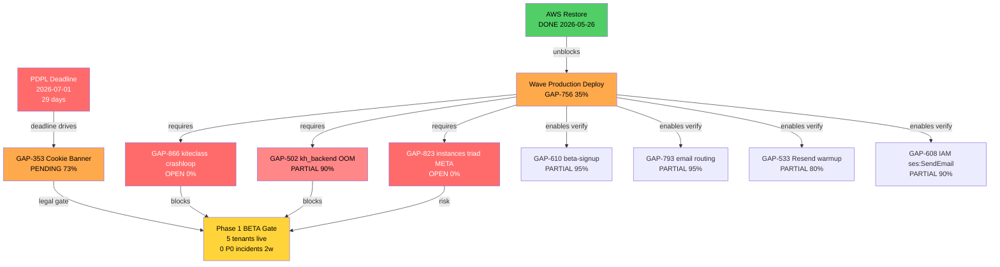
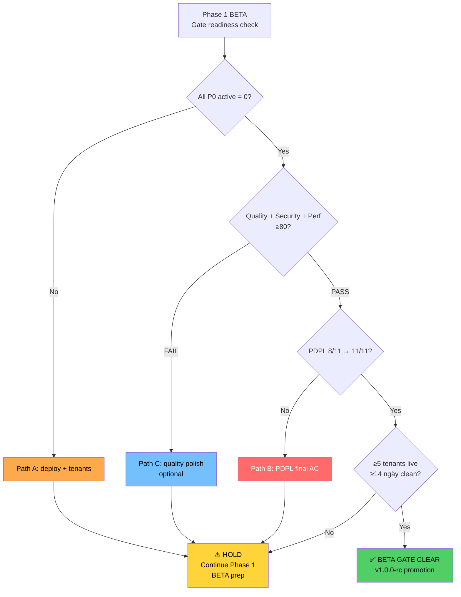

# Pre-launch Readiness Consolidation — Phase 1 BETA gate blockers

**Mục đích:** Single canonical reference document consolidating tất cả blockers chặn Phase 1 BETA launch. Eliminate scattering across 4+ tracking surfaces (CLAUDE.md / release-1-plan / GAP-612 file / ROADMAP §Pending). Aggregation layer — KHÔNG thay thế canonical sources cho từng blocker (gap-status.csv vẫn canonical cho status; audits-index.csv vẫn canonical cho score).

**State-check date:** 2026-06-02 (per `audit-to-gap-pipeline.md` §2.8 — empirical verify thay vì trust gap claim 2026-05-18).

---

## §1 Phase 1 BETA gate criteria

Per `release-1-plan-2026.md` §3 Phase 1 detailed scope + `output-review-mandate.md` §3 review standards matrix + `release-deploy-standard.md` §3.4 MAJOR-release gates.

| Tiêu chí | Ngưỡng | Trạng thái hiện tại | Canonical source |
|---|---|---|---|
| **Quality audit score** | ≥80/100 | ✅ **90/110 B+** (PASS +10 buffer) | `audits-index.csv` Wave 98 |
| **Beta tenants live** | ≥5 tenants | 🔵 0 — chờ unblock GAP-866 + GAP-822 production deploy | gap-status.csv |
| **P0 incidents (2 tuần)** | 0 | 🟢 0 incidents production (account suspended state) | CloudWatch / GAP-612 timeline |
| **Security baseline** | ≥85/100 (PROD MAJOR) | ✅ **93/100 A** (v2 audit format) | `audits-index.csv` Wave 94c |
| **Performance baseline** | ≥80/100 | ✅ **86/100 B+** | `audits-index.csv` Wave 85 |
| **Ops readiness** | ≥80/100 (target) | ⚠️ **77/100 C+** (3 P0 carry) | `audits-index.csv` Wave 94c |
| **API contract** | ≥80/100 | ⚠️ **76/100 C FAIL** | `audits-index.csv` Wave 98 |
| **Business logic** | ≥80/100 | ⚠️ **73/100 C+ PARTIAL FAIL Cat 1** | `audits-index.csv` Wave 98 |
| **PDPL compliance** | Cookie + Consent + Privacy + ToS + DPA shipped | ⚠️ **8/11 AC** (GAP-353 PENDING 73%) | gap-status.csv |
| **DNS + email + seed + invite** | Production-ready | ✅ **DONE** (GAP-369/370/372/376) | gap-status.csv |

**Tổng kết:** 5/10 gates PASS, 4 gates PARTIAL (ops/api/business/PDPL), 1 gate BLOCKED (beta tenants — needs production deploy).

---

## §2 Blocker catalog — 4 categories

State-check 2026-06-02 empirical (per `audit-to-gap-pipeline.md` §2.8 step 0 canonical CSV lookup). **24 active P0 blockers** trong phase-1-beta (KHÔNG phải 27 như GAP-622 đã filed 2026-05-18 — drift đã correct: GAP-612 closed 2026-05-26 + 2 gap khác flipped DONE post-filing).

### §2.1 PDPL legal blockers (1 cluster — deadline-driven)

| Gap | Status | % | Deadline | Risk class |
|---|---|---|---|---|
| **GAP-353** PDPL Cookie/Consent Banner | PENDING | 73% | **2026-07-01** (29 ngày) | 🔴 LEGAL — VN PDPL 2023 compliance mandate |
| GAP-353b server consent API + audit log | PARTIAL | 85% | Phase 2 trigger | 🟧 sister gap (Counsel formal review queued) |
| GAP-353b-followup multi-device + audit chain | PENDING | 0% | Phase 2 | 🟨 P2 deepening |

**Cluster status:** PARTIAL FAIL — 8/11 AC met (banner + immutable schema + RLS + hash chain + consent recording shipped Wave br-4 PR #1782 / Wave beta-prep-1 PR #1874 / fix #1939). 3 deepening items defer Phase 2 (counsel review + multi-device + audit chain).

**Unblock path:** 3 AC residual (FE deep-link render verify + cross-locale i18n + telemetry SDK trigger order) — gated GAP-612 AWS restore (production environment cần để live verify). Per `release-1-plan-2026.md` §1.7 risk tolerance Moderate "v1 pending counsel review" disclaimer OK cho non-K-12 personas.

### §2.2 AWS infrastructure blockers (RESOLVED 2026-05-26)

| Gap | Status | Notes |
|---|---|---|
| ~~GAP-612 AWS account suspension~~ | ✅ **DONE 2026-05-26** | Wave aws-restore-1 SHIPPED — account verified, EC2 restarted, RDS restored, ALB eliminated permanently |
| GAP-693 AWS rebuild SOP playbook | PARTIAL | 70% (13 steps + 5 gates documented; concrete drill defer) |
| GAP-756 Wave beta-prep-1 production deploy + RST verify | PARTIAL | 35% (Phase β follow-up — ECR push + tag + SSM deploy) |

**Status:** AWS infra UNBLOCKED. Account active, production stack reachable (`api.kitehub.me/actuator/health` 200 from outside). 13 cascade gaps đã unblock during Wave rst-cascade-1. Residual: Wave production deploy pipeline (GAP-756).

### §2.3 Phase 1 BETA feature P0 active (24 blockers)

Per `gap-status.csv` state-check 2026-06-02:

| ID | Status | % | Title | Category |
|---|---|---|---|---|
| GAP-117 | PARTIAL | 30% | Backup Restore Drill Automation | Ops |
| GAP-223 | PARTIAL | 50% | AI Branding Migration Verification Governance | Mixed |
| GAP-286 | OPEN | 0% | Mobile OTP signup via Zalo/SMS | Frontend |
| GAP-297 | OPEN | 0% | Batch Monthly Invoice Generation UX + Auto-Send | Frontend |
| GAP-353 | PENDING | 73% | PDPL 2023 Cookie / Consent Banner | Compliance |
| GAP-502 | PARTIAL | 90% | kh_backend production thrashing (RabbitMQ + OOM) | DevOps |
| GAP-530 | PARTIAL | 10% | Email-driven flow end-to-end live verify | Mixed |
| GAP-533 | PARTIAL | 80% | Resend deliverability warm-up DKIM/DMARC/SPF | DevOps |
| GAP-566 | PARTIAL | 60% | Wave 82 t3.small RAM tuning + memory alarm | DevOps |
| GAP-567 | PARTIAL | 55% | Wave 82 Certbot DNS-01 + 30d expiry monitor | DevOps |
| GAP-572 | PARTIAL | 75% | Resend secret schema mismatch + key rotate | DevOps |
| GAP-608 | PARTIAL | 90% | EC2 IAM role ses:SendEmail permission | DevOps |
| GAP-610 | PARTIAL | 95% | GET beta-signup validate H4 lifecycle-collapse | Mixed |
| GAP-622 | OPEN | 0% | Pre-launch consolidation (this gap) | Meta |
| GAP-648 | PARTIAL | 10% | Thesis NFR data capture (load + dashboards + cost) | Mixed |
| GAP-656 | PARTIAL | 80% | UI Coordinator widget collision + first-login reveal | Frontend |
| GAP-693 | PARTIAL | 70% | AWS rebuild SOP playbook 13 steps | DevOps |
| GAP-730 | OPEN | 0% | Idempotency POST narrow signup+enrollment+beta-request | Backend |
| GAP-756 | PARTIAL | 35% | Wave beta-prep-1 production deploy + RST verify | DevOps |
| GAP-788 | OPEN | 0% | META Wave 80+ retro-walk batch | Meta |
| GAP-793 | PARTIAL | 95% | Production email-provider routing — Resend branch | Backend |
| GAP-814 | PARTIAL | 75% | Host-spoofing X-Tenant-Id gateway strip | Mixed |
| GAP-823 | OPEN | 0% | instances table triad drift (META P0) | Meta |
| GAP-866 | OPEN | 0% | kiteclass-core crashloop RabbitAdmin bean | Backend |

**Distribution by completion:**
- 95-100%: 2 (GAP-610, GAP-793) — final 5% gated AWS deploy
- 70-90%: 9 — substantive work pending
- 30-60%: 5 — mid-implementation
- 0-10%: 8 — not yet started

**Distribution by domain:** DevOps 9, Mixed 5, Frontend 4, Backend 3, Meta 3, Compliance 0 (covered separately §2.1).

### §2.4 External dependencies (vendor/legal blockers)

| Dependency | Status | Blocker scope | Mitigation |
|---|---|---|---|
| **Legal counsel review** | Not engaged | PDPL formal review (K-12 path Phase 3) | Phase 1 BETA risk tolerance Moderate "v1 pending counsel" disclaimer per `release-1-plan-2026.md` §1.7 |
| **Resend deliverability** | Manual provisioning | GAP-533 warm-up + DKIM/DMARC/SPF + spam-score | DONE provisioning (GAP-513); warm-up in progress |
| **Cloudflare DNS** | UP | apex + api subdomain | DONE (GAP-369) |
| **AWS Activate Founder** | Approved 2026-05-09 | Free compute Phase 1 BETA ~10 months | DONE (kitehub.me Path C) |
| **MISA MeInvoice partnership** | Defer Phase 1.5 | VAT eInvoice (paid tier) | Phase 2 trigger |
| **PSP integration** (VNPay/MoMo) | Cancel Phase 1.5 | License barriers | Manual SOP per GAP-183 |

---

## §3 Dependency graph

**Critical path:** AWS DONE → Wave production deploy (GAP-756) → {GAP-866 crashloop fix + GAP-502 OOM fix} → 5 tenants live → BETA gate clear. Parallel branch: PDPL GAP-353 final 3 AC verify (gated AWS deploy đã unblock).

---

## §4 Estimated unblock paths

### Path A — Critical sequencing (production deploy → tenants live)

| Bước | Estimated effort | Owner | Dependencies |
|---|---|---|---|
| 1. GAP-866 kiteclass-core RabbitAdmin bean fix | ~2-3h | Backend | None (local-doable per current campaign) |
| 2. GAP-502 kh_backend OOM root cause + fix | ~3-4h | DevOps | RabbitMQ auth verify post-AWS-restore |
| 3. GAP-756 production deploy pipeline | ~1.5-2h | DevOps | GAP-866 + GAP-502 fixed; ECR push + tag + SSM |
| 4. Live verify cluster (GAP-610/793/533/608) | ~2-3h | Mixed | GAP-756 deploy complete |
| 5. Beta tenant onboarding (5 tenants) | ~1-2 ngày | Mixed | Live verify PASS; invite mechanism GAP-372 DONE |
| 6. 2-week P0 incident-free observation | 14 ngày | All | Tenant operations + CloudWatch monitoring |

**Total critical path:** ~7-10h engineering + 14 ngày observation = **~3 tuần wall-clock** to BETA gate clear.

### Path B — PDPL deadline (parallel)

| Bước | Effort | Owner | Deadline |
|---|---|---|---|
| 1. Counsel engagement (informal pre-review) | 1-2 ngày | Legal contact | T-29 (2026-07-01) |
| 2. GAP-353 final 3 AC verify post-deploy | ~2-3h | Compliance | T-25 |
| 3. PDPL pre-launch checklist v1 sign-off | 1 ngày | Compliance | T-20 |
| 4. Cookie banner i18n + multi-device QA | ~3-4h | Frontend | T-15 |

**Critical date:** **2026-07-01** PDPL 2023 hard deadline. Buffer hiện tại 29 ngày — sufficient nếu Path B start NGAY trong Wave local-doable-8/9.

### Path C — Quality gates uplift (non-critical for BETA gate ≥80 but recommended)

| Gate | Hiện tại | Target | Effort | Owner |
|---|---|---|---|---|
| API contract 76 → 82 | C FAIL | ≥80 | ~3-4h cluster (GAP-662/663/664) | Backend |
| Business logic 73 → 80 | C+ PARTIAL | ≥80 | ~2-3h (GAP-664/666) | Backend |
| Ops readiness 77 → 80 | C+ | ≥80 | ~4-5h (GAP-257 restore drill + GAP-144 AlertManager) | DevOps |

**Note:** Quality 90/110 B+ already PASS BETA gate. Path C uplift = "polish" cho v1.0.0 RC promotion (PROD MAJOR ≥85 buffer).

---

## §5 Cross-link tới canonical sources

**Status truth:**
- `documents/04-quality/gaps/gap-status.csv` — canonical status/priority/phase/completion_pct per `gap-architecture-v2.md` §3
- `documents/04-quality/audits/audits-index.csv` — canonical audit scores per `output-review-mandate.md` §3
- `documents/04-quality/gaps/ROADMAP.md §🎯` — current narrative status snapshot

**Decision context:**
- `CLAUDE.md §CURRENT PHASE` — Phase progression triggers locked 2026-05-06
- `documents/03-planning/roadmap/release-1-plan-2026.md` — Release Lần 1 plan §3 Phase 1 + §1.7 deadlines
- `feedback_release_1_first_session_priority.md` (memory) — auto-loaded session start

**Refresh cadence:**
- Per `post-wave-audit-mandate.md` §2.2 — audit suite refresh ≤3 days post each wave merge
- This document = snapshot 2026-06-02; refresh khi blocker state changes (DONE flip / new P0 filed / gate score delta ≥5)
- Re-aggregate aaa minimum weekly during Phase 1 BETA preparation phase

---

## §6 Decision tree — critical path triggers

**Decision rules:**
- Nếu PDPL countdown <14 ngày (2026-06-17 trở đi) + GAP-353 chưa 11/11 → Path B promoted P0 over Path A
- Nếu AWS account re-suspended → halt all paths, escalate AWS account recovery first
- Nếu beta tenant churn ≥2/5 trong observation window → re-evaluate gate criteria; possible HOLD extension

---

## §7 Cadence + ownership

| Activity | Cadence | Owner | Output |
|---|---|---|---|
| Refresh this document | Weekly OR on blocker state change | Coordinator | Updated §2 catalog + §3 dep graph |
| Audit suite refresh | ≤3 days post wave merge per `post-wave-audit-mandate.md` §2.2 | Coordinator + audit agents | `audits-index.csv` + matrix rows |
| Gap status sync | Per `post-merge-sync-completeness.md` 4-target framework | Per PR | `gap-status.csv` + ROADMAP §🎯 + handoff + wave-history |
| Critical path standup | Each session start during Phase 1 BETA prep | User + Claude | Decision tree §6 evaluated |

---

## §8 Log

- **2026-06-02:** Document created closing GAP-622. State-check empirical (gap-status.csv + audits-index.csv + ROADMAP §🎯) — corrects GAP-622 filed claim "27 P0" to **24 active P0** (GAP-612 closed 2026-05-26 + 2 others flipped DONE post-filing). PDPL countdown updated 7 weeks → 29 days. AWS GAP-612 cluster status: RESOLVED (was CATASTROPHIC risk class at filing). Phase 1 BETA gate score: Quality 90/110 PASS (was target ≥80). Critical path identified: production deploy via GAP-756 cluster.
