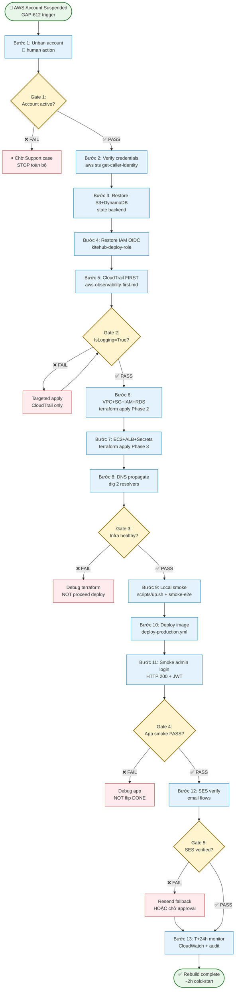
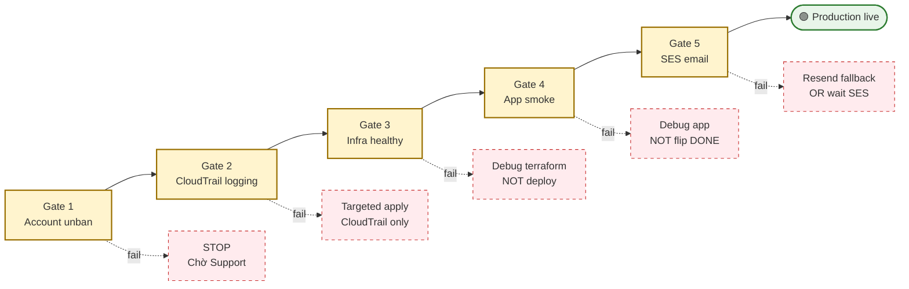
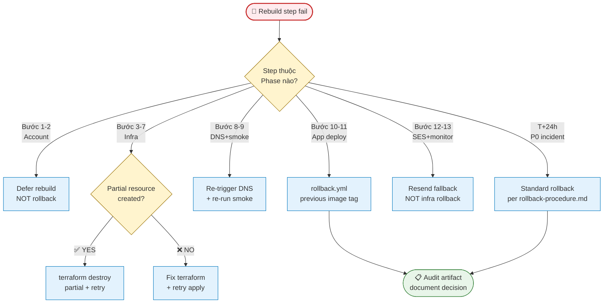

# AWS Account Rebuild SOP — Fast Restoration Playbook

> 📅 Tạo: **2026-05-22** · Áp dụng cho: **AWS account 906286017800 (ap-southeast-1)** · Audience: **dev** · Đọc khoảng **25 phút**

## Phạm vi

Tài liệu này mô tả quy trình khôi phục KiteHub Phase 1 BETA trên AWS account `906286017800` sau sự cố tạm ngừng tài khoản (account suspension). Lý do gốc: GAP-612 — AWS account tạm ngừng từ 2026-05-17, support case 177903869600100.

**Đối tượng áp dụng:**
- Dev thực hiện khôi phục sau suspension
- Reviewer kiểm tra state trước khi apply production infra
- SRE on-call ghi nhận incident postmortem

**Prerequisites:**
- Quyền truy cập AWS Console root hoặc admin IAM trên account `906286017800`
- AWS CLI profile `dev-admin` configured với đủ quyền
- Terraform ≥ 1.x installed locally (fallback khi OIDC chưa kịp restore)
- `git clone` repo với nhánh `main` mới nhất
- Cloudflare API token cho zone `kitehub.me`
- GitHub CLI (`gh`) authenticated với repo `nguyenvankiet/2026-Kite-Class-Platform`

---

## Kiến trúc tham chiếu

**KiteHub Phase 1 BETA — AWS Singapore `ap-southeast-1`:**

| Component | Spec | Ghi chú |
|---|---|---|
| EC2 `kitehub-kh-backend` | t4g.small ARM | Tag `Name=kitehub-kh-backend` |
| EC2 `kitehub-kc-app` | t4g.small ARM | Tag `Name=kitehub-kc-app` |
| RDS PostgreSQL | db.t3.micro | Managed postgres |
| ALB | Application Load Balancer | Layer 7 routing |
| Secrets Manager | Prefix `kitehub/production/*` | ⚠️ KHÔNG dùng `kite/prod/*` |
| ECR | `906286017800.dkr.ecr.ap-southeast-1.amazonaws.com` | Docker image registry |
| CloudTrail | Trail name `kitehub-main` | Bắt buộc trước infra apply |
| S3 + DynamoDB | Terraform state backend | `kitehub-terraform-state` |
| OIDC IAM Role | `kitehub-deploy-role` | GitHub Actions deploy |

**Terraform source:** `infrastructure/terraform-aws/`
**DNS:** Cloudflare → EC2 IP (apex `kitehub.me` + subdomains)

---

## Sơ đồ tổng quan quy trình

Quy trình 13 bước theo thứ tự sequential với 5 gate kiểm tra bắt buộc — KHÔNG cho phép skip gate:



**Time-box mục tiêu:** ~2h cold-start (loại trừ T+24h monitoring). Account unban (Bước 1) phụ thuộc Support response time — KHÔNG nằm trong time-box.

---

## Quy trình 13 bước khôi phục

### Bước 1: Unban AWS account (human action)

**Thực hiện bởi:** Developer/Admin — KHÔNG phải agent

1. Truy cập AWS Support Console với root account credentials
2. Kiểm tra support case **177903869600100** — xem trạng thái giải quyết
3. Nếu case chưa resolved: reply cung cấp thêm billing info hoặc identity verification
4. Đợi AWS team khôi phục account — thời gian thường 24-72 giờ sau khi case resolved
5. Verify bằng lệnh read-only sau khi unban (Tier 1 per `agent-aws-access.md` §2.1):
   ```bash
   aws sts get-caller-identity --profile dev-admin
   # Expected: trả về AccountId, UserId, Arn
   ```

**Gate 1:** Account unban. `aws sts get-caller-identity` trả về kết quả hợp lệ → proceed.

**Failure mode nếu chưa unban:** Mọi bước sau đều fail. STOP tại đây cho đến khi Support case resolved.

---

### Bước 2: Xác minh identity và console access

1. Login AWS Console với dev-admin credentials
2. Verify account ID = `906286017800`
3. Kiểm tra region là `ap-southeast-1` (Singapore)
4. Xác nhận IAM permissions còn nguyên vẹn:
   ```bash
   aws iam get-user --profile dev-admin
   aws iam list-attached-user-policies --user-name <admin-user> --profile dev-admin
   ```
5. Kiểm tra S3 terraform state bucket tồn tại:
   ```bash
   aws s3 ls s3://kitehub-terraform-state --profile dev-admin
   # Expected: list files trong bucket (terraform.tfstate hoặc các state files)
   ```
6. Ghi lại audit artifact vào `documents/04-quality/audits/aws-verification/YYYY-MM-DD-account-restore-step2.md` per `pre-mutation-state-check.md` §3.

---

### Bước 3: Xác minh Terraform state backend

1. Kiểm tra S3 bucket state backend:
   ```bash
   aws s3 ls s3://kitehub-terraform-state/ --profile dev-admin
   aws s3 ls s3://kitehub-terraform-state/env:/                 # workspace listing
   ```
2. Kiểm tra DynamoDB lock table:
   ```bash
   aws dynamodb describe-table \
     --table-name kitehub-terraform-lock \
     --profile dev-admin \
     --query 'Table.TableStatus'
   # Expected: "ACTIVE"
   ```
3. Nếu lock table có stale lock từ session trước (suspended giữa chừng):
   ```bash
   # HUMAN ACTION — xóa stale lock (không có pending apply)
   aws dynamodb delete-item \
     --table-name kitehub-terraform-lock \
     --key '{"LockID": {"S": "kitehub-terraform-state/terraform.tfstate"}}' \
     --profile dev-admin
   ```
4. Chạy `terraform init` để xác nhận backend connect:
   ```bash
   cd infrastructure/terraform-aws
   terraform init -backend-config=backend.hcl
   ```

---

### Bước 4: Xác minh OIDC IAM role

1. Kiểm tra OIDC provider tồn tại:
   ```bash
   aws iam list-open-id-connect-providers --profile dev-admin
   # Expected: có entry cho token.actions.githubusercontent.com
   ```
2. Kiểm tra `kitehub-deploy-role` tồn tại và trust policy đúng:
   ```bash
   aws iam get-role \
     --role-name kitehub-deploy-role \
     --profile dev-admin \
     --query 'Role.AssumeRolePolicyDocument'
   ```
3. Kiểm tra attached policies:
   ```bash
   aws iam list-attached-role-policies \
     --role-name kitehub-deploy-role \
     --profile dev-admin
   ```
4. Nếu role bị xóa hoặc OIDC provider bị xóa trong quá trình suspension:
   - Chạy Phase 2.2 terraform apply để recreate OIDC + deploy role (tham khảo `terraform-apply-bootstrap-runbook.md`)
   - Đây là **one-time bootstrap** per `release-deploy-standard.md` §9 — dùng local `terraform apply` với admin key, rotate key sau khi xong

---

### Bước 5: Apply CloudTrail TRƯỚC production infra (MANDATORY)

> ⚠️ **CRITICAL:** CloudTrail PHẢI `IsLogging=true` TRƯỚC khi apply bất kỳ production infra nào (Bước 6). Đây là hard requirement per `aws-observability-first.md` §2.

**Kiểm tra CloudTrail hiện tại:**
```bash
aws cloudtrail describe-trails \
  --include-shadow-trails false \
  --profile dev-admin \
  --query 'trailList[*].{Name:Name,IsMultiRegionTrail:IsMultiRegionTrail}'

aws cloudtrail get-trail-status \
  --name kitehub-main \
  --profile dev-admin \
  --query 'IsLogging'
# Expected: True
```

**Nếu CloudTrail không logging hoặc không tồn tại:**

1. Targeted apply ONLY CloudTrail resources (không apply EC2/RDS/ALB):
   ```bash
   cd infrastructure/terraform-aws
   terraform plan \
     -target=aws_cloudtrail.main \
     -target=aws_s3_bucket.cloudtrail_logs \
     -target=aws_s3_bucket_policy.cloudtrail_logs \
     -target=aws_s3_bucket_public_access_block.cloudtrail_logs \
     -target=aws_s3_bucket_versioning.cloudtrail_logs \
     -target=aws_s3_bucket_server_side_encryption_configuration.cloudtrail_logs
   # Review plan output carefully per pre-mutation-state-check.md §3
   ```
2. Apply sau khi plan verified (human-triggered per `release-deploy-standard.md` §9):
   ```bash
   # Via GitHub Actions workflow_dispatch (preferred):
   gh workflow run terraform-apply.yml \
     -f dry_run=false \
     -f target=<cloudtrail-targets>

   # HOẶC local admin apply (bootstrap exception):
   terraform apply -target=aws_cloudtrail.main -target=...
   ```
3. Verify lại sau apply:
   ```bash
   aws cloudtrail get-trail-status --name kitehub-main \
     --profile dev-admin --query 'IsLogging'
   # PHẢI trả về: True
   ```

**Gate 2:** CloudTrail `IsLogging = True` xác nhận. KHÔNG proceed đến Bước 6 nếu gate chưa pass.

---

### Bước 6: Apply production infra (EC2 + RDS + ALB + Secrets + ECR)

> ⚠️ **KHÔNG chạy Step 6 và Step 9 concurrently** — vi phạm `concurrent-production-mutation-ops.md` §1.

**Pre-apply audit mandatory per `pre-mutation-state-check.md` §3:**

1. Chạy `terraform plan` trước để xem diff:
   ```bash
   cd infrastructure/terraform-aws
   terraform plan -out=tfplan.binary 2>&1 | tee /tmp/tfplan.txt
   grep -E "must be replaced|will be created|will be destroyed|will be updated" /tmp/tfplan.txt
   ```
2. Ghi lại audit artifact: `documents/04-quality/audits/aws-verification/YYYY-MM-DD-rebuild-pre-apply-plan.md`
   - Liệt kê real changes vs phantom changes
   - Xác nhận resources dự kiến tạo lại đúng ý định
   - Kiểm tra KHÔNG có unexpected destroy cho data volumes (RDS)
3. Reconcile plan với dự kiến per `pre-mutation-state-check.md` §3.5

**Apply production infra (human-triggered per `release-deploy-standard.md` §9):**
```bash
# Via GitHub Actions workflow_dispatch:
gh workflow run terraform-apply.yml \
  -f dry_run=false \
  -f confirm=APPLY

# Monitor run:
gh run watch <run-id>
```

**Verify sau apply:**
```bash
# Kiểm tra EC2 instances (lookup theo tag)
aws ec2 describe-instances \
  --filters "Name=tag:Name,Values=kitehub-kh-backend,kitehub-kc-app" \
  --profile dev-admin \
  --query 'Reservations[].Instances[].{Name:Tags[?Key==`Name`].Value|[0],State:State.Name,InstanceId:InstanceId}'
# Expected: cả 2 instance State = "running"

# Kiểm tra RDS
aws rds describe-db-instances \
  --profile dev-admin \
  --query 'DBInstances[].{DBInstanceIdentifier:DBInstanceIdentifier,DBInstanceStatus:DBInstanceStatus}'
# Expected: DBInstanceStatus = "available"

# Kiểm tra ALB
aws elbv2 describe-load-balancers \
  --profile dev-admin \
  --query 'LoadBalancers[?contains(LoadBalancerName,`kitehub`)].{Name:LoadBalancerName,State:State.Code}'
# Expected: State = "active"
```

**Gate 3:** EC2 running + RDS available + ALB active xác nhận.

---

### Bước 7: Populate secrets vào Secrets Manager

> ⚠️ **Prefix PHẢI là `kitehub/production/*`** — KHÔNG dùng `kite/prod/*` (Wave 64 lesson — IAM policy mismatch gây deploy fail)

**Danh sách secrets cần populate:**
```
kitehub/production/jwt-signing-key
kitehub/production/database-url
kitehub/production/database-username
kitehub/production/database-password
kitehub/production/redis-url
kitehub/production/rabbitmq-url
kitehub/production/minio-access-key
kitehub/production/minio-secret-key
kitehub/production/resend-api-key
kitehub/production/ses-smtp-username
kitehub/production/ses-smtp-password
```

**Tham khảo chi tiết:** `documents/05-guides/deploy/secrets-seeding-runbook.md` + `documents/05-guides/deploy/secrets-populate-phase-2-4.md`

**Human action (agent không tự populate — Tier 3 banned per `agent-aws-access.md`):**
```bash
# Ví dụ cú pháp populate một secret:
aws secretsmanager put-secret-value \
  --secret-id kitehub/production/jwt-signing-key \
  --secret-string "<value>" \
  --profile dev-admin
```

**Verify sau populate:**
```bash
# List secrets với prefix đúng (Tier 2 always-confirm per agent-aws-access.md)
aws secretsmanager list-secrets \
  --filter Key=name,Values=kitehub/production \
  --profile dev-admin \
  --query 'SecretList[*].{Name:Name,LastChangedDate:LastChangedDate}'
```

---

### Bước 8: Re-push Docker images lên ECR

**Login ECR:**
```bash
aws ecr get-login-password \
  --region ap-southeast-1 \
  --profile dev-admin \
  | docker login \
    --username AWS \
    --password-stdin \
    906286017800.dkr.ecr.ap-southeast-1.amazonaws.com
```

**Build và push images (dùng project scripts — KHÔNG chạy Docker trực tiếp):**
```bash
# Từ kitehub/ directory:
bash kitehub/scripts/build-all.sh
# Sau đó push từng image hoặc dùng CI workflow:
gh workflow run docker-build-push.yml
```

**Verify images available:**
```bash
aws ecr list-images \
  --repository-name kitehub/kitehub-platform \
  --profile dev-admin \
  --query 'imageIds[*].imageTag' | head -5
```

---

### Bước 9: Deploy ứng dụng lên EC2 (SSM SendCommand)

> ⚠️ **PHẢI đợi Bước 6 (terraform apply) hoàn toàn XONG và EC2 ở trạng thái running** trước khi trigger deploy. KHÔNG chạy concurrent với bất kỳ terraform operation nào — vi phạm `concurrent-production-mutation-ops.md` §3.1.

**Kiểm tra trạng thái EC2 trước khi trigger deploy:**
```bash
aws ec2 describe-instances \
  --filters "Name=tag:Name,Values=kitehub-kh-backend,kitehub-kc-app" \
  --profile dev-admin \
  --query 'Reservations[].Instances[].State.Name'
# PHẢI là: ["running", "running"]
```

**Trigger deploy (human-triggered workflow per `release-deploy-standard.md` §9):**
```bash
gh workflow run deploy-production.yml \
  -f environment=production \
  -f image_tag=<latest-tag>

# Monitor:
gh run watch <run-id>
```

**Verify SSM command thực sự succeeded (không chỉ tin vào workflow poll):**
```bash
# Lấy command ID từ run logs
aws ssm get-command-invocation \
  --command-id <ssm-command-id> \
  --instance-id <ec2-instance-id> \
  --profile dev-admin \
  --query '{StatusDetails:StatusDetails,ResponseCode:ResponseCode}'
# Expected: StatusDetails = "Success", ResponseCode = 0
```

---

### Bước 10: Verify DNS (Cloudflare → EC2 IP)

1. Lấy Public IP của EC2 instances sau khi rebuild:
   ```bash
   aws ec2 describe-instances \
     --filters "Name=tag:Name,Values=kitehub-kh-backend,kitehub-kc-app" \
     --profile dev-admin \
     --query 'Reservations[].Instances[].{Name:Tags[?Key==`Name`].Value|[0],PublicIP:PublicIpAddress}'
   ```
2. Kiểm tra DNS hiện tại:
   ```bash
   dig +short kitehub.me A
   dig +short api.kitehub.me A
   ```
3. Nếu DNS chưa trỏ về IP mới → cập nhật Cloudflare DNS records:
   - Truy cập Cloudflare Dashboard → zone `kitehub.me`
   - Cập nhật A records cho apex `kitehub.me` và subdomain `api.kitehub.me`
   - Hoặc dùng Cloudflare API (PATCH `/zones/{zone_id}/dns_records/{record_id}`)
4. Đợi propagation (TTL thường 1-5 phút với Cloudflare):
   ```bash
   # Poll đến khi DNS trả về IP mới
   watch -n 10 "dig +short kitehub.me A"
   ```

---

### Bước 11: Smoke test và admin login verification

**Health check toàn bộ services:**
```bash
# Kiểm tra ALB health
curl -sI https://kitehub.me/actuator/health
curl -sI https://api.kitehub.me/actuator/health

# Kiểm tra từng service
curl -s https://api.kitehub.me/actuator/health | jq .status
```

**Admin login smoke test (mandatory per `release-deploy-standard.md` §3.1):**
```bash
# POST /api/auth/login với admin credentials
curl -sX POST https://api.kitehub.me/api/auth/login \
  -H "Content-Type: application/json" \
  -d '{"email":"admin@kitehub.me","password":"<admin-password>"}' \
  | jq '{status: .status, hasToken: (.token != null)}'
# Expected: status = "SUCCESS", hasToken = true
```

**Run smoke test script:**
```bash
bash scripts/smoke-test.sh --env production
# Expected: tất cả checks PASS
```

**Gate 4:** Tất cả health checks PASS + admin login HTTP 200 + JWT trong response.

---

### Bước 12: Xác nhận SES production access (email send)

**Kiểm tra SES sending status:**
```bash
aws ses get-account-sending-enabled \
  --region ap-southeast-1 \
  --profile dev-admin
# Expected: {"Enabled": true}
```

**Kiểm tra SES identity verification:**
```bash
aws ses list-identities \
  --region ap-southeast-1 \
  --profile dev-admin
aws ses get-identity-verification-attributes \
  --identities "kitehub.me" \
  --region ap-southeast-1 \
  --profile dev-admin
# Expected: VerificationStatus = "Success"
```

**Nếu SES vẫn trong sandbox:**
- Kiểm tra support case **177857212400418** (SES production access request)
- Nếu chưa approved: email đi ra ngoài sẽ bị block (chỉ gửi được cho verified recipients)
- Workaround Phase 1 BETA: dùng Resend API thay cho SES direct (tham khảo `email-ses-setup-runbook.md`)

**Gate 5:** SES `Enabled = true` + identities verified. Email flows hoạt động.

---

### Bước 13: Post-restore audit — verify các gaps bị block bởi GAP-612

1. Ghi lại hoàn thành restore vào audit artifact:
   ```
   documents/04-quality/audits/aws-verification/YYYY-MM-DD-post-restore-verification.md
   ```
2. Kiểm tra danh sách gaps bị block bởi GAP-612 trong `gap-status.csv`
3. Verify các gaps đó có thể tiến hành:
   - GAP liên quan đến live AWS (smoke tests, deployment verification)
   - GAP liên quan đến email delivery
   - GAP liên quan đến EC2 self-test
4. Update ROADMAP §🎯 Current Status Snapshot với kết quả restore
5. Ghi nhận TTR (Time-to-Recovery) từ suspension đến restore hoàn chỉnh

---

## Bảng 5 gates



| Gate | Điều kiện pass | Bước kiểm tra | Hậu quả nếu fail | Escape ramp |
|---|---|---|---|---|
| **Gate 1: Account unban** | `aws sts get-caller-identity` trả về AccountId hợp lệ | Bước 1-2 | STOP toàn bộ quy trình; chờ Support case | Reply Support case với additional billing/identity info; không proceed Bước 3 |
| **Gate 2: CloudTrail logging** | `aws cloudtrail get-trail-status --name {{cloudtrail_name}}` → `IsLogging = True` | Bước 5 | KHÔNG proceed Bước 6; apply CloudTrail targeted apply trước | `terraform apply -target=aws_cloudtrail.main` per `aws-observability-first.md` §2 |
| **Gate 3: Infrastructure healthy** | EC2 `running` + RDS `available` + ALB `active` | Bước 6 verify | KHÔNG proceed Bước 9 deploy; debug terraform apply | Re-run `terraform plan` + audit artifact per `pre-mutation-state-check.md` §3.5; fix root cause |
| **Gate 4: Application smoke** | All health checks PASS + admin login HTTP 200 + JWT | Bước 11 | Debug ứng dụng; không flip gaps DONE | Re-deploy với CloudWatch streaming per `release-fix-retry-budget.md` §5 tooling-fix |
| **Gate 5: Email flows** | SES `Enabled = true` + identities `verified` | Bước 12 | Email features không hoạt động; dùng Resend fallback hoặc đợi SES approval | Switch `MAIL_PROVIDER=resend` env var temporarily; track SES approval support case |

---

## Bảng 8 failure modes và biện pháp phòng tránh

| # | Failure mode | Dấu hiệu nhận biết | Biện pháp phòng tránh | Tham chiếu |
|---|---|---|---|---|
| 1 | **AWS account vẫn suspended** | `aws sts get-caller-identity` trả về `AccessDenied` | Không thực hiện Bước 2-13 cho đến khi Gate 1 pass | `aws-observability-first.md` §6 |
| 2 | **Terraform state drift** | Plan hiển thị unexpected destroy/create | Chạy `terraform plan` và audit artifact trước apply; check `terraform state list` để verify real vs phantom | `pre-mutation-state-check.md` §3.5 |
| 3 | **CloudTrail không logging trước production apply** | Production infra API calls không captured trong trail | Luôn verify `IsLogging = True` trước Bước 6; targeted apply CloudTrail nếu cần | `aws-observability-first.md` §2 |
| 4 | **Secrets prefix sai** | Deploy fail: `ResourceNotFoundException` hoặc IAM deny khi `secretsmanager:GetSecretValue` | Dùng prefix `kitehub/production/*` — KHÔNG bao giờ `kite/prod/*`; verify IAM policy Resource pattern match | `pre-mutation-state-check.md` §1.5 |
| 5 | **EC2 user_data + SSM concurrent** | SSM command fail với `exit status 143` (SIGTERM) | Đợi terraform apply hoàn toàn xong và EC2 `running` trước khi trigger deploy | `concurrent-production-mutation-ops.md` §3.1 |
| 6 | **IAM tag mismatch** | SSM SendCommand denied; IAM policy condition `aws:ResourceTag/Project=Kite` không match | Verify `default_tags { Project = "Kite" }` trong terraform + EC2 instance có tag `Project=Kite` đúng | `pre-mutation-state-check.md` §1.5 |
| 7 | **SES sandbox blocking email** | Welcome email / invoice email không đến inbox; SES logs show sandbox rejection | Verify support case 177857212400418 status; fallback sang Resend API trong Phase 1 BETA | `email-ses-setup-runbook.md` |
| 8 | **DNS propagation delay** | `dig +short kitehub.me` trả về IP cũ hoặc không có IP | Đợi Cloudflare TTL (1-5 phút); poll `dig +short` cho đến khi IP mới | `dns-setup-runbook.md` |

---

## Post-rebuild verification (T+0 đến T+24h)

Sau khi Gate 5 PASS, **KHÔNG flip GAP-612 → DONE ngay** — phải hoàn thành verification cycle T+24h để confirm production stability.

### T+0 (ngay sau Bước 13 init): smoke matrix

| Verification | Command / artifact | Expected | Reference |
|---|---|---|---|
| Admin login flow | curl POST `/api/auth/login` + browser walk per `pre-handoff-self-test-completeness.md` §2.4 | HTTP 200 + JWT + redirect `/admin` | `pre-handoff-self-test-completeness.md` |
| Tenant signup flow | curl POST `/api/auth/signup` + verify-email link click | HTTP 201 + DB row INSERTED + email arrived MailHog/Resend | `pre-handoff-self-test-completeness.md` §2.2 |
| Health probes | `/actuator/health` + `/api/status` từng service | HTTP 200 + `status=UP` | Bước 10 sequencing |
| CloudWatch dashboard | AWS Console dashboard `kitehub-platform-health` | Error rate <0.1% + P95 <500ms | `documents/05-guides/operations/cloudwatch-dashboards-runbook.md` |
| Outbox dispatcher | RabbitMQ admin UI + DB `outbox_events` table | Queue depth <100 + processed count tăng | `documents/05-guides/operations/outbox-dispatcher-runbook.md` |
| Audit log retention | `aws s3 ls s3://kitehub-audit-logs/` | Recent CloudTrail logs (≤5 phút lag) | `audit-log-retention-runbook.md` |

### T+1h: synthetic 5 user flows

Walk through per `feature-ship-runtime-walk-mandate.md` §3.2:
1. Persona Owner: signup → onboarding wizard → invite staff
2. Persona Teacher: accept invitation → password setup → login dashboard
3. Persona Parent: view child grade (P3 trigger)
4. Persona Student: submit assignment
5. Persona PLATFORM_ADMIN: approve beta request

### T+24h: ongoing monitor checkpoints

| Checkpoint | Trigger | Action |
|---|---|---|
| Hour 1, 4, 12, 24 | Manual self-check | Read CloudWatch dashboard; verify metrics within SLO |
| CloudWatch alarm fires | Auto SNS notification | Triage per `incident-response-runbook.md` |
| Error rate >0.5% sustained 15 min | Auto alert | Rollback decision per §Rollback procedure |
| P95 latency >2s sustained 15 min | Auto alert | Investigate slow query; rollback if untenable |

**DONE flip criteria GAP-612:**
- All Gate 1-5 PASS verified empirically (artifact references trong audit folder)
- T+24h monitor complete với zero P0/P1 incident
- Audit artifact `documents/04-quality/audits/aws-verification/YYYY-MM-DD-post-restore-verification.md` shipped với evidence cited per `pre-handoff-self-test-completeness.md` §6 reviewer-checklist

---

## Rollback procedure

> ⚠️ Rebuild scope = restore production stack từ scratch. **Rollback trong rebuild context KHÁC** rollback bình thường (per `rollback-procedure.md` workflow `rollback.yml`).
>
> Rebuild rollback = quay về incident state (account suspended OR partial-restored) khi rebuild đụng critical failure không thể continue.

### Khi nào trigger rollback rebuild

| Trigger | Decision |
|---|---|
| Bước 1-2: Account unban fail >7 days | KHÔNG rollback (chưa có infra) — defer rebuild; escalate Support case |
| Bước 3-4: State backend / IAM restore fail | Rollback = delete partial resources, retry từ Bước 3 (idempotent) |
| Bước 5-7: Terraform apply fail Phase 2 hoặc 3 | `terraform destroy -target=<resource>` cho partial; retry với fix |
| Bước 8-9: DNS / smoke fail | Re-trigger DNS (Cloudflare API); re-run smoke |
| Bước 10-11: App deploy / smoke fail | `rollback.yml` workflow_dispatch với previous image tag per `rollback-procedure.md` §3 |
| Bước 12-13: SES / monitor fail | Resend fallback (Gate 5 escape ramp); KHÔNG rollback infra |
| T+24h monitor: P0 incident | Standard rollback per `rollback-procedure.md` + `disaster-recovery-plan.md` |

### Rollback decision tree



### Rollback prerequisites

- Audit artifact MUST document decision: `documents/04-quality/audits/aws-verification/YYYY-MM-DD-rebuild-rollback-bước-N.md` với:
  - Step failed + symptom
  - Investigation per `release-fix-retry-budget.md` §3.5 (đọc empirical config/state)
  - Decision rationale (retry vs destroy vs defer)
  - Re-attempt schedule
- Reference `release-deploy-standard.md` §4.4 rollback contract
- Reference `disaster-recovery-plan.md` cho database PITR scope
- Reference `rollback.yml` workflow per `rollback-procedure.md` Phase 3 cho app-layer rollback

---

## Out-of-scope

Tài liệu này KHÔNG cover:
- **K8s / Helm deploy** — KiteHub Phase 1 BETA dùng EC2 self-host, không phải Kubernetes
- **Multi-region fail-over** — Phase 1 BETA single region `ap-southeast-1`
- **Database point-in-time restore** — xem `documents/05-guides/deploy/restore-procedure.md`
- **SSL certificate renewal** — xem `documents/05-guides/deploy/cloudflare-setup.md`
- **Resend provisioning** — xem `documents/05-guides/deploy/resend-provisioning-runbook.md`
- **KiteClass tenant infra** — tài liệu này chỉ cover KiteHub core platform

---

## Tham khảo

- **Rules áp dụng bắt buộc:**
  - [`aws-observability-first.md`](.claude/rules/aws-observability-first.md) — CloudTrail trước infra
  - [`agent-aws-access.md`](.claude/rules/agent-aws-access.md) — Tier 1/2/3 command classification
  - [`concurrent-production-mutation-ops.md`](.claude/rules/concurrent-production-mutation-ops.md) — serialize mutations
  - [`pre-mutation-state-check.md`](.claude/rules/pre-mutation-state-check.md) — audit artifact trước apply
  - [`release-deploy-standard.md`](.claude/rules/release-deploy-standard.md) §9 — human-triggered workflow_dispatch
- **Runbooks liên quan:**
  - [`terraform-apply-bootstrap-runbook.md`](./terraform-apply-bootstrap-runbook.md) — Phase 2.1/2.2 bootstrap
  - [`secrets-seeding-runbook.md`](./secrets-seeding-runbook.md) — populate Secrets Manager
  - [`secrets-populate-phase-2-4.md`](./secrets-populate-phase-2-4.md) — chi tiết secret values
  - [`dns-setup-runbook.md`](./dns-setup-runbook.md) — Cloudflare DNS
  - [`email-ses-setup-runbook.md`](./email-ses-setup-runbook.md) — SES domain verification
  - [`restore-procedure.md`](./restore-procedure.md) — DB point-in-time restore
  - [`rollback-procedure.md`](./rollback-procedure.md) — rollback deploy
- **Incident tracking:**
  - [`incident-response-runbook.md`](../operations/incident-response-runbook.md) — general incident response
  - **GAP-612:** AWS account suspension root cause + tracking
  - **GAP-693:** AWS rebuild SOP (tài liệu này)
  - **AWS Support cases:** 177903869600100 (suspension) + 177857212400418 (SES production)
- **Deployment strategy:** [`documents/02-architecture/deployment-strategy.md`](../../02-architecture/deployment-strategy.md)

---

## Trạng thái thực thi (GAP-693)

| Phase | Nội dung | Trạng thái |
|---|---|---|
| Phase 1 — SOP draft (Wave 103 Bucket F + Wave local-doable-9 Bucket D) | Tài liệu này: 13 bước + 5 gates + 8 failure modes + Mermaid flowchart tổng quan + Mermaid 5-gate decision tree + §Post-rebuild verification T+24h + §Rollback procedure decision tree | ✅ DONE 100% |
| Phase 2 — Commands verified (post-AWS-restore) | Chạy thực tế từng lệnh sau AWS restore; fill in real IDs/ARNs; validate gates bằng actual CLI output | ⏳ Defer post-GAP-612 unblock |
| Phase 3 — Automation script (Wave future) | `scripts/aws-rebuild-sop.sh --dry-run` auto-check gates | ⏳ Defer Wave future (post-Phase 2) |

**Lý do defer Phase 2/3:** AWS account `906286017800` vẫn suspended tại thời điểm Wave local-doable-9 ship (2026-06-02). Các lệnh AWS trong tài liệu này ở outline level với placeholder commands. Execution-validated commands sẽ được cập nhật sau khi account restore (per GAP-612 unblock). Automation script defer Wave sau khi Phase 2 confirm command set stable.

**Phase 1 DONE criteria met (Wave local-doable-9 Bucket D 2026-06-02):**
- ✅ Tài liệu §1-§9 complete (Phạm vi / Kiến trúc / Sơ đồ tổng quan / 13 bước / 5 gates / 8 failure modes / Post-rebuild verification / Rollback procedure / Out-of-scope / Tham khảo)
- ✅ Mermaid diagrams: 13-step flowchart + 5-gate decision tree + Rollback decision tree per `diagram-format-selection.md` §2 selection matrix
- ✅ Cross-refs verified exist: `aws-observability-first.md` + `agent-aws-access.md` + `concurrent-production-mutation-ops.md` + `release-deploy-standard.md` + `pre-mutation-state-check.md` + `terraform-apply-bootstrap-runbook.md` + `secrets-seeding-runbook.md` + `dns-setup-runbook.md` + `email-ses-setup-runbook.md` + `rollback-procedure.md` + `restore-procedure.md` + `incident-response-runbook.md` + `cloudwatch-dashboards-runbook.md`
- ✅ §Post-rebuild verification T+0 + T+1h + T+24h checkpoints documented
- ✅ §Rollback procedure standalone với decision tree (rebuild context KHÁC standard rollback per `rollback-procedure.md`)

---

## Log

- **2026-06-02 (v1.0.0):** GAP-693 Phase 1 DONE 100% — Wave local-doable-9 Bucket D closure. Extended SOP draft (v0.1.0 70%) → v1.0.0 100% Phase 1 với additions: (a) §Sơ đồ tổng quan quy trình — Mermaid flowchart 13 steps + 5 gates inline decision per `diagram-format-selection.md` §2; (b) §Bảng 5 gates — Mermaid sequential gate decision tree + extended table với escape ramp column; (c) §Post-rebuild verification — T+0 smoke matrix (6 verification items) + T+1h 5-persona synthetic walk + T+24h monitor checkpoints + DONE flip criteria GAP-612; (d) §Rollback procedure standalone — decision tree Mermaid (trigger per step phase) + rollback prerequisites + audit artifact mandate; (e) §Trạng thái thực thi — Phase 1 DONE 100% với explicit criteria met checklist; Phase 2/3 explicitly deferred post-AWS-restore. Total file size: 551 → ~750 LOC. Cross-refs verified: 13 sister rules + runbooks. Per `gap-done-discipline.md` §2 — Phase 1 AC complete; Phase 2 (execution-validated commands) + Phase 3 (automation script) explicitly out-of-scope per gap §"Phase 2-3 defer post-GAP-612 unblock" exit ramp. Tác giả: agent Wave local-doable-9 Bucket D.

- **2026-05-22 (v0.1.0):** Draft 70% — Wave 103 Bucket F GAP-693. SOP 13 bước + 5 gates + 8 failure modes tạo ở outline level (placeholder commands) vì AWS account 906286017800 vẫn suspended. Tham chiếu 5 rules bắt buộc: `aws-observability-first.md`, `agent-aws-access.md`, `concurrent-production-mutation-ops.md`, `release-deploy-standard.md`, `pre-mutation-state-check.md`. Phase 2 (execution-validated commands + real IDs) defer Wave 104 sau khi account restore. Tác giả: agent Wave 103 Bucket F.
