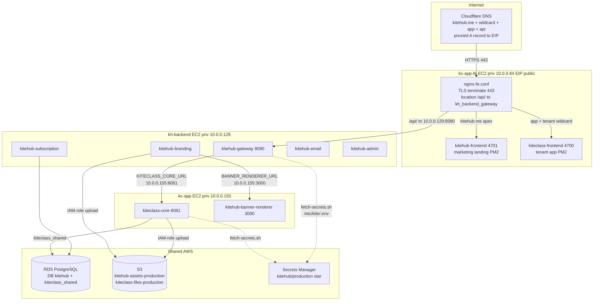

# Production Deploy Config Registry — tầng topology (3-EC2 self-host)

**Last Updated:** 2026-06-19

> Single source of truth cho MỌI config-điểm phụ-thuộc-topology — tức delta giữa
> stack local (1 Docker host, mọi service chung 1 mạng bridge) và production
> (3 EC2 riêng + RDS + S3 + Secrets Manager). Đây là **Layer 1** của "Deploy
> config-parity gate (G3-config)": biến "fix config từng cái khi deploy AWS" thành
> "chạy `scripts/smoke-prod-config.sh` → ra danh sách FAIL → batch-fix".

---

## 1. Mục đích + quan hệ với `production-env-config-registry.md`

Có HAI registry, phủ HAI tầng khác nhau — bổ sung nhau, không thay thế:

| Registry | Tầng phủ | Bắt loại bug gì |
|---|---|---|
| `.claude/rules/production-env-config-registry.md` (rule) + `documents/02-architecture/env-vars-registry.md` | **ENV suspect-default** — `${VAR:default}` trong `application*.yml` có default chạy-local-được nhưng sai-production (localhost / mock / noreply@localhost) | Drift giá trị env-var đơn lẻ |
| **File này (`prod-deploy-config-registry.md`)** | **TOPOLOGY** — cross-host private IP, SG ingress rule, nginx proxy, S3 IAM-role wiring, EC2 bash quirk, ECR image tag, secret-key presence | Drift do *kiến trúc 3-EC2* mà local 1-host không tái hiện được |

Local stack chạy mọi container chung `kite-net` bridge → `kiteclass-core:8080` resolve qua docker-DNS, S3 thay bằng MinIO, secret đọc từ `.env` commit sẵn, không có nginx/SG/cross-EC2. Production tách 3 EC2 → mọi cross-host reference phải trỏ private IP THẬT + SG phải mở port + S3 dùng IAM-role + secret kéo từ Secrets Manager. Gate G1/G2 (loop walk + human local test) chạy trên 1 host KHÔNG bắt được tầng này → đó là lý do PR #2489–2496 phải fix-từng-cái khi deploy.

**Nguyên tắc:** mỗi lần `terraform apply` lại (redev) → instance-ID + private-IP + EIP + RDS-endpoint đều MỚI → mọi hàng "Derive = hardcoded" trong §3 phải được cập nhật lại tay. Đây là nợ kỹ thuật (xem §3 cột Derive + §5 đề xuất Layer 2).

---

## 2. Sơ đồ topology production (3-EC2)

**Đường đi landing tenant (bug class hay vỡ nhất):** browser → `https://co-ha-toan.kitehub.me/` → CF → nginx (kc-app-fe `:443`) → `kiteclass-frontend :4700` SSR fetch courses → `https://co-ha-toan.kitehub.me/api/v1/...` → nginx `location /api/` → gateway `10.0.0.129:8080` → `KITECLASS_CORE_URL=10.0.0.155:8081` → kiteclass-core. Bất kỳ mắt xích IP/SG/proxy nào sai → landing 503 hoặc courses fetch fail.

---

## 3. Bảng registry — config phụ-thuộc-topology

Cột **Derive method** ghi rõ cách lấy giá trị prod: `hardcoded` = nợ kỹ thuật (phải sửa tay khi redev); `terraform output` = lấy được tự động; `IAM-role` = không cần value (instance profile).

| # | Bug class | Config item | Artifact file | Local value (1-host) | Prod value (3-EC2) | Derive method | Smoke check |
|---|---|---|---|---|---|---|---|
| 1 | **1** | `KITECLASS_CORE_URL` — gateway → kiteclass-core cross-EC2 | `scripts/fetch-secrets.sh` (precompute L188) → `/etc/kite/.env`; binds `kitehub-gateway` route URI | `http://kiteclass-core:8080` (docker-DNS) | `http://10.0.0.155:8081` | **hardcoded** (kc-app private IP — Layer 2 nên thêm `kc_app_private_ip` output) | SSM kh-backend: `curl -s http://10.0.0.155:8081/actuator/health` → `UP` (check 3) |
| 2 | **2** | `INTERNAL_API_URL` — FE SSR → gateway | FE env (docker-compose FE block) | `http://kite-gateway:8080` | `http://10.0.0.129:8080` | **hardcoded** (kh-backend private IP) | landing render `curl -sI https://<tenant>.kitehub.me/` → 200 (check 1) |
| 3 | **3** | SG self-ref ingress tcp 8081 (kh-backend SG → kc-app SG) | `infrastructure/terraform-aws/security-groups.tf` (rule `sgr-035af9359bab821be`) | N/A (cùng bridge) | SG rule cho phép kh-backend → kc-app:8081 | terraform (rule id MỚI mỗi apply) | check 3 fail = thường do thiếu SG rule |
| 4 | — | SG ingress tcp 3000 (kh-backend → kc-app banner-renderer) | `security-groups.tf` | N/A | SG rule kh-backend → kc-app:3000 | terraform | SSM kh-backend: `curl -s http://10.0.0.155:3000/health` → 200 |
| 5 | — | SG ingress tcp 8080 (kc-app-fe → kh-backend gateway) | `security-groups.tf` (Wave aws-restore-1) | N/A | SG rule kc-app-fe → kh-backend:8080 | terraform | check 2 (`/api/` proxy) fail = thường thiếu SG này |
| 6 | **4** | S3 upload — kiteclass-core (assets) | `docker-compose.kc.yml` (blank `STORAGE_S3_*` → SDK default creds) + `infrastructure/terraform-aws/iam.tf` (instance-role S3 grant) | MinIO `http://kite-minio:9000` | bucket `kiteclass-files-production-906286017800` qua EC2 instance-role | **IAM-role** (instance profile, no key) | SSM kc-app: `aws s3 ls s3://kiteclass-files-production-906286017800` → exit 0 (check 5) |
| 7 | **4** | S3 upload — kitehub-branding (logo/banner) | `kitehub/docker-compose.kitehub.yml` branding block + `iam.tf` | MinIO | bucket `kitehub-assets-production` qua kh-backend instance-role | **IAM-role** | SSM kh-backend: `aws s3 ls s3://kitehub-assets-production` → exit 0 |
| 8 | **5** | FE BE-base-URL + port logic (`:9000`→443) | `kiteclass-frontend/src/lib/api/public.ts` + `auth.ts` | `http://localhost:9000` (gateway local port) | `https://<host>/api` (443 qua nginx, KHÔNG `:9000`) | code (build-time env / runtime host) | check 1 + 2; CSP block nếu FE gọi sai scheme/port |
| 9 | **6** | nginx `location /api/` proxy — tenant wildcard + app block | `infrastructure/fe-host/nginx-fe.conf` (block `~^(?<tenant>...)` L442 + `app.kitehub.me` L323) | N/A (FE gọi thẳng gateway container) | `proxy_pass http://kh_backend_gateway` cả 2 block | committed (deploy: `cp` → `nginx -t` → reload) | SSM kc-app-fe: `nginx -T \| grep -c 'location /api/'` ≥ 2 (check 6) |
| 10 | **7** | fetch-secrets heredoc body-precompute (`set -u` bash 5.2.15) | `scripts/fetch-secrets.sh` (L182-188 + L305 plain-ref) | N/A (local đọc `.env` commit) | precompute biến TRƯỚC heredoc, heredoc chỉ `VAR=${VAR}` | committed (pattern, không phải value) | check 4: `test -f /etc/kite/.env` + key count > 0 (nếu heredoc vỡ → `.env` stale/thiếu) |
| 11 | **8** | `OTEL_SDK_DISABLED=true` (chống flood span-export) | `scripts/fetch-secrets.sh` (L296) → `/etc/kite/.env` | unset (local có thể chạy collector) | `true` | committed | SSM mỗi host: `grep OTEL_SDK_DISABLED /etc/kite/.env` = `true` (check 8) |
| 12 | **9** | Payment BETA override 10.000đ + VietQR MB | `kitehub-subscription` payment config + SePay; `SEPAY_API_KEY` | full giá | BETA flat 10.000đ; SePay test-mode key `dev-sepay-test-key-local` (chờ merchant key thật) | committed flag + Secret `sepay-api-key` | (manual G2 — QR render + 10k); smoke: `grep -c SEPAY_API_KEY /etc/kite/.env` ≥ 1 |
| 13 | — | RDS endpoint — subscription DB `kitehub` | `scripts/fetch-secrets.sh` (`SPRING_DATASOURCE_URL` từ secret `db-password` payload) | `jdbc:postgresql://kite-postgres:5432/kitehub` | `jdbc:...//<rds-endpoint>:5432/kitehub` | **terraform output** `rds_endpoint` (embedded trong secret payload) | check 7 login (cần DB) |
| 14 | — | RDS endpoint — kiteclass-core DB `kiteclass_shared` (override) | `docker-compose.kc.yml` (`SPRING_DATASOURCE_URL` explicit L91) | `jdbc:postgresql://kite-postgres:5432/kiteclass_shared` | `jdbc:...//<rds-endpoint>:5432/kiteclass_shared` | **hardcoded** trong compose (RDS endpoint thay đổi mỗi apply) | check 3 (core health = migration OK) |
| 15 | — | `DATABASE_ADMIN_URL` — per-tenant DB provisioning | `scripts/fetch-secrets.sh` (L220-224) | `jdbc:postgresql://localhost:5433/postgres` | `jdbc:...//<rds-endpoint>:5432/postgres` (master DB) | **terraform output** (DB_HOST từ secret) | (manual — beta-signup tạo tenant DB) |
| 16 | — | `BANNER_RENDERER_URL` — branding → banner-renderer cross-EC2 | `kitehub/docker-compose.kitehub.yml` branding env | `http://kitehub-banner-renderer:3000/render` | `http://10.0.0.155:3000/render` | **hardcoded** (kc-app private IP) | check (xem #4 SG 3000) |
| 17 | — | Cloudflare DNS A/CNAME + wildcard → EIP | `infrastructure/terraform-cloudflare/**` (hoặc manual CF) | N/A | `kitehub.me` / `*.kitehub.me` / `app` / `api` → EIP | **hardcoded** EIP (EIP mới mỗi apply nếu release rồi alloc lại) | check 1 (DNS resolve + 200) |
| 18 | — | `KITE_VERSION` / ECR image tag | `scripts/fetch-secrets.sh` (L199) + compose image refs | latest local build | tag deploy (vd `0.9.0-beta-staging.14`) | deploy-prod.sh arg | (image pull) — health checks gián tiếp |
| 19 | — | Secret keys present trong `/etc/kite/.env` | Secrets Manager `kitehub/production/*` qua `fetch-secrets.sh` | `.env` commit sẵn | 13 secret kéo runtime (xem §3.1) | **IAM-role** (instance profile `GetSecretValue`) | check 4 (key presence) |
| 20 | **1** | nginx upstream `kh_backend_gateway` IP | `infrastructure/fe-host/nginx-fe.conf` (L511 `server 10.0.0.129:8080`) | N/A | `10.0.0.129:8080` | **hardcoded** (kh-backend private IP) | check 2 (`/api/` proxy) |
| 21 | — | EIP public attach kc-app-fe | `infrastructure/terraform-aws/**` (EIP assoc) | N/A | EIP → kc-app-fe ENI | **terraform output** (public_ip có; private_ip CHƯA có — Layer 2) | check 1 (public reachability) |

### 3.1 Secret keys kéo runtime (hàng #19 chi tiết)

`fetch-secrets.sh` kéo từ `kitehub/production/<name>`: `db-password` (JSON: username/password/host/port/dbname), `jwt-secret`, `jwt-challenge-secret`, `totp-encryption-key`, `staff-invitation-signing-secret`, `encryption-key`, `rabbitmq-default-creds`, `resend-api-key`, `sepay-api-key`, `gemini-api-key`, `openai-api-key`, `zalo-oa-credentials`. Smoke check 4 verify file `/etc/kite/.env` tồn tại + chứa các key bắt buộc (`DB_HOST`, `JWT_SECRET`, `JWT_CHALLENGE_SECRET`, `KITECLASS_CORE_URL`, `OTEL_SDK_DISABLED`) — heredoc vỡ (bug 7) làm file stale/thiếu key.

### 3.2 Lưu ý nợ kỹ thuật — private IP chưa trong terraform outputs

`infrastructure/terraform-aws/outputs.tf` hiện CHỈ export `kh_backend_public_ip` + `kc_app_public_ip` (không có `kc_app_fe`, không có private IP nào). Mọi hàng "Derive = hardcoded" (#1, #2, #14, #16, #17, #20) phải sửa tay khi redev. **Layer 2 nên thêm outputs:** `kh_backend_private_ip`, `kc_app_private_ip`, `kc_app_fe_private_ip`, `eip_public` → để deploy-prod.sh / fetch-secrets.sh đọc tự động thay vì hardcode → giảm config-bug class này về 0.

---

## 4. Checklist "khi redev `terraform apply`" — thứ tự cập nhật giá trị mới

Sau mỗi `terraform apply` tái tạo stack, instance-ID + private-IP + EIP + RDS-endpoint + SG-rule-id đều MỚI. Cập nhật theo thứ tự:

1. **Lấy giá trị mới:** `terraform output` (public IP, RDS endpoint, ECR registry) + `aws ec2 describe-instances --filters "Name=tag:Name,Values=kitehub-kh-backend,kitehub-kc-app,kitehub-kc-app-fe" --query 'Reservations[].Instances[].[Tags[?Key==\`Name\`].Value|[0],PrivateIpAddress,InstanceId]'` (private IP — chưa có output).
2. **kh-backend private IP** (vd `10.0.0.129`) → cập nhật: `nginx-fe.conf` upstream `kh_backend_gateway` (#20), FE `INTERNAL_API_URL` (#2).
3. **kc-app private IP** (vd `10.0.0.155`) → cập nhật: `fetch-secrets.sh` `KITECLASS_CORE_URL` (#1), `docker-compose.kitehub.yml` `BANNER_RENDERER_URL` (#16).
4. **RDS endpoint** → cập nhật: `docker-compose.kc.yml` `SPRING_DATASOURCE_URL` kiteclass_shared (#14) + secret `db-password` payload host (subscription #13 / admin #15).
5. **EIP public** → cập nhật: Cloudflare DNS A record `kitehub.me` / `*.kitehub.me` / `app` / `api` → EIP mới (#17).
6. **SG self-ref rule** → verify lại 3 rule (8081 kh→kc #3, 3000 kh→kc #4, 8080 fe→kh #5) — terraform tái tạo nhưng rule-id mới.
7. **Re-deploy + re-run smoke:** push image ECR → `aws ssm send-command` deploy → `bash scripts/smoke-prod-config.sh --eip <new-eip> --tenant <slug>` → batch-fix mọi FAIL trước khi báo live.

---

## 5. Quan hệ G3-config gate + cross-ref

- **Smoke gate (Layer 1):** `scripts/smoke-prod-config.sh` — chạy SAU `terraform apply` + push image + deploy SSM. Catalog-then-report: chạy hết 8 check → in bảng PASS/FAIL → exit code = số FAIL → batch-fix. Mỗi check ánh xạ 1 hàng §3.
- **Flow Verification Campaign G3-config:** gate này = "G3-config" trong campaign (`documents/03-planning/roadmap/flow-verification-campaign.md`) — tách phần config-parity infra ra khỏi G1 (loop walk) + G2 (human browser walk) vì 2 gate đó chạy 1-host không tái hiện topology 3-EC2.
- **Layer 2 (đề xuất, chưa làm):** thêm private-IP outputs vào `outputs.tf` (§3.2) → deploy script đọc tự động → loại bỏ class "hardcoded IP drift" (#1/#2/#14/#16/#17/#20).
- **Sister registry:** `.claude/rules/production-env-config-registry.md` (env suspect-default) + `documents/02-architecture/env-vars-registry.md` — tầng ENV, file này tầng TOPOLOGY (xem §1).
- **Rules liên quan:** `.claude/rules/agent-aws-access.md` §2.1 (smoke chỉ dùng Tier 1 read-only + SSM read-only command), `.claude/rules/aws-cost-guard.md` (smoke không sinh billable artifact), `.claude/rules/local-fix-production-parity-check.md` §2.5 (value-resolution dimension — chính rule sinh ra registry + smoke gate này).
