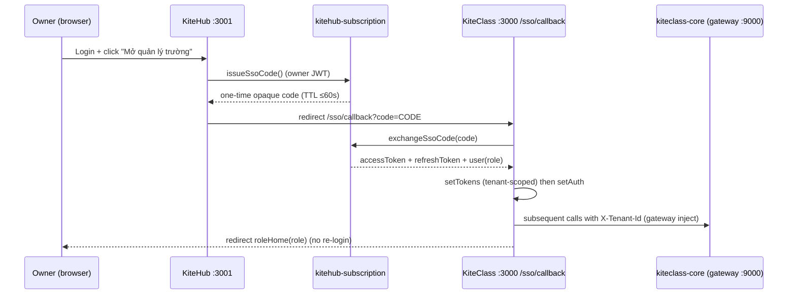

# G2 Recipe — Cross-product SSO KiteHub → KiteClass

> **2 sản phẩm, 2 port** per `kitehub-kiteclass-boundary.md` §2:
> - **KiteHub (KH)** = `kitehub-frontend` **`:3001`** (SaaS portal owner/staff).
> - **KiteClass (KC)** = `kiteclass-frontend` **`:3000`** (school-mgmt owner-shell).
>
> SSO = owner/staff đăng nhập **KH `:3001`** → click "Mở quản lý trường" → vào **KC `:3000`** owner-shell **KHÔNG re-login**.

## 1. Mục tiêu + prereq + thời lượng

**Mục tiêu:** Owner (hoặc Staff) login KiteHub `:3001` → click nút **"Mở quản lý trường"** → browser redirect sang KiteClass `:3000` owner-shell, đăng nhập tự động (không nhập lại mật khẩu), land đúng role-home.

**Prereq:**
- Stack UP (rebuild `kitehub-frontend` + `kitehub-subscription` + `kiteclass-frontend` + gateway).
- **KiteHub owner credential SSO walk** (GAP-1305) đã seed — xem §2.1. KC tenant `skytest` (aaaabbbb) đã provisioned (data từ `seed-toan10a1-demo.sql`).

**Thời lượng:** ~8-10 phút.

## 2. Setup

```bash
cd /home/kitedev/projects/2026-Kite-Class-Platform
bash kitehub/scripts/up.sh && bash kitehub/scripts/status.sh
```

- Browser + DevTools → Network (filter `sso`) + Console + tab Application (Local Storage cả 2 origin).
- URL: KiteHub portal `http://localhost:3001` · KiteClass `http://localhost:3000`

### 2.1 Provision KiteHub owner credential (GAP-1305)

SSO bắt đầu bằng login **KiteHub `:3001`** (`kitehub-subscription` auth, bảng `users` DB `kitehub`) — TÁCH BIỆT với KiteClass tenant-auth. Owner phải sở hữu **đúng 1 instance** (per invariant "1 user → 1 tenant", `AuthService.java:838`) thì JWT `tenantId` claim mới deterministic. Seed owner SSO riêng (sở hữu duy nhất tenant `skytest`/aaaabbbb có KC data):

```bash
docker exec -i kite-postgres psql -U kitehub -d kitehub < kitehub/scripts/seed-kh-owner-sso.sql
```

**Credential walk:**

| Field | Value |
|---|---|
| Email | `sso.owner@skytest.test` |
| Password | `Test@1234` |
| Tenant (JWT `tenantId`) | `aaaabbbb-0000-0000-0000-000000000001` (subdomain `skytest`, có KC data) |

**Verify trước khi browser-walk (cả 2 phải HTTP 200, `tenantId=aaaabbbb`):**

```bash
RESP=$(curl -s -X POST http://localhost:9000/api/auth/login -H 'Content-Type: application/json' \
  -d '{"email":"sso.owner@skytest.test","password":"Test@1234"}')
echo "$RESP" | python3 -c "import sys,json,base64;t=json.load(sys.stdin)['accessToken'];p=t.split('.')[1];p+='='*(-len(p)%4);print('tenantId=',json.loads(base64.urlsafe_b64decode(p))['tenantId'])"
TOK=$(echo "$RESP" | python3 -c "import sys,json;print(json.load(sys.stdin)['accessToken'])")
curl -s -o /dev/null -w "issue-code HTTP %{http_code}\n" -X POST http://localhost:9000/api/v1/auth/sso/issue-code -H "Authorization: Bearer $TOK"
```

> ⚠️ KHÔNG dùng `owner.test@test.vn` cho SSO walk — owner đó sở hữu 2 instance (sky-test BASIC + skytest FREE) → `tenantId` claim non-deterministic (có thể land vào sky-test rỗng). Owner SSO riêng `sso.owner@skytest.test` sở hữu duy nhất `skytest` → land đúng tenant có data.

### Luồng SSO (tham khảo)



## 3. Các bước (browser-walk — KH `:3001` → KC `:3000`)

### Bước 1 — Owner login KiteHub `:3001`
- **Hành động:** Mở browser `http://localhost:3001` → login `sso.owner@skytest.test` / `Test@1234` (account KH owner SSO walk, §2.1).
- **✅ Kỳ vọng (PASS):** Vào KiteHub customer dashboard `:3001` (KH portal — KHÔNG phải KC). Thấy nút **"Mở quản lý trường"** (component `OpenSchoolManagementButton`, có icon external-link).
- **⚠️ Sad path:** Không thấy nút → component chưa render trên dashboard `:3001` (báo). Login fail → 401.
- **🔍 Verify:** URL = `localhost:3001/dashboard` (KH); DevTools Local Storage `localhost:3001` có session KH.

### Bước 2 — Click "Mở quản lý trường" → issue SSO code
- **Hành động:** Click nút **"Mở quản lý trường"**.
- **✅ Kỳ vọng:** Nút chuyển loading; Network `issueSsoCode` (qua kitehub-subscription) → 200 trả `{ code }`; browser **hard-navigate** sang `http://localhost:3000/sso/callback?code=<opaque>`.
- **⚠️ Sad path:** Lỗi đỏ "Không thể mở trang quản lý trường. Vui lòng đăng nhập lại rồi thử lại." → issue-code fail (token KH hết hạn / endpoint lỗi). URL redirect mang **JWT** thay vì opaque code → **token-in-URL leak** (báo BLOCKING — chỉ opaque code được phép trong URL).
- **🔍 Verify:** URL bar sau click = `localhost:3000/sso/callback?code=...` (code ngắn, KHÔNG phải JWT 3-phần).

### Bước 3 — KC callback exchange → auto-login (no re-login)
- **Hành động:** (Tự động sau Bước 2) trang `/sso/callback` hiện spinner "Đang đăng nhập vào trang quản lý trường...".
- **✅ Kỳ vọng:** Network `exchangeSsoCode` → 200 trả `accessToken`+`refreshToken`+`user`; FE `setTokens` (tenant-scoped) → `setAuth` → redirect tới **`roleHome(role)`** (owner/staff/admin → `/dashboard` KC). **KHÔNG hiện form đăng nhập KC.**
- **⚠️ Sad path:** Hiện "Đăng nhập SSO thất bại" + "Mã đăng nhập không hợp lệ hoặc đã hết hạn" → code hết hạn (TTL ≤60s) / đã dùng (replay) — thử lại từ Bước 2. Bị đá về `/login` KC (bắt re-login) → SSO không establish session (báo BLOCKING).
- **🔍 Verify:** URL cuối = `localhost:3000/dashboard` (KC owner-shell); Local Storage `localhost:3000` có `kc:<tenantId>:accessToken`; KHÔNG phải nhập lại mật khẩu.

### Bước 4 — Replay code (sad path — single-use)
- **Hành động:** Copy URL `/sso/callback?code=<code>` vừa dùng → dán lại vào tab mới (hoặc F5 sau khi đã exchange).
- **✅ Kỳ vọng:** Code single-use → exchange lần 2 → **401** → màn "Đăng nhập SSO thất bại" (replay bị từ chối per GAP-1138 AC `SsoCodeService` GETDEL single-use).
- **⚠️ Sad path:** Code dùng lại được lần 2 → single-use leak (báo BLOCKING security).
- **🔍 Verify:** Network `exchangeSsoCode` lần 2 → 401.

### Bước 5 — Tenant scope đúng
- **Hành động:** Sau khi vào KC owner-shell, mở 1 trang nghiệp vụ (vd lớp học / học viên).
- **✅ Kỳ vọng:** Data hiển thị đúng tenant của owner; gateway tự inject `X-Tenant-Id` (JWT `tenantId` claim). KHÔNG thấy data tenant khác.
- **⚠️ Sad path:** 400 mọi call / data tenant khác → tenant claim/scope sai (báo).
- **🔍 Verify:** JWT decode (`kc:<tenantId>:accessToken`) có `tenantId` khớp tenant owner; Network call có header tenant đúng.

## 4. Sad path quick checks (tổng hợp)
- Code TTL >60s hoặc dùng lại → 401 (single-use + TTL clamp).
- URL chứa JWT thay vì opaque code → token-in-URL leak (security).
- Callback đá về `/login` KC → session không establish (re-login regression).
- Owner KH chưa login → nút issue-code fail.
- Sai tenant data sau SSO → tenant claim sai.

## 5. Báo kết quả
- ✅ **FULL PASS** → Claude flip GAP-1138 AC (item 1 + item 5 runtime walk) → chờ G3.
- ⚠️ **MOSTLY PASS** (cosmetic: spinner text, nút style) → fix inline nếu nhỏ.
- 🔴 **BLOCKING** (re-login required / token-in-URL / replay accepted / wrong tenant) → catalog blocker + fix loop + re-walk.
- ❓ **UNCLEAR** → ping kèm screenshot + Network (`issueSsoCode` / `exchangeSsoCode`) + URL.

Format: `SSO redirect: ✅ | no-relogin: ✅ | replay reject: ✅`.

## 6. Troubleshooting + G3 preview

| Triệu chứng | Quick fix |
|---|---|
| Không thấy nút "Mở quản lý trường" trên `:3001` | `OpenSchoolManagementButton` chưa render dashboard KH → báo |
| Callback "mã không hợp lệ/hết hạn" | Code TTL ≤60s — click nút lại (Bước 2) tạo code mới; không F5 callback |
| Callback đá `/login` KC | exchange fail → check `exchangeSsoCode` Network response + `JWT_SECRET` chung KH/KC (ADR-039) |
| `:3000`/`:3001` ERR_EMPTY_RESPONSE | restart container FE tương ứng (GAP-1067 class) |
| Sai port (KH ở :3000 / KC ở :3001) | KH=`:3001`, KC=`:3000` per `kitehub-kiteclass-boundary.md` §2 |

**G3 preview (AWS-gated GAP-612):** SSO cross-origin trên domain production thật (KH apex `kitehub.me` → KC `{slug}.kitehub.me` subdomain), TLS, gateway `TenantHeaderGuardFilter` validate HS512 JWT bằng `JWT_SECRET` chung. Production access-mode (custom domain / subdomain redirect) per `g1-browser-walk-before-flip.md` §3.2. G3-infra (TLS/wildcard-cert/real-DNS) không block THÔNG-local.
