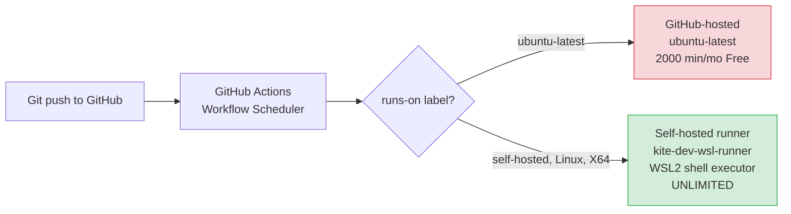

# Self-Hosted GitHub Actions Runner Runbook

> 📅 Cập nhật: **2026-05-21** · Áp dụng cho: **kite-dev-wsl-runner** · Audience: **ops/dev** · Đọc khoảng **15 phút**

## Scope & Purpose

Runbook quản lý self-hosted GitHub Actions runner `kite-dev-wsl-runner` chạy trong WSL2 trên máy dev. Áp dụng khi:

- GitHub Actions Free quota exhausted (hourly burst limit hoặc monthly cap)
- Cần CI runner bypass GitHub-hosted infrastructure
- Long-running jobs vượt 6h timeout của GitHub-hosted runners
- Cần access tools/secrets only available trên dev machine (Maven cache, local Docker stack)

**Audience:** Dev/Ops solo-dev mode. **Prerequisites:**
- WSL2 Ubuntu 24.04 với sudo access (password `vkiet432`)
- GitHub PAT scope `repo` (admin rights for self-hosted runner registration)
- ~500MB disk cho runner binary + work directory
- Service `actions.runner.VictorAurelius-2026-Kite-Class-Platform.kite-dev-wsl-runner.service` active

**Reference incident:** 2026-05-21 GH Actions silent stop (0 fire since 07:59 UTC dù repo public với unlimited free minutes). Self-hosted runner đã setup từ Wave 73 nhưng workflows hardcoded `runs-on: ubuntu-latest` không match. Wave 102.9 unblocked qua bulk-replace `script-quality.yml` jobs sang `runs-on: [self-hosted, Linux, X64]`.

---

## 1. Architecture overview



**Key concepts:**
- Public repos có unlimited GitHub-hosted minutes — quota chỉ apply cho private repos. Nhưng GitHub có hidden burst rate-limits + occasional silent suspension (cause Wave 102.9 incident chưa rõ root cause).
- Self-hosted runners FREE forever. Trade-off: maintenance cost + security implications (runner runs as `nguyenvankiet` user).
- Workflows phải explicit chỉ định self-hosted label — `ubuntu-latest` KHÔNG fallback sang self-hosted tự động.

---

## 2. Current state (verified 2026-05-21)

| Component | State | Detail |
|---|---|---|
| Runner binary | Installed | `~/actions-runner/` v2.334.0 (downloaded 2026-05-19 Wave 73) |
| Runner config | Configured | `~/actions-runner/.runner` (agentId: 21, agentName: kite-dev-wsl-runner) |
| Systemd service | Active running | `actions.runner.VictorAurelius-2026-Kite-Class-Platform.kite-dev-wsl-runner.service` (since 2026-05-19 01:56:42 UTC) |
| GitHub API status | `online busy=false` | Labels: `self-hosted, Linux, X64, wsl, available-on-demand` |
| Repo workflow opt-in | Partial | Wave 102.9 PR #1701: `script-quality.yml` bulk-replaced 20 jobs sang self-hosted. Other workflows still `ubuntu-latest` |

**Verify command:**

```bash
# API state
gh api "repos/VictorAurelius/2026-Kite-Class-Platform/actions/runners" \
  --jq '.runners[] | "\(.status) busy=\(.busy) name=\(.name) labels=\(.labels | map(.name) | join(","))"'

# Local service state
sudo systemctl status "actions.runner.VictorAurelius-2026-Kite-Class-Platform.kite-dev-wsl-runner.service" | head -10
```

---

## 3. Initial setup (one-time, already done — reference only)

> ⚠️ Skip this section nếu runner đã registered. Chỉ apply nếu fresh setup hoặc re-install sau machine wipe.

### 3.1 Download runner binary

```bash
mkdir -p ~/actions-runner && cd ~/actions-runner

# Get latest version
LATEST=$(curl -s "https://api.github.com/repos/actions/runner/releases/latest" \
  | jq -r '.tag_name' | tr -d 'v')
echo "Latest version: $LATEST"

# Download + extract
curl -sLo actions-runner.tar.gz \
  "https://github.com/actions/runner/releases/download/v${LATEST}/actions-runner-linux-x64-${LATEST}.tar.gz"
tar xzf actions-runner.tar.gz
ls config.sh run.sh svc.sh  # verify present
```

### 3.2 Get registration token (1h expiry)

```bash
TOKEN=$(gh api -X POST \
  "repos/VictorAurelius/2026-Kite-Class-Platform/actions/runners/registration-token" \
  --jq '.token')
echo "Token prefix: ${TOKEN:0:10}... expires in 1h"
```

### 3.3 Configure runner non-interactive

```bash
cd ~/actions-runner
./config.sh --unattended \
  --url https://github.com/VictorAurelius/2026-Kite-Class-Platform \
  --token "$TOKEN" \
  --name "kite-dev-wsl-runner" \
  --labels "self-hosted,Linux,X64,wsl,available-on-demand" \
  --work "_work" \
  --replace
```

### 3.4 Install as systemd service

```bash
cd ~/actions-runner
sudo ./svc.sh install nguyenvankiet  # runs service as this user
sudo ./svc.sh start
sudo systemctl enable actions.runner.VictorAurelius-2026-Kite-Class-Platform.kite-dev-wsl-runner.service
```

### 3.5 Verify pickup

Push commit to test branch + check API shows runner `busy=true` during job execution.

---

## 4. Opt-in workflows to self-hosted

Workflows must explicit declare self-hosted labels — runner KHÔNG auto-fallback từ `ubuntu-latest`.

### 4.1 Per-workflow opt-in (selective — recommended)

Edit `.github/workflows/<workflow-name>.yml`:

```yaml
# Before
jobs:
  my-job:
    runs-on: ubuntu-latest

# After
jobs:
  my-job:
    runs-on: [self-hosted, Linux, X64]
```

### 4.2 Bulk opt-in (script-quality.yml pattern — Wave 102.9)

```bash
sed -i.orig 's/runs-on: ubuntu-latest/runs-on: [self-hosted, Linux, X64]/g' \
  .github/workflows/script-quality.yml
diff .github/workflows/script-quality.yml.orig .github/workflows/script-quality.yml | head -20
rm .github/workflows/script-quality.yml.orig
git add .github/workflows/script-quality.yml
git commit -m "ci: script-quality use self-hosted runner"
git push
```

### 4.3 Hybrid runs-on (fallback pattern — Phase 2)

Future enhancement — accept EITHER GitHub-hosted OR self-hosted:

```yaml
runs-on: ${{ vars.RUNNER_LABEL || 'ubuntu-latest' }}
```

Set repo variable `RUNNER_LABEL=self-hosted` qua Settings → Variables. Toggle without code change.

### 4.4 Workflows opted-in (current state)

| Workflow | Status | Notes |
|---|---|---|
| `script-quality.yml` | ✅ self-hosted (Wave 102.9) | 20 jobs bulk-replaced |
| `core-ci.yml` (Java backend) | ❌ ubuntu-latest | Heavy Maven build; opt-in if quota issue |
| `frontend-ci.yml` (TS/React) | ❌ ubuntu-latest | pnpm build; opt-in if quota issue |
| `kitehub-ci.yml` + `kitehub-frontend-ci.yml` | ❌ ubuntu-latest | Same as above |
| `gitleaks-scan.yml` | ❌ ubuntu-latest | Doc-only PRs skip per path-ignore |
| `docker-build-push.yml` | ❌ ubuntu-latest | Pushes to ECR; needs AWS creds — consider security implication |

---

## 5. Verification (post-push)

```bash
# 1. Check workflow run created
gh run list --branch <branch> --limit 3 \
  --json workflowName,status,conclusion,createdAt \
  --jq '.[] | "\(.createdAt[5:16]) \(.status) \(.conclusion // "-") \(.workflowName)"'

# 2. Check runner is busy during run
gh api "repos/VictorAurelius/2026-Kite-Class-Platform/actions/runners" \
  --jq '.runners[] | "\(.status) busy=\(.busy)"'

# 3. Tail runner log live (if local access)
sudo journalctl -u actions.runner.VictorAurelius-2026-Kite-Class-Platform.kite-dev-wsl-runner.service -f --since "5 min ago"

# 4. Verify completion
gh run view <run-id> --log | tail -20
```

Expected: `runner=kite-dev-wsl-runner` appears in workflow log step "Set up job" → "Runner name: kite-dev-wsl-runner".

---

## 6. Troubleshooting

### 6.1 Pipeline created but 0 jobs (silent skip)

**Symptom:** `gh run list` shows pipeline with `status: completed conclusion: <none>` immediately after push.

**Cause:** Workflow file `runs-on:` không match runner labels.

**Fix:** Verify workflow uses `runs-on: [self-hosted, Linux, X64]` (case-sensitive, label `Linux` capital L). Check runner labels:

```bash
gh api "repos/VictorAurelius/2026-Kite-Class-Platform/actions/runners" \
  --jq '.runners[].labels | map(.name)'
```

### 6.2 Job stuck in `pending` / `queued`

**Symptom:** `gh run list --status queued` shows job hanging.

**Cause:** Runner offline or busy.

**Fix:**

```bash
# Restart service
sudo systemctl restart actions.runner.VictorAurelius-2026-Kite-Class-Platform.kite-dev-wsl-runner.service

# Verify recovery
sudo systemctl status actions.runner.VictorAurelius-2026-Kite-Class-Platform.kite-dev-wsl-runner.service | head -5
```

### 6.3 Runner shows `offline` in GitHub UI

**Symptom:** GitHub Settings → Actions → Runners → red dot.

**Cause:** Network disconnection / WSL2 paused / service stopped.

**Fix sequence:**

```bash
# 1. Check WSL2 alive
wsl --list --running  # from Windows PowerShell

# 2. Check service
sudo systemctl status actions.runner.VictorAurelius-2026-Kite-Class-Platform.kite-dev-wsl-runner.service

# 3. Check runner can reach GitHub
curl -sI https://api.github.com/ 2>&1 | head -3

# 4. Restart if needed
sudo systemctl restart actions.runner.VictorAurelius-2026-Kite-Class-Platform.kite-dev-wsl-runner.service
```

### 6.4 Tool not found in CI (`shellcheck: command not found`)

**Symptom:** Job fails với `<tool>: command not found`.

**Cause:** Shell executor uses host PATH. Tool not installed system-wide.

**Fix:** Install tool globally OR set PATH in workflow step:

```bash
sudo apt-get install -y shellcheck  # one-time install
# Or per-workflow PATH extension
echo 'PATH="/home/nguyenvankiet/.local/bin:$PATH"' >> ~/.bashrc
```

Verify which tools available:

```bash
which shellcheck python3 ruff jq git mvn pnpm node docker
```

### 6.5 Stale `_work` directory bloat

**Symptom:** Disk fills up, `~/actions-runner/_work/` grows >1GB.

**Cause:** Each job leaves artifact in `_work/<repo>/<repo>/`.

**Fix (cron weekly):**

```bash
# Clean old work artifacts >7 days
find ~/actions-runner/_work -mindepth 3 -maxdepth 3 -type d -mtime +7 -exec rm -rf {} +
```

### 6.6 Registration token expired (1h limit)

**Symptom:** `./config.sh` fails với "Cannot validate runner registration token".

**Fix:** Get fresh token:

```bash
TOKEN=$(gh api -X POST "repos/VictorAurelius/2026-Kite-Class-Platform/actions/runners/registration-token" --jq '.token')
./config.sh --token "$TOKEN" --replace ...  # retry config
```

---

## 7. Security considerations

⚠️ **Self-hosted runner = arbitrary code execution as user `nguyenvankiet`.** Implications:

| Risk | Mitigation |
|---|---|
| Malicious PR from external contributor runs job với host privileges | Repo is PRIVATE work scope OR enable "Require approval for fork pull requests" in Settings → Actions → General |
| Secrets leaked via job log | Use GitHub Secrets (encrypted) — never echo secrets to stdout |
| Persistent compromise (job modifies host) | Use ephemeral workspace OR podman-in-podman isolation (future enhancement) |
| Network access to internal services (Docker, local DB) | Document tradeoff: self-hosted có thể access local Docker stack (Wave 102.9 advantage) but cũng risk surface |
| Runner stays online 24/7 | Acceptable cho solo-dev; review Wave 102.10+ nếu multi-dev |

**Current setup acceptable cho solo-dev mode** per `release-deploy-standard.md` §9. Re-evaluate khi team grows beyond solo.

---

## 8. Decommission / temporary disable

### 8.1 Disable temporarily (keep runner registered)

```bash
sudo systemctl stop actions.runner.VictorAurelius-2026-Kite-Class-Platform.kite-dev-wsl-runner.service
sudo systemctl disable actions.runner.VictorAurelius-2026-Kite-Class-Platform.kite-dev-wsl-runner.service
# Runner shows "offline" in GitHub UI; can re-enable later via `systemctl start`
```

### 8.2 Full unregister + remove

```bash
cd ~/actions-runner

# Get removal token
TOKEN=$(gh api -X POST \
  "repos/VictorAurelius/2026-Kite-Class-Platform/actions/runners/remove-token" \
  --jq '.token')

# Stop + uninstall service
sudo ./svc.sh stop
sudo ./svc.sh uninstall

# Unregister from GitHub
./config.sh remove --token "$TOKEN"

# (Optional) clean files
cd ~ && rm -rf actions-runner/
```

### 8.3 Revert workflows to GitHub-hosted

```bash
sed -i 's/runs-on: \[self-hosted, Linux, X64\]/runs-on: ubuntu-latest/g' \
  .github/workflows/script-quality.yml
git add .github/workflows/script-quality.yml
git commit -m "ci: revert script-quality to ubuntu-latest"
git push
```

---

## 9. Maintenance cadence

| Task | Frequency | Command |
|---|---|---|
| Verify runner online | Daily (auto via session-start collector) | `gh api repos/.../actions/runners` |
| Clean `_work` directory | Weekly | `find ~/actions-runner/_work -mtime +7 -exec rm -rf {} +` |
| Update runner binary | Monthly OR when GitHub deprecation notice | Re-download + re-extract; restart service |
| Review opted-in workflows | Per release | Audit which workflows use self-hosted vs ubuntu-latest |
| Security audit (host privilege risk) | Quarterly | Review §7 mitigations |

---

## 10. Decision history & lessons

### 2026-05-21 — Wave 102.9 self-hosted activation

**Trigger:** GH Actions stopped firing on PR #1701 from 07:59 UTC, ~2h silent gap. Repo public (unlimited Free minutes), workflow state `active`, paths matched — root cause unknown but service blocked.

**Path eliminated:** GitLab CI backup blocked by account verification requirement (phone unavailable, credit card declined by user). GitLab runner registered but pipelines instant-reject 0 jobs.

**Path chosen:** Self-hosted GitHub Actions runner (`kite-dev-wsl-runner`) — already registered Wave 73 nhưng workflows không opt-in. Bulk-replaced 20 jobs trong `script-quality.yml`.

**Lessons:**
1. Self-hosted runner registration alone không đủ — workflows phải explicit `runs-on` match
2. Public repo không guarantee unlimited Actions — hidden burst limits possible
3. Backup CI path (GitLab) requires verification kể cả self-hosted runner — không phải drop-in replacement
4. Document setup steps trong runbook để tránh repeat investigation cost (~2h debug)

**Recurrence prevention:**
- This runbook (single source of truth setup steps)
- Cross-link từ `release-deploy-standard.md` §9 (mention self-hosted as quota recovery option)
- Session-start `collect-state.sh` check runner status (future enhancement)

---

## 📚 Tham khảo

- **Source:** [`~/actions-runner/`](file:///home/nguyenvankiet/actions-runner) (local install)
- **Service:** `/etc/systemd/system/actions.runner.VictorAurelius-2026-Kite-Class-Platform.kite-dev-wsl-runner.service`
- **GitHub docs:** [Self-hosted runners overview](https://docs.github.com/en/actions/hosting-your-own-runners/managing-self-hosted-runners/about-self-hosted-runners)
- **Sister runbooks:** [`incident-response-runbook.md`](./incident-response-runbook.md) · [`secrets-rotation-runbook.md`](./secrets-rotation-runbook.md)
- **Related rules:**
  - `.claude/rules/deployment-naming-convention.md` (file placement)
  - `.claude/rules/release-deploy-standard.md` §9 (deploy execution gates)
  - `.claude/rules/admin-merge-discipline.md` (CI bypass policy)
  - `.claude/rules/professional-manual-content-standard.md` (this doc format compliance)
- **Trigger incident:** Wave 102.9 PR #1701 GH Actions 0-fire 2026-05-21 — bulk-replace commit `35c170b2`
- **Báo lỗi / cải tiến:** GitHub Issues hoặc directly edit this runbook
