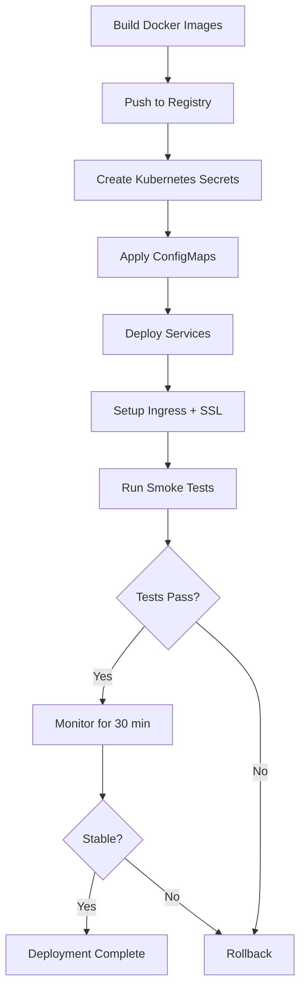

# Hướng Dẫn Triển Khai Production - KiteClass Platform

**Phiên bản:** 1.1
**Ngày tạo:** 2026-03-10
**Cập nhật:** 2026-03-19
**Mục đích:** Hướng dẫn chi tiết cách triển khai KiteClass Platform lên production
**Đối tượng:** DevOps Engineers, SRE, System Administrators

> **Lưu ý (2026-03-19):** KiteHub platform đã chuyển sang **Oracle Cloud Always Free** ($0/tháng) làm primary.
> AWS (EKS/RDS) giữ làm backup. KiteClass instances vẫn dùng AWS.
> Xem hướng dẫn Oracle: [kitehub-oracle-cloud-deployment.md](../../03-planning/infrastructure/kitehub-oracle-cloud-deployment.md)
> Xem hướng dẫn tổng hợp: [PRODUCTION-DEPLOY.md](../PRODUCTION-DEPLOY.md)
> Tài liệu bên dưới giữ nguyên cho AWS backup option.

---

## Mục Lục

1. [Giới Thiệu](#1-giới-thiệu)
2. [Chuẩn Bị Deployment](#2-chuẩn-bị-deployment)
3. [Deployment to Kubernetes](#3-deployment-to-kubernetes)
4. [Post-Deployment Verification](#4-post-deployment-verification)
5. [Rollback Procedures](#5-rollback-procedures)
6. [Troubleshooting](#6-troubleshooting)
7. [Incident Response](#7-incident-response)
8. [Backup & Disaster Recovery](#8-backup--disaster-recovery)
9. [Production Checklist](#9-production-checklist)
10. [Continuous Deployment](#10-continuous-deployment)

---

## 1. Giới Thiệu

### 1.1. Tổng Quan Kiến Trúc Production

KiteClass Platform triển khai theo mô hình **multi-tenant** với 2 layers chính:

```
┌─────────────────────────────────────────────────────────┐
│                    KITEHUB (Platform Layer)              │
│  - Central authentication                                │
│  - Instance management                                   │
│  - Subscription & payment                                │
│  - AI branding service                                   │
└─────────────────────────────────────────────────────────┘
                            ↓
┌─────────────────────────────────────────────────────────┐
│              KITECLASS INSTANCES (Tenant Layer)          │
│                                                          │
│  Instance 1 (customer1.kitehub.me)                    │
│    - Gateway, Core, Frontend                             │
│    - Isolated database                                   │
│                                                          │
│  Instance 2 (customer2.kitehub.me)                    │
│    - Gateway, Core, Frontend                             │
│    - Isolated database                                   │
│                                                          │
│  Instance N (customerN.kitehub.me)                    │
└─────────────────────────────────────────────────────────┘
```

---

### 1.2. Deployment Strategy

**Environments:**

| Environment | Purpose | URL |
|------------|---------|-----|
| **Local** | Development | http://localhost:3000 |
| **Staging** | Pre-production testing | https://staging.kitehub.me |
| **Production** | Live production | https://kitehub.me |

**Deployment Methods:**

1. **Manual Deployment:** Kubernetes `kubectl` commands
2. **GitHub Actions CD:** Automated deployment from `main` branch
3. **Helm Charts:** Package manager cho Kubernetes (recommended)

---

### 1.3. Prerequisites

**Trước khi triển khai production, cần có:**

- ✅ **Kubernetes Cluster:** AWS EKS, GKE, hoặc AKS
- ✅ **Container Registry:** Docker Hub, AWS ECR, hoặc Google Container Registry
- ✅ **Domain Name:** `kitehub.me` và `*.kitehub.me`
- ✅ **SSL Certificates:** Let's Encrypt hoặc AWS Certificate Manager
- ✅ **Database:** Managed PostgreSQL (AWS RDS, Cloud SQL)
- ✅ **Redis:** Managed Redis (AWS ElastiCache, Google Memorystore)
- ✅ **kubectl CLI:** Installed và configured
- ✅ **Docker:** Installed để build images
- ✅ **GitHub Secrets:** Configured cho CI/CD

---

## 2. Chuẩn Bị Deployment

### 2.1. Build Docker Images

#### Build Images Locally

**Core Service:**

```bash
cd kiteclass/kiteclass-core

# Build với Maven
./mvnw clean package -DskipTests

# Build Docker image
docker build -t kiteclass/core:v1.2.3 .

# Tag cho registry
docker tag kiteclass/core:v1.2.3 <your-registry>/kiteclass-core:v1.2.3

# Push lên registry
docker push <your-registry>/kiteclass-core:v1.2.3
```

**Gateway Service:**

```bash
cd kiteclass/kiteclass-gateway

./mvnw clean package -DskipTests
docker build -t kiteclass/gateway:v1.2.3 .
docker tag kiteclass/gateway:v1.2.3 <your-registry>/kiteclass-gateway:v1.2.3
docker push <your-registry>/kiteclass-gateway:v1.2.3
```

**Frontend:**

```bash
cd kiteclass/kiteclass-frontend

# Build Next.js
pnpm build

# Build Docker image
docker build -t kiteclass/frontend:v1.2.3 .
docker tag kiteclass/frontend:v1.2.3 <your-registry>/kiteclass-frontend:v1.2.3
docker push <your-registry>/kiteclass-frontend:v1.2.3
```

---

#### Verify Images

```bash
# List local images
docker images | grep kiteclass

# Output mẫu:
# kiteclass/core       v1.2.3   abc123def456   2 minutes ago   350MB
# kiteclass/gateway    v1.2.3   def456ghi789   3 minutes ago   320MB
# kiteclass/frontend   v1.2.3   ghi789jkl012   5 minutes ago   180MB

# Test image locally
docker run -p 8080:8080 kiteclass/core:v1.2.3

# Check health endpoint
curl http://localhost:8080/actuator/health
# Expected: {"status":"UP"}
```

---

### 2.2. Chuẩn Bị Kubernetes Secrets

#### Database Credentials

**File:** `infrastructure/k8s/secrets/database-secret.yaml`

```yaml
apiVersion: v1
kind: Secret
metadata:
  name: kiteclass-db-secret
  namespace: kiteclass
type: Opaque
stringData:
  DB_HOST: "postgres.production.rds.amazonaws.com"
  DB_PORT: "5432"
  DB_NAME: "kiteclass"
  DB_USERNAME: "kiteclass_user"
  DB_PASSWORD: "YOUR_SECURE_PASSWORD_HERE"  # CHANGE THIS!
```

**Apply:**

```bash
kubectl apply -f infrastructure/k8s/secrets/database-secret.yaml

# Verify
kubectl get secret kiteclass-db-secret -n kiteclass -o yaml
```

**Security Note:** KHÔNG commit secrets vào Git! Dùng:

- **Option A:** AWS Secrets Manager + External Secrets Operator
- **Option B:** Sealed Secrets (encrypted secrets trong Git)
- **Option C:** Manual kubectl apply (như trên)

---

#### JWT Secrets

**File:** `infrastructure/k8s/secrets/jwt-secret.yaml`

```yaml
apiVersion: v1
kind: Secret
metadata:
  name: kiteclass-jwt-secret
  namespace: kiteclass
type: Opaque
stringData:
  JWT_SECRET: "YOUR_256_BIT_SECRET_KEY"  # Generate với openssl
  JWT_EXPIRATION: "86400000"  # 24 hours in milliseconds
```

**Generate secure JWT secret:**

```bash
# Generate 256-bit random key
openssl rand -base64 32

# Output: xK7mN9pQ2rS5tU8vW0xY1zA3bC4dE6fG7hI9jK0lM2nO4p==
```

---

#### Redis Secret

**File:** `infrastructure/k8s/secrets/redis-secret.yaml`

```yaml
apiVersion: v1
kind: Secret
metadata:
  name: kiteclass-redis-secret
  namespace: kiteclass
type: Opaque
stringData:
  REDIS_HOST: "redis.production.cache.amazonaws.com"
  REDIS_PORT: "6379"
  REDIS_PASSWORD: "YOUR_REDIS_PASSWORD"  # CHANGE THIS!
```

---

### 2.3. Chuẩn Bị ConfigMaps

#### Instance Metadata

**File:** `infrastructure/k8s/configmaps/instance-config.yaml`

```yaml
apiVersion: v1
kind: ConfigMap
metadata:
  name: kiteclass-config
  namespace: kiteclass
data:
  INSTANCE_ID: "default-instance-id"
  ORGANIZATION_NAME: "KiteClass Demo"
  SUBSCRIPTION_TIER: "PREMIUM"
  SPRING_PROFILES_ACTIVE: "production"
  JAVA_OPTS: "-Xmx1536m -Xms1024m -XX:+UseG1GC"
  LOGGING_LEVEL_ROOT: "INFO"
  LOGGING_LEVEL_COM_KITECLASS: "DEBUG"
```

**Apply:**

```bash
kubectl apply -f infrastructure/k8s/configmaps/instance-config.yaml
```

---

### 2.4. Database Setup

#### Option A: Managed Database (AWS RDS)

**Advantages:**

- ✅ Automated backups
- ✅ Multi-AZ high availability
- ✅ Automatic patching
- ✅ Point-in-time recovery
- ✅ No maintenance overhead

**Setup Steps:**

1. **Tạo RDS Instance:**

```bash
# Via AWS CLI
aws rds create-db-instance \
  --db-instance-identifier kiteclass-production \
  --db-instance-class db.r6g.large \
  --engine postgres \
  --engine-version 15.4 \
  --master-username kiteclass_admin \
  --master-user-password <SECURE_PASSWORD> \
  --allocated-storage 100 \
  --storage-type gp3 \
  --multi-az \
  --backup-retention-period 7 \
  --preferred-backup-window "03:00-04:00" \
  --vpc-security-group-ids sg-abc123def456 \
  --db-subnet-group-name kiteclass-db-subnet
```

2. **Tạo database và user:**

```sql
-- Connect to RDS
psql -h kiteclass-production.abc123.us-east-1.rds.amazonaws.com -U kiteclass_admin -d postgres

-- Create database
CREATE DATABASE kiteclass;

-- Create application user
CREATE USER kiteclass_user WITH PASSWORD 'YOUR_SECURE_PASSWORD';
GRANT ALL PRIVILEGES ON DATABASE kiteclass TO kiteclass_user;

-- Switch to kiteclass database
\c kiteclass

-- Grant schema permissions
GRANT ALL ON SCHEMA public TO kiteclass_user;
```

---

#### Option B: Self-Hosted PostgreSQL (Kubernetes)

**File:** `infrastructure/k8s/postgres/postgres-statefulset.yaml`

```yaml
apiVersion: apps/v1
kind: StatefulSet
metadata:
  name: postgres
  namespace: kiteclass
spec:
  serviceName: postgres
  replicas: 1
  selector:
    matchLabels:
      app: postgres
  template:
    metadata:
      labels:
        app: postgres
    spec:
      containers:
      - name: postgres
        image: postgres:15-alpine
        ports:
        - containerPort: 5432
          name: postgres
        env:
        - name: POSTGRES_DB
          value: "kiteclass"
        - name: POSTGRES_USER
          valueFrom:
            secretKeyRef:
              name: kiteclass-db-secret
              key: DB_USERNAME
        - name: POSTGRES_PASSWORD
          valueFrom:
            secretKeyRef:
              name: kiteclass-db-secret
              key: DB_PASSWORD
        volumeMounts:
        - name: postgres-storage
          mountPath: /var/lib/postgresql/data
  volumeClaimTemplates:
  - metadata:
      name: postgres-storage
    spec:
      accessModes: ["ReadWriteOnce"]
      resources:
        requests:
          storage: 100Gi
```

**Apply:**

```bash
kubectl apply -f infrastructure/k8s/postgres/postgres-statefulset.yaml
kubectl apply -f infrastructure/k8s/postgres/postgres-service.yaml
```

---

#### Run Flyway Migrations

**Migrations tự động chạy khi service start:**

```yaml
# application.yml
spring:
  flyway:
    enabled: true
    baseline-on-migrate: true
    validate-on-migrate: true
    locations: classpath:db/migration
```

**Manual migration (nếu cần):**

```bash
# Scale service to 0 (prevent conflicts)
kubectl scale deployment/kiteclass-core --replicas=0 -n kiteclass

# Run Flyway migration job
kubectl apply -f infrastructure/k8s/jobs/flyway-migrate.yaml

# Watch job completion
kubectl logs -f job/flyway-migrate -n kiteclass

# Verify migration
kubectl exec -it postgres-0 -n kiteclass -- \
  psql -U kiteclass_user -d kiteclass \
  -c "SELECT version, description, installed_on FROM flyway_schema_history ORDER BY installed_rank DESC LIMIT 5;"

# Scale service back up
kubectl scale deployment/kiteclass-core --replicas=3 -n kiteclass
```

---

## 3. Deployment to Kubernetes

### 3.1. Deploy Core Service

#### Step 1: Review Deployment Manifest

**File:** `infrastructure/k8s/kiteclass/core-deployment.yaml`

```yaml
apiVersion: apps/v1
kind: Deployment
metadata:
  name: kiteclass-core
  namespace: kiteclass
  labels:
    app: kiteclass-core
    version: v1.2.3
spec:
  replicas: 3
  selector:
    matchLabels:
      app: kiteclass-core
  template:
    metadata:
      labels:
        app: kiteclass-core
        version: v1.2.3
    spec:
      containers:
      - name: core
        image: <your-registry>/kiteclass-core:v1.2.3
        ports:
        - containerPort: 8080
          name: http
        env:
        - name: SPRING_PROFILES_ACTIVE
          valueFrom:
            configMapKeyRef:
              name: kiteclass-config
              key: SPRING_PROFILES_ACTIVE
        - name: SPRING_DATASOURCE_URL
          value: jdbc:postgresql://$(DB_HOST):$(DB_PORT)/$(DB_NAME)
        - name: SPRING_DATASOURCE_USERNAME
          valueFrom:
            secretKeyRef:
              name: kiteclass-db-secret
              key: DB_USERNAME
        - name: SPRING_DATASOURCE_PASSWORD
          valueFrom:
            secretKeyRef:
              name: kiteclass-db-secret
              key: DB_PASSWORD
        - name: SPRING_REDIS_HOST
          valueFrom:
            secretKeyRef:
              name: kiteclass-redis-secret
              key: REDIS_HOST
        - name: JWT_SECRET
          valueFrom:
            secretKeyRef:
              name: kiteclass-jwt-secret
              key: JWT_SECRET
        resources:
          requests:
            memory: "1Gi"
            cpu: "500m"
          limits:
            memory: "2Gi"
            cpu: "1000m"
        livenessProbe:
          httpGet:
            path: /actuator/health/liveness
            port: 8080
          initialDelaySeconds: 60
          periodSeconds: 10
        readinessProbe:
          httpGet:
            path: /actuator/health/readiness
            port: 8080
          initialDelaySeconds: 30
          periodSeconds: 5
```

---

#### Step 2: Apply Deployment

```bash
# Apply deployment
kubectl apply -f infrastructure/k8s/kiteclass/core-deployment.yaml

# Apply service
kubectl apply -f infrastructure/k8s/kiteclass/core-service.yaml

# Output:
# deployment.apps/kiteclass-core created
# service/kiteclass-core created
```

---

#### Step 3: Verify Pods

```bash
# Watch pods starting
kubectl get pods -n kiteclass -w

# Output:
# NAME                              READY   STATUS              RESTARTS   AGE
# kiteclass-core-abc123-def45       0/1     ContainerCreating   0          10s
# kiteclass-core-abc123-def45       0/1     Running             0          30s
# kiteclass-core-abc123-def45       1/1     Running             0          60s

# Check all pods healthy
kubectl get pods -n kiteclass -l app=kiteclass-core

# Expected output:
# NAME                              READY   STATUS    RESTARTS   AGE
# kiteclass-core-abc123-def45       1/1     Running   0          2m
# kiteclass-core-ghi789-jkl01       1/1     Running   0          2m
# kiteclass-core-mno234-pqr56       1/1     Running   0          2m
```

---

#### Step 4: Check Health

```bash
# Port-forward to local
kubectl port-forward svc/kiteclass-core 8080:8080 -n kiteclass

# Check health endpoint (in another terminal)
curl http://localhost:8080/actuator/health

# Expected output:
{
  "status": "UP",
  "components": {
    "db": {"status": "UP"},
    "redis": {"status": "UP"},
    "diskSpace": {"status": "UP"}
  }
}
```

---

### 3.2. Deploy Gateway Service

**Same pattern as Core Service:**

```bash
# Apply deployment
kubectl apply -f infrastructure/k8s/kiteclass/gateway-deployment.yaml
kubectl apply -f infrastructure/k8s/kiteclass/gateway-service.yaml

# Verify pods
kubectl get pods -n kiteclass -l app=kiteclass-gateway

# Check logs
kubectl logs -f deployment/kiteclass-gateway -n kiteclass --tail=50
```

---

### 3.3. Deploy Frontend

```bash
# Apply deployment
kubectl apply -f infrastructure/k8s/kiteclass/frontend-deployment.yaml
kubectl apply -f infrastructure/k8s/kiteclass/frontend-service.yaml

# Verify pods
kubectl get pods -n kiteclass -l app=kiteclass-frontend
```

---

### 3.4. Setup Ingress

#### Ingress với Subdomain Routing

**File:** `infrastructure/k8s/kiteclass/ingress.yaml`

```yaml
apiVersion: networking.k8s.io/v1
kind: Ingress
metadata:
  name: kiteclass-ingress
  namespace: kiteclass
  annotations:
    kubernetes.io/ingress.class: "nginx"
    cert-manager.io/cluster-issuer: "letsencrypt-prod"
    nginx.ingress.kubernetes.io/ssl-redirect: "true"
spec:
  tls:
  - hosts:
    - "*.kitehub.me"
    - "kitehub.me"
    secretName: kiteclass-tls-cert
  rules:
  # Main domain → KiteHub Gateway
  - host: kitehub.me
    http:
      paths:
      - path: /
        pathType: Prefix
        backend:
          service:
            name: kitehub-gateway
            port:
              number: 9000

  # Wildcard subdomain → KiteClass instances
  - host: "*.kitehub.me"
    http:
      paths:
      # API endpoints → KiteClass Gateway
      - path: /api
        pathType: Prefix
        backend:
          service:
            name: kiteclass-gateway
            port:
              number: 8080
      # Frontend
      - path: /
        pathType: Prefix
        backend:
          service:
            name: kiteclass-frontend
            port:
              number: 3000
```

**Apply:**

```bash
kubectl apply -f infrastructure/k8s/kiteclass/ingress.yaml

# Verify ingress
kubectl get ingress -n kiteclass

# Output:
# NAME                 CLASS    HOSTS               ADDRESS          PORTS     AGE
# kiteclass-ingress    nginx    *.kitehub.me     54.123.45.67     80, 443   1m
```

---

#### SSL/TLS với cert-manager

**Install cert-manager:**

```bash
# Add Jetstack Helm repo
helm repo add jetstack https://charts.jetstack.io
helm repo update

# Install cert-manager
helm install cert-manager jetstack/cert-manager \
  --namespace cert-manager \
  --create-namespace \
  --version v1.13.0 \
  --set installCRDs=true
```

**Create ClusterIssuer:**

```yaml
# infrastructure/k8s/cert-manager/letsencrypt-prod.yaml
apiVersion: cert-manager.io/v1
kind: ClusterIssuer
metadata:
  name: letsencrypt-prod
spec:
  acme:
    server: https://acme-v02.api.letsencrypt.org/directory
    email: admin@kitehub.me
    privateKeySecretRef:
      name: letsencrypt-prod-key
    solvers:
    - http01:
        ingress:
          class: nginx
```

```bash
kubectl apply -f infrastructure/k8s/cert-manager/letsencrypt-prod.yaml

# Verify certificate issued
kubectl get certificate -n kiteclass

# Output:
# NAME                 READY   SECRET               AGE
# kiteclass-tls-cert   True    kiteclass-tls-cert   2m
```

---

### 3.5. Auto-Scaling (HPA)

**File:** `infrastructure/k8s/kiteclass/hpa.yaml`

```yaml
apiVersion: autoscaling/v2
kind: HorizontalPodAutoscaler
metadata:
  name: kiteclass-core-hpa
  namespace: kiteclass
spec:
  scaleTargetRef:
    apiVersion: apps/v1
    kind: Deployment
    name: kiteclass-core
  minReplicas: 3
  maxReplicas: 10
  metrics:
  - type: Resource
    resource:
      name: cpu
      target:
        type: Utilization
        averageUtilization: 70
  - type: Resource
    resource:
      name: memory
      target:
        type: Utilization
        averageUtilization: 80
```

**Apply:**

```bash
kubectl apply -f infrastructure/k8s/kiteclass/hpa.yaml

# Verify HPA
kubectl get hpa -n kiteclass

# Output:
# NAME                  REFERENCE                   TARGETS         MINPODS   MAXPODS   REPLICAS   AGE
# kiteclass-core-hpa    Deployment/kiteclass-core   45%/70%, 60%/80%   3         10        3          1m
```

---

## 4. Post-Deployment Verification

### 4.1. Smoke Tests

#### Manual Smoke Tests

**1. Health Check:**

```bash
curl https://api.kitehub.me/actuator/health

# Expected:
{
  "status": "UP"
}
```

**2. Login Test:**

```bash
curl -X POST https://api.kitehub.me/api/v1/auth/login \
  -H "Content-Type: application/json" \
  -d '{
    "email": "test@example.com",
    "password": "password123"
  }'

# Expected:
{
  "success": true,
  "data": {
    "accessToken": "eyJhbGciOiJIUzI1NiIs...",
    "refreshToken": "..."
  }
}
```

**3. API Test (Students):**

```bash
TOKEN="<access-token-from-login>"

curl https://api.kitehub.me/api/v1/students \
  -H "Authorization: Bearer $TOKEN"

# Expected:
{
  "success": true,
  "data": {
    "content": [...],
    "totalElements": 10
  }
}
```

---

#### Automated Smoke Tests Script

**File:** `scripts/smoke-tests.sh`

```bash
#!/bin/bash
# Smoke Tests for Production Deployment

set -e

BASE_URL="${BASE_URL:-https://api.kitehub.me}"

echo "🔍 Running smoke tests..."
echo "Base URL: $BASE_URL"
echo ""

# Test 1: Health Check
echo "1. Health check..."
STATUS=$(curl -s $BASE_URL/actuator/health | jq -r '.status')
if [ "$STATUS" != "UP" ]; then
  echo "❌ Health check failed: $STATUS"
  exit 1
fi
echo "✅ Health check passed"

# Test 2: Authentication
echo "2. Authentication..."
TOKEN=$(curl -s -X POST $BASE_URL/api/v1/auth/login \
  -H "Content-Type: application/json" \
  -d '{"email":"test@example.com","password":"test123"}' \
  | jq -r '.data.accessToken')

if [ -z "$TOKEN" ] || [ "$TOKEN" = "null" ]; then
  echo "❌ Authentication failed"
  exit 1
fi
echo "✅ Authentication passed"

# Test 3: Core API
echo "3. Core API..."
HTTP_CODE=$(curl -s -o /dev/null -w "%{http_code}" \
  $BASE_URL/api/v1/students \
  -H "Authorization: Bearer $TOKEN")

if [ "$HTTP_CODE" != "200" ]; then
  echo "❌ Core API failed: HTTP $HTTP_CODE"
  exit 1
fi
echo "✅ Core API passed"

# Test 4: Database connectivity
echo "4. Database connectivity..."
STUDENT_COUNT=$(curl -s $BASE_URL/api/v1/students \
  -H "Authorization: Bearer $TOKEN" \
  | jq '.data.totalElements')

if [ -z "$STUDENT_COUNT" ]; then
  echo "❌ Database query failed"
  exit 1
fi
echo "✅ Database connectivity passed (found $STUDENT_COUNT students)"

echo ""
echo "🎉 All smoke tests passed!"
```

**Run:**

```bash
chmod +x scripts/smoke-tests.sh
./scripts/smoke-tests.sh
```

---

### 4.2. Performance Verification

#### Response Times

```bash
# Check P95 latency với Prometheus
curl 'http://prometheus:9090/api/v1/query?query=histogram_quantile(0.95, rate(http_server_requests_seconds_bucket[5m]))'

# Expected: < 500ms
```

**Target Metrics:**

| Metric | Target |
|--------|--------|
| P50 latency | < 100ms |
| P95 latency | < 500ms |
| P99 latency | < 1000ms |

---

#### Error Rate

```bash
# Check error rate với Prometheus
curl 'http://prometheus:9090/api/v1/query?query=rate(http_server_requests_seconds_count{status=~"5.."}[5m])'

# Expected: < 0.1% (0.001)
```

**Target:** Error rate < 0.1%

---

### 4.3. Monitoring Dashboard

#### Access Grafana

```bash
# Port-forward Grafana
kubectl port-forward svc/grafana 3000:3000 -n monitoring

# Open browser: http://localhost:3000
# Login: admin / <grafana-password>
```

**Key Metrics to Watch:**

1. **Request Rate:** Requests per second
2. **Latency:** P50, P95, P99
3. **Error Rate:** % requests with 5xx errors
4. **CPU Usage:** % CPU per pod
5. **Memory Usage:** % Memory per pod
6. **Database Connections:** Active connections
7. **Redis Hit Rate:** Cache efficiency

---

### 4.4. Log Aggregation

#### View Logs via kubectl

```bash
# Core Service logs
kubectl logs -f deployment/kiteclass-core -n kiteclass --tail=100

# Gateway logs
kubectl logs -f deployment/kiteclass-gateway -n kiteclass --tail=100

# Filter for errors
kubectl logs deployment/kiteclass-core -n kiteclass --tail=500 | grep ERROR
```

---

#### CloudWatch Logs (AWS)

**Setup Fluent Bit:**

```bash
# Install AWS for Fluent Bit
kubectl apply -f https://raw.githubusercontent.com/aws-samples/amazon-cloudwatch-container-insights/latest/k8s-deployment-manifest-templates/deployment-mode/daemonset/container-insights-monitoring/fluent-bit/fluent-bit.yaml
```

**View logs in AWS Console:**

1. Navigate to CloudWatch → Logs → Log groups
2. Find log group: `/aws/eks/kiteclass/application`
3. Filter logs: `{ $.level = "ERROR" }`

---

## 5. Rollback Procedures

### 5.1. Khi Nào Cần Rollback

#### Immediate Rollback Criteria

**Rollback NGAY LẬP TỨC nếu:**

- ❌ Error rate > 1% trong 5+ phút
- ❌ Critical functionality bị lỗi (login, payment, data loss)
- ❌ Database corruption phát hiện
- ❌ Security vulnerability bị exploit
- ❌ Service hoàn toàn down

---

#### Consider Rollback Criteria

**CÂN NHẮC rollback nếu:**

- ⚠️ Error rate > 0.5% trong 10+ phút
- ⚠️ Response time p95 > 2 giây
- ⚠️ Nhiều user complaints
- ⚠️ Bug ảnh hưởng > 10% users

---

### 5.2. Fast Rollback (Kubernetes)

#### Rollback to Previous Version

```bash
# 1. Check deployment history
kubectl rollout history deployment/kiteclass-core -n kiteclass

# Output:
# REVISION  CHANGE-CAUSE
# 1         <none>
# 2         Updated to v1.2.2
# 3         Updated to v1.2.3 (current - has issues)

# 2. Rollback to previous version
kubectl rollout undo deployment/kiteclass-core -n kiteclass

# 3. Watch rollback progress
kubectl rollout status deployment/kiteclass-core -n kiteclass --watch

# Output:
# Waiting for deployment "kiteclass-core" rollout to finish: 1 out of 3 new replicas have been updated...
# deployment "kiteclass-core" successfully rolled out

# 4. Verify pods restarted
kubectl get pods -n kiteclass -l app=kiteclass-core

# Expected: New pods running v1.2.2
```

**Rollback Time:** ~2-3 phút cho complete rollback

---

#### Rollback All Services

```bash
# Rollback all affected services in parallel
kubectl rollout undo deployment/kiteclass-core -n kiteclass &
kubectl rollout undo deployment/kiteclass-gateway -n kiteclass &
kubectl rollout undo deployment/kiteclass-frontend -n kiteclass &

# Wait for all to complete
wait

echo "✅ All services rolled back"
```

---

### 5.3. Rollback to Specific Version

```bash
# 1. Check deployment history
kubectl rollout history deployment/kiteclass-core -n kiteclass

# 2. Rollback to revision 2
kubectl rollout undo deployment/kiteclass-core --to-revision=2 -n kiteclass

# 3. Verify rollback
kubectl describe deployment kiteclass-core -n kiteclass | grep Image

# Output:
# Image: <your-registry>/kiteclass-core:v1.2.2
```

---

### 5.4. Database Rollback (CRITICAL)

**⚠️ WARNING: Database rollbacks are DESTRUCTIVE and should be LAST RESORT**

#### Option A: Restore from Backup

```bash
# 1. STOP ALL WRITES (prevent data corruption)
kubectl scale deployment/kiteclass-core --replicas=0 -n kiteclass
kubectl scale deployment/kiteclass-gateway --replicas=0 -n kiteclass

# 2. Download latest backup
aws s3 cp s3://kiteclass-backups/production/2026-03-09-23-00.sql.gz .

# 3. Restore database
gunzip 2026-03-09-23-00.sql.gz

# Connect to RDS
psql -h kiteclass-production.abc123.us-east-1.rds.amazonaws.com \
  -U kiteclass_admin -d postgres

# Drop and recreate database
DROP DATABASE kiteclass;
CREATE DATABASE kiteclass;

# Restore from backup
psql -h kiteclass-production.abc123.us-east-1.rds.amazonaws.com \
  -U kiteclass_user -d kiteclass < 2026-03-09-23-00.sql

# 4. Restart services
kubectl scale deployment/kiteclass-core --replicas=3 -n kiteclass
kubectl scale deployment/kiteclass-gateway --replicas=2 -n kiteclass

# 5. Verify data integrity
psql -h kiteclass-production.abc123.us-east-1.rds.amazonaws.com \
  -U kiteclass_user -d kiteclass \
  -c "SELECT COUNT(*) FROM students;"
```

**Data Loss:** Up to 1 giờ (thời gian từ lần backup cuối)

---

#### Option B: Revert Migration (Flyway)

```bash
# 1. Check current Flyway version
kubectl exec -it postgres-0 -n kiteclass -- \
  psql -U kiteclass_user -d kiteclass \
  -c "SELECT version FROM flyway_schema_history ORDER BY installed_rank DESC LIMIT 1;"

# Output: 13

# 2. Manually revert migration
# Write DOWN migration script
# File: V13__undo_problematic_change.sql

# Example:
# ALTER TABLE students DROP COLUMN new_column;

# Apply undo script
kubectl exec -it postgres-0 -n kiteclass -- \
  psql -U kiteclass_user -d kiteclass < migrations/V13__undo.sql

# 3. Update Flyway history
kubectl exec -it postgres-0 -n kiteclass -- \
  psql -U kiteclass_user -d kiteclass \
  -c "DELETE FROM flyway_schema_history WHERE version = '13';"

# 4. Restart services
kubectl rollout restart deployment/kiteclass-core -n kiteclass
```

---

## 6. Troubleshooting

### 6.1. Service Won't Start

#### Symptom: Pods in CrashLoopBackOff

```bash
# Check pod status
kubectl get pods -n kiteclass

# Output:
# NAME                              READY   STATUS             RESTARTS   AGE
# kiteclass-core-abc123-def45       0/1     CrashLoopBackOff   5          3m
```

---

#### Diagnosis

```bash
# 1. Check pod logs
kubectl logs kiteclass-core-abc123-def45 -n kiteclass

# Common errors:
# ❌ "Connection refused" → Database không reachable
# ❌ "Authentication failed" → Wrong credentials
# ❌ "Flyway migration failed" → Database schema issue
# ❌ "OutOfMemoryError" → Insufficient memory

# 2. Describe pod for events
kubectl describe pod kiteclass-core-abc123-def45 -n kiteclass

# Look for:
# Events:
#   Type     Reason     Message
#   ----     ------     -------
#   Warning  Failed     Error: ImagePullBackOff
#   Warning  Failed     Error: CrashLoopBackOff
```

---

#### Solutions

**Database Connection Issue:**

```bash
# Check database is running
kubectl get pods -n kiteclass -l app=postgres

# Verify database credentials
kubectl get secret kiteclass-db-secret -n kiteclass -o jsonpath='{.data.DB_PASSWORD}' | base64 -d

# Test connection manually
kubectl run -it --rm debug --image=postgres:15 --restart=Never -- \
  psql -h postgres.kiteclass.svc.cluster.local -U kiteclass_user -d kiteclass
```

**Memory Issue:**

```bash
# Increase memory limit
kubectl set resources deployment/kiteclass-core \
  --limits=memory=2Gi \
  --requests=memory=1Gi \
  -n kiteclass

# Tune JVM heap size
kubectl set env deployment/kiteclass-core \
  JAVA_OPTS="-Xmx1536m -Xms1024m -XX:+UseG1GC" \
  -n kiteclass
```

---

### 6.2. High Error Rate

#### Symptom: Error Rate > 1%

```bash
# Check Prometheus alert
curl 'http://prometheus:9090/api/v1/query?query=rate(http_server_requests_seconds_count{status=~"5.."}[5m])'

# Output: 0.025 (2.5% error rate - HIGH!)
```

---

#### Diagnosis

```bash
# 1. Check recent logs for errors
kubectl logs --tail=100 deployment/kiteclass-core -n kiteclass | grep ERROR

# 2. Check Jaeger for failed traces
# Open: http://jaeger.kitehub.me/search
# Filter: service=kiteclass-core, status=error

# 3. Check database connections
kubectl exec -it kiteclass-core-abc123-def45 -n kiteclass -- \
  curl http://localhost:8080/actuator/metrics/hikaricp.connections.active

# Output: {"value": 50}  # If = max pool size → exhausted!
```

---

#### Common Causes & Solutions

**1. Database Connection Pool Exhausted:**

```bash
# Check active connections
kubectl exec postgres-0 -n kiteclass -- \
  psql -U kiteclass_user -c "SELECT COUNT(*) FROM pg_stat_activity WHERE datname='kiteclass';"

# Increase pool size
kubectl set env deployment/kiteclass-core \
  SPRING_DATASOURCE_HIKARI_MAXIMUM_POOL_SIZE=50 \
  -n kiteclass
```

**2. Redis Connection Failed:**

```bash
# Check Redis status
kubectl exec -it redis-0 -n kiteclass -- redis-cli PING

# Expected: PONG

# Clear cache (if corrupted)
kubectl exec -it redis-0 -n kiteclass -- redis-cli FLUSHDB
```

**3. External Service Timeout (OpenAI, Payment Gateway):**

```bash
# Check circuit breaker status
kubectl exec -it kiteclass-branding-abc123 -n kiteclass -- \
  curl http://localhost:8080/actuator/circuitbreakers

# Temporarily disable feature if external service down
kubectl set env deployment/kiteclass-branding OPENAI_ENABLED=false -n kiteclass
```

---

### 6.3. Slow Response Time

#### Symptom: P95 Latency > 2 Seconds

```bash
# Check Grafana latency dashboard
# Open: http://grafana.kitehub.me/d/service-latency

# Find slowest endpoints
curl 'http://prometheus:9090/api/v1/query?query=topk(10, histogram_quantile(0.95, rate(http_server_requests_seconds_bucket[5m])))'
```

---

#### Diagnosis

```bash
# 1. Check database query performance
kubectl exec postgres-0 -n kiteclass -- \
  psql -U kiteclass_user -d kiteclass -c "
    SELECT query, mean_exec_time, calls
    FROM pg_stat_statements
    ORDER BY mean_exec_time DESC
    LIMIT 10;
  "

# 2. Check for N+1 queries in logs
kubectl logs deployment/kiteclass-core -n kiteclass | grep "Hibernate:"
```

---

#### Solutions

```bash
# Add database index
kubectl exec postgres-0 -n kiteclass -- \
  psql -U kiteclass_user -d kiteclass -c "
    CREATE INDEX CONCURRENTLY idx_students_email ON students(email);
  "

# Enable Redis caching
kubectl set env deployment/kiteclass-core SPRING_CACHE_TYPE=redis -n kiteclass

# Scale up replicas (horizontal scaling)
kubectl scale deployment/kiteclass-core --replicas=5 -n kiteclass
```

---

### 6.4. Out of Memory (OOMKilled)

#### Symptom: Pod Killed with OOMKilled

```bash
# Check pod events
kubectl describe pod kiteclass-core-abc123-def45 -n kiteclass

# Look for:
# Last State: Terminated
#   Reason: OOMKilled
#   Exit Code: 137
```

---

#### Diagnosis

```bash
# Check memory usage trend
curl 'http://prometheus:9090/api/v1/query?query=container_memory_usage_bytes{pod=~"kiteclass-core.*"}'

# Check JVM heap usage
kubectl exec -it kiteclass-core-abc123-def45 -n kiteclass -- \
  curl http://localhost:8080/actuator/metrics/jvm.memory.used
```

---

#### Solutions

```bash
# 1. Increase memory limit
kubectl set resources deployment/kiteclass-core \
  --limits=memory=2Gi \
  --requests=memory=1Gi \
  -n kiteclass

# 2. Tune JVM heap size (70% of container memory)
kubectl set env deployment/kiteclass-core \
  JAVA_OPTS="-Xmx1536m -Xms1024m -XX:+UseG1GC" \
  -n kiteclass

# 3. Enable heap dump on OOM (for analysis)
kubectl set env deployment/kiteclass-core \
  JAVA_OPTS="-XX:+HeapDumpOnOutOfMemoryError -XX:HeapDumpPath=/tmp/heapdump.hprof" \
  -n kiteclass

# 4. Analyze heap dump
kubectl cp kiteclass-core-abc123:/tmp/heapdump.hprof ./heapdump.hprof -n kiteclass
# Use Eclipse MAT or VisualVM to analyze
```

---

## 7. Incident Response

### 7.1. Incident Severity Levels

| Level | Description | Response Time | Example |
|-------|-------------|---------------|---------|
| **P0** | Critical - Service down cho tất cả users | 15 phút | Database crashed, tất cả services down |
| **P1** | High - Major functionality broken | 1 giờ | Payment processing failing |
| **P2** | Medium - Partial functionality affected | 4 giờ | 1 khóa học không load được |
| **P3** | Low - Minor issue, có workaround | 24 giờ | UI button bị lệch |

---

### 7.2. P0 Incident Response Workflow

#### Step 1: Acknowledge (0-5 phút)

```bash
# PagerDuty alert nhận được → Acknowledge ngay lập tức

# Post in Slack #incidents
"P0 incident - investigating. ETA for update: 15 minutes."
```

---

#### Step 2: Assess (5-10 phút)

```bash
# Check what's down
kubectl get pods -n kiteclass --field-selector=status.phase!=Running

# Check error rate
curl 'http://prometheus:9090/api/v1/query?query=rate(http_server_requests_seconds_count{status=~"5.."}[5m])'

# Check recent deployments
kubectl rollout history deployment/kiteclass-core -n kiteclass

# Check logs
kubectl logs --tail=100 deployment/kiteclass-core -n kiteclass | grep ERROR
```

---

#### Step 3: Mitigate (10-30 phút)

```bash
# Option 1: Rollback if recent deployment
kubectl rollout undo deployment/kiteclass-core -n kiteclass

# Option 2: Scale up if resource issue
kubectl scale deployment/kiteclass-core --replicas=10 -n kiteclass

# Option 3: Failover if database issue
# Switch to read replica (if available)
kubectl set env deployment/kiteclass-core \
  SPRING_DATASOURCE_URL=jdbc:postgresql://postgres-replica:5432/kiteclass \
  -n kiteclass
```

---

#### Step 4: Communicate (Throughout)

**Update Slack every 15 minutes:**

```
10:30 - Incident confirmed: Database connection pool exhausted
10:45 - Mitigation: Increased pool size from 10 to 50
11:00 - Resolution: Error rate back to normal. Monitoring.
```

**Update status page:** https://status.kitehub.me

---

#### Step 5: Resolve (30-60 phút)

```bash
# Verify system stable
./scripts/smoke-tests.sh

# Post-incident update
# Slack: "✅ P0 incident resolved. Root cause: database connection pool exhaustion. Fix: increased pool size. Post-mortem scheduled."
```

---

#### Step 6: Post-Mortem (Within 3 days)

**Post-mortem template:**

1. **What happened?** Timeline of events
2. **Why did it happen?** Root cause analysis
3. **How did we respond?** Response timeline
4. **How do we prevent it?** Action items
5. **Lessons learned**

---

## 8. Backup & Disaster Recovery

### 8.1. Database Backup Strategy

#### Automated Daily Backups (AWS RDS)

**RDS Automated Backups:**

```bash
# Enable automated backups
aws rds modify-db-instance \
  --db-instance-identifier kiteclass-production \
  --backup-retention-period 7 \
  --preferred-backup-window "03:00-04:00"
```

**Manual Snapshot:**

```bash
# Create manual snapshot
aws rds create-db-snapshot \
  --db-instance-identifier kiteclass-production \
  --db-snapshot-identifier kiteclass-manual-2026-03-10

# List snapshots
aws rds describe-db-snapshots \
  --db-instance-identifier kiteclass-production
```

---

#### Manual Backup Script (Self-Hosted)

```bash
#!/bin/bash
# backup-database.sh

DATE=$(date +%Y-%m-%d-%H-%M)
BACKUP_FILE="kiteclass-backup-$DATE.sql"

# Dump database
kubectl exec postgres-0 -n kiteclass -- \
  pg_dump -U kiteclass_user kiteclass > $BACKUP_FILE

# Compress
gzip $BACKUP_FILE

# Upload to S3
aws s3 cp $BACKUP_FILE.gz s3://kiteclass-backups/production/

# Keep only last 7 days locally
find . -name "kiteclass-backup-*.sql.gz" -mtime +7 -delete

echo "✅ Backup complete: $BACKUP_FILE.gz"
```

**Setup Cron Job:**

```bash
# Run daily at 3 AM
0 3 * * * /path/to/backup-database.sh >> /var/log/kiteclass-backup.log 2>&1
```

---

### 8.2. Restore Procedures

#### Restore from RDS Snapshot

```bash
# 1. Restore snapshot to new instance
aws rds restore-db-instance-from-db-snapshot \
  --db-instance-identifier kiteclass-restored \
  --db-snapshot-identifier kiteclass-manual-2026-03-10

# 2. Wait for restore to complete
aws rds wait db-instance-available \
  --db-instance-identifier kiteclass-restored

# 3. Update application to point to restored instance
kubectl set env deployment/kiteclass-core \
  SPRING_DATASOURCE_URL=jdbc:postgresql://kiteclass-restored.abc123.us-east-1.rds.amazonaws.com:5432/kiteclass \
  -n kiteclass

# 4. Verify data
./scripts/smoke-tests.sh

# 5. If OK, promote restored instance to production
# Delete old instance, rename restored instance
```

---

#### Restore from Manual Backup

```bash
# 1. Download backup
aws s3 cp s3://kiteclass-backups/production/kiteclass-backup-2026-03-09-03-00.sql.gz .

# 2. Uncompress
gunzip kiteclass-backup-2026-03-09-03-00.sql.gz

# 3. Stop services
kubectl scale deployment --all --replicas=0 -n kiteclass

# 4. Restore database
kubectl exec -i postgres-0 -n kiteclass -- \
  psql -U kiteclass_user -d kiteclass < kiteclass-backup-2026-03-09-03-00.sql

# 5. Restart services
kubectl scale deployment --all --replicas=3 -n kiteclass

# 6. Verify
./scripts/smoke-tests.sh
```

---

### 8.3. Disaster Recovery Plan

#### RTO/RPO Targets

| Metric | Target | Actual |
|--------|--------|--------|
| **RTO** (Recovery Time Objective) | < 1 hour | ~30 minutes (with automation) |
| **RPO** (Recovery Point Objective) | < 1 hour | ~15 minutes (with automated backups every 15 min) |

---

#### Full DR Workflow

**Scenario:** Complete production outage (datacenter failure, AWS region down)

```bash
# 1. Activate DR region (e.g., switch from us-east-1 to us-west-2)

# 2. Restore latest database snapshot in DR region
aws rds restore-db-instance-from-db-snapshot \
  --db-instance-identifier kiteclass-dr \
  --db-snapshot-identifier <latest-snapshot> \
  --region us-west-2

# 3. Deploy Kubernetes cluster in DR region
# (Pre-configured with Terraform/CloudFormation)

# 4. Deploy application to DR cluster
kubectl apply -f infrastructure/k8s/kiteclass/ --context=dr-cluster

# 5. Update DNS to point to DR region
# Route53: kitehub.me → DR Load Balancer

# 6. Verify services
./scripts/smoke-tests.sh

# 7. Communicate to users
# Status page: "Temporary outage resolved. Services restored on backup infrastructure."
```

**Data Loss:** < 1 giờ (từ lần backup cuối)

---

## 9. Production Checklist

### 9.1. Pre-Production Checklist

**Infrastructure:**

- [ ] ✅ Kubernetes cluster provisioned (EKS/GKE/AKS)
- [ ] ✅ Namespaces created (`kiteclass`, `monitoring`, `cert-manager`)
- [ ] ✅ Container registry configured (ECR/GCR/Docker Hub)
- [ ] ✅ Load balancer provisioned (ALB/NLB)
- [ ] ✅ DNS configured (`*.kitehub.me`)

**Security:**

- [ ] ✅ SSL certificates issued (Let's Encrypt/ACM)
- [ ] ✅ Secrets created (database, JWT, Redis)
- [ ] ✅ Network policies configured
- [ ] ✅ IAM roles configured (AWS)
- [ ] ✅ Firewall rules configured

**Monitoring:**

- [ ] ✅ Prometheus installed
- [ ] ✅ Grafana dashboards imported
- [ ] ✅ Alertmanager configured
- [ ] ✅ Log aggregation setup (CloudWatch/ELK)
- [ ] ✅ PagerDuty integration

**Backup:**

- [ ] ✅ Automated backups enabled (RDS/manual)
- [ ] ✅ Backup retention policy set (7 days)
- [ ] ✅ Restore procedures tested
- [ ] ✅ DR plan documented

**Testing:**

- [ ] ✅ Smoke tests pass
- [ ] ✅ Load testing completed
- [ ] ✅ Security scanning passed
- [ ] ✅ Staging deployment successful

---

### 9.2. Go-Live Checklist

**Day-of Deployment:**

- [ ] ✅ Notify team of deployment window
- [ ] ✅ Notify on-call engineer
- [ ] ✅ Update status page (scheduled maintenance)
- [ ] ✅ Take final database backup
- [ ] ✅ Deploy to production
- [ ] ✅ Run smoke tests
- [ ] ✅ Monitor for 30 minutes
- [ ] ✅ Update status page (all systems operational)
- [ ] ✅ Notify team of successful deployment

---

### 9.3. Post-Production Checklist

**First 24 Hours:**

- [ ] ✅ Error rate < 0.1%
- [ ] ✅ Response time p95 < 500ms
- [ ] ✅ No critical alerts
- [ ] ✅ Database connections stable
- [ ] ✅ Redis hit rate > 80%
- [ ] ✅ No OOMKilled pods

**First Week:**

- [ ] ✅ Monitor daily active users
- [ ] ✅ Monitor resource utilization
- [ ] ✅ Review logs for anomalies
- [ ] ✅ Optimize slow queries
- [ ] ✅ Tune auto-scaling thresholds

---

## 10. Continuous Deployment

### 10.1. GitHub Actions CD Pipeline

**File:** `.github/workflows/deploy-production.yml`

```yaml
name: Deploy to Production

on:
  workflow_dispatch:
    inputs:
      version:
        description: 'Version to deploy (e.g., v1.2.3)'
        required: true
      service:
        description: 'Service to deploy (core, gateway, frontend, all)'
        required: true
        default: 'all'

jobs:
  deploy:
    runs-on: ubuntu-latest
    environment: production
    permissions:
      contents: read
      id-token: write

    steps:
      - name: Checkout code
        uses: actions/checkout@v4
        with:
          ref: ${{ github.event.inputs.version }}

      - name: Configure AWS credentials
        uses: aws-actions/configure-aws-credentials@v4
        with:
          role-to-assume: arn:aws:iam::123456789012:role/GitHubActionsRole
          aws-region: us-east-1

      - name: Update kubeconfig
        run: |
          aws eks update-kubeconfig --name kiteclass-prod --region us-east-1

      - name: Deploy Core Service
        if: github.event.inputs.service == 'core' || github.event.inputs.service == 'all'
        run: |
          kubectl set image deployment/kiteclass-core \
            core=${{ secrets.ECR_REGISTRY }}/kiteclass-core:${{ github.event.inputs.version }} \
            -n kiteclass
          kubectl rollout status deployment/kiteclass-core -n kiteclass

      - name: Deploy Gateway Service
        if: github.event.inputs.service == 'gateway' || github.event.inputs.service == 'all'
        run: |
          kubectl set image deployment/kiteclass-gateway \
            gateway=${{ secrets.ECR_REGISTRY }}/kiteclass-gateway:${{ github.event.inputs.version }} \
            -n kiteclass
          kubectl rollout status deployment/kiteclass-gateway -n kiteclass

      - name: Deploy Frontend
        if: github.event.inputs.service == 'frontend' || github.event.inputs.service == 'all'
        run: |
          kubectl set image deployment/kiteclass-frontend \
            frontend=${{ secrets.ECR_REGISTRY }}/kiteclass-frontend:${{ github.event.inputs.version }} \
            -n kiteclass
          kubectl rollout status deployment/kiteclass-frontend -n kiteclass

      - name: Run smoke tests
        run: |
          chmod +x scripts/smoke-tests.sh
          ./scripts/smoke-tests.sh

      - name: Notify Slack on success
        if: success()
        uses: slackapi/slack-github-action@v1
        with:
          payload: |
            {
              "text": "✅ Production deployment complete: ${{ github.event.inputs.version }}"
            }
        env:
          SLACK_WEBHOOK_URL: ${{ secrets.SLACK_WEBHOOK_URL }}

      - name: Notify Slack on failure
        if: failure()
        uses: slackapi/slack-github-action@v1
        with:
          payload: |
            {
              "text": "❌ Production deployment FAILED: ${{ github.event.inputs.version }}\nCheck workflow: ${{ github.server_url }}/${{ github.repository }}/actions/runs/${{ github.run_id }}"
            }
        env:
          SLACK_WEBHOOK_URL: ${{ secrets.SLACK_WEBHOOK_URL }}
```

---

### 10.2. Trigger Deployment

**Via GitHub UI:**

1. Navigate to: **Actions** → **Deploy to Production**
2. Click **Run workflow**
3. Input:
   - Version: `v1.2.3`
   - Service: `all`
4. Click **Run workflow**

**Via GitHub CLI:**

```bash
gh workflow run deploy-production.yml \
  -f version=v1.2.3 \
  -f service=all
```

---

## Tổng Kết

### Deployment Workflow Summary



---

### Key Takeaways

1. **Preparation is Key:** 70% effort trong chuẩn bị, 30% trong deployment
2. **Automate Everything:** CI/CD pipelines giảm human error
3. **Monitor Closely:** First 24 hours critical, watch metrics
4. **Have Rollback Plan:** Luôn sẵn sàng rollback nếu có issue
5. **Communicate:** Update team và users về deployment status

---

### Resources

- **Deployment Procedures:** `documents/05-guides/operations/runbooks/deployment-procedures.md`
- **Monitoring Guide:** `documents/05-guides/operations/runbooks/monitoring-observability.md`
- **KiteHub Infrastructure:** `documents/03-planning/implementation/kitehub-infrastructure.md`
- **Scripts:** `scripts/smoke-tests.sh`, `scripts/dev-rebuild.sh`

---

**Last Updated:** 2026-03-10
**Status:** Complete
**Version:** 1.0
