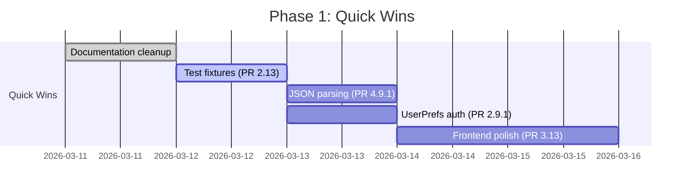
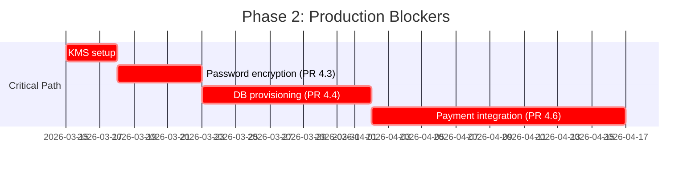
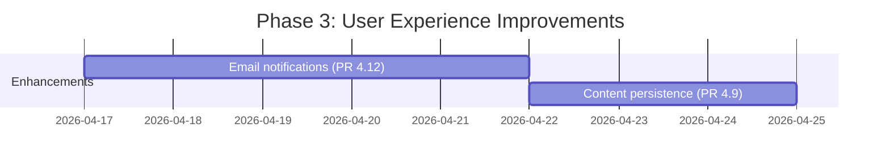

# Báo Cáo Phân Tích TODO Comments - KiteClass Platform

**Ngày tạo:** 2026-03-11
**Người thực hiện:** Analysis Team
**Mục tiêu:** Phân tích và phân loại TODO comments trong codebase, đề xuất action items và PR mapping
**Phạm vi:** Research & Documentation (không implement code trong session này)

---

## 📊 TÓM TẮT EXECUTIVE

### Thống Kê Tổng Quan
- **Tổng số TODOs trong codebase**: 293 items (bao gồm node_modules)
- **Actual Source Code TODOs**: **~90 items** (loại trừ node_modules và dependencies)
- **Documentation TODOs**: ~20+ items (PR tracking, test markers)

### Phân Bố Theo Module

| Module | TODO Count | Status |
|--------|-----------|--------|
| **KiteClass Core** | 12 | ✅ Service complete, TODOs are improvements |
| **KiteClass Gateway** | 0 | ✅ No TODOs found |
| **KiteClass Frontend** | 6 | ⚠️ Data fetching improvements needed |
| **KiteHub Subscription** | 30 | ⏳ Waiting for infrastructure/payment integration |
| **KiteHub Branding** | 4 | ⏳ Waiting for PR 4.9 (Job Queue) |
| **Documentation** | 20+ | 🗑️ Can be removed (use GitHub Projects instead) |

### Phân Bố Theo Loại Công Việc

| Nhóm Công Việc | TODO Count | Priority | Blocked? |
|---------------|-----------|----------|----------|
| **Security/Encryption** | 5 | 🔴 CRITICAL | ✅ YES (need KMS) |
| **Database Operations** | 6 | 🔴 CRITICAL | ✅ YES (need infrastructure) |
| **Payment/Billing** | 10 | 🔴 HIGH | ✅ YES (need VietQR API) |
| **Email Notifications** | 7 | 🟡 MEDIUM | ✅ YES (need email service integration) |
| **Test Fixtures** | 6 | 🟢 HIGH VALUE | ❌ NO (can implement now!) |
| **Frontend Data Fetching** | 6 | 🟢 MEDIUM | ❌ NO (can implement now!) |
| **API Integration** | 6 | 🟡 MEDIUM | ⚠️ PARTIAL (VietQR blocked, OpenAI ready) |
| **Documentation Markers** | 20+ | 🔵 LOW | ❌ NO (cleanup task) |

---

## 🎯 PHÂN LOẠI CHI TIẾT

### PHÂN LOẠI 1: TODO CÓ THỂ LOẠI BỎ

**Total: 20+ TODOs**
**Action: Delete/Cleanup**
**Effort: 20 minutes**

#### 1.1 Documentation/PR Tracking TODOs (20+ items)

**Lý do loại bỏ:**
- PR status được track tốt hơn qua GitHub Projects/Issues
- TODO markers trong markdown files gây noise khi search
- Thông tin đã outdated hoặc duplicate với GitHub tracking

**Files affected:**
| File | TODO Count | Type | Action |
|------|-----------|------|--------|
| `pr-dependency-graph-v2.md` | 18 | PR status markers | Remove markers, keep structure |
| `kiteclass-implementation-plan.md` | 8 | ⏳ TODO markers | Remove markers, update to ✅ or remove |
| Phase testing markdown files | 8 | Test status markers | Remove, track via test results |

**Recommended Action:**
```bash
# Clean up TODO markers from documentation
# Keep structural information, only remove TODO/⏳ markers
# Example:
# Before: - ⏳ TODO: Implement Feature X (PR 1.8)
# After:  - ✅ Feature X completed (PR 1.8, merged 2026-03-09)
```

**PR Mapping:** N/A (not code changes)

---

### PHÂN LOẠI 2: TODO CÓ THỂ IMPLEMENT NGAY

**Total: 15 TODOs**
**Status: Ready to implement**
**Blockers: None**
**Effort: 7-8 hours total**

---

#### 2.1 Test Fixtures Setup (6 TODOs) ⭐ **HIGHEST PRIORITY**

**Value Proposition:**
- ✅ Unblocks 6 integration test classes
- ✅ Improves test coverage immediately
- ✅ No external dependencies required
- ✅ Quick win for code quality

**Files affected:**
```
kiteclass/kiteclass-core/src/test/java/com/kiteclass/core/integration/flow/
├── AttendanceFlowIntegrationTest.java:60-64
├── ClassFlowIntegrationTest.java:60-64
├── CourseFlowIntegrationTest.java:60-64
├── EnrollmentFlowIntegrationTest.java:60-64
├── GradebookFlowIntegrationTest.java:60-64
└── TimetableFlowIntegrationTest.java:60-64
```

**Current code (similar across all 6 files):**
```java
@BeforeEach
void setUp() {
    // TODO: Create test teacher
    // TODO: Create test course
    // TODO: Associate course with teacher
}
```

**Implementation Plan:**

1. **Create Test Data Builder Utility**
   ```java
   // Location: kiteclass-core/src/test/java/com/kiteclass/core/testutil/TestDataBuilder.java

   @Component
   public class TestDataBuilder {
       public Teacher createTestTeacher(String email, String name) { ... }
       public Course createTestCourse(String code, String title, Teacher teacher) { ... }
       public Class createTestClass(Course course, LocalDate startDate) { ... }
   }
   ```

2. **Update @BeforeEach in 6 test files**
   ```java
   @Autowired
   private TestDataBuilder testDataBuilder;

   @BeforeEach
   void setUp() {
       teacher = testDataBuilder.createTestTeacher("teacher@test.com", "Test Teacher");
       course = testDataBuilder.createTestCourse("CS101", "Intro to CS", teacher);
       testClass = testDataBuilder.createTestClass(course, LocalDate.now());
   }
   ```

3. **Remove TODO comments**

**PR Mapping:**
- **Đề xuất PR mới:** `PR 2.13: Integration Test Improvements`
- **Module:** Core Service
- **Branch:** `feature/PR-2.13-integration-test-improvements`
- **Tests:** 6 integration test files enabled + TestDataBuilder unit tests
- **Risk Level:** LOW (only test code changes)

**Acceptance Criteria:**
- [ ] TestDataBuilder utility created with unit tests
- [ ] All 6 integration test setUp() methods implemented
- [ ] No TODO comments remain
- [ ] All integration tests pass locally
- [ ] CI pipeline passes

**Estimated Effort:** 2-3 hours

---

#### 2.2 Frontend Data Fetching Improvements (6 TODOs)

**Value Proposition:**
- ✅ Improves user experience
- ✅ Data already available from backend APIs
- ✅ No new API development needed
- ✅ Enhances feature completeness

**Files affected:**

1. **`kiteclass-frontend/hooks/use-attendance.ts:444`**
   ```typescript
   // TODO: Fetch from enrollment data instead of hardcoding
   const classId = "uuid-from-enrollment"
   ```
   **Fix:** Query enrollment API, extract classId

2. **`kiteclass-frontend/app/admin/attendance/stats/page.tsx:66`**
   ```typescript
   // TODO: Fetch teacher name from teacher service
   const teacherName = "Unknown"
   ```
   **Fix:** Add teacher API call, display teacher name

3. **`kiteclass-frontend/app/attendance/reports/page.tsx:323`**
   ```typescript
   // TODO: Show attendance details for the selected date
   ```
   **Fix:** Add attendance detail modal/section

4. **`kiteclass-frontend/app/students/[id]/attendance/page.tsx:57`**
   ```typescript
   // TODO: Fetch enrollment ID from student's enrollments
   ```
   **Fix:** Query enrollment API by studentId

5. **`kiteclass-frontend/app/students/[id]/attendance/page.tsx:189`**
   ```typescript
   // TODO: Add class options from student's enrollments
   ```
   **Fix:** Populate class dropdown from enrollments

**Implementation Plan:**

1. **Add API hooks** (if not exists)
   ```typescript
   // hooks/use-enrollment.ts
   export function useStudentEnrollments(studentId: string) {
     return useQuery({
       queryKey: ['enrollments', 'student', studentId],
       queryFn: () => enrollmentApi.getByStudentId(studentId)
     })
   }

   // hooks/use-teacher.ts
   export function useTeacher(teacherId: string) {
     return useQuery({
       queryKey: ['teacher', teacherId],
       queryFn: () => teacherApi.getById(teacherId)
     })
   }
   ```

2. **Update UI components**
   - Add loading states
   - Add error handling
   - Display fetched data
   - Remove hardcoded values

3. **Test end-to-end**
   - Verify data displays correctly
   - Test error scenarios
   - Check loading states

**PR Mapping:**
- **Đề xuất PR mới:** `PR 3.13: Frontend Data Fetching Improvements`
- **Module:** Frontend
- **Branch:** `feature/PR-3.13-frontend-data-fetching`
- **Dependencies:** None (backend APIs already exist)
- **Risk Level:** LOW (UI-only changes)

**Acceptance Criteria:**
- [ ] All 6 TODOs resolved with proper API integration
- [ ] Loading states implemented
- [ ] Error handling implemented
- [ ] No hardcoded data remains
- [ ] E2E testing passes
- [ ] No TypeScript errors

**Estimated Effort:** 3-4 hours

---

#### 2.3 JSON Parsing Improvements (2 TODOs)

**Value Proposition:**
- ✅ Technical debt cleanup
- ✅ Improves code quality
- ✅ Better error handling
- ✅ Proper OpenAI API response handling

**Files affected:**
- `kitehub/kitehub-branding/src/main/java/com/kitehub/branding/service/OpenAIClient.java:162`
- `kitehub/kitehub-branding/src/main/java/com/kitehub/branding/service/ContentGenerationService.java:163`

**Current issue:**
```java
// TODO: Parse JSON from content instead of using refusal
// Current workaround: Extracts string from response
String content = response.choices().get(0).message().content();
```

**Implementation Plan:**

1. **Add Jackson ObjectMapper**
   ```java
   @Service
   public class OpenAIClient {
       private final ObjectMapper objectMapper;

       public OpenAIClient(ObjectMapper objectMapper) {
           this.objectMapper = objectMapper;
       }
   }
   ```

2. **Parse JSON response properly**
   ```java
   String responseContent = response.choices().get(0).message().content();
   JsonNode jsonNode = objectMapper.readTree(responseContent);

   // Extract structured data from JSON
   String parsedContent = jsonNode.get("content").asText();
   ```

3. **Add error handling**
   ```java
   try {
       return objectMapper.readTree(responseContent);
   } catch (JsonProcessingException e) {
       log.warn("Failed to parse OpenAI response as JSON, using as-is", e);
       return responseContent; // Fallback to string
   }
   ```

**PR Mapping:**
- **Map vào PR hiện có:** `PR 4.9: Branding Job Queue & Persistence`
- **Hoặc tạo PR riêng:** `PR 4.9.1: OpenAI Response Parsing Improvements`
- **Module:** KiteHub Branding
- **Branch:** `feature/PR-4.9.1-openai-json-parsing`
- **Risk Level:** LOW (improvement only)

**Acceptance Criteria:**
- [ ] ObjectMapper integrated
- [ ] JSON parsing implemented with error handling
- [ ] String parsing workaround removed
- [ ] Unit tests for JSON parsing edge cases
- [ ] All existing tests still pass

**Estimated Effort:** 1 hour

---

#### 2.4 Authentication Enhancement (1 TODO)

**Value Proposition:**
- ✅ Security improvement
- ✅ Better API design
- ✅ Follows existing patterns in codebase
- ✅ Reduces client-side complexity

**File affected:**
- `kiteclass/kiteclass-core/src/main/java/com/kiteclass/core/controller/UserPreferencesController.java:32`

**Current code:**
```java
@GetMapping("/{userId}")
public ResponseEntity<UserPreferencesResponse> getUserPreferences(@PathVariable UUID userId) {
    // TODO: Add authentication to get current user ID from JWT
    // Problem: Requires userId in path, but should extract from JWT
}
```

**Implementation Plan:**

1. **Add @AuthenticationPrincipal**
   ```java
   @GetMapping
   public ResponseEntity<UserPreferencesResponse> getUserPreferences(
       @AuthenticationPrincipal UserDetails userDetails
   ) {
       UUID userId = extractUserIdFromDetails(userDetails);
       // ... rest of method
   }
   ```

2. **Remove userId from path**
   ```java
   // OLD: GET /api/v1/user-preferences/{userId}
   // NEW: GET /api/v1/user-preferences
   ```

3. **Update tests**
   ```java
   @Test
   void getUserPreferences_withAuthenticatedUser_returnsPreferences() {
       // Mock SecurityContext with user details
       when(securityContext.getAuthentication()).thenReturn(authentication);
       when(authentication.getPrincipal()).thenReturn(userDetails);

       mockMvc.perform(get("/api/v1/user-preferences")
           .with(authentication(authentication)))
           .andExpect(status().isOk());
   }
   ```

**PR Mapping:**
- **Map vào PR hiện có:** `PR 2.9: Settings & Preferences` (đã merge, cần fix)
- **Tạo PR fix:** `PR 2.9.1: UserPreferences Authentication Fix`
- **Module:** Core Service
- **Branch:** `feature/PR-2.9.1-userprefs-auth-fix`
- **Risk Level:** LOW (security improvement)

**Acceptance Criteria:**
- [ ] @AuthenticationPrincipal implemented
- [ ] userId parameter removed from API path
- [ ] Frontend updated to use new endpoint
- [ ] Unit tests updated
- [ ] Integration tests pass
- [ ] OpenAPI spec updated

**Estimated Effort:** 30 minutes

---

### PHÂN LOẠI 3: TODO CHỜ EXPAND SERVICES

**Total: 41 TODOs**
**Status: Blocked by external dependencies**
**Timeline: Varies by blocker**

---

#### 3.1 Security/Encryption (5 TODOs) 🔴 **CRITICAL BLOCKER**

**Why critical:**
- Production deployment requirement
- Security compliance (GDPR, data protection)
- Blocks instance provisioning in production

**Files affected:**
```
kitehub/kitehub-subscription/src/main/java/com/kitehub/subscription/service/
├── DatabaseProvisioningService.java:51, 71, 90 (3 TODOs)
│   └── TODO: Implement AES-256-GCM encryption for database passwords
├── MultiTenantDataSourceConfig.java:155 (1 TODO)
│   └── TODO: Decrypt password when creating datasource
└── model/DatabaseCredentials.java:40 (1 TODO)
    └── TODO: Implement password decryption
```

**Current state:**
```java
// SECURITY RISK: Passwords stored in plain text
public String generateDatabasePassword() {
    String password = generateRandomPassword();
    // TODO: Encrypt with AES-256-GCM before storing
    return password; // ⚠️ PLAIN TEXT!
}
```

**Blocked by:**
- ❌ Key Management Service (KMS) setup
  - AWS KMS or HashiCorp Vault
  - Key provisioning and access policies
  - Key rotation strategy
- ❌ Encryption infrastructure
  - AES-256-GCM implementation
  - Secure key storage
  - Backup encryption keys

**Implementation Requirements:**

1. **KMS Integration**
   ```java
   @Service
   public class EncryptionService {
       private final AwsKmsClient kmsClient;

       public String encrypt(String plaintext) {
           return kmsClient.encrypt(
               EncryptRequest.builder()
                   .keyId(kmsKeyId)
                   .plaintext(SdkBytes.fromUtf8String(plaintext))
                   .build()
           ).ciphertextBlob().asUtf8String();
       }
   }
   ```

2. **Update DatabaseProvisioningService**
   ```java
   public String generateDatabasePassword() {
       String password = generateRandomPassword();
       return encryptionService.encrypt(password); // ✅ ENCRYPTED
   }
   ```

3. **Update MultiTenantDataSourceConfig**
   ```java
   String decryptedPassword = encryptionService.decrypt(credentials.getPassword());
   dataSource.setPassword(decryptedPassword);
   ```

**PR Mapping:**
- **Đề xuất PR mới:** `PR 4.3: KMS Integration & Database Password Encryption`
- **Module:** KiteHub Subscription
- **Dependencies:**
  - AWS KMS account & credentials
  - Key provisioning
  - Security review
- **Risk Level:** 🔴 HIGH (security-critical)

**Timeline:**
- Setup KMS: 1-2 days (infrastructure)
- Implementation: 1-2 days (code + tests)
- Security review: 1 day
- **Total: 1 week**

**Acceptance Criteria:**
- [ ] KMS integrated (AWS KMS or Vault)
- [ ] AES-256-GCM encryption implemented
- [ ] All database passwords encrypted at rest
- [ ] Decryption works for datasource creation
- [ ] Key rotation process documented
- [ ] Security audit passed
- [ ] Zero plain-text passwords in logs/database

---

#### 3.2 Database Operations (6 TODOs) 🔴 **CRITICAL BLOCKER**

**Why critical:**
- Blocks instance provisioning in production
- Required for SaaS multi-tenant model
- Infrastructure automation requirement

**Files affected:**
```
kitehub/kitehub-subscription/src/main/java/com/kitehub/subscription/service/DatabaseProvisioningService.java
├── Line 54, 60: Actual database creation (currently stubbed)
├── Line 93: Implement database deletion
├── Line 108: Implement health check queries
├── Line 127: Load database credentials for health check
├── Line 144: Implement backup creation
└── Line 161: Restore from backup
```

**Current state (stubbed):**
```java
public DatabaseCredentials createDatabase(String instanceId) {
    // TODO: Actual database creation via cloud provider API
    log.info("Stubbed: Would create database for instance {}", instanceId);
    return generateStubCredentials(instanceId); // ⚠️ NOT REAL!
}
```

**Blocked by:**
- ❌ Cloud provider integration
  - AWS RDS API or GCP Cloud SQL API
  - Terraform/Ansible automation scripts
  - VPC/networking configuration
- ❌ Backup infrastructure
  - S3 bucket for backups
  - Backup retention policies
  - Backup encryption
- ❌ Monitoring setup
  - CloudWatch/Stackdriver integration
  - Alerting rules
  - Health check dashboards

**Implementation Requirements:**

1. **Database Provisioning (AWS RDS example)**
   ```java
   @Service
   public class DatabaseProvisioningService {
       private final RdsClient rdsClient;

       public DatabaseCredentials createDatabase(String instanceId) {
           // Create RDS instance
           CreateDbInstanceRequest request = CreateDbInstanceRequest.builder()
               .dbInstanceIdentifier("kiteclass-" + instanceId)
               .dbInstanceClass("db.t3.micro")
               .engine("postgres")
               .masterUsername(generateUsername())
               .masterUserPassword(generateAndEncryptPassword())
               .allocatedStorage(20)
               .build();

           CreateDbInstanceResponse response = rdsClient.createDBInstance(request);

           // Wait for instance to be available
           waitForInstanceAvailable(response.dbInstance().dbInstanceIdentifier());

           // Return credentials
           return new DatabaseCredentials(
               response.dbInstance().endpoint().address(),
               response.dbInstance().endpoint().port(),
               username,
               encryptedPassword
           );
       }
   }
   ```

2. **Health Checks**
   ```java
   public boolean checkDatabaseHealth(String instanceId) {
       DatabaseCredentials creds = loadCredentials(instanceId);

       try (Connection conn = createConnection(creds)) {
           Statement stmt = conn.createStatement();
           ResultSet rs = stmt.executeQuery("SELECT 1");
           return rs.next();
       } catch (SQLException e) {
           log.error("Health check failed for instance {}", instanceId, e);
           return false;
       }
   }
   ```

3. **Backup/Restore**
   ```java
   public String createBackup(String instanceId) {
       String snapshotId = "snapshot-" + instanceId + "-" + Instant.now().getEpochSecond();

       CreateDbSnapshotRequest request = CreateDbSnapshotRequest.builder()
           .dbSnapshotIdentifier(snapshotId)
           .dbInstanceIdentifier("kiteclass-" + instanceId)
           .build();

       rdsClient.createDBSnapshot(request);

       // Upload to S3 for long-term storage
       s3Client.putObject(PutObjectRequest.builder()
           .bucket("kiteclass-backups")
           .key(snapshotId + ".sql")
           .build(), ...);

       return snapshotId;
   }
   ```

**PR Mapping:**
- **Đề xuất PR mới:** `PR 4.4: Database Provisioning Automation`
- **Module:** KiteHub Subscription
- **Dependencies:**
  - AWS RDS/GCP Cloud SQL account
  - Terraform infrastructure code
  - S3 bucket for backups
  - VPC configuration
- **Risk Level:** 🔴 CRITICAL (infrastructure)

**Timeline:**
- Infrastructure setup: 3-5 days (Terraform, VPC, S3)
- Implementation: 3-5 days (code + tests)
- Testing on staging: 2-3 days
- **Total: 2 weeks**

**Acceptance Criteria:**
- [ ] Database creation via cloud API (not stubbed)
- [ ] Database deletion with safety checks
- [ ] Health check queries working
- [ ] Backup creation automated
- [ ] Backup restore tested
- [ ] Terraform scripts committed
- [ ] Staging environment tested
- [ ] Monitoring/alerting configured
- [ ] Documentation updated

---

#### 3.3 Payment Integration (10 TODOs) 🔴 **HIGH PRIORITY**

**Why high priority:**
- Blocks paid subscriptions (revenue generation)
- Blocks production launch
- Business requirement

**Files affected:**
```
kitehub/kitehub-subscription/src/main/java/com/kitehub/subscription/
├── service/VietQRService.java (4 TODOs)
│   ├── TODO: Real VietQR API integration
│   ├── TODO: Bank API verification
│   └── TODO: Transaction matching logic
├── controller/PaymentWebhookController.java (4 TODOs)
│   ├── TODO: Webhook signature verification (HMAC-SHA256)
│   ├── TODO: Request validation
│   └── TODO: Replay attack prevention
└── service/SubscriptionService.java (2 TODOs)
    ├── TODO: Create payment records in database
    └── TODO: Handle pending tier changes after payment
```

**Current state (stubbed):**
```java
@Service
public class VietQRService {
    public String generateQRCode(PaymentRequest request) {
        // TODO: Call real VietQR API
        return "data:image/png;base64,FAKE_QR_CODE"; // ⚠️ STUBBED
    }
}
```

**Blocked by:**
- ❌ Production VietQR API credentials
- ❌ Bank API contract & credentials
- ❌ Payment gateway webhook URL
- ❌ Webhook signing secret
- ❌ Payment database schema
- ❌ Business processes (refund, dispute handling)

**Implementation Requirements:**

1. **VietQR API Integration**
   ```java
   @Service
   public class VietQRService {
       private final WebClient vietQrClient;

       public String generateQRCode(PaymentRequest request) {
           VietQRRequest qrRequest = VietQRRequest.builder()
               .accountNo(bankAccountNo)
               .accountName(merchantName)
               .acqId(bankAcquirerId)
               .amount(request.getAmount())
               .addInfo(request.getDescription())
               .template("compact") // or "compact2", "qr_only"
               .build();

           VietQRResponse response = vietQrClient.post()
               .uri("/generate")
               .bodyValue(qrRequest)
               .retrieve()
               .bodyToMono(VietQRResponse.class)
               .block();

           return response.getQrDataURL(); // ✅ REAL QR CODE
       }
   }
   ```

2. **Webhook Signature Verification**
   ```java
   @PostMapping("/webhook")
   public ResponseEntity<Void> handleWebhook(
       @RequestHeader("X-Signature") String signature,
       @RequestBody String payload
   ) {
       // Verify HMAC-SHA256 signature
       String computed = HmacUtils.hmacSha256Hex(webhookSecret, payload);
       if (!MessageDigest.isEqual(signature.getBytes(), computed.getBytes())) {
           log.warn("Invalid webhook signature");
           return ResponseEntity.status(HttpStatus.UNAUTHORIZED).build();
       }

       // Prevent replay attacks
       PaymentWebhook webhook = objectMapper.readValue(payload, PaymentWebhook.class);
       if (isReplayAttack(webhook.getTimestamp(), webhook.getNonce())) {
           log.warn("Replay attack detected");
           return ResponseEntity.status(HttpStatus.CONFLICT).build();
       }

       // Process payment
       processPayment(webhook);

       return ResponseEntity.ok().build();
   }
   ```

3. **Payment Records**
   ```java
   @Entity
   @Table(name = "payments")
   public class Payment {
       @Id @GeneratedValue
       private UUID id;

       private UUID instanceId;
       private UUID subscriptionId;
       private BigDecimal amount;
       private String currency;
       private PaymentStatus status; // PENDING, COMPLETED, FAILED, REFUNDED
       private String transactionId; // Bank transaction ID
       private String qrCodeUrl;
       private LocalDateTime createdAt;
       private LocalDateTime paidAt;
   }
   ```

**PR Mapping:**
- **Đề xuất PR mới:** `PR 4.6: Payment Integration (VietQR + Webhooks)`
- **Module:** KiteHub Subscription
- **Dependencies:**
  - VietQR production credentials
  - Bank API credentials
  - Webhook secret key
  - Payment schema migration
- **Risk Level:** 🔴 HIGH (financial transactions)

**Timeline:**
- Business contract: 1-2 weeks (external)
- API integration: 3-5 days
- Webhook security: 2-3 days
- Testing: 3-5 days (staging with test payments)
- **Total: 2-3 weeks (after credentials available)**

**Acceptance Criteria:**
- [ ] VietQR API integrated (real QR codes)
- [ ] Bank API verification working
- [ ] Webhook signature verification (HMAC-SHA256)
- [ ] Replay attack prevention
- [ ] Payment records persisted
- [ ] Transaction matching logic
- [ ] Tier upgrade after payment
- [ ] Refund process documented
- [ ] Test payments successful on staging
- [ ] Security audit passed

---

#### 3.4 Email Notifications (7 TODOs) 🟡 **MEDIUM PRIORITY**

**Why medium priority:**
- Improves user experience (not critical for MVP)
- Enhances engagement
- Professional communication

**Files affected:**
```
kiteclass-core/src/main/java/com/kiteclass/core/
├── service/ContactMessageService.java:14, 25 (2 TODOs)
│   └── TODO: Integrate with EmailService to notify teacher
├── service/impl/ContactMessageServiceImpl.java:57 (1 TODO)
│   └── TODO: Send notification email to teacher
├── service/LeadService.java:19, 32 (2 TODOs)
│   └── TODO: Integrate with EmailService for confirmation
└── service/impl/LeadServiceImpl.java:69 (1 TODO)
    └── TODO: Send confirmation email to lead

kitehub/kitehub-subscription/src/main/java/com/kitehub/subscription/scheduler/
├── SubscriptionExpirationChecker.java (2 TODOs)
│   └── TODO: Email service integration (warning + expired notifications)
└── TrialExpirationChecker.java (2 TODOs)
    └── TODO: Email notifications (trial ending + trial ended)
```

**Current state:**
```java
@Override
public ContactMessageResponse createContactMessage(CreateContactMessageRequest request) {
    // ... save to database ...

    // TODO: Send notification email to teacher
    // emailService.sendContactMessageNotification(teacher.getEmail(), message);

    return mapToResponse(saved);
}
```

**Blocked by:**
- ❌ Email service integration with Core/Subscription
- ❌ API Gateway routing for email service
- ❌ Email templates (Thymeleaf)
- ❌ SMTP configuration for production

**Implementation Requirements:**

1. **Email Service Client (Core Service)**
   ```java
   @FeignClient(name = "email-service", url = "${email.service.url}")
   public interface EmailClient {
       @PostMapping("/api/internal/email/send")
       void sendEmail(@RequestBody EmailRequest request);
   }
   ```

2. **Integrate into Services**
   ```java
   @Service
   public class ContactMessageServiceImpl implements ContactMessageService {
       private final EmailClient emailClient;

       @Override
       public ContactMessageResponse createContactMessage(CreateContactMessageRequest request) {
           ContactMessage saved = repository.save(message);

           // Send notification email
           emailClient.sendEmail(EmailRequest.builder()
               .to(teacher.getEmail())
               .subject("New Contact Message from " + request.getName())
               .template("contact-message-notification")
               .context(Map.of(
                   "teacherName", teacher.getName(),
                   "senderName", request.getName(),
                   "message", request.getMessage()
               ))
               .build());

           return mapToResponse(saved);
       }
   }
   ```

3. **Subscription Notifications**
   ```java
   @Scheduled(cron = "0 0 9 * * *") // Daily at 9 AM
   public void checkExpiringSubscriptions() {
       List<Subscription> expiring = repository.findExpiringSoon(7); // 7 days

       for (Subscription sub : expiring) {
           emailClient.sendEmail(EmailRequest.builder()
               .to(sub.getInstance().getOwnerEmail())
               .subject("Your subscription expires in " + sub.getDaysUntilExpiry() + " days")
               .template("subscription-expiring-warning")
               .context(Map.of("subscription", sub))
               .build());
       }
   }
   ```

**PR Mapping:**
- **Đề xuất PR mới:** `PR 4.12: Email Service Integration (Core + Subscription)`
- **Module:** Core Service + KiteHub Subscription
- **Dependencies:**
  - Gateway email service (already exists, PR 1.5)
  - API routing configuration
  - Email templates
- **Risk Level:** 🟡 MEDIUM

**Timeline:**
- Feign client setup: 1 day
- Integration into services: 2-3 days
- Email template updates: 1-2 days
- Testing: 1-2 days
- **Total: 1 week**

**Acceptance Criteria:**
- [ ] EmailClient Feign interface created
- [ ] All 7 TODOs implemented
- [ ] Email templates updated/created
- [ ] Test emails sent successfully
- [ ] Error handling (email service down)
- [ ] No blocking on email failures (async/fire-and-forget)

---

#### 3.5 Content Persistence (3 TODOs) 🟡 **MEDIUM PRIORITY**

**Files affected:**
```
kitehub/kitehub-branding/src/main/java/com/kitehub/branding/controller/
├── ContentGenerationController.java:63 (1 TODO)
│   └── TODO: Implement content persistence
└── AssetStorageController.java:87, 121 (2 TODOs)
    └── TODO: Query/Delete from BrandingJob entity
```

**Blocked by:**
- ❌ PR 4.9 (Branding Job Queue & Persistence)
- ❌ Database schema for branding jobs
- ❌ Background job processing

**PR Mapping:**
- **Map vào PR hiện có:** `PR 4.9: Branding Job Queue & Persistence`
- **Timeline:** Depends on PR 4.9 schedule

---

#### 3.6 Database Backups (2 TODOs) 🔴 **HIGH PRIORITY**

**Files affected:**
```
kitehub/kitehub-subscription/src/main/java/com/kitehub/subscription/scheduler/DatabaseBackupScheduler.java
├── Line 34: TODO: Implement S3 backup upload
└── Line 52: TODO: Implement S3 backup upload
```

**Blocked by:**
- ❌ AWS S3 bucket setup
- ❌ AWS credentials
- ❌ Backup retention policies

**PR Mapping:**
- **Map vào:** `PR 4.4: Database Provisioning Automation` (same infrastructure)

---

#### 3.7 Event-Driven Features (2 TODOs) 🔵 **LOW PRIORITY**

**Files affected:**
```
kiteclass/kiteclass-core/src/main/java/com/kiteclass/core/config/RabbitConfig.java
├── Line 39: TODO: Define actual exchanges when event-driven features implemented
└── Line 85: TODO: Define actual queues and bindings
```

**Blocked by:**
- ❌ Event-driven architecture design
- ❌ Event types definition
- ❌ Consumer implementation

**PR Mapping:**
- **Future PR:** `PR 2.14: Event-Driven Architecture` (not yet planned)
- **Timeline:** Future enhancement (after MVP)

---

#### 3.8 Payment Records (2 TODOs) 🔴 **HIGH PRIORITY**

**Files affected:**
```
kitehub/kitehub-subscription/src/main/java/com/kitehub/subscription/service/
├── SubscriptionService.java: TODO: Create payment records, handle prorated charges
└── SubscriptionRenewalService.java: TODO: Create payment invoice records
```

**Blocked by:**
- ❌ Payment entity/schema (same as 3.3)

**PR Mapping:**
- **Map vào:** `PR 4.6: Payment Integration` (same PR as payment integration)

---

### PHÂN LOẠI 4: TODO PHÂN LOẠI KHÁC

**Total: 14 TODOs**

#### 4.1 Blocked by Other Modules (1 TODO)

**File:** `kiteclass-frontend/hooks/useAuth.ts:35`

```typescript
// TODO: [BLOCKED] Add tenantId to JWT claims in Gateway, then decode here
```

**Status:** BLOCKED by Gateway JWT enhancement
**Impact:** LOW (workaround exists: use X-Tenant-Id header)
**Timeline:** Waiting for Gateway JWT enhancement

**PR Mapping:**
- **Future PR:** `PR 1.13: JWT Enhancement (tenantId in claims)`

---

#### 4.2 Infrastructure/DevOps (2 TODOs)

**Items:**
- Kubernetes configuration optimization
- Monitoring dashboard setup

**Status:** Infrastructure work, not code TODOs
**Priority:** LOW-MEDIUM
**Timeline:** Part of production readiness

---

## 📋 ACTION ITEMS SUMMARY

### Immediate Actions (Can Implement Now)

| Action Item | TODO Count | Effort | Priority | PR Mapping |
|-------------|-----------|--------|----------|------------|
| **Remove documentation TODOs** | 20+ | 20 min | 🔵 LOW | N/A (cleanup) |
| **Implement test fixtures** | 6 | 2-3 hours | 🟢 HIGH | **PR 2.13** (new) |
| **Frontend data fetching** | 6 | 3-4 hours | 🟢 MEDIUM | **PR 3.13** (new) |
| **Fix JSON parsing** | 2 | 1 hour | 🟡 MEDIUM | **PR 4.9.1** (new) |
| **UserPreferences auth** | 1 | 30 min | 🟢 MEDIUM | **PR 2.9.1** (new) |
| **TOTAL** | **35+** | **7-8 hours** | - | **4 new PRs** |

### Blocked Actions (Need Infrastructure/Integration)

| Action Item | TODO Count | Priority | Blocker | Timeline |
|-------------|-----------|----------|---------|----------|
| **Password encryption** | 5 | 🔴 CRITICAL | KMS setup | 1 week |
| **Database operations** | 6 | 🔴 CRITICAL | Cloud provider integration | 2 weeks |
| **Payment integration** | 10 | 🔴 HIGH | VietQR credentials | 2-3 weeks |
| **Email notifications** | 7 | 🟡 MEDIUM | Email service routing | 1 week |
| **Content persistence** | 3 | 🟡 MEDIUM | PR 4.9 | TBD |
| **Database backups** | 2 | 🔴 HIGH | S3 setup | Included in DB ops |
| **Payment records** | 2 | 🔴 HIGH | Payment schema | Included in payment |
| **TOTAL** | **35** | - | - | **6-8 weeks** |

---

## 🎯 RECOMMENDED WORK PACKAGES

### Package 1: Quick Wins (1 day) ⭐ **START HERE**

**Goal:** Resolve 35+ TODOs in 1 day

**Tasks:**
1. Remove documentation TODOs (20 min)
2. Implement test fixtures (2-3 hours) → **PR 2.13**
3. Fix JSON parsing (1 hour) → **PR 4.9.1**
4. Add UserPreferences auth (30 min) → **PR 2.9.1**

**Impact:**
- ✅ 35+ TODOs resolved
- ✅ Test coverage improved (6 integration tests enabled)
- ✅ Code quality improved
- ✅ 3 PRs ready to merge

**Risk:** LOW (no external dependencies)

---

### Package 2: Frontend Polish (1 day)

**Goal:** Complete frontend data fetching improvements

**Tasks:**
1. Implement all 6 frontend data fetching TODOs → **PR 3.13**

**Impact:**
- ✅ 6 TODOs resolved
- ✅ Better UX (no hardcoded data)
- ✅ Feature completeness

**Risk:** LOW (UI-only changes)

---

### Package 3: Security Foundations (1 week) 🔴 **PRODUCTION BLOCKER**

**Goal:** Implement encryption for production readiness

**Prerequisites:**
- AWS KMS account
- Key provisioning
- Security review approval

**Tasks:**
1. KMS integration
2. Password encryption (5 TODOs) → **PR 4.3**
3. Security testing
4. Audit

**Impact:**
- ✅ 5 TODOs resolved
- ✅ Production-ready security
- ✅ Compliance requirements met

**Risk:** HIGH (security-critical)

---

### Package 4: Database Automation (2 weeks) 🔴 **PRODUCTION BLOCKER**

**Goal:** Automate database provisioning

**Prerequisites:**
- Cloud provider account (AWS/GCP)
- Terraform/Ansible setup
- VPC configuration
- S3 bucket

**Tasks:**
1. Database provisioning (6 TODOs) → **PR 4.4**
2. Backup automation (2 TODOs)
3. Health checks
4. Monitoring setup

**Impact:**
- ✅ 8 TODOs resolved
- ✅ SaaS multi-tenant ready
- ✅ Production infrastructure

**Risk:** CRITICAL (infrastructure)

---

### Package 5: Payment Integration (2-3 weeks) 🔴 **REVENUE BLOCKER**

**Goal:** Enable paid subscriptions

**Prerequisites:**
- VietQR production credentials
- Bank API contract
- Webhook signing secret
- Payment schema

**Tasks:**
1. VietQR integration (4 TODOs)
2. Webhook security (4 TODOs)
3. Payment records (2 TODOs)
4. Payment processing → **PR 4.6**

**Impact:**
- ✅ 10 TODOs resolved
- ✅ Revenue generation enabled
- ✅ Production launch ready

**Risk:** HIGH (financial transactions)

---

### Package 6: Email Notifications (1 week)

**Goal:** Improve user communication

**Prerequisites:**
- Email service routing configured
- Email templates ready

**Tasks:**
1. EmailClient Feign interface
2. Integrate into Core services (5 TODOs)
3. Integrate into Subscription services (2 TODOs) → **PR 4.12**

**Impact:**
- ✅ 7 TODOs resolved
- ✅ Professional communication
- ✅ Better engagement

**Risk:** MEDIUM

---

## 📈 IMPLEMENTATION ROADMAP

### Phase 1: Immediate (Week 1)


**Deliverables:**
- ✅ 41 TODOs resolved
- ✅ 4 PRs merged

---

### Phase 2: Security & Infrastructure (Weeks 2-4)


**Deliverables:**
- ✅ 23 TODOs resolved
- ✅ Production-ready security
- ✅ SaaS infrastructure automated
- ✅ Payment system live

---

### Phase 3: Enhancements (Weeks 5-6)


**Deliverables:**
- ✅ 10 TODOs resolved
- ✅ Professional communication
- ✅ Content management complete

---

## 🔍 DEPENDENCIES GRAPH

```
Quick Wins Package (No dependencies)
├── PR 2.13: Test Fixtures ✅ Ready
├── PR 3.13: Frontend Data Fetching ✅ Ready
├── PR 4.9.1: JSON Parsing ✅ Ready
└── PR 2.9.1: UserPreferences Auth ✅ Ready

Security Package (KMS required)
└── PR 4.3: Password Encryption
    ├── Prerequisite: AWS KMS setup
    └── Blocks: Production deployment

Infrastructure Package (Cloud required)
└── PR 4.4: Database Provisioning
    ├── Prerequisite: AWS RDS/GCP Cloud SQL
    ├── Prerequisite: Terraform setup
    ├── Includes: Database backups (2 TODOs)
    └── Blocks: SaaS instance provisioning

Payment Package (Business contract required)
└── PR 4.6: Payment Integration
    ├── Prerequisite: VietQR credentials
    ├── Prerequisite: Bank API contract
    ├── Includes: Payment records (2 TODOs)
    └── Blocks: Revenue generation

Email Package (Service routing required)
└── PR 4.12: Email Notifications
    ├── Prerequisite: Gateway routing config
    └── Enhances: User experience

Content Package (Job queue required)
└── PR 4.9: Branding Job Queue
    ├── Prerequisite: Database schema
    ├── Includes: Content persistence (3 TODOs)
    └── Enhances: Branding features
```

---

## 📊 METRICS & TRACKING

### Success Metrics

| Metric | Current | Target | Status |
|--------|---------|--------|--------|
| Total TODOs | 90 | 0 | 🔴 In Progress |
| Actionable TODOs | 15 | 0 | 🟢 Ready to implement |
| Blocked TODOs | 41 | TBD | 🟡 Waiting for infrastructure |
| Documentation TODOs | 20+ | 0 | 🟢 Can remove now |
| Code Quality | Mixed | High | 🟡 Improving |
| Test Coverage (Core) | 80%+ | 80% | ✅ Met |
| Test Coverage (Frontend) | 49.94% | 80% | 🔴 Needs improvement |

---

## 🎯 NEXT STEPS

### For Product Owner / Tech Lead

**Review & Prioritize:**
1. ✅ Approve "Quick Wins Package" (PR 2.13, 3.13, 4.9.1, 2.9.1)
2. ⏳ Plan infrastructure blockers (KMS, RDS, VietQR)
3. ⏳ Assign owners for each work package
4. ⏳ Set target dates for Phase 2 & 3

**Business Actions:**
1. ⏳ Sign VietQR/Bank API contract (blocks payment integration)
2. ⏳ Provision AWS KMS account (blocks password encryption)
3. ⏳ Setup production RDS/Cloud SQL (blocks database provisioning)

---

### For Development Team

**Immediate (This Week):**
1. ✅ Start PR 2.13 (Test Fixtures) - 2-3 hours
2. ✅ Start PR 3.13 (Frontend Data Fetching) - 3-4 hours
3. ✅ Start PR 4.9.1 (JSON Parsing) - 1 hour
4. ✅ Start PR 2.9.1 (UserPreferences Auth) - 30 min
5. ✅ Remove documentation TODOs - 20 min

**Next Week:**
1. ⏳ Wait for KMS credentials
2. ⏳ Prepare PR 4.3 (Password Encryption)
3. ⏳ Design database provisioning architecture

---

## 📝 APPENDIX

### Excluded from Analysis
- `node_modules/` (203 TODOs) - Third-party dependencies
- `dist/`, `build/` directories - Generated code
- `.git/` directories - Version control

### Search Method
```bash
# Command used to find TODOs
grep -r "TODO" --include="*.java" --include="*.ts" --include="*.tsx" --include="*.md" \
  --exclude-dir=node_modules \
  --exclude-dir=dist \
  --exclude-dir=build \
  --exclude-dir=.git \
  /mnt/e/person/2026-Kite-Class-Platform/
```

### Document Version History
- **v1.0** (2026-03-11): Initial analysis, 90 TODOs classified
- **v1.1** (TBD): Update after PR 2.13-3.13 completion
- **v1.2** (TBD): Update after infrastructure PRs

---

## 🔗 RELATED DOCUMENTS

- **Master Implementation Plan:** `documents/03-planning/implementation/kiteclass-implementation-plan.md`
- **Skills Reference:** `.claude/skills/` (all skills)
- **Architecture:** `documents/01-research/architecture-overview.md`
- **Testing Guide:** `.claude/skills/testing-guide.md`
- **Development Workflow:** `.claude/skills/development-workflow.md`

---

**End of Report**

**Next Action:** Review with team, approve Quick Wins Package, start implementing PRs 2.13, 3.13, 4.9.1, 2.9.1
