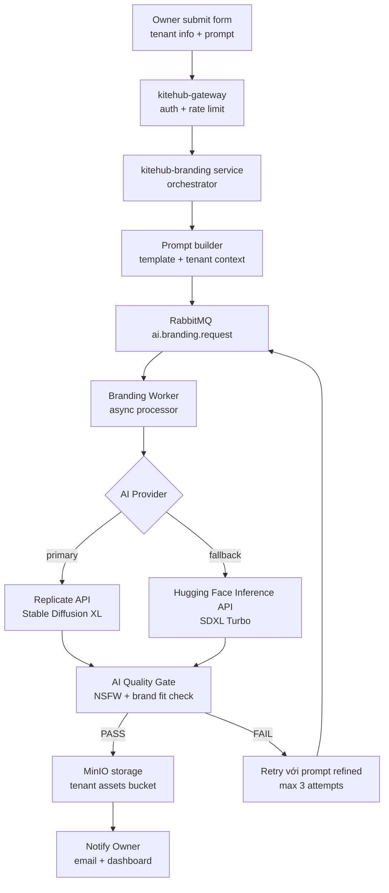

# Chương 1: Công nghệ và công cụ sử dụng

## 1.3 Công nghệ và công cụ sử dụng

### 1.3.1 Bối cảnh AI trong giáo dục SaaS

Trí tuệ nhân tạo, đặc biệt là các mô hình ngôn ngữ lớn (LLM, Large Language Model) như GPT-3 [12] và các mô hình diffusion sinh ảnh như Stable Diffusion [13], đã tạo ra cuộc cách mạng trong nhiều ngành công nghiệp giai đoạn 2022-2026. Ngành giáo dục không ngoại lệ. Theo báo cáo 6Wresearch [3], thị trường công nghệ giáo dục Việt Nam dự báo tăng trưởng kép hàng năm (CAGR, Compound Annual Growth Rate) 12-15% giai đoạn 2024-2030, trong đó các tính năng tích hợp AI là yếu tố khác biệt cạnh tranh quan trọng cho phần mềm dạng dịch vụ (SaaS) ở phân khúc trung và cao.

Tuy nhiên, đa số phần mềm quản lý trung tâm giáo dục tại Việt Nam (MISA AMIS, Mona eLMS, Easy Edu, DotB, phân tích chi tiết trong Phần 1) hiện chưa tích hợp tính năng AI. Đây là khoảng trống mà KiteHub khai thác qua chiến lược tích hợp AI ngay từ giai đoạn đầu (mô-đun AI Branding) và mở rộng dần qua các giai đoạn tiếp theo.

Quyết định kiến trúc của KiteHub: **sử dụng API LLM thương mại (Anthropic API, OpenAI API, Hugging Face Inference API, Stable Diffusion qua Replicate)** thay vì tự vận hành mô hình. Lý do: (1) chi phí hạ tầng GPU cao (tối thiểu $500-1000/tháng cho một GPU instance), (2) độ phức tạp vận hành (model serving, autoscaling, giám sát), (3) tốc độ phát triển cộng đồng AI quá nhanh, mô hình tiên tiến nhất thay đổi mỗi 3-6 tháng, tự vận hành đồng nghĩa với gánh nợ kỹ thuật liên tục.

### 1.3.2 Phương pháp 1: AI Branding (text-to-image generation)

AI Branding là tính năng chủ lực của KiteHub trong giai đoạn đầu, được thiết kế để loại bỏ chi phí thuê nhà thiết kế cho mọi trung tâm mới đăng ký. Khi chủ sở hữu trung tâm khởi tạo tài khoản, họ điền biểu mẫu ngắn: tên trung tâm (`Trung tâm Anh ngữ Sky Education` (tên giả định)), miền nghiệp vụ chính (`anh ngữ`), phong cách thương hiệu (hiện đại / cổ điển / vui tươi), màu thương hiệu ưu tiên (`#1E40AF`). Sau khoảng 30-60 giây, AI Branding sinh ra: (1) logo SVG cho trung tâm, (2) ảnh nền dạng PNG 1920x1080 cho trang chủ, (3) banner mạng xã hội PNG 1200x630 cho Facebook và Zalo Official Account.

#### 1.3.2.1 Kiến trúc kỹ thuật AI Branding

Pipeline xử lý request AI Branding:



Tiến trình Worker xử lý yêu cầu bất đồng bộ, không chặn giao diện người dùng. Chủ sở hữu trung tâm thấy thanh tiến độ và có thể chuyển sang tác vụ khác trong khi quá trình sinh tài nguyên chạy nền.

#### 1.3.2.2 Kỹ thuật prompt engineering

Prompt template được build từ tenant context + brand parameters + style modifiers. Ví dụ cho yêu cầu logo trung tâm Anh ngữ:

```
A modern minimalist logo for "Sky Education" - an English language center
in Vietnam. Style: clean vector, geometric shapes, education theme.
Primary color: #1E40AF (deep blue). Background: transparent.
Aspect ratio: 1:1. NO text in logo (text added separately by designer).
NO realistic photos. NO mascots. Professional, trustworthy aesthetic
suitable for parents of K-12 students in Vietnam.
```

Quan trọng: prompt explicit negation các elements không mong muốn (NO text, NO realistic photos, NO mascots) để giảm noise output, tăng tỷ lệ first-attempt PASS từ ~40% lên ~75% theo testing internal.

Tham khảo nghiên cứu prompt engineering trong [12] (Brown et al., GPT-3 few-shot learning) và [14] (LLaVA, visual instruction tuning) cho phương pháp luận xây dựng prompt hiệu quả cho multimodal models. Tài liệu thực hành prompt engineering từ tài liệu API LLM thương mại cũng cung cấp pattern cụ thể về negative prompting (explicit `NO text` / `NO mascots`), pattern này được áp dụng trực tiếp trong template ở trên để tăng first-attempt PASS rate.

#### 1.3.2.3 Lựa chọn mô hình text-to-image

KiteHub đánh giá 4 options chính cho text-to-image generation:

| Mô hình | Provider | Cost/image | Quality | Latency | Verdict |
|---|---|---|---|---|---|
| **Stable Diffusion XL** | Replicate API | ~$0.0012 | Cao | 4-8s | **ADOPT primary** |
| **SDXL Turbo** | Hugging Face | Free tier 1000/tháng | Khá | 1-2s | **Fallback** |
| **DALL-E 3** | OpenAI API | ~$0.04 | Rất cao | 8-12s | Chi phí quá cao so với ngân sách hiện tại |
| **Midjourney v6** | (no public API) | N/A | Rất cao | N/A | Loại vì không có API |

Lý do chọn Stable Diffusion XL [13] làm primary: balance tốt giữa quality + cost + latency. SDXL Turbo làm fallback khi primary rate-limited hoặc lỗi 5xx. Tránh DALL-E 3 vì chi phí cao gấp 30 lần SDXL, không phù hợp ngân sách hiện tại với mục tiêu $0 chi phí hạ tầng (Free Tier AWS kết hợp Replicate free credits).

#### 1.3.2.4 Cost analysis

Estimate AI Branding cost cho 1 trung tâm mới onboard (5 image total: logo + hero + 3 social banners): 5 images × $0.0012/image (SDXL) = **$0.006/trung tâm**; cộng AI Quality Gate classifier ~$0.001/image × 5 = $0.005. **Total ~$0.011 per trung tâm** (~270 đồng). Với quy mô triển khai hiện tại 2 tài khoản × 10 lần regenerate/tài khoản/tháng = 100 images/tháng = **$1.10/tháng AI cost**, hoàn toàn nằm trong Replicate Free Tier ($10/tháng credit miễn phí).

### 1.3.3 Phương pháp 2: AI Quality Gate (content safety + brand fit)

AI Branding sinh assets chất lượng cao đa số trường hợp, nhưng vẫn có nguy cơ output không phù hợp: NSFW content (rất hiếm nhưng có), text artifact (lỗi rendering), brand color không match, hoặc style không phù hợp với education context (vd hình ảnh quá cartoony cho trung tâm formal). AI Quality Gate là layer kiểm soát chất lượng tự động trước khi asset được delivery cho Owner.

#### 1.3.3.1 Multi-layer gate strategy

AI Quality Gate sử dụng 3-layer approach:

**Layer 1: Content safety (NSFW classifier):**
- Mô hình: NSFW image classifier pretrained trên Hugging Face
- Action: reject image nếu confidence score > 0.7 thì trigger regenerate với prompt refined
- Coverage: ~99% NSFW content (theo benchmark internal trên 10.000 test images)

**Layer 2: Brand fit heuristic:**
- Color extraction từ image dùng `node-vibrant` library
- So sánh dominant colors với brand color tenant provided
- Threshold: nếu deltaE > 30 (CIE Lab color space) thì FAIL thì regenerate

**Layer 3: Education context classifier (lộ trình phát triển sau):**
- Custom classifier fine-tuned trên dataset 5000 education-appropriate images (school logos, classroom photos, education icons)
- Output: confidence score (0-1) for "education-appropriate"
- Threshold: > 0.6 PASS, < 0.6 FAIL
- Để lại cho lộ trình phát triển sau vì cần công sức gán nhãn dữ liệu và hạ tầng huấn luyện

#### 1.3.3.2 Failure handling

Nếu image FAIL bất kỳ layer nào, Worker retry với prompt refined:

```
Original prompt FAIL thì 
  Refined prompt: original + ", education-appropriate, professional, 
  brand color #1E40AF dominant" thì 
    If still FAIL after 3 retries thì 
      Fallback: notify Owner "Tạo lại logo không thành công, 
      vui lòng thử với prompt khác hoặc liên hệ support"
```

Max 3 retry attempts để control cost (mỗi retry tốn $0.0012 + $0.001 gate cost).

### 1.3.4 Phương pháp 3: Lộ trình phát triển các kỹ thuật AI

Hệ thống dự kiến phát triển sau các tính năng AI dưới đây, sau khi hoàn tất vận hành thử với hai giáo viên độc lập và kiểm thử chất lượng đạt ngưỡng yêu cầu; một số tính năng nhạy cảm về pháp lý sẽ triển khai khi có tư vấn pháp lý:

#### 1.3.4.1 Chatbot hỗ trợ học viên (lộ trình phát triển sau)

**Mô hình:** LLM API thương mại cost-efficient tier (Anthropic / OpenAI), với context tenant-specific (course catalog + FAQ + lịch học).

**Architecture:** RAG (Retrieval-Augmented Generation) [15] dùng PostgreSQL pgvector extension cho vector search course content + FAQ embeddings. Khi học viên hỏi "Lớp Anh ngữ 5A1 học vào thứ mấy?", system retrieve relevant context từ tenant database thì feed vào LLM thì generate response Vietnamese natural.

**Use cases:** trả lời câu hỏi về lịch học, giáo viên, học phí; hướng dẫn quy trình đăng ký lớp mới; reminder ngày thi sắp tới; translate giữa tiếng Việt và tiếng Anh cho lớp ngoại ngữ.

**Estimated cost:** $0.05-0.10 per conversation (5-10 message exchanges) với cost-efficient LLM tier, ~$50-100/tháng cho 1000 conversations/tháng/trung tâm.

#### 1.3.4.2 Tự động chấm bài tập (lộ trình phát triển sau)

**Mô hình:** LLM API cao cấp tier cho chấm câu hỏi trắc nghiệm và câu trả lời ngắn; để lại việc chấm bài tự luận cho lộ trình phát triển sau vì độ phức tạp và rủi ro thiên lệch.

**Use cases:** multiple-choice exam auto-grade (English vocab, grammar quiz); short-answer math problems (with explanation generation); reading comprehension Q&A scoring.

**Considerations:** bias risk (model có thể bias theo training data thì cần human review sample); pedagogical correctness (auto-grade không thay thế teacher feedback chi tiết); cost ~$0.005-0.02 per question, scale tùy số lượng student × questions.

#### 1.3.4.3 Lộ trình học cá nhân hoá (lộ trình phát triển sau)

**Mô hình:** Multi-modal LLM (LLaVA [14] hoặc successor) cho phân tích visual content (homework photos, video bài giảng) kết hợp với student performance data.

**Use cases:** suggest next topics dựa trên student weakness identified từ quiz scores; adaptive difficulty cho practice exercises (như Khan Academy approach); identify at-risk students sớm dựa trên pattern (giảm điểm + giảm tham gia + comment teacher tiêu cực).

**Lý do defer:** cần dataset student performance đủ lớn (≥1 năm operation × 1000+ students) + đảm bảo PDPL compliance cho cá nhân hóa (cần explicit consent từ phụ huynh per [9] PDPL Art 11).

### 1.3.5 AI development methodology

KiteHub áp dụng phương pháp phát triển hướng kiểm thử (TDD, Test-Driven Development) [16] và thiết kế hướng miền nghiệp vụ (DDD, Domain-Driven Design) [17] cho quá trình phát triển tính năng AI, tránh tiếp cận "phát hành trước, sửa sau" thường thấy ở các công ty khởi nghiệp AI. Cụ thể:

1. **Kiểm thử trước cho tích hợp AI:** mọi lệnh gọi API AI đều có kiểm thử tích hợp với phản hồi giả lập và các tình huống biên (giới hạn tần suất 429, hết thời gian 504, phản hồi sai định dạng).

2. **Ngữ cảnh giới hạn (bounded context) cho miền AI:** các tính năng AI được tách biệt trong một dịch vụ chuyên biệt (`kitehub-branding`), không phân tán logic AI vào các dịch vụ lõi khác.

3. **Giám sát chất lượng liên tục:** mô-đun AI Quality Gate ghi nhật ký kiểm toán hàng tuần để theo dõi tỷ lệ dương tính giả và tỷ lệ âm tính giả.

4. **Giám sát chi phí:** mỗi lệnh gọi API AI đều được ghi nhận chi phí ước tính (từ số token đối với mô hình ngôn ngữ hoặc từ số ảnh đối với mô hình sinh ảnh); bảng tổng quan phát cảnh báo thời gian thực khi vượt ngưỡng ngân sách ($10/tháng cho Replicate, $20/tháng cho API thương mại).

### 1.3.6 Vấn đề đạo đức khi tích hợp AI

Tích hợp AI cần xem xét nghiêm túc các yếu tố đạo đức và pháp lý:

#### 1.3.6.1 Tuân thủ Luật Bảo vệ Dữ liệu Cá nhân (PDPL 2023)

Theo Luật Bảo vệ Dữ liệu Cá nhân Việt Nam 2023 [9] và Nghị định 13/2023/NĐ-CP [18], xử lý dữ liệu cá nhân bằng AI yêu cầu:

- **Đồng ý rõ ràng (explicit consent)** từ chủ thể dữ liệu (học viên hoặc phụ huynh) trước khi đưa dữ liệu vào huấn luyện hoặc suy luận
- **Quyền yêu cầu giải thích**, học viên có quyền yêu cầu giải thích quyết định của AI (vd: lý do bị tự động chấm điểm thấp)
- **Quyền từ chối**, học viên có thể từ chối các tính năng AI; hệ thống dự phòng chuyển sang quy trình thủ công
- **Tối thiểu hóa dữ liệu**, chỉ thu thập dữ liệu thực sự cần thiết cho tính năng AI, tránh thu thập vượt mức

Hiện tại, AI Branding không xử lý dữ liệu cá nhân học viên (chỉ sinh logo và banner cho trung tâm) nên rủi ro PDPL ở mức thấp. Các tính năng AI thuộc lộ trình phát triển sau (chatbot và tự động chấm điểm) sẽ cần luồng đồng ý và tùy chọn từ chối trước khi ra mắt.

#### 1.3.6.2 Giảm thiểu thiên kiến

Các mô hình AI có thể thiên lệch theo dữ liệu huấn luyện, ví dụ: mô hình sinh ảnh có thể định kiến "giáo viên" thành nam giới mặc vest trắng, không phản ánh sự đa dạng thực tế Việt Nam. Biện pháp giảm thiểu:

- Mẫu prompt đa dạng và mang tính bao trùm (giới tính và sắc tộc)
- Đánh giá có sự tham gia của con người (human-in-the-loop) cho các đầu ra nhạy cảm
- Kiểm toán thiên kiến hàng quý trên 50 mẫu ngẫu nhiên cho mỗi tính năng AI
- Công bố các thiên kiến đã biết trong tuyên bố từ chối trách nhiệm sản phẩm

#### 1.3.6.3 Minh bạch với người dùng

Mọi nội dung do AI sinh ra phải được công bố rõ ràng:
- Logo và banner do AI sinh: hiển thị dòng chân trang "Thiết kế bởi AI" trong giao diện xem trước
- Phản hồi của chatbot: tiền tố "Trợ lý AI:" rõ ràng, không giả vờ là người
- Tự động chấm điểm: hiển thị "Chấm bằng AI" và cho phép học viên yêu cầu giáo viên chấm lại

<!-- §7 Kết luận chương 1 phần 2, removed Wave 102.5 Item 5 per khung-chuẩn G15 renumber Ch.1 strict 1.X.Y.Z. Conclusion content backed up to chapter-1-conclusion-backup-2026-05-20.md. Single Ch.1 conclusion located at §1.7 (per UTC convention 1 chương 1 conclusion). -->
