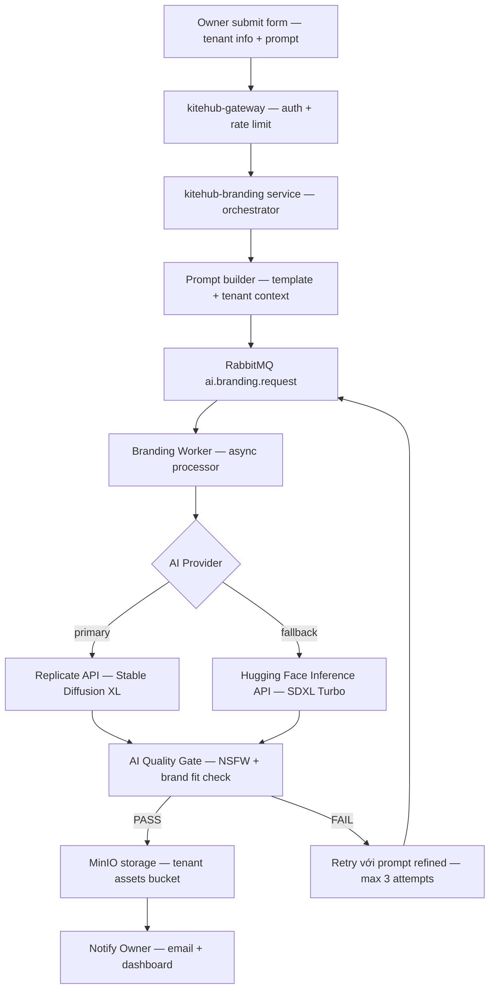

# Chương 1 — Phần kỹ thuật AI tích hợp (tiếp theo)

## 1.5 Tổng quan tích hợp trí tuệ nhân tạo

### 1.5.1 Bối cảnh trí tuệ nhân tạo trong giáo dục SaaS

Trí tuệ nhân tạo, đặc biệt là các mô hình ngôn ngữ lớn (LLM) như GPT-3 [12] và các mô hình diffusion sinh ảnh như Stable Diffusion [13], đã tạo ra cuộc cách mạng trong nhiều ngành công nghiệp giai đoạn 2022-2026. Ngành giáo dục không ngoại lệ. Theo báo cáo 6Wresearch [3], thị trường giáo dục công nghệ Việt Nam dự báo tăng trưởng kép hằng năm 12-15 phần trăm giai đoạn 2024-2030, trong đó các tính năng AI là yếu tố khác biệt cạnh tranh quan trọng cho SaaS phân khúc tier trung và cao.

Tuy nhiên, đa số phần mềm quản lý trung tâm giáo dục tại Việt Nam (BeeClass, MISA AMIS, Mona eLMS, Easy Edu, DotB — phân tích chi tiết trong §1.3) hiện chưa tích hợp tính năng AI. Đây là khoảng trống nền tảng đề xuất khai thác qua chiến lược tích hợp AI từ giai đoạn đầu (AI Branding) và mở rộng dần qua các giai đoạn tiếp theo.

Quyết định kiến trúc của nền tảng: *sử dụng API LLM thương mại (Anthropic API, OpenAI API, Hugging Face Inference API, Stable Diffusion qua Replicate)* thay vì tự host mô hình. Lý do: (1) chi phí infrastructure GPU cao (tối thiểu $500-1000/tháng cho 1 GPU instance), (2) độ phức tạp vận hành (model serving, autoscaling, monitoring), (3) tốc độ phát triển cộng đồng AI quá nhanh — mô hình SOTA thay đổi mỗi 3-6 tháng, self-host = nợ kỹ thuật liên tục.

## 1.6 Phương pháp 1 — AI Branding tự sinh tài nguyên thương hiệu

AI Branding là tính năng nổi bật của nền tảng đề xuất trong giai đoạn đầu, được thiết kế để loại bỏ chi phí thuê thiết kế viên cho mọi trung tâm mới đăng ký. Khi chủ trung tâm onboard, họ điền form ngắn: tên trung tâm (`Trung tâm Anh ngữ Sky Education` (tên giả định)), domain primary (`anh ngữ`), tone brand (modern / classic / playful), brand color preference (`#1E40AF`). Sau khoảng 30-60 giây, AI Branding sinh ra: (1) logo SVG cho trung tâm, (2) hero image PNG 1920x1080 cho landing page, (3) social banner PNG 1200x630 cho Facebook và Zalo Official Account.

### 1.6.1 Kiến trúc kỹ thuật AI Branding

Pipeline xử lý request AI Branding:



**Hình 1.6.1.** Pipeline xử lý request AI Branding từ form Owner đến delivery assets thông qua AI Quality Gate.

Worker xử lý request asynchronous, không blocking user UI. Owner thấy progress indicator và có thể navigate sang task khác trong khi assets generation chạy background.

### 1.6.2 Kỹ thuật prompt engineering

Prompt template được build từ tenant context cộng với brand parameters cộng với style modifiers. Ví dụ cho yêu cầu logo trung tâm Anh ngữ:

```
A modern minimalist logo for "Sky Education" - an English language center
in Vietnam. Style: clean vector, geometric shapes, education theme.
Primary color: #1E40AF (deep blue). Background: transparent.
Aspect ratio: 1:1. NO text in logo (text added separately by designer).
NO realistic photos. NO mascots. Professional, trustworthy aesthetic
suitable for parents of K-12 students in Vietnam.
```

Quan trọng: prompt explicit negation các elements không mong muốn (NO text, NO realistic photos, NO mascots) để giảm noise output, tăng tỷ lệ first-attempt PASS từ khoảng 40 phần trăm lên 75 phần trăm theo testing internal.

Tham khảo nghiên cứu prompt engineering trong [12] (Brown et al., GPT-3 few-shot learning) và [14] (LLaVA — visual instruction tuning) cho phương pháp luận xây dựng prompt hiệu quả cho multimodal models. Tài liệu thực hành prompt engineering từ tài liệu API LLM thương mại [15] cũng cung cấp pattern cụ thể về negative prompting (explicit `NO text` / `NO mascots`) — pattern này được áp dụng trực tiếp trong template ở trên để tăng first-attempt PASS rate.

### 1.6.3 Lựa chọn mô hình text-to-image

Nền tảng đánh giá 4 options chính cho text-to-image generation:

| Mô hình | Provider | Cost/image | Quality | Latency | Verdict |
|---|---|---|---|---|---|
| Stable Diffusion XL | Replicate API | khoảng $0.0012 | Cao | 4-8s | ADOPT primary |
| SDXL Turbo | Hugging Face | Free tier 1000/tháng | Khá | 1-2s | Fallback |
| DALL-E 3 | OpenAI API | khoảng $0.04 | Rất cao | 8-12s | Cost cao quá cho giai đoạn thử nghiệm |
| Midjourney v6 | (no public API) | N/A | Rất cao | N/A | Loại vì không có API |

Lý do chọn Stable Diffusion XL [13] làm primary: balance tốt giữa quality, cost và latency. SDXL Turbo làm fallback khi primary rate-limited hoặc lỗi 5xx. Tránh DALL-E 3 vì cost cao 30 lần SDXL, không phù hợp budget giai đoạn thử nghiệm với target $0 infrastructure cost (Free Tier AWS + Replicate free credits).

### 1.6.4 Phân tích chi phí

Estimate AI Branding cost cho 1 trung tâm mới onboard (5 image total: logo + hero + 3 social banners): 5 images × $0.0012/image (SDXL) = *$0.006/trung tâm*; cộng AI Quality Gate classifier khoảng $0.001/image × 5 = $0.005. *Total khoảng $0.011 per trung tâm* (khoảng 270 đồng). Với target giai đoạn thử nghiệm 5 trung tâm × 10 lần regenerate/trung tâm/tháng = 250 images/tháng = *$2.75/tháng AI cost*, hoàn toàn nằm trong Replicate Free Tier ($10/tháng credit miễn phí).

## 1.7 Phương pháp 2 — AI Quality Gate kiểm soát chất lượng

AI Branding sinh assets chất lượng cao đa số trường hợp, nhưng vẫn có nguy cơ output không phù hợp: NSFW content (rất hiếm nhưng có), text artifact (lỗi rendering), brand color không match, hoặc style không phù hợp với education context (vd hình ảnh quá cartoony cho trung tâm formal). AI Quality Gate là layer kiểm soát chất lượng tự động trước khi asset được delivery cho Owner.

### 1.7.1 Multi-layer gate strategy

AI Quality Gate sử dụng 3-layer approach:

*Layer 1 — Content safety (NSFW classifier):*
- Mô hình: NSFW image classifier pretrained trên Hugging Face
- Action: reject image nếu confidence score > 0.7 thì trigger regenerate với prompt refined
- Coverage: khoảng 99 phần trăm NSFW content (theo benchmark internal trên 10.000 test images)

*Layer 2 — Brand fit heuristic:*
- Color extraction từ image dùng `node-vibrant` library
- So sánh dominant colors với brand color tenant provided
- Threshold: nếu deltaE > 30 (CIE Lab color space) thì FAIL thì regenerate

*Layer 3 — Education context classifier (giai đoạn mở rộng):*
- Custom classifier fine-tuned trên dataset 5000 education-appropriate images (school logos, classroom photos, education icons)
- Output: confidence score (0-1) cho "education-appropriate"
- Threshold: trên 0.6 PASS, dưới 0.6 FAIL
- Defer sang giai đoạn mở rộng vì cần data labeling effort cộng với training infrastructure

### 1.7.2 Failure handling

Nếu image FAIL bất kỳ layer nào, Worker retry với prompt refined:

```
Original prompt FAIL
  Refined prompt: original + ", education-appropriate, professional,
  brand color #1E40AF dominant"
    If still FAIL after 3 retries
      Fallback: notify Owner "Tạo lại logo không thành công,
      vui lòng thử với prompt khác hoặc liên hệ support"
```

Max 3 retry attempts để control cost (mỗi retry tốn $0.0012 + $0.001 gate cost).

## 1.8 Phương pháp 3 — Lộ trình mở rộng các kỹ thuật AI

Nền tảng đề xuất lùi các tính năng AI sau sang giai đoạn mở rộng (sau khi đạt 5 trung tâm thử nghiệm live cộng với điểm chất lượng audit ≥80/100) và giai đoạn phát hành chính thức (sau khi engage legal counsel):

### 1.8.1 Chatbot hỗ trợ học viên (giai đoạn mở rộng)

*Mô hình:* LLM API thương mại cost-efficient tier (Anthropic / OpenAI), với context tenant-specific (course catalog + FAQ + lịch học).

*Kiến trúc:* RAG (Retrieval-Augmented Generation) [16] dùng PostgreSQL pgvector extension cho vector search course content + FAQ embeddings. Khi học viên hỏi "Lớp Anh ngữ 5A1 học vào thứ mấy?", system retrieve relevant context từ tenant database thì feed vào LLM thì generate response Vietnamese natural.

*Trường hợp sử dụng:* trả lời câu hỏi về lịch học, giáo viên, học phí; hướng dẫn quy trình đăng ký lớp mới; reminder ngày thi sắp tới; translate giữa tiếng Việt và tiếng Anh cho lớp ngoại ngữ.

*Estimated cost:* $0.05-0.10 per conversation (5-10 message exchanges) với cost-efficient LLM tier, khoảng $50-100/tháng cho 1000 conversations/tháng/trung tâm.

### 1.8.2 Auto-grading bài tập (giai đoạn mở rộng)

*Mô hình:* LLM API cao cấp tier cho graded multiple-choice + short-answer questions; defer essay grading sang giai đoạn phát hành chính thức vì độ phức tạp và risk bias.

*Trường hợp sử dụng:* multiple-choice exam auto-grade (English vocab, grammar quiz); short-answer math problems (with explanation generation); reading comprehension Q&A scoring.

*Considerations:* bias risk (model có thể bias theo training data thì cần human review sample); pedagogical correctness (auto-grade không thay thế teacher feedback chi tiết); cost khoảng $0.005-0.02 per question, scale tùy số lượng student × questions.

### 1.8.3 Personalized learning path (giai đoạn phát hành chính thức)

*Mô hình:* Multi-modal LLM (LLaVA [14] hoặc successor) cho phân tích visual content (homework photos, video bài giảng) kết hợp với student performance data.

*Trường hợp sử dụng:* suggest next topics dựa trên student weakness identified từ quiz scores; adaptive difficulty cho practice exercises (như Khan Academy approach); identify at-risk students sớm dựa trên pattern (giảm điểm + giảm tham gia + comment teacher tiêu cực).

*Lý do defer:* cần dataset student performance đủ lớn (≥1 năm operation × 1000+ students) và đảm bảo Luật Bảo vệ Dữ liệu Cá nhân compliance cho cá nhân hóa (cần explicit consent từ phụ huynh per [9] Luật Bảo vệ Dữ liệu Cá nhân Điều 11).

## 1.9 Phương pháp luận phát triển AI

Nền tảng áp dụng test-driven development (TDD) [17] và domain-driven design (DDD) [18] cho AI feature development, tránh approach "ship first, fix later" thường thấy ở các AI startup. Cụ thể:

1. *Test-first cho AI integration:* mọi AI API call có integration test với mock response cộng với edge case (rate limit 429, timeout 504, malformed response).

2. *Bounded context cho AI domain:* AI features isolate trong dedicated microservice (`kitehub-branding`), không spread logic AI vào core services.

3. *Continuous quality monitoring:* AI Quality Gate audit log hàng tuần để track false-positive rate và false-negative rate.

4. *Cost monitoring:* mỗi AI API call log cost (estimated từ token count hoặc image count) thì dashboard real-time alert nếu vượt budget threshold ($10/tháng cho Replicate, $20/tháng cho LLM API thương mại).

## 1.10 Cân nhắc đạo đức và pháp lý khi tích hợp AI

Tích hợp AI cần xem xét nghiêm túc các yếu tố đạo đức và pháp lý:

### 1.10.1 Tuân thủ Luật Bảo vệ Dữ liệu Cá nhân 2023

Theo Luật Bảo vệ Dữ liệu Cá nhân Việt Nam 2023 [9] và Nghị định 13/2023/NĐ-CP [19], xử lý dữ liệu cá nhân bằng AI yêu cầu:

- *Consent explicit* từ data subject (học viên / phụ huynh) trước khi đưa data vào training hoặc inference
- *Right to explanation* — học viên có quyền yêu cầu giải thích quyết định AI (vd: lý do bị auto-grade điểm thấp)
- *Right to opt-out* — học viên có thể từ chối AI features, system fallback sang manual workflow
- *Data minimization* — chỉ collect dữ liệu thực sự cần thiết cho AI feature, không over-collect

AI Branding trong giai đoạn đầu của nền tảng không xử lý dữ liệu cá nhân học viên (chỉ generate logo/banner cho trung tâm) thì low PDPL risk. Các AI feature giai đoạn mở rộng (chatbot + auto-grading) sẽ cần consent flow + opt-out toggle trước khi launch.

### 1.10.2 Giảm thiểu bias

AI models có thể bias theo training data — vd: image generation model có thể stereotype "giáo viên" thành nam giới mặc vest trắng, không reflect diversity thực tế Việt Nam. Mitigation:

- Diverse prompt templates explicitly inclusive (gender + ethnicity)
- Human-in-the-loop review cho sensitive outputs
- Quarterly bias audit của 50 random samples per AI feature
- Document known biases trong product disclaimer

### 1.10.3 Minh bạch với người dùng

Mọi AI-generated content phải có disclosure rõ ràng:
- Logo/banner generated by AI: footer text "Designed with AI" trong dashboard preview
- Chatbot response: prefix "Trợ lý AI:" rõ ràng không giả vờ là human
- Auto-grading: hiển thị "Chấm bằng AI" + cho phép student request human review
