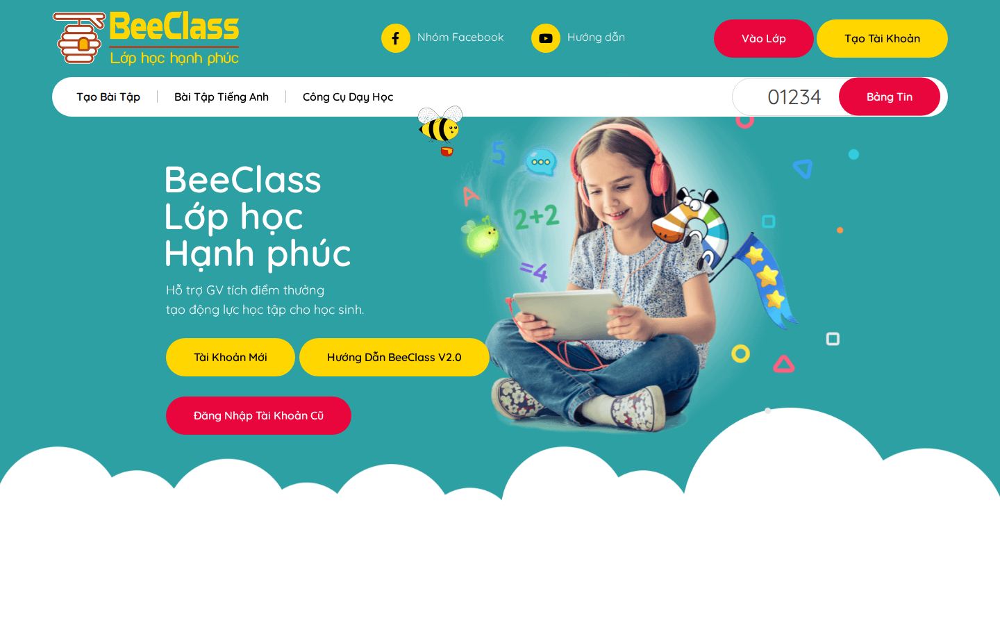
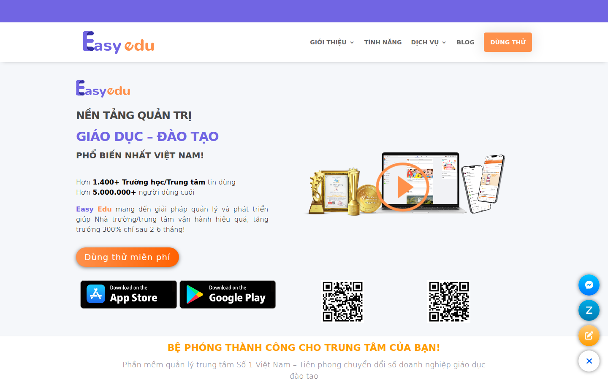
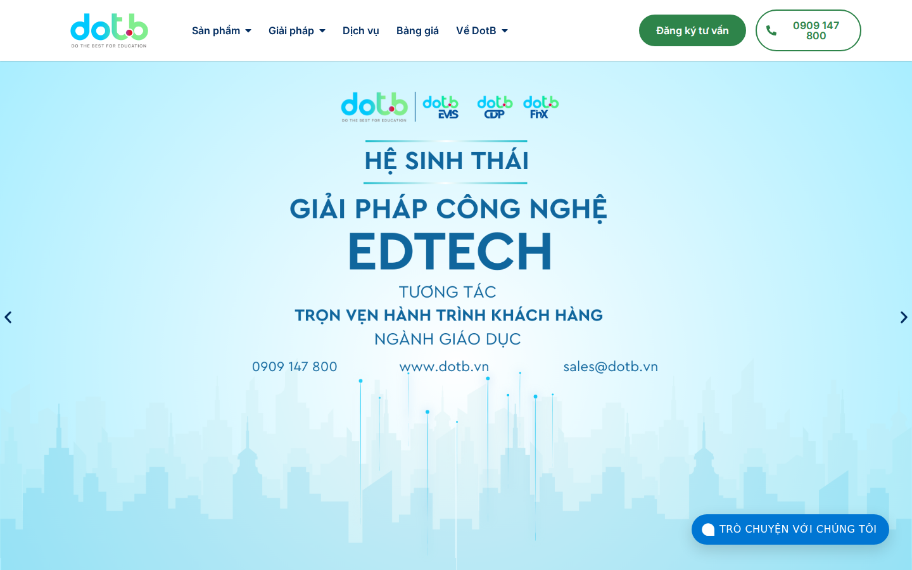

# Chương 1 — Tổng quan về bài toán và các công nghệ, công cụ

## 1.1 Hiện trạng

Thị trường phần mềm quản lý trung tâm giáo dục Việt Nam tăng trưởng mạnh giai đoạn 2020-2025, được thúc đẩy bởi ba yếu tố chính. Thứ nhất, ngành dạy thêm (trung tâm ngoại ngữ, tin học, năng khiếu) bùng nổ sau Thông tư 29/2024/TT-BGDĐT chính thức hóa hoạt động dạy thêm có thu phí [1], ước tính hơn 50.000 trung tâm hoạt động trên toàn quốc theo báo cáo công khai của Magenest 2024 [2] (truy cập ngày 20/05/2026). Thứ hai, phụ huynh Việt Nam có thói quen đầu tư mạnh cho giáo dục con cái, với mức chi trung bình 15-20% thu nhập hộ gia đình cho học thêm con theo công bố trên website của 6Wresearch [3] (truy cập ngày 20/05/2026) — chỉ số này phù hợp với báo cáo Kinh tế Số Việt Nam 2024 của VECITA về tăng trưởng chi tiêu EdTech trong cấu phần kinh tế số [4] (truy cập ngày 20/05/2026). Thứ ba, sau đại dịch COVID-19, các trung tâm buộc phải số hóa quy trình quản lý (điểm danh, học phí, lịch học, kênh liên lạc với phụ huynh) để duy trì hoạt động khi liên tục chuyển đổi giữa chế độ trực tuyến và trực tiếp.

Tuy nhiên, đa số trung tâm nhỏ và vừa (1-3 chi nhánh, dưới 500 học viên) vẫn dùng Excel kết hợp Zalo nhóm, thậm chí sổ ghi tay để quản lý. Lý do chính: phần mềm hiện có hoặc quá phức tạp (Cyber School, MISA EMIS [5] hướng đến trường công lập K-12), hoặc thiếu UX tiếng Việt (LMS quốc tế như Moodle, Canvas), hoặc chi phí cao không phù hợp với phân khúc trung tâm tự phát (Speed Manager, EduCom với mức 50-100 USD/tháng/cơ sở).

## 1.2 Khảo sát

Để xác định cơ hội và định vị sản phẩm, đề tài tiến hành khảo sát hai khía cạnh bổ trợ: các sản phẩm phần mềm quản lý trung tâm hiện có trên thị trường, và nhu cầu thực tế từ các nhóm người dùng cuối. Phần điều tra đối thủ dưới đây phân tích bốn sản phẩm tiêu biểu trong phân khúc trung tâm giáo dục tư nhân — BeeClass, Mona eLMS, Easy Edu và DotB — theo các tiêu chí phân khúc mục tiêu, mức giá, kiến trúc, khả năng tích hợp AI và mức tuân thủ pháp luật Việt Nam.

### 1.2.1 BeeClass — phần mềm quản lý trung tâm tiếng Anh phổ biến

*BeeClass* [25] là sản phẩm phần mềm quản lý trung tâm ngoại ngữ phổ biến tại thị trường Việt Nam, được vận hành bởi nhóm phát triển trong nước, định vị phục vụ các trung tâm tiếng Anh quy mô vừa. Sản phẩm cung cấp các module quản lý học viên, lớp học, điểm danh, học phí, gửi thông báo cho phụ huynh qua Zalo và email, kèm dashboard tổng quan doanh thu cho chủ trung tâm. Theo thông tin công bố trên website chính thức [25] (truy cập ngày 20/05/2026), BeeClass có hàng trăm trung tâm khách hàng tại nhiều tỉnh thành.

**Hình 1.1.** Giao diện trang chủ BeeClass — phần mềm quản lý trung tâm tiếng Anh phổ biến tại Việt Nam.
*Nguồn: https://beeclass.com, truy cập ngày 20/05/2026.*

Thế mạnh chính của BeeClass là giao diện tiếng Việt thân thiện và hỗ trợ workflow đặc thù của trung tâm tiếng Anh (lịch lớp định kỳ theo tuần, đăng ký lớp thử miễn phí, theo dõi tiến độ học viên theo từng kỹ năng nghe-nói-đọc-viết). Mức giá tham khảo công bố nằm trong khoảng 1-3 triệu đồng/tháng tùy gói và số lượng học viên. Điểm yếu chính của BeeClass tương tự các sản phẩm trong phân khúc: kiến trúc single-tenant theo từng trung tâm (mỗi khách hàng có instance database riêng, khó mở rộng khi trung tâm mở chi nhánh thứ 5 trở lên); chưa có tính năng AI sinh tài nguyên branding; onboarding yêu cầu liên hệ bộ phận kinh doanh chứ chưa hoàn toàn tự phục vụ; mức giá tuy phải chăng hơn các sản phẩm enterprise nhưng vẫn cao hơn mức 500.000đ/tháng mà phân khúc trung tâm tự phát nhỏ kỳ vọng.

### 1.2.2 Mona eLMS — chuyên ngoại ngữ và tin học

*Mona eLMS* [6] là sản phẩm của công ty Mona Software thành lập năm 2017, tập trung chuyên biệt vào phân khúc trung tâm ngoại ngữ và tin học. Theo công bố trên website chính thức [6] (truy cập ngày 20/05/2026), Mona eLMS có khoảng 800 khách hàng trung tâm tại Việt Nam tính đến năm 2024.

**Hình 1.2.** Giao diện trang chủ Mona eLMS — phần mềm quản lý trung tâm ngoại ngữ và tin học.
*Nguồn: https://mona.solutions, truy cập ngày 20/05/2026.*

Thế mạnh nổi bật của Mona là ứng dụng di động native iOS và Android cho học viên và phụ huynh, tích hợp Zalo Notification Service (ZNS) cho thông báo điểm danh, kết quả thi và lịch học — điểm chạm rất quan trọng với phụ huynh Việt Nam khi Zalo chiếm hơn 90% thị phần ứng dụng nhắn tin smartphone. Điểm yếu: hệ sinh thái đóng (không có API công khai), single-tenant theo từng trung tâm, mức giá 1,5-5 triệu đồng/tháng tùy số học viên với cơ chế báo giá tùy chỉnh không minh bạch.

### 1.2.3 Easy Edu — phân khúc trung tâm ngoại ngữ vừa và nhỏ

*Easy Edu* [7] là hệ thống lớn nhất trên thị trường trong phân khúc trung tâm ngoại ngữ vừa và nhỏ với hơn 1.400 trung tâm khách hàng theo công bố trên website chính thức [7] (truy cập ngày 20/05/2026). Sản phẩm ra mắt năm 2018, có hệ thống phân phối mạnh tại miền Bắc và miền Trung thông qua các sự kiện ngành giáo dục và hợp tác với hiệp hội trung tâm ngoại ngữ.

**Hình 1.3.** Giao diện trang chủ Easy Edu — phần mềm quản lý trung tâm ngoại ngữ phổ biến phân khúc vừa và nhỏ.
*Nguồn: https://easyedu.vn, truy cập ngày 20/05/2026.*

Tập tính năng đầy đủ gồm quản lý học viên, lớp học, học phí, điểm danh, báo cáo, tích hợp Zalo OA, ứng dụng di động cho phụ huynh, với mức giá phải chăng từ 800.000 đồng/tháng cho gói cơ bản phục vụ 200 học viên. Điểm yếu chính: kiến trúc single-tenant theo từng trung tâm (khó mở rộng nhượng quyền), không có khả năng tự sinh tài nguyên branding bằng AI, onboarding yêu cầu liên hệ bộ phận kinh doanh chứ chưa tự phục vụ.

### 1.2.4 DotB — phân khúc tầm trung và trường tư thục

*DotB* [8] là sản phẩm phần mềm quản lý giáo dục đa năng của công ty DotB Vietnam ra mắt năm 2019, hướng đến phân khúc trung tâm tầm trung và trường tư thục với giá trị thương vụ trung bình 3-8 triệu đồng/tháng theo bảng giá công bố trên website chính thức [8] (truy cập ngày 20/05/2026).

**Hình 1.4.** Giao diện trang chủ DotB — phần mềm quản lý giáo dục đa năng phân khúc tầm trung.
*Nguồn: https://dotb.vn, truy cập ngày 20/05/2026.*

Thế mạnh đặc thù của DotB là module CRM tích hợp phục vụ quản lý khách hàng tiềm năng (theo dõi học viên triển vọng từ biểu mẫu hỏi thông tin, qua lớp học thử, đến đăng ký chính thức) và tích hợp sẵn ba cổng thanh toán VNPay, MoMo, ZaloPay — giải quyết điểm đau của khoảng 80% trung tâm vẫn dùng chuyển khoản ngân hàng kèm đối soát thủ công. Điểm yếu: mức giá cao gấp 3-5 lần Easy Edu, định vị tầm trung không phục vụ phân khúc trung tâm tự phát quy mô nhỏ — không cạnh tranh trực tiếp với khoảng trống thị trường mà đề tài hướng đến.

### 1.2.5 Khảo sát nhu cầu sử dụng từ phía người dùng cuối

Bên cạnh khảo sát các hệ thống đang có trên thị trường, đề tài tổng hợp nhu cầu sử dụng từ năm nhóm người dùng cuối (end-user) dựa trên các báo cáo ngành công khai. Phân tích này giúp xác định những tính năng cốt lõi cần ưu tiên trong giai đoạn đầu của hệ thống đề xuất.

*Chủ trung tâm (Owner):* theo các báo cáo Magenest 2024 [2] và 6Wresearch 2024 [3] (cả hai truy cập ngày 20/05/2026), chủ trung tâm vừa và nhỏ (1-10 chi nhánh, 100-2000 học viên) ưu tiên ba nhu cầu chính: (i) quản lý học phí và đối chiếu thanh toán tự động (khoảng 80% trung tâm vẫn dùng chuyển khoản ngân hàng kèm đối soát thủ công, chiếm 4-6 giờ/tuần làm việc văn phòng — theo báo cáo VECITA 2024 [4] truy cập ngày 20/05/2026); (ii) báo cáo doanh thu, tỷ lệ giữ chân học viên, chi phí vận hành theo thời gian thực để ra quyết định mở hoặc đóng lớp; (iii) chi phí phần mềm thấp dưới 1,5 triệu đồng/tháng phù hợp biên lợi nhuận hiện hành 25-30%.

*Quản lý trung tâm (Manager):* nhu cầu chính tập trung vào quy trình vận hành hàng ngày — điểm danh tự động, lịch giảng dạy linh hoạt khi giáo viên thay ca, thông báo tự động cho phụ huynh khi học viên vắng mặt hoặc nghỉ học liên tiếp. Báo cáo VECITA 2024 [4] (truy cập ngày 20/05/2026) về kinh tế số trong giáo dục cho thấy khoảng 65% trung tâm gặp khó khăn vận hành khi vượt qua mốc 300 học viên do thiếu công cụ phân quyền và quy trình chuẩn hóa giữa các chi nhánh.

*Giáo viên độc lập (Solo Teacher):* nhóm giáo viên dạy thêm tự do (1-50 học viên) cần công cụ nhẹ, chi phí thấp dưới 500.000 đồng/tháng, ưu tiên: lịch học cá nhân, biểu mẫu thu học phí qua chuyển khoản kèm xác nhận tự động, gửi tài liệu học tập qua kênh quen thuộc (Zalo, email). Thông tư 29/2024/TT-BGDĐT [1] công nhận hợp pháp dạy thêm có thu phí mở ra phân khúc này, ước tính 50.000-100.000 giáo viên độc lập trên toàn quốc — tuy nhiên các hệ thống đang có trên thị trường đều định vị cho trung tâm tổ chức, chưa phục vụ nhóm cá nhân.

*Phụ huynh:* phụ huynh đầu tư 15-20% thu nhập hộ gia đình cho học thêm con [3], do đó nhu cầu minh bạch về tiến độ học tập và tài chính. Các nhu cầu cụ thể bao gồm: thông báo điểm danh hàng ngày, báo cáo kết quả học tập định kỳ hai tuần, hóa đơn điện tử có thể tra cứu lại, kênh liên lạc trực tiếp với giáo viên qua Zalo (90% phụ huynh dùng Zalo). Báo cáo Magenest 2024 [2] nhận định Zalo là kênh giao tiếp dominant giữa trung tâm và phụ huynh, vượt SMS và email.

*Học viên:* nhóm học viên (đa số là thanh thiếu niên 10-18 tuổi) cần truy cập tài liệu học tập, lịch học cá nhân, lịch bài kiểm tra và thông báo điểm danh trên thiết bị di động. Báo cáo VECITA 2024 [4] (truy cập ngày 20/05/2026) cho biết khoảng 92% học viên Việt Nam có smartphone từ độ tuổi 12; tuy nhiên các hệ thống đang có trên thị trường chủ yếu phục vụ phía quản trị, chưa thiết kế giao diện riêng cho học viên độc lập với phụ huynh.

Tổng hợp năm nhóm end-user cho thấy nhu cầu chung là một nền tảng đa-persona (multi-persona) với phân quyền rõ ràng theo vai trò, giá thấp phù hợp phân khúc nhỏ và vừa, tích hợp Zalo cho kênh giao tiếp với phụ huynh — tất cả các tiêu chí này đều được xem xét trong định hướng kiến trúc hệ thống đề xuất.

### 1.2.6 Bảng so sánh tổng hợp

Bảng tổng hợp so sánh bốn hệ thống tham khảo với hệ thống đề xuất trong đề tài theo các tiêu chí quan trọng:

| Tiêu chí | BeeClass | Mona eLMS | Easy Edu | DotB | Hệ thống đề xuất |
|---|---|---|---|---|---|
| Persona mục tiêu | Trung tâm tiếng Anh | Trung tâm ngoại ngữ | Trung tâm ngoại ngữ nhỏ | Trung tâm tầm trung | Trung tâm nhỏ và vừa |
| Khoảng giá (đ/tháng) | 1-3 triệu | 1,5-5 triệu | 800.000-3 triệu | 3-8 triệu | 500.000-1.500.000 |
| Kiến trúc multi-tenant gốc | Không | Không | Không | Không | Có |
| AI Branding tự sinh | Không | Không | Không | Không | Có |
| Onboarding tự phục vụ | Không (liên hệ) | Không (báo giá) | Không (liên hệ) | Không (liên hệ) | Có (1-2 ngày) |
| Ứng dụng di động native | Phiên bản sau | Có | Có | Có | Phiên bản sau |
| Tích hợp Zalo ZNS | Có | Có (native) | Có | Có | Phiên bản sau |
| Cổng thanh toán built-in | Hạn chế | Không | Hạn chế | Có (3 cổng) | Phiên bản sau |
| Tuân thủ PDPL 2023 built-in | Đang triển khai | Đang triển khai | Đang triển khai | Có | Có (từ ngày đầu) |
| Hệ sinh thái OpenAPI / webhook | Hạn chế | Không | Không | Có (hạn chế) | Có |
| Khác biệt cốt lõi | UX trung tâm tiếng Anh | App di động + Zalo | Phân phối rộng | CRM + thanh toán | Multi-tenant + AI Branding |

## 1.3 Bài toán

### 1.3.1 Khoảng trống thị trường và định vị hệ thống đề xuất

Khoảng trống thị trường mà đề tài hướng đến là *trung tâm nhỏ và vừa (1-10 chi nhánh, 100-2000 học viên/cơ sở)* với mức giá 500.000-1.500.000đ/tháng, giao diện tiếng Việt, kiến trúc multi-tenant gốc cho phép mở rộng nhanh khi thành lập chi nhánh mới, và khả năng tự sinh tài nguyên branding bằng AI thay vì phải thuê thiết kế viên.

Dựa trên phân tích bốn hệ thống tham khảo, hệ thống đề xuất trong đề tài có bốn yếu tố khác biệt chính.

*Thứ nhất, kiến trúc multi-tenant gốc:* cả năm hệ thống tham khảo đều dùng triển khai single-tenant với mỗi khách hàng tương ứng một instance cơ sở dữ liệu riêng. Khi trung tâm mở rộng lên năm chi nhánh trở lên, chủ trung tâm phải cấp phát thêm instance, đồng bộ dữ liệu thủ công và sao chép cấu hình. Hệ thống đề xuất sử dụng kiến trúc multi-tenant gốc với cô lập ở mức cơ sở dữ liệu (schema-per-tenant), cho phép một trung tâm có 100 chi nhánh trên cùng một instance, tiết kiệm khoảng 80% chi phí hạ tầng khi mở rộng.

*Thứ hai, AI Branding tự động:* chủ trung tâm mới khai trương thường tốn 2-5 triệu đồng thuê thiết kế viên cho logo, banner và hero image marketing. AI Branding của hệ thống đề xuất tự động sinh các tài nguyên này từ prompt văn bản và màu thương hiệu, giảm thời gian sẵn sàng vận hành từ 1-2 tuần xuống còn vài giờ. Cả năm hệ thống tham khảo đều không có tính năng này.

*Thứ ba, tuân thủ pháp luật Việt Nam built-in:* Luật Bảo vệ Dữ liệu Cá nhân năm 2023 (PDPL, thời hạn áp dụng 2026-07-01) [9], Luật An ninh mạng 2018 [10] và Nghị định 53/2022/NĐ-CP về bản địa hóa dữ liệu [11] là ba yêu cầu tuân thủ quan trọng cho mọi SaaS xử lý dữ liệu cá nhân tại Việt Nam. Hệ thống đề xuất tích hợp tuân thủ ngay từ thiết kế ban đầu thay vì bổ sung sau. Trong khi đó, Mona eLMS, Easy Edu và BeeClass đang trong quá trình triển khai PDPL; DotB có sẵn nhưng mức giá cao.

*Thứ tư, UX Vietnamese-first:* hệ thống đề xuất áp dụng nhất quán bốn tiêu chí địa phương hóa cho mọi tài nguyên người dùng cuối — định dạng tiền tệ VND (`1.500.000đ` thay vì `$60.00`), nhãn tiếng Việt, dữ liệu mẫu phù hợp văn hóa Việt Nam, và nhận thức văn hóa địa phương. Cụ thể ngày tháng hiển thị dạng "Thứ Hai, 14/05/2026" thay vì "Mon May 14, 2026"; lời chào email "Em chào chị Hằng" trang trọng-kính trọng thay vì "Hi Hằng"; lịch học theo niên khóa tháng 9 đến tháng 5 và làm việc Thứ Hai đến Thứ Bảy phù hợp với quy ước giáo dục Việt Nam.

### 1.3.2 Cơ hội và rủi ro chiến lược

*Cơ hội thị trường:* phân khúc trung tâm nhỏ (1-3 chi nhánh, 100-500 học viên) chiếm khoảng 60% thị trường nhưng đa số hệ thống hiện hữu nhắm vào phân khúc trung và lớn — mô hình product-led growth (PLG) có thể bắt đầu từ phân khúc này và mở rộng lên cao hơn khi sản phẩm trưởng thành. Thời hạn PDPL 2026-07-01 yêu cầu hơn 50.000 trung tâm phải tuân thủ trong khoảng bảy tuần (đến cuối tháng 6/2026), tạo lợi thế cạnh tranh tại thời điểm vàng cho hệ thống đề xuất với tuân thủ built-in. Bên cạnh đó, mô hình nhượng quyền (Apollo English, ILA, Wall Street English) đang phát triển — kiến trúc multi-tenant phù hợp với lộ trình mở rộng nhượng quyền tốt hơn so với kiến trúc single-tenant.

*Rủi ro chính:* việc lùi ứng dụng di động native và tích hợp Zalo ZNS sang các phiên bản sau có rủi ro mất khách so với Mona eLMS và Easy Edu vốn đã có ứng dụng native — giải pháp giảm thiểu là web responsive kết hợp Zalo group chat trong phiên bản đầu, ưu tiên ứng dụng native ở phiên bản kế tiếp. Cổng thanh toán cũng là điểm yếu khi DotB có sẵn ba cổng tích hợp — phiên bản đầu của hệ thống đề xuất sử dụng chuyển khoản ngân hàng kết hợp VietQR (không cần cổng), phiên bản kế tiếp hợp tác với một cổng chính (VNPay). Cuối cùng, nhận diện thương hiệu là rào cản khi Easy Edu và Mona eLMS có nhiều năm hiện diện thị trường trong khi hệ thống đề xuất mới ra mắt — giải pháp giảm thiểu là tiếp cận PLG, marketing nội dung tiếng Việt và chương trình người dùng tiên phong với các trung tâm beta.
