# CHƯƠNG 2. PHÂN TÍCH VÀ THIẾT KẾ HỆ THỐNG

## 2.1 Phân tích yêu cầu hệ thống

### 2.1.1 Yêu cầu chức năng

Kite Platform phục vụ chu trình giáo dục đầy đủ cho trung tâm dạy thêm vừa-nhỏ Việt Nam. Các năng lực chính được phân bổ giữa KiteHub (control-plane) và KiteClass (data-plane), trình bày theo thứ tự dưới đây.

**Tiếp nhận tenant** do dịch vụ `kitehub-subscription` đảm nhận. Người dùng tiềm năng truy cập trang giới thiệu và đăng ký yêu cầu dùng thử qua biểu mẫu bốn trường gồm họ tên, email, số điện thoại và tên trung tâm. Khi quản trị nền tảng duyệt yêu cầu, hệ thống kích hoạt quy trình cấp phát: tạo định danh `instance_id` dạng UUID, khởi tạo người dùng quản trị với vai trò `P2_CENTER_OWNER` và gửi email kèm liên kết kích hoạt (magic-link). Chủ sở hữu trung tâm nhấn liên kết, đặt mật khẩu lần đầu, đăng nhập vào bảng điều khiển và bắt đầu kỳ dùng thử mười bốn ngày. Vòng đời tenant chuyển tuần tự qua trạng thái PENDING, TRIAL rồi tới một trong ba trạng thái ACTIVE, SUSPENDED hoặc CANCELLED (chi tiết tại mục 2.3.5).

**Đăng ký dịch vụ và thanh toán** được phối hợp giữa hai dịch vụ `kitehub-subscription` và `kitehub-admin`. Chủ sở hữu trung tâm chọn một trong bốn gói dịch vụ FREE, STARTER, PRO hoặc PRO_PLUS, ví dụ gói STARTER có giá khoảng `500.000đ/tháng` cho một trăm học sinh. Thanh toán qua VietQR là phương thức chính hiện tại với cơ chế đối soát thủ công; khung tích hợp cổng VNPay đã sẵn sàng gồm cổng thanh toán và webhook xác nhận giao dịch, trong khi MoMo và ZaloPay mới ở dạng khung sơ khởi và sẽ hoàn thiện theo lộ trình phát triển sau. Việc gia hạn diễn ra hằng tháng với thời gian ân hạn ba ngày khi thanh toán thất bại; tenant ở trạng thái SUSPENDED không thể đăng nhập nhưng vẫn được giữ dữ liệu trong bảy ngày. Quản trị nền tảng có bảng điều khiển doanh thu để theo dõi doanh thu định kỳ hằng tháng (MRR) và tỷ lệ rời bỏ (churn), với chi tiết endpoint trình bày trong hợp đồng API ở Chương 3.

**Tùy biến thương hiệu tenant** do `kitehub-branding` đảm nhận, cho phép mỗi tenant tùy chỉnh logo, ảnh bìa, bảng màu và tên miền phụ riêng (ví dụ `trung-tam-sky.kitehub.me`). Studio AI Branding sinh logo và ảnh bìa qua OpenAI GPT-4 Vision kết hợp DALL-E 3 trong môi trường vận hành, hoặc qua Ollama tự host trong môi trường phát triển; hạn mức sử dụng được lưu ở bảng `branding_regenerate_usage` và giới hạn theo gói, trong đó gói FREE được tạo lại tối đa ba lần mỗi ngày. Việc xác thực DKIM theo từng tenant để thư gửi đi từ tên miền riêng `support@skyedu.vn` thay cho tên miền chung thuộc lộ trình phát triển sau.

**Email giao dịch** do `kitehub-email` đảm nhận thông qua kênh thông báo trừu tượng `NotificationChannel` với hai nhà cung cấp cấu hình tĩnh là AWS SES (mặc định ở môi trường vận hành) và Resend (dự phòng); cơ chế tự động chuyển đổi nhà cung cấp khi nhà cung cấp chính gặp lỗi thuộc lộ trình phát triển sau. Mẫu email được soạn theo tông giọng phù hợp vai trò người nhận, trang trọng với chủ sở hữu trung tâm, kính ngữ với phụ huynh, bao gồm thư chào mừng, liên kết kích hoạt, hóa đơn, nhắc thanh toán và thông báo điểm hay sự cố. Email được gửi bất đồng bộ qua sự kiện RabbitMQ `email.exchange` nhằm tách rời khỏi luồng nghiệp vụ chính để không chặn yêu cầu của người dùng, và nhật ký gửi được lưu ở bảng `email_logs` thuộc `kitehub-subscription` phục vụ tra cứu cùng đối soát tỷ lệ gửi thành công.

**Lõi nghiệp vụ giáo dục** tập trung tại `kiteclass-core` và bao trùm toàn bộ vận hành dạy-học của trung tâm. Chức năng quản lý học sinh hỗ trợ thao tác thêm-sửa-xóa, nhập hàng loạt từ tệp Excel (.xlsx) qua thư viện Apache POI vào bảng `students` và liên kết quan hệ phụ huynh, học sinh. Việc tổ chức lớp học và thời khóa biểu cho phép tạo lớp (ví dụ `Lớp Anh ngữ 5A1` hay `Lớp Toán 9B`), gắn lớp chủ nhiệm `homeroom_class` và lập lịch buổi học theo `ClassSession` với quy tắc lặp chuẩn RFC 5545, phù hợp khung học buổi tối phổ biến từ thứ Hai đến thứ Bảy trong khoảng 17:00-21:00. Việc điểm danh do giáo viên chủ nhiệm thực hiện theo từng buổi với năm trạng thái Có mặt, Vắng, Đi muộn, Có phép và Học bù (lần lượt `PRESENT`, `ABSENT`, `LATE`, `EXCUSED`, `MAKEUP`). Chức năng chấm điểm nhập điểm vào `grades` cho `assignments` và `subject_grades` theo thang 0-100 kèm xếp loại chữ và quy đổi điểm trung bình hệ 4.0 (`grading_scales`), đồng thời xuất học bạ theo học kỳ; phần báo cáo tổng hợp cuối kỳ đã có `ReportCardService` và việc mở API là bước kế tiếp thuộc lộ trình phát triển sau. Về thanh toán theo tenant, chủ sở hữu trung tâm phát hành hóa đơn `invoices` cho phụ huynh (ví dụ `Học phí tháng 5/2026, 1.500.000đ`) và ghi nhận thanh toán thủ công qua chuyển khoản, tiền mặt hoặc VietQR vào bảng `payment_records`; việc xuất hóa đơn điện tử VAT theo Thông tư 78/2021/TT-BTC qua đối tác MISA MeInvoice thuộc lộ trình phát triển sau. Hệ thống cũng gửi thông báo qua email trang trọng cho phụ huynh khi có điểm mới, sự cố hay nhắc hóa đơn, và đã tích hợp kênh Zalo OA.

**Khóa học và học liệu trực tuyến** cũng thuộc `kiteclass-core`. Khóa học (`Course`) là tầng quản lý phía trên lớp học: một khóa (ví dụ `Khóa Anh ngữ giao tiếp`) gồm nhiều lớp triển khai và quản lý chương trình, học phí cùng lộ trình theo khóa. Hệ thống học liệu tổ chức nội dung theo ba cấp `CourseModule`, `Lesson` rồi `LearningResource`, đồng thời theo dõi tiến độ học của từng học sinh qua `LessonProgress`. Luồng bài tập và nộp bài đi qua vòng đời giao bài, học sinh nộp bài, giáo viên chấm rồi trả kết quả thông qua các thực thể `Assignment` và `Submission`.

**Cổng phụ huynh** trong `kiteclass-core` cho phép giáo viên hoặc trung tâm mời phụ huynh qua liên kết (`ParentInvitation`) và phụ huynh kích hoạt tài khoản truy cập riêng. Phụ huynh theo dõi năm nhóm thông tin về con em gồm điểm số, điểm danh, học phí, hạnh kiểm và học bạ (kèm điểm trung bình hệ 4.0). Ngoài ra phụ huynh có thể gửi phản ánh hay khiếu nại, và mọi truy cập vào hồ sơ con em đều được ghi nhật ký (read-audit) phục vụ yêu cầu tuân thủ bảo vệ trẻ em.

**Tài chính nâng cao** mở rộng năng lực thu chi của trung tâm với ba nhóm chức năng: trả góp học phí (`InstallmentPlan`) chia học phí thành nhiều đợt theo lịch, hoàn tiền (`RefundRequest`) theo quy trình yêu cầu rồi duyệt rồi ghi nhận, và tính lương giáo viên (`Payroll`) theo số buổi dạy hoặc số lớp phụ trách.

**Tuân thủ và nhật ký kiểm toán** được triển khai xuyên suốt các dịch vụ. Bảng `admin_audit_log` bất biến ghi lại mọi hành động của quản trị nền tảng nhằm đáp ứng yêu cầu lưu trữ chống sửa đổi (tamper-proof) theo Điều 11 Luật Bảo vệ Dữ liệu Cá nhân. Bảng `consent_record` lưu sự đồng ý của tenant và phụ huynh, bảng `dsar_ticket` tiếp nhận yêu cầu truy cập dữ liệu cá nhân (Data Subject Access Request), còn bảng `child_protection_audit_log` phía KiteClass ghi riêng mọi truy cập vào hồ sơ học sinh, đặc biệt với trẻ vị thành niên trong phạm vi K-12, phục vụ kiểm toán của Bộ Giáo dục và Đào tạo.

**Quản trị nền tảng và hỗ trợ** do `kitehub-admin` đảm nhận, gồm quản lý danh sách instance, xem chỉ số sức khỏe theo từng tenant và tạm ngưng hay khôi phục tenant. Quy trình impersonation cho phép quản trị đăng nhập với tư cách tenant để hỗ trợ và được ghi lại trong `impersonation_audit_log` (chi tiết endpoint trình bày trong hợp đồng API ở Chương 3). Dịch vụ này cũng cung cấp bảng điều khiển doanh thu theo tháng với các chỉ số MRR, ARR và tỷ lệ rời bỏ (churn).

### 2.1.2 Yêu cầu phi chức năng

Đồ án phân loại các yêu cầu phi chức năng (NFR) theo chuẩn ISO/IEC 25010:2011 *Software Product Quality Model* [24], mô hình chất lượng phần mềm bao gồm 8 đặc trưng: Functional Suitability, Performance Efficiency, Compatibility, Usability, Reliability, Security, Maintainability, và Portability. Bảng 2.1 ánh xạ 6 hạng mục NFR được đồ án này tập trung trình bày sang các đặc trưng tương ứng theo ISO/IEC 25010.

**Bảng 2.1.** Ánh xạ NFR của Kite Platform sang ISO/IEC 25010:2011.

| Hạng mục NFR của đồ án | Đặc trưng ISO/IEC 25010 tương ứng |
|---|---|
| Performance | Performance Efficiency (Time Behaviour, Resource Utilization) |
| Availability | Reliability (Availability sub-characteristic) |
| Security | Security (Confidentiality, Integrity, Non-repudiation, Authenticity) |
| Scalability | Performance Efficiency (Capacity) + Maintainability (Scalability sub-aspect) |
| Maintainability | Maintainability (Modularity, Reusability, Modifiability, Testability) |
| Cost | (Bổ sung ngoài ISO 25010, ràng buộc kinh tế hiện tại) |

**Performance.** Mục tiêu hiệu năng cho phạm vi triển khai hiện tại được tổng hợp trong Bảng 2.2.

**Bảng 2.2.** Mục tiêu hiệu năng (SLO) cho phạm vi triển khai hiện tại.

| Chỉ số | Mục tiêu | Phương pháp đo |
|---|---|---|
| Độ trễ API P95 (endpoint đọc) | < 500ms | Prometheus thu thập từ Spring Actuator |
| Độ trễ API P95 (endpoint ghi) | < 1000ms | Prometheus |
| Time-to-Interactive (TTI) phía giao diện | < 3s trên 4G | Lighthouse |
| Độ trễ truy vấn cơ sở dữ liệu P95 | < 100ms | `pg_stat_statements` |
| Số người dùng đồng thời trên mỗi tenant | ~50 hoạt động | Kịch bản tải |

Khi quy mô tiến tới 50-200 tenant trong lộ trình phát triển sau, hệ thống cần đánh giá lại khi connection pool đạt ngưỡng của instance cơ sở dữ liệu (~150 kết nối hoạt động).

**Availability.** Mục tiêu uptime hiện tại là **99.5%** (tương đương khoảng 3,6 giờ downtime mỗi tháng có thể chấp nhận), theo SLA mặc định của AWS cho instance EC2 và RDS đơn vùng [41]. Mục tiêu này được duy trì thông qua nhiều biện pháp phối hợp: hệ thống triển khai trên một vùng AWS duy nhất `ap-southeast-1` (Singapore) phù hợp với ràng buộc kinh tế hiện tại; mỗi service có health check `/actuator/health` kết hợp ALB health probe; startupProbe được khai báo trong Helm chart nhằm bảo đảm container không nhận lưu lượng trước khi sẵn sàng; và CloudWatch SNS alarm được cấu hình với bốn ngưỡng cảnh báo (CPU vượt 80%, bộ nhớ vượt 85%, tỷ lệ lỗi 5xx vượt 1%, số kết nối cơ sở dữ liệu vượt 120) để tự động gọi đội trực vận hành. Khi chuyển sang triển khai EKS multi-AZ với read replica ở lộ trình phát triển sau, mục tiêu sẽ được nâng lên **99.9%**. Việc theo dõi uptime thực tế qua Statuspage được lập kế hoạch cho lộ trình phát triển sau.

**Security.** Đồ án lấy chuẩn OWASP Top 10 (2021) [19] làm baseline an toàn ứng dụng web. Theo định nghĩa của OWASP Foundation [19, tr.8]: *"Broken Access Control moved up from the fifth position to the category with the most serious web application security risk; the contributed data indicates that on average, 3.81% of applications tested had one or more Common Weakness Enumerations (CWEs) with more than 318k occurrences of CWEs in this risk category."* Đồ án đồng thời tuân thủ pháp luật Việt Nam, Luật Bảo vệ Dữ liệu Cá nhân số 49/2023/QH15 [9] và Luật An ninh mạng số 24/2018/QH14 [10].

**Bảng 2.3.** Ánh xạ OWASP Top 10 (2021) lên các biện pháp triển khai.

| Kiểm soát | Cách triển khai |
|---|---|
| A01 Broken Access Control | Phòng thủ chiều sâu 5 lớp: Gateway xác thực JWT thì Service `@PreAuthorize` thì cơ sở dữ liệu `SET LOCAL` GUC thì chính sách RLS của PostgreSQL thì cột khóa ngoại `tenant_id` NOT NULL. Chính sách NULL force-fail loại bỏ trường hợp leak ngầm. |
| A02 Cryptographic Failures | TLS 1.2+ bắt buộc; bí mật lưu trong AWS Secrets Manager với chu kỳ luân chuyển 90 ngày; mật khẩu băm BCrypt cost 12 |
| A03 Injection | Hibernate ORM mặc định dùng truy vấn tham số hóa; `@Query` native chỉ áp dụng cho input đã kiểm tra; controller dùng `@Valid` + Bean Validation |
| A04 Insecure Design | Threat model riêng cho từng service, quy trình magic-link đã được phân tích mối đe dọa |
| A05 Security Misconfiguration | Spring Security `SecurityConfig` mặc định deny; danh sách CORS origin tường minh theo môi trường |
| A06 Vulnerable Components | Dependabot quét hằng tuần; cổng kiểm tra Trivy với mức CRITICAL+HIGH trong CI; validate `pnpm` lockfile |
| A07 Authentication Failures | JWT HS256 access token TTL 15 phút + refresh token 30 ngày luân chuyển; blacklist refresh trên Redis; 2FA TOTP cho vai trò Owner |
| A08 Software & Data Integrity | Migration Flyway bất biến; bảng `admin_audit_log` bất biến đáp ứng PDPL Điều 11 |
| A09 Security Logging Failures | Log dạng JSON có cấu trúc + CloudTrail multi-region được bật trước khi triển khai vận hành |
| A10 Server-Side Request Forgery | WebClient với allowlist URL tường minh (OpenAI API + VietQR + Ollama cho môi trường phát triển) |

Về tuân thủ pháp lý phía Việt Nam, hệ thống hiện bám sát Luật Bảo vệ Dữ liệu Cá nhân 2023 (Luật số 49/2023/QH15, có hiệu lực ngày 01/07/2026) với phạm vi hiện tại không thuộc nhóm K-12, kèm disclaimer về việc tiếp tục rà soát pháp lý trước khi phát hành chính thức. Hệ thống đồng thời tuân thủ Luật An ninh mạng 2018 (Luật số 24/2018/QH14) và Nghị định 53/2022/NĐ-CP bằng cách chốt RDS tại vùng `ap-southeast-1` nhằm giảm thiểu rủi ro vận chuyển dữ liệu qua biên giới. Trước khi mở rộng sang phạm vi K-12 ở lộ trình phát triển sau, các bước bổ nhiệm cán bộ bảo vệ dữ liệu (DPO), đánh giá tác động bảo vệ dữ liệu (DPIA) và rà soát pháp lý chuyên sâu cần được hoàn tất.

**Scalability.** Mô hình mở rộng multi-tenant dạng single-bucket kết hợp RLS (Pool model theo AWS SaaS Lens [26] và phân tích chi tiết của Pothon [27], xem §2.2.3) được thiết kế để mở rộng theo nhiều giai đoạn quy mô. Quy mô hiện tại phục vụ khoảng 10-50 tenant với 50-500 học sinh mỗi tenant, tương đương 5.000-25.000 người dùng. Ở lộ trình phát triển sau, hệ thống hướng tới 50-200 tenant với 100-1000 học sinh mỗi tenant (khoảng 50.000-200.000 người dùng) bằng cách mở rộng theo chiều dọc instance RDS. Khi tiến tới phạm vi K-12 doanh nghiệp với 200-1000 tenant, kiến trúc sẽ được đánh giá lại theo hướng Hybrid Path A (per-tenant DB) cho nhóm tenant doanh nghiệp.

Về khả năng mở rộng theo chiều ngang, connection pool dùng HikariCP với 10 kết nối mỗi service nhân với 6 service tạo thành 60 kết nối nền, tối đa 150 kết nối với RDS ở lộ trình phát triển sau (riêng kitehub-platform là thư viện JAR dùng chung nên không có pool kết nối riêng). Lớp cache Redis 7 áp dụng chính sách LRU 256MB để làm nóng session và lưu bộ đếm giới hạn tần suất. Việc xử lý bất đồng bộ qua RabbitMQ event bus phân tải các luồng (`branding.deploy`, `email.queue`, `instance.purge.fanout`) cho phép từng consumer service mở rộng độc lập.

**Maintainability.** Kiến trúc microservice cho phép triển khai từng service một cách độc lập, qua đó nâng cao khả năng bảo trì. Mỗi service được build image Docker, đẩy lên ECR và cập nhật ECS service riêng với mục tiêu thời gian triển khai dưới 30 phút mỗi service; migration Flyway tách theo schema từng service (subscription, branding, email, admin và kiteclass-core mỗi service có chuỗi migration riêng). Hệ thống duy trì tính ổn định ngược của API bằng cách định phiên bản theo URL `/api/v1/...`, trong đó mọi breaking change đều đòi hỏi tăng major version. Ngoài ra, quy ước Living docs yêu cầu tài liệu nghiệp vụ ba lớp (rules.md, use-cases.md và api-contract.md) đi cùng pull request với thay đổi mã nguồn.

**Cost.** Hệ thống hiện vận hành dưới ràng buộc AWS Free Tier 12 tháng. Hạ tầng gồm hai EC2 `t3.micro` (KiteHub backend và KiteClass app), một RDS `db.t3.micro` và 5 GB S3; Cloudflare cung cấp DNS, CDN và DDoS protection ở gói miễn phí; email dùng Resend gói miễn phí 3.000 thư mỗi tháng cho môi trường phát triển và AWS SES cho môi trường vận hành (khoảng 0,10 USD cho mỗi 1.000 thư); phần AI dùng Ollama tự host cho môi trường phát triển và OpenAI GPT-4 Vision kết hợp DALL-E 3 cho môi trường vận hành (khoảng 0,04 USD mỗi ảnh DALL-E 3 chất lượng tiêu chuẩn). Tổng chi phí ước tính hiện tại vào khoảng **15-30 USD mỗi tháng** (tương đương 360.000-720.000 đồng).

Quyết định kiến trúc bị neo bởi ràng buộc kinh tế: khóa luận lựa chọn mô hình single-bucket multi-tenant với RLS (Pattern 4) thay vì per-tenant DB (Pattern 1), chênh lệch chi phí khoảng 20× và chi phí vận hành tăng tuyến tính theo số tenant, không phù hợp với phân khúc trung tâm SMB hiện tại (chi tiết §2.2.3).

**Đặc trưng thị trường Việt Nam và hệ quả NFR.** Bối cảnh người dùng được trình bày tại Chương 1 §1.1 trực tiếp ảnh hưởng tới NFR thuộc nhóm Compatibility (i18n locale, định dạng tiền tệ, ngày tháng), Usability (xưng hô email phù hợp vai trò, kênh giao tiếp Zalo cho phụ huynh) và Reliability (khung lịch tải đỉnh buổi tối, cron tính phí bỏ qua khung Tết). Bảng 2.4 ánh xạ các đặc trưng này sang yêu cầu thiết kế cụ thể.

**Bảng 2.4.** Đặc trưng thị trường Việt Nam và hệ quả NFR thiết kế.

| Khía cạnh | Quy ước Việt Nam | Hệ quả NFR |
|---|---|---|
| Tiền tệ | VND `1.500.000đ` (dấu chấm phân tách hàng nghìn) | Compatibility: format VND bắt buộc trên mọi giao diện, hóa đơn, dashboard |
| Định dạng ngày | `Thứ Hai, 14/05/2026` dạng dài; `14/05/2026` dạng ngắn | Compatibility: i18n qua `DateTimeFormatter` của Spring Boot |
| Đầu mối phụ huynh | Mẹ chính (60%) + bố (35%) + ông bà (5%) | Usability: bảng `parents` hỗ trợ nhiều liên hệ với cờ chính |
| Thanh toán | Chuyển khoản Vietcombank/Techcombank/MB (~70%) + tiền mặt (~20%) + QR (~10%) | Functional Suitability: hiện tại VietQR; mở rộng VNPay/MoMo lộ trình phát triển sau |
| Thuật ngữ chức danh | `Hiệu trưởng`, `Quản lý`, `GVCN` (giáo viên chủ nhiệm) | Usability: phân loại vai trò theo quy ước Việt Nam |
| Giờ làm việc | Thứ 2 đến Thứ 7, 17:00-21:00 buổi tối | Performance: lịch slot mặc định 6 ngày, đỉnh tải buổi tối |
| Giao tiếp | Zalo group chat (~90% adoption) > SMS > email | Usability: Zalo OA đã được tích hợp cho phụ huynh |
| Ngày nghỉ | Tết 7-10 ngày; 30/4-1/5; nghỉ hè tháng 6-8 | Reliability: cron tính phí + lịch lớp bỏ qua khung Tết |

---

## 2.2 Thiết kế kiến trúc tổng thể

Đồ án áp dụng C4 model (Context / Container / Component / Code) của Simon Brown, industry-standard cho cloud-native microservices architecture documentation, đã được sử dụng tại các SaaS provider lớn (Spotify, GitHub, Stripe). C4 model phù hợp hơn UML class diagram truyền thống cho hệ thống multi-tenant phân tán vì tập trung vào ranh giới container/component thay vì class-level details.
### 2.2.1 Sơ đồ ngữ cảnh: C4 Level 1

Mô hình C4 (Context / Container / Component / Code) của Brown [28] là framework chuẩn để mô tả kiến trúc phần mềm ở 4 mức độ chi tiết tăng dần. Đồ án sử dụng Level 1 (System Context) và Level 2 (Container) để trình bày Kite Platform; Level 3 và Level 4 dành cho phần triển khai ở Chương 3.

Kite Platform tương tác với 8 nhóm actor (người dùng và quản trị) và 6 hệ thống bên ngoài. Hình 2.1 biểu diễn ngữ cảnh hệ thống ở mức cao nhất.

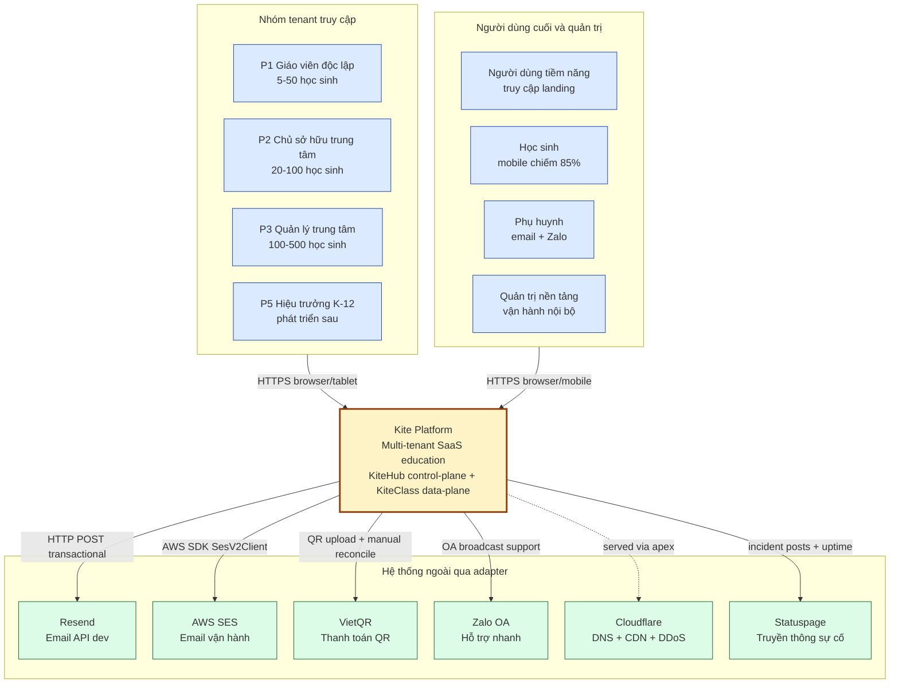

**Hình 2.1.** Sơ đồ ngữ cảnh hệ thống Kite Platform theo C4 Level 1.

Hình 2.1 cho thấy mọi actor đều truy cập Kite Platform qua HTTPS (TLS 1.2+); các hệ thống bên ngoài được cô lập qua adapter pattern (interface `NotificationChannel` cho email, `PaymentProcessor` cho VietQR). Không có actor nào truy cập trực tiếp cơ sở dữ liệu; mọi truy cập đều đi qua biên trust của gateway.

### 2.2.2 Sơ đồ container: C4 Level 2

Phóng to vào nội bộ Kite Platform cho thấy 4 cụm container: Frontend (2 ứng dụng Next.js), Gateway (Spring Cloud Gateway), Service (6 service KiteHub + 1 KiteClass core), và hạ tầng dùng chung (4 container với prefix `kite-`). Hình 2.2 trình bày bố cục container theo C4 Level 2.

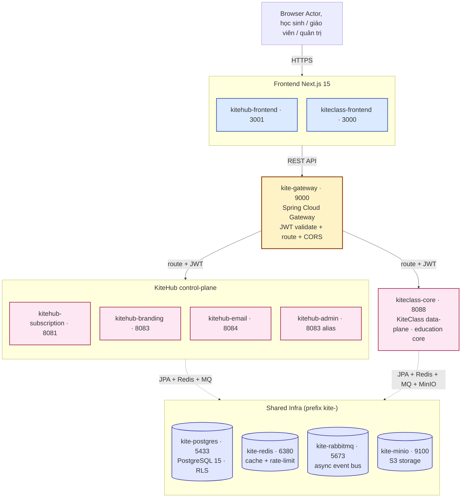

**Hình 2.2.** Sơ đồ container Kite Platform theo C4 Level 2.

Hình 2.2 cho thấy bố cục hệ thống theo bốn cụm: frontend, gateway, cụm dịch vụ và hạ tầng dùng chung.

Cụm frontend gồm hai container. Ứng dụng `kitehub-frontend` (Next.js 15, cổng 3001) phục vụ marketing và quản trị tenant, còn `kiteclass-frontend` (Next.js 15, cổng 3000) phục vụ giao diện giáo dục cho tenant với khoảng 85% phiên truy cập đến từ thiết bị di động. Cả hai được tự host trên EC2 qua trình quản lý tiến trình PM2 và chia sẻ thư viện component `packages/shared-ui`.

Cụm gateway gồm một container `kite-gateway` (Spring Cloud Gateway, cổng 9000) đóng vai trò điểm vào duy nhất cho mọi yêu cầu API backend. Gateway chịu trách nhiệm xác thực chữ ký JWT HS256 và rút trích các claim `tenantId` cùng `role`, phát các header `X-Tenant-Id`, `X-User-Id` và `X-User-Role` xuống service phía sau, thực thi CORS với danh sách origin tường minh, và giới hạn tần suất theo tenant qua bộ đếm trên Redis.

Cụm dịch vụ gồm sáu dịch vụ KiteHub và một dịch vụ KiteClass. Dịch vụ `kitehub-subscription` (cổng 8081) đảm nhận xác thực, dùng thử, đăng ký dịch vụ, tiếp nhận, beta access, DSAR, audit log, outbox và webhook thanh toán. Dịch vụ `kitehub-branding` (cổng 8083) sinh tài nguyên AI gồm logo, banner và ảnh bìa, quản lý template và lưu trữ S3 qua MinIO, gọi Ollama ở môi trường phát triển hoặc OpenAI GPT-4 Vision kết hợp DALL-E 3 ở môi trường vận hành. Dịch vụ `kitehub-email` (cổng 8084) điều phối gửi email theo adapter pattern `NotificationChannel` với `SESEmailService` làm kênh chính và `ResendEmailService` dự phòng. Dịch vụ `kitehub-admin` (dùng chung cổng 8083) đảm nhận các thao tác quản trị nền tảng gồm duyệt yêu cầu beta, quản lý instance, đọc audit log và impersonation. Thành phần `kitehub-platform` là thư viện JAR dùng chung, gồm auth filter, tenant context, OpenTelemetry, DTO và error handler chung, nên không triển khai độc lập. Cuối cùng, `kiteclass-core` (cổng 8088) là lõi nghiệp vụ giáo dục bao gồm các miền Student, Class, Attendance, Grade, Payment và Notification, được cô lập multi-tenant qua PostgreSQL RLS (chi tiết tại mục 2.2.4).

Hạ tầng dùng chung gồm bốn container mang tiền tố `kite-`. Cơ sở dữ liệu `kite-postgres` (PostgreSQL 15, cổng 5433) là cơ sở dữ liệu OLTP chính với schema `kitehub` và `kiteclass_shared`, áp RLS trên 51/91 bảng (56%), chi tiết tại mục 2.2.4. Dịch vụ `kite-redis` (Redis 7, cổng 6380) làm cache, kho lưu phiên và bộ đếm giới hạn tần suất với chính sách LRU 256MB. Bus sự kiện `kite-rabbitmq` (RabbitMQ 3-management, cổng 5673) xử lý các luồng bất đồng bộ qua những exchange `email.exchange`, `branding.deploy.*` và `instance.purge.exchange` (kiểu fanout). Kho object `kite-minio` (tương thích S3, cổng 9100) lưu trữ tài nguyên AI, template SVG và tệp người dùng tải lên, ánh xạ sang AWS S3 ở môi trường vận hành.

Prefix `kite-` (thay vì `kitehub-` hay `kiteclass-`) phản ánh bản chất dùng chung của hạ tầng giữa hai sản phẩm KiteHub và KiteClass.

### 2.2.3 Quyết định pattern multi-tenant: single-bucket + RLS

Quyết định kiến trúc trọng tâm của đồ án là chọn mô hình cô lập multi-tenant. Đồ án đánh giá 6 pattern khác nhau trên 6 trục tiêu chí và lựa chọn **Shared Database + cột `tenant_id` UUID + PostgreSQL Row-Level Security (RLS)**, tương ứng "Pool" model theo AWS Well-Architected SaaS Lens [26, tr.21] (đối lập với "Silo" per-tenant DB và "Bridge" per-tenant schema). AWS định nghĩa [26, tr.21]: *"Pool isolation enables tenants to share infrastructure but rely on logical mechanisms (such as row-level security policies in databases) to ensure data isolation between tenants; this model often yields the lowest operational cost but requires careful design of the isolation layer."*

**Bảng 2.5.** Sáu pattern multi-tenant và lý do chọn/loại.

| Pattern | Lý do chọn/loại |
|---|---|
| P1 Per-tenant database (1 RDS/tenant) | Chi phí ~$295/tháng cho 10 tenant so với ~$15 cho Pool model (chênh 20×); chi phí vận hành N× backup + N× migration + N× monitoring tăng tuyến tính theo số tenant, không phù hợp với phân khúc trung tâm SMB hiện tại |
| P2 Per-tenant schema | Quản lý migration phức tạp (Flyway chạy N lần/schema); không tăng đáng kể độ cô lập so với Pool + RLS |
| P3 Shared DB + chỉ `tenant_id` | An toàn yếu, bất kỳ lỗi ứng dụng (quên `WHERE`, edge case ORM query builder, raw SQL) đều dẫn tới leak ngầm |
| **P4 Shared DB + `tenant_id` + RLS** chọn | An toàn mạnh do enforce ở tầng cơ sở dữ liệu; chi phí vận hành thấp (1 RDS, 1 chuỗi migration); chi phí ~$15/tháng; vẫn cho phép truy vấn xuyên tenant qua vai trò admin BYPASS RLS |
| P5 Hybrid (Pool mặc định + Silo cho khách doanh nghiệp) | Sẽ phát triển khi mở rộng K-12 doanh nghiệp ở lộ trình phát triển sau và có yêu cầu cụ thể về cô lập vật lý từ khách hàng |
| P6 Serverless (Aurora Serverless v2 / DynamoDB) | Aurora Serverless v2 chi phí tối thiểu ~$45/tháng vượt Free Tier; DynamoDB không phù hợp với dữ liệu quan hệ giáo dục (Student/Class/Grade/Attendance JOIN-heavy) |

Pool model với RLS được chọn vì cân bằng giữa độ cô lập chấp nhận được (được tăng cường bởi chính sách NULL force-fail mô tả ở §2.2.4), chi phí vận hành thấp nhất, độ phù hợp với phạm vi hiện tại, và lộ trình chuyển đổi sang Hybrid Path A khi mở rộng đến nhóm khách hàng doanh nghiệp ở lộ trình phát triển sau.

### 2.2.4 Phòng thủ chiều sâu: 5 lớp cô lập cơ sở dữ liệu

Ngữ cảnh tenant (`tenantId`) được truyền xuyên suốt quy trình xử lý yêu cầu qua chuỗi 5 lớp; mỗi lớp là một cơ chế bảo vệ độc lập. Hình 2.3 minh họa quá trình này.

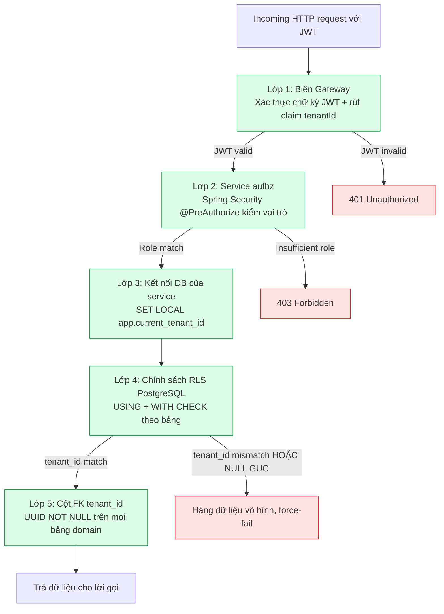

**Hình 2.3.** Phòng thủ chiều sâu 5 lớp cho cô lập multi-tenant.

Mẫu chính sách RLS áp dụng cho mọi bảng có phạm vi tenant như sau (ví dụ với bảng `classes`):

```sql
ALTER TABLE classes
  ADD COLUMN tenant_id UUID NOT NULL REFERENCES tenants(id);

ALTER TABLE classes ENABLE ROW LEVEL SECURITY;
ALTER TABLE classes FORCE ROW LEVEL SECURITY;

-- Chính sách NULL force-fail
CREATE POLICY tenant_isolation_classes ON classes
  USING (
    tenant_id = current_setting('app.current_tenant_id', true)::uuid
    AND current_setting('app.current_tenant_id', true) IS NOT NULL
  )
  WITH CHECK (
    tenant_id = current_setting('app.current_tenant_id', true)::uuid
    AND current_setting('app.current_tenant_id', true) IS NOT NULL
  );

CREATE INDEX idx_classes_tenant_id ON classes(tenant_id);
```

Trên cơ sở dữ liệu hiện tại với 91 bảng (32 thuộc `kitehub-subscription` control-plane + 59 thuộc `kiteclass-core` domain multi-tenant), RLS được bật trên 51 bảng (12 control-plane không force + 39 forced kiteclass), tỉ lệ phủ 56% trên toàn bộ, hoặc 89% nếu loại trừ các bảng không thuộc phạm vi tenant (bảng `instances` gốc, M2M join cascade, catalog dùng chung, audit bất biến, dữ liệu theo user/request).

Hai cơ chế hardening quan trọng:

1. **NULL force-fail policy:** nếu GUC `app.current_tenant_id` chưa được set, `current_setting('...', true)` trả về NULL, khiến mệnh đề `tenant_id = NULL` rơi vào logic SQL ternary trả NULL, không filter row, gây leak ngầm. Thêm `AND current_setting(...) IS NOT NULL` khiến truy vấn trả 0 row thay vì tất cả, buộc bug lộ ra ngay trong test.
2. **HikariCP GUC reset:** HikariCP tái sử dụng kết nối từ pool. Nếu kết nối N được set `app.current_tenant_id = A` rồi trả về pool, kết nối kế tiếp có thể "kế thừa" ngữ cảnh tenant A. Vấn đề được khắc phục bằng `SET LOCAL` (giới hạn theo transaction, tự reset khi commit/rollback) cùng `connectionInitSql: RESET app.current_tenant_id` mỗi khi kết nối quay về pool.

### 2.2.5 Quy trình xác thực: JWT + role-guard + truyền ngữ cảnh tenant

Hình 2.4a-d trình bày tuần tự đăng nhập và một yêu cầu được xác thực sau đó cho luồng quản trị nền tảng.


**Hình 2.4a.** Luồng đăng nhập, sinh JWT + audit log.

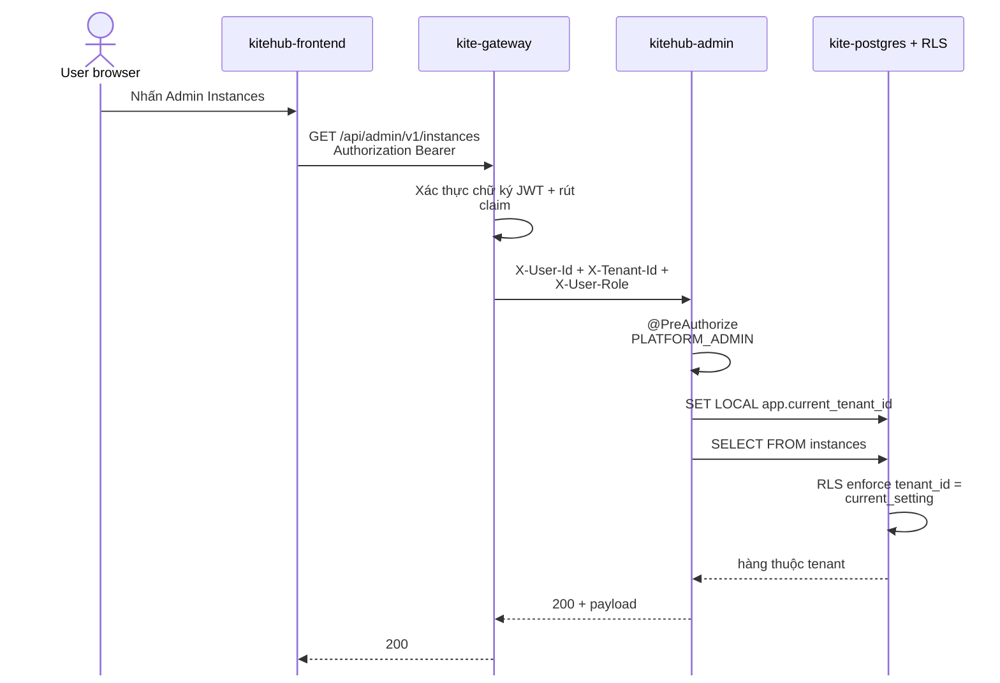

**Hình 2.4b.** Luồng yêu cầu đã xác thực, JWT validate + truyền ngữ cảnh tenant + RLS filter.

Một nguyên tắc thiết kế quan trọng được áp dụng: service KHÔNG được tự đọc claim `tenantId` từ JWT body. Gateway là biên trust duy nhất cho việc xác thực JWT; downstream service tin tưởng header `X-Tenant-Id` do gateway phát ra. Nếu mỗi service tự parse JWT, hệ thống phải duy trì public key ở nhiều nơi và lặp logic xác thực, tăng rủi ro an toàn và chi phí bảo trì.

### 2.2.6 Định tuyến multi-tenant: Tenant → Domain → Landing

Mỗi trung tâm (tenant) sở hữu một trang giới thiệu công khai (landing page) riêng biệt, truy cập qua hai phương thức: subdomain mặc định `{slug}.kitehub.me` cấp cho mọi tenant, hoặc tên miền riêng (custom domain, ví dụ `skyedu.vn`) dành cho các gói dịch vụ cao cấp. Toàn bộ tenant dùng chung một mã nguồn giao diện và một cơ sở dữ liệu chia sẻ với cô lập mức hàng (RLS); nội dung cùng giao diện thương hiệu của từng tenant được phân giải theo trường Host của yêu cầu HTTP. Cơ chế này cho phép nền tảng phục vụ hàng trăm trang landing khác nhau mà không cần triển khai riêng từng bản, qua đó giữ chi phí vận hành ổn định khi số lượng tenant tăng.

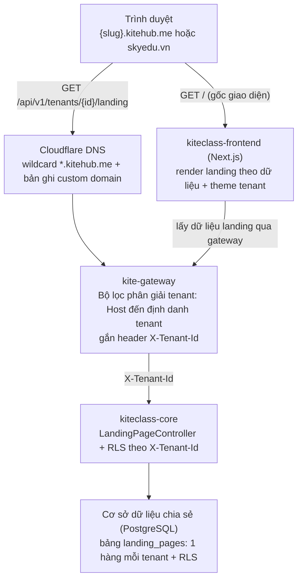

**Hình 2.4c.** Chuỗi định tuyến Tenant → Domain → Landing từ trình duyệt qua Cloudflare DNS, gateway phân giải tenant theo Host, đến lớp dữ liệu cô lập RLS.

Hệ thống xử lý hai đường yêu cầu song song. Đường thứ nhất phục vụ giao diện: trình duyệt gọi `GET /` tới ứng dụng Next.js, ứng dụng này tự lấy dữ liệu landing của tenant thông qua gateway. Đường thứ hai phục vụ dữ liệu: mọi yêu cầu `/api/**` đi qua gateway, nơi bộ lọc phân giải tenant đọc trường Host và ánh xạ thành định danh tenant theo bốn bước ưu tiên: thứ nhất là header nội bộ dành cho môi trường phát triển, thứ hai là so khớp hậu tố subdomain với tên miền gốc đã cấu hình, thứ ba là tra cứu theo tên miền riêng, và thứ tư là lấy từ claim của JWT làm phương án dự phòng. Sau khi xác định tenant, gateway gắn header `X-Tenant-Id` dạng UUID và kiểm tra trạng thái tenant phải là ACTIVE hoặc TRIAL trước khi chuyển tiếp tới dịch vụ lõi; nếu trạng thái khác, gateway trả về mã 503 để chặn truy cập vào tenant bị tạm ngưng.

**Bảng 2.6.** So sánh subdomain và tên miền riêng trong cơ chế định tuyến multi-tenant.

| Tiêu chí | Subdomain `{slug}.kitehub.me` | Tên miền riêng `skyedu.vn` |
|---|---|---|
| Cấp cho | Mọi tenant (mặc định) | Gói PREMIUM/ENTERPRISE |
| DNS | Wildcard `*.kitehub.me` cấp sẵn | Tenant tự trỏ CNAME (subdomain) hoặc A (apex) |
| Chứng chỉ SSL | Dùng chứng chỉ wildcard sẵn có | Cloudflare for SaaS tự cấp qua xác thực DCV |
| Xác minh quyền sở hữu | Không cần | Bản ghi CNAME/TXT tách khỏi bản ghi định tuyến |

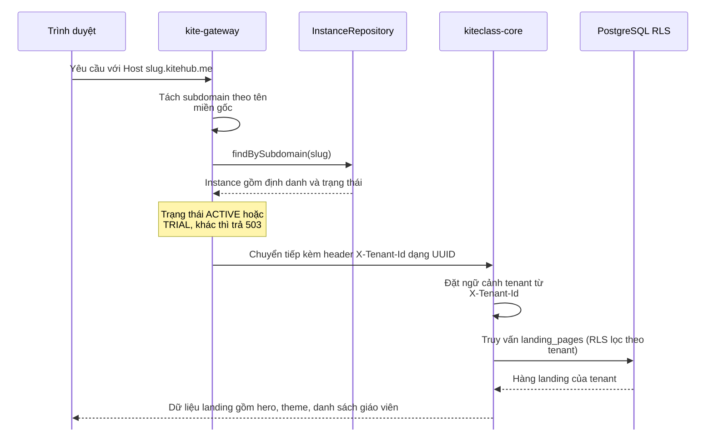

**Hình 2.4d.** Tuần tự phân giải tenant theo subdomain, gateway ánh xạ Host thành định danh tenant rồi truyền ngữ cảnh xuống lớp dữ liệu RLS.

Về an toàn, gateway là biên tin cậy duy nhất trong cơ chế định tuyến: header `X-Tenant-Id` do client gửi lên luôn bị loại bỏ và thay bằng giá trị do chính gateway phát hành sau khi phân giải Host, nhằm ngăn chặn tấn công giả mạo ngữ cảnh tenant để truy cập dữ liệu của tenant khác. Đối với tên miền riêng, nền tảng sử dụng dịch vụ Cloudflare for SaaS để tự động cấp chứng chỉ SSL thông qua cơ chế xác thực quyền kiểm soát tên miền (DCV, Domain Control Validation) bằng bản ghi CNAME, tách biệt khỏi bản ghi định tuyến lưu lượng; riêng tên miền gốc (apex) yêu cầu bản ghi A do bản ghi CNAME không hợp lệ ở mức gốc theo chuẩn DNS.

---

## 2.3 Thiết kế chi tiết

### 2.3.1 Class Diagram

Sơ đồ lớp UML mô tả các entity nghiệp vụ cùng phương thức hành vi runtime, tách theo hai mặt phẳng kiến trúc multi-tenant: mặt phẳng điều khiển (control-plane) thuộc cụm KiteHub quản lý vòng đời tenant, và mặt phẳng nghiệp vụ (domain-plane) thuộc cụm KiteClass phục vụ giáo dục. Hình 2.5a trình bày các lớp trọng tâm của KiteHub, nơi tập trung đóng góp đặc thù của đồ án (cấp phát tenant, đăng ký dịch vụ, AI Branding, tuân thủ PDPL); Hình 2.5b trình bày các lớp nghiệp vụ giáo dục đại diện của KiteClass.

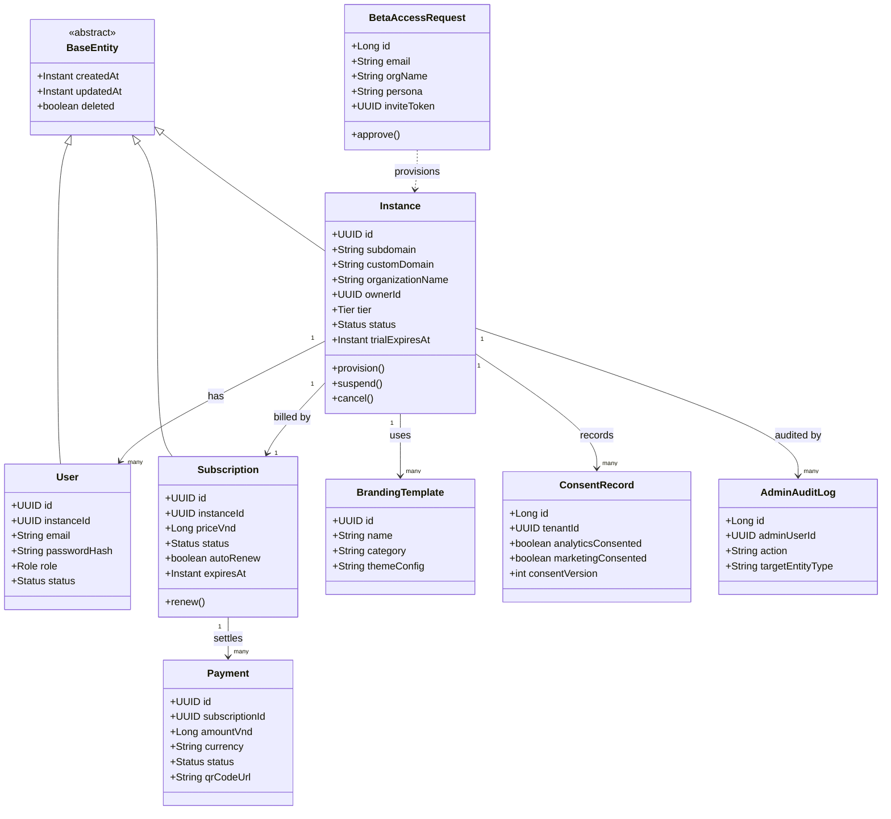

**Hình 2.5a.** Class diagram cụm KiteHub control-plane, vòng đời tenant, đăng ký dịch vụ, AI Branding, tuân thủ PDPL.

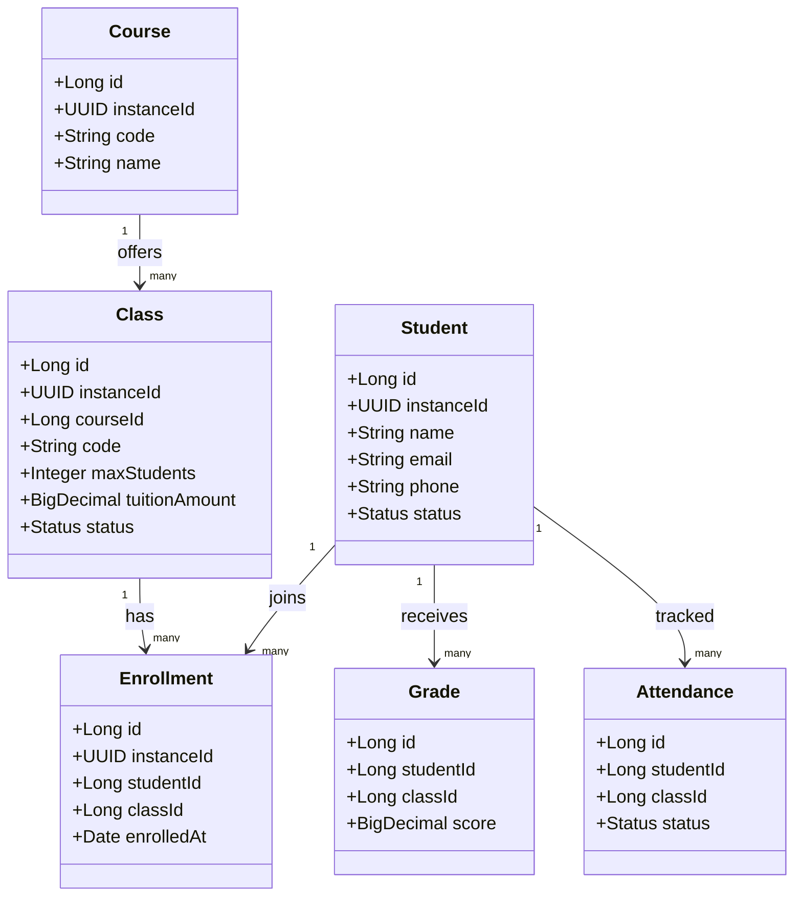

**Hình 2.5b.** Class diagram cụm KiteClass domain, entity giáo dục đại diện (học sinh, khoá học, lớp, đăng ký, điểm, điểm danh).

Sơ đồ lớp nhấn vào hành vi runtime: `Instance.provision()` khởi tạo tenant khi quản trị duyệt yêu cầu beta; `Instance.suspend()` gọi khi thanh toán thất bại quá hạn ân hạn; `Instance.cancel()` đánh dấu off-boarding sau cửa sổ lưu giữ 7 ngày; `Subscription.renew()` tự gia hạn hằng tháng; `BetaAccessRequest.approve()` chuyển yêu cầu beta thành tenant. Ba entity vòng đời (`Instance`, `User`, `Subscription`) kế thừa `BaseEntity` cung cấp các cột audit chung (`createdAt`, `updatedAt`, `deleted` cho xoá mềm). Mọi entity đều mang cột định danh tenant (`instanceId`/`tenantId` UUID), khoá ngoại bắt buộc cho chính sách RLS PostgreSQL mô tả ở §2.2.4. Hai cụm chia sẻ chung khoá tenant nhưng thuộc hai schema tách biệt (`kitehub` và `kiteclass_shared`) như trình bày ở §2.3.3.

### 2.3.2 ERD: Sơ đồ quan hệ thực thể

Sơ đồ ERD (Entity Relationship Diagram) cung cấp góc nhìn ở tầng lưu trữ vật lý, tập trung vào khoá chính (PK), khoá ngoại (FK), cardinality giữa các bảng và bảng nối (junction), khác với class diagram §2.3.1 vốn tập trung vào hành vi runtime và phương thức. ERD cũng được tách theo hai cụm tương ứng hai schema: Hình 2.6a cho cụm KiteHub control-plane, Hình 2.6b cho cụm KiteClass domain.

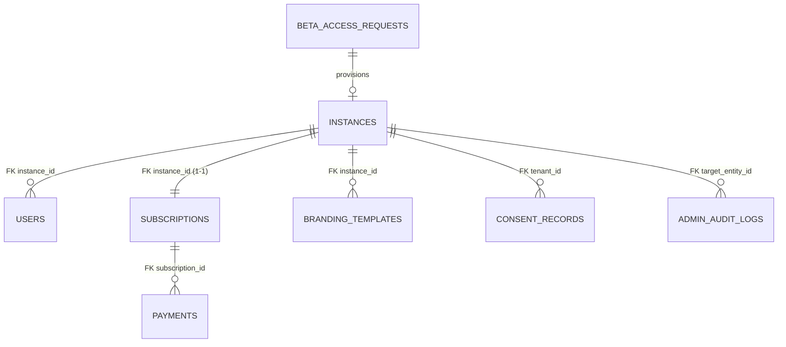

**Hình 2.6a.** ERD cụm KiteHub control-plane, `INSTANCES` là bảng gốc (PK `id` UUID), quan hệ 1-1 với `SUBSCRIPTIONS` và 1-N tới các bảng còn lại.

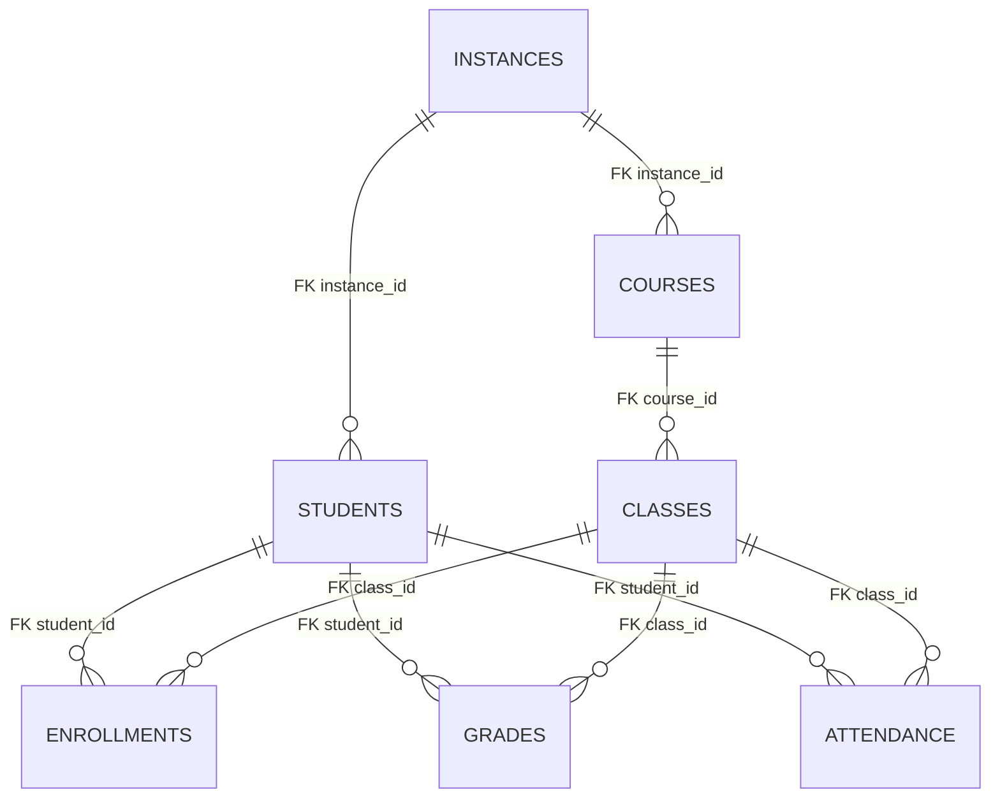

**Hình 2.6b.** ERD cụm KiteClass domain, bảng nối `ENROLLMENTS` phân giải quan hệ nhiều-nhiều giữa `STUDENTS` và `CLASSES`.

ERD bộc lộ các chi tiết tầng lưu trữ bị che ở class diagram: quan hệ nhiều-nhiều giữa `STUDENTS` và `CLASSES` được phân giải qua bảng nối `ENROLLMENTS` (một học sinh đăng ký nhiều lớp, một lớp có nhiều học sinh); quan hệ 1-1 giữa `INSTANCES` và `SUBSCRIPTIONS` (mỗi tenant một gói đang hoạt động). Mọi bảng nghiệp vụ đều mang khoá ngoại định danh tenant (`instance_id`/`tenant_id`) với cardinality `1..N` từ `INSTANCES`, thể hiện ranh giới multi-tenant: không bản ghi nghiệp vụ nào tồn tại ngoài ngữ cảnh tenant. Schema chi tiết từng cột của các bảng đại diện được trình bày liền sau tại §2.3.3.

### 2.3.3 Thiết kế cơ sở dữ liệu

Tiếp nối ERD §2.3.2, phần này trình bày schema chi tiết từng cột của ba bảng đại diện cho các trục thiết kế của Kite Platform: `instances` (control-plane, vòng đời tenant), `subscriptions` (control-plane, nguồn sự thật billing) và `students` (domain-plane, hồ sơ học sinh, bảng chịu yêu cầu PDPL chặt chẽ nhất). Schema được pull canonical từ chuỗi migration Flyway của hai cụm dịch vụ (`kitehub` 57 migration, `kiteclass_shared` 76 migration). Các bảng nghiệp vụ khác (`courses`, `classes`, `enrollments`, `attendance`, `grades`, `branding_templates`) tuân theo cùng quy ước `instance_id` UUID + RLS theo tenant (§2.2.4) và quan hệ thực thể tại §2.3.2.

Bảng `instances` (microservice `kitehub-subscription`, control-plane) lưu metadata cấp tenant: mỗi dòng tương ứng với một trung tâm dạy thêm có dùng nền tảng. Bảng này là source-of-truth cho vòng đời tenant (TRIAL / ACTIVE / SUSPENDED / CANCELLED).

**Bảng 2.7.** Schema chi tiết bảng `instances` (microservice `kitehub-subscription`).

| TT | Tên cột | Kiểu dữ liệu | Mô tả |
|:--:|---|---|---|
| 1 | `id` | UUID | Khoá chính, định danh tenant (UUID v4) |
| 2 | `subdomain` | VARCHAR(50) UNIQUE | Subdomain riêng `<subdomain>.kitehub.me`, dùng cho routing |
| 3 | `custom_domain` | VARCHAR(255) | Tên miền riêng (chỉ áp dụng gói PRO trở lên) |
| 4 | `domain_verify_token` | VARCHAR(255) | Token DCV (Domain Control Validation) sinh khi tenant đăng ký tên miền riêng |
| 5 | `domain_verified_at` | TIMESTAMP | Thời điểm xác minh tên miền thành công qua bản ghi CNAME/TXT |
| 6 | `domain_status` | VARCHAR(50) | Trạng thái xác minh tên miền: `PENDING` / `VERIFIED` / `FAILED` |
| 7 | `organization_name` | VARCHAR(200) | Tên hiển thị tenant (ví dụ `Lớp Pháp luật cô Đỗ Lan Khánh`) |
| 8 | `owner_id` | UUID | Tham chiếu tới user vai trò `P2_CENTER_OWNER` |
| 9 | `tier` | VARCHAR(20) | Gói dịch vụ: FREE / STARTER / PRO / PRO_PLUS |
| 10 | `status` | VARCHAR(20) | Trạng thái vòng đời: TRIAL / ACTIVE / SUSPENDED / CANCELLED |
| 11 | `database_url` | VARCHAR(500) | URL kết nối cơ sở dữ liệu của tenant |
| 12 | `database_password` | VARCHAR(255) | Mật khẩu DB đã mã hoá AES-256-GCM (không lưu plaintext) |
| 13 | `trial_started_at` | TIMESTAMP | Thời điểm bắt đầu dùng thử |
| 14 | `trial_expires_at` | TIMESTAMP | Thời điểm hết hạn dùng thử (mặc định 14 ngày) |
| 15 | `subscription_expires_at` | TIMESTAMP | Thời điểm hết hạn gói đang sử dụng |
| 16 | `created_at` | TIMESTAMP | Thời điểm tạo bản ghi |
| 17 | `updated_at` | TIMESTAMP | Thời điểm cập nhật gần nhất |
| 18 | `deleted` | BOOLEAN | Cờ xoá mềm (soft delete) phục vụ cửa sổ lưu giữ 7 ngày |

Các chỉ mục trên `subdomain`, `owner_id`, `status`, `tier`, và partial index `deleted=false` đảm bảo truy vấn dashboard quản trị (lọc theo gói + trạng thái) đạt P95 dưới 100ms ngay cả khi quy mô lên 200 tenant.

Bảng `subscriptions` (microservice `kitehub-subscription`, control-plane) là nguồn sự thật cho trạng thái đăng ký dịch vụ của mỗi tenant: mỗi tenant có một bản ghi gói đang hoạt động (quan hệ 1-1 với `instances`), liên kết tới chuỗi `payments` qua khoá ngoại.

**Bảng 2.8.** Schema chi tiết bảng `subscriptions` (microservice `kitehub-subscription`).

| TT | Tên cột | Kiểu dữ liệu | Mô tả |
|:--:|---|---|---|
| 1 | `id` | UUID | Khoá chính |
| 2 | `instance_id` | UUID NOT NULL | Khoá ngoại tới `instances.id`, bắt buộc cho RLS |
| 3 | `tier` | VARCHAR(20) | Gói: FREE / STARTER / PRO / PRO_PLUS |
| 4 | `price_vnd` | BIGINT | Giá gói theo VND (lưu số nguyên đồng, không thập phân) |
| 5 | `status` | VARCHAR(20) | Trạng thái: TRIAL / ACTIVE / PAST_DUE / CANCELLED |
| 6 | `started_at` | TIMESTAMP | Thời điểm kích hoạt gói |
| 7 | `expires_at` | TIMESTAMP | Thời điểm hết hạn chu kỳ hiện tại |
| 8 | `auto_renew` | BOOLEAN | Cờ tự gia hạn hằng tháng (mặc định true) |
| 9 | `pending_payment_id` | UUID | Tham chiếu payment đang chờ thanh toán (nullable) |
| 10 | `created_at` | TIMESTAMP | Thời điểm tạo bản ghi |
| 11 | `updated_at` | TIMESTAMP | Thời điểm cập nhật gần nhất |

Bảng `students` (microservice `kiteclass-core`, domain-plane) lưu hồ sơ học sinh đã đăng ký tại tenant. Bảng này có volume lớn nhất trong các bảng domain (mục tiêu 50-500 học sinh/tenant hiện tại) và là bảng chịu yêu cầu tuân thủ PDPL chặt chẽ nhất do chứa thông tin cá nhân nhạy cảm.

**Bảng 2.9.** Schema chi tiết bảng `students` (microservice `kiteclass-core`).

| TT | Tên cột | Kiểu dữ liệu | Mô tả |
|:--:|---|---|---|
| 1 | `id` | BIGSERIAL | Khoá chính (tự tăng) |
| 2 | `instance_id` | UUID NOT NULL | Khoá ngoại tới `instances.id`, bắt buộc cho RLS |
| 3 | `name` | VARCHAR(100) | Họ tên đầy đủ (ví dụ `Trần Thị Hồng`) |
| 4 | `email` | VARCHAR(255) | Email liên lạc (có thể NULL nếu phụ huynh chưa cung cấp) |
| 5 | `phone` | VARCHAR(20) | Số điện thoại VN (ví dụ `0901 234 567`) |
| 6 | `date_of_birth` | DATE | Ngày sinh |
| 7 | `gender` | VARCHAR(10) | Giới tính |
| 8 | `address` | TEXT | Địa chỉ liên lạc |
| 9 | `avatar_url` | VARCHAR(500) | Đường dẫn ảnh đại diện trên MinIO S3 |
| 10 | `status` | VARCHAR(20) | Trạng thái: PENDING / ACTIVE / INACTIVE / GRADUATED / DROPPED |
| 11 | `note` | TEXT | Ghi chú nội bộ của trung tâm |
| 12 | `created_at` | TIMESTAMP | Thời điểm tạo hồ sơ |
| 13 | `updated_at` | TIMESTAMP | Thời điểm cập nhật gần nhất |

Bảng `students` chứa thông tin cá nhân nhạy cảm và do đó phải tuân thủ PDPL 2023 Điều 11 [9] về quyền của chủ thể dữ liệu. Hiện tại cho trung tâm dạy thêm SMB, các trường nhạy cảm cao (CMND/CCCD, mã định danh học sinh quốc gia) không được lưu trữ; khi mở rộng sang K-12 ở lộ trình phát triển sau, các yêu cầu của DPO/DPIA sẽ bổ sung trường mã hoá riêng cho thông tin trẻ vị thành niên.

### 2.3.4 Sequence Diagram: Luồng cấp phát tenant

Luồng cấp phát tenant từ lúc người dùng tiềm năng gửi yêu cầu beta đến khi chủ sở hữu trung tâm đăng nhập lần đầu trải qua nhiều bước phối hợp giữa frontend, backend và các dịch vụ ngoài. Hình 2.7a-b trình bày tuần tự các bước theo ký pháp UML.

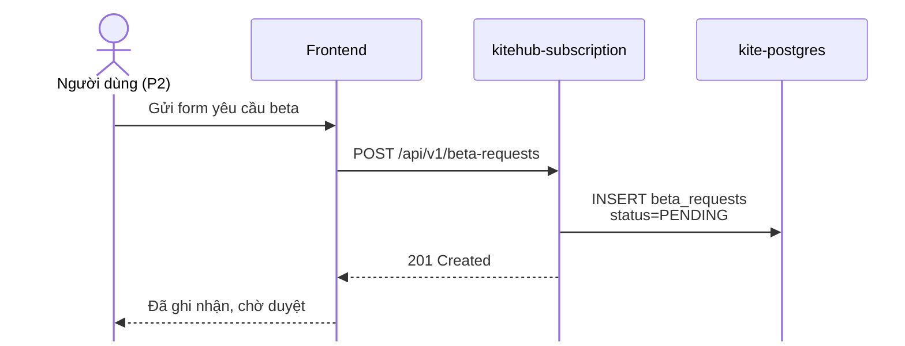

**Hình 2.7a.** Pha PENDING, người dùng gửi yêu cầu beta, hệ thống ghi nhận chờ quản trị duyệt.

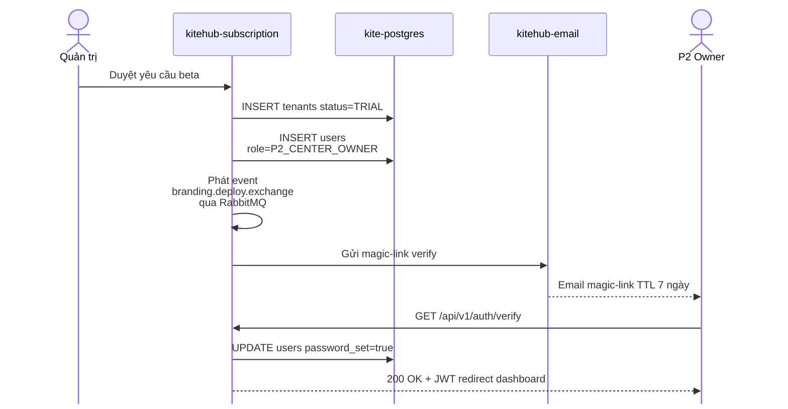

**Hình 2.7b.** Pha TRIAL, quản trị duyệt yêu cầu, hệ thống cấp tenant + gửi magic-link, người dùng kích hoạt tài khoản. Sự kiện `branding.deploy.exchange` được phát qua RabbitMQ song song cho `kitehub-branding` dựng template mặc định.

Tuần tự cho thấy ranh giới giữa pha PENDING (chờ duyệt thủ công) và pha TRIAL (sau khi quản trị kích hoạt), đây là điểm chuyển trạng thái quan trọng được tham chiếu lại tại Hình 2.8 §2.3.5 (máy trạng thái vòng đời tenant). Việc phát sự kiện fanout `branding.deploy.exchange` qua RabbitMQ song song với gửi email cho phép `kitehub-branding` dựng template mặc định trong khi chờ chủ sở hữu trung tâm xác thực, giảm thời gian tiếp nhận khi user click magic-link.

### 2.3.5 Máy trạng thái vòng đời tenant

Vòng đời tenant do service `kitehub-subscription` quản lý theo máy trạng thái 5 trạng thái biểu diễn trong Hình 2.8.

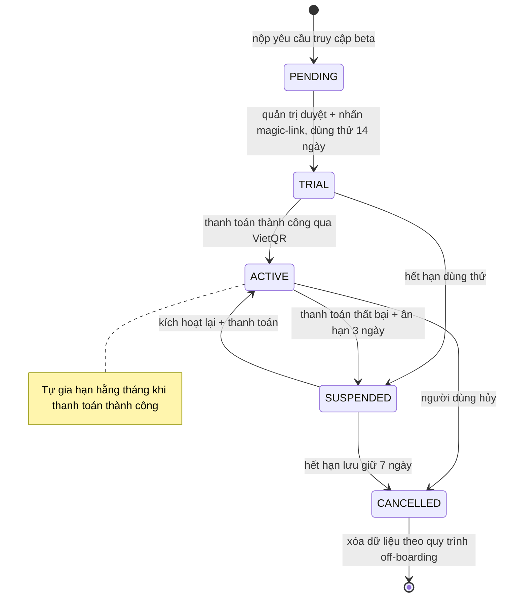

**Hình 2.8.** Máy trạng thái vòng đời tenant.

Diễn giải các bước chuyển trạng thái: PENDING → TRIAL khi quản trị duyệt yêu cầu beta và kích hoạt cấp phát (tạo `instance_id` UUID, khởi tạo `P2_CENTER_OWNER`, gửi magic-link), dùng thử 14 ngày. TRIAL → ACTIVE khi thanh toán thành công + hệ thống phát hành hóa đơn. ACTIVE → SUSPENDED sau khi gia hạn thất bại + ân hạn 3 ngày, tenant không đăng nhập được, dữ liệu lưu giữ 7 ngày. SUSPENDED → CANCELLED sau 7 ngày lưu giữ, dữ liệu domain xóa theo off-boarding; audit log lưu theo PDPL Điều 11 [9]. Cột `tenant_id` tồn tại đến khi CANCELLED + cửa sổ lưu giữ kết thúc; chính sách RLS lọc dựa trên `tenant_id` KHÔNG dựa trên trạng thái, tầng service tự enforce kiểm tra trạng thái (tenant SUSPENDED hiển thị "Tài khoản bị tạm khóa, vui lòng liên hệ hỗ trợ").

### 2.3.6 Phân rã service: 6 service KiteHub + 1 KiteClass core

Danh mục service được tổng hợp theo mô hình Backstage [21] (mỗi service đóng vai một component có metadata + ownership + dependency).

**Bảng 2.10.** Danh mục service của Kite Platform.

| Service | Cổng | Trách nhiệm | Cơ sở dữ liệu |
|---|---|---|---|
| `kite-gateway` | 9000 | Xác thực JWT + định danh tenant + truyền ngữ cảnh + rate-limit | Bộ đếm trên Redis |
| `kitehub-subscription` | 8081 | Xác thực + dùng thử + đăng ký dịch vụ + thanh toán + tiếp nhận + DSAR + audit + outbox + webhook + impersonation | Schema `kitehub` (32 bảng) |
| `kitehub-admin` | 8083 | Quản trị nền tảng, CRUD instance + thanh toán + dashboard doanh thu | Schema `kitehub` (chung) |
| `kitehub-branding` | 8083 alias | Sinh AI asset (logo/hero/banner) + upload S3 + tích hợp Ollama/OpenAI | Bảng `kitehub.branding_*` |
| `kitehub-email` | 8084 | Email giao dịch, adapter NotificationChannel (SES chính + Resend dự phòng) | Bảng `kitehub.email_logs` |
| `kitehub-platform` | thư viện JAR | Starter dùng chung, auth filter + tenant context + OpenTelemetry + DTO | không có |
| `kiteclass-core` | 8088 | Nghiệp vụ giáo dục theo tenant, student/course/class/attendance/grade/payment | Schema `kiteclass_shared` (59 bảng) |

Các phụ thuộc liên service được tổng hợp gồm: `kitehub-subscription` gọi `kitehub-email` qua REST và sự kiện RabbitMQ `email.exchange`; `kitehub-subscription` phát sự kiện `branding.deploy.*` để `kitehub-branding` tiêu thụ; `kitehub-email` lấy gói branding qua WebClient để dựng template; `kiteclass-core` lưu trữ ảnh đại diện và bài nộp trên MinIO S3 và phát thông báo bất đồng bộ qua RabbitMQ.

Hệ thống được cấu thành từ ba lớp dịch vụ. Lớp nền tảng KiteHub gồm sáu dịch vụ độc lập đảm nhận các trách nhiệm khác nhau: quản trị nền tảng (`kitehub-admin`), nhận diện thương hiệu (`kitehub-branding`), thư điện tử (`kitehub-email`), điều phối yêu cầu (`kitehub-gateway`), thư viện dùng chung (`kitehub-platform`) và quản lý đăng ký (`kitehub-subscription`); trong đó năm dịch vụ triển khai container độc lập còn `kitehub-platform` là thư viện JAR dùng chung không triển khai riêng. Lớp nghiệp vụ tenant KiteClass tập trung tại dịch vụ `kiteclass-core` phục vụ toàn bộ chu trình giáo dục theo tenant. Lớp giao diện gồm hai ứng dụng Next.js phục vụ tập người dùng khác nhau: `kitehub-frontend` cho marketing và quản trị tenant, `kiteclass-frontend` cho giao diện giáo dục. Cùng với tám container hạ tầng dùng chung (cơ sở dữ liệu, cache, hàng đợi sự kiện, lưu trữ object) tạo thành tổng cộng mười bảy thành phần tách biệt.

### 2.3.7 Mô hình SaaS: gói dịch vụ + thanh toán

**Quy trình cấp phát tenant.** Khi quản trị nền tảng duyệt yêu cầu truy cập beta, service `kitehub-subscription` chạy quy trình tự động gồm 8 bước:

1. Sinh `instance_id` (UUID v4)
2. Đặt subdomain `<tenant-slug>.kitehub.me` qua Cloudflare DNS API
3. Khởi tạo người dùng quản trị vai trò `P2_CENTER_OWNER`, mật khẩu chưa đặt
4. Sinh magic-link token TTL 7 ngày
5. Gửi email từ `support@kitehub.me` chứa magic-link
6. Phát sự kiện fanout `branding.deploy.exchange` → `kitehub-branding` dựng template mặc định
7. Lập lịch sự kiện `instance.purge.exchange` (TRIAL → SUSPENDED tự động sau 14 ngày)
8. Cập nhật bảng `onboarding_progress` trạng thái PENDING → TRIAL

Chủ sở hữu trung tâm nhấn magic-link, đặt mật khẩu và đăng nhập lần đầu sẽ thấy dashboard wizard 5 bước: xác nhận thông tin trung tâm, upload logo (hoặc sinh tự động), thêm 3 lớp đầu tiên, mời quản lý/giáo viên, thiết lập phương thức thanh toán.

**Ma trận gói dịch vụ.** Đồ án thiết kế bốn gói dịch vụ phân tầng theo persona mục tiêu (Bảng 2.11). Hai gói FREE và STARTER đã kiểm chứng hiện tại với hai giáo viên độc lập; hai gói PRO và PRO_PLUS thuộc lộ trình phát triển sau khi mở rộng cohort tenant.

**Bảng 2.11.** Bốn gói dịch vụ và các giới hạn theo gói.

| Gói | Trạng thái | Persona mục tiêu | Giá tháng | Số học sinh | Số lớp | Lượt sinh ảnh AI/ngày | Tên miền riêng (custom domain) |
|---|---|---|---|---|---|---|---|
| FREE | Hiện tại | P1 Giáo viên độc lập | `0đ` (dùng thử 14 ngày) | 50 | 5 | 3 | Không (chỉ subdomain `*.kitehub.me`) |
| STARTER | Hiện tại | P2 Chủ sở hữu trung tâm SMB | `500.000đ/tháng` | 100 | 10 | 10 | Không |
| PRO | Phát triển sau | P3 Quản lý trung tâm | `1.500.000đ/tháng` | 500 | 50 | 50 | Có (custom CNAME) |
| PRO_PLUS | Phát triển sau | Chuỗi nhượng quyền multi-branch | `5.000.000đ/tháng` | 2000 | 200 | 200 | Có (custom CNAME + IP riêng) |

**Trạng thái hiện thực hoá.** Mã nguồn hiện tại trên kho lưu trữ KiteHub đã định nghĩa enum `PricingTier` với bốn cấp giá `FREE / BASIC / PREMIUM / ENTERPRISE`, bổ sung trường giới hạn `maxClasses`, và xây dựng bảng `tenant_quota` kết hợp bộ đếm Redis cho cơ chế enforcement HTTP 429 ở tầng tenant thuộc lộ trình phát triển sau.

**Thanh toán và hóa đơn.** Hiện tại dùng VietQR thủ công: chủ sở hữu trung tâm chuyển khoản theo nội dung VietQR và upload ảnh xác nhận, quản trị nền tảng đối soát bằng tay. Cách tiếp cận này khớp thói quen thanh toán phổ biến (bank transfer chiếm ~70% giao dịch giáo dục) và tránh phụ thuộc giấy phép trung gian thanh toán trong quá trình kiểm chứng sản phẩm.