# CHƯƠNG 2. PHÂN TÍCH VÀ THIẾT KẾ HỆ THỐNG

## 2.1 Phân tích yêu cầu hệ thống

### 2.1.1 Yêu cầu chức năng

Kite Platform phục vụ chu trình giáo dục đầy đủ cho trung tâm dạy thêm vừa-nhỏ Việt Nam. Các năng lực chính được phân bổ giữa KiteHub (control-plane) và KiteClass (data-plane), trình bày theo thứ tự dưới đây.

**Tenant onboarding (KiteHub `kitehub-subscription`)**

- Người dùng tiềm năng truy cập landing thì đăng ký yêu cầu truy cập beta qua form 4 trường (họ tên / email / số điện thoại / tên trung tâm)
- Quản trị nền tảng duyệt yêu cầu thì kích hoạt quy trình cấp phát (tạo `instance_id` UUID, khởi tạo người dùng quản trị với vai trò `P2_CENTER_OWNER`, gửi email magic-link)
- Chủ sở hữu trung tâm nhấn magic-link thì đặt mật khẩu lần đầu thì đăng nhập dashboard thì bắt đầu kỳ dùng thử 14 ngày
- Trạng thái vòng đời: PENDING thì TRIAL thì ACTIVE / SUSPENDED / CANCELLED (chi tiết §2.3.4)

**Đăng ký dịch vụ & thanh toán (KiteHub `kitehub-subscription` + `kitehub-admin`)**

- Chủ sở hữu trung tâm chọn gói dịch vụ (FREE / STARTER / PRO / PRO_PLUS) — ví dụ STARTER khoảng `500.000đ/tháng` cho 100 học sinh
- Thanh toán qua VietQR là phương thức mặc định cho phạm vi hiện tại thủ công; tích hợp MoMo/VNPay theo lộ trình phát triển sau
- Gia hạn hằng tháng với thời gian ân hạn 3 ngày khi thanh toán thất bại; tenant SUSPENDED không đăng nhập được nhưng giữ dữ liệu 7 ngày
- Quản trị nền tảng có dashboard `/admin/v1/revenue` để xem doanh thu, MRR, tỷ lệ churn

**Tùy biến tenant (KiteHub `kitehub-branding`)**

- Tùy biến theo tenant: logo, hero image, palette màu, subdomain riêng (ví dụ `trung-tam-sky.kitehub.me`)
- Studio AI Branding sinh logo + hero qua MiniMax (môi trường vận hành) hoặc Ollama (môi trường phát triển); quota lưu trong bảng `tenant_quota` giới hạn theo gói (FREE: 3 lần tạo lại mỗi ngày)
- Domain gửi email được xác thực DKIM theo tenant (gói PRO) thì thư gửi từ `support@skyedu.vn` thay vì `support@kitehub.me`

**Lõi nghiệp vụ giáo dục (KiteClass `kiteclass-core`)**

- **Quản lý học sinh:** CRUD học sinh, nhập hàng loạt CSV/Excel (bảng `students`), liên kết phụ huynh — học sinh
- **Lớp học & thời khóa biểu:** Tạo lớp (ví dụ `Lớp Anh ngữ 5A1` / `Lớp Toán 9B`), gắn `homeroom_class` cho lớp chủ nhiệm, lập lịch buổi học qua `class_schedule_slots` (khung thứ 2-7 17:00-21:00 buổi tối phổ biến)
- **Điểm danh:** GVCN điểm danh từng `attendance_period` (mỗi buổi học), trạng thái Có/Vắng/Nghỉ phép
- **Chấm điểm:** Nhập điểm `grades` cho `assignments` / `subject_grades`, xuất bảng điểm theo `grading_scales` (thang 10); báo cáo cuối kỳ HK1/HK2/HK_Hè
- **Thanh toán theo tenant:** Chủ sở hữu trung tâm phát hành hóa đơn `invoices` cho phụ huynh (ví dụ `Học phí tháng 5/2026 — 1.500.000đ`), theo dõi chuyển khoản/tiền mặt, xuất hóa đơn điện tử VAT tích hợp với MISA MeInvoice
- **Thông báo:** Gửi thông báo qua email formal cho phụ huynh khi có điểm mới, sự cố, nhắc hóa đơn; đã tích hợp Zalo OA

**Tuân thủ & nhật ký kiểm toán (cross-service)**

- Bảng `admin_audit_log` bất biến ghi mọi hành động của quản trị nền tảng thì đáp ứng yêu cầu tamper-proof retention của PDPL Điều 11
- Bảng `consent_record` lưu sự đồng ý PDPL của tenant + phụ huynh
- Bảng `dsar_ticket` cho yêu cầu truy cập dữ liệu cá nhân (Data Subject Access Request)
- Bảng `child_protection_audit_log` (KiteClass) cho phạm vi K-12 — mọi truy cập vào hồ sơ học sinh (đặc biệt trẻ vị thành niên) được log riêng phục vụ audit của Bộ Giáo dục

**Quản trị nền tảng & hỗ trợ (KiteHub `kitehub-admin`)**

- Quản lý instance: danh sách tenant, xem chỉ số sức khỏe theo tenant, suspend/resume tenant
- Quy trình impersonation `/api/impersonate/start` — quản trị đăng nhập with tư cách tenant để hỗ trợ (được log trong `impersonation_audit_log`)
- Dashboard doanh thu MRR/ARR/churn theo tháng

### 2.1.2 Yêu cầu phi chức năng

Đồ án phân loại các yêu cầu phi chức năng (NFR) theo chuẩn ISO/IEC 25010:2011 *Software Product Quality Model* [24] — mô hình chất lượng phần mềm bao gồm 8 đặc trưng: Functional Suitability, Performance Efficiency, Compatibility, Usability, Reliability, Security, Maintainability, và Portability. Bảng 2.1 ánh xạ 6 hạng mục NFR được đồ án này tập trung trình bày sang các đặc trưng tương ứng theo ISO/IEC 25010.

**Bảng 2.1.** Ánh xạ NFR của Kite Platform sang ISO/IEC 25010:2011.

| Hạng mục NFR của đồ án | Đặc trưng ISO/IEC 25010 tương ứng |
|---|---|
| Performance | Performance Efficiency (Time Behaviour, Resource Utilization) |
| Availability | Reliability (Availability sub-characteristic) |
| Security | Security (Confidentiality, Integrity, Non-repudiation, Authenticity) |
| Scalability | Performance Efficiency (Capacity) + Maintainability (Scalability sub-aspect) |
| Maintainability | Maintainability (Modularity, Reusability, Modifiability, Testability) |
| Cost | (Bổ sung ngoài ISO 25010, ràng buộc kinh tế hiện tại) |

**Performance.** Mục tiêu hiệu năng cho phạm vi hiện tại được đặt như sau:

| Chỉ số | Mục tiêu | Phương pháp đo |
|---|---|---|
| Độ trễ API P95 (endpoint đọc) | < 500ms | Prometheus thu thập từ Spring Actuator |
| Độ trễ API P95 (endpoint ghi) | < 1000ms | Prometheus |
| Time-to-Interactive (TTI) phía giao diện | < 3s trên 4G | Lighthouse |
| Độ trễ truy vấn cơ sở dữ liệu P95 | < 100ms | `pg_stat_statements` |
| Số người dùng đồng thời trên mỗi tenant | ~50 hoạt động | Kịch bản tải |

Khi quy mô tiến tới 50-200 tenant trong lộ trình phát triển sau, hệ thống cần đánh giá lại khi connection pool đạt ngưỡng của instance cơ sở dữ liệu (~150 kết nối hoạt động).

**Availability.** Mục tiêu uptime hiện tại là **99.5%** (tương đương khoảng 3,6 giờ downtime/tháng có thể chấp nhận), theo SLA mặc định của AWS cho instance EC2 và RDS đơn vùng [25]. Mục tiêu này được duy trì thông qua:

- Triển khai trên một vùng AWS duy nhất `ap-southeast-1` (Singapore) phù hợp ràng buộc kinh tế hiện tại
- Health check `/actuator/health` cho từng service + ALB health probe
- Khai báo startupProbe trong Helm chart đảm bảo container không nhận traffic trước khi sẵn sàng
- CloudWatch SNS alarm với 4 ngưỡng (CPU >80% / memory >85% / 5xx rate >1% / DB connection >120) gọi on-call

Khi chuyển sang triển khai EKS multi-AZ với read replica ở lộ trình phát triển sau, mục tiêu sẽ được nâng lên **99.9%**. Việc theo dõi uptime thực tế qua Statuspage được lập kế hoạch cho lộ trình phát triển sau.

**Security.** Đồ án lấy chuẩn OWASP Top 10 (2021) [19] làm baseline an toàn ứng dụng web. Theo định nghĩa của OWASP Foundation [19, tr.8]: *"Broken Access Control moved up from the fifth position to the category with the most serious web application security risk; the contributed data indicates that on average, 3.81% of applications tested had one or more Common Weakness Enumerations (CWEs) with more than 318k occurrences of CWEs in this risk category."* Đồ án đồng thời tuân thủ pháp luật Việt Nam — Luật Bảo vệ Dữ liệu Cá nhân số 49/2023/QH15 [9] và Luật An ninh mạng số 24/2018/QH14 [10].

**Bảng 2.2.** Ánh xạ OWASP Top 10 (2021) lên các biện pháp triển khai.

| Kiểm soát | Cách triển khai |
|---|---|
| A01 Broken Access Control | Phòng thủ chiều sâu 5 lớp: Gateway xác thực JWT thì Service `@PreAuthorize` thì cơ sở dữ liệu `SET LOCAL` GUC thì chính sách RLS của PostgreSQL thì cột khóa ngoại `tenant_id` NOT NULL. Chính sách NULL force-fail loại bỏ trường hợp leak ngầm. |
| A02 Cryptographic Failures | TLS 1.2+ bắt buộc; bí mật lưu trong AWS Secrets Manager với chu kỳ luân chuyển 90 ngày; mật khẩu băm BCrypt cost 12 |
| A03 Injection | Hibernate ORM mặc định dùng truy vấn tham số hóa; `@Query` native chỉ áp dụng cho input đã kiểm tra; controller dùng `@Valid` + Bean Validation |
| A04 Insecure Design | Threat model riêng cho từng service — quy trình magic-link đã được phân tích mối đe dọa |
| A05 Security Misconfiguration | Spring Security `SecurityConfig` mặc định deny; danh sách CORS origin tường minh theo môi trường |
| A06 Vulnerable Components | Dependabot quét hằng tuần; cổng kiểm tra Trivy với mức CRITICAL+HIGH trong CI; validate `pnpm` lockfile |
| A07 Authentication Failures | JWT HS256 access token TTL 15 phút + refresh token 30 ngày luân chuyển; blacklist refresh trên Redis; 2FA TOTP cho vai trò Owner |
| A08 Software & Data Integrity | Migration Flyway bất biến; bảng `admin_audit_log` bất biến đáp ứng PDPL Điều 11 |
| A09 Security Logging Failures | Log dạng JSON có cấu trúc + CloudTrail multi-region được bật trước khi triển khai vận hành |
| A10 Server-Side Request Forgery | WebClient với allowlist URL tường minh (MiniMax + VietQR + Ollama cho môi trường phát triển) |

Tuân thủ pháp lý phía Việt Nam hiện tại:

- PDPL 2023 (Luật số 49/2023/QH15, có hiệu lực 2026-07-01) — hiện tại không thuộc nhóm K-12 với một disclaimer phù hợp về việc rà soát pháp lý tiếp tục trước khi phát hành chính thức
- Luật An ninh mạng 2018 (Luật số 24/2018/QH14) + Nghị định 53/2022/NĐ-CP — RDS chốt vùng `ap-southeast-1` để giảm thiểu rủi ro vận chuyển dữ liệu qua biên giới
- Trước khi mở rộng sang phạm vi K-12 ở lộ trình phát triển sau: DPO engagement, đánh giá tác động bảo vệ dữ liệu (DPIA), và rà soát pháp lý chuyên sâu cần được hoàn tất

**Scalability.** Mô hình mở rộng đa tenant dạng **single-bucket + RLS** (Pool model theo AWS SaaS Lens [26] và phân tích chi tiết của Pothon [27] — xem §2.2.3):

- Hiện tại: 10-50 tenant × 50-500 học sinh/tenant ≈ 5k-25k người dùng
- Lộ trình phát triển sau: 50-200 tenant × 100-1000 học sinh/tenant ≈ 50k-200k người dùng thì mở rộng theo chiều dọc instance RDS
- Khi mở rộng sang phạm vi K-12 doanh nghiệp 200-1000 tenant: đánh giá lại hướng Hybrid Path A (per-tenant DB) cho nhóm tenant doanh nghiệp

Khả năng mở rộng theo chiều ngang qua sub-split:

- Connection pool: HikariCP 10 kết nối/service × 6 service = 60 baseline; tối đa 150 với RDS lộ trình phát triển sau (kitehub-platform là thư viện JAR dùng chung, không có pool kết nối riêng)
- Cache: Redis 7 chính sách LRU 256MB; làm nóng session + rate-limit counter
- Bất đồng bộ: RabbitMQ event bus phân tải (`branding.deploy`, `email.queue`, `instance.purge.fanout`) thì consumer service mở rộng độc lập

**Maintainability.** Kiến trúc microservice cho phép triển khai từng service một cách độc lập:

- Build image Docker từng service + đẩy lên ECR + cập nhật ECS service (mục tiêu thời gian triển khai < 30 phút/service)
- Migration Flyway theo schema từng service (subscription / branding / email / admin / kiteclass-core mỗi service có chuỗi migration riêng)
- API ổn định ngược: định phiên bản theo URL `/api/v1/...` thì breaking change đòi hỏi tăng major version
- Quy ước Living docs: tài liệu nghiệp vụ 3-layer (rules.md / use-cases.md / api-contract.md) đi cùng PR với code change

**Cost.** Hiện tại vận hành dưới ràng buộc AWS Free Tier 12 tháng:

- 2 EC2 `t3.micro` (KiteHub backend + KiteClass app), 1 RDS `db.t3.micro`, 5 GB S3
- Cloudflare: gói miễn phí DNS + CDN + DDoS protection
- Email: Resend gói miễn phí 3k thư/tháng cho môi trường phát triển; AWS SES vận hành ~$0.10/1000 thư
- AI: Ollama tự host cho môi trường phát triển; MiniMax vận hành ~$0.001/yêu cầu
- **Tổng chi phí ước tính hiện tại: $15-30/tháng** (~360.000đ-720.000đ/tháng)

Quyết định kiến trúc bị neo bởi ràng buộc kinh tế: khóa luận lựa chọn mô hình single-bucket multi-tenant với RLS (Pattern 4) thay vì per-tenant DB (Pattern 1) — chênh lệch chi phí khoảng 20× và chi phí vận hành tăng tuyến tính theo số tenant, không phù hợp với phân khúc trung tâm SMB hiện tại (chi tiết §2.2.3).

**Đặc trưng thị trường Việt Nam và hệ quả NFR.** Bối cảnh người dùng được trình bày tại Chương 1 §1.1 trực tiếp ảnh hưởng tới NFR thuộc nhóm Compatibility (i18n locale, định dạng tiền tệ, ngày tháng), Usability (xưng hô email phù hợp vai trò, kênh giao tiếp Zalo cho phụ huynh) và Reliability (khung lịch tải đỉnh buổi tối, cron tính phí bỏ qua khung Tết). Bảng 2.3 ánh xạ các đặc trưng này sang yêu cầu thiết kế cụ thể.

**Bảng 2.3.** Đặc trưng thị trường Việt Nam và hệ quả NFR thiết kế.

| Khía cạnh | Quy ước Việt Nam | Hệ quả NFR |
|---|---|---|
| Tiền tệ | VND `1.500.000đ` (dấu chấm phân tách hàng nghìn) | Compatibility: format VND bắt buộc trên mọi giao diện, hóa đơn, dashboard |
| Định dạng ngày | `Thứ Hai, 14/05/2026` dạng dài; `14/05/2026` dạng ngắn | Compatibility: i18n qua `DateTimeFormatter` của Spring Boot |
| Đầu mối phụ huynh | Mẹ chính (60%) + bố (35%) + ông bà (5%) | Usability: bảng `parents` hỗ trợ nhiều liên hệ với cờ chính |
| Thanh toán | Chuyển khoản Vietcombank/Techcombank/MB (~70%) + tiền mặt (~20%) + QR (~10%) | Functional Suitability: hiện tại VietQR; mở rộng VNPay/MoMo lộ trình phát triển sau |
| Thuật ngữ chức danh | `Hiệu trưởng`, `Quản lý`, `GVCN` (giáo viên chủ nhiệm) | Usability: phân loại vai trò theo quy ước Việt Nam |
| Giờ làm việc | Thứ 2 — Thứ 7, 17:00-21:00 buổi tối | Performance: lịch slot mặc định 6 ngày, đỉnh tải buổi tối |
| Giao tiếp | Zalo group chat (~90% adoption) > SMS > email | Usability: Zalo OA đã được tích hợp cho phụ huynh |
| Ngày nghỉ | Tết 7-10 ngày; 30/4-1/5; nghỉ hè tháng 6-8 | Reliability: cron tính phí + lịch lớp bỏ qua khung Tết |

---

## 2.2 Thiết kế kiến trúc tổng thể

Đồ án áp dụng C4 model (Context / Container / Component / Code) của Simon Brown — industry-standard cho cloud-native microservices architecture documentation, đã được sử dụng tại các SaaS provider lớn (Spotify, GitHub, Stripe). C4 model phù hợp hơn UML class diagram truyền thống cho hệ thống multi-tenant phân tán vì tập trung vào ranh giới container/component thay vì class-level details. Đồ án KẾT HỢP C4 với UML/ERD truyền thống (Booch et al. [29]) để đáp ứng cả tiêu chí kiến trúc hiện đại lẫn yêu cầu mô tả của khung-chuẩn đào tạo UTC: §2.2.1 và §2.2.2 trình bày C4 Level 1 và Level 2; §2.2.3 trình bày quyết định pattern đa tenant; §2.2.4 trình bày phòng thủ chiều sâu cô lập cơ sở dữ liệu; §2.2.5 trình bày quy trình xác thực với truyền ngữ cảnh tenant.

### 2.2.1 Sơ đồ ngữ cảnh — C4 Level 1

Mô hình C4 (Context / Container / Component / Code) của Brown [28] là framework chuẩn để mô tả kiến trúc phần mềm ở 4 mức độ chi tiết tăng dần. Đồ án sử dụng Level 1 (System Context) và Level 2 (Container) để trình bày Kite Platform; Level 3 và Level 4 dành cho phần triển khai ở Chương 3.

Kite Platform tương tác với 8 nhóm actor (người dùng và quản trị) và 6 hệ thống bên ngoài. Hình 2.1 biểu diễn ngữ cảnh hệ thống ở mức cao nhất.

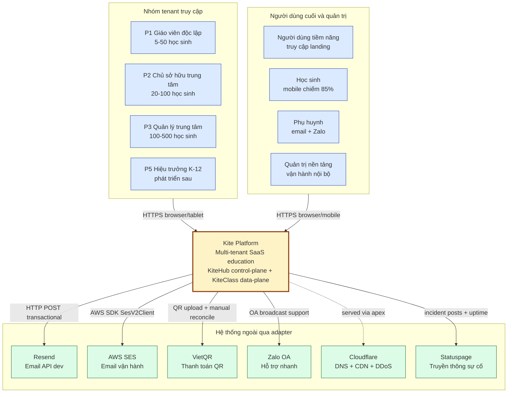

**Hình 2.1.** Sơ đồ ngữ cảnh hệ thống Kite Platform theo C4 Level 1.

Hình 2.1 cho thấy mọi actor đều truy cập Kite Platform qua HTTPS (TLS 1.2+); các hệ thống bên ngoài được cô lập qua adapter pattern (interface `NotificationChannel` cho email, `PaymentProcessor` cho VietQR). Không có actor nào truy cập trực tiếp cơ sở dữ liệu; mọi truy cập đều đi qua biên trust của gateway.

### 2.2.2 Sơ đồ container — C4 Level 2

Phóng to vào nội bộ Kite Platform cho thấy 4 cụm container: Frontend (2 ứng dụng Next.js), Gateway (Spring Cloud Gateway), Service (6 service KiteHub + 1 KiteClass core), và hạ tầng dùng chung (4 container với prefix `kite-`). Hình 2.2 trình bày bố cục container theo C4 Level 2.

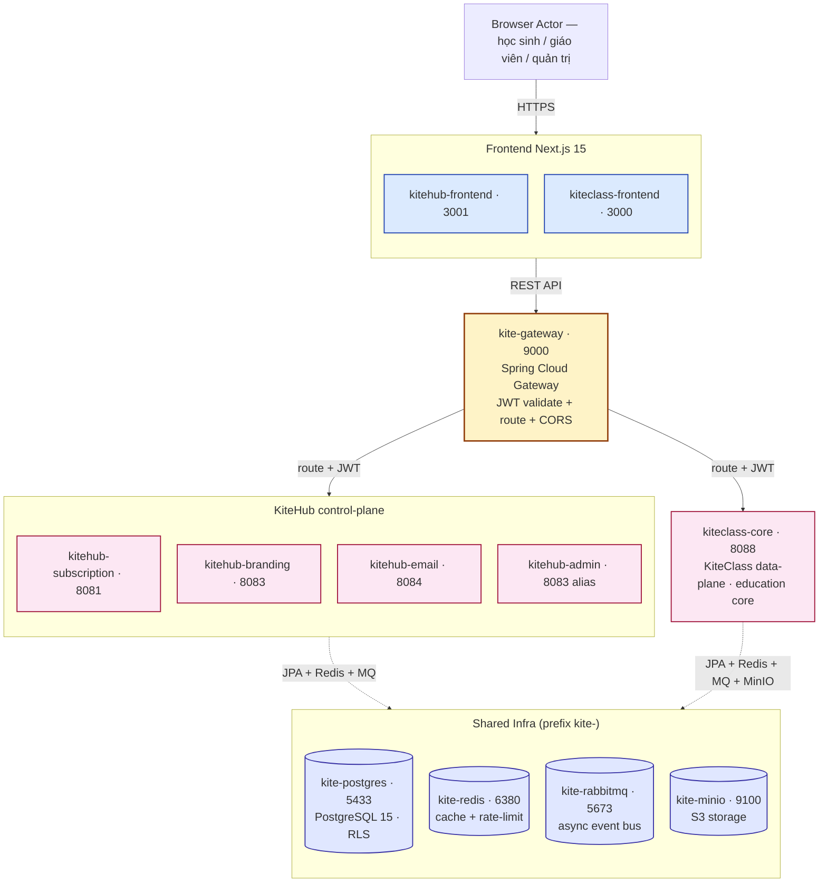

**Hình 2.2.** Sơ đồ container Kite Platform theo C4 Level 2.

Hình 2.2 cho thấy bố cục theo 4 cụm:

- **Frontend (2 container):** `kitehub-frontend` (Next.js 15 cổng 3001) phục vụ marketing và quản trị tenant; `kiteclass-frontend` (Next.js 15 cổng 3000) phục vụ giao diện giáo dục cho tenant (85% phiên truy cập từ mobile). Cả hai tự host trên EC2 qua trình quản lý process PM2, chia sẻ thư viện component `packages/shared-ui`.

- **Gateway (1 container):** `kite-gateway` (Spring Cloud Gateway cổng 9000) là entry point duy nhất cho mọi yêu cầu API backend. Trách nhiệm: xác thực chữ ký JWT HS256 và rút trích claim `tenantId`/`role`; phát các header `X-Tenant-Id` / `X-User-Id` / `X-User-Role` cho service downstream; enforce CORS với danh sách origin tường minh; rate-limit theo tenant qua bộ đếm trên Redis.

- **Cụm Service (6 KiteHub + 1 KiteClass):**
  - `kitehub-subscription` (8081) — xác thực, dùng thử, đăng ký dịch vụ, onboarding, beta access, DSAR, audit log, outbox, webhook thanh toán
  - `kitehub-branding` (8083) — sinh AI asset (logo, banner, hero), template, lưu trữ S3 qua MinIO; gọi Ollama (dev) hoặc MiniMax (vận hành)
  - `kitehub-email` (8084) — điều phối gửi email với adapter pattern `NotificationChannel` (`SESEmailService` chính + `ResendEmailService` dự phòng)
  - `kitehub-admin` (8083 alias) — thao tác quản trị nền tảng: duyệt yêu cầu beta, quản lý instance, đọc audit log, impersonation
  - `kitehub-platform` (thư viện JAR) — starter dùng chung: auth filter, tenant context, OpenTelemetry, DTO + error handler chung — không triển khai độc lập
  - `kiteclass-core` (8088) — lõi nghiệp vụ giáo dục: Student / Class / Attendance / Grade / Payment / Notification. Cô lập đa tenant qua PostgreSQL RLS (chi tiết §2.2.4)

- **Hạ tầng dùng chung (4 container, prefix `kite-`):**
  - `kite-postgres` (PostgreSQL 15, cổng 5433) — cơ sở dữ liệu OLTP chính, schema `kitehub` + `kiteclass_shared`, RLS phủ 51/91 bảng (56%) — chi tiết §2.2.4
  - `kite-redis` (Redis 7, cổng 6380) — cache + session store + rate-limit counter, chính sách LRU 256MB
  - `kite-rabbitmq` (RabbitMQ 3-management, cổng 5673) — event bus bất đồng bộ: `email.exchange`, `branding.deploy.*`, `instance.purge.exchange` (fanout)
  - `kite-minio` (tương thích S3, cổng 9100) — lưu trữ object cho AI asset + template SVG + upload từ người dùng; ánh xạ sang AWS S3 ở môi trường vận hành

Prefix `kite-` (thay vì `kitehub-` hay `kiteclass-`) phản ánh bản chất dùng chung của hạ tầng giữa hai sản phẩm KiteHub và KiteClass.

### 2.2.3 Quyết định pattern đa tenant — single-bucket + RLS

Quyết định kiến trúc trọng tâm của đồ án là chọn mô hình cô lập đa tenant. Đồ án đánh giá 6 pattern khác nhau trên 6 trục tiêu chí và lựa chọn **Shared Database + cột `tenant_id` UUID + PostgreSQL Row-Level Security (RLS)** — tương ứng "Pool" model theo AWS Well-Architected SaaS Lens [26, tr.21] (đối lập với "Silo" per-tenant DB và "Bridge" per-tenant schema). AWS định nghĩa [26, tr.21]: *"Pool isolation enables tenants to share infrastructure but rely on logical mechanisms (such as row-level security policies in databases) to ensure data isolation between tenants; this model often yields the lowest operational cost but requires careful design of the isolation layer."*

**Bảng 2.4.** Sáu pattern đa tenant và lý do chọn/loại.

| Pattern | Lý do chọn/loại |
|---|---|
| P1 Per-tenant database (1 RDS/tenant) | Chi phí ~$295/tháng cho 10 tenant so với ~$15 cho Pool model (chênh 20×); chi phí vận hành N× backup + N× migration + N× monitoring tăng tuyến tính theo số tenant, không phù hợp với phân khúc trung tâm SMB hiện tại |
| P2 Per-tenant schema | Quản lý migration phức tạp (Flyway chạy N lần/schema); không tăng đáng kể độ cô lập so với Pool + RLS |
| P3 Shared DB + chỉ `tenant_id` | An toàn yếu — bất kỳ lỗi ứng dụng (quên `WHERE`, edge case ORM query builder, raw SQL) đều dẫn tới leak ngầm |
| **P4 Shared DB + `tenant_id` + RLS** chọn | An toàn mạnh do enforce ở tầng cơ sở dữ liệu; chi phí vận hành thấp (1 RDS, 1 chuỗi migration); chi phí ~$15/tháng; vẫn cho phép truy vấn xuyên tenant qua vai trò admin BYPASS RLS |
| P5 Hybrid (Pool mặc định + Silo cho khách doanh nghiệp) | Sẽ phát triển khi mở rộng K-12 doanh nghiệp ở lộ trình phát triển sau và có yêu cầu cụ thể về cô lập vật lý từ khách hàng |
| P6 Serverless (Aurora Serverless v2 / DynamoDB) | Aurora Serverless v2 chi phí tối thiểu ~$45/tháng vượt Free Tier; DynamoDB không phù hợp với dữ liệu quan hệ giáo dục (Student/Class/Grade/Attendance JOIN-heavy) |

**Phương pháp chấm điểm.** Mỗi pattern được đánh giá trên thang **1-5** ở từng trục (1 = không phù hợp / 5 = phù hợp nhất với phạm vi hiện tại SMB của đồ án). Tổng điểm tối đa 30 (6 trục × 5 điểm). Rubric này **được xây dựng riêng** cho ngữ cảnh trung tâm dạy thêm SMB hiện tại của Kite Platform — tham khảo phương pháp luận đánh giá Pool/Bridge/Silo của AWS Well-Architected SaaS Lens [26, tr.21] và pattern comparison của Pothon [27], nhưng các trọng số trục cụ thể (chi phí ưu tiên cao do ràng buộc Free Tier, độ phức tạp vận hành ưu tiên cao do mô hình solo-dev) phản ánh ràng buộc kinh tế / nhân lực cụ thể của đồ án.

*Tiêu chí chấm điểm 1-5 cho từng trục:*
- **Độ mạnh cô lập:** 5 = enforce ở tầng cơ sở dữ liệu (vật lý hoặc chính sách RLS) / 3 = enforce ở tầng ứng dụng (qua bộ lọc trong code) / 1 = chỉ phụ thuộc kỷ luật code, không có cơ chế chặn ở DB.
- **Chi phí vận hành (5 = O(1)):** 5 = chi phí cố định không tăng theo số tenant (1 RDS chia sẻ + 1 chuỗi migration); 3 = tăng tuyến tính một phần (vd N schema cùng 1 RDS); 1 = tăng tuyến tính đầy đủ (N RDS + N migration + N monitoring).
- **Khả năng truy vấn xuyên tenant:** 5 = single query không cần JOIN/UNION + không cần bypass cơ chế cô lập; 3 = cần N query union qua nhiều scope; 1 = không khả thi nếu không thay đổi kiến trúc.
- **Phù hợp với phạm vi hiện tại:** 5 = chi phí ≤$15/tháng cho ≤10 tenant đầu + độ phức tạp triển khai thấp; 3 = chi phí $50-200/tháng hoặc cần thêm 1-2 tuần triển khai; 1 = chi phí ≥$500/tháng hoặc đòi hỏi tái cấu trúc lớn.
- **Vị thế tuân thủ (PDPL + ISO27001):** 5 = cô lập vật lý đáp ứng mọi yêu cầu pháp lý nghiêm ngặt; 4 = cô lập logic mạnh + audit trail đầy đủ + có khả năng chứng minh trong kiểm toán; 2 = không có cơ chế chặn cứng, phụ thuộc kỷ luật ứng dụng.
- **Chi phí chuyển đổi từ hiện trạng:** 5 = không cần thay đổi schema hiện tại, chỉ thêm chính sách RLS + cột `tenant_id`; 3 = cần refactor một phần (vd tách schema per tenant); 1 = cần migrate dữ liệu sang kiến trúc khác (vd N-database, serverless).

**Bảng 2.5.** Ma trận so sánh 6 pattern trên 6 trục (Pattern 4 đạt tổng 26/30 cho phạm vi hiện tại).

| Trục đánh giá | P1 Per-DB | P2 Per-schema | P3 ID only | **P4 RLS** | P5 Hybrid | P6 Serverless |
|---|:---:|:---:|:---:|:---:|:---:|:---:|
| Độ mạnh cô lập | 5 | 4 | 2 | **3** | 4 | 3 |
| Chi phí vận hành (5 = O(1)) | 1 | 3 | 5 | **5** | 2 | 4 |
| Khả năng truy vấn xuyên tenant | 2 | 4 | 5 | **4** | 3 | 3 |
| Phù hợp với phạm vi hiện tại | 1 | 3 | 4 | **5** | 1 | 2 |
| Vị thế tuân thủ (PDPL + ISO27001) | 5 | 3 | 2 | **4** | 5 | 4 |
| Chi phí chuyển đổi từ hiện trạng | 1 | 3 | 5 | **5** | 3 | 2 |
| **Tổng** | 15 | 20 | 23 | **26** | 18 | 18 |

*Diễn giải cho cột Pattern 4 RLS (chọn — tổng 3+5+4+5+4+5 = 26/30):*
- **Độ mạnh cô lập = 3:** RLS enforce ở tầng cơ sở dữ liệu qua chính sách `USING + WITH CHECK` cùng cột `tenant_id UUID NOT NULL` và chế độ NULL force-fail (chi tiết §2.2.4). Điểm 3 (không phải 5) vì RLS là cô lập **logic** chứ không phải cô lập **vật lý** như Per-DB — vai trò siêu người dùng vẫn có thể BYPASS RLS, do đó cần thêm 4 lớp phòng thủ chiều sâu khác (xem §2.2.4) để đạt mức an toàn tương đương Per-DB.
- **Chi phí vận hành = 5:** 1 instance RDS `db.t3.micro` chia sẻ ≈$15/tháng (Free Tier), không scale tuyến tính theo số tenant. 1 chuỗi Flyway migration áp dụng cho mọi tenant — không cần per-tenant DDL. Monitoring tập trung (1 dashboard CloudWatch cho 1 RDS) thay vì N dashboard.
- **Khả năng truy vấn xuyên tenant = 4:** Vai trò `kitehub_admin` BYPASS RLS (qua `ALTER ROLE ... BYPASSRLS`), cho phép single query xuyên tenant phục vụ report toàn nền tảng và migration. Điểm 4 (không phải 5) vì cần ý thức rõ ràng khi viết code admin để không vô tình leak dữ liệu giữa tenant context — yêu cầu kỷ luật code review chặt chẽ.
- **Phù hợp với phạm vi hiện tại = 5:** Tổng chi phí hạ tầng ≤$15/tháng (RDS Free Tier 12 tháng đầu, ECS Fargate Spot, S3 dưới 5GB), phù hợp quy mô ≤10 tenant đầu của trung tâm SMB. Triển khai chỉ cần thêm cột `tenant_id` + 1 migration Flyway tạo chính sách RLS cho mỗi bảng — không cần tái cấu trúc kiến trúc.
- **Vị thế tuân thủ (PDPL + ISO27001) = 4:** Đáp ứng yêu cầu cô lập logic mạnh của PDPL 2023 (Điều 19 — bảo vệ dữ liệu cá nhân) và ISO/IEC 27001:2022 (A.8.3 — quản lý quyền truy cập), kèm audit trail đầy đủ qua bảng `audit_logs` PDPL Art 11. Điểm 4 (không phải 5) vì cô lập logic, không phải vật lý — khách hàng doanh nghiệp yêu cầu cô lập vật lý ở lộ trình phát triển sau sẽ cần chuyển sang Hybrid Path A (xem P5).
- **Chi phí chuyển đổi từ hiện trạng = 5:** Hiện trạng đã có cột `tenant_id` ở mọi bảng domain (mô hình P3 ban đầu); chuyển sang P4 RLS chỉ cần thêm chính sách RLS + cấu hình `SET LOCAL app.current_tenant_id` ở tầng kết nối DB, không cần migrate dữ liệu hay refactor entity model.

Pool model với RLS được chọn vì cân bằng giữa độ cô lập chấp nhận được (được tăng cường bởi chính sách NULL force-fail mô tả ở §2.2.4), chi phí vận hành thấp nhất, độ phù hợp với phạm vi hiện tại, và lộ trình chuyển đổi sang Hybrid Path A khi mở rộng đến nhóm khách hàng doanh nghiệp ở lộ trình phát triển sau.

### 2.2.4 Phòng thủ chiều sâu — 5 lớp cô lập cơ sở dữ liệu

Ngữ cảnh tenant (`tenantId`) được truyền xuyên suốt quy trình xử lý yêu cầu qua chuỗi 5 lớp; mỗi lớp là một cơ chế bảo vệ độc lập. Hình 2.3 minh họa quá trình này.

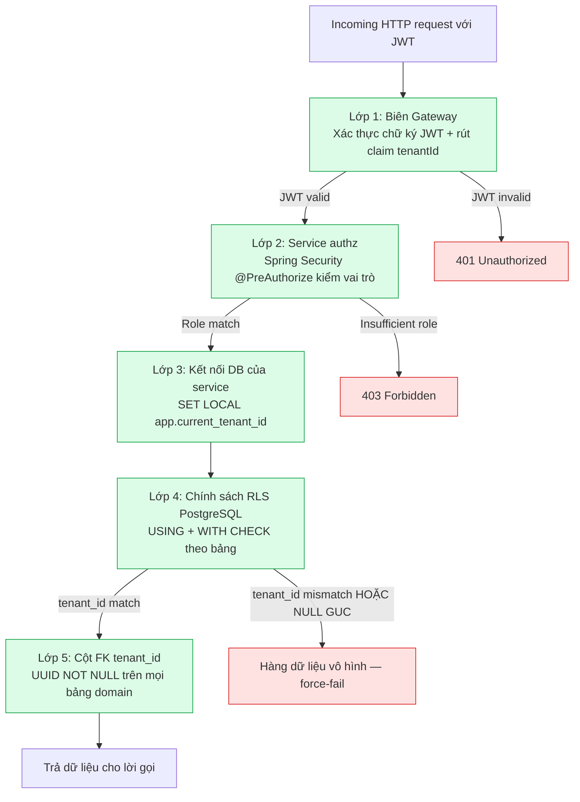

**Hình 2.3.** Phòng thủ chiều sâu 5 lớp cho cô lập đa tenant.

Mẫu chính sách RLS áp dụng cho mọi bảng có phạm vi tenant như sau (ví dụ với bảng `classes`):

```sql
ALTER TABLE classes
  ADD COLUMN tenant_id UUID NOT NULL REFERENCES tenants(id);

ALTER TABLE classes ENABLE ROW LEVEL SECURITY;
ALTER TABLE classes FORCE ROW LEVEL SECURITY;

-- Chính sách NULL force-fail
CREATE POLICY tenant_isolation_classes ON classes
  USING (
    tenant_id = current_setting('app.current_tenant_id', true)::uuid
    AND current_setting('app.current_tenant_id', true) IS NOT NULL
  )
  WITH CHECK (
    tenant_id = current_setting('app.current_tenant_id', true)::uuid
    AND current_setting('app.current_tenant_id', true) IS NOT NULL
  );

CREATE INDEX idx_classes_tenant_id ON classes(tenant_id);
```

Trên cơ sở dữ liệu hiện tại với 91 bảng (32 thuộc `kitehub-subscription` control-plane + 59 thuộc `kiteclass-core` domain đa tenant), RLS được bật trên 51 bảng (12 control-plane không force + 39 forced kiteclass) — tỉ lệ phủ 56% trên toàn bộ, hoặc 89% nếu loại trừ các bảng không thuộc phạm vi tenant (bảng `instances` gốc, M2M join cascade, catalog dùng chung, audit bất biến, dữ liệu theo user/request).

Hai cơ chế hardening quan trọng:

1. **NULL force-fail policy:** nếu GUC `app.current_tenant_id` chưa được set, `current_setting('...', true)` trả về NULL, khiến mệnh đề `tenant_id = NULL` rơi vào logic SQL ternary trả NULL — không filter row, gây leak ngầm. Thêm `AND current_setting(...) IS NOT NULL` khiến truy vấn trả 0 row thay vì tất cả, buộc bug lộ ra ngay trong test.
2. **HikariCP GUC reset:** HikariCP tái sử dụng kết nối từ pool. Nếu kết nối N được set `app.current_tenant_id = A` rồi trả về pool, kết nối kế tiếp có thể "kế thừa" ngữ cảnh tenant A. Vấn đề được khắc phục bằng `SET LOCAL` (giới hạn theo transaction, tự reset khi commit/rollback) cùng `connectionInitSql: RESET app.current_tenant_id` mỗi khi kết nối quay về pool.

### 2.2.5 Quy trình xác thực — JWT + role-guard + truyền ngữ cảnh tenant

Hình 2.4a-d trình bày tuần tự đăng nhập và một yêu cầu được xác thực sau đó cho luồng quản trị nền tảng.

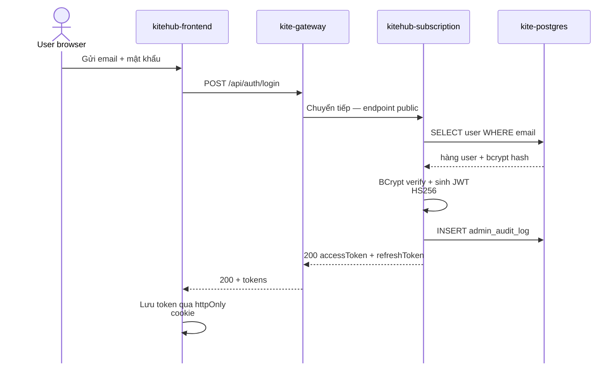

**Hình 2.4a.** Luồng đăng nhập — sinh JWT + audit log.

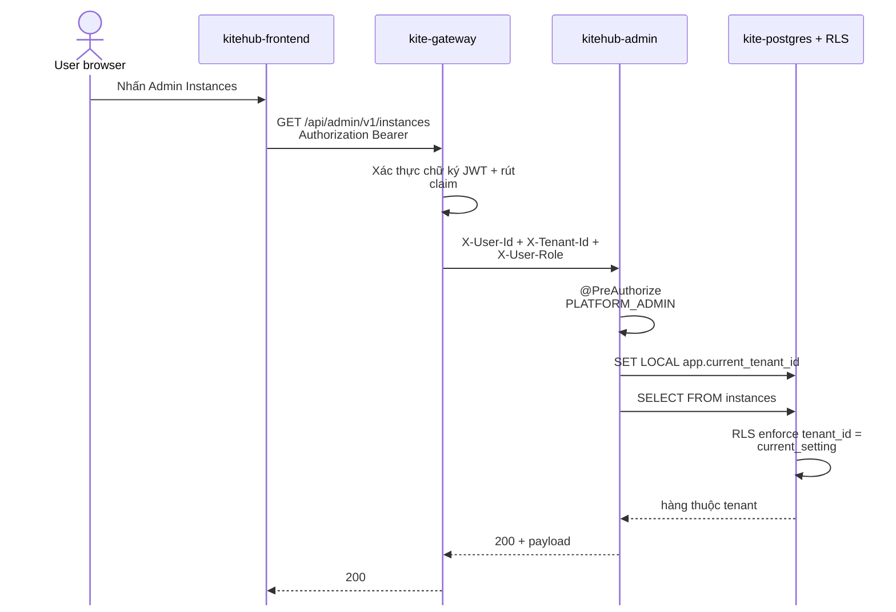

**Hình 2.4b.** Luồng yêu cầu đã xác thực — JWT validate + truyền ngữ cảnh tenant + RLS filter.

Một nguyên tắc thiết kế quan trọng được áp dụng: service KHÔNG được tự đọc claim `tenantId` từ JWT body. Gateway là biên trust duy nhất cho việc xác thực JWT; downstream service tin tưởng header `X-Tenant-Id` do gateway phát ra. Nếu mỗi service tự parse JWT, hệ thống phải duy trì public key ở nhiều nơi và lặp logic xác thực, tăng rủi ro an toàn và chi phí bảo trì.

### 2.2.6 Định tuyến đa tenant — Tenant → Domain → Landing

Mỗi trung tâm (tenant) sở hữu một trang giới thiệu công khai (landing page) riêng biệt, truy cập qua hai phương thức: subdomain mặc định `{slug}.kitehub.me` cấp cho mọi tenant, hoặc tên miền riêng (custom domain, ví dụ `skyedu.vn`) dành cho các gói dịch vụ cao cấp. Toàn bộ tenant dùng chung một mã nguồn giao diện và một cơ sở dữ liệu chia sẻ với cô lập mức hàng (RLS); nội dung cùng giao diện thương hiệu của từng tenant được phân giải theo trường Host của yêu cầu HTTP. Cơ chế này cho phép nền tảng phục vụ hàng trăm trang landing khác nhau mà không cần triển khai riêng từng bản, qua đó giữ chi phí vận hành ổn định khi số lượng tenant tăng.

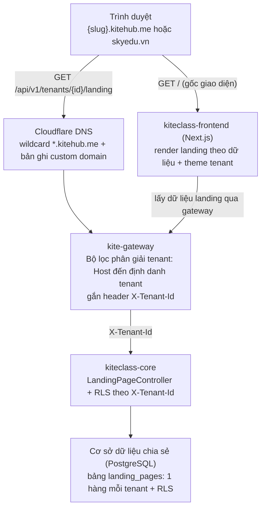

**Hình 2.4c.** Chuỗi định tuyến Tenant → Domain → Landing từ trình duyệt qua Cloudflare DNS, gateway phân giải tenant theo Host, đến lớp dữ liệu cô lập RLS.

Hệ thống xử lý hai đường yêu cầu song song. Đường thứ nhất phục vụ giao diện: trình duyệt gọi `GET /` tới ứng dụng Next.js, ứng dụng này tự lấy dữ liệu landing của tenant thông qua gateway. Đường thứ hai phục vụ dữ liệu: mọi yêu cầu `/api/**` đi qua gateway, nơi bộ lọc phân giải tenant đọc trường Host và ánh xạ thành định danh tenant theo bốn bước ưu tiên: thứ nhất là header nội bộ dành cho môi trường phát triển, thứ hai là so khớp hậu tố subdomain với tên miền gốc đã cấu hình, thứ ba là tra cứu theo tên miền riêng, và thứ tư là lấy từ claim của JWT làm phương án dự phòng. Sau khi xác định tenant, gateway gắn header `X-Tenant-Id` dạng UUID và kiểm tra trạng thái tenant phải là ACTIVE hoặc TRIAL trước khi chuyển tiếp tới dịch vụ lõi; nếu trạng thái khác, gateway trả về mã 503 để chặn truy cập vào tenant bị tạm ngưng.

| Tiêu chí | Subdomain `{slug}.kitehub.me` | Tên miền riêng `skyedu.vn` |
|---|---|---|
| Cấp cho | Mọi tenant (mặc định) | Gói PREMIUM/ENTERPRISE |
| DNS | Wildcard `*.kitehub.me` cấp sẵn | Tenant tự trỏ CNAME (subdomain) hoặc A (apex) |
| Chứng chỉ SSL | Dùng chứng chỉ wildcard sẵn có | Cloudflare for SaaS tự cấp qua xác thực DCV |
| Xác minh quyền sở hữu | Không cần | Bản ghi CNAME/TXT tách khỏi bản ghi định tuyến |

**Bảng 2.6.** So sánh subdomain và tên miền riêng trong cơ chế định tuyến đa tenant.

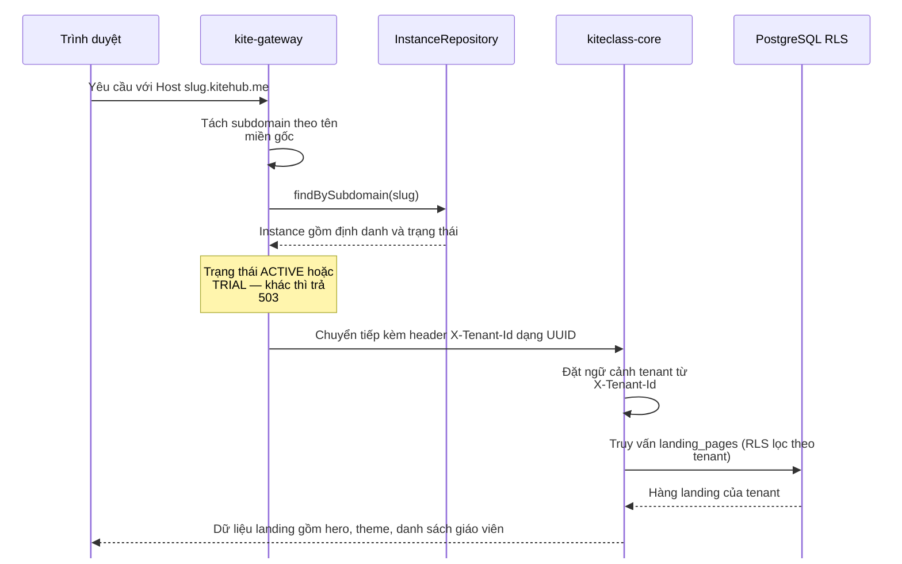

**Hình 2.4d.** Tuần tự phân giải tenant theo subdomain — gateway ánh xạ Host thành định danh tenant rồi truyền ngữ cảnh xuống lớp dữ liệu RLS.

Về an toàn, gateway là biên tin cậy duy nhất trong cơ chế định tuyến: header `X-Tenant-Id` do client gửi lên luôn bị loại bỏ và thay bằng giá trị do chính gateway phát hành sau khi phân giải Host, nhằm ngăn chặn tấn công giả mạo ngữ cảnh tenant để truy cập dữ liệu của tenant khác. Đối với tên miền riêng, nền tảng sử dụng dịch vụ Cloudflare for SaaS để tự động cấp chứng chỉ SSL thông qua cơ chế xác thực quyền kiểm soát tên miền (DCV — Domain Control Validation) bằng bản ghi CNAME, tách biệt khỏi bản ghi định tuyến lưu lượng; riêng tên miền gốc (apex) yêu cầu bản ghi A do bản ghi CNAME không hợp lệ ở mức gốc theo chuẩn DNS.

---

## 2.3 Thiết kế chi tiết

Phần này trình bày các sơ đồ thiết kế chi tiết theo ký pháp UML (Booch et al. [29]) bổ sung cho C4 model ở §2.2, cùng thiết kế cơ sở dữ liệu chi tiết và mô hình SaaS. §2.3.1 và §2.3.2 trình bày class diagram và ERD cho miền nghiệp vụ; §2.3.3 trình bày sequence diagram luồng cấp phát tenant; §2.3.4 trình bày máy trạng thái vòng đời tenant; §2.3.5 tổng kết phân rã service; §2.3.6 trình bày thiết kế cơ sở dữ liệu chi tiết; §2.3.7 trình bày mô hình SaaS (gói dịch vụ, thanh toán).

### 2.3.1 Class Diagram — Core Domain

Sơ đồ lớp UML mô tả các entity nghiệp vụ cốt lõi của Kite Platform cùng quan hệ giữa chúng. Hình 2.5 trình bày các lớp chính trong miền giáo dục đa tenant.

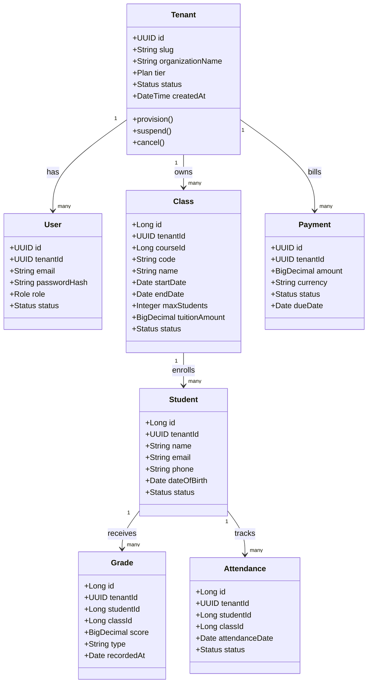

**Hình 2.5.** Class diagram — core domain entities và quan hệ.

Class diagram tập trung vào hành vi runtime cùng các phương thức nghiệp vụ chính: `Tenant.provision()` khởi tạo instance mới khi quản trị duyệt yêu cầu beta; `Tenant.suspend()` được gọi khi thanh toán thất bại quá thời gian ân hạn; `Tenant.cancel()` đánh dấu off-boarding sau cửa sổ lưu giữ 7 ngày. Cột `tenantId` UUID xuất hiện ở mọi entity domain — đây là cột khoá ngoại bắt buộc cho chính sách RLS PostgreSQL được mô tả ở §2.2.4.

### 2.3.2 ERD — Sơ đồ quan hệ thực thể

Sơ đồ ERD (Entity Relationship Diagram) cung cấp góc nhìn ở tầng lưu trữ, tập trung vào tính cardinality giữa các bảng — khác với class diagram §2.3.1 vốn tập trung vào hành vi runtime và phương thức.

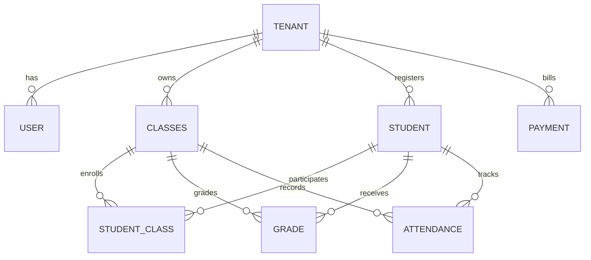

**Hình 2.6.** Sơ đồ ERD high-level mô tả quan hệ giữa các entity chính trong hệ thống.

ERD nhấn mạnh quan hệ many-to-many giữa `STUDENT` và `CLASSES` qua bảng nối `STUDENT_CLASS` (một học sinh có thể đăng ký nhiều lớp, một lớp có nhiều học sinh) — chi tiết quan hệ này bị che giấu ở class diagram cấp độ runtime. Mọi quan hệ xuất phát từ `TENANT` đều có cardinality `1..N` thể hiện ranh giới đa tenant: không có entity nghiệp vụ nào tồn tại ngoài ngữ cảnh tenant.

### 2.3.3 Sequence Diagram — Luồng cấp phát tenant

Luồng cấp phát tenant từ lúc người dùng tiềm năng gửi yêu cầu beta đến khi chủ sở hữu trung tâm đăng nhập lần đầu trải qua nhiều bước phối hợp giữa frontend, backend và các dịch vụ ngoài. Hình 2.7a-b trình bày tuần tự các bước theo ký pháp UML.


**Hình 2.7a.** Pha PENDING — người dùng gửi yêu cầu beta, hệ thống ghi nhận chờ quản trị duyệt.

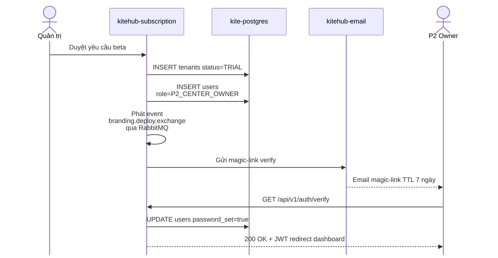

**Hình 2.7b.** Pha TRIAL — quản trị duyệt yêu cầu, hệ thống cấp tenant + gửi magic-link, người dùng kích hoạt tài khoản. Sự kiện `branding.deploy.exchange` được phát qua RabbitMQ song song cho `kitehub-branding` dựng template mặc định.

Tuần tự cho thấy ranh giới giữa pha PENDING (chờ duyệt thủ công) và pha TRIAL (sau khi quản trị kích hoạt) — đây là điểm chuyển trạng thái quan trọng được tham chiếu lại tại Hình 2.8 §2.3.4 (máy trạng thái vòng đời tenant). Việc phát sự kiện fanout `branding.deploy.exchange` qua RabbitMQ song song với gửi email cho phép `kitehub-branding` dựng template mặc định trong khi chờ chủ sở hữu trung tâm xác thực — giảm thời gian onboarding khi user click magic-link.

### 2.3.4 Máy trạng thái vòng đời tenant

Vòng đời tenant do service `kitehub-subscription` quản lý theo máy trạng thái 5 trạng thái biểu diễn trong Hình 2.8.

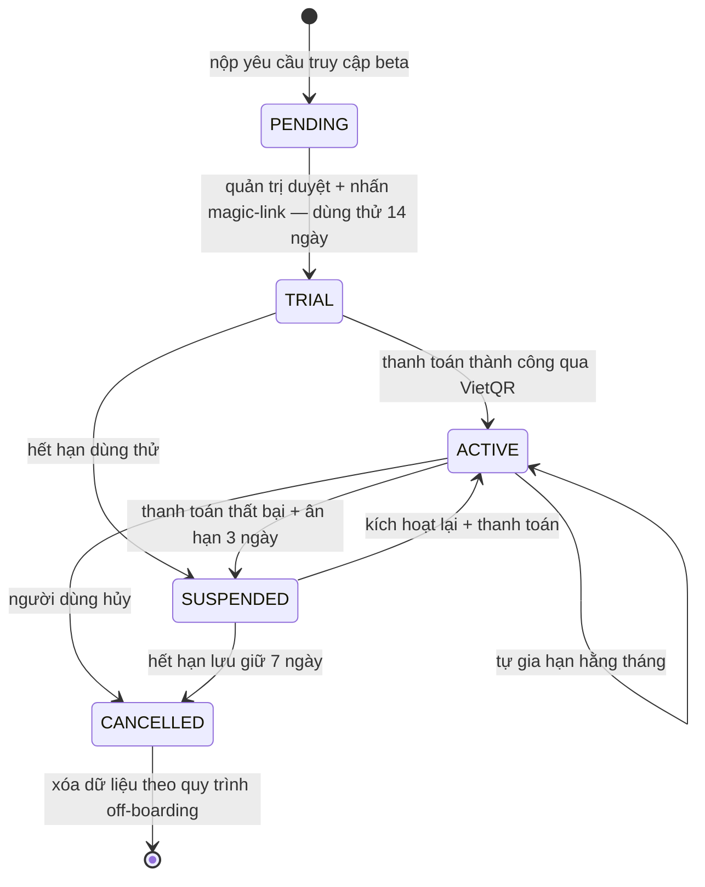

**Hình 2.8.** Máy trạng thái vòng đời tenant.

Diễn giải các bước chuyển trạng thái: PENDING → TRIAL khi quản trị duyệt yêu cầu beta và kích hoạt cấp phát (tạo `instance_id` UUID, khởi tạo `P2_CENTER_OWNER`, gửi magic-link) — dùng thử 14 ngày. TRIAL → ACTIVE khi thanh toán thành công + hệ thống phát hành hóa đơn. ACTIVE → SUSPENDED sau khi gia hạn thất bại + ân hạn 3 ngày — tenant không đăng nhập được, dữ liệu lưu giữ 7 ngày. SUSPENDED → CANCELLED sau 7 ngày lưu giữ — dữ liệu domain xóa theo off-boarding; audit log lưu theo PDPL Điều 11 [9]. Cột `tenant_id` tồn tại đến khi CANCELLED + cửa sổ lưu giữ kết thúc; chính sách RLS lọc dựa trên `tenant_id` KHÔNG dựa trên trạng thái — tầng service tự enforce kiểm tra trạng thái (tenant SUSPENDED hiển thị "Tài khoản bị tạm khóa, vui lòng liên hệ hỗ trợ").

### 2.3.5 Phân rã service — 6 service KiteHub + 1 KiteClass core

Danh mục service được tổng hợp theo mô hình Backstage [21] (mỗi service đóng vai một component có metadata + ownership + dependency).

**Bảng 2.7.** Danh mục service của Kite Platform.

| Service | Cổng | Trách nhiệm | Cơ sở dữ liệu |
|---|---|---|---|
| `kite-gateway` | 9000 | Xác thực JWT + định danh tenant + truyền ngữ cảnh + rate-limit | Bộ đếm trên Redis |
| `kitehub-subscription` | 8081 | Xác thực + dùng thử + đăng ký dịch vụ + thanh toán + onboarding + DSAR + audit + outbox + webhook + impersonation | Schema `kitehub` (32 bảng) |
| `kitehub-admin` | 8083 | Quản trị nền tảng — CRUD instance + thanh toán + dashboard doanh thu | Schema `kitehub` (chung) |
| `kitehub-branding` | 8083 alias | Sinh AI asset (logo/hero/banner) + upload S3 + tích hợp Ollama/MiniMax | Bảng `kitehub.branding_*` |
| `kitehub-email` | 8084 | Email giao dịch — adapter NotificationChannel (SES chính + Resend dự phòng) | Bảng `kitehub.email_logs` |
| `kitehub-platform` | thư viện JAR | Starter dùng chung — auth filter + tenant context + OpenTelemetry + DTO | — |
| `kiteclass-core` | 8088 | Nghiệp vụ giáo dục theo tenant — student/course/class/attendance/grade/payment | Schema `kiteclass_shared` (59 bảng) |

Các phụ thuộc liên service được tổng hợp gồm: `kitehub-subscription` gọi `kitehub-email` qua REST và sự kiện RabbitMQ `email.exchange`; `kitehub-subscription` phát sự kiện `branding.deploy.*` để `kitehub-branding` tiêu thụ; `kitehub-email` lấy gói branding qua WebClient để dựng template; `kiteclass-core` lưu trữ ảnh đại diện và bài nộp trên MinIO S3 và phát thông báo bất đồng bộ qua RabbitMQ.

Hệ thống được cấu thành từ ba lớp dịch vụ. Lớp nền tảng KiteHub gồm sáu dịch vụ độc lập đảm nhận các trách nhiệm khác nhau: quản trị nền tảng (`kitehub-admin`), nhận diện thương hiệu (`kitehub-branding`), thư điện tử (`kitehub-email`), điều phối yêu cầu (`kitehub-gateway`), thư viện dùng chung (`kitehub-platform`) và quản lý đăng ký (`kitehub-subscription`); trong đó năm dịch vụ triển khai container độc lập còn `kitehub-platform` là thư viện JAR dùng chung không triển khai riêng. Lớp nghiệp vụ tenant KiteClass tập trung tại dịch vụ `kiteclass-core` phục vụ toàn bộ chu trình giáo dục theo tenant. Lớp giao diện gồm hai ứng dụng Next.js phục vụ tập người dùng khác nhau: `kitehub-frontend` cho marketing và quản trị tenant, `kiteclass-frontend` cho giao diện giáo dục. Cùng với tám container hạ tầng dùng chung (cơ sở dữ liệu, cache, hàng đợi sự kiện, lưu trữ object) tạo thành tổng cộng mười bảy thành phần tách biệt.

### 2.3.6 Thiết kế cơ sở dữ liệu

Phần này trình bày schema chi tiết của hai bảng cốt lõi đại diện cho hai mặt phẳng đa tenant của Kite Platform: bảng `instances` thuộc cụm subscription (control-plane, quản lý vòng đời tenant) và bảng `students` thuộc cụm core (domain-plane, lưu hồ sơ học sinh và là bảng có yêu cầu tuân thủ PDPL chặt chẽ nhất). ERD tổng quan đã được giới thiệu tại §2.3.2; phần này bổ sung thông tin từng cột phục vụ phát triển và bảo trì. Schema được pull canonical từ chuỗi migration Flyway của hai cụm dịch vụ. Các bảng nghiệp vụ khác như `classes`, `courses`, `teachers`, `enrollments`, `attendance` tuân theo cùng quy ước (`instance_id` UUID + RLS theo tenant) đã trình bày tại §2.2.4 và quan hệ thực thể tại §2.3.2.

Bảng `instances` (microservice `kitehub-subscription`, control-plane) lưu metadata cấp tenant: mỗi dòng tương ứng với một trung tâm dạy thêm có dùng nền tảng. Bảng này là source-of-truth cho vòng đời tenant (TRIAL / ACTIVE / SUSPENDED / CANCELLED).

**Bảng 2.8.** Schema chi tiết bảng `instances` (microservice `kitehub-subscription`).

| TT | Tên cột | Kiểu dữ liệu | Mô tả |
|:--:|---|---|---|
| 1 | `id` | UUID | Khoá chính, định danh tenant (UUID v4) |
| 2 | `subdomain` | VARCHAR(50) UNIQUE | Subdomain riêng `<subdomain>.kitehub.me`, dùng cho routing |
| 3 | `custom_domain` | VARCHAR(255) | Tên miền riêng (chỉ áp dụng gói PRO trở lên) |
| 4 | `domain_verify_token` | VARCHAR(255) | Token DCV (Domain Control Validation) sinh khi tenant đăng ký tên miền riêng |
| 5 | `domain_verified_at` | TIMESTAMP | Thời điểm xác minh tên miền thành công qua bản ghi CNAME/TXT |
| 6 | `domain_status` | VARCHAR(50) | Trạng thái xác minh tên miền: `PENDING` / `VERIFIED` / `FAILED` |
| 7 | `organization_name` | VARCHAR(200) | Tên hiển thị trung tâm (ví dụ `Trung tâm Anh ngữ Sky Education`) |
| 8 | `owner_id` | UUID | Tham chiếu tới user vai trò `P2_CENTER_OWNER` |
| 9 | `tier` | VARCHAR(20) | Gói dịch vụ: FREE / STARTER / PRO / PRO_PLUS |
| 10 | `status` | VARCHAR(20) | Trạng thái vòng đời: TRIAL / ACTIVE / SUSPENDED / CANCELLED |
| 11 | `database_url` | VARCHAR(500) | URL kết nối cơ sở dữ liệu của tenant |
| 12 | `database_password` | VARCHAR(255) | Mật khẩu DB đã mã hoá AES-256-GCM (không lưu plaintext) |
| 13 | `trial_started_at` | TIMESTAMP | Thời điểm bắt đầu dùng thử |
| 14 | `trial_expires_at` | TIMESTAMP | Thời điểm hết hạn dùng thử (mặc định 14 ngày) |
| 15 | `subscription_expires_at` | TIMESTAMP | Thời điểm hết hạn gói đang sử dụng |
| 16 | `created_at` | TIMESTAMP | Thời điểm tạo bản ghi |
| 17 | `updated_at` | TIMESTAMP | Thời điểm cập nhật gần nhất |
| 18 | `deleted` | BOOLEAN | Cờ xoá mềm (soft delete) phục vụ cửa sổ lưu giữ 7 ngày |

Các chỉ mục trên `subdomain`, `owner_id`, `status`, `tier`, và partial index `deleted=false` đảm bảo truy vấn dashboard quản trị (lọc theo gói + trạng thái) đạt P95 dưới 100ms ngay cả khi quy mô lên 200 tenant.

Bảng `students` (microservice `kiteclass-core`, domain-plane) lưu hồ sơ học sinh đã đăng ký tại tenant. Bảng này có volume lớn nhất trong các bảng domain (mục tiêu 50-500 học sinh/tenant hiện tại) và là bảng chịu yêu cầu tuân thủ PDPL chặt chẽ nhất do chứa thông tin cá nhân nhạy cảm.

**Bảng 2.9.** Schema chi tiết bảng `students` (microservice `kiteclass-core`).

| TT | Tên cột | Kiểu dữ liệu | Mô tả |
|:--:|---|---|---|
| 1 | `id` | BIGSERIAL | Khoá chính (tự tăng) |
| 2 | `instance_id` | UUID NOT NULL | Khoá ngoại tới `instances.id` — bắt buộc cho RLS |
| 3 | `name` | VARCHAR(100) | Họ tên đầy đủ (ví dụ `Trần Thị Hồng`) |
| 4 | `email` | VARCHAR(255) | Email liên lạc (có thể NULL nếu phụ huynh chưa cung cấp) |
| 5 | `phone` | VARCHAR(20) | Số điện thoại VN (ví dụ `0901 234 567`) |
| 6 | `date_of_birth` | DATE | Ngày sinh |
| 7 | `gender` | VARCHAR(10) | Giới tính |
| 8 | `address` | TEXT | Địa chỉ liên lạc |
| 9 | `avatar_url` | VARCHAR(500) | Đường dẫn ảnh đại diện trên MinIO S3 |
| 10 | `status` | VARCHAR(20) | Trạng thái: PENDING / ACTIVE / INACTIVE / GRADUATED / DROPPED |
| 11 | `note` | TEXT | Ghi chú nội bộ của trung tâm |
| 12 | `created_at` | TIMESTAMP | Thời điểm tạo hồ sơ |
| 13 | `updated_at` | TIMESTAMP | Thời điểm cập nhật gần nhất |

Bảng `students` chứa thông tin cá nhân nhạy cảm và do đó phải tuân thủ PDPL 2023 Điều 11 [9] về quyền của chủ thể dữ liệu. Hiện tại cho trung tâm dạy thêm SMB, các trường nhạy cảm cao (CMND/CCCD, mã định danh học sinh quốc gia) không được lưu trữ; khi mở rộng sang K-12 ở lộ trình phát triển sau, các yêu cầu của DPO/DPIA sẽ bổ sung trường mã hoá riêng cho thông tin trẻ vị thành niên.

### 2.3.7 Mô hình SaaS — gói dịch vụ + thanh toán

**Quy trình cấp phát tenant.** Khi quản trị nền tảng duyệt yêu cầu truy cập beta, service `kitehub-subscription` chạy quy trình tự động gồm 8 bước:

1. Sinh `instance_id` (UUID v4)
2. Đặt subdomain `<tenant-slug>.kitehub.me` qua Cloudflare DNS API
3. Khởi tạo người dùng quản trị vai trò `P2_CENTER_OWNER`, mật khẩu chưa đặt
4. Sinh magic-link token TTL 7 ngày
5. Gửi email từ `support@kitehub.me` chứa magic-link
6. Phát sự kiện fanout `branding.deploy.exchange` → `kitehub-branding` dựng template mặc định
7. Lập lịch sự kiện `instance.purge.exchange` (TRIAL → SUSPENDED tự động sau 14 ngày)
8. Cập nhật bảng `onboarding_progress` trạng thái PENDING → TRIAL

Chủ sở hữu trung tâm nhấn magic-link, đặt mật khẩu và đăng nhập lần đầu sẽ thấy dashboard wizard 5 bước: xác nhận thông tin trung tâm, upload logo (hoặc sinh tự động), thêm 3 lớp đầu tiên, mời quản lý/giáo viên, thiết lập phương thức thanh toán.

**Ma trận gói dịch vụ.** Đồ án thiết kế bốn gói dịch vụ phân tầng theo persona mục tiêu (Bảng 2.10). Hai gói FREE và STARTER đã kiểm chứng hiện tại với hai giáo viên độc lập; hai gói PRO và PRO_PLUS thuộc lộ trình phát triển sau khi mở rộng cohort tenant.

**Bảng 2.10.** Bốn gói dịch vụ và các giới hạn theo gói.

| Gói | Trạng thái | Persona mục tiêu | Giá tháng | Số học sinh | Số lớp | Lượt sinh ảnh AI/ngày | Tên miền riêng (custom domain) | Email DKIM-verified |
|---|---|---|---|---|---|---|---|---|
| FREE | Hiện tại | P1 Giáo viên độc lập | `0đ` (dùng thử 14 ngày) | 50 | 5 | 3 | Không (chỉ subdomain `*.kitehub.me`) | Mặc định (shared DKIM) |
| STARTER | Hiện tại | P2 Chủ sở hữu trung tâm SMB | `500.000đ/tháng` | 100 | 10 | 10 | Không | Mặc định |
| PRO | Phát triển sau | P3 Quản lý trung tâm | `1.500.000đ/tháng` | 500 | 50 | 50 | Có (custom CNAME) | Mặc định |
| PRO_PLUS | Phát triển sau | Chuỗi nhượng quyền multi-branch | `5.000.000đ/tháng` | 2000 | 200 | 200 | Có (custom CNAME + IP riêng) | DKIM-verified riêng |

**Trạng thái hiện thực hoá.** Mã nguồn hiện tại trên kho lưu trữ KiteHub đã định nghĩa enum `PricingTier` với bốn cấp giá `FREE / BASIC / PREMIUM / ENTERPRISE` cùng mức giá `0đ / 500.000đ / 1.500.000đ / báo giá riêng`, khớp ba tầng giá đầu của Bảng 2.10 dưới tên gọi cũ. Việc đổi tên gói sang `FREE / STARTER / PRO / PRO_PLUS` để thân thiện với người dùng và đồng nhất với phân tích nhóm người dùng đại diện tại §1.1.2, bổ sung trường giới hạn `maxClasses`, và xây dựng bảng `tenant_quota` kết hợp bộ đếm Redis cho cơ chế enforcement HTTP 429 ở tầng tenant thuộc lộ trình phát triển sau. Tính năng nhận diện email DKIM riêng cho gói cao cấp (cột "Email DKIM-verified" cho PRO_PLUS) cũng thuộc lộ trình phát triển sau.

Việc enforce quota dùng bảng `tenant_quota` kết hợp bộ đếm Redis kiểm tra ở mỗi request. Khi vượt quota, hệ thống trả HTTP 429 cùng banner UI hướng dẫn nâng gói.

**Thanh toán và hóa đơn.** Hiện tại dùng VietQR thủ công: chủ sở hữu trung tâm chuyển khoản theo nội dung VietQR và upload ảnh xác nhận, quản trị nền tảng đối soát bằng tay. Cách tiếp cận này khớp thói quen thanh toán phổ biến (bank transfer chiếm ~70% giao dịch giáo dục) và tránh phụ thuộc giấy phép trung gian thanh toán trong quá trình kiểm chứng sản phẩm.

Roadmap lộ trình phát triển sau: hóa đơn điện tử VAT tích hợp MISA MeInvoice theo Thông tư 78/2021/TT-BTC (thay vì tự xây engine); cron tính phí bỏ qua khung Tết; merchant integration với VNPay/MoMo qua hình thức đối tác (không yêu cầu giấy phép PSP); hỗ trợ tự thu cho tenant ACTIVE theo lựa chọn; hoàn tiền và tranh chấp dưới dạng SOP thủ công.
