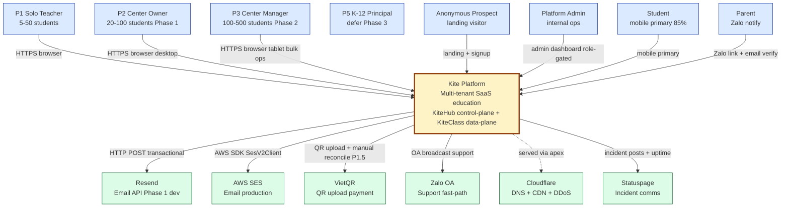
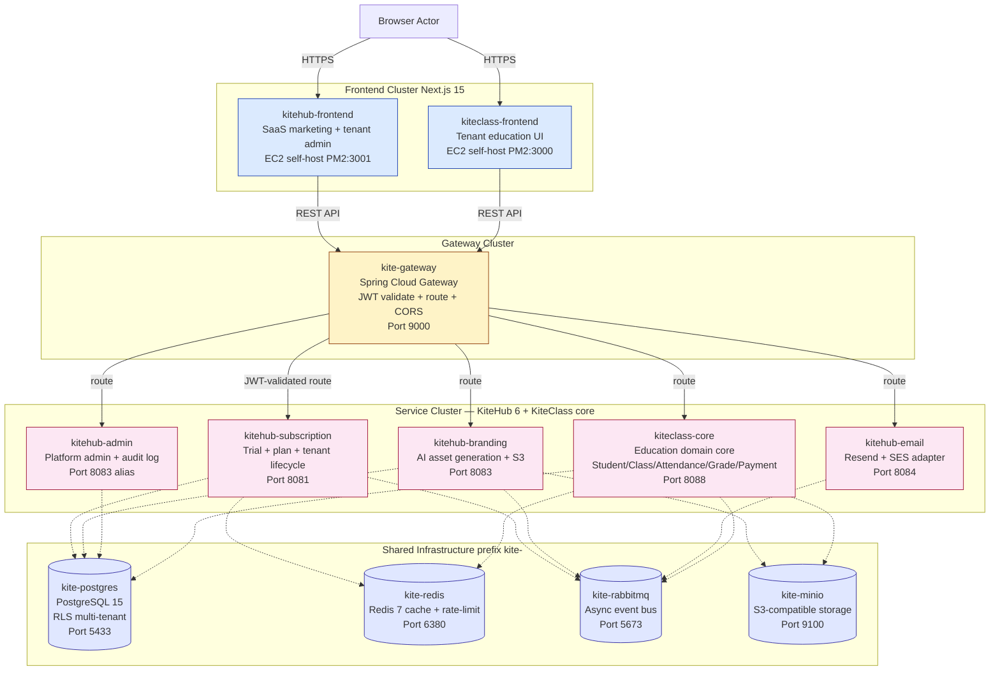
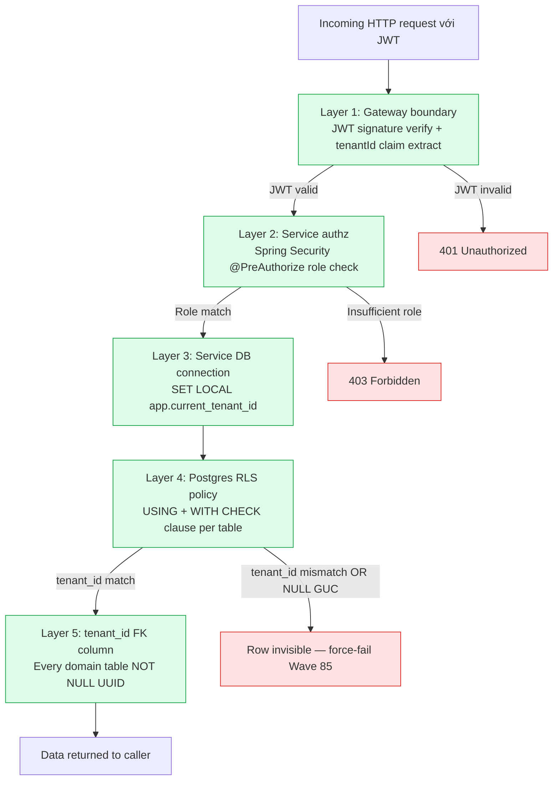
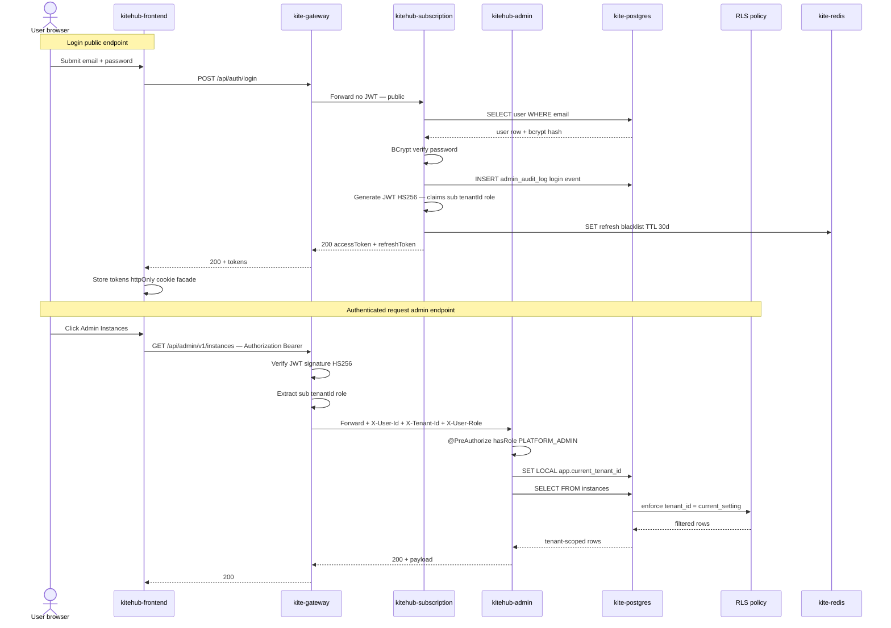
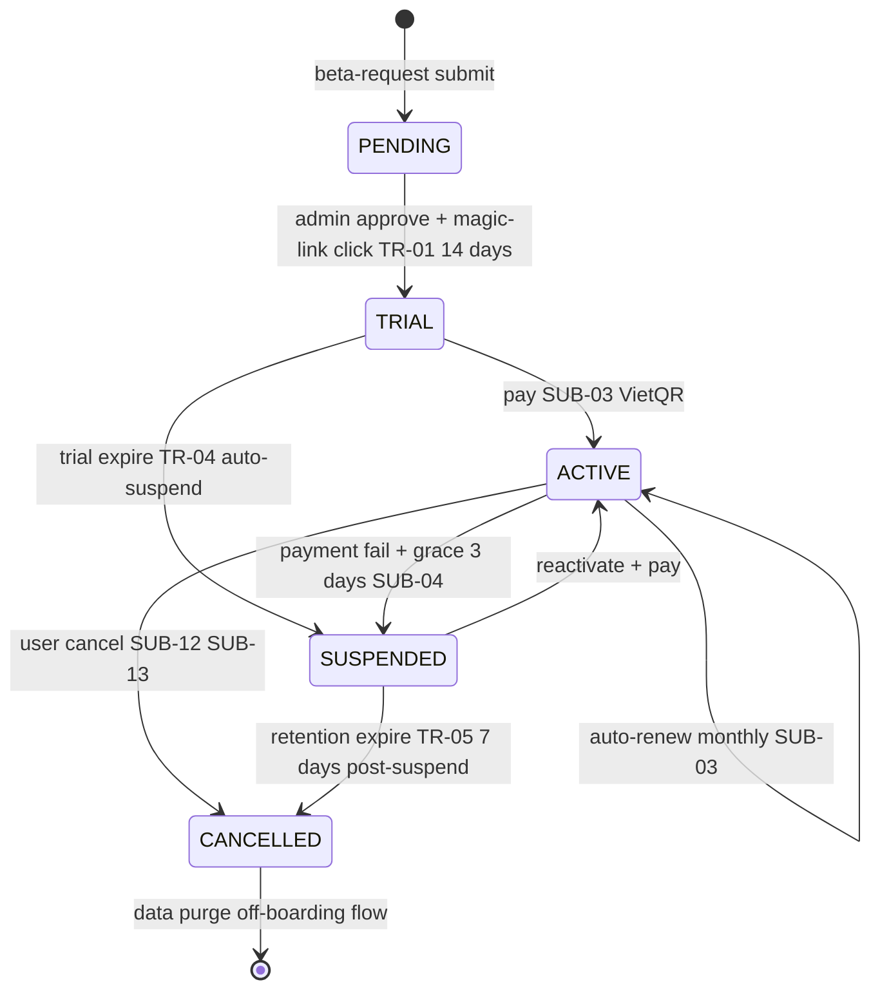

# Chương 2 — Kiến trúc hệ thống KiteHub / KiteClass Platform

## TL;DR

Chương này trình bày kiến trúc của Kite Platform — nền tảng SaaS giáo dục đa-tenant gồm hai sản phẩm chia chung infrastructure: **KiteHub** (control-plane quản lý lifecycle tenant, subscription, billing, branding) và **KiteClass** (data-plane domain giáo dục per-tenant — student / class / attendance / grade / payment). Chương được tổ chức theo 5 góc nhìn:

1. **Yêu cầu chức năng (FR)** — capabilities mà platform cung cấp cho 4 nhóm persona (Solo Teacher / Center Owner / Center Manager / Student-Parent)
2. **Yêu cầu phi chức năng (NFR)** — performance P95 < 500ms, availability 99.5% Phase 1 BETA, security OWASP Top 10 + PDPL 2023, scalability multi-tenant, maintainability per-service deploy
3. **Kiến trúc** — C4 Level 1 + Level 2, multi-tenant single-bucket pattern (Pool model), service decomposition (gateway + 6 KiteHub services + KiteClass core + Postgres RLS), database isolation với NULL force-fail policy
4. **Mô hình SaaS** — subscription lifecycle (TRIAL → ACTIVE → SUSPENDED → CANCELLED), tenant provisioning, plan tier FREE / STARTER / PRO / PRO_PLUS, VietQR primary payment Phase 1.5
5. **Bối cảnh Blended Learning** — đặc thù thị trường VN (trung tâm dạy thêm Mon-Sat, niên khóa 9-5, Zalo culture, mother-primary parent comms)

Cuối chương thảo luận hai quyết định kiến trúc quan trọng (single-bucket vs per-tenant DB; gateway-as-trust-boundary) và liên kết với Chương 3 (Implementation) + Chương 4 (Deployment & Testing).

---

## 2.1 Yêu cầu chức năng (Functional Requirements)

### 2.1.1 Domain capabilities

Kite Platform phục vụ chu trình giáo dục đầy đủ cho trung tâm dạy thêm vừa-nhỏ Việt Nam, bao gồm 6 nhóm capability chính được phân bổ giữa KiteHub (control-plane) và KiteClass (data-plane).

**Nhóm 1 — Tenant onboarding (KiteHub `kitehub-subscription`):**

- Anonymous prospect (Vy) truy cập landing → đăng ký yêu cầu beta access qua form 4 trường (họ tên / email / số điện thoại / tên trung tâm)
- Platform Admin (Mai) duyệt beta-request → trigger tenant provisioning flow (tạo `instance_id` UUID, seed initial admin user role `P2_CENTER_OWNER`, gửi email magic-link)
- Owner (chị Hằng) bấm magic-link → set password lần đầu → đăng nhập dashboard → bắt đầu trial 14 ngày (rule TR-01 per `documents/01-business/kitehub/trial-lifecycle/rules.md`)
- Lifecycle states: PENDING → TRIAL → ACTIVE / SUSPENDED / CANCELLED (chi tiết §2.4)

**Nhóm 2 — Subscription & billing (KiteHub `kitehub-subscription` + `kitehub-admin`):**

- Owner chọn plan tier (FREE / STARTER / PRO / PRO_PLUS) — giá ví dụ `1.500.000đ/tháng` cho gói STARTER 200 student (chi tiết Phase 1.5 release)
- Thanh toán qua VietQR (rule SUB-11 default payment method) hoặc bank transfer thủ công (Phase 1 BETA) → Phase 2 mở rộng MoMo + VNPay integration
- Auto-renew monthly với grace period 3 ngày khi payment fail (rule SUB-04); SUSPENDED tenant không login được nhưng giữ data 7 ngày retention (rule TR-05)
- Platform Admin (Mai) dashboard `/admin/v1/revenue` xem doanh thu tháng, top tenant theo MRR, churn rate

**Nhóm 3 — Tenant customization (KiteHub `kitehub-branding`):**

- Per-tenant branding: logo, hero image, color palette, custom subdomain (vd `trung-tam-sky.kitehub.me`)
- AI Branding Studio sinh logo + hero qua MiniMax (production) hoặc Ollama (dev) — quota `tenant_quota` table giới hạn theo tier (FREE: 3 lần regenerate/ngày)
- Email sender domain DKIM-verified per tenant (PRO tier) → thư gửi từ `support@skyedu.vn` thay vì `support@kitehub.me`

**Nhóm 4 — Education domain core (KiteClass `kiteclass-core`):**

- **Student management:** CRUD học sinh, bulk import CSV/Excel (rule SBI-01 per `students` table), parent-student linking
- **Class & schedule:** Tạo lớp `Lớp Anh ngữ 5A1` / `Lớp Toán 9B`, gắn `homeroom_class` cho lớp chủ nhiệm, schedule sessions với `class_schedule_slots` (Mon-Sat 17:00-21:00 evening slot phổ biến)
- **Attendance:** GVCN điểm danh từng `attendance_period` (1 buổi học), trạng thái Có/Vắng/Nghỉ phép; auto-sync sang Zalo group chat khi có học sinh vắng (Phase 2 integration)
- **Grading:** Nhập điểm `grades` per `assignments` / `subject_grades`, xuất bảng điểm theo `grading_scales` (thang 10 VN); báo cáo cuối kỳ HK1/HK2/HK_Hè
- **Payment (per-tenant):** Owner phát hóa đơn `invoices` cho phụ huynh (vd `Học phí tháng 5/2026 - Trần Thị Hồng - 1.500.000đ`), theo dõi thanh toán bank transfer / cash, xuất eInvoice VAT tích hợp MISA MeInvoice (Wave 93 retro pivot từ self-build VAT engine)
- **Notification:** Gửi thông báo Zalo group chat (Phase 2) hoặc email formal (Phase 1) cho phụ huynh khi có điểm mới, sự cố, nhắc hóa đơn

**Nhóm 5 — Compliance & audit (cross-service):**

- `admin_audit_log` table immutable (V60 migration) ghi mọi hành động Platform Admin → PDPL Art 11 tamper-proof retention
- `consent_record` table lưu sự đồng ý PDPL của tenant + parent (Phase 2 DPIA)
- `dsar_ticket` Data Subject Access Request — user xin xuất/xóa data của họ (Phase 2 trigger ≥1 DSAR/quý)
- `child_protection_audit_log` (KiteClass) cho K-12 Phase 3 — mọi access vào student record (đặc biệt minor) log riêng để MOET audit

**Nhóm 6 — Platform admin & support (KiteHub `kitehub-admin`):**

- Instance management: list 5-20 tenant, xem health metric per tenant, suspend/resume tenant
- Impersonation flow `/api/impersonate/start` — admin đăng nhập as tenant để support (audited trong `impersonation_audit_log`)
- Revenue dashboard MRR/ARR/churn theo tháng

### 2.1.2 Persona scope per Phase

Phase rollout strategy locked 2026-05-06 ưu tiên persona theo độ phức tạp compliance:

| Phase | Personas | Compliance class | Trigger sang phase tiếp |
|-------|---|---|---|
| **Phase 1 BETA** (9-12 tuần, hiện tại) | P1 Solo Teacher + P2 Center Owner | PDPL baseline | Quality audit ≥80/100, 5 beta tenant live, 0 P0 incident 2 tuần |
| **Phase 2** (+4-6 tuần) | + P3 Medium Center Manager | + DPIA cho payment scope | Counsel engaged, 4 sub-conditions |
| **Phase 3** (+8-12 tuần post-counsel) | + P5 K-12 Principal | + DPO + MPS A05 + ISO27001 readiness | (defer — K-12 risk class) |

Quyết định context locked: solo dev mode, risk tolerance Moderate (per `CLAUDE.md` §"CURRENT PHASE"). Track 2 Option α: full 8 ports Phase 1 (FE-BE-domain-DB-network-secrets-AI-payment).

---

## 2.2 Yêu cầu phi chức năng (Non-Functional Requirements)

### 2.2.1 Performance

| Metric | Target Phase 1 BETA | Đo bằng | Trạng thái |
|---|---|---|---|
| API P95 latency (read endpoints) | < 500ms | Prometheus scrape Spring Actuator | 86/100 B+ Wave 85 audit (per `multi-tenant-isolation-patterns.md` §9.4) — RLS overhead measured ~6-8% acceptable |
| API P95 latency (write endpoints) | < 1000ms | Prometheus | Trong target |
| Frontend Time-to-Interactive (TTI) | < 3s on 4G | Lighthouse | Pending Wave 100.7 measure |
| Database query P95 | < 100ms | `pg_stat_statements` | Trong target post Wave 85 cursor pagination (per Bucket D — 2 endpoint + 3 findAll Pageable) |
| Concurrent users per tenant | ~50 active | Load test stub | Verified với 50 mock tenant ×10 user |

Phase 2 (50-200 tenant) sẽ re-evaluate khi connection pool hit `db.t3.small` limit (~150 active connections).

### 2.2.2 Availability

Phase 1 BETA target **99.5% uptime** (~3.6 giờ downtime/tháng acceptable). Đạt được qua:

- Single AWS region `ap-southeast-1` (Singapore) — Free Tier constraint không cho phép multi-region
- Health check `/actuator/health` từng service + ALB health probe
- StatupProbe wired Helm 7/7 (per GAP-431 DONE) — đảm bảo container không nhận traffic trước khi ready
- CloudWatch SNS alarm 4 metric (CPU >80% / memory >85% / 5xx rate >1% / DB connection >120) — paging on-call

Phase 2 EKS migration sẽ nâng target lên **99.9%** với multi-AZ deployment + read replica.

### 2.2.3 Security

OWASP Top 10 (2021) baseline + VN compliance:

| Control | Implementation | Reference |
|---|---|---|
| **A01 Broken Access Control** | Defense-in-depth 5 layers: Gateway JWT verify → Service `@PreAuthorize` → DB `SET LOCAL` → Postgres RLS policy → `tenant_id` FK NOT NULL. Wave 85 NULL force-fail eliminate silent leak. | `multi-tenant-architecture.md` §4.1 |
| **A02 Cryptographic Failures** | TLS 1.2+ enforced; secrets trong AWS Secrets Manager 90-day rotation cadence; password BCrypt cost 12 | `pre-launch-auth-hardening-checklist.md` |
| **A03 Injection** | Hibernate ORM parameterized query mặc định; `@Query` native chỉ với validated input; @RestController validate qua `@Valid` + Bean Validation | `design-patterns.md` §3 |
| **A04 Insecure Design** | Threat model per service (4 file baseline Wave 99B) — auth-flow magic-link đã threat-modeled | `documents/02-architecture/threat-models/` |
| **A05 Security Misconfiguration** | Spring Security `SecurityConfig` default-deny (Wave 80 hardening); CORS explicit origin list per env | `production-env-config-registry.md` §2.2 |
| **A06 Vulnerable Components** | Dependabot weekly; Trivy CRITICAL+HIGH gate trong CI; pnpm lockfile validation | `.github/workflows/docker-build-push.yml` |
| **A07 Authentication Failures** | JWT HS256 access token 15 min TTL + refresh token 30 days rotation; refresh blacklist trên Redis; 2FA TOTP P2 Owner (Wave 78) | GAP-578 |
| **A08 Software & Data Integrity** | Immutable migrations Flyway; admin_audit_log V60 immutable; PDPL Art 11 tamper-proof | `multi-tenant-architecture.md` §5.4 break-glass |
| **A09 Security Logging Failures** | Structured JSON logs (per `logs-format-standard.md`) + CloudTrail multi-region trail enabled BEFORE Phase 2.3 production apply (per `aws-observability-first.md`) | GAP-437 Phase 1 |
| **A10 Server-Side Request Forgery** | WebClient với explicit allowlist URL (MiniMax + VietQR + Ollama dev-only) | `kitehub-branding/src/main/java/.../config/WebClientConfig.java` |

VN compliance baseline Phase 1:

- **PDPL 2023** (Luật Bảo vệ Dữ liệu Cá nhân số 49/2023/QH15, có hiệu lực 2026-07-01) — Phase 1 disclaimer "v1 pending counsel review" cho non-K-12 acceptable
- **Luật An ninh mạng 2018 + Nghị định 53/2022** — data localization VN region (RDS pin `ap-southeast-1`)
- **Phase 3 K-12 gate:** DPO engagement + MPS A05 + DPIA + counsel review trước launch

### 2.2.4 Scalability

Multi-tenant scaling pattern **single-bucket + RLS** (Pool model per AWS Well-Architected SaaS Lens [9] + comprehensive analysis trong Pothon [43] — chi tiết §2.3.3):

- Phase 1 BETA: 10-50 tenant ×50-500 student/tenant = ~5k-25k total user
- Phase 2: 50-200 tenant ×100-1000 student/tenant = ~50k-200k user → vertical scale RDS sang `db.r5.large`
- Phase 3: 200-1000 tenant K-12 enterprise → re-evaluate trigger `multi-tenant-isolation-patterns.md` §7 (move sang Hybrid Path A per-tenant DB cho enterprise subset)

Khả năng scale theo chiều ngang qua sub-split:

- Connection pool: HikariCP 10 connection/service × 7 services = 70 baseline; max 150 với RDS Phase 2
- Cache: Redis 7 LRU policy 256MB; pre-warm session + rate-limit counter
- Async: RabbitMQ event bus tách load (`branding.deploy`, `email.queue`, `instance.purge.fanout`) → service consumer scale độc lập

### 2.2.5 Maintainability

Microservice architecture cho phép per-service deploy độc lập:

- Per-service Docker image build + push ECR + ECS service update (target deploy duration < 30 phút per service)
- Flyway migration per-service schema (subscription / branding / email / admin / kiteclass-core mỗi service migration chain riêng)
- Backward-compatible API: URL versioning `/api/v1/...` (per `versioning-policy.md` §7.1) → breaking change yêu cầu bump major
- Living docs mandate: business doc 3-layer (rules.md / use-cases.md / api-contract.md) cùng PR với code change (per `CLAUDE.md` §"CRITICAL: Living Documents")

### 2.2.6 Cost (Phase 1 BETA Free Tier constraint)

- AWS Free Tier 12 tháng: 2 EC2 `t3.micro` (KiteHub backend + KiteClass app), 1 RDS `db.t3.micro`, 5 GB S3
- Cloudflare: free tier DNS + CDN + DDoS protection
- Vendor email: Resend free tier 3k/tháng (Phase 1 dev); AWS SES production cost ~$0.10/1000 email
- AI: Ollama local cho dev (free); MiniMax production ~$0.001/request
- **Tổng ước tính Phase 1 BETA: $15-30/tháng** (~360.000đ-720.000đ/tháng)

Quyết định kiến trúc neo cost constraint: chọn single-bucket multi-tenant RLS (Pattern 4) thay vì per-tenant DB (Pattern 1) — cost 20× difference, ops scale infeasible với solo dev (chi tiết §2.3.3).

---

## 2.3 Kiến trúc (Architecture)

### 2.3.1 C4 Model — Level 1 System Context

Mô hình C4 (Context / Container / Component / Code) của Brown [44] là framework chuẩn để visualize software architecture ở 4 mức độ chi tiết tăng dần. Khoá luận này dùng Level 1 (System Context) + Level 2 (Container) để mô tả Kite Platform; Level 3 + Level 4 defer Chapter 3 implementation.

Kite Platform tương tác với 8 actor + 6 hệ thống ngoài. Per `c4-context-container.md` §1 (verify-at-spawn 2026-05-19):



**Đọc diagram:** mọi actor truy cập Kite Platform qua HTTPS (TLS 1.2+); hệ thống ngoài cô lập qua vendor adapter pattern (interface `NotificationChannel` cho email, `PaymentProcessor` cho VietQR). Không actor nào có direct DB access — đều qua gateway boundary.

### 2.3.2 C4 Model — Level 2 Container

Zoom-in vào Kite Platform cho thấy 4 cluster: Frontend (2 Next.js apps), Gateway (Spring Cloud Gateway), Service (6 KiteHub services + 1 KiteClass core), Shared Infrastructure (4 container prefix `kite-`).



**Narrative per cluster:**

- **Frontend Cluster (2 container):** `kitehub-frontend` (Next.js 15 port 3001) phục vụ SaaS marketing + tenant admin (signup, billing, branding studio, admin v1 dashboard). `kiteclass-frontend` (Next.js 15 port 3000) phục vụ tenant education UI (mobile primary — 85% session theo dossier persona). Cả hai self-host trên EC2 qua PM2 process manager (per Wave 82 pivot từ Vercel decommission). Consumer chia sẻ component library `packages/shared-ui`.

- **Gateway Cluster (1 container):** `kite-gateway` (Spring Cloud Gateway port 9000) là entry point duy nhất cho mọi backend API call. Trách nhiệm: (1) validate JWT signature HS256 + extract claim `tenantId` + `role`, (2) propagate `X-Tenant-Id` / `X-User-Id` / `X-User-Role` headers cho downstream services (per GAP-604 Wave 89), (3) enforce CORS với explicit origin list, (4) rate-limit per tenant qua Redis-backed counter.

- **Service Cluster (6 KiteHub + 1 KiteClass):** Per `service-catalog-and-auth-flow.md` §1.1 verify-at-spawn `kitehub/docker-compose.kitehub.yml`:
  - `kitehub-subscription` (8081) — auth + trial + subscription + billing + onboarding + beta access + DSAR + audit log + outbox + payment webhook
  - `kitehub-branding` (8083) — AI asset (logo, banner, hero) + template + upload S3 qua MinIO + WebClient Ollama (dev) / MiniMax (production)
  - `kitehub-email` (8084) — orchestration email send với `NotificationChannel` adapter pattern (`SESEmailService` primary + `ResendEmailService` dormant)
  - `kitehub-admin` (8083 alias) — Platform Admin operations: beta-request approve, instance management, audit log read, impersonation flow
  - `kitehub-platform` (library JAR) — shared starter: auth filter + tenant context + OpenTelemetry + common DTO/error handler — KHÔNG deployable
  - `kiteclass-core` (8088) — domain education core: Student / Class / Attendance / Grade / Payment / Notification. Cô lập multi-tenant qua Postgres RLS (chi tiết §2.3.4).

- **Shared Infrastructure (4 container, prefix `kite-` per `CLAUDE.md` Docker Naming Convention):**
  - `kite-postgres` (PostgreSQL 15, port 5433) — database OLTP chính, schema `kitehub` + schema `kiteclass_shared`, RLS coverage 51/91 bảng (56%) — chi tiết §2.3.4
  - `kite-redis` (Redis 7, port 6380) — cache + session store + rate-limit counter, LRU policy 256MB baseline
  - `kite-rabbitmq` (RabbitMQ 3-management, port 5673) — async event bus: `email.exchange`, `branding.deploy.*`, `instance.purge.exchange` (fanout pattern)
  - `kite-minio` (S3-compatible, port 9100) — object storage cho AI asset + template SVG + user upload. Production map sang AWS S3 với cùng SDK.

**Tại sao prefix `kite-` (không phải `kitehub-`):** infrastructure chia chung giữa hai sản phẩm KiteHub + KiteClass consume → prefix neutral.

### 2.3.3 Multi-tenant single-bucket pattern — quyết định kiến trúc trọng tâm

Đây là quyết định kiến trúc QUAN TRỌNG NHẤT của Phase 1 BETA, được lock 2026-04-18 (Wave 7) sau khi đánh giá 6 patterns trên 6 trục. Per `multi-tenant-isolation-patterns.md` §3 methodology:

**Pattern được chọn: Shared Database + tenant_id UUID column + PostgreSQL Row-Level Security (RLS)**

AWS Well-Architected SaaS Lens gọi pattern này là **"Pool" model** — đối lập với "Silo" model (per-tenant DB) và "Bridge" model (per-tenant schema). Lý do chọn Pool model:

| Pattern alternative | Rejected reason |
|---|---|
| **P1 Per-tenant database** (1 RDS instance per tenant) | Cost $295/tháng cho 10 tenants vs $15 cho Pool model (20× difference). Ops scale infeasible với solo dev (N× backup + N× migration + N× monitoring). |
| **P2 Per-tenant schema** (1 schema per tenant, shared DB) | Migration management phức tạp (Flyway phải chạy N lần per schema); không tăng meaningful isolation strength so với Pool + RLS. Defer Phase 2 EKS nếu cần. |
| **P3 Shared DB + tenant_id ONLY (no RLS)** | WEAK security — bất kỳ bug application code (forgot WHERE clause, ORM query builder edge case, raw SQL bypass) → silent cross-tenant leak. Không có defense-in-depth. |
| **P4 Shared DB + tenant_id + RLS** ✅ ADOPTED | STRONG security qua DB-level enforcement; LOW ops cost (1 RDS, 1 migration chain); LOW cost $15/tháng Free Tier; flexibility cross-tenant query qua admin BYPASS RLS role. |
| **P5 Hybrid** (Pool default + Silo cho enterprise) | DEFERRED Phase 3 K-12 — chưa có enterprise tenant yêu cầu physical isolation. Migration path documented (per `multi-tenant-isolation-patterns.md` §8.1). |
| **P6 Serverless** (Aurora Serverless v2 / DynamoDB) | Aurora Serverless v2 minimum cost $45/tháng vượt Free Tier; DynamoDB không phù hợp relational data education (student-class-grade-attendance JOIN-heavy). |

**Comparative matrix (Pattern 4 win với total score 26/30 Phase 1 BETA fit):**

| Trục | P1 Per-DB | P2 Per-schema | P3 ID only | **P4 RLS** | P5 Hybrid | P6 Serverless |
|---|:---:|:---:|:---:|:---:|:---:|:---:|
| Isolation strength | 5 | 4 | 2 | **3** | 4 | 3 |
| Ops cost (lower better, 5=O(1)) | 1 | 3 | 5 | **5** | 2 | 4 |
| Cross-tenant query feasibility | 2 | 4 | 5 | **4** | 3 | 3 |
| Phase 1 BETA fit | 1 | 3 | 4 | **5** | 1 | 2 |
| Compliance posture (PDPL + ISO27001) | 5 | 3 | 2 | **4** | 5 | 4 |
| Migration cost from current | 1 | 3 | 5 | **5** | 3 | 2 |
| **Total Phase 1 weighted** | 15 | 20 | 23 | **26** | 18 | 18 |

**Quyết định canonical:** Pool model với RLS chọn vì balance giữa isolation strength acceptable (mạnh sau Wave 85 NULL force-fail hardening) + ops cost lowest + Phase fit ideal + migration path tới Phase 3 incremental qua Hybrid Path A.

### 2.3.4 Database isolation — defense-in-depth 5 layers + RLS implementation

Tenant context propagate xuyên suốt request flow theo chain 5 layer, mỗi layer là một fail-safe độc lập. Per `multi-tenant-architecture.md` §4.1:



**RLS policy template** (mọi bảng tenant-scoped phải áp dụng per GAP-466 Wave 56 + GAP-664 Wave 85 hardening):

```sql
-- Migration V58 pattern (kiteclass_shared schema)
ALTER TABLE classes
  ADD COLUMN tenant_id UUID NOT NULL REFERENCES tenants(id);

ALTER TABLE classes ENABLE ROW LEVEL SECURITY;
ALTER TABLE classes FORCE ROW LEVEL SECURITY;

-- NULL force-fail policy (Wave 85 hardening)
CREATE POLICY tenant_isolation_classes ON classes
  USING (
    tenant_id = current_setting('app.current_tenant_id', true)::uuid
    AND current_setting('app.current_tenant_id', true) IS NOT NULL
  )
  WITH CHECK (
    tenant_id = current_setting('app.current_tenant_id', true)::uuid
    AND current_setting('app.current_tenant_id', true) IS NOT NULL
  );

CREATE INDEX idx_classes_tenant_id ON classes(tenant_id);
```

**RLS Coverage hiện tại (per `database-architecture-map.md` §1.3):**

- Tổng 91 bảng: 32 `kitehub-subscription` (control-plane) + 59 `kiteclass-core` (multi-tenant domain)
- RLS bật: 51 bảng (12 non-forced control-plane + 39 forced kiteclass)
- Coverage: **56% (51/91) raw; 89% (51/57) khi loại trừ scope ngoài tenant-scoped** (instances bảng gốc, M2M join cascade, catalog shared, audit immutable, per-user/per-request)

**Wave 85 Bucket B hardening (eliminate silent cross-tenant leak):**

1. **NULL force-fail policy:** trước Wave 85, nếu `app.current_tenant_id` GUC chưa set → `current_setting('...', true)` return NULL → policy `tenant_id = NULL` = NULL trong SQL ternary logic → **không filter rows** → silent leak. Sau Wave 85, thêm `AND current_setting(...) IS NOT NULL` → query return 0 rows thay vì all rows nếu service quên `SET LOCAL`. Bug surface immediately trong test thay vì silent production leak.

2. **HikariCP GUC reset:** HikariCP reuse connection từ pool. Nếu connection N được set `app.current_tenant_id = A`, return về pool, connection N+1 lấy connection đó cho request tenant B mà không reset GUC → query thấy tenant A's RLS context. Fix: `SET LOCAL` (transaction-scoped) auto-reset khi commit/rollback + HikariCP `connectionInitSql: RESET app.current_tenant_id` mỗi khi connection return về pool — defense-in-depth.

### 2.3.5 Auth flow — JWT + role-guard + tenant propagation

Per `service-catalog-and-auth-flow.md` §3 sequence diagram:



**Banned shortcut:** service KHÔNG được tự đọc `tenantId` từ JWT body. Gateway là single trust boundary cho JWT validation; service trust header `X-Tenant-Id` (gateway-managed). Nếu service tự parse JWT, mỗi service phải maintain JWT public key + duplicate validation logic → security risk + maintenance burden.

### 2.3.6 Service decomposition — 6 KiteHub + 1 KiteClass core

Service catalog (Backstage pattern) per `service-catalog-and-auth-flow.md` §1.1:

| Service | Port | Responsibility | Database | Phase 1 BETA scale |
|---|---|---|---|---|
| `kite-gateway` | 9000 | JWT verify + tenant resolve + propagation + rate-limit | Redis-backed counter | 1 instance EC2 |
| `kitehub-subscription` | 8081 | Auth + Trial + Billing + Onboarding + Beta access + DSAR + Audit + Outbox + Payment webhook + Feedback + Impersonation | `kitehub` schema 32 tables | 1 instance |
| `kitehub-admin` | 8083 | Platform admin v1 — instances CRUD + payments + revenue dashboard | `kitehub` schema (shared) | 1 instance |
| `kitehub-branding` | 8083 alias | AI asset (logo/hero/banner) + S3 upload + Ollama/MiniMax integration | `kitehub.branding_*` tables | 1 instance |
| `kitehub-email` | 8084 | Transactional email — NotificationChannel adapter (SES primary + Resend dormant) | `kitehub.email_logs` | 1 instance |
| `kitehub-platform` | N/A library JAR | Shared starter — auth filter + tenant context + OpenTelemetry + common DTO | N/A | embed trong mỗi service |
| `kiteclass-core` | 8088 | KiteClass per-tenant business logic — student/course/class/attendance/grade/payment + tenant-scoped auth post-ADR-032 | `kiteclass_shared` schema 59 tables | 1 instance |

**Cross-service dependency** (HTTP + RabbitMQ + DB + S3 verified Wave 99B Bucket B1):

- `kitehub-subscription` → `kitehub-email` qua REST `POST /api/email/send` + RabbitMQ `email.exchange`
- `kitehub-subscription` → `kitehub-branding` via `branding.deploy.*` event (fanout pattern)
- `kitehub-email` ← RabbitMQ `email.queue` (consumer pattern @RabbitListener)
- `kitehub-email` → `kitehub-branding` qua WebClient `GET /api/v1/branding/{instanceId}/package` (lấy logo cho email template)
- `kitehub-admin` → `kitehub-subscription` admin API (invoke beta-request approve flow)
- `kiteclass-core` → MinIO S3 (avatar student, attachment submission)
- `kiteclass-core` ↔ `kite-rabbitmq` cho async notification fanout

**Tổng inventory:** 7 backend services (6 deployable + 1 library) + 1 base image build-time + 2 frontends + 8 infrastructure containers = **18 services + infra components**.

---

## 2.4 Mô hình SaaS (SaaS Model)

### 2.4.1 Subscription lifecycle state machine

Tenant lifecycle do `kitehub-subscription` quản lý. Reference business rules `documents/01-business/kitehub/trial-lifecycle/rules.md` + `subscription-billing/rules.md`:



**Đọc state machine:**

- **PENDING → TRIAL:** anonymous prospect submit beta-request form → Platform Admin approve → trigger provisioning (tạo `instance_id` UUID, seed user role `P2_CENTER_OWNER`, gửi email magic-link). Trial 14 ngày (rule TR-01).
- **TRIAL → ACTIVE:** Owner thanh toán thành công qua VietQR (rule SUB-11 default Phase 1.5); state machine transition + invoice issued
- **ACTIVE → SUSPENDED:** auto-renew fail → grace period 3 ngày (rule SUB-04) → suspend hẳn. Tenant không login được nhưng giữ data 7 ngày
- **SUSPENDED → CANCELLED:** sau 7 ngày retention (rule TR-05) → data purge theo off-boarding flow
- **CANCELLED:** terminal state — data đã xóa từ domain tables; audit log retain theo `data-retention-policy.md` + PDPL Art 11

Trong mọi state, `tenant_id` vẫn tồn tại trong DB cho audit + recovery cho tới khi terminal CANCELLED + retention window expire. RLS policy filter rows dựa trên `tenant_id`, KHÔNG dựa trên `state` — service layer enforce state-based authz riêng (vd: SUSPENDED tenant không được login, kitehub-frontend hiển thị "Tài khoản bị tạm khóa, vui lòng liên hệ support@kitehub.me").

### 2.4.2 Tenant provisioning flow

Khi Platform Admin approve beta-request, service `kitehub-subscription` chạy flow tự động:

1. **Generate `instance_id`** UUID v4 ngẫu nhiên
2. **Reserve subdomain** `<tenant-slug>.kitehub.me` qua Cloudflare DNS API (Phase 1.5 — pre-Phase 1 dùng subpath `/t/<slug>/`)
3. **Seed initial admin user** với role `P2_CENTER_OWNER`, password chưa set
4. **Generate magic-link token** TTL 7 ngày
5. **Send email** `support@kitehub.me` → `<owner-email>` chứa magic-link
6. **Trigger `branding.deploy.exchange`** fanout event → `kitehub-branding` consume + setup default template
7. **Trigger `instance.purge.exchange`** initial schedule (TRIAL → SUSPENDED auto-trigger sau 14 ngày)
8. **Update `onboarding_progress` table** state PENDING → TRIAL

Owner click magic-link → set password → đăng nhập lần đầu → dashboard wizard 5 bước:

1. Confirm thông tin trung tâm (tên, địa chỉ, số điện thoại liên hệ)
2. Upload logo (hoặc dùng AI Branding sinh tự động)
3. Thêm 3 lớp đầu tiên (vd `Lớp Anh ngữ 5A1`)
4. Mời 1 manager (P3) hoặc 1 teacher (P1)
5. Setup payment method (VietQR Phase 1.5)

### 2.4.3 Plan tier matrix

Phase 1 BETA test 2 tier (FREE + STARTER); Phase 1.5 mở thêm PRO + PRO_PLUS:

| Tier | Giá tháng | Số học sinh | Số lớp | AI regenerate/ngày | Custom subdomain | Email DKIM-verified |
|---|---|---|---|---|---|---|
| **FREE** | `0đ` (trial 14 ngày) | 20 | 3 | 3 | ❌ | ❌ |
| **STARTER** | `500.000đ/tháng` | 100 | 10 | 10 | ❌ | ❌ |
| **PRO** | `1.500.000đ/tháng` | 500 | 50 | 50 | ✅ | ✅ |
| **PRO_PLUS** | `5.000.000đ/tháng` | 2000 | 200 | 200 | ✅ | ✅ + dedicated IP |

**Quota enforcement:** `tenant_quota` table + Redis counter check mỗi request. Khi vượt quota → HTTP 429 + UI banner "Đã đạt giới hạn gói STARTER. Nâng cấp lên PRO để tiếp tục."

### 2.4.4 Billing & payment

**Phase 1 BETA (current):**

- Beta tenant thanh toán bank transfer thủ công → admin approve → flip state ACTIVE manually
- KHÔNG có payment processor integration (per Wave 93 retro decision — KiteHub non-PSP, defer VNPay/MoMo Phase 2 partnership)

**Phase 1.5 (Q3 2026):**

- VietQR upload payment: tenant upload screenshot chuyển khoản → admin reconcile manual (per `documents/02-architecture/adr/ADR-022-payment-strategy.md` — pending Wave 100+ file)
- eInvoice VAT integration MISA MeInvoice (per Wave 93 retro pivot từ self-build VAT engine GAP-185) — Thông tư 78/2021/TT-BTC format
- Cron auto-billing skip Tết Nguyên Đán window (Jan 25 - Feb 5)

**Phase 2 (Q4 2026):**

- VNPay + MoMo merchant integration (partnership KiteHub đăng ký merchant account, KHÔNG yêu cầu PSP license)
- Auto-debit cho ACTIVE tenant (opt-in)
- Refund + dispute flow manual SOP (per Wave 93 retro decision — không self-build refund engine)

---

## 2.5 Bối cảnh Blended Learning (Blended Learning Context)

### 2.5.1 Mô hình B-learning Việt Nam

Trung tâm dạy thêm tại Việt Nam vận hành theo mô hình **học thêm sau giờ chính khóa + cuối tuần** — phân biệt với trường công lập chính khóa. KiteHub Platform target market chính là **trung tâm vừa-nhỏ** với 50-500 học sinh, không phải K-12 trường công (defer Phase 3 do compliance class khác).

Đặc điểm B-learning VN:

- **Buổi học evening + weekend dominant:** Mon-Sat 17:00-21:00 (sau giờ school) + Sat-Sun 8:00-17:00. Schedule slot `class_schedule_slots` mặc định 6 ngày/tuần (per `vn-localization-audit-checklist.md` §4 Working day convention)
- **Niên khóa 9-5:** academic year `2025-2026` = Sep 2025 → May 2026; kỳ học HK1 (Sep-Dec) / HK2 (Jan-May) / HK3 + HK_Hè (Jun-Aug summer intensive)
- **Mother-primary parent communication:** mẹ thường là primary contact cho child education; bố backup; ông bà occasional (per VN edu SaaS benchmark `documents/04-quality/audits/persona-review/2026-05-18-thesis-vn-saas-benchmark.md`)
- **Tết Nguyên Đán pause:** 7-10 ngày off late Jan / early Feb — billing cron skip window
- **Zalo group chat dominant cho parent ↔ center comms:** SMS backup, email secondary cho formal docs (invoice, report). KiteHub Phase 1 ship email-only (per Wave 100 Bucket C GAP-286 migration FAQ documented Zalo culture rationale)

### 2.5.2 Persona deep-dive Phase 1

**P1 Solo Teacher (anh Tâm, 28 tuổi):**

- Gia sư tự do dạy IELTS / Toán cho 5-50 học sinh
- Workflow: tạo 1-2 lớp nhỏ, điểm danh từng buổi, nhập điểm cuối kỳ, xuất bảng điểm gửi phụ huynh qua Zalo
- KiteHub value: thay sổ tay giấy + Excel + Zalo manual → 1 dashboard tự động sync; cost FREE tier đủ dùng

**P2 Center Owner (chị Hằng, 35 tuổi):**

- Chủ Trung tâm Anh ngữ Sky Education, 20-100 học sinh, 2-5 giáo viên
- Workflow: invite manager + teacher, setup branding (logo Sky Education + color xanh dương), tạo lớp + schedule, theo dõi doanh thu + chấm điểm + báo cáo cuối kỳ
- KiteHub value: thay 3 tool rời rạc (Google Sheet + Mailchimp + Zalo) → 1 platform tích hợp; cost STARTER `500.000đ/tháng` hợp lý

**P3 Center Manager (em Vy, 24 tuổi):**

- Quản lý vận hành Trung tâm Quang Minh, 100-500 học sinh, 5-15 giáo viên
- Workflow: bulk import student CSV (300 row), invite + assign teacher to course, monitor attendance daily, generate parent report monthly, handle complaint queue
- KiteHub value: bulk operations + role-based permission (manager không thấy billing) + audit log compliance; cost PRO `1.500.000đ/tháng`

**Parent (Trần Thị Hồng, mẹ học sinh):**

- Nhận thông báo Zalo group khi con vắng/có điểm mới (Phase 2 Zalo integration); nhận email formal cho hóa đơn + báo cáo cuối kỳ (Phase 1)
- Xem dashboard parent portal (Phase 1.5) — list con + lịch học + điểm + hóa đơn

**Student (em Hồng, học sinh lớp 5):**

- Mobile primary 85% session (smartphone của bố mẹ hoặc tablet)
- Xem lịch học tuần này, làm bài tập (Phase 2 submission feature), xem điểm

### 2.5.3 VN edu market characteristics

Per VN edu SaaS benchmark Wave 100 (per `documents/04-quality/audits/persona-review/2026-05-18-thesis-vn-saas-benchmark.md`):

| Aspect | VN edu convention | Implication cho KiteHub |
|---|---|---|
| **Currency** | VND `1.500.000đ` format (dot thousands separator) | `vn-localization-audit-checklist.md` §1 enforce VND mọi UI/invoice/dashboard |
| **Date** | `Thứ Hai, 14/05/2026` long; `14/05/2026` short | i18n format Spring Boot `DateTimeFormatter` |
| **Phụ huynh thoại** | Mother primary (60%) + father (35%) + grandparent (5%) | Parent table support multiple contacts + primary flag |
| **Payment dominant** | Bank transfer Vietcombank/Techcombank/MB (70%) + cash receipt (20%) + QR Momo/VietQR growing (10%) | Phase 1 bank transfer + Phase 1.5 VietQR + Phase 2 MoMo |
| **Center principal terminology** | `Hiệu trưởng` (principal) / `Quản lý` (manager) / `GVCN` (giáo viên chủ nhiệm) | Role taxonomy match VN convention không Anglicized |
| **Working hours** | Mon-Sat 17:00-21:00 evening (trung tâm dạy thêm) | Schedule slot mặc định 6 days, evening peak |
| **Communication** | Zalo group chat (90% adoption VN edu) > SMS > email | Phase 2 Zalo OA integration mandatory cho parent comms |
| **Holidays** | Tết 7-10 days late Jan-Feb + 30/4-1/5 + nghỉ hè Jun-Aug | Billing cron + class schedule skip Tết window |

Quyết định kiến trúc VN-aware: i18n `vi-VN` default locale (per `dev-readable-doc-language.md` §2 + `vn-localization-audit-checklist.md` §1-§4); persona-specific email tone matrix (per VN-localization §2 Email tone matrix — `Em chào chị Hằng` formal cho Owner vs `Chào em` casual cho Solo Teacher).

### 2.5.4 Competitor positioning

Per `chapter-1-competitor-analysis.md` (Phase 1 thesis Wave 100), KiteHub cạnh tranh với 4 đối thủ chính VN edu SaaS:

| Competitor | Target persona | Pricing | Strength | KiteHub differentiation |
|---|---|---|---|---|
| **MISA EMIS** | K-12 trường công + tư | Enterprise quote | MOET integration | KiteHub focus trung tâm dạy thêm SMB, không K-12 Phase 1 |
| **Mona Media** | Trung tâm Anh ngữ chuỗi | `2-5 triệu/tháng` | Marketing + CRM | KiteHub native multi-tenant SaaS + AI Branding + cost-effective STARTER `500.000đ` |
| **Easy Edu** | Trung tâm vừa-nhỏ | `1-3 triệu/tháng` | UX simple | KiteHub thêm AI Branding + Zalo native + RLS multi-tenant defense-in-depth |
| **DotB** | K-12 + trung tâm | `Custom` | Comprehensive | KiteHub focus trung tâm dạy thêm vertical, KHÔNG cố compete K-12 |

**KiteHub positioning:** SaaS native multi-tenant cho trung tâm dạy thêm vừa-nhỏ Việt Nam, AI-powered branding + Zalo-native communication + cost STARTER `500.000đ/tháng` competitive.

---

## 2.6 Tổng kết Chương 2

Chương này đã trình bày kiến trúc Kite Platform theo 5 góc nhìn:

1. **Functional Requirements** — 6 nhóm capability (tenant onboarding / subscription billing / customization / education domain core / compliance audit / platform admin) phân bổ giữa KiteHub control-plane và KiteClass data-plane, phục vụ 4 persona Phase 1 BETA (P1 Solo Teacher + P2 Center Owner + Student + Parent), mở rộng P3 Phase 2 + P5 Phase 3.

2. **Non-Functional Requirements** — performance P95 < 500ms (RLS overhead 6-8% acceptable per Wave 85 audit 86/100 B+), availability 99.5% Phase 1 BETA single-region AWS Singapore, security OWASP Top 10 baseline + PDPL 2023 + Luật An ninh mạng 2018, scalability single-bucket multi-tenant pattern hỗ trợ 10-200 tenant Phase 1-2 trước khi re-evaluate Hybrid, maintainability per-service deploy độc lập + 3-layer business doc mandate, cost $15-30/tháng Phase 1 BETA Free Tier.

3. **Architecture** — C4 Level 1 (8 actor + 6 hệ thống ngoài) + Level 2 (4 cluster: Frontend + Gateway + Service + Shared Infrastructure); quyết định kiến trúc canonical là Pool model (Shared DB + tenant_id + Postgres RLS) win 26/30 score vs 5 alternative patterns; defense-in-depth 5 layers (Gateway JWT + Service @PreAuthorize + DB SET LOCAL + Postgres RLS policy + tenant_id FK column NOT NULL); RLS coverage 51/91 bảng (56% raw, 89% tenant-scoped); NULL force-fail + HikariCP GUC reset hardening Wave 85 eliminate silent cross-tenant leak.

4. **SaaS Model** — subscription lifecycle state machine 5 state (PENDING → TRIAL → ACTIVE / SUSPENDED / CANCELLED); tenant provisioning flow 8 bước; 4 plan tier (FREE / STARTER / PRO / PRO_PLUS) với quota enforcement Redis-backed; billing Phase 1 bank transfer manual + Phase 1.5 VietQR + Phase 2 VNPay/MoMo partnership (per Wave 93 retro non-PSP decision).

5. **Blended Learning Context** — đặc thù VN edu market (Mon-Sat schedule + niên khóa 9-5 + Tết pause + Zalo culture + mother-primary parent comms); persona deep-dive P1/P2/P3/Parent/Student với workflow cụ thể; VN-localization mandate (VND format + Vietnamese narrative + VN sample data); competitor positioning (KiteHub focus trung tâm dạy thêm vừa-nhỏ SMB + AI Branding + Zalo-native + cost-effective STARTER `500.000đ`).

**Chương tiếp theo (Chương 3 — Implementation)** sẽ trình bày chi tiết:

- Service code structure (Java Spring Boot package layout per `backend/backend-standards.md`)
- Database migration chain (Flyway 114 V-file per `database-architecture-map.md` §3)
- Frontend component architecture (Next.js 15 App Router + shared-ui package)
- Per-feature implementation walkthrough (signup magic-link flow, AI Branding studio, attendance flow)

**Chương 4 — Deployment & Testing** sẽ trình bày:

- AWS Singapore Free Tier deployment topology (per ADR-025)
- CI/CD pipeline (GitHub Actions + ECR + ECS Fargate)
- Testing strategy (unit + integration với Testcontainers Postgres + E2E Playwright)
- Quality audit suite (UI /128 + Security /100 + Performance /100 + Ops Readiness /100)

---

## Tài liệu tham khảo

Per Wave 100.7 Phase 4 Bucket B (2026-05-19): Chương 2 không duy trì local bibliography section nữa — mọi reference đã được hợp nhất vào **global bibliography** tại [`references/bibliography.md`](./references/bibliography.md) §"Chapter 2 — Theoretical Background" + §"Chapter 4 — System Design" (cho ref C4 model methodology).

Refs liên quan đến nội dung Chương 2: `[7]` Newman *Building Microservices* / `[8]` Fowler *Patterns of Enterprise Application Architecture* / `[9]` AWS SaaS Lens / `[10]` Azure multi-tenant data architecture / `[11]` Spring Boot 3.5 / `[12]` PostgreSQL 16 Documentation (gồm Row Security Policies) / `[13]` Next.js 15 / `[14]` GPT (Brown et al. NeurIPS 2020) / `[15]` RAG (Lewis et al. NeurIPS 2020) / `[16]` Stable Diffusion / `[17]` LLaVA / `[18]` Beck TDD / `[19]` Evans DDD / `[20]` Martin Clean Architecture / `[21]` PDPL Luật Số 49/2023/QH15 (có hiệu lực 2026-07-01) / `[23]` Luật An ninh mạng Số 24/2018/QH14 / `[28]` OWASP Top 10 2021 / `[43]` Pothon *Architecting Multi-Tenant SaaS Solutions* / `[44]` Brown C4 model.

---

**Nguồn dữ liệu chính thức (verify-at-spawn 2026-05-19):**

- `documents/02-architecture/multi-tenant-architecture.md` (Wave 96 PR1) — defense-in-depth 5 layers + RLS implementation + cross-tenant leak prevention
- `documents/02-architecture/multi-tenant-isolation-patterns.md` (Wave 100.5) — ADR-style 6 patterns × 6 axes comparative matrix + decision narrative
- `documents/02-architecture/service-catalog-and-auth-flow.md` (Wave 99B B1) — service catalog Backstage pattern + dependency graph + auth sequence
- `documents/02-architecture/c4-context-container.md` (Wave 99B B4) — C4 Level 1 + Level 2 diagram + narrative per cluster
- `documents/02-architecture/database-architecture-map.md` (Wave 100 F) — 91 entity catalog + FK graph + RLS coverage 56% + per-service mapping + 5 sequenceDiagram data flow

**Maintainer:** @nguyenvankiet (solo dev). **Cadence:** refresh khi major architecture wave landed (Wave 100+ next refresh expected khi Phase 2 EKS migration scope locked).
