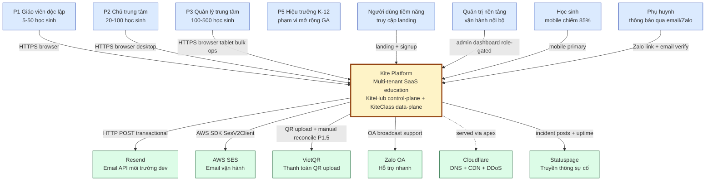
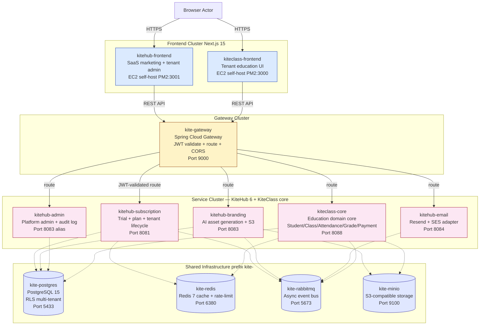
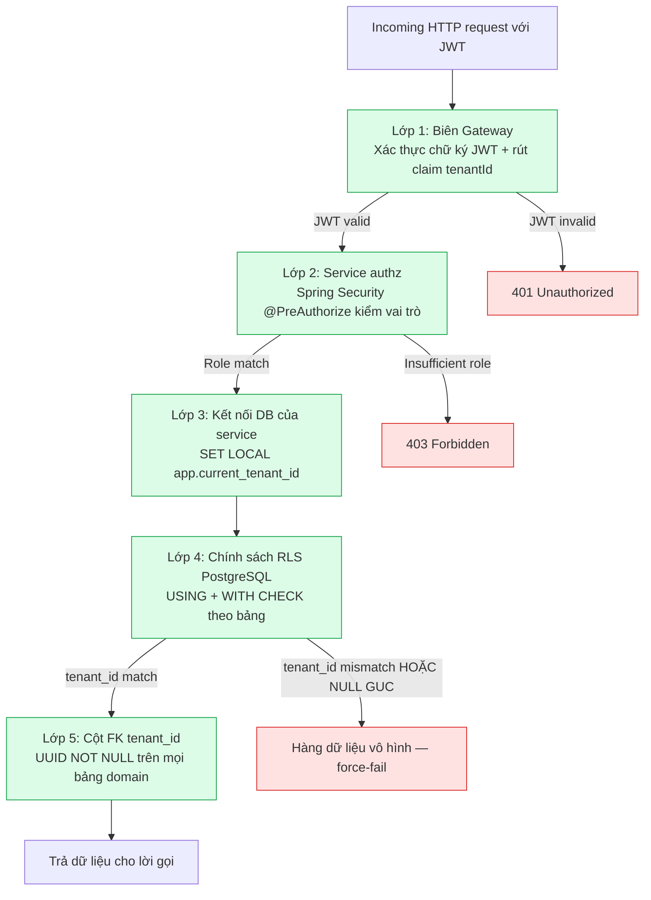
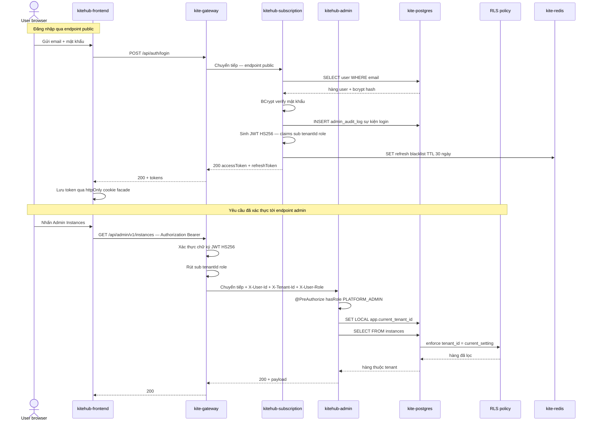
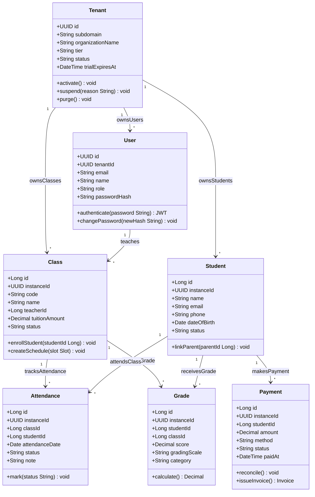
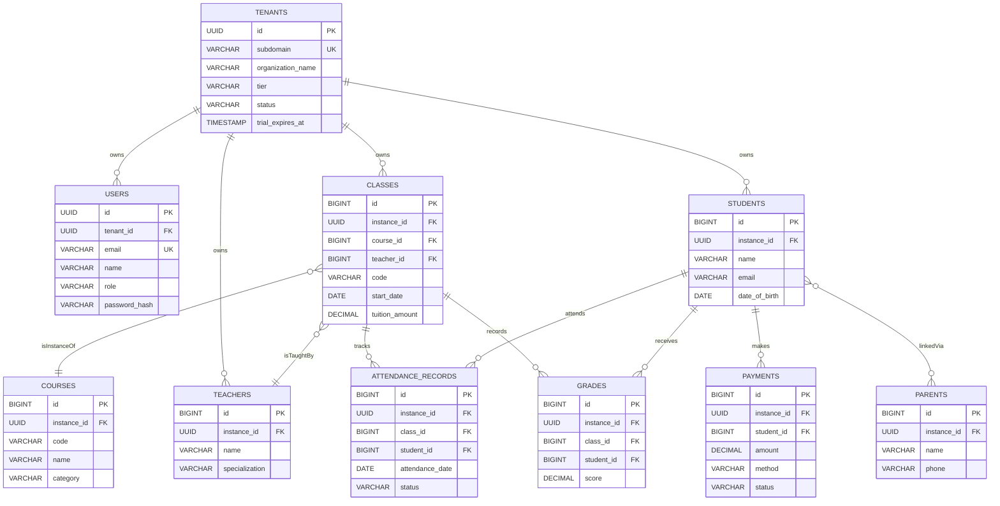
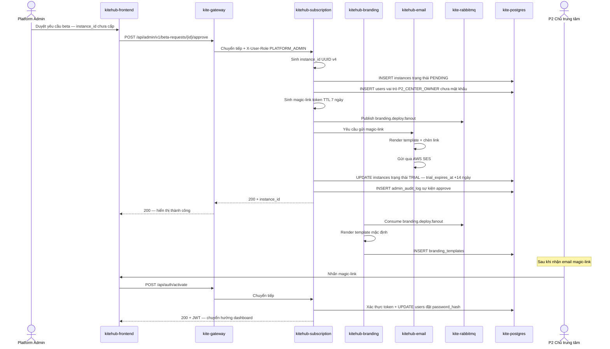
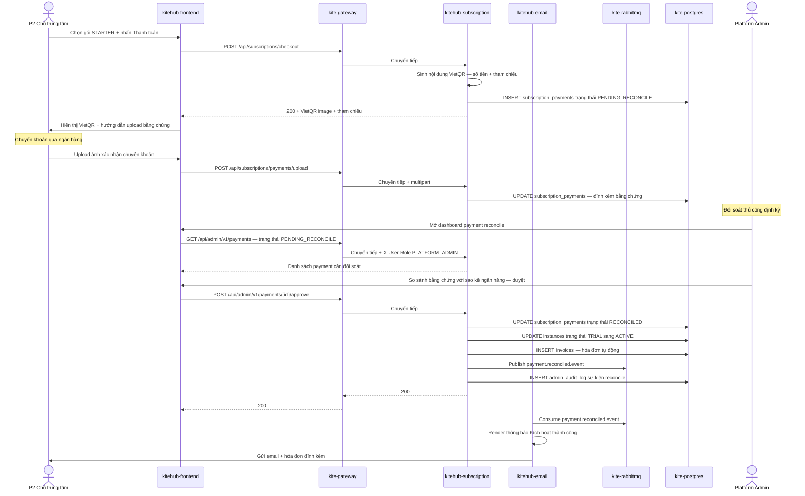
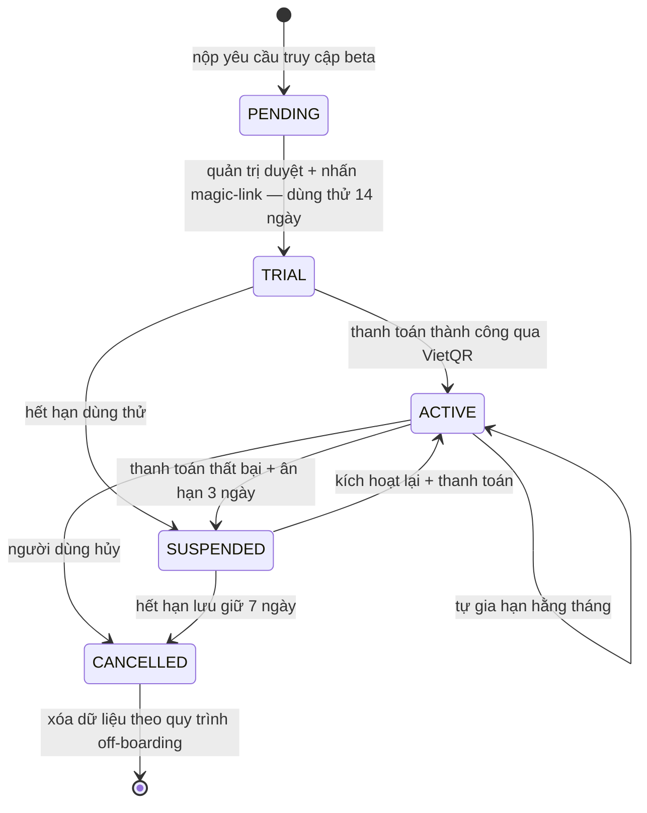

# Chương 2 — Kiến trúc hệ thống KiteHub / KiteClass Platform

## 2.1 Yêu cầu chức năng (Functional Requirements)

### 2.1.1 Domain capabilities

Kite Platform phục vụ chu trình giáo dục đầy đủ cho trung tâm dạy thêm vừa-nhỏ Việt Nam, bao gồm 6 nhóm capability chính được phân bổ giữa KiteHub (control-plane) và KiteClass (data-plane).

**Nhóm 1 — Tenant onboarding (KiteHub `kitehub-subscription`):**

- Người dùng tiềm năng truy cập landing thì đăng ký yêu cầu truy cập beta qua form 4 trường (họ tên / email / số điện thoại / tên trung tâm)
- Quản trị nền tảng duyệt yêu cầu thì kích hoạt quy trình cấp phát (tạo `instance_id` UUID, khởi tạo người dùng quản trị với vai trò `P2_CENTER_OWNER`, gửi email magic-link)
- Chủ trung tâm nhấn magic-link thì đặt mật khẩu lần đầu thì đăng nhập dashboard thì bắt đầu kỳ dùng thử 14 ngày
- Trạng thái vòng đời: PENDING thì TRIAL thì ACTIVE / SUSPENDED / CANCELLED (chi tiết §2.4)

**Nhóm 2 — Đăng ký dịch vụ & thanh toán (KiteHub `kitehub-subscription` + `kitehub-admin`):**

- Chủ trung tâm chọn gói dịch vụ (FREE / STARTER / PRO / PRO_PLUS) — ví dụ STARTER khoảng `500.000đ/tháng` cho 100 học sinh
- Thanh toán qua VietQR là phương thức mặc định cho giai đoạn beta thủ công; tích hợp MoMo/VNPay roadmap giai đoạn GA
- Gia hạn hằng tháng với thời gian ân hạn 3 ngày khi thanh toán thất bại; tenant SUSPENDED không đăng nhập được nhưng giữ dữ liệu 7 ngày
- Quản trị nền tảng có dashboard `/admin/v1/revenue` để xem doanh thu, MRR, tỷ lệ churn

**Nhóm 3 — Tùy biến tenant (KiteHub `kitehub-branding`):**

- Tùy biến theo tenant: logo, hero image, palette màu, subdomain riêng (ví dụ `trung-tam-sky.kitehub.me`)
- Studio AI Branding sinh logo + hero qua MiniMax (môi trường vận hành) hoặc Ollama (môi trường phát triển); quota lưu trong bảng `tenant_quota` giới hạn theo gói (FREE: 3 lần tạo lại mỗi ngày)
- Domain gửi email được xác thực DKIM theo tenant (gói PRO) thì thư gửi từ `support@skyedu.vn` thay vì `support@kitehub.me`

**Nhóm 4 — Lõi nghiệp vụ giáo dục (KiteClass `kiteclass-core`):**

- **Quản lý học sinh:** CRUD học sinh, nhập hàng loạt CSV/Excel (bảng `students`), liên kết phụ huynh — học sinh
- **Lớp học & thời khóa biểu:** Tạo lớp (ví dụ `Lớp Anh ngữ 5A1` / `Lớp Toán 9B`), gắn `homeroom_class` cho lớp chủ nhiệm, lập lịch buổi học qua `class_schedule_slots` (khung thứ 2-7 17:00-21:00 buổi tối phổ biến)
- **Điểm danh:** GVCN điểm danh từng `attendance_period` (mỗi buổi học), trạng thái Có/Vắng/Nghỉ phép
- **Chấm điểm:** Nhập điểm `grades` cho `assignments` / `subject_grades`, xuất bảng điểm theo `grading_scales` (thang 10); báo cáo cuối kỳ HK1/HK2/HK_Hè
- **Thanh toán theo tenant:** Chủ trung tâm phát hành hóa đơn `invoices` cho phụ huynh (ví dụ `Học phí tháng 5/2026 — 1.500.000đ`), theo dõi chuyển khoản/tiền mặt, xuất hóa đơn điện tử VAT tích hợp với MISA MeInvoice
- **Thông báo:** Gửi thông báo qua email formal cho phụ huynh khi có điểm mới, sự cố, nhắc hóa đơn; tích hợp Zalo OA mở rộng giai đoạn GA

**Nhóm 5 — Tuân thủ & nhật ký kiểm toán (cross-service):**

- Bảng `admin_audit_log` bất biến ghi mọi hành động của quản trị nền tảng thì đáp ứng yêu cầu tamper-proof retention của PDPL Điều 11
- Bảng `consent_record` lưu sự đồng ý PDPL của tenant + phụ huynh
- Bảng `dsar_ticket` cho yêu cầu truy cập dữ liệu cá nhân (Data Subject Access Request)
- Bảng `child_protection_audit_log` (KiteClass) cho phạm vi K-12 — mọi truy cập vào hồ sơ học sinh (đặc biệt trẻ vị thành niên) được log riêng phục vụ audit của Bộ Giáo dục

**Nhóm 6 — Quản trị nền tảng & hỗ trợ (KiteHub `kitehub-admin`):**

- Quản lý instance: danh sách tenant, xem chỉ số sức khỏe theo tenant, suspend/resume tenant
- Quy trình impersonation `/api/impersonate/start` — quản trị đăng nhập with tư cách tenant để hỗ trợ (được log trong `impersonation_audit_log`)
- Dashboard doanh thu MRR/ARR/churn theo tháng

---

## 2.2 Yêu cầu phi chức năng (Non-Functional Requirements)

Đồ án phân loại các yêu cầu phi chức năng (NFR) theo chuẩn ISO/IEC 25010:2011 *Software Product Quality Model* [25] — mô hình chất lượng phần mềm bao gồm 8 đặc trưng: Functional Suitability, Performance Efficiency, Compatibility, Usability, Reliability, Security, Maintainability, và Portability. Bảng 2.1 ánh xạ 6 hạng mục NFR được đồ án này tập trung trình bày sang các đặc trưng tương ứng theo ISO/IEC 25010.

**Bảng 2.1. Ánh xạ NFR của Kite Platform sang ISO/IEC 25010:2011.**

| Hạng mục NFR của đồ án | Đặc trưng ISO/IEC 25010 tương ứng |
|---|---|
| Performance (§2.2.1) | Performance Efficiency (Time Behaviour, Resource Utilization) |
| Availability (§2.2.2) | Reliability (Availability sub-characteristic) |
| Security (§2.2.3) | Security (Confidentiality, Integrity, Non-repudiation, Authenticity) |
| Scalability (§2.2.4) | Performance Efficiency (Capacity) + Maintainability (Scalability sub-aspect) |
| Maintainability (§2.2.5) | Maintainability (Modularity, Reusability, Modifiability, Testability) |
| Cost (§2.2.6) | (Bổ sung ngoài ISO 25010, ràng buộc kinh tế của giai đoạn beta) |

### 2.2.1 Performance

Tác giả đặt mục tiêu hiệu năng cho giai đoạn beta như sau:

| Chỉ số | Mục tiêu | Phương pháp đo |
|---|---|---|
| Độ trễ API P95 (endpoint đọc) | < 500ms | Prometheus thu thập từ Spring Actuator |
| Độ trễ API P95 (endpoint ghi) | < 1000ms | Prometheus |
| Time-to-Interactive (TTI) phía giao diện | < 3s trên 4G | Lighthouse |
| Độ trễ truy vấn cơ sở dữ liệu P95 | < 100ms | `pg_stat_statements` |
| Số người dùng đồng thời trên mỗi tenant | ~50 hoạt động | Kịch bản tải |

Khi quy mô tiến tới 50-200 tenant trong giai đoạn GA, hệ thống cần đánh giá lại khi connection pool đạt ngưỡng của instance cơ sở dữ liệu (~150 kết nối hoạt động).

### 2.2.2 Availability

Mục tiêu uptime của giai đoạn beta là **99.5%** (tương đương khoảng 3,6 giờ downtime/tháng có thể chấp nhận), theo SLA mặc định của AWS cho instance EC2 và RDS đơn vùng [26]. Mục tiêu này được duy trì thông qua:

- Triển khai trên một vùng AWS duy nhất `ap-southeast-1` (Singapore) phù hợp ràng buộc kinh tế giai đoạn đầu
- Health check `/actuator/health` cho từng service + ALB health probe
- Khai báo startupProbe trong Helm chart đảm bảo container không nhận traffic trước khi sẵn sàng
- CloudWatch SNS alarm với 4 ngưỡng (CPU >80% / memory >85% / 5xx rate >1% / DB connection >120) gọi on-call

Khi chuyển sang triển khai EKS multi-AZ với read replica ở giai đoạn GA, mục tiêu sẽ được nâng lên **99.9%**. Việc theo dõi uptime thực tế qua Statuspage được lập kế hoạch cho giai đoạn GA.

### 2.2.3 Security

Đồ án lấy chuẩn OWASP Top 10 (2021) [20] làm baseline an toàn ứng dụng web. Theo định nghĩa của OWASP Foundation [20, tr.8]: *"Broken Access Control moved up from the fifth position to the category with the most serious web application security risk; the contributed data indicates that on average, 3.81% of applications tested had one or more Common Weakness Enumerations (CWEs) with more than 318k occurrences of CWEs in this risk category."* Đồ án đồng thời tuân thủ pháp luật Việt Nam — Luật Bảo vệ Dữ liệu Cá nhân số 49/2023/QH15 [9] và Luật An ninh mạng số 24/2018/QH14 [10].

**Bảng 2.2. Ánh xạ OWASP Top 10 (2021) lên các biện pháp triển khai.**

| Kiểm soát | Cách triển khai |
|---|---|
| A01 Broken Access Control | Phòng thủ chiều sâu 5 lớp: Gateway xác thực JWT thì Service `@PreAuthorize` thì cơ sở dữ liệu `SET LOCAL` GUC thì chính sách RLS của PostgreSQL thì cột khóa ngoại `tenant_id` NOT NULL. Chính sách NULL force-fail loại bỏ trường hợp leak ngầm. |
| A02 Cryptographic Failures | TLS 1.2+ bắt buộc; bí mật lưu trong AWS Secrets Manager với chu kỳ luân chuyển 90 ngày; mật khẩu băm BCrypt cost 12 |
| A03 Injection | Hibernate ORM mặc định dùng truy vấn tham số hóa; `@Query` native chỉ áp dụng cho input đã kiểm tra; controller dùng `@Valid` + Bean Validation |
| A04 Insecure Design | Threat model riêng cho từng service — quy trình magic-link đã được phân tích mối đe dọa |
| A05 Security Misconfiguration | Spring Security `SecurityConfig` mặc định deny; danh sách CORS origin tường minh theo môi trường |
| A06 Vulnerable Components | Dependabot quét hằng tuần; cổng kiểm tra Trivy với mức CRITICAL+HIGH trong CI; validate `pnpm` lockfile |
| A07 Authentication Failures | JWT HS256 access token TTL 15 phút + refresh token 30 ngày luân chuyển; blacklist refresh trên Redis; 2FA TOTP cho vai trò Owner |
| A08 Software & Data Integrity | Migration Flyway bất biến; bảng `admin_audit_log` bất biến đáp ứng PDPL Điều 11 |
| A09 Security Logging Failures | Log dạng JSON có cấu trúc + CloudTrail multi-region được bật trước khi triển khai vận hành |
| A10 Server-Side Request Forgery | WebClient với allowlist URL tường minh (MiniMax + VietQR + Ollama cho môi trường phát triển) |

Tuân thủ pháp lý phía Việt Nam ở giai đoạn beta:

- PDPL 2023 (Luật số 49/2023/QH15, có hiệu lực 2026-07-01) — giai đoạn beta không thuộc nhóm K-12 với một disclaimer phù hợp về việc rà soát pháp lý tiếp tục trước GA
- Luật An ninh mạng 2018 (Luật số 24/2018/QH14) + Nghị định 53/2022/NĐ-CP — RDS chốt vùng `ap-southeast-1` để giảm thiểu rủi ro vận chuyển dữ liệu qua biên giới
- Trước khi mở rộng sang phạm vi K-12 ở giai đoạn GA: DPO engagement, đánh giá tác động bảo vệ dữ liệu (DPIA), và rà soát pháp lý chuyên sâu cần được hoàn tất

### 2.2.4 Scalability

Mô hình mở rộng đa tenant dạng **single-bucket + RLS** (Pool model theo AWS SaaS Lens [27] và phân tích chi tiết của Pothon [28] — xem §2.3.3):

- Giai đoạn beta: 10-50 tenant × 50-500 học sinh/tenant ≈ 5k-25k người dùng
- Giai đoạn GA: 50-200 tenant × 100-1000 học sinh/tenant ≈ 50k-200k người dùng thì mở rộng theo chiều dọc instance RDS
- Khi mở rộng sang phạm vi K-12 doanh nghiệp 200-1000 tenant: đánh giá lại hướng Hybrid Path A (per-tenant DB) cho nhóm tenant doanh nghiệp

Khả năng mở rộng theo chiều ngang qua sub-split:

- Connection pool: HikariCP 10 kết nối/service × 7 service = 70 baseline; tối đa 150 với RDS GA
- Cache: Redis 7 chính sách LRU 256MB; làm nóng session + rate-limit counter
- Bất đồng bộ: RabbitMQ event bus phân tải (`branding.deploy`, `email.queue`, `instance.purge.fanout`) thì consumer service mở rộng độc lập

### 2.2.5 Maintainability

Kiến trúc microservice cho phép triển khai từng service một cách độc lập:

- Build image Docker từng service + đẩy lên ECR + cập nhật ECS service (mục tiêu thời gian triển khai < 30 phút/service)
- Migration Flyway theo schema từng service (subscription / branding / email / admin / kiteclass-core mỗi service có chuỗi migration riêng)
- API ổn định ngược: định phiên bản theo URL `/api/v1/...` thì breaking change đòi hỏi tăng major version
- Quy ước Living docs: tài liệu nghiệp vụ 3-layer (rules.md / use-cases.md / api-contract.md) đi cùng PR với code change

### 2.2.6 Cost

Giai đoạn beta vận hành dưới ràng buộc AWS Free Tier 12 tháng:

- 2 EC2 `t3.micro` (KiteHub backend + KiteClass app), 1 RDS `db.t3.micro`, 5 GB S3
- Cloudflare: gói miễn phí DNS + CDN + DDoS protection
- Email: Resend gói miễn phí 3k thư/tháng cho môi trường phát triển; AWS SES vận hành ~$0.10/1000 thư
- AI: Ollama tự host cho môi trường phát triển; MiniMax vận hành ~$0.001/yêu cầu
- **Tổng chi phí ước tính giai đoạn beta: $15-30/tháng** (~360.000đ-720.000đ/tháng)

Quyết định kiến trúc bị neo bởi ràng buộc kinh tế: tôi chọn mô hình single-bucket multi-tenant với RLS (Pattern 4) thay vì per-tenant DB (Pattern 1) — chênh lệch chi phí khoảng 20× và chi phí vận hành theo chiều dọc khó duy trì với một sinh viên (chi tiết §2.3.3).

---

## 2.3 Kiến trúc (Architecture)

### 2.3.1 C4 Model — Level 1 System Context

Mô hình C4 (Context / Container / Component / Code) của Brown [29] là framework chuẩn để mô tả kiến trúc phần mềm ở 4 mức độ chi tiết tăng dần. Đồ án sử dụng Level 1 (System Context) và Level 2 (Container) để trình bày Kite Platform; Level 3 và Level 4 dành cho phần triển khai ở Chương 3.

Kite Platform tương tác với 8 nhóm actor (người dùng và quản trị) và 6 hệ thống bên ngoài. Hình 2.1 biểu diễn ngữ cảnh hệ thống ở mức cao nhất.



**Hình 2.1. Sơ đồ ngữ cảnh hệ thống Kite Platform theo C4 Level 1.**

Hình 2.1 cho thấy mọi actor đều truy cập Kite Platform qua HTTPS (TLS 1.2+); các hệ thống bên ngoài được cô lập qua adapter pattern (interface `NotificationChannel` cho email, `PaymentProcessor` cho VietQR). Không có actor nào truy cập trực tiếp cơ sở dữ liệu; mọi truy cập đều đi qua biên trust của gateway.

### 2.3.2 C4 Model — Level 2 Container

Phóng to vào nội bộ Kite Platform cho thấy 4 cụm container: Frontend (2 ứng dụng Next.js), Gateway (Spring Cloud Gateway), Service (6 service KiteHub + 1 KiteClass core), và hạ tầng dùng chung (4 container với prefix `kite-`). Hình 2.2 trình bày bố cục container theo C4 Level 2.



**Hình 2.2. Sơ đồ container Kite Platform theo C4 Level 2.**

Hình 2.2 cho thấy bố cục theo 4 cụm:

- **Frontend (2 container):** `kitehub-frontend` (Next.js 15 cổng 3001) phục vụ marketing và quản trị tenant; `kiteclass-frontend` (Next.js 15 cổng 3000) phục vụ giao diện giáo dục cho tenant (85% phiên truy cập từ mobile). Cả hai tự host trên EC2 qua trình quản lý process PM2, chia sẻ thư viện component `packages/shared-ui`.

- **Gateway (1 container):** `kite-gateway` (Spring Cloud Gateway cổng 9000) là entry point duy nhất cho mọi yêu cầu API backend. Trách nhiệm: xác thực chữ ký JWT HS256 và rút trích claim `tenantId`/`role`; phát các header `X-Tenant-Id` / `X-User-Id` / `X-User-Role` cho service downstream; enforce CORS với danh sách origin tường minh; rate-limit theo tenant qua bộ đếm trên Redis.

- **Cụm Service (6 KiteHub + 1 KiteClass):**
  - `kitehub-subscription` (8081) — xác thực, dùng thử, đăng ký dịch vụ, onboarding, beta access, DSAR, audit log, outbox, webhook thanh toán
  - `kitehub-branding` (8083) — sinh AI asset (logo, banner, hero), template, lưu trữ S3 qua MinIO; gọi Ollama (dev) hoặc MiniMax (vận hành)
  - `kitehub-email` (8084) — điều phối gửi email với adapter pattern `NotificationChannel` (`SESEmailService` chính + `ResendEmailService` dự phòng)
  - `kitehub-admin` (8083 alias) — thao tác quản trị nền tảng: duyệt yêu cầu beta, quản lý instance, đọc audit log, impersonation
  - `kitehub-platform` (thư viện JAR) — starter dùng chung: auth filter, tenant context, OpenTelemetry, DTO + error handler chung — không triển khai độc lập
  - `kiteclass-core` (8088) — lõi nghiệp vụ giáo dục: Student / Class / Attendance / Grade / Payment / Notification. Cô lập đa tenant qua PostgreSQL RLS (chi tiết §2.3.4)

- **Hạ tầng dùng chung (4 container, prefix `kite-`):**
  - `kite-postgres` (PostgreSQL 15, cổng 5433) — cơ sở dữ liệu OLTP chính, schema `kitehub` + `kiteclass_shared`, RLS phủ 51/91 bảng (56%) — chi tiết §2.3.4
  - `kite-redis` (Redis 7, cổng 6380) — cache + session store + rate-limit counter, chính sách LRU 256MB
  - `kite-rabbitmq` (RabbitMQ 3-management, cổng 5673) — event bus bất đồng bộ: `email.exchange`, `branding.deploy.*`, `instance.purge.exchange` (fanout)
  - `kite-minio` (tương thích S3, cổng 9100) — lưu trữ object cho AI asset + template SVG + upload từ người dùng; ánh xạ sang AWS S3 ở môi trường vận hành

Prefix `kite-` (thay vì `kitehub-` hay `kiteclass-`) phản ánh bản chất dùng chung của hạ tầng giữa hai sản phẩm KiteHub và KiteClass.

### 2.3.3 Quyết định kiến trúc đa tenant — single-bucket pattern

Quyết định kiến trúc trọng tâm của đồ án là chọn mô hình cô lập đa tenant. Tôi đã đánh giá 6 pattern khác nhau trên 6 trục tiêu chí và lựa chọn **Shared Database + cột `tenant_id` UUID + PostgreSQL Row-Level Security (RLS)** — tương ứng "Pool" model theo AWS Well-Architected SaaS Lens [27, tr.21] (đối lập với "Silo" per-tenant DB và "Bridge" per-tenant schema). AWS định nghĩa: *"Pool isolation enables tenants to share infrastructure but rely on logical mechanisms (such as row-level security policies in databases) to ensure data isolation between tenants; this model often yields the lowest operational cost but requires careful design of the isolation layer."*

**Bảng 2.3. Sáu pattern đa tenant và lý do chọn/loại.**

| Pattern | Lý do chọn/loại |
|---|---|
| P1 Per-tenant database (1 RDS/tenant) | Chi phí ~$295/tháng cho 10 tenant so với ~$15 cho Pool model (chênh 20×); vận hành N× backup + N× migration + N× monitoring không khả thi với một sinh viên |
| P2 Per-tenant schema | Quản lý migration phức tạp (Flyway chạy N lần/schema); không tăng đáng kể độ cô lập so với Pool + RLS |
| P3 Shared DB + chỉ `tenant_id` | An toàn yếu — bất kỳ lỗi ứng dụng (quên `WHERE`, edge case ORM query builder, raw SQL) đều dẫn tới leak ngầm |
| **P4 Shared DB + `tenant_id` + RLS** chọn | An toàn mạnh do enforce ở tầng cơ sở dữ liệu; chi phí vận hành thấp (1 RDS, 1 chuỗi migration); chi phí ~$15/tháng; vẫn cho phép truy vấn xuyên tenant qua vai trò admin BYPASS RLS |
| P5 Hybrid (Pool mặc định + Silo cho khách doanh nghiệp) | Hoãn đến khi mở rộng K-12 doanh nghiệp ở giai đoạn GA — chưa có khách hàng yêu cầu cô lập vật lý |
| P6 Serverless (Aurora Serverless v2 / DynamoDB) | Aurora Serverless v2 chi phí tối thiểu ~$45/tháng vượt Free Tier; DynamoDB không phù hợp với dữ liệu quan hệ giáo dục (Student/Class/Grade/Attendance JOIN-heavy) |

**Bảng 2.4. Ma trận so sánh 6 pattern trên 6 trục (Pattern 4 đạt tổng 26/30 cho giai đoạn beta).**

| Trục đánh giá | P1 Per-DB | P2 Per-schema | P3 ID only | **P4 RLS** | P5 Hybrid | P6 Serverless |
|---|:---:|:---:|:---:|:---:|:---:|:---:|
| Độ mạnh cô lập | 5 | 4 | 2 | **3** | 4 | 3 |
| Chi phí vận hành (5 = O(1)) | 1 | 3 | 5 | **5** | 2 | 4 |
| Khả năng truy vấn xuyên tenant | 2 | 4 | 5 | **4** | 3 | 3 |
| Phù hợp với phạm vi giai đoạn beta | 1 | 3 | 4 | **5** | 1 | 2 |
| Vị thế tuân thủ (PDPL + ISO27001) | 5 | 3 | 2 | **4** | 5 | 4 |
| Chi phí chuyển đổi từ hiện trạng | 1 | 3 | 5 | **5** | 3 | 2 |
| **Tổng** | 15 | 20 | 23 | **26** | 18 | 18 |

Pool model với RLS được chọn vì cân bằng giữa độ cô lập chấp nhận được (được tăng cường bởi chính sách NULL force-fail mô tả ở §2.3.4), chi phí vận hành thấp nhất, độ phù hợp với phạm vi giai đoạn beta, và lộ trình chuyển đổi sang Hybrid Path A khi mở rộng đến nhóm khách hàng doanh nghiệp ở giai đoạn GA.

### 2.3.4 Cô lập cơ sở dữ liệu — phòng thủ chiều sâu 5 lớp + RLS

Ngữ cảnh tenant (`tenantId`) được truyền xuyên suốt quy trình xử lý yêu cầu qua chuỗi 5 lớp; mỗi lớp là một cơ chế bảo vệ độc lập. Hình 2.3 minh họa quá trình này.



**Hình 2.3. Phòng thủ chiều sâu 5 lớp cho cô lập đa tenant.**

Mẫu chính sách RLS áp dụng cho mọi bảng có phạm vi tenant như sau (ví dụ với bảng `classes`):

```sql
ALTER TABLE classes
  ADD COLUMN tenant_id UUID NOT NULL REFERENCES tenants(id);

ALTER TABLE classes ENABLE ROW LEVEL SECURITY;
ALTER TABLE classes FORCE ROW LEVEL SECURITY;

-- Chính sách NULL force-fail
CREATE POLICY tenant_isolation_classes ON classes
  USING (
    tenant_id = current_setting('app.current_tenant_id', true)::uuid
    AND current_setting('app.current_tenant_id', true) IS NOT NULL
  )
  WITH CHECK (
    tenant_id = current_setting('app.current_tenant_id', true)::uuid
    AND current_setting('app.current_tenant_id', true) IS NOT NULL
  );

CREATE INDEX idx_classes_tenant_id ON classes(tenant_id);
```

Trên cơ sở dữ liệu hiện tại với 91 bảng (32 thuộc `kitehub-subscription` control-plane + 59 thuộc `kiteclass-core` domain đa tenant), RLS được bật trên 51 bảng (12 control-plane không force + 39 forced kiteclass) — tỉ lệ phủ 56% trên toàn bộ, hoặc 89% nếu loại trừ các bảng không thuộc phạm vi tenant (bảng `instances` gốc, M2M join cascade, catalog dùng chung, audit bất biến, dữ liệu theo user/request).

Hai cơ chế hardening quan trọng:

1. **NULL force-fail policy:** nếu GUC `app.current_tenant_id` chưa được set, `current_setting('...', true)` trả về NULL, khiến mệnh đề `tenant_id = NULL` rơi vào logic SQL ternary trả NULL — không filter row, gây leak ngầm. Thêm `AND current_setting(...) IS NOT NULL` khiến truy vấn trả 0 row thay vì tất cả, buộc bug lộ ra ngay trong test.
2. **HikariCP GUC reset:** HikariCP tái sử dụng kết nối từ pool. Nếu kết nối N được set `app.current_tenant_id = A` rồi trả về pool, kết nối kế tiếp có thể "kế thừa" ngữ cảnh tenant A. Tác giả khắc phục bằng `SET LOCAL` (giới hạn theo transaction, tự reset khi commit/rollback) cùng `connectionInitSql: RESET app.current_tenant_id` mỗi khi kết nối quay về pool.

### 2.3.5 Quy trình xác thực — JWT + role-guard + truyền ngữ cảnh tenant

Hình 2.4 trình bày tuần tự đăng nhập và một yêu cầu được xác thực sau đó cho luồng quản trị nền tảng.



**Hình 2.4. Luồng xác thực JWT và truyền ngữ cảnh tenant.**

Một nguyên tắc thiết kế quan trọng được áp dụng: service KHÔNG được tự đọc claim `tenantId` từ JWT body. Gateway là biên trust duy nhất cho việc xác thực JWT; downstream service tin tưởng header `X-Tenant-Id` do gateway phát ra. Nếu mỗi service tự parse JWT, hệ thống phải duy trì public key ở nhiều nơi và lặp logic xác thực, tăng rủi ro an toàn và chi phí bảo trì.

### 2.3.6 Use Case Diagram — năng lực hệ thống theo persona

C4 Level 1 (Hình 2.1) trình bày actor + system boundary nhưng chưa chỉ rõ tập capability nào mỗi persona truy cập. Để bổ sung góc nhìn use-case theo chuẩn UML của Booch, Rumbaugh và Jacobson [30, Chương 4 "Use Cases"], Hình 2.6 phân nhóm 6 capability chính theo 5 persona chính (Anonymous Prospect / P1 Giáo viên độc lập / P2 Chủ trung tâm / P3 Quản lý trung tâm / Platform Admin).

```mermaid
flowchart LR
    A[Anonymous Prospect]
    P1[P1 Giáo viên độc lập]
    P2[P2 Chủ trung tâm]
    P3[P3 Quản lý trung tâm]
    PA[Platform Admin]

    subgraph UC_Onboard["UC1 - Tenant onboarding"]
        UC1a((Đăng ký yêu cầu beta))
        UC1b((Duyệt yêu cầu beta))
        UC1c((Kích hoạt magic-link))
        UC1d((Thiết lập trung tâm))
    end

    subgraph UC_Sub["UC2 - Đăng ký dịch vụ"]
        UC2a((Chọn gói dịch vụ))
        UC2b((Thanh toán VietQR))
        UC2c((Gia hạn dùng thử))
        UC2d((Theo dõi doanh thu))
    end

    subgraph UC_Brand["UC3 - AI Branding"]
        UC3a((Sinh logo + hero AI))
        UC3b((Tùy biến palette))
        UC3c((Xác thực DKIM domain))
    end

    subgraph UC_Edu["UC4 - Nghiệp vụ giáo dục"]
        UC4a((Quản lý học sinh))
        UC4b((Lập lớp + thời khóa biểu))
        UC4c((Điểm danh + nhập điểm))
        UC4d((Phát hành hóa đơn))
    end

    subgraph UC_Audit["UC5 - Tuân thủ + audit"]
        UC5a((Ghi audit log bất biến))
        UC5b((Xử lý yêu cầu DSAR))
        UC5c((Lưu consent record))
    end

    subgraph UC_Admin["UC6 - Quản trị nền tảng"]
        UC6a((Quản lý instance))
        UC6b((Impersonation))
        UC6c((Xem dashboard MRR))
    end

    A --> UC1a
    PA --> UC1b
    P2 --> UC1c
    P2 --> UC1d
    P2 --> UC2a
    P2 --> UC2b
    P2 --> UC2c
    PA --> UC2d
    P2 --> UC3a
    P2 --> UC3b
    P2 --> UC3c
    P1 --> UC4a
    P2 --> UC4a
    P3 --> UC4a
    P1 --> UC4b
    P3 --> UC4b
    P1 --> UC4c
    P3 --> UC4c
    P2 --> UC4d
    P3 --> UC4d
    PA --> UC5a
    P2 --> UC5b
    P3 --> UC5b
    P2 --> UC5c
    PA --> UC6a
    PA --> UC6b
    PA --> UC6c

    classDef actor fill:#dbeafe,stroke:#1e40af
    classDef ucgroup fill:#fef3c7,stroke:#92400e
    class A,P1,P2,P3,PA actor
```



**Hình 2.6. Use case diagram tổng thể Kite Platform — 5 persona × 6 capability.**

Hình 2.6 phân chia hệ thống thành 6 nhóm use case (UC1 onboarding / UC2 đăng ký dịch vụ / UC3 AI branding / UC4 nghiệp vụ giáo dục / UC5 tuân thủ + audit / UC6 quản trị nền tảng). Mỗi mũi tên từ actor sang use case biểu diễn quan hệ `<<association>>` theo ký hiệu UML chuẩn. Quan sát chính: P2 Chủ trung tâm là persona có biên use case rộng nhất (truy cập UC1-UC4 và một phần UC5), phản ánh vai trò trung tâm trong vòng đời tenant; Platform Admin (PA) độc quyền UC6 và một phần UC1 (duyệt yêu cầu beta), UC2 (theo dõi doanh thu), UC5 (audit log) — tuân thủ nguyên tắc separation-of-duty.

### 2.3.7 Class Diagram core domain — thực thể nghiệp vụ giáo dục

Mô hình lớp UML [30, Chương 8 "Class Diagrams"] biểu diễn các entity nghiệp vụ chính của tầng `kiteclass-core` cùng quan hệ giữa chúng. Hình 2.7 trình bày class diagram đơn giản hóa cho 7 entity trọng tâm (Tenant, User, Class, Student, Attendance, Grade, Payment) — bỏ qua các attribute audit (created_at, updated_at, deleted) để giữ độ rõ ràng.



**Hình 2.7. Class diagram core domain — 7 entity chính của tầng `kiteclass-core`.**

Quan sát Hình 2.7: cardinality `1..*` từ `Tenant` đến `User`, `Class`, `Student` phản ánh nguyên tắc đa tenant — mỗi entity có khóa ngoại `instanceId` (= `tenantId` UUID) cô lập theo RLS. Quan hệ ternary giữa `Student`, `Class` và `Attendance` (tương ứng `Grade`) tạo composite key tự nhiên cho bảng `attendance_records` và `grades`. Method `authenticate()` của `User` trả về JWT chứa claim `tenantId` — sau đó được Gateway xác thực và truyền xuống service downstream qua header `X-Tenant-Id` (§2.3.5).

### 2.3.8 Entity-Relationship Diagram high-level

Trong khi class diagram (Hình 2.7) tập trung behavior + method, mô hình thực thể-quan hệ (ERD) của Chen [31] tập trung cấu trúc lưu trữ + cardinality + khóa ngoại. Hình 2.8 trình bày ERD cấp cao cho 8 thực thể trọng tâm cùng cardinality và khóa ngoại — phù hợp với thiết kế cơ sở dữ liệu chi tiết §2.6.



**Hình 2.8. ERD cấp cao của tầng `kiteclass-core` — 10 thực thể trọng tâm.**

Quan sát Hình 2.8: mọi thực thể nghiệp vụ đều mang khóa ngoại `instance_id` (= `tenantId`) trỏ về `TENANTS.id`, làm điểm neo cho chính sách RLS (§2.3.4). Quan hệ `STUDENTS }o--o{ PARENTS` là many-to-many qua bảng nối `parent_student_links` (không trình bày trong Hình 2.8 để giữ độ rõ ràng) phản ánh thực tế Việt Nam — một phụ huynh có thể có nhiều con học khác lớp và một học sinh có thể có cả bố mẹ làm đầu mối liên hệ. Bảng `parent_student_links` mang cờ `is_primary_contact` để phân biệt mẹ chính (~60% thị trường) vs bố backup (~35%).

### 2.3.9 Sequence diagram — luồng nghiệp vụ tiêu biểu

Để bổ sung góc nhìn xử lý theo thời gian cho hai luồng nghiệp vụ trọng tâm, đồ án trình bày sequence diagram cho (a) Cấp phát tenant từ trạng thái PENDING sang TRIAL — Hình 2.9 — và (b) Xác nhận thanh toán VietQR đối soát thủ công sang trạng thái ACTIVE — Hình 2.10. Hai luồng này minh họa sự phối hợp giữa nhiều service (subscription / email / branding) qua REST + RabbitMQ event bus.



**Hình 2.9. Sequence diagram cấp phát tenant PENDING sang TRIAL.**

Hình 2.9 cho thấy `kitehub-subscription` là điều phối viên (orchestrator) cho 8 bước cấp phát đã liệt kê §2.4.2. Hai sự kiện bất đồng bộ phát qua RabbitMQ `branding.deploy.fanout` được `kitehub-branding` consume độc lập — cho phép tách lifecycle deploy template khỏi luồng đồng bộ chính (admin nhận phản hồi 200 ngay sau khi `instances` row được tạo, không cần đợi branding render xong).



**Hình 2.10. Sequence diagram xác nhận thanh toán VietQR sang trạng thái ACTIVE.**

Hình 2.10 minh họa quy trình thanh toán không đồng bộ giai đoạn beta — chủ trung tâm chuyển khoản và upload bằng chứng, quản trị nền tảng đối soát thủ công và duyệt thanh toán, hệ thống tự động phát hành hóa đơn cùng email kích hoạt. So với roadmap GA tích hợp VNPay/MoMo (webhook tự động), quy trình thủ công giai đoạn beta tránh phụ thuộc giấy phép PSP và phù hợp với thói quen thanh toán bank-transfer dominant tại Việt Nam (~70% giao dịch giáo dục).

### 2.3.10 Phân rã service — 6 service KiteHub + 1 KiteClass core

Danh mục service được tổng hợp theo mô hình Backstage [22] (mỗi service đóng vai một component có metadata + ownership + dependency).

**Bảng 2.5. Danh mục service của Kite Platform.**

| Service | Cổng | Trách nhiệm | Cơ sở dữ liệu |
|---|---|---|---|
| `kite-gateway` | 9000 | Xác thực JWT + định danh tenant + truyền ngữ cảnh + rate-limit | Bộ đếm trên Redis |
| `kitehub-subscription` | 8081 | Xác thực + dùng thử + đăng ký dịch vụ + thanh toán + onboarding + DSAR + audit + outbox + webhook + impersonation | Schema `kitehub` (32 bảng) |
| `kitehub-admin` | 8083 | Quản trị nền tảng — CRUD instance + thanh toán + dashboard doanh thu | Schema `kitehub` (chung) |
| `kitehub-branding` | 8083 alias | Sinh AI asset (logo/hero/banner) + upload S3 + tích hợp Ollama/MiniMax | Bảng `kitehub.branding_*` |
| `kitehub-email` | 8084 | Email giao dịch — adapter NotificationChannel (SES chính + Resend dự phòng) | Bảng `kitehub.email_logs` |
| `kitehub-platform` | thư viện JAR | Starter dùng chung — auth filter + tenant context + OpenTelemetry + DTO | — |
| `kiteclass-core` | 8088 | Nghiệp vụ giáo dục theo tenant — student/course/class/attendance/grade/payment | Schema `kiteclass_shared` (59 bảng) |

Các phụ thuộc liên service được tổng hợp gồm: `kitehub-subscription` gọi `kitehub-email` qua REST + sự kiện RabbitMQ `email.exchange`; `kitehub-subscription` phát sự kiện `branding.deploy.*` để `kitehub-branding` tiêu thụ; `kitehub-email` lấy gói branding qua WebClient để dựng template; `kiteclass-core` lưu trữ ảnh đại diện và bài nộp trên MinIO S3 và phát thông báo bất đồng bộ qua RabbitMQ. Tổng cộng có 7 service backend (6 triển khai độc lập + 1 thư viện), 2 ứng dụng frontend và 8 container hạ tầng — tương đương 18 thành phần tách biệt.

---

## 2.4 Thiết kế cơ sở dữ liệu

### 2.4.1 Tổng quan schema và phân bổ giữa hai sản phẩm

Cơ sở dữ liệu được triển khai trên một instance PostgreSQL 15 duy nhất (`kite-postgres`), chia thành hai schema chính phù hợp với phân tách control-plane / data-plane:

- **Schema `kitehub`** (32 bảng) — control-plane do service `kitehub-subscription` + `kitehub-admin` + `kitehub-email` + `kitehub-branding` quản lý. Bao gồm các bảng vòng đời tenant (`instances`, `subscriptions`, `subscription_payments`), bảo mật và tuân thủ (`users`, `admin_audit_log`, `consent_record`, `dsar_ticket`), tích hợp (`beta_access_request`, `branding_templates`, `email_sent_log`), và outbox bất đồng bộ (`subscription_outbox`, `branding_outbox`).
- **Schema `kiteclass_shared`** (59 bảng) — data-plane do `kiteclass-core` quản lý, lưu nghiệp vụ giáo dục theo tenant (`students`, `teachers`, `courses`, `classes`, `class_schedule_slots`, `attendance_records`, `grades`, `assignments`, `subject_grades`, `payments`, `invoices`, `parents`, `parent_student_links`). Đa số bảng có cột `instance_id UUID NOT NULL` mang vai trò `tenant_id` theo quy ước migration KiteClass.

Tổng cộng 91 bảng nghiệp vụ; trong đó RLS phủ 51 bảng (12 control-plane bật RLS không force + 39 bảng kiteclass force RLS) đạt 56% trên toàn bộ (89% nếu loại trừ bảng không thuộc phạm vi tenant theo §2.3.4). ERD cấp cao của tầng `kiteclass-core` đã được trình bày §2.3.8 (Hình 2.8); §2.4.2-2.4.4 dưới đây tập trung lược đồ chi tiết theo cột của 3 entity trọng tâm — `tenants` (control-plane), `users` (control-plane) và `classes` (data-plane).

### 2.4.2 Lược đồ bảng `tenants` (`instances`)

Bảng `instances` (trong schema `kitehub`) là gốc của vòng đời tenant. Mỗi hàng tương ứng một trung tâm dạy thêm được cấp phát. Khóa chính `id` UUID v4 chính là `tenantId` được truyền xuyên suốt qua header `X-Tenant-Id`, JWT claim, và biến cấu hình `SET LOCAL app.current_tenant_id` để enforce RLS.

**Bảng 2.5. Lược đồ chi tiết bảng `instances` (schema `kitehub`).**

| TT | Tên cột | Kiểu dữ liệu | Mô tả |
|:---:|---|---|---|
| 1 | `id` | UUID | Khóa chính — định danh tenant duy nhất (UUID v4), cũng là `tenantId` truyền xuyên hệ thống |
| 2 | `subdomain` | VARCHAR(50) UNIQUE NOT NULL | Subdomain riêng của tenant (ví dụ `trung-tam-sky` cho `trung-tam-sky.kitehub.me`) |
| 3 | `custom_domain` | VARCHAR(255) | Tên miền tùy chỉnh — chỉ áp dụng gói PRO/PRO_PLUS có DKIM riêng |
| 4 | `organization_name` | VARCHAR(200) NOT NULL | Tên hiển thị trung tâm (ví dụ "Trung tâm Anh ngữ Sky Education") |
| 5 | `owner_id` | UUID NOT NULL | Khóa ngoại trỏ tới `users.id` với vai trò `P2_CENTER_OWNER` |
| 6 | `tier` | VARCHAR(20) NOT NULL | Gói dịch vụ — FREE / STARTER / PRO / PRO_PLUS |
| 7 | `status` | VARCHAR(20) NOT NULL | Trạng thái vòng đời — PENDING / TRIAL / ACTIVE / SUSPENDED / CANCELLED |
| 8 | `database_url` | VARCHAR(500) NOT NULL | Chuỗi kết nối cơ sở dữ liệu — duy trì để hỗ trợ chuyển sang per-tenant DB ở giai đoạn GA |
| 9 | `database_username` | VARCHAR(100) NOT NULL | Tên người dùng cơ sở dữ liệu của tenant |
| 10 | `database_password` | VARCHAR(255) NOT NULL | Mật khẩu cơ sở dữ liệu — mã hóa AES-256-GCM, không lưu plaintext |
| 11 | `trial_started_at` | TIMESTAMP | Thời điểm bắt đầu kỳ dùng thử 14 ngày |
| 12 | `trial_expires_at` | TIMESTAMP | Thời điểm hết hạn dùng thử — sự kiện `instance.purge.exchange` được lập lịch tại thời điểm này |
| 13 | `subscription_id` | UUID | Khóa ngoại trỏ tới bảng `subscriptions` — gói dịch vụ đang đăng ký |
| 14 | `subscription_expires_at` | TIMESTAMP | Thời điểm hết hạn đăng ký — kích hoạt ân hạn 3 ngày trước khi SUSPENDED |
| 15 | `created_at` | TIMESTAMP NOT NULL | Thời điểm tạo bản ghi |
| 16 | `updated_at` | TIMESTAMP NOT NULL | Thời điểm cập nhật bản ghi gần nhất |
| 17 | `created_by` | VARCHAR(100) | Người tạo bản ghi (thường là `admin@kitehub.me` khi duyệt yêu cầu beta) |
| 18 | `updated_by` | VARCHAR(100) | Người cập nhật bản ghi gần nhất |
| 19 | `deleted` | BOOLEAN NOT NULL DEFAULT FALSE | Cờ soft-delete — bản ghi CANCELLED giữ `deleted = TRUE` để phục vụ audit PDPL Điều 11 |

Bốn chỉ mục B-tree hỗ trợ truy vấn theo `subdomain`, `owner_id`, `status`, `tier` và partial index trên `deleted` (`WHERE deleted = false`) cho phép loại bỏ bản ghi đã xóa khỏi danh sách active mà không tăng chi phí ghi.

### 2.4.3 Lược đồ bảng `users`

Bảng `users` (schema `kitehub`) lưu thông tin xác thực và phân quyền cho mọi người dùng nền tảng — bao gồm chủ trung tâm (P2_CENTER_OWNER), quản lý trung tâm (P3_CENTER_MANAGER), giáo viên (P1_SOLO_TEACHER), và quản trị nền tảng (PLATFORM_ADMIN).

**Bảng 2.6. Lược đồ chi tiết bảng `users` (schema `kitehub`).**

| TT | Tên cột | Kiểu dữ liệu | Mô tả |
|:---:|---|---|---|
| 1 | `id` | UUID | Khóa chính — định danh user duy nhất (UUID v4); xuất hiện trong JWT claim `sub` |
| 2 | `email` | VARCHAR(255) UNIQUE NOT NULL | Địa chỉ email — định danh đăng nhập, kèm chỉ mục unique cho cơ chế lookup nhanh |
| 3 | `name` | VARCHAR(100) NOT NULL | Họ tên đầy đủ (ví dụ "Trần Thị Hồng (tên giả định)") |
| 4 | `phone` | VARCHAR(20) | Số điện thoại tùy chọn — mặc định trống ở giai đoạn beta (chỉ email signup); tích hợp Zalo OA roadmap GA |
| 5 | `password_hash` | VARCHAR(255) NOT NULL | Mật khẩu băm BCrypt cost 12 — không lưu plaintext; rotate khi user đổi mật khẩu |
| 6 | `role` | VARCHAR(20) NOT NULL DEFAULT 'OWNER' | Vai trò — OWNER / MANAGER / TEACHER / ADMIN / PLATFORM_ADMIN; quy định quyền `@PreAuthorize` |
| 7 | `created_at` | TIMESTAMP NOT NULL DEFAULT NOW() | Thời điểm tạo tài khoản |
| 8 | `updated_at` | TIMESTAMP NOT NULL DEFAULT NOW() | Thời điểm cập nhật gần nhất |

Hai chỉ mục B-tree trên `email` (unique) và `role` hỗ trợ luồng đăng nhập (lookup theo email) cùng truy vấn phân tách vai trò (ví dụ danh sách admin của nền tảng). Migration `V37__add_user_2fa_columns.sql` mở rộng bảng với các cột TOTP (`totp_secret`, `totp_enabled`, `totp_verified_at`) cho 2FA dành vai trò OWNER+ theo OWASP A07 (§2.2.3).

### 2.4.4 Lược đồ bảng `classes`

Bảng `classes` (schema `kiteclass_shared`) là thực thể trọng tâm của tầng `kiteclass-core` — mỗi hàng tương ứng một lớp học cụ thể (ví dụ "Lớp Anh ngữ 5A1" niên khóa `2025-2026`). Bảng bật force RLS để cô lập đa tenant qua cột `instance_id`.

**Bảng 2.7. Lược đồ chi tiết bảng `classes` (schema `kiteclass_shared`).**

| TT | Tên cột | Kiểu dữ liệu | Mô tả |
|:---:|---|---|---|
| 1 | `id` | BIGSERIAL | Khóa chính — định danh lớp tự tăng |
| 2 | `instance_id` | UUID NOT NULL | Khóa ngoại trỏ về `instances.id` (= `tenantId`) — điểm neo cho RLS NULL force-fail |
| 3 | `course_id` | BIGINT NOT NULL REFERENCES courses(id) | Khóa ngoại — định nghĩa môn học (ví dụ "Anh ngữ giao tiếp K9") |
| 4 | `code` | VARCHAR(50) NOT NULL | Mã lớp do trung tâm tự đặt (ví dụ "AV-5A1-2526") — unique theo tenant |
| 5 | `name` | VARCHAR(255) NOT NULL | Tên hiển thị lớp (ví dụ "Lớp Anh ngữ 5A1") |
| 6 | `teacher_id` | BIGINT REFERENCES teachers(id) | Khóa ngoại trỏ về giáo viên chủ nhiệm |
| 7 | `start_date` | DATE NOT NULL | Ngày bắt đầu lớp (thường khớp đầu kỳ HK1/HK2/HK_Hè) |
| 8 | `end_date` | DATE | Ngày kết thúc lớp — NULL nghĩa là lớp mở liên tục |
| 9 | `max_students` | INTEGER DEFAULT 30 | Sĩ số tối đa — enforce tại tầng service trước khi gọi `enrollStudent` |
| 10 | `tuition_amount` | DECIMAL(12,2) NOT NULL | Học phí (ví dụ `1.500.000đ`) — định dạng theo VND chuẩn 12 chữ số phần nguyên + 2 chữ số thập phân |
| 11 | `tuition_type` | VARCHAR(20) DEFAULT 'fixed' | Kiểu thu phí — `fixed` (trọn khóa) hoặc `per_session` (theo buổi) |
| 12 | `status` | VARCHAR(50) DEFAULT 'upcoming' | Trạng thái lớp — `upcoming` / `ongoing` / `completed` / `cancelled` |
| 13 | `created_at` | TIMESTAMP WITH TIME ZONE NOT NULL | Thời điểm tạo lớp |
| 14 | `updated_at` | TIMESTAMP WITH TIME ZONE NOT NULL | Thời điểm cập nhật gần nhất |
| 15 | `created_by` | BIGINT | Khóa logic (không có khóa ngoại liên schema) trỏ về `users.id` đã tạo lớp |
| 16 | `deleted` | BOOLEAN DEFAULT FALSE | Cờ soft-delete |

Năm chỉ mục B-tree trên `instance_id` (partial WHERE `deleted = FALSE`), `course_id`, `teacher_id`, `status` và `start_date` hỗ trợ truy vấn danh sách lớp theo tenant, theo giáo viên và theo khung niên khóa. Ràng buộc unique `uk_classes_instance_code` trên cặp `(instance_id, code)` đảm bảo mã lớp duy nhất trong phạm vi mỗi tenant nhưng cho phép hai tenant khác nhau dùng cùng mã.

### 2.4.5 Quy ước migration Flyway

Mọi thay đổi schema được quản lý qua Flyway 9 theo quy ước:

- Tên file `V{N}__{description}.sql` với N tăng dần (V1, V2, ..., V60). Mỗi service có chuỗi migration riêng — `kitehub-subscription` đang ở V60+, `kiteclass-core` ở V58+ tại thời điểm ship đồ án
- Mỗi migration bất biến sau khi merge — không sửa file đã chạy production; sửa schema cần `V(N+1)` mới
- Cột `tenant_id` (control-plane) hoặc `instance_id` (data-plane) ngữ nghĩa tương đương — cả hai trỏ về `instances.id` UUID v4
- Migration `V34__enable_rls_tenant_scoped_tables.sql` (schema `kitehub`) + `V58__enable_rls_tenant_scoped_tables.sql` (schema `kiteclass_shared`) bật RLS hàng loạt cho các bảng có phạm vi tenant theo chính sách NULL force-fail (§2.3.4)
- Migration `V60__create_immutable_admin_audit_log.sql` (schema `kitehub`) tạo bảng `admin_audit_log` với chính sách bất biến (chỉ INSERT, không UPDATE/DELETE) đáp ứng PDPL Điều 11 [9]

---

## 2.5 Mô hình SaaS (SaaS Model)

### 2.5.1 Máy trạng thái vòng đời tenant

Vòng đời tenant do service `kitehub-subscription` quản lý theo máy trạng thái 5 trạng thái biểu diễn trong Hình 2.5.



**Hình 2.5. Máy trạng thái vòng đời tenant.**

Diễn giải các bước chuyển trạng thái: PENDING → TRIAL khi quản trị duyệt yêu cầu beta và kích hoạt cấp phát (tạo `instance_id` UUID, khởi tạo `P2_CENTER_OWNER`, gửi magic-link) — dùng thử 14 ngày. TRIAL → ACTIVE khi thanh toán thành công + hệ thống phát hành hóa đơn. ACTIVE → SUSPENDED sau khi gia hạn thất bại + ân hạn 3 ngày — tenant không đăng nhập được, dữ liệu lưu giữ 7 ngày. SUSPENDED → CANCELLED sau 7 ngày lưu giữ — dữ liệu domain xóa theo off-boarding; audit log lưu theo PDPL Điều 11 [9]. Cột `tenant_id` tồn tại đến khi CANCELLED + cửa sổ lưu giữ kết thúc; chính sách RLS lọc dựa trên `tenant_id` KHÔNG dựa trên trạng thái — tầng service tự enforce kiểm tra trạng thái (tenant SUSPENDED hiển thị "Tài khoản bị tạm khóa, vui lòng liên hệ hỗ trợ").

### 2.5.2 Quy trình cấp phát tenant

Khi quản trị nền tảng duyệt yêu cầu truy cập beta, service `kitehub-subscription` chạy quy trình tự động gồm 8 bước:

1. Sinh `instance_id` (UUID v4)
2. Đặt subdomain `<tenant-slug>.kitehub.me` qua Cloudflare DNS API
3. Khởi tạo người dùng quản trị vai trò `P2_CENTER_OWNER`, mật khẩu chưa đặt
4. Sinh magic-link token TTL 7 ngày
5. Gửi email từ `support@kitehub.me` chứa magic-link
6. Phát sự kiện fanout `branding.deploy.exchange` → `kitehub-branding` dựng template mặc định
7. Lập lịch sự kiện `instance.purge.exchange` (TRIAL → SUSPENDED tự động sau 14 ngày)
8. Cập nhật bảng `onboarding_progress` trạng thái PENDING → TRIAL

Chủ trung tâm nhấn magic-link, đặt mật khẩu và đăng nhập lần đầu sẽ thấy dashboard wizard 5 bước: xác nhận thông tin trung tâm, upload logo (hoặc sinh tự động), thêm 3 lớp đầu tiên, mời quản lý/giáo viên, thiết lập phương thức thanh toán.

### 2.5.3 Ma trận gói dịch vụ

Đồ án thiết kế 4 gói dịch vụ (Bảng 2.6) — giai đoạn beta kiểm thử FREE + STARTER; PRO và PRO_PLUS kích hoạt giai đoạn GA.

**Bảng 2.6. Bốn gói dịch vụ và các giới hạn theo gói.**

| Gói | Giá tháng | Số học sinh | Số lớp | AI tạo lại/ngày | Subdomain riêng | Email DKIM-verified |
|---|---|---|---|---|---|---|
| FREE | `0đ` (dùng thử 14 ngày) | 20 | 3 | 3 | | |
| STARTER | `500.000đ/tháng` | 100 | 10 | 10 | | |
| PRO | `1.500.000đ/tháng` | 500 | 50 | 50 | | |
| PRO_PLUS | `5.000.000đ/tháng` | 2000 | 200 | 200 | | + IP riêng |

Việc enforce quota dùng bảng `tenant_quota` kết hợp bộ đếm Redis kiểm tra ở mỗi request. Khi vượt quota, hệ thống trả HTTP 429 cùng banner UI hướng dẫn nâng gói.

### 2.5.4 Thanh toán và hóa đơn

Giai đoạn beta dùng VietQR thủ công: chủ trung tâm chuyển khoản theo nội dung VietQR và upload ảnh xác nhận, quản trị nền tảng đối soát bằng tay. Cách tiếp cận này khớp thói quen thanh toán phổ biến (bank transfer chiếm ~70% giao dịch giáo dục) và tránh phụ thuộc giấy phép trung gian thanh toán trong giai đoạn xác thực sản phẩm.

Roadmap giai đoạn GA: hóa đơn điện tử VAT tích hợp MISA MeInvoice theo Thông tư 78/2021/TT-BTC (thay vì tự xây engine); cron tính phí bỏ qua khung Tết; merchant integration với VNPay/MoMo qua hình thức đối tác (không yêu cầu giấy phép PSP); hỗ trợ tự thu cho tenant ACTIVE theo lựa chọn; hoàn tiền và tranh chấp dưới dạng SOP thủ công.

---

## 2.6 Bối cảnh Blended Learning (Blended Learning Context)

### 2.6.1 Mô hình B-learning Việt Nam

Trung tâm dạy thêm tại Việt Nam vận hành theo mô hình học thêm sau giờ chính khóa và cuối tuần — phân biệt với trường công lập chính khóa. Thị trường mục tiêu của đồ án là các trung tâm vừa và nhỏ với 50-500 học sinh; phạm vi K-12 trường công có lớp tuân thủ pháp lý riêng (DPO, DPIA, kiểm tra an ninh) được lùi sang giai đoạn GA.

Đặc điểm B-learning tại Việt Nam theo Báo cáo Kinh tế Số Việt Nam 2024 [4, tr.42]: *"Hơn 90% phụ huynh đô thị sử dụng Zalo group chat làm kênh chính trao đổi với trung tâm; email phục vụ tài liệu chính thức như hóa đơn và báo cáo."* Buổi học buổi tối và cuối tuần chiếm ưu thế (thứ 2-7 từ 17:00-21:00; thứ 7-CN 8:00-17:00) — bảng `class_schedule_slots` mặc định cấu hình 6 ngày/tuần. Niên khóa 9-5 (năm học `2025-2026` ứng tháng 9/2025 đến tháng 5/2026) gồm HK1 (9-12), HK2 (1-5), HK_Hè (6-8). Mẹ là đầu mối liên lạc chính cho việc học của con (~60%), bố dự phòng (35%), ông bà (5%). Khung Tết Nguyên Đán nghỉ 7-10 ngày cuối tháng 1 — đầu tháng 2 yêu cầu cron tính phí bỏ qua. Giai đoạn beta hỗ trợ email; tích hợp Zalo OA cho phụ huynh là roadmap GA.

### 2.6.2 Phân tích persona giai đoạn beta

Đồ án tập trung 4 persona chính. **P1 Giáo viên độc lập** (28 tuổi, 5-50 học sinh, dạy IELTS/Toán) — thay thế sổ tay giấy + Excel + Zalo thủ công, gói FREE đủ dùng. **P2 Chủ trung tâm** (35 tuổi, 20-100 học sinh, 2-5 giáo viên) — thay 3 công cụ rời rạc bằng platform tích hợp, gói STARTER `500.000đ/tháng`. **P3 Quản lý trung tâm** (24 tuổi, 100-500 học sinh, 5-15 giáo viên) — cần bulk import CSV ~300 dòng, phân quyền theo vai trò (manager không thấy mục thanh toán), audit log, gói PRO `1.500.000đ/tháng`. **Phụ huynh và học sinh** — phụ huynh nhận thông báo email cho tài liệu chính thức (giai đoạn beta) + Zalo group cho cập nhật thường xuyên (giai đoạn GA); học sinh truy cập mobile chiếm 85% phiên.

### 2.6.3 Đặc trưng thị trường giáo dục Việt Nam

Bảng 2.7 tổng hợp đặc trưng thị trường ảnh hưởng tới quyết định kiến trúc — locale mặc định `vi-VN`, ma trận xưng hô email phù hợp vai trò ("Em chào chị Hằng" trang trọng cho Owner, "Chào em" thân mật cho giáo viên độc lập).

**Bảng 2.7. Đặc trưng thị trường giáo dục Việt Nam và hệ quả thiết kế.**

| Khía cạnh | Quy ước Việt Nam | Hệ quả thiết kế |
|---|---|---|
| Tiền tệ | VND `1.500.000đ` (dấu chấm phân tách hàng nghìn) | Format VND bắt buộc trên mọi giao diện, hóa đơn, dashboard |
| Định dạng ngày | `Thứ Hai, 14/05/2026` dạng dài; `14/05/2026` dạng ngắn | i18n qua `DateTimeFormatter` của Spring Boot |
| Đầu mối phụ huynh | Mẹ chính (60%) + bố (35%) + ông bà (5%) | Bảng `parents` hỗ trợ nhiều liên hệ với cờ chính |
| Thanh toán | Chuyển khoản Vietcombank/Techcombank/MB (~70%) + tiền mặt (~20%) + QR (~10%) | Giai đoạn beta VietQR; mở rộng VNPay/MoMo giai đoạn GA |
| Thuật ngữ chức danh | `Hiệu trưởng`, `Quản lý`, `GVCN` (giáo viên chủ nhiệm) | Phân loại vai trò theo quy ước Việt Nam |
| Giờ làm việc | Thứ 2 — Thứ 7, 17:00-21:00 buổi tối | Schedule slot mặc định 6 ngày, đỉnh tải buổi tối |
| Giao tiếp | Zalo group chat (~90% adoption) > SMS > email | Tích hợp Zalo OA cho phụ huynh là yêu cầu giai đoạn GA |
| Ngày nghỉ | Tết 7-10 ngày; 30/4-1/5; nghỉ hè tháng 6-8 | Cron tính phí + lịch lớp bỏ qua khung Tết |

### 2.6.4 Định vị cạnh tranh

Tham khảo phân tích Chương 1, Kite Platform đối sánh với hệ thống tương tự trong nhóm SaaS giáo dục Việt Nam (Bảng 2.8).

**Bảng 2.8. So sánh với hệ thống tương tự trong nhóm SaaS giáo dục Việt Nam.**

| Hệ thống tham khảo | Đối tượng chính | Mức phí | Điểm mạnh | Hướng tiếp cận của đồ án |
|---|---|---|---|---|
| MISA EMIS | Trường công + tư K-12 | Báo giá doanh nghiệp | Tích hợp Bộ Giáo dục | Tập trung trung tâm dạy thêm SMB, không cạnh tranh K-12 ở giai đoạn beta |
| Mona Media | Chuỗi trung tâm Anh ngữ | `2-5 triệu/tháng` | Marketing + CRM | Multi-tenant SaaS từ gốc + AI Branding + STARTER `500.000đ/tháng` hợp lý |
| Easy Edu | Trung tâm vừa và nhỏ | `1-3 triệu/tháng` | Giao diện đơn giản | Bổ sung AI Branding + Zalo-native (GA) + RLS phòng thủ chiều sâu |
| DotB | Cả K-12 và trung tâm | Tùy biến | Toàn diện | Tập trung trung tâm dạy thêm theo chiều dọc, không cố cạnh tranh K-12 |

Định vị tổng quát: nền tảng SaaS đa tenant nguyên bản cho trung tâm dạy thêm SMB Việt Nam, AI-powered branding, giao tiếp Zalo-native (GA), mức giá khởi điểm `500.000đ/tháng`.

---

## 2.7 Tổng kết Chương 2

Chương 2 đã trình bày kiến trúc Kite Platform theo sáu góc nhìn:

1. **Yêu cầu chức năng** — 6 nhóm năng lực (cấp phát tenant, đăng ký dịch vụ, tùy biến, lõi nghiệp vụ giáo dục, tuân thủ và audit, quản trị nền tảng) phân bổ giữa KiteHub (control-plane) và KiteClass (data-plane), phục vụ các persona giáo viên độc lập, chủ trung tâm, quản lý trung tâm, học sinh và phụ huynh.
2. **Yêu cầu phi chức năng** — ánh xạ sang ISO/IEC 25010:2011 với mục tiêu hiệu năng P95 < 500ms, uptime 99.5% trên một vùng AWS Singapore, an toàn theo OWASP Top 10 và pháp luật Việt Nam (PDPL 2023, Luật An ninh mạng 2018), mở rộng theo mô hình single-bucket multi-tenant, bảo trì qua microservice triển khai độc lập, và chi phí ~$15-30/tháng trong giai đoạn beta.
3. **Kiến trúc** — C4 Level 1 (8 actor + 6 hệ thống bên ngoài) và Level 2 (4 cụm: Frontend, Gateway, Service, Hạ tầng dùng chung); quyết định kiến trúc trọng tâm là Pool model (Shared DB + `tenant_id` + RLS) với điểm tổng 26/30 vượt 5 pattern thay thế; phòng thủ chiều sâu 5 lớp với RLS phủ 51/91 bảng (89% bảng thuộc phạm vi tenant); NULL force-fail + HikariCP GUC reset loại trừ leak ngầm; bổ sung use case diagram (5 persona × 6 capability), class diagram (7 entity), ERD cấp cao (10 entity) và sequence diagram cho hai luồng tiêu biểu (cấp phát tenant + xác nhận thanh toán VietQR).
4. **Thiết kế cơ sở dữ liệu** — hai schema chính (`kitehub` control-plane 32 bảng + `kiteclass_shared` data-plane 59 bảng); lược đồ chi tiết ba bảng trọng tâm `instances` (vòng đời tenant), `users` (xác thực + phân quyền), `classes` (lớp học nghiệp vụ); quy ước migration Flyway bất biến với chuỗi V1-V60 theo từng service.
5. **Mô hình SaaS** — máy trạng thái 5 trạng thái vòng đời tenant; quy trình cấp phát 8 bước; 4 gói dịch vụ (FREE/STARTER/PRO/PRO_PLUS) với enforcement quota; thanh toán VietQR thủ công beta + MISA MeInvoice + VNPay/MoMo cho GA.
6. **Bối cảnh Blended Learning** — đặc thù thị trường giáo dục Việt Nam (lịch học Mon-Sat, niên khóa 9-5, khung Tết, văn hóa Zalo, mẹ làm đầu mối phụ huynh); phân tích 4 persona; tuân thủ localization VN; định vị cạnh tranh tập trung trung tâm dạy thêm SMB.

Chương 3 tiếp theo sẽ trình bày chi tiết triển khai: cấu trúc mã nguồn theo Spring Boot, chuỗi migration Flyway, kiến trúc component Next.js 15 và đi qua một số luồng tính năng đại diện (đăng ký magic-link, AI Branding Studio, điểm danh). Chương 4 trình bày triển khai, kiểm thử và đánh giá chất lượng.
