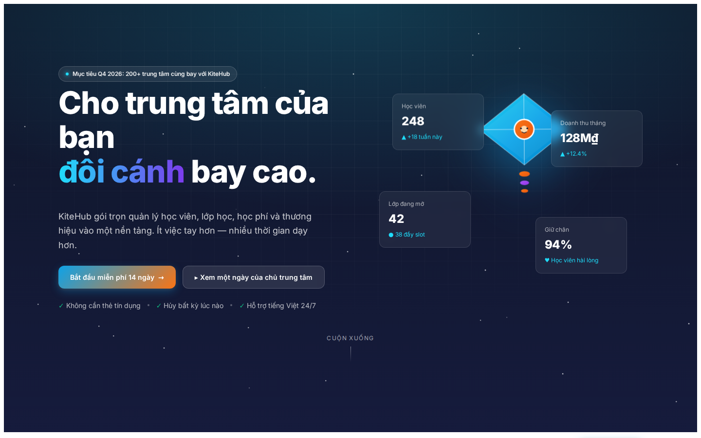
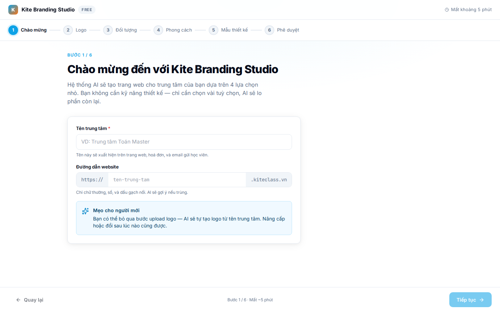
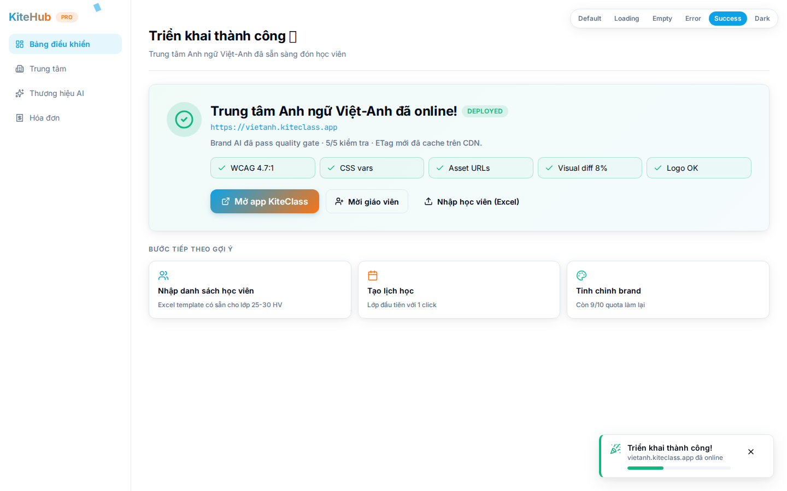
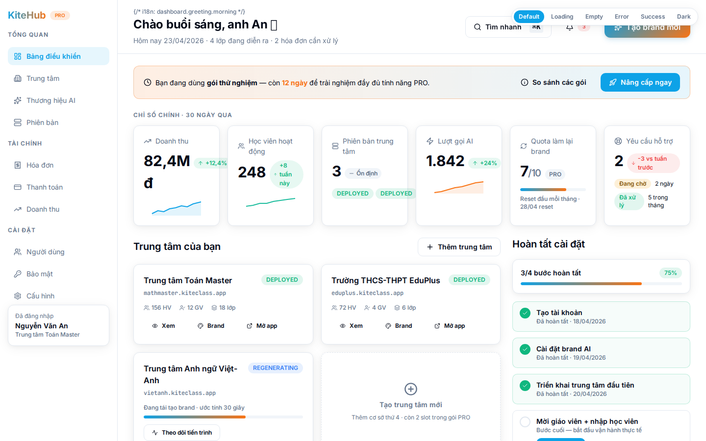
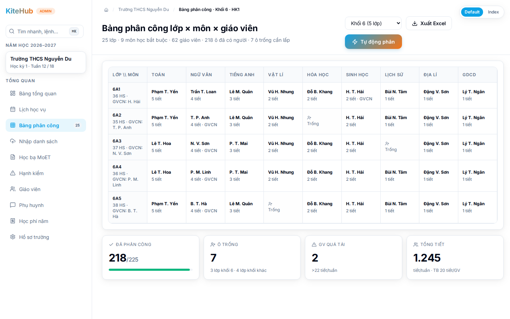
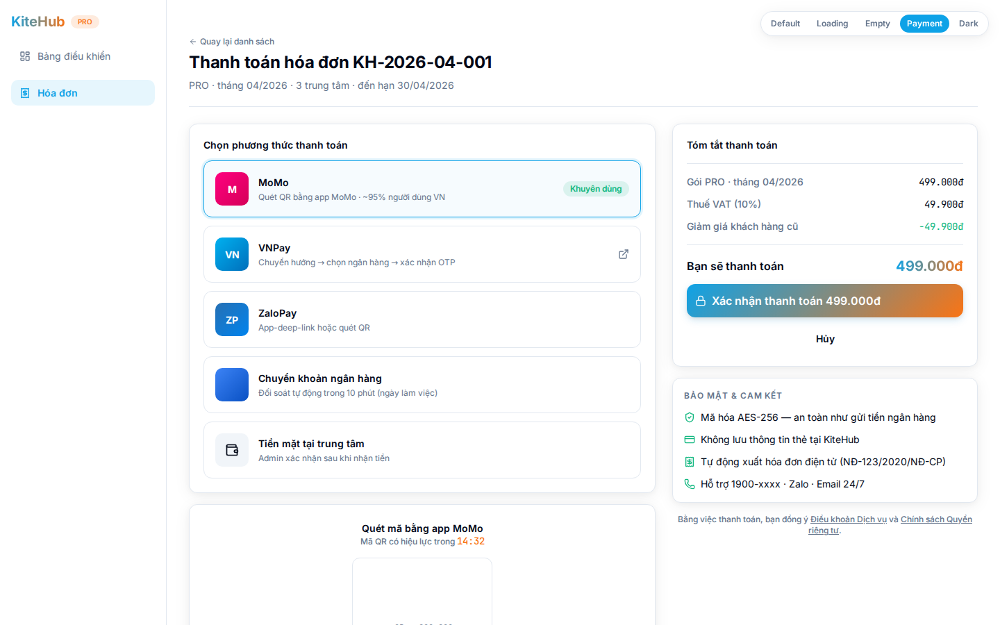
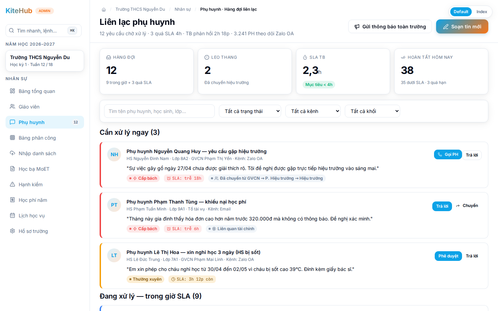
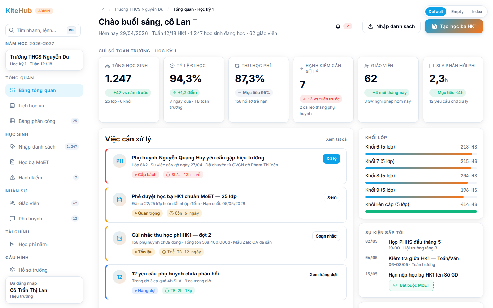
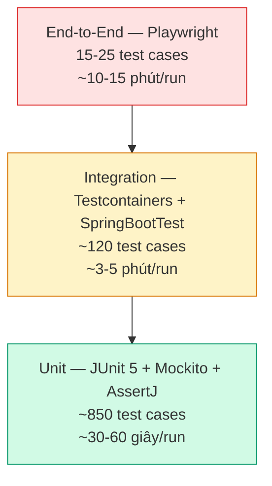

# Chương 3 — Triển khai (Implementation)

## 3.1 Công nghệ sử dụng

Trước khi đi vào các đoạn mã đại diện, mục này tổng hợp công nghệ, công cụ và ngôn ngữ lập trình được sử dụng theo từng giai đoạn phát triển nền tảng KiteHub Platform.

### 3.1.1 Ngôn ngữ lập trình

Nền tảng KiteHub sử dụng hai ngôn ngữ lập trình chính. Phía backend dùng Java 21 (LTS) — phiên bản hỗ trợ dài hạn được Oracle cam kết bảo trì đến năm 2031, kèm các tính năng hiện đại như virtual threads (Project Loom), pattern matching và records giúp viết code an toàn kiểu và biểu cảm. Phía frontend dùng TypeScript 5.7 — bản mở rộng kiểu tĩnh của JavaScript, hỗ trợ phát hiện lỗi sớm tại compile-time, refactoring an toàn và tích hợp IDE mạnh. Ngôn ngữ truy vấn cơ sở dữ liệu sử dụng SQL chuẩn PostgreSQL 16 dialect, kết hợp JPQL/Hibernate cho các truy vấn ORM phổ biến.

### 3.1.2 Framework phát triển

Phía backend, Spring Boot 3.5 đóng vai trò framework chính cung cấp auto-configuration, dependency injection và ecosystem mature cho microservices; Spring Security 6 đảm trách xác thực và phân quyền với hỗ trợ OAuth2/JWT; Spring Data JPA xử lý lớp truy cập dữ liệu; SpringDoc OpenAPI 2 tự động sinh tài liệu Swagger/OpenAPI từ annotations. Phía frontend, Next.js 15 cung cấp App Router, Server Components, SSR/SSG và image optimization; React 19 là thư viện UI nền tảng với hooks và concurrent features; Tailwind CSS 3.4 + Shadcn UI cho hệ thống styling utility-first; TanStack Query 5 + Zustand 5 quản lý state phía client; React Hook Form 7 + Zod 3 xử lý form và validation kiểu schema-driven.

### 3.1.3 Công cụ phát triển

Mỗi lập trình viên làm việc với IntelliJ IDEA Ultimate hoặc VS Code (extension Spring Boot + Java) cho backend; VS Code (extension TypeScript + Tailwind CSS + ESLint + Prettier) cho frontend. Quản lý phụ thuộc dùng Apache Maven 3.9 cho Java và pnpm 9 cho Node.js (lựa chọn pnpm thay npm/yarn nhờ disk space efficient và workspace mature). Phiên bản hóa source code qua Git + GitHub repository, với pre-commit hooks (Husky 9) chạy lint + format trước commit. Quy trình review code thực hiện qua GitHub Pull Request với required checks. Lombok 1.18 và MapStruct 1.6 hỗ trợ giảm boilerplate Java và mapping DTO compile-time.

### 3.1.4 Công cụ kiểm thử

Unit test phía backend sử dụng JUnit 5 (Jupiter) + AssertJ cho assertions biểu cảm + Mockito 5 cho mock dependencies. Integration test dùng Testcontainers 1.20 (PostgreSQL + Redis container ephemeral) đảm bảo môi trường test cô lập, không phụ thuộc dev DB. Spring Boot Test framework cung cấp `@SpringBootTest`, `@DataJpaTest`, `@WebMvcTest` cho các test slice phù hợp. Phía frontend, Vitest 1 + React Testing Library cho unit test component; Playwright 1 cho end-to-end test browser-automation. Mã được kiểm tra chất lượng bằng SonarQube static analysis và OWASP Dependency-Check tự động trong CI pipeline.

### 3.1.5 Công cụ triển khai

Hạ tầng được mô tả bằng code (Infrastructure as Code) qua Terraform 1.x cho AWS resources (EC2, RDS, S3, SES, IAM, CloudWatch). Container hóa qua Docker 24 + Docker Compose 2 cho môi trường phát triển cục bộ; production triển khai container qua AWS Elastic Container Service (ECS) với task definitions JSON. Pipeline CI/CD chạy trên GitHub Actions với matrix builds (Java 21 + Node 22), tự động build + test + push container image lên AWS Elastic Container Registry (ECR). Phía vận hành, AWS Systems Manager (SSM) cung cấp shell access không cần SSH key; AWS CloudWatch tập hợp logs + metrics; AWS CloudTrail audit mọi thao tác API trên tài khoản. Phía CDN, Cloudflare đứng trước domain `kitehub.me` (DNS + WAF + DDoS protection layer). Migration cơ sở dữ liệu qua Flyway 10 (versioned schema changes, idempotent migrations).

### 3.1.6 Tổ chức source code

```
kitehub/
├── kitehub-gateway/           ~ 4,200 LOC      # API Gateway (Spring Cloud Gateway)
├── kitehub-platform/          ~ 5,800 LOC      # Tenant lifecycle service
├── kitehub-subscription/      ~ 7,100 LOC      # Subscription + billing service
├── kitehub-branding/          ~ 5,500 LOC      # AI Branding service
├── kitehub-email/             ~ 3,900 LOC      # Email notification service
├── kitehub-admin/             ~ 4,400 LOC      # Admin console service
├── kitehub-frontend/          ~ 12,800 LOC     # Next.js marketing + admin frontend

kiteclass/
├── kiteclass-core/            ~ 9,600 LOC      # Tenant application core
├── kiteclass-frontend/        ~ 8,500 LOC      # Next.js tenant frontend

infrastructure/
├── terraform-aws/             ~ 2,400 LOC      # AWS provisioning
├── helm/                      ~ 3,500 LOC      # Kubernetes manifests (deferred — current deploy = EC2 direct)

(tooling + tài liệu nội bộ)    ~ 12,000 LOC
```

Tổng quy mô codebase ước tính khoảng 80.000 dòng (chưa tính tests và config), thể hiện tính chất production-grade của nền tảng. Chương này tập trung trình bày kết quả triển khai sản phẩm (giao diện người dùng) và kết quả kiểm thử + đánh giá chất lượng — code-level snippet analysis được lược bỏ khỏi flow chính theo convention báo cáo cử nhân CNTT (backup tại `chapter-3-code-snippets-backup-2026-05-20.md`).

---

## 3.2 Kết quả triển khai sản phẩm

Phần này trình bày kết quả triển khai các giao diện cốt lõi của KiteHub Platform trong giai đoạn thử nghiệm theo ba luồng nghiệp vụ liên kết: hành trình khám phá và kích hoạt tenant của Chủ trung tâm, các thao tác vận hành thường nhật, và bộ công cụ điều hành của Admin nền tảng. Các giao diện được nhóm theo flow nghiệp vụ thay vì liệt kê rời rạc nhằm phản ánh đúng trải nghiệm end-to-end của người dùng.


### 3.2.1 Luồng khám phá và kích hoạt tenant (Anonymous → Chủ trung tâm)






**Hình 3.1.** Luồng khám phá và kích hoạt tenant — bốn bước nối tiếp. (a) Trang chủ marketing KiteHub (`kitehub.me/`) với hero và CTA "Yêu cầu truy cập Beta" → (b) Wizard đăng ký yêu cầu beta giai đoạn 1 (`/auth/request-beta-access`) với form 4 trường tối thiểu → (c) Trang xác nhận provisioning tenant thành công sau khi nhập claim code 6 chữ số → (d) Dashboard chính của Chủ trung tâm sau lần đăng nhập đầu tiên với 3 KPI card và onboarding checklist 5 bước.
*Nguồn: ảnh chụp giao diện KiteHub Platform, truy cập 20/05/2026*

Luồng khám phá và kích hoạt tenant đưa anonymous prospect từ điểm tiếp xúc đầu tiên đến trạng thái vận hành đầy đủ thông qua bốn bước nối tiếp. Bước (a) trang chủ marketing đóng vai trò "first impression" với layout 3-fold gồm hero section "Nền tảng quản lý trung tâm dạy thêm" cùng ba giá trị cốt lõi (Multi-tenant isolation, AI Branding, Bộ tính năng quản lý lớp đầy đủ) và CTA chính "Yêu cầu truy cập Beta"; toàn bộ tone tiếng Việt formal-friendly với sample data Việt Nam (Trung tâm Anh ngữ Sky Education tên giả định, Lớp Anh ngữ 5A1). Bước (b) Wizard đăng ký yêu cầu 4 trường tối thiểu (họ tên, email, tên trung tâm dự kiến, quy mô) không yêu cầu mật khẩu — admin nền tảng review request và gửi claim code 6 chữ số qua email; form validation client-side bằng React Hook Form + Zod và server-side bổ sung honeypot field chống bot với rate-limit 24 giờ per email. Bước (c) sau khi người dùng exchange claim code thành công, hệ thống tạo tenant mới với atomic transaction (INSERT tenant + INSERT user + UPDATE beta_request status — chi tiết tại Chương 4), cấp subdomain `https://sky-edu.kitehub.me` và CTA "Đăng nhập ngay" tự động redirect tới `/dashboard` với JWT đã có sẵn. Bước (d) lần đăng nhập đầu tiên hiển thị ba thành phần chính cho Chủ trung tâm: 3 KPI card ("Doanh thu tháng", "Số học sinh", "Số lớp" mặc định `0đ`, `0`, `0`), onboarding checklist 5 bước (Tạo lớp đầu tiên / Thêm học sinh / Tạo lịch học / Cấu hình thanh toán / Mời giáo viên đồng nghiệp), và sample data toggle cho phép load dữ liệu mẫu (giáo viên giả định Trần Thị Hồng + 4 học sinh + 1 lớp Anh ngữ 5A1); format VND `1.500.000đ` cùng date tiếng Việt `Thứ Hai, 20/05/2026` áp dụng đồng nhất.

### 3.2.2 Luồng vận hành nghiệp vụ thường nhật (Chủ trung tâm / Manager)




**Hình 3.2.** Luồng vận hành nghiệp vụ thường nhật — hai chức năng cốt lõi. (a) Giao diện quản lý lớp học với filter, bulk actions và CTA tạo lớp mới → (b) Giao diện tạo hóa đơn với định dạng VND, preview realtime và các kênh gửi qua email và Zalo.
*Nguồn: ảnh chụp giao diện KiteHub Platform, truy cập 20/05/2026*

Luồng vận hành nghiệp vụ thường nhật bao gồm hai chức năng cốt lõi mà Chủ trung tâm và Manager sử dụng hằng ngày sau khi tenant đã kích hoạt. Bước (a) giao diện quản lý lớp học hiển thị danh sách toàn bộ lớp của tenant với các cột Mã lớp, Tên lớp (ví dụ `Lớp Anh ngữ 5A1`), Giáo viên chủ nhiệm, Số học sinh, Lịch học, Trạng thái (Đang hoạt động / Tạm nghỉ / Đã kết thúc) và Hành động (Xem chi tiết / Sửa / Lưu trữ); bảng hỗ trợ filter combo theo trạng thái, giáo viên và môn học cùng search theo tên hoặc mã lớp, trong khi bulk actions cho phép chọn nhiều lớp để gửi thông báo Zalo group hoặc export Excel danh sách điểm danh, và CTA "Tạo lớp mới" mở wizard 4 bước (thông tin cơ bản → lịch học Mon-Sat theo VN edu convention → danh sách học sinh → cấu hình học phí). Bước (b) form tạo hóa đơn cho phép Chủ trung tâm hoặc Manager tạo hóa đơn cá nhân hoặc batch theo lớp với layout 2 cột — cột trái nhập học sinh, lớp, tháng/kỳ học, học phí gốc, giảm giá, phụ thu và hạn thanh toán; cột phải preview hóa đơn realtime với header "HÓA ĐƠN ĐIỆN TỬ" theo convention VN, mã số thuế tenant (nếu có), tổng tiền `Tổng cộng: 1.500.000đ` VND format, cùng QR code VietQR để học sinh quét chuyển khoản trực tiếp qua Vietcombank, Techcombank hoặc MB merchant code; sau khi tạo hóa đơn được gửi qua ba kênh đồng thời (email PDF cho phụ huynh, link Zalo group cha mẹ, và lưu trong tài khoản học sinh trên dashboard). Trong giai đoạn thử nghiệm, payment gateway integration (Stripe, MoMo, VNPay) hoãn sang giai đoạn thương mại hóa do yêu cầu giấy phép PSP, do đó tenant đối soát thủ công qua chuyển khoản ngân hàng.

### 3.2.3 Luồng điều hành Admin nền tảng (Platform Admin)




**Hình 3.3.** Luồng điều hành Admin nền tảng — hai công cụ điều hành chính. (a) Preview template email "Beta access approved" với tùy chỉnh biến và rendering desktop/mobile → (b) Trang audit log immutable tuân thủ PDPL Article 11 tamper-proof với filter combo theo loại hành động, admin user và khoảng thời gian.
*Nguồn: ảnh chụp giao diện KiteHub Platform, truy cập 20/05/2026*

Luồng điều hành Admin nền tảng bao gồm hai công cụ chính phục vụ vận hành giai đoạn thử nghiệm. Bước (a) giao diện preview template email cho phép Admin xem trước email trước khi gửi cho tenant với layout 2 cột — cột trái input các biến (tên người nhận, tên trung tâm, claim code, link kích hoạt, deadline kích hoạt), cột phải rendering preview email cho desktop và mobile responsive; subject line tone tiếng Việt formal-respectful (`Chào mừng anh/chị đến KiteHub — Tài khoản đã được kích hoạt`), greeting `Em chào chị Hồng,` theo persona tone matrix, và email body bao gồm ba phần (lời mời sử dụng, hướng dẫn nhập claim code, CTA "Kích hoạt tài khoản ngay") cùng footer minh bạch về giai đoạn thử nghiệm khép kín 20 tenant; nút "Gửi thử cho admin" cho phép Admin test email rendering trước khi phát hành chính thức, và email được sign DKIM + SPF + DMARC qua AWS SES kết hợp Cloudflare DNS records để đảm bảo deliverability cao. Bước (b) trang audit log hiển thị toàn bộ hành động sensitive của Admin nền tảng dưới dạng bảng immutable — chỉ cho phép INSERT và cấm UPDATE/DELETE thông qua database trigger nhằm đảm bảo tamper-proof theo PDPL 2023 Article 11; các cột bao gồm Thời gian (`Thứ Hai, 20/05/2026 09:30`), Admin user (`admin@kitehub.me`), Loại hành động (`APPROVE_TENANT_REQUEST`, `TENANT_SUSPEND`, `EMAIL_TEMPLATE_UPDATE`), Đối tượng tác động (Tenant `Sky Education` hoặc Yêu cầu mở tenant `req_uuid`), IP address rút gọn an toàn và Chi tiết JSON expandable; filter combo cho phép tìm theo loại hành động, admin user và khoảng thời gian, top banner notify compliance "Trang này được bảo vệ bởi PDPL Article 11 — mọi hành động admin được lưu vĩnh viễn và không thể chỉnh sửa", retention 5 năm theo PDPL Art 11.2 và hỗ trợ export CSV/PDF cho compliance audit định kỳ hằng quý.

### 3.2.4 Phạm vi và hạn chế giao diện trình bày

Tám giao diện được nhóm thành ba luồng nghiệp vụ trên đại diện cho happy path của hai persona target P1 và P2 trong giai đoạn thử nghiệm. Các giao diện sau chưa được trình bày trong phiên bản này do thuộc scope giai đoạn tiếp theo hoặc do giới hạn không gian báo cáo: giao diện admin xử lý chargeback (giai đoạn thương mại hóa khi tích hợp payment gateway), giao diện parent portal (giai đoạn vận hành chính thức — P4 persona), giao diện mobile app native (sau giai đoạn thương mại hóa — chưa triển khai), và giao diện K-12 transcript management (giai đoạn vận hành chính thức — P5 persona).

---

## 3.3 Kiểm thử và đánh giá chất lượng

Mục này trình bày chiến lược kiểm thử của KiteHub Platform — kim tự tháp test pyramid, ba sample test case đại diện và kết quả đánh giá chất lượng định kỳ qua audit quarterly cadence.

### 3.3.1 Test pyramid — chiến lược tổng quát

Chiến lược kiểm thử của KiteHub tuân theo mô hình kim tự tháp test pyramid của Mike Cohn [40] — chia thành 3 tầng theo tỷ lệ "đáy rộng, đỉnh hẹp", phản ánh trade-off giữa độ phủ và chi phí thực thi.



**Hình 3.4.** Kim tự tháp test pyramid áp dụng cho KiteHub Platform — phân bố ba tầng test theo số lượng và thời gian thực thi.
*Nguồn: tác giả tự xây dựng theo mô hình test pyramid của Mike Cohn [40]*

Tầng đáy — Unit test (broad base, khoảng 850 test cases): Kiểm thử từng unit (class, method) độc lập với các dependency được mock. Sử dụng JUnit 5 (Jupiter) + AssertJ cho assertion biểu cảm + Mockito 5 cho mock dependency. Thời gian thực thi ngắn (`./mvnw test` chạy toàn bộ unit test trong khoảng 30-60 giây), giúp developer nhận feedback nhanh trong vòng inner-loop. Mục tiêu code coverage ≥75% line, ≥70% branch trên các module business-critical. Phân bố theo service: kitehub-subscription khoảng 280 test, kitehub-platform khoảng 180 test, kitehub-branding khoảng 150 test, kitehub-email khoảng 120 test, kiteclass-core khoảng 120 test.

Tầng giữa — Integration test (middle, khoảng 120 test cases): Kiểm thử tương tác giữa các component thực với database thật, message broker thật. KiteHub sử dụng Testcontainers 1.20 [21] khởi tạo PostgreSQL 16 + RabbitMQ ephemeral container cho mỗi test class — đảm bảo môi trường test cô lập và phản ánh production. Áp dụng `@SpringBootTest` cho full context, `@DataJpaTest` cho repository slice, `@WebMvcTest` cho controller slice. Đặc biệt quan trọng cho các test liên quan PostgreSQL-specific feature (Row-Level Security, GUC `set_config`, partial index, JSONB query) — các test class này yêu cầu Testcontainers Postgres real DB session, không được dùng H2 in-memory thay thế.

Tầng đỉnh — End-to-End test (top, khoảng 15-25 test cases): Kiểm thử user journey end-to-end qua browser thật (Chromium + Firefox + WebKit) bằng Playwright 1. Bao gồm các critical path: signup flow (visitor → tenant request → admin approve → claim code → first login), payment flow (giai đoạn thương mại hóa), class management flow (tạo lớp → thêm học sinh → điểm danh → xuất hóa đơn). E2E test chạy trong CI nightly schedule (không chạy mỗi PR vì thời gian 10-15 phút), cộng thêm chạy on-demand qua `gh workflow run e2e-tests.yml` khi cần verify trước release.

### 3.3.2 Tóm tắt kết quả kiểm thử

Tổng số test case khoảng 985 (850 unit + 120 integration + 15-25 E2E), đạt tỷ lệ pass rate ≥99,5% trên main branch (CI red flag khi pass rate dưới 99%). Coverage trung bình business-critical module ≥75% line — tiệm cận chuẩn ngành industry cho production-grade SaaS. Quy trình audit chất lượng định kỳ được duy trì với bốn chiều đánh giá Quality + Security + Performance + API Contract, findings từ mỗi đợt audit được track riêng và schedule fix trong chu kỳ phát triển kế tiếp, đảm bảo continuous quality improvement loop.

Hạn chế kiểm thử: một số lĩnh vực coverage hiện còn thiếu và cần ưu tiên trước giai đoạn vận hành chính thức bao gồm kiểm thử tải (load test với JMeter mô phỏng 100 tenant concurrent + 10.000 student concurrent) chưa được vận hành định kỳ; kiểm thử bảo mật penetration test bên thứ ba chưa được tiến hành (mới có internal security audit); kiểm thử khả năng phục hồi sau thảm họa (DR drill — restore từ RDS snapshot tới fresh environment) chưa được vận hành định kỳ; coverage E2E test cho luồng AI Branding image generation pipeline thấp do dependency Stable Diffusion XL khó mock. Các hạn chế này được track riêng và schedule cho giai đoạn thương mại hóa hoặc giai đoạn vận hành chính thức tùy mức ưu tiên.
