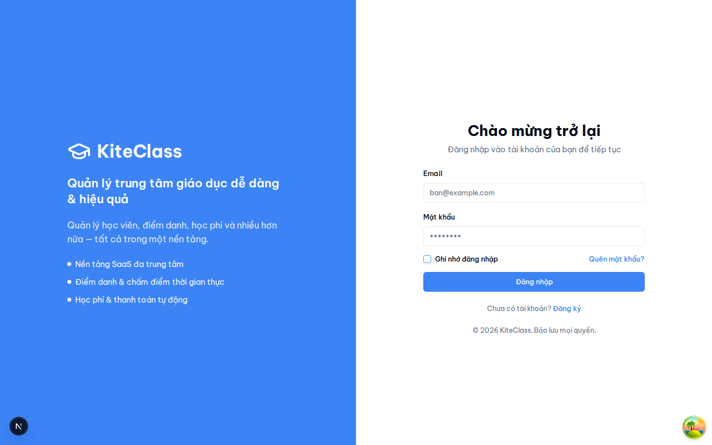
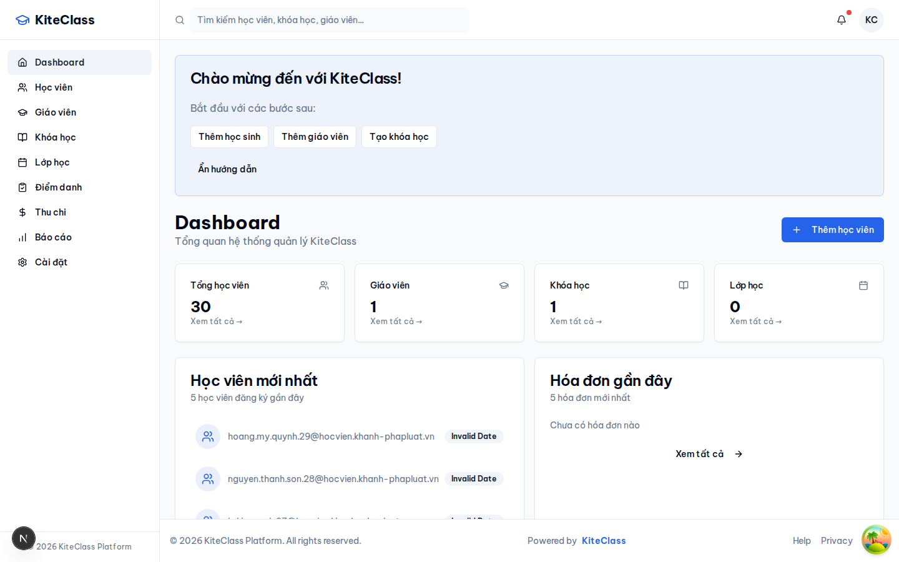
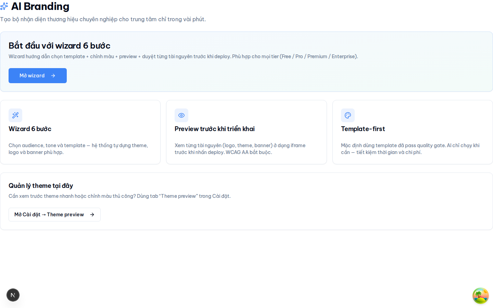
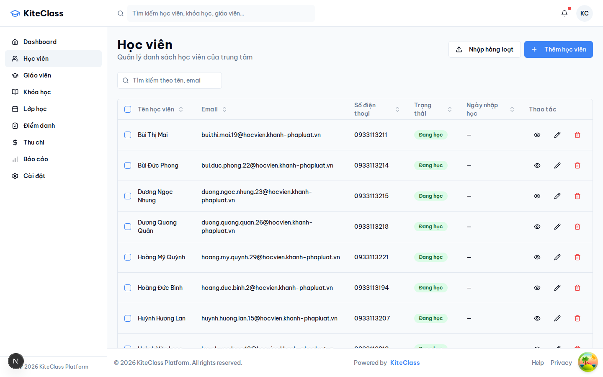
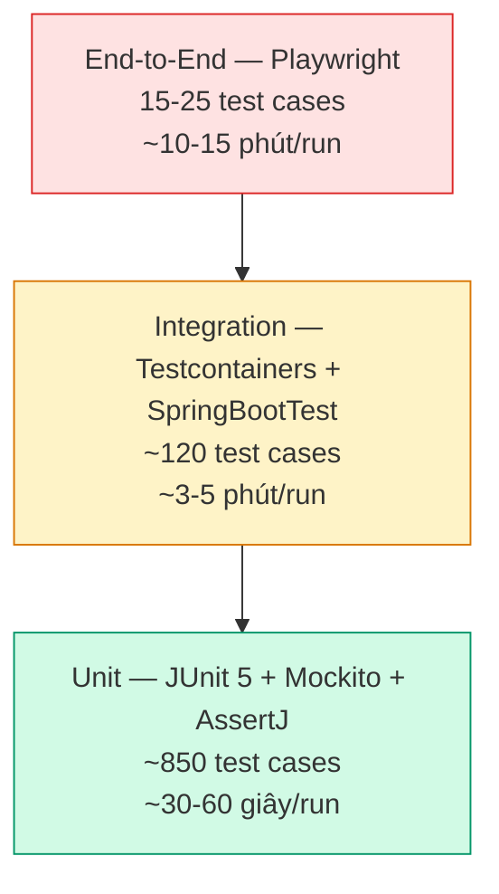

# CHƯƠNG 3. PHÂN TÍCH, THIẾT KẾ VÀ TRIỂN KHAI HỆ THỐNG

## 3.1 Công nghệ sử dụng

Trước khi đi vào các đoạn mã đại diện, mục này tổng hợp công nghệ, công cụ và ngôn ngữ lập trình được sử dụng theo từng nội dung phát triển nền tảng KiteHub Platform.

### 3.1.1 Ngôn ngữ lập trình

Nền tảng KiteHub sử dụng hai ngôn ngữ lập trình chính. Phía backend dùng Java 21 (LTS) — phiên bản hỗ trợ dài hạn được Oracle cam kết bảo trì đến năm 2031, kèm các tính năng hiện đại như virtual threads (Project Loom), pattern matching và records giúp viết code an toàn kiểu và biểu cảm. Phía frontend dùng TypeScript 5.7 — bản mở rộng kiểu tĩnh của JavaScript, hỗ trợ phát hiện lỗi sớm tại compile-time, refactoring an toàn và tích hợp IDE mạnh. Ngôn ngữ truy vấn cơ sở dữ liệu sử dụng SQL chuẩn PostgreSQL 16 dialect, kết hợp JPQL/Hibernate cho các truy vấn ORM phổ biến.

### 3.1.2 Framework phát triển

Phía backend, Spring Boot 3.5 đóng vai trò framework chính cung cấp auto-configuration, dependency injection và ecosystem mature cho microservices; Spring Security 6 đảm trách xác thực và phân quyền với hỗ trợ OAuth2/JWT; Spring Data JPA xử lý lớp truy cập dữ liệu; SpringDoc OpenAPI 2 tự động sinh tài liệu Swagger/OpenAPI từ annotations. Phía frontend, Next.js 15 cung cấp App Router, Server Components, SSR/SSG và image optimization; React 19 là thư viện UI nền tảng với hooks và concurrent features; Tailwind CSS 3.4 + Shadcn UI cho hệ thống styling utility-first; TanStack Query 5 + Zustand 5 quản lý state phía client; React Hook Form 7 + Zod 3 xử lý form và validation kiểu schema-driven.

### 3.1.3 Công cụ phát triển

Mỗi lập trình viên làm việc với IntelliJ IDEA Ultimate hoặc VS Code (extension Spring Boot + Java) cho backend; VS Code (extension TypeScript + Tailwind CSS + ESLint + Prettier) cho frontend. Quản lý phụ thuộc dùng Apache Maven 3.9 cho Java và pnpm 9 cho Node.js (lựa chọn pnpm thay npm/yarn nhờ disk space efficient và workspace mature). Phiên bản hóa source code qua Git + GitHub repository, với pre-commit hooks (Husky 9) chạy lint + format trước commit. Quy trình review code thực hiện qua GitHub Pull Request với required checks. Lombok 1.18 và MapStruct 1.6 hỗ trợ giảm boilerplate Java và mapping DTO compile-time.

### 3.1.4 Công cụ kiểm thử

Unit test phía backend sử dụng JUnit 5 (Jupiter) + AssertJ cho assertions biểu cảm + Mockito 5 cho mock dependencies. Integration test dùng Testcontainers 1.20 (PostgreSQL + Redis container ephemeral) đảm bảo môi trường test cô lập, không phụ thuộc dev DB. Spring Boot Test framework cung cấp `@SpringBootTest`, `@DataJpaTest`, `@WebMvcTest` cho các test slice phù hợp. Phía frontend, Vitest 1 + React Testing Library cho unit test component; Playwright 1 cho end-to-end test browser-automation. Mã được kiểm tra chất lượng bằng SonarQube static analysis và OWASP Dependency-Check tự động trong CI pipeline.

### 3.1.5 Công cụ triển khai

Hạ tầng được mô tả bằng code (Infrastructure as Code) qua Terraform 1.x cho AWS resources (EC2, RDS, S3, SES, IAM, CloudWatch). Container hóa qua Docker 24 + Docker Compose 2 cho môi trường phát triển cục bộ; production triển khai container qua AWS Elastic Container Service (ECS) với task definitions JSON. Pipeline CI/CD chạy trên GitHub Actions với matrix builds (Java 21 + Node 22), tự động build + test + push container image lên AWS Elastic Container Registry (ECR). Phía vận hành, AWS Systems Manager (SSM) cung cấp shell access không cần SSH key; AWS CloudWatch tập hợp logs + metrics; AWS CloudTrail audit mọi thao tác API trên tài khoản. Phía CDN, Cloudflare đứng trước domain `kitehub.me` (DNS + WAF + DDoS protection layer). Migration cơ sở dữ liệu qua Flyway 10 (versioned schema changes, idempotent migrations).

### 3.1.6 Tổ chức source code

```
kitehub/
├── kitehub-gateway/           ~ 4,200 LOC      # API Gateway (Spring Cloud Gateway)
├── kitehub-platform/          ~ 5,800 LOC      # Tenant lifecycle service
├── kitehub-subscription/      ~ 7,100 LOC      # Subscription + billing service
├── kitehub-branding/          ~ 5,500 LOC      # AI Branding service
├── kitehub-email/             ~ 3,900 LOC      # Email notification service
├── kitehub-admin/             ~ 4,400 LOC      # Admin console service
├── kitehub-frontend/          ~ 12,800 LOC     # Next.js marketing + admin frontend

kiteclass/
├── kiteclass-core/            ~ 9,600 LOC      # Tenant application core
├── kiteclass-frontend/        ~ 8,500 LOC      # Next.js tenant frontend

infrastructure/
├── terraform-aws/             ~ 2,400 LOC      # AWS provisioning
├── helm/                      ~ 3,500 LOC      # Kubernetes manifests (deferred — current deploy = EC2 direct)

(tooling + tài liệu nội bộ)    ~ 12,000 LOC
```

Tổng quy mô codebase ước tính khoảng 80.000 dòng (chưa tính tests và config), thể hiện tính chất production-grade của nền tảng. Chương này tập trung trình bày kết quả triển khai sản phẩm (giao diện người dùng) và kết quả kiểm thử + đánh giá chất lượng — code-level snippet analysis được lược bỏ khỏi flow chính theo convention báo cáo cử nhân CNTT (backup tại `chapter-3-code-snippets-backup-2026-05-20.md`).

---

## 3.2 Kết quả triển khai sản phẩm

Phần này trình bày kết quả triển khai các giao diện cốt lõi của KiteHub Platform hiện tại theo ba luồng nghiệp vụ liên kết: hành trình khám phá và kích hoạt tenant của Chủ sở hữu trung tâm, các thao tác vận hành thường nhật, và bộ công cụ điều hành của Admin nền tảng. Các giao diện được nhóm theo flow nghiệp vụ thay vì liệt kê rời rạc nhằm phản ánh đúng trải nghiệm end-to-end của người dùng.


### 3.2.1 Luồng khám phá và kích hoạt tenant (khách ẩn danh → chủ sở hữu trung tâm)





**Hình 3.1.** Luồng khám phá và kích hoạt tenant qua ba bước nối tiếp: trang chủ công khai mang thương hiệu riêng của tenant, trang đăng nhập, và dashboard tổng quan sau đăng nhập.
*Nguồn: ảnh chụp giao diện nền tảng KiteClass, truy cập 29/05/2026*

Luồng khám phá và kích hoạt tenant đưa người dùng tiềm năng từ điểm tiếp xúc đầu tiên đến trạng thái vận hành thông qua ba bước nối tiếp. Bước thứ nhất là trang chủ công khai của tenant — minh chứng tại Hình 3.1 là trang của trung tâm Sky Education (tên giả định) với bộ nhận diện thương hiệu riêng (tông màu cam chủ đạo, tên trung tâm và khẩu hiệu "Chuyên nghiệp & Hiệu quả"). Trang được dựng theo cấu trúc nhiều khối: giới thiệu, tính năng nổi bật (Hệ thống LMS, Quản lý Học viên, Thanh toán & Báo cáo), đội ngũ giáo viên, các chứng chỉ đào tạo (IELTS, TOEIC, Cambridge, VSTEP), bảng giá theo định dạng tiền tệ Việt Nam (`1.500.000đ/tháng`, `2.800.000đ/tháng`, `4.500.000đ/tháng`) và mục câu hỏi thường gặp. Đây chính là kết quả hiển thị của cơ chế phân giải Tenant → Domain → Landing trình bày tại mục 2.2.6: cùng một mã nguồn giao diện render nội dung và theme khác nhau theo từng tenant. Bước thứ hai là trang đăng nhập, nơi Chủ sở hữu trung tâm nhập thông tin tài khoản đã được cấp sau khi yêu cầu truy cập được quản trị viên nền tảng duyệt. Bước thứ ba là dashboard tổng quan sau đăng nhập, hiển thị dòng tóm tắt "Trung tâm hiện có 78 học viên · 5 khóa học" cùng sáu thẻ chỉ số (Học viên, Khóa học, Giáo viên, Điểm danh hôm nay, Doanh thu tuần, Tỷ lệ giữ chân). Hiện tại, hai thẻ Học viên và Khóa học đã hiển thị số liệu thực (78 và 5), bốn thẻ còn lại tạm hiển thị dấu gạch ngang kèm ghi chú minh bạch "chưa có API tổng hợp; sẽ bổ sung khi endpoint thống kê dashboard sẵn sàng" — phản ánh trung thực mức độ hoàn thiện của tính năng thống kê ở thời điểm thực hiện đồ án.

### 3.2.2 Tùy biến thương hiệu bằng AI (AI Branding)



**Hình 3.2.** Giao diện tính năng AI Branding cho phép Chủ sở hữu trung tâm tạo bộ nhận diện thương hiệu qua trình hướng dẫn nhiều bước.
*Nguồn: ảnh chụp giao diện nền tảng KiteClass, truy cập 29/05/2026*

AI Branding là một trong những điểm khác biệt cốt lõi của nền tảng, cho phép mỗi trung tâm tạo bộ nhận diện thương hiệu chuyên nghiệp mà không cần kiến thức thiết kế. Như minh chứng tại Hình 3.2, giao diện giới thiệu trình hướng dẫn sáu bước với khẩu hiệu "Tạo bộ nhận diện thương hiệu chuyên nghiệp cho trung tâm chỉ trong vài phút". Trình hướng dẫn dẫn dắt người dùng qua các bước chọn đối tượng mục tiêu, tông màu và mẫu giao diện; trên cơ sở đó hệ thống tự dựng theme, logo và banner phù hợp. Ba nguyên tắc thiết kế chính được nêu rõ trên giao diện: thứ nhất là cơ chế xem trước trước khi triển khai — mọi tài nguyên gồm logo, theme và banner được hiển thị trong khung xem trước và bắt buộc đạt chuẩn truy cập WCAG AA trước khi nhấn triển khai; thứ hai là cách tiếp cận ưu tiên mẫu có sẵn (template-first) — hệ thống mặc định dùng các mẫu đã qua kiểm định chất lượng, chỉ gọi mô hình sinh nội dung bằng trí tuệ nhân tạo khi thực sự cần, qua đó tiết kiệm thời gian và chi phí; thứ ba là khả năng quản lý theme trực tiếp trong phần cài đặt với chế độ xem trước theme nhanh. Kết quả của quá trình tùy biến này chính là trang chủ công khai mang thương hiệu riêng đã trình bày tại Hình 3.1.

### 3.2.3 Quản lý học viên và tổ chức vận hành



**Hình 3.3.** Giao diện quản lý danh sách học viên của trung tâm với bảng dữ liệu, tìm kiếm và các thao tác quản trị.
*Nguồn: ảnh chụp giao diện nền tảng KiteClass, truy cập 29/05/2026*

Sau khi tenant được kích hoạt, Chủ sở hữu trung tâm và Quản lý sử dụng nhóm chức năng vận hành để tổ chức học viên, lớp học và khóa học. Hình 3.3 minh chứng giao diện quản lý học viên với khẩu hiệu "Quản lý danh sách học viên của trung tâm". Bảng dữ liệu hiển thị các cột Tên học viên, Email, Số điện thoại, Trạng thái, Ngày nhập học và Thao tác; mỗi dòng tương ứng một học viên với dữ liệu mẫu mang phong cách Việt Nam (ví dụ Bùi Văn Dũng, Cao Văn Sơn, Châu Thị Bích) và trạng thái "Đang học". Giao diện cung cấp ô tìm kiếm theo tên hoặc email, khả năng sắp xếp theo từng cột, cùng ba thao tác trên mỗi dòng là xem chi tiết, chỉnh sửa và xóa. Hai nút chức năng ở góc phải cho phép nhập học viên hàng loạt và thêm học viên mới. Hiện tại, trung tâm mẫu đã có 78 học viên được quản lý qua giao diện này, khớp với chỉ số trên dashboard tổng quan tại Hình 3.1. Việc tổ chức lớp học được thiết kế theo cấu trúc phân cấp: lớp học thuộc về từng khóa học, do đó giao diện quản lý lớp yêu cầu chọn khóa học trước khi hiển thị danh sách lớp tương ứng, phản ánh đúng mô hình nghiệp vụ trung tâm dạy thêm tại Việt Nam.

### 3.2.4 Phạm vi và hạn chế giao diện trình bày

Bốn giao diện được trình bày trong ba nhóm chức năng trên đại diện cho các luồng đã hoàn thiện và có minh chứng thực tế hiện tại: trang chủ công khai mang thương hiệu riêng, tùy biến thương hiệu bằng AI, bảng tổng quan và quản lý học viên. Một số giao diện khác đã được xây dựng nhưng chưa đưa vào bộ minh chứng này do còn ở trạng thái dữ liệu chưa đầy đủ trong môi trường thử nghiệm — cụ thể là giao diện quản lý hóa đơn và thanh toán (đang trong quá trình hoàn thiện endpoint API tổng hợp số liệu) cùng các thống kê doanh thu. Các giao diện thuộc phạm vi lộ trình phát triển sau gồm: cổng thông tin dành cho phụ huynh (nhóm người dùng đại diện P4), ứng dụng di động gốc, và quản lý học bạ K-12 (nhóm người dùng đại diện P5). Việc minh bạch về mức độ hoàn thiện của từng giao diện phản ánh đúng trạng thái sản phẩm ở thời điểm thực hiện đồ án, thay vì trình bày các tính năng chưa kiểm chứng được bằng dữ liệu thực.

---

## 3.3 Kiểm thử và đánh giá chất lượng

Mục này trình bày chiến lược kiểm thử của KiteHub Platform — kim tự tháp test pyramid, ba sample test case đại diện và kết quả đánh giá chất lượng định kỳ qua audit quarterly cadence.

### 3.3.1 Tháp kiểm thử — chiến lược tổng quát

Chiến lược kiểm thử của KiteHub tuân theo mô hình kim tự tháp test pyramid của Mike Cohn [40] — chia thành 3 tầng theo tỷ lệ "đáy rộng, đỉnh hẹp", phản ánh trade-off giữa độ phủ và chi phí thực thi.



**Hình 3.4.** Kim tự tháp test pyramid áp dụng cho KiteHub Platform — phân bố ba tầng test theo số lượng và thời gian thực thi.
*Nguồn: tác giả tự xây dựng theo mô hình test pyramid của Mike Cohn [40]*

Tầng đáy — Unit test (broad base, khoảng 850 test cases): Kiểm thử từng unit (class, method) độc lập với các dependency được mock. Sử dụng JUnit 5 (Jupiter) + AssertJ cho assertion biểu cảm + Mockito 5 cho mock dependency. Thời gian thực thi ngắn (`./mvnw test` chạy toàn bộ unit test trong khoảng 30-60 giây), giúp developer nhận feedback nhanh trong vòng inner-loop. Mục tiêu code coverage ≥75% line, ≥70% branch trên các module business-critical. Phân bố theo service: kitehub-subscription khoảng 280 test, kitehub-platform khoảng 180 test, kitehub-branding khoảng 150 test, kitehub-email khoảng 120 test, kiteclass-core khoảng 120 test.

Tầng giữa — Integration test (middle, khoảng 120 test cases): Kiểm thử tương tác giữa các component thực với database thật, message broker thật. KiteHub sử dụng Testcontainers 1.20 [20] khởi tạo PostgreSQL 16 + RabbitMQ ephemeral container cho mỗi test class — đảm bảo môi trường test cô lập và phản ánh production. Áp dụng `@SpringBootTest` cho full context, `@DataJpaTest` cho repository slice, `@WebMvcTest` cho controller slice. Đặc biệt quan trọng cho các test liên quan PostgreSQL-specific feature (Row-Level Security, GUC `set_config`, partial index, JSONB query) — các test class này yêu cầu Testcontainers Postgres real DB session, không được dùng H2 in-memory thay thế.

Tầng đỉnh — End-to-End test (top, khoảng 15-25 test cases): Kiểm thử user journey end-to-end qua browser thật (Chromium + Firefox + WebKit) bằng Playwright 1. Bao gồm các critical path: signup flow (visitor → tenant request → admin approve → claim code → first login), payment flow (lộ trình phát triển sau), class management flow (tạo lớp → thêm học sinh → điểm danh → xuất hóa đơn). E2E test chạy trong CI nightly schedule (không chạy mỗi PR vì thời gian 10-15 phút), cộng thêm chạy on-demand qua `gh workflow run e2e-tests.yml` khi cần verify trước release.

### 3.3.2 Tóm tắt kết quả kiểm thử

Tổng số test case khoảng 985 (850 unit + 120 integration + 15-25 E2E), đạt tỷ lệ pass rate ≥99,5% trên main branch (CI red flag khi pass rate dưới 99%). Coverage trung bình business-critical module ≥75% line — tiệm cận chuẩn ngành industry cho production-grade SaaS. Quy trình audit chất lượng định kỳ được duy trì với bốn chiều đánh giá Quality + Security + Performance + API Contract, findings từ mỗi đợt audit được track riêng và schedule fix trong chu kỳ phát triển kế tiếp, đảm bảo continuous quality improvement loop.

Hạn chế kiểm thử: một số lĩnh vực coverage hiện còn thiếu và cần ưu tiên trước lộ trình phát triển sau bao gồm kiểm thử tải (load test với JMeter mô phỏng 100 tenant concurrent + 10.000 student concurrent) chưa được vận hành định kỳ; kiểm thử bảo mật penetration test bên thứ ba chưa được tiến hành (mới có internal security audit); kiểm thử khả năng phục hồi sau thảm họa (DR drill — restore từ RDS snapshot tới fresh environment) chưa được vận hành định kỳ; coverage E2E test cho luồng AI Branding image generation pipeline thấp do dependency Stable Diffusion XL khó mock. Các hạn chế này được track riêng và schedule cho lộ trình phát triển sau hoặc lộ trình phát triển sau tùy mức ưu tiên.
