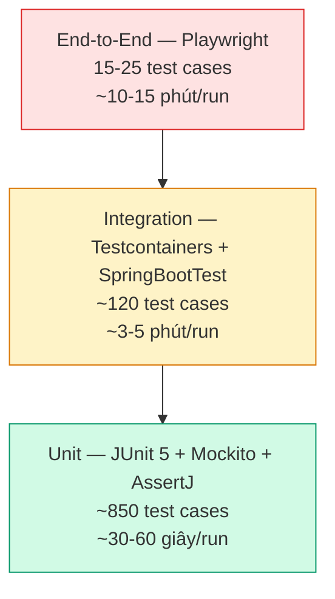

# CHƯƠNG 3. TRIỂN KHAI SẢN PHẨM VÀ KIỂM THỬ HỆ THỐNG

## 3.1 Kết quả triển khai sản phẩm

Phần này trình bày kết quả triển khai các giao diện cốt lõi của KiteHub Platform hiện tại theo ba luồng nghiệp vụ liên kết: hành trình khám phá và kích hoạt tenant của Chủ sở hữu trung tâm, các thao tác vận hành thường nhật, và bộ công cụ điều hành của Admin nền tảng. Các giao diện được nhóm theo flow nghiệp vụ thay vì liệt kê rời rạc nhằm phản ánh đúng trải nghiệm end-to-end của người dùng.

### 3.1.1 Luồng khám phá và kích hoạt tenant (khách ẩn danh → chủ sở hữu trung tâm)

**Hình 3.1.** Luồng khám phá và kích hoạt tenant qua ba bước nối tiếp: trang chủ công khai mang thương hiệu riêng của tenant, trang đăng nhập, và dashboard tổng quan sau đăng nhập.
Luồng khám phá và kích hoạt tenant đưa người dùng tiềm năng từ điểm tiếp xúc đầu tiên đến trạng thái vận hành thông qua ba bước nối tiếp. Bước thứ nhất là trang chủ công khai của tenant — minh chứng tại Hình 3.1 là trang của cô Đỗ Lan Khánh (tên giả định), một giảng viên độc lập dạy thêm môn Pháp luật & Đời sống bậc THPT, với bộ nhận diện thương hiệu riêng (tông màu xanh navy phối vàng gold chủ đạo, tên giảng viên và khẩu hiệu "Vững kiến thức - Vững tương lai"). Trang được dựng theo cấu trúc nhiều khối: giới thiệu, tính năng nổi bật (lộ trình học, quản lý học viên, học phí & báo cáo), thông tin giảng viên, thành tích ôn luyện môn Giáo dục công dân và Pháp luật trong kỳ thi tốt nghiệp THPT, bảng học phí theo định dạng tiền tệ Việt Nam (`1.500.000đ/tháng`, `2.800.000đ/khóa`, `4.500.000đ/khóa chuyên sâu`) và mục câu hỏi thường gặp. Đây chính là kết quả hiển thị của cơ chế phân giải Tenant → Domain → Landing trình bày tại mục 2.2.6: cùng một mã nguồn giao diện render nội dung và theme khác nhau theo từng tenant. Bước thứ hai là trang đăng nhập, nơi giảng viên nhập thông tin tài khoản đã được cấp sau khi yêu cầu truy cập được quản trị viên nền tảng duyệt. Bước thứ ba là dashboard tổng quan sau đăng nhập, gồm thẻ chào mừng kèm các thao tác nhanh (thêm học sinh, thêm giáo viên, tạo khóa học) và bốn thẻ chỉ số tổng quan — Tổng học viên, Giáo viên, Khóa học và Lớp học — hiển thị lần lượt 30, 1, 1 và 0 cho tenant của cô Khánh. Ba thẻ đầu phản ánh đúng dữ liệu thực trong cơ sở dữ liệu; riêng thẻ Lớp học tạm hiển thị 0 do endpoint thống kê lớp chưa hoàn thiện ở thời điểm thực hiện đồ án — phản ánh trung thực mức độ hoàn thiện của tính năng. Bên dưới là hai bảng "Học viên mới nhất" và "Hóa đơn gần đây" liệt kê hoạt động gần đây của trung tâm.

### 3.1.2 Tùy biến thương hiệu bằng AI (AI Branding)

**Hình 3.2.** Giao diện tính năng AI Branding cho phép Chủ sở hữu trung tâm tạo bộ nhận diện thương hiệu qua trình hướng dẫn nhiều bước.
AI Branding là một trong những điểm khác biệt cốt lõi của nền tảng, cho phép mỗi trung tâm tạo bộ nhận diện thương hiệu chuyên nghiệp mà không cần kiến thức thiết kế. Như minh chứng tại Hình 3.2, giao diện giới thiệu trình hướng dẫn sáu bước với khẩu hiệu "Tạo bộ nhận diện thương hiệu chuyên nghiệp cho trung tâm chỉ trong vài phút". Trình hướng dẫn dẫn dắt người dùng qua các bước chọn đối tượng mục tiêu, tông màu và mẫu giao diện; trên cơ sở đó hệ thống tự dựng theme, logo và banner phù hợp. Ba nguyên tắc thiết kế chính được nêu rõ trên giao diện: thứ nhất là cơ chế xem trước trước khi triển khai — mọi tài nguyên gồm logo, theme và banner được hiển thị trong khung xem trước và bắt buộc đạt chuẩn truy cập WCAG AA và qua bộ phân loại an toàn nội dung tự động [32] trước khi nhấn triển khai; thứ hai là cách tiếp cận ưu tiên mẫu có sẵn (template-first) — hệ thống mặc định dùng các mẫu đã qua kiểm định chất lượng, chỉ gọi mô hình sinh nội dung bằng trí tuệ nhân tạo [31] khi thực sự cần, qua đó tiết kiệm thời gian và chi phí; thứ ba là khả năng quản lý theme trực tiếp trong phần cài đặt với chế độ xem trước theme nhanh. Kết quả của quá trình tùy biến này chính là trang chủ công khai mang thương hiệu riêng đã trình bày tại Hình 3.1.

### 3.1.3 Quản lý học viên và tổ chức vận hành

**Hình 3.3.** Giao diện quản lý danh sách học viên của trung tâm với bảng dữ liệu, tìm kiếm và các thao tác quản trị.
Sau khi tenant được kích hoạt, Chủ sở hữu trung tâm và Quản lý sử dụng nhóm chức năng vận hành để tổ chức học viên, lớp học và khóa học. Hình 3.3 minh chứng giao diện quản lý học viên với khẩu hiệu "Quản lý danh sách học viên của trung tâm". Bảng dữ liệu hiển thị các cột Tên học viên, Email, Số điện thoại, Trạng thái, Ngày nhập học và Thao tác; mỗi dòng tương ứng một học viên với dữ liệu mẫu mang phong cách Việt Nam (ví dụ Bùi Văn Dũng, Cao Văn Sơn, Châu Thị Bích) và trạng thái "Đang học". Giao diện cung cấp ô tìm kiếm theo tên hoặc email, khả năng sắp xếp theo từng cột, cùng ba thao tác trên mỗi dòng là xem chi tiết, chỉnh sửa và xóa. Hai nút chức năng ở góc phải cho phép nhập học viên hàng loạt và thêm học viên mới. Hiện tại, tenant mẫu của cô Đỗ Lan Khánh đã có 30 học viên được quản lý qua giao diện này, khớp với chỉ số trên dashboard tổng quan tại Hình 3.1. Việc tổ chức lớp học được thiết kế theo cấu trúc phân cấp: lớp học thuộc về từng khóa học, do đó giao diện quản lý lớp yêu cầu chọn khóa học trước khi hiển thị danh sách lớp tương ứng, phản ánh đúng mô hình nghiệp vụ dạy thêm tại Việt Nam.
---

## 3.2 Kiểm thử và đánh giá chất lượng

Mục này trình bày chiến lược kiểm thử của KiteHub Platform — kim tự tháp test pyramid, ba sample test case đại diện và kết quả đánh giá chất lượng định kỳ theo quy trình đảm bảo chất lượng phần mềm (SQA) chuẩn IEEE 730 [23].

### 3.2.1 Tháp kiểm thử — chiến lược tổng quát

Chiến lược kiểm thử của KiteHub tuân theo mô hình kim tự tháp test pyramid của Mike Cohn [40] — chia thành 3 tầng theo tỷ lệ "đáy rộng, đỉnh hẹp", phản ánh trade-off giữa độ phủ và chi phí thực thi.

**Hình 3.4.** Kim tự tháp test pyramid áp dụng cho KiteHub Platform — phân bố ba tầng test theo số lượng và thời gian thực thi.
Tầng đáy — Unit test (broad base, khoảng 850 test cases): Kiểm thử từng unit (class, method) độc lập với các dependency được mock. Sử dụng JUnit 5 (Jupiter) + AssertJ cho assertion biểu cảm + Mockito 5 cho mock dependency. Thời gian thực thi ngắn (`./mvnw test` chạy toàn bộ unit test trong khoảng 30-60 giây), giúp developer nhận feedback nhanh trong vòng inner-loop. Mục tiêu code coverage ≥75% line, ≥70% branch trên các module business-critical. Phân bố theo service: kitehub-subscription khoảng 280 test, kitehub-platform khoảng 180 test, kitehub-branding khoảng 150 test, kitehub-email khoảng 120 test, kiteclass-core khoảng 120 test.

Tầng giữa — Integration test (middle, khoảng 120 test cases): Kiểm thử tương tác giữa các component thực với database thật, message broker thật. KiteHub sử dụng Testcontainers 1.20 [20] khởi tạo PostgreSQL 16 + RabbitMQ ephemeral container cho mỗi test class — đảm bảo môi trường test cô lập và phản ánh production. Áp dụng `@SpringBootTest` cho full context, `@DataJpaTest` cho repository slice, `@WebMvcTest` cho controller slice. Đặc biệt quan trọng cho các test liên quan PostgreSQL-specific feature (Row-Level Security, GUC `set_config`, partial index, JSONB query) — các test class này yêu cầu Testcontainers Postgres real DB session, không được dùng H2 in-memory thay thế.

Tầng đỉnh — End-to-End test (top, khoảng 15-25 test cases): Kiểm thử user journey end-to-end qua browser thật (Chromium + Firefox + WebKit) bằng Playwright 1. Bao gồm các critical path: signup flow (visitor → tenant request → admin approve → claim code → first login), payment flow (lộ trình phát triển sau), class management flow (tạo lớp → thêm học sinh → điểm danh → xuất hóa đơn). E2E test chạy trong CI nightly schedule (không chạy mỗi PR vì thời gian 10-15 phút), cộng thêm chạy on-demand qua `gh workflow run e2e-tests.yml` khi cần verify trước release.

### 3.2.2 Tóm tắt kết quả kiểm thử

Tổng số test case khoảng 985 (850 unit + 120 integration + 15-25 E2E), đạt tỷ lệ pass rate ≥99,5% trên main branch (CI red flag khi pass rate dưới 99%). Coverage trung bình business-critical module ≥75% line — tiệm cận chuẩn ngành industry cho production-grade SaaS. Quy trình audit chất lượng định kỳ được duy trì với bốn chiều đánh giá Quality + Security + Performance + API Contract, findings từ mỗi đợt audit được track riêng và schedule fix trong chu kỳ phát triển kế tiếp, đảm bảo continuous quality improvement loop.