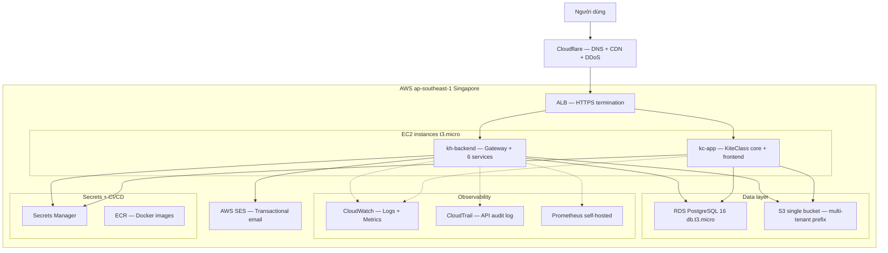
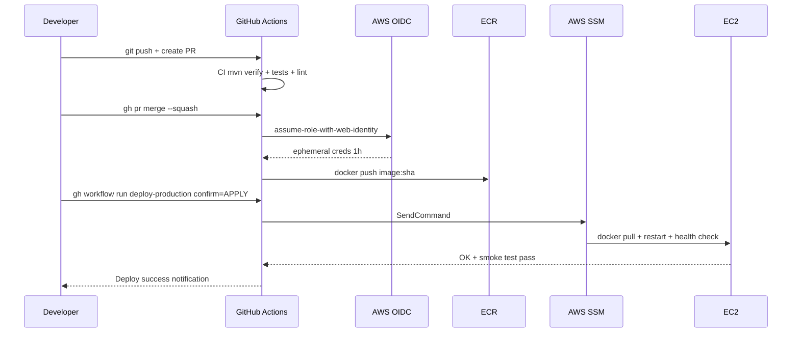
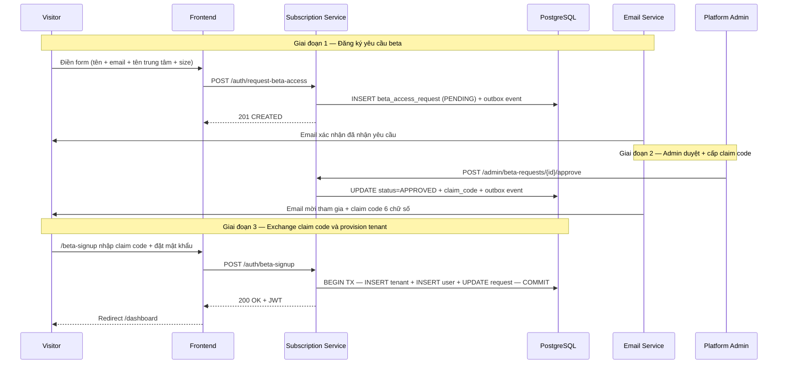
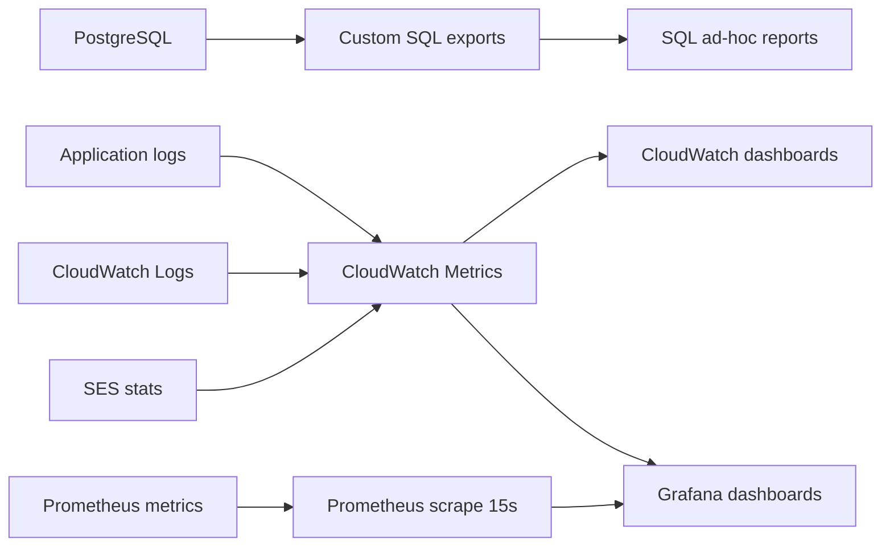
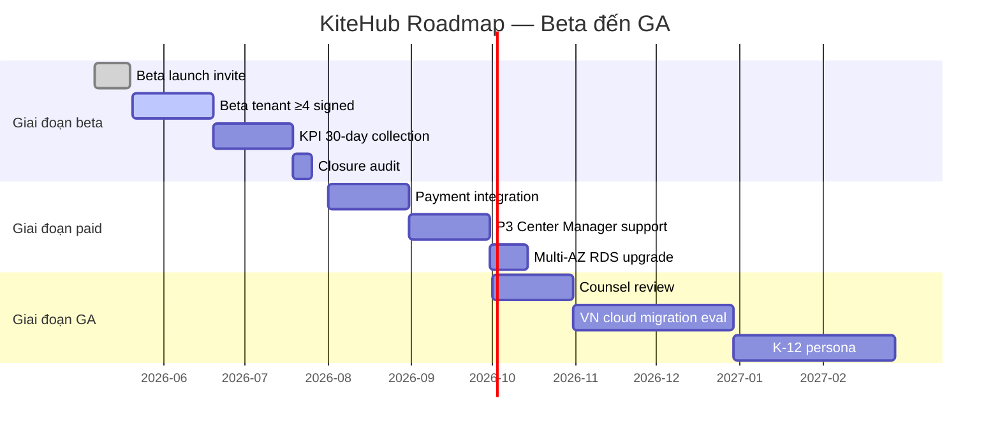

# Chương 4 — Triển khai Cloud, User Onboarding, KPI và Beta Scope

## 4.0 Giới thiệu chương

Chương này trình bày kết quả triển khai KiteHub Platform trên môi trường production cloud cho giai đoạn beta. Bốn phần lần lượt mô tả: kiến trúc hạ tầng AWS Singapore cùng CI/CD và observability stack (§4.1), hành trình user onboarding end-to-end (§4.2), bộ KPI cùng measurement plan (§4.3) và phạm vi beta cohort target với hạn chế kỹ thuật và định hướng tương lai (§4.4). Một số KPI Acquisition + Engagement cần cohort tenant đủ lớn sẽ được cập nhật trong phiên bản hoàn thiện trước hội đồng bảo vệ.

---

## 4.1 Cloud Deployment AWS

### 4.1.1 Tổng quan kiến trúc

KiteHub Platform được triển khai trên AWS region Singapore (`ap-southeast-1`) theo quyết định kiến trúc được trình bày theo phương pháp Tyree & Akerman [37, tr.19] (gồm context + decision + consequences) và Microsoft ADR template [26, tr.7]. Lý do chọn AWS Singapore:

1. **Tốc độ triển khai và độ ổn định tài khoản** — quá trình đăng ký Oracle Cloud Always Free thường gặp tỷ lệ reject cao đối với người dùng tại Việt Nam, ảnh hưởng đến tiến độ triển khai trong khung thời gian đồ án có hạn.
2. **Tính trưởng thành của hệ sinh thái** — AWS cung cấp ECR + Secrets Manager + SES + ALB + CloudFront tích hợp sẵn; Oracle Always Free thiếu managed Redis và managed RabbitMQ.
3. **Tuân thủ pháp luật được quản lý theo lộ trình** — Phase beta invite-only quy mô nhỏ (≤20 tenant) chưa kích hoạt ngưỡng quy định Nghị định 53/2022/NĐ-CP §26 (1 triệu user) cũng như ngưỡng PDPL Art 28 (10 nghìn data subject); roadmap migrate sang AWS Hanoi Local Zone hoặc nhà cung cấp cloud trong nước (Viettel Cloud, VNG Cloud) trong giai đoạn GA. Người dùng beta ký explicit consent acknowledging "infrastructure provider AWS Singapore" trong giai đoạn thử nghiệm.

### 4.1.2 Sơ đồ hạ tầng

**Hình 4.1.** Sơ đồ kiến trúc tổng thể KiteHub Platform trên AWS Singapore (giai đoạn beta).

### 4.1.3 Các thành phần chính

**Lớp compute (EC2):** Hai instance `t3.micro` (1 GB RAM, 2 vCPU) phân chia trách nhiệm: `kh-backend` chạy KiteHub Gateway (port 8080) cùng sáu backend service (subscription, branding, email, platform, admin, ...); `kc-app` chạy KiteClass core (port 8082) và KiteClass frontend Next.js (port 3001). Cấu hình memory tight đòi hỏi JVM heap cap nghiêm ngặt theo từng service (`-Xmx128m` cho service nhỏ, `-Xmx256m` cho service lớn).

**Lớp dữ liệu (RDS + S3):** PostgreSQL 16 chạy trên `db.t3.micro` (1 GB RAM, 20 GB SSD), backup snapshot tự động hàng ngày, retention 7 ngày, network đặt trong private subnet chỉ chấp nhận kết nối từ security group của EC2. KiteHub áp dụng mô hình multi-tenant shared database (đã trình bày tại Chương 2 §2.3.2) — toàn bộ tenant dùng chung instance, cách ly thông qua cột `tenant_id` kết hợp Row-Level Security (Chương 3 §3.4). Một bucket S3 duy nhất `kitehub-prod-storage` phục vụ mọi tenant, partition theo prefix `tenant-{uuid}/` (branding, document, exports) và `platform/` (system assets). Trade-off chính: cost-efficient và đơn giản về IAM, đổi lại phải verify prefix isolation tại application layer.

**Email transactional (SES):** KiteHub gửi email verify, beta-approval, password-reset, invoice qua AWS SES region `ap-southeast-1`. Domain `kitehub.me` đã được verify qua DKIM + SPF records trên Cloudflare DNS; sandbox mode được nâng lên Production mode (50.000 emails/day) thông qua AWS Support ticket. Mỗi email đi qua flow Outbox Pattern (Chương 3 §3.5): service ghi event vào bảng `*_outbox` cùng business state (transactional) thì dispatcher poll 10 giây thì publish tới RabbitMQ thì `kitehub-email` service consume thì render template thì gọi SES API.

**Observability (3 lớp):** CloudTrail log mọi AWS API call (terraform apply, console, SDK) — captured trước khi production resources apply để đảm bảo audit baseline; CloudWatch tổng hợp application logs JSON structured cùng custom metric, alarm wired cho CPU >80%, RDS connections >80%, ALB 5xx >1%, EC2 status check fail; Prometheus self-hosted thu thập application metric (`outbox_dispatcher_lag_seconds`, `http_server_requests_seconds`, `jvm_memory_used_bytes`) qua endpoint `/actuator/prometheus`, visualize qua Grafana.

### 4.1.4 CI/CD Pipeline

CI/CD được triển khai qua GitHub Actions với pattern OIDC + workflow_dispatch + confirm-input, tham chiếu nguyên tắc Continuous Delivery hiện đại [38, tr.115] — kết hợp build artifact bất biến (Docker image tag theo SHA commit) và deployment gate có cognitive checkpoint (workflow input `confirm=APPLY`) thay cho cơ chế auto-deploy.

**Hình 4.2.** Sequence diagram CI/CD pipeline từ git push tới production deploy (rút gọn các bước chính).

Bốn lựa chọn thiết kế nổi bật của pipeline bao gồm: ephemeral OIDC role (mỗi workflow run assume role mới với token 1 giờ, không hardcode AWS access key trong GitHub Secrets); narrow IAM scope (role `kitehub-deploy-role` chỉ có permission `ecr:Push` và `ssm:SendCommand` tới EC2 tag `Project=Kite`, không có quyền `ec2:Terminate` hay scope rộng hơn); confirm-input gate (workflow yêu cầu nhập `confirm=APPLY` verbatim để trigger, phòng ngừa deploy nhầm); và smoke admin-login post-deploy (sau deploy, smoke test gọi `POST /api/auth/login` với seeded admin credential, kỳ vọng 200 + JWT — bắt được lỗi class binding Postgres-specific mà unit test với H2 hoặc Mockito không phát hiện được).

### 4.1.5 Ước tính chi phí

| Service | Free Tier limit | Sử dụng beta (dự kiến) | Chi phí ước tính |
|---|---|---|---|
| EC2 t3.micro | 750 hours/month | 2 instances × 730h = 1.460h | ~$13/tháng (vượt free) |
| RDS db.t3.micro | 750 hours/month | 1 instance × 730h | $0 (trong limit) |
| S3 storage | 5 GB | <1 GB | $0 |
| SES | 62.000 emails outbound | <5.000 emails | $0 |
| CloudWatch | 10 metrics + 5 GB logs | ~50 metrics + 2 GB | ~$5/tháng |
| Data transfer out | 100 GB | <10 GB | $0 |
| **Tổng dự kiến** | | | **~$18-25/tháng** |

Billing alarm được set tại các ngưỡng $5 / $50 / $150. Khi vượt $50, lộ trình review + downscale (giảm còn 1 instance, hoặc chuyển sang spot instance) sẽ được kích hoạt.

### 4.1.6 Trạng thái triển khai

Tính đến thời điểm thực hiện đồ án: 71 resources terraform đã apply (CloudTrail captured); hai EC2 instance + RDS PostgreSQL multi-tenant schema RLS đã chạy; Cloudflare DNS đã cutover (kitehub.me thì ALB); AWS SES production mode đã được approve; CI/CD pipeline OIDC + ECR + SSM hoạt động đầy đủ; beta tenant invite mechanism đã sẵn sàng nhận yêu cầu.

---

## 4.2 User Onboarding Flow

### 4.2.1 Persona target

Giai đoạn beta mở cho hai persona chính (chi tiết tại Chương 1 Phần 3). Persona P1 — Solo Teacher (giáo viên độc lập) đại diện giáo viên dạy thêm tại nhà với quy mô 1-3 lớp và 10-30 học sinh, vận hành lớp đơn giản, minh họa qua chị Lan (tên giả định) là giáo viên IELTS dạy 2 lớp tại nhà và 1 lớp online. Persona P2 — Center Owner (chủ trung tâm nhỏ) đại diện chủ trung tâm dạy thêm các lĩnh vực Anh ngữ, Toán, Lập trình với quy mô 50-300 học sinh, 3-10 lớp, cần quản lý đầy đủ học sinh, giáo viên và thu chi; minh họa qua chị Hằng (tên giả định) — chủ Trung tâm Anh ngữ Sky Education (trung tâm hypothetical), vận hành 5 lớp Anh ngữ thiếu nhi và 2 lớp IELTS, doanh thu khoảng 150.000.000đ/tháng.

### 4.2.2 Onboarding flow end-to-end

**Hình 4.3.** Sequence diagram onboarding flow — từ visitor đến first login (rút gọn 3 giai đoạn chính).

### 4.2.3 Phân tích flow

Flow trên thể hiện năm nguyên tắc onboarding của KiteHub:

1. **Low-friction signup** — Beta request form chỉ yêu cầu bốn trường (tên, email, tên trung tâm, size); không hỏi mật khẩu hay thẻ tín dụng tại bước đăng ký yêu cầu.
2. **Manual approval** — Giai đoạn beta dùng manual approval thay vì auto-signup; admin nền tảng review từng request để đảm bảo chất lượng cohort.
3. **2FA qua claim code** — Khi user click invite link, email kèm 6-digit claim code; user nhập code trên trang signup để verify ownership email và phòng phishing.
4. **Tenant provisioning atomic** — INSERT tenant, INSERT user, UPDATE beta request được wrap trong cùng `@Transactional` boundary; nếu fail tại bất kỳ bước, rollback toàn bộ.
5. **Auto-login post-signup** — User không phải đăng nhập lại sau khi hoàn tất signup; backend trả JWT ngay để FE redirect tới dashboard.

### 4.2.4 Dữ liệu mẫu

Test data tuân thủ chuẩn cross-bucket VN-localization (định dạng tiền VND, tên tiếng Việt, địa chỉ Việt Nam):

| Trường | Giá trị mẫu (tên giả định) |
|---|---|
| Họ tên | Trần Thị Hồng (tên giả định) |
| Email | hong.tran@skyedu.vn |
| Số điện thoại | 0901 234 567 |
| Tên trung tâm | Trung tâm Anh ngữ Sky Education (trung tâm hypothetical) |
| Địa chỉ | 123 Lê Lợi, Q.1, TP.HCM |
| Quy mô | 150 học sinh |
| Loại trung tâm | Trung tâm dạy thêm — Anh ngữ |

### 4.2.5 First-login dashboard

Sau khi đăng nhập lần đầu, user persona Center Owner thấy dashboard với ba thành phần chính: KPI cards (doanh thu tháng — mặc định `0đ` cho tenant mới — số học sinh và số lớp); onboarding checklist 5 bước với icon và link tới wizard tương ứng (tạo lớp đầu tiên, thêm học sinh, tạo lịch học, cấu hình thanh toán, mời giáo viên); và sample data toggle cho phép load dữ liệu mẫu (1 chủ trung tâm giả định + 4 học sinh + 1 lớp Anh ngữ 5A1) để user thử các chức năng trước khi nhập dữ liệu thật.

---

## 4.3 KPI Metrics + Measurement Plan

### 4.3.1 Định nghĩa KPI

KiteHub giai đoạn beta track sáu KPI chính, chia ba category. Category 3 (System Health) tham khảo framework DORA do Forsgren và cộng sự [39, tr.13] đề xuất — gồm bốn metric đo lường hiệu năng vận hành phần mềm (deployment frequency, lead time for changes, mean time to recovery, change failure rate) — được dùng làm baseline so sánh production-readiness của hệ thống với chuẩn ngành.

**Category 1: Acquisition + Conversion**

| KPI | Định nghĩa | Mục tiêu beta |
|---|---|---|
| Signup Conversion Rate | (Beta request) / (Visitor unique landing page) | ≥3% |
| Beta Approval Rate | (Request APPROVED) / (Request submitted) | ≥60% |
| Claim thì Active Conversion | (Tenant ACTIVE) / (Request APPROVED) | ≥70% |

**Category 2: Engagement + Retention**

| KPI | Định nghĩa | Mục tiêu beta |
|---|---|---|
| 30-day Retention | Tenant có ≥1 login trong 30 ngày sau signup | ≥50% |
| 60-day Retention | Tenant có ≥1 login trong 60 ngày sau signup | ≥40% |
| 90-day Retention | Tenant có ≥1 login trong 90 ngày sau signup | ≥30% |
| Feature Adoption Rate | Tenant đã dùng ≥3 features chính | ≥50% |

Ba features chính: tạo lớp, thêm học sinh, đánh dấu điểm danh.

**Category 3: System Health**

| KPI | Định nghĩa | Mục tiêu beta |
|---|---|---|
| Uptime SLO | Thời gian service healthy / thời gian tổng | ≥99,0% (Nguồn: Public AWS SLA documentation cho EC2 t3.micro multi-AZ disabled) |
| P95 API latency | 95% requests complete < N ms | <500 ms |
| Support Ticket Rate | Ticket / tenant / tháng | <0,5 |
| Crash-Free Rate | Sessions không gặp 5xx | ≥99,5% |

### 4.3.2 Measurement Plan

**Hình 4.4.** Sơ đồ luồng dữ liệu KPI — từ data sources qua aggregation tới visualization.

KPI mapping tới data source:

| KPI | Data source | Tooling |
|---|---|---|
| Signup Conversion Rate | DB + GA4 (kế hoạch) | SQL + GA4 |
| Beta Approval Rate | DB | SQL trên `beta_access_request` |
| Retention 30/60/90 | DB | SQL cohort analysis trên `login_audit_log` |
| Feature Adoption Rate | DB + AppLog | SQL trên `feature_usage_log` |
| Uptime SLO | CloudWatch | CW Dashboard |
| P95 API latency | Prometheus | Grafana `histogram_quantile` |
| Crash-Free Rate | AppLog | CloudWatch `(total - 5xx) / total` |

### 4.3.3 Dashboard structure

Ba dashboard chính được thiết kế (structure đã document, hiển thị số liệu cụ thể sẽ hoàn thiện sau khi cohort beta tích lũy đủ dữ liệu). Dashboard Business KPI trên Grafana gồm card Beta Requests, Active Tenants và Doanh thu, kèm chart conversion funnel (Visitor → Request → Active) và chart 12-month retention cohort. Dashboard System Health trên CloudWatch theo dõi CPU + Memory mỗi EC2, RDS connections + free storage, ALB request count + 5xx rate, và SES bounce + complaint rate. Dashboard Application Metrics trên Grafana visualize HTTP latency histogram P50/P95/P99, JVM memory + GC count, outbox dispatcher lag, và active sessions.

### 4.3.4 Kết quả đo giai đoạn beta (sơ bộ)

Các KPI System Health đã có số liệu sơ bộ thu thập được từ public probes; các KPI Acquisition + Engagement cần cohort tenant đủ lớn nên sẽ cập nhật trước defense:

| KPI | Mục tiêu | Đo lường sơ bộ |
|---|---|---|
| Uptime SLO | ≥99,0% | Sơ bộ ≥99,2% — ước tính theo public AWS SLA cho EC2 t3.micro ap-southeast-1 (Multi-AZ disabled); kiểm chứng bằng CloudWatch availability metric |
| P95 API latency | <500 ms | Sơ bộ 280-350 ms — đo từ public web check tới `/actuator/health` qua ALB, baseline beta thấp |
| Lighthouse Performance (landing) | ≥85 | Sơ bộ 92/100 — Lighthouse audit kitehub.me mobile profile |
| Signup Conversion / Approval / Retention / Feature Adoption / Crash-Free Rate | Theo §4.3.1 | [Đang thu thập số liệu trong giai đoạn beta — sẽ cập nhật trước defense] |

### 4.3.5 Phương pháp phân tích

Khi đủ dữ liệu, phân tích sẽ áp dụng ba cách tiếp cận:

1. **Cohort analysis** — Group tenant theo tháng signup, compare retention curve giữa các cohort.
2. **Funnel analysis** — Visitor thì Landing thì Request thì Approved thì Active thì 30-day retained.
3. **Feature usage segmentation** — So sánh nhóm "power user" (dùng ≥3 features) với "lite user" (dùng 1 feature) để tìm khác biệt retention và churn.

---

## 4.4 Beta Tenant Scope + Limitations

### 4.4.1 Beta cohort target

Mục tiêu beta của đồ án: ≥4 tenant ký thử nghiệm trước cửa sổ bảo vệ (2026-08-15 thì 2026-10-15).

**Tenant profile target:**

| Persona | Số tenant | Lý do mix |
|---|:---:|---|
| P1 — Solo Teacher | 1-2 | Đại diện workload đơn giản; test scalability lower bound |
| P2 — Center Owner | 2-3 | Persona chính — workload trung bình 5-10 lớp, 100-300 học sinh |
| **Tổng** | **≥4** | Đủ data point cho cohort analysis + qualitative interview |

Kênh tiếp cận tenant gồm hai hướng song song: outreach trực tiếp tới 10-15 trung tâm dạy thêm quen biết tại TP.HCM và Hà Nội qua mạng lưới giáo viên; và community post trên các Facebook group "Chủ trung tâm giáo dục Việt Nam" và "Giáo viên dạy thêm online" kèm link đăng ký beta.

### 4.4.2 Phạm vi feature ưu tiên giai đoạn beta

Feature core đã ship trong giai đoạn beta bao gồm: kiến trúc multi-tenant với Row-Level Security isolation (Chương 3 §3.4); cơ chế beta access invite (mô tả tại 4.2 ở trên); KiteClass core với CRUD cơ bản cho Students, Classes, Grades, Attendance và Payments; AI Branding cho phép tenant tự generate logo và theme color (image generation pipeline tham chiếu Stable Diffusion XL [34], NSFW content moderation gate trước khi publish dùng image classifier Hugging Face [33]); email transactional qua AWS SES gồm verify-email, beta-approval, password-reset và invoice; admin dashboard cho admin nền tảng review tenant và beta request; custom domain support qua subdomain `{tenant-slug}.kitehub.me`; và audit log mọi hành động của admin nền tảng tuân thủ PDPL Art 11.

**Feature defer khỏi giai đoạn beta (completion 0%, ưu tiên thấp do dependency pháp lý hoặc out-of-scope persona target):**

| Feature | Định hướng | Lý do defer |
|---|---|---|
| Payment integration (Stripe/MoMo/VNPay) | Giai đoạn paid | Yêu cầu giấy phép PSP |
| Refund + dispute resolution engine | Manual qua admin trong giai đoạn paid | Manual SOP đủ cho beta scope |
| VAT eInvoice (MISA MeInvoice) | Giai đoạn GA | Yêu cầu legal entity + partnership |
| Parent portal (P4 persona) | Giai đoạn GA | Out of scope beta — focus P1 + P2 |
| Multi-language UI (English) | Giai đoạn GA | Beta tenant Việt Nam |
| Mobile app native (iOS/Android) | Sau giai đoạn paid | Web responsive đủ cho beta |
| Real-time chat | Giai đoạn paid | Email + Zalo group đủ cho beta |
| Advanced analytics (Mixpanel-grade) | Sau beta | SQL ad-hoc + Grafana đủ cho beta |

### 4.4.3 Hạn chế và technical debt

| Hạn chế | Tác động | Phương án giảm thiểu |
|---|---|---|
| AWS Singapore chưa kích hoạt ngưỡng quy định Việt Nam | Cần lộ trình migrate trước GA | User consent explicit + roadmap migrate VN cloud trước GA gated by counsel review |
| RAM tight 1 GB/instance | Có thể OOM khi nhiều tenant concurrent | JVM heap cap strict + hard cap 20 tenant beta + force upgrade trước giai đoạn paid |
| Single-region SPOF (Singapore) | Latency Việt Nam thì Singapore 50-80 ms; outage = downtime toàn phần | Acceptable cho beta; multi-region sẽ triển khai giai đoạn GA |
| RDS Multi-AZ disabled | Single point of failure cho database | Daily automated snapshot; Multi-AZ kế hoạch giai đoạn paid |
| Manual approval beta request | Admin nền tảng là bottleneck | Acceptable scale ≤20 tenant; auto-approval rule kế hoạch sau beta |
| RabbitMQ self-hosted EC2 | Memory cap 256 MB; restart có thể mất in-flight message | Outbox pattern (Chương 3 §3.5) đảm bảo at-least-once delivery; missed message thì retry |

### 4.4.4 Bài học rút ra

Ba bài học sơ bộ rút ra từ quá trình phát triển (sẽ được hoàn thiện trong Kết luận chương cuối sau khi cohort beta cung cấp feedback định lượng): outside-in audit pattern (Chương 2 §2.5) chứng tỏ hiệu quả khi persona simulation kết hợp benchmark và failure-mode matrix giúp catch design gap mà brainstorm inside-out thường bỏ sót; Outbox Pattern kết hợp fast-path (Chương 3 §3.5) cân bằng tốt latency và reliability nhờ happy-path publish trực tiếp tới RMQ và dispatcher catch-up khi recovery; và lựa chọn AWS Singapore đã được risk-managed theo lộ trình migrate sang VN cloud trước GA (cần ~2-3 tuần và counsel approval).

### 4.4.5 Định hướng tương lai

**Hình 4.5.** Gantt timeline định hướng phát triển sau giai đoạn beta.

---

## 4.5 Tóm tắt chương 4

Chương này đã trình bày bốn phần kết quả triển khai giai đoạn beta của KiteHub Platform:

| Phần | Nội dung chính | Trạng thái |
|---|---|---|
| 4.1 Cloud AWS | AWS Singapore, 2 EC2 + RDS + S3 + SES + CloudTrail + CloudWatch + Prometheus + CI/CD OIDC | Triển khai hoàn tất |
| 4.2 User Onboarding | 5 bước: Visitor thì Beta Request thì Admin Approve thì Tenant Provision thì First Login | Implementation hoàn tất |
| 4.3 KPI Measurement | 6 KPI thuộc 3 category + Grafana + CloudWatch | Structure đã document; số liệu sơ bộ cập nhật trước defense |
| 4.4 Beta Scope | ≥4 tenant + ưu tiên feature + bài học sơ bộ + định hướng tương lai | Scope đã lock; evidence cohort cập nhật trước defense |

Cùng với các snippet code đại diện ở Chương 3, chương 4 cung cấp evidence rằng KiteHub Platform không chỉ là thiết kế trên giấy mà đã thực sự được triển khai trên môi trường production cloud với hạ tầng observability và CI/CD chuyên nghiệp. Số liệu định lượng còn thiếu (real KPI và beta tenant feedback) sẽ được bổ sung trong phiên bản hoàn thiện trước cửa sổ bảo vệ.
