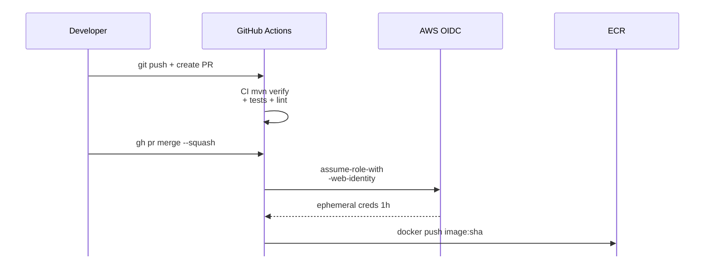
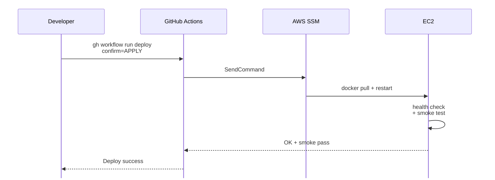

# Chương 4 — Triển khai Cloud, Kết quả tương tác end-user, KPI và Beta Scope

## 4.1 Cloud Deployment AWS

### 4.1.1 Tổng quan kiến trúc

KiteHub Platform được triển khai trên AWS region Singapore (`ap-southeast-1`) theo quyết định kiến trúc được trình bày theo phương pháp Tyree & Akerman [36, tr.19] (gồm context + decision + consequences) và Microsoft ADR template [25, tr.7]. Lý do chọn AWS Singapore:

1. **Tốc độ triển khai và độ ổn định tài khoản** — quá trình đăng ký Oracle Cloud Always Free thường gặp tỷ lệ reject cao đối với người dùng tại Việt Nam, ảnh hưởng đến tiến độ triển khai trong khung thời gian đồ án có hạn.
2. **Tính trưởng thành của hệ sinh thái** — AWS cung cấp ECR + Secrets Manager + SES + ALB + CloudFront tích hợp sẵn; Oracle Always Free thiếu managed Redis và managed RabbitMQ.
3. **Tuân thủ pháp luật được quản lý theo lộ trình** — Giai đoạn thử nghiệm invite-only quy mô nhỏ (≤20 tenant) chưa kích hoạt ngưỡng quy định Nghị định 53/2022/NĐ-CP §26 (1 triệu user) cũng như ngưỡng PDPL Art 28 (10 nghìn data subject); roadmap migrate sang AWS Hanoi Local Zone hoặc nhà cung cấp cloud trong nước (Viettel Cloud, VNG Cloud) trong giai đoạn vận hành chính thức. Người dùng thử nghiệm ký explicit consent acknowledging "infrastructure provider AWS Singapore" trong giai đoạn thử nghiệm.

### 4.1.2 Sơ đồ hạ tầng

```plantuml
@startuml
!define AWSPuml https://raw.githubusercontent.com/awslabs/aws-icons-for-plantuml/v18.0/dist
!include AWSPuml/AWSCommon.puml
!include AWSPuml/AWSSimplified.puml
!include AWSPuml/Compute/EC2.puml
!include AWSPuml/Database/RDS.puml
!include AWSPuml/NetworkingContentDelivery/ElasticLoadBalancing.puml
!include AWSPuml/Groups/AWSCloud.puml
!include AWSPuml/Groups/VPC.puml
!include AWSPuml/Groups/AvailabilityZone.puml
!include AWSPuml/Groups/PublicSubnet.puml
!include AWSPuml/Groups/PrivateSubnet.puml
!include <logos/cloudflare>

skinparam dpi 150
skinparam defaultFontSize 28
skinparam defaultFontName Arial
skinparam ArrowFontSize 22
skinparam ArrowColor #232F3E
skinparam ArrowThickness 2
skinparam ranksep 70
skinparam nodesep 90

actor "Người dùng" as User
rectangle "<$cloudflare>\nCloudflare\nDNS + CDN + DDoS" as CF

AWSCloudGroup(aws, "AWS Region ap-southeast-1") {
  VPCGroup(vpc, "VPC 10.0.0.0/16") {
    AvailabilityZoneGroup(az1, "AZ-1a") {
      PublicSubnetGroup(pub1, "Public Subnet") {
        ElasticLoadBalancing(ALB, "ALB", "HTTPS + TLS 1.3")
        EC2(EC2_KH, "kh-backend", "t3.micro")
        EC2(EC2_KC, "kc-app", "t3.micro")
      }
      PrivateSubnetGroup(prv1, "Private Subnet") {
        RDS(DB, "RDS PG 16", "db.t3.micro + RLS")
      }
    }
  }
}

User --> CF
CF --> ALB
ALB --> EC2_KH
ALB --> EC2_KC
EC2_KH --> DB
EC2_KC --> DB
@enduml
```

**Hình 4.1a.** Topology mạng VPC (CIDR 10.0.0.0/16): public subnet chứa ALB + EC2, private subnet cô lập RDS.

```plantuml
@startuml
!define AWSPuml https://raw.githubusercontent.com/awslabs/aws-icons-for-plantuml/v18.0/dist
!include AWSPuml/AWSCommon.puml
!include AWSPuml/AWSSimplified.puml
!include AWSPuml/Compute/EC2.puml
!include AWSPuml/Storage/SimpleStorageService.puml
!include AWSPuml/SecurityIdentityCompliance/SecretsManager.puml
!include AWSPuml/Containers/ElasticContainerRegistry.puml
!include AWSPuml/BusinessApplications/SimpleEmailService.puml
!include AWSPuml/ManagementGovernance/CloudWatch.puml
!include AWSPuml/Groups/AWSCloud.puml

skinparam dpi 150
skinparam defaultFontSize 28
skinparam defaultFontName Arial
skinparam ArrowFontSize 22
skinparam ArrowColor #232F3E
skinparam ArrowThickness 2
skinparam ranksep 80
skinparam nodesep 90

AWSCloudGroup(aws, "AWS Region ap-southeast-1") {
  EC2(EC2_KH, "kh-backend", "EC2")
  EC2(EC2_KC, "kc-app", "EC2")
  SimpleStorageService(S3, "S3", "multi-tenant")
  SimpleEmailService(SES, "SES", "Transactional")
  SecretsManager(SM, "Secrets Manager", "JWT + DB")
  ElasticContainerRegistry(ECR, "ECR", "Docker images")
  CloudWatch(CW, "CloudWatch", "Logs + Metrics")
}

ECR --> EC2_KH : pull
ECR --> EC2_KC : pull
EC2_KH --> S3
EC2_KC --> S3
EC2_KH --> SES
EC2_KH ..> SM
EC2_KC ..> SM
EC2_KH ..> CW
EC2_KC ..> CW
@enduml
```

**Hình 4.1b.** Các dịch vụ AWS phụ trợ — EC2 truy cập S3, SES, Secrets Manager, ECR, CloudWatch.

Toàn bộ hạ tầng đặt trong một VPC riêng (CIDR `10.0.0.0/16`) với hai tầng subnet phục vụ mục đích bảo mật khác nhau: **public subnets** (2 vùng khả dụng AZ-1a + AZ-1b) chứa Application Load Balancer + EC2 instances có public IP để nhận traffic từ Internet Gateway; **private subnets** (2 AZ tương ứng — yêu cầu tối thiểu của RDS DB subnet group) chứa RDS PostgreSQL không có public IP, chỉ chấp nhận kết nối từ security group của EC2 trong cùng VPC. Internet Gateway gắn vào VPC làm điểm vào duy nhất cho traffic ingress từ Cloudflare. NAT Gateway disable mặc định ở giai đoạn thử nghiệm để tiết kiệm chi phí (~30 USD/tháng); EC2 instances trong public subnet truy cập internet trực tiếp qua IGW.

### 4.1.3 Các thành phần chính

**Lớp compute (EC2):** Hai instance `t3.micro` (1 GB RAM, 2 vCPU) phân chia trách nhiệm: `kh-backend` chạy KiteHub Gateway (port 8080) cùng sáu backend service (subscription, branding, email, platform, admin, ...); `kc-app` chạy KiteClass core (port 8082) và KiteClass frontend Next.js (port 3001). Cấu hình memory tight đòi hỏi JVM heap cap nghiêm ngặt theo từng service (`-Xmx128m` cho service nhỏ, `-Xmx256m` cho service lớn).

**Lớp dữ liệu (RDS + S3):** PostgreSQL 16 chạy trên `db.t3.micro` (1 GB RAM, 20 GB SSD), backup snapshot tự động hàng ngày, retention 7 ngày, network đặt trong private subnet chỉ chấp nhận kết nối từ security group của EC2. KiteHub áp dụng mô hình multi-tenant shared database (đã trình bày tại Chương 2 §2.3.2) — toàn bộ tenant dùng chung instance, cách ly thông qua cột `tenant_id` kết hợp Row-Level Security (Chương 2 §2.3.4). Một bucket S3 duy nhất `kitehub-prod-storage` phục vụ mọi tenant, partition theo prefix `tenant-{uuid}/` (branding, document, exports) và `platform/` (system assets). Trade-off chính: cost-efficient và đơn giản về IAM, đổi lại phải verify prefix isolation tại application layer.

**Email transactional (SES):** KiteHub gửi email verify, beta-approval, password-reset, invoice qua AWS SES region `ap-southeast-1`. Domain `kitehub.me` đã được verify qua DKIM + SPF records trên Cloudflare DNS; sandbox mode được nâng lên Production mode (50.000 emails/day) thông qua AWS Support ticket. Mỗi email đi qua flow Outbox Pattern: service ghi event vào bảng `*_outbox` cùng business state (transactional) thì dispatcher poll 10 giây thì publish tới RabbitMQ thì `kitehub-email` service consume thì render template thì gọi SES API.

**Observability (3 lớp):** CloudTrail log mọi AWS API call (terraform apply, console, SDK) — captured trước khi production resources apply để đảm bảo audit baseline; CloudWatch tổng hợp application logs JSON structured cùng custom metric, alarm wired cho CPU >80%, RDS connections >80%, ALB 5xx >1%, EC2 status check fail; Prometheus self-hosted thu thập application metric (`outbox_dispatcher_lag_seconds`, `http_server_requests_seconds`, `jvm_memory_used_bytes`) qua endpoint `/actuator/prometheus`, visualize qua Grafana.

### 4.1.4 CI/CD Pipeline

CI/CD được triển khai qua GitHub Actions với pattern OIDC + workflow_dispatch + confirm-input, tham chiếu nguyên tắc Continuous Delivery hiện đại [37, tr.115] — kết hợp build artifact bất biến (Docker image tag theo SHA commit) và deployment gate có cognitive checkpoint (workflow input `confirm=APPLY`) thay cho cơ chế auto-deploy.



**Hình 4.2a.** Pha build — CI verify, OIDC role assume, Docker image push tới ECR.



**Hình 4.2b.** Pha deploy — confirm-input gate, SSM SendCommand kích hoạt EC2 pull image + restart + smoke test.

Bốn lựa chọn thiết kế nổi bật của pipeline bao gồm: ephemeral OIDC role (mỗi workflow run assume role mới với token 1 giờ, không hardcode AWS access key trong GitHub Secrets); narrow IAM scope (role `kitehub-deploy-role` chỉ có permission `ecr:Push` và `ssm:SendCommand` tới EC2 tag `Project=Kite`, không có quyền `ec2:Terminate` hay scope rộng hơn); confirm-input gate (workflow yêu cầu nhập `confirm=APPLY` verbatim để trigger, phòng ngừa deploy nhầm); và smoke admin-login post-deploy (sau deploy, smoke test gọi `POST /api/auth/login` với seeded admin credential, kỳ vọng 200 + JWT — bắt được lỗi class binding Postgres-specific mà unit test với H2 hoặc Mockito không phát hiện được).

### 4.1.5 Ước tính chi phí

| Service | Free Tier limit | Sử dụng beta (dự kiến) | Chi phí ước tính |
|---|---|---|---|
| EC2 t3.micro | 750 hours/month | 2 instances × 730h = 1.460h | ~$7,38/tháng (710h vượt free × 0,0104 USD/h) |
| RDS db.t3.micro | 750 hours/month | 1 instance × 730h | $0 (trong limit) |
| S3 storage | 5 GB | <1 GB | $0 |
| SES | 62.000 emails outbound | <5.000 emails | $0 |
| CloudWatch | 10 metrics + 5 GB logs | ~50 metrics + 2 GB | ~$5/tháng |
| Data transfer out | 100 GB | <10 GB | $0 |
| **Tổng dự kiến** | | | **~$12-15/tháng** |

Chi phí EC2 t3.micro được tính chi tiết như sau: hai instance chạy liên tục 24/7 ứng với 2 × 730 giờ = 1.460 giờ/tháng. AWS Free Tier cung cấp 750 giờ EC2 t3.micro/tháng, do đó phần vượt là 1.460 − 750 = 710 giờ. Với đơn giá 0,0104 USD/giờ, chi phí EC2 thực tế khoảng 710 × 0,0104 = 7,38 USD/tháng. Billing alarm được set tại các ngưỡng $5 / $50 / $150. Khi vượt $50, lộ trình review + downscale (giảm còn 1 instance, hoặc chuyển sang spot instance) sẽ được kích hoạt.

### 4.1.6 Cấu hình Cloudflare biên

Cloudflare đảm nhận lớp biên (edge) phía trước hạ tầng AWS, cung cấp bốn nhóm chức năng: phân giải tên miền (DNS), proxy bảo vệ, mã hóa truyền tải (SSL/TLS) và định tuyến thư điện tử. Toàn bộ lưu lượng từ Internet đi qua Cloudflare trước khi tới Application Load Balancer, nhờ đó địa chỉ IP gốc của hạ tầng AWS không lộ ra ngoài.

Bảng 4.1 liệt kê các bản ghi DNS chính được cấu hình cho tên miền `kitehub.me`.

| Loại bản ghi | Tên | Giá trị | Proxy | Mục đích |
|---|---|---|---|---|
| A | `kitehub.me` | IP của ALB | Bật (proxied) | Trỏ tên miền gốc tới load balancer |
| CNAME | `www` | `kitehub.me` | Bật (proxied) | Chuyển hướng www về apex |
| CNAME | `*` (wildcard) | `kitehub.me` | Bật (proxied) | Định tuyến subdomain mỗi tenant `{slug}.kitehub.me` |
| TXT | `kitehub.me` | SPF record | Không | Xác thực nguồn gửi email |
| TXT | `_dmarc` | DMARC policy | Không | Chính sách chống giả mạo email |
| CNAME | `*._domainkey` | DKIM (AWS SES) | Không | Khóa ký số DKIM cho email |

**Bảng 4.1.** Các bản ghi DNS chính trên Cloudflare cho tên miền `kitehub.me`.

Chế độ proxy (biểu tượng đám mây cam) được bật cho các bản ghi phục vụ lưu lượng web, qua đó kích hoạt đồng thời ba lớp bảo vệ: chống tấn công từ chối dịch vụ phân tán (DDoS — Distributed Denial of Service) ở mức L3/L4/L7, tường lửa ứng dụng web (WAF — Web Application Firewall) với bộ luật quản lý sẵn, và bộ nhớ đệm tĩnh (CDN) giảm tải cho EC2. Chế độ mã hóa SSL/TLS được đặt ở mức Full (Strict), tức Cloudflare xác minh chứng chỉ hợp lệ ở cả hai chặng — từ trình duyệt tới Cloudflare và từ Cloudflare tới ALB — nhằm loại bỏ rủi ro tấn công xen giữa.

Định tuyến đa tenant ở lớp DNS dựa trên bản ghi wildcard `*.kitehub.me`: mọi subdomain tenant được Cloudflare phân giải về cùng một điểm vào, sau đó gateway phân giải tenant cụ thể theo trường Host như mô tả tại mục 2.2.6. Đối với tên miền riêng của các gói cao cấp, nền tảng dùng dịch vụ Cloudflare for SaaS để tự động cấp chứng chỉ SSL cho từng tenant thông qua cơ chế xác thực quyền kiểm soát tên miền bằng bản ghi CNAME. Ngoài ra, tính năng Email Routing của Cloudflare chuyển tiếp các địa chỉ thư đến `@kitehub.me` về hộp thư vận hành, bổ trợ cho luồng gửi email giao dịch qua AWS SES.

### 4.1.7 Trạng thái triển khai

Tính đến thời điểm thực hiện đồ án: 71 resources terraform đã apply (CloudTrail captured); hai EC2 instance + RDS PostgreSQL multi-tenant schema RLS đã chạy; Cloudflare DNS đã cutover (kitehub.me trỏ về ALB) cùng bản ghi wildcard `*.kitehub.me` cho định tuyến landing đa tenant; cơ chế phân giải Tenant → Domain → Landing (mục 2.2.6) hoạt động trên lớp gateway, được minh chứng qua trang chủ công khai của tenant mẫu Sky Education với giao diện thương hiệu riêng (mục 4.2); AWS SES production mode đã được approve; CI/CD pipeline OIDC + ECR + SSM hoạt động đầy đủ; beta tenant invite mechanism đã sẵn sàng nhận yêu cầu.

---

## 4.2 Kết quả tương tác end-user + minh chứng

[Placeholder — phần này sẽ điền sau khi thu thập feedback từ beta tenants trong giai đoạn launch invite (từ 2026-05-19 trở đi). Nội dung dự kiến:

- Tổng kết các thao tác key đã được end-user thực hiện thành công (đăng ký tenant, cấu hình AI branding, quản lý lớp học, phát hành hóa đơn, theo dõi audit log).
- Trích dẫn feedback xác nhận từ chủ sở hữu trung tâm và quản lý trung tâm về độ phù hợp của hệ thống với quy trình vận hành hiện tại.
- Số liệu sử dụng thực tế (active users, AI branding generations, payment processed) trong cửa sổ 2-4 tuần đầu sau khi mời beta.
- Screenshot minh chứng các luồng nghiệp vụ then chốt đã được tenant ký xác nhận đạt yêu cầu.

Pre-defense: hoàn thiện sau khi đạt ≥3 beta tenants ký xác nhận hoặc cho đến trước cửa sổ bảo vệ 2026-08-15.]

---

