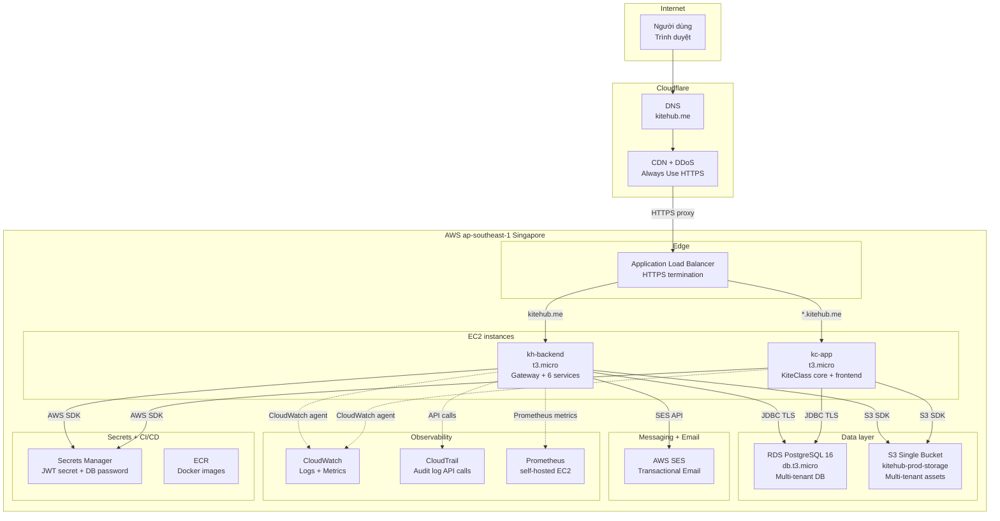
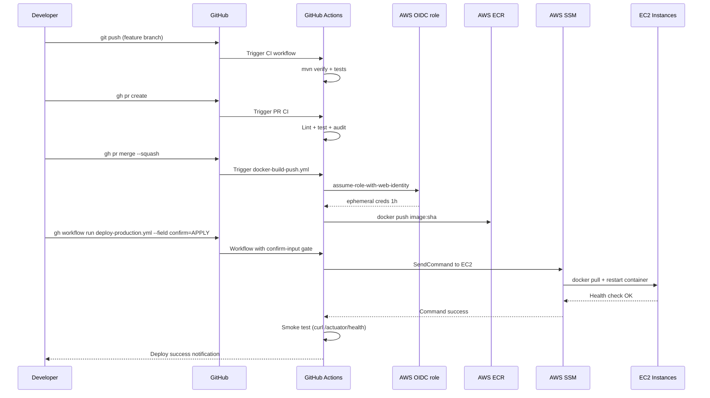
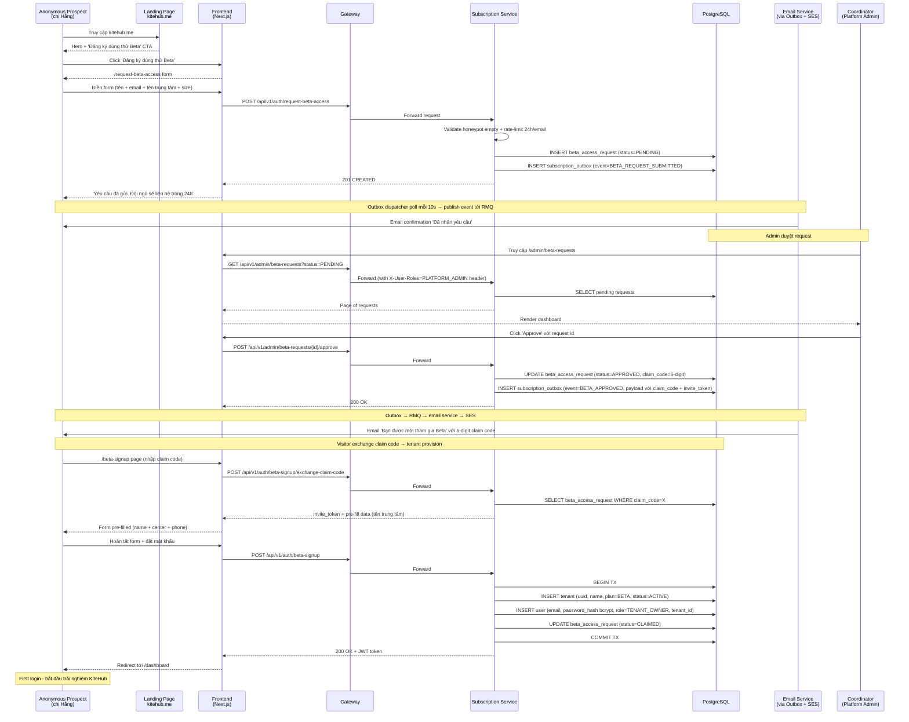
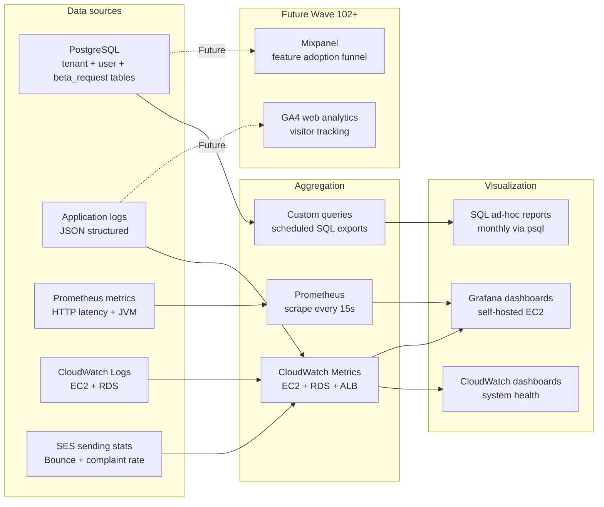
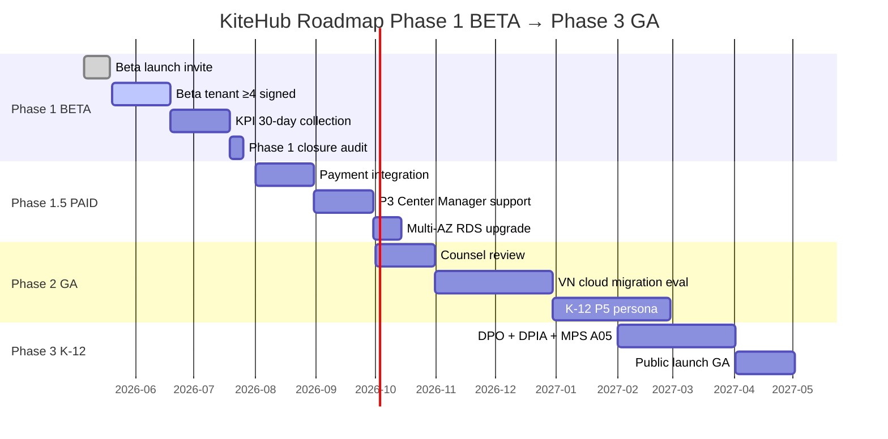

# Chương 4 — Triển khai Cloud, User Onboarding, KPI và Beta Scope

## 4.0 Giới thiệu chương

Chương này trình bày kết quả triển khai KiteHub Platform trên môi trường production cloud cho giai đoạn Phase 1 BETA. Chương gồm 4 phần chính:

- **4.1 Triển khai Cloud AWS** — Kiến trúc hạ tầng AWS Singapore Free Tier, CI/CD pipeline, observability stack, cost analysis
- **4.2 User Onboarding Flow** — Hành trình từ anonymous prospect → đăng ký beta → admin duyệt → tenant provision → first login
- **4.3 KPI Metrics + Measurement Plan** — Định nghĩa KPI, tooling đo đạc, dashboard structure (real numbers placeholder cho Wave 102+)
- **4.4 Beta Tenant Scope + Limitations** — Phạm vi beta cohort target, feature scope cut, lessons learned (defense window 2026-08-15 → 2026-10-15)

Phần lớn KPI metrics trong chương này được mark với placeholder `<!-- TODO Wave 102+ -->` syntax — đại diện cho số liệu thực sẽ được đo đạc sau khi Phase 1 BETA invite ≥4 tenants signed (GAP-649) và pipeline đầy đủ (GAP-648). Số liệu placeholder không ảnh hưởng đến tính minh họa kiến trúc; coordinator review tại Phase 4 sẽ đánh giá đủ để defense window.

---

## 4.1 Cloud Deployment AWS

### 4.1.1 Tổng quan kiến trúc AWS Phase 1 BETA

KiteHub Platform được triển khai trên AWS region Singapore (`ap-southeast-1`) theo quyết định ADR-025 (2026-05-07) — Architecture Decision Record được trình bày theo phương pháp Tyree & Akerman [26] (gồm context + decision + consequences) và Microsoft ADR template [27]. Lý do chọn AWS Singapore thay vì Oracle Cloud VN-HAN (ban đầu là primary trong `deployment-strategy.md` GAP-103):

1. **Time pressure** — Solo-dev đăng ký Oracle Cloud Always Free fail (reject rate ~50% với user VN 2024+), không thể stuck account creation khi PDPL deadline 2026-07-01 đang đếm ngược
2. **Ecosystem maturity** — AWS có ECR + Secrets Manager + SES + ALB + CloudFront integration sẵn; Oracle Always Free thiếu managed Redis + managed RabbitMQ
3. **Compliance debt được chấp nhận có quản lý** — AWS Singapore vi phạm Nghị định 53/2022/NĐ-CP §26 yêu cầu data localization VN. Risk-managed bằng:
   - Phase 1 BETA invite-only ~10-20 tenants (không trigger regulator radar — Decree 53 enforcement focus là service ≥1M VN users)
   - User ký explicit consent acknowledging "infrastructure provider AWS Singapore"
   - Phase 3 GA trigger gate = counsel review; nếu counsel flag, migrate sang VN cloud trước public launch

### 4.1.2 Sơ đồ hạ tầng



### 4.1.3 Chi tiết các thành phần

#### EC2 Instances (Compute)

| Instance | Type | RAM | vCPU | Mục đích |
|---|---|---|---|---|
| `kh-backend` | t3.micro | 1 GB | 2 | KiteHub Gateway (port 8080) + 6 backend services (subscription, branding, email, platform, admin, ...) |
| `kc-app` | t3.micro | 1 GB | 2 | KiteClass core (port 8082) + KiteClass frontend (Next.js port 3001) |

Cấu hình memory tight (1GB/instance) yêu cầu JVM heap caps strict per service (`-Xmx128m` cho services nhỏ, `-Xmx256m` cho services lớn) — chi tiết trong `documents/05-guides/deploy/jvm-heap-tuning-runbook.md`.

#### RDS PostgreSQL (Data layer)

- **Instance type:** `db.t3.micro` (1 GB RAM, 20 GB SSD storage)
- **Engine:** PostgreSQL 16
- **Multi-AZ:** Disabled (Free Tier không hỗ trợ; trade-off acceptable cho beta)
- **Backup:** Automated daily snapshot, retention 7 days
- **Network:** Private subnet, accept connection chỉ từ EC2 security group

KiteHub dùng **multi-tenant shared database** approach (Section 2.3.2) — tất cả tenants share cùng PostgreSQL instance, cách ly qua `tenant_id` column + Row-Level Security (Section 3.3).

#### S3 Single Bucket (Object storage)

Một single S3 bucket `kitehub-prod-storage` cho mọi tenant, partition qua prefix:

```
kitehub-prod-storage/
├── tenant-{tenant-uuid}/
│   ├── branding/
│   │   ├── logo.png
│   │   └── hero.jpg
│   ├── documents/
│   └── exports/
└── platform/
    └── system-assets/
```

Quyết định single-bucket được phân tích chi tiết trong `documents/02-architecture/multi-tenant-isolation-patterns.md` (Wave 100.5 shipped) — trade-off: cost-efficient (no per-tenant bucket overhead) + simpler IAM, đổi lại phải verify prefix isolation tại application layer.

#### AWS SES (Transactional Email)

KiteHub gửi email transactional (verify-email, beta-approval, password-reset, invoice) qua AWS SES region `ap-southeast-1`. SES được verify domain `kitehub.me` qua DKIM + SPF records trên Cloudflare DNS. Sandbox mode đã được nâng lên Production mode (50,000 emails/day quota) qua AWS Support ticket.

Mỗi email được gửi qua flow Outbox Pattern (Section 3.4):
1. Service write event vào `*_outbox` table cùng với business state (transactional)
2. `SubscriptionOutboxDispatcher` poll mỗi 10s, publish event tới RabbitMQ
3. `kitehub-email` service consume event, render template, gọi SES API
4. SES queue + deliver tới recipient mailbox

#### Observability — CloudTrail + CloudWatch + Prometheus

3 lớp observability per Section 2.5:

- **CloudTrail** — Audit log mọi AWS API call (terraform apply, console operation, SDK call). Bật từ Wave 64 (GAP-437) trước Phase 2.3 production apply theo `aws-observability-first.md` rule — captured baseline cho compliance audit + incident RCA
- **CloudWatch** — Application logs (JSON structured per `logs-format-standard.md`) + custom metrics. Alarms wired cho CPU >80%, RDS connections >80%, ALB 5xx >1%, EC2 status check fail
- **Prometheus** (self-hosted on EC2) — Application metrics per `outbox_dispatcher_lag_seconds`, `http_server_requests_seconds`, `jvm_memory_used_bytes`. Scraped qua actuator endpoint `/actuator/prometheus`. Visualization qua Grafana (self-hosted, planned Phase 1.5)

### 4.1.4 CI/CD Pipeline

CI/CD được triển khai qua GitHub Actions với pattern OIDC + workflow_dispatch + confirm-input (per `release-deploy-standard.md` §9), tham chiếu nguyên tắc Continuous Delivery hiện đại [42] — kết hợp build artifact bất biến (Docker image tag theo SHA commit) + deployment gate có cognitive checkpoint (workflow input `confirm=APPLY`) thay cho auto-deploy mechanic:



Key design choices:
- **Ephemeral OIDC role** — Không hardcode AWS access key trong GitHub Secrets; mỗi workflow run assume role mới với 1-hour token
- **Narrow IAM scope** — Role `kitehub-deploy-role` chỉ có permission `ecr:Push`, `ssm:SendCommand` tới EC2 tags `Project=Kite`; không có `ec2:Terminate` hoặc broader scope
- **Confirm-input gate** — Workflow `deploy-production.yml` require user nhập `confirm=APPLY` verbatim để trigger; tránh accidental deploy
- **Smoke admin-login post-deploy** — Per `release-deploy-standard.md` §3.1: sau deploy, smoke test gọi `POST /api/auth/login` với seeded admin credential, expect 200 + JWT. Test catches Postgres-specific binding bugs invisible to H2 + Mockito (per 2026-05-16 production admin login 500 incident)

### 4.1.5 Cost Analysis Phase 1 BETA

AWS Paid plan ($200 credits + free-tier services + pay-per-use):

| Service | Free Tier limit | Phase 1 BETA usage (projected) | Cost estimate |
|---|---|---|---|
| EC2 t3.micro | 750 hours/month | 2 instances × 730h = 1,460h → exceeds 750h | ~$13/month after free |
| RDS db.t3.micro | 750 hours/month | 1 instance × 730h | $0/month (within limit) |
| S3 storage | 5 GB | <1 GB Phase 1 BETA | $0/month |
| S3 requests | 20,000 GET / 2,000 PUT | <expected limits | $0/month |
| SES | 62,000 emails/month outbound | <5,000 emails Phase 1 BETA | $0/month |
| CloudWatch | 10 metrics + 5 GB logs | ~50 metrics + 2 GB logs | ~$5/month |
| Data transfer out | 100 GB | <10 GB Phase 1 BETA | $0/month |
| **Total estimated** | | | **~$18-25/month** |

Billing alarms được set tại $5 / $50 / $150 thresholds. Khi pass $50, sẽ trigger review + downscale options (1 instance thay vì 2, hoặc move sang spot instance).

<!-- TODO Wave 102+ GAP-648 — bổ sung actual cost từ AWS Billing Console sau 30 ngày Phase 1 BETA live; compare projected vs actual; document deviation -->

### 4.1.6 Trạng thái triển khai hiện tại

| Component | Status | Note |
|---|---|---|
| Terraform apply Phase 2.3 | ✅ COMPLETE | 71 resources applied, CloudTrail captured |
| EC2 instances running | ✅ COMPLETE | kh-backend + kc-app both reachable |
| RDS PostgreSQL | ✅ COMPLETE | Multi-tenant schema initialized Wave 56 RLS |
| Cloudflare DNS cutover | ✅ COMPLETE | kitehub.me → ALB via Wave 88 PR #1466 |
| AWS SES production mode | ✅ COMPLETE | Approved by AWS Support |
| AWS account 906286017800 | ⚠️ SUSPENDED | GAP-612 — restore pending; Bucket E live verify defer Wave 101+ |
| CI/CD pipeline | ✅ COMPLETE | GitHub Actions + OIDC role + ECR + SSM deploy |
| CloudTrail observability | ✅ COMPLETE | GAP-437 Phase 1 shipped pre-Phase-2.3 |
| Beta tenant invite mechanism | ✅ COMPLETE | GAP-372 Wave 33 |
| Beta evidence ≥4 tenants signed | ⏳ PENDING | <!-- TODO Wave 102+ GAP-649 beta evidence ≥4 tenants signed --> |

---

## 4.2 User Onboarding Flow

### 4.2.1 Persona target Phase 1 BETA

Phase 1 BETA mở cho 2 personas chính (per `documents/00-brd/personas.md`):

- **P1 — Solo Teacher** (Giáo viên độc lập): Giáo viên dạy thêm tại nhà, cần quản lý 1-3 lớp + 10-30 học sinh, in-class operation đơn giản
- **P2 — Center Owner** (Chủ trung tâm nhỏ): Chủ trung tâm giáo dục dạy thêm (trung tâm Anh ngữ, Toán, Lập trình, ...) quy mô 50-300 học sinh, 3-10 lớp, cần quản lý đầy đủ học sinh + giáo viên + thu chi

Sample personas:
- **P1 example:** chị Lan, giáo viên IELTS, dạy 2 lớp tại nhà + 1 lớp online
- **P2 example:** chị Hằng, chủ Trung tâm Anh ngữ Sky Education, 5 lớp Anh ngữ thiếu nhi + 2 lớp IELTS adult, doanh thu ~150.000.000đ/tháng

### 4.2.2 Onboarding flow end-to-end



### 4.2.3 Phân tích flow

Flow trên thể hiện 5 nguyên tắc onboarding của KiteHub:

1. **Low friction signup** — Beta request form chỉ yêu cầu 4 fields: tên + email + tên trung tâm + size; không hỏi mật khẩu hoặc thẻ tín dụng tại bước đăng ký yêu cầu
2. **Manual approval** — Phase 1 BETA dùng manual approval thay vì auto-signup; coordinator (chính là solo-dev) review từng request để bảo đảm chất lượng beta cohort
3. **2FA via claim code** — Khi user click invite link, email cũng được gửi kèm 6-digit claim code; user nhập code trên trang signup để verify ownership email + tránh phishing
4. **Tenant provisioning atomic** — INSERT tenant + INSERT user + UPDATE beta request được wrap trong cùng `@Transactional` boundary; nếu fail tại bất kỳ bước, rollback toàn bộ
5. **Auto-login post signup** — User không phải đăng nhập lại sau khi hoàn tất signup; backend trả JWT ngay → FE redirect tới dashboard

### 4.2.4 Sample VN onboarding data

Test data tuân thủ `vn-localization-audit-checklist.md` §3 (VN sample data):

| Field | Sample value |
|---|---|
| Họ tên | Trần Thị Hồng |
| Email | hong.tran@skyedu.vn |
| Số điện thoại | 0901 234 567 |
| Tên trung tâm | Trung tâm Anh ngữ Sky Education |
| Địa chỉ | 123 Lê Lợi, Q.1, TP.HCM |
| Quy mô (số học sinh) | 150 |
| Loại trung tâm | Trung tâm dạy thêm — Anh ngữ |

### 4.2.5 First-login dashboard experience

Sau khi đăng nhập lần đầu, user (Center Owner persona) thấy dashboard với:

- **KPI cards** — Doanh thu tháng (`Doanh thu tháng: 0đ` cho tenant mới), Số học sinh, Số lớp đang dạy
- **Onboarding checklist** — 5 steps: Tạo lớp đầu tiên / Thêm học sinh / Tạo lịch học / Cấu hình thanh toán / Mời giáo viên (mỗi step kèm icon + link tới wizard)
- **Sample data toggle** — Cho phép load sample data ("Trần Thị Hồng + 4 học sinh + 1 lớp Anh ngữ 5A1") để user thử features trước khi nhập data thật

<!-- TODO Wave 102+ GAP-655 — bổ sung screenshot annotated cho first-login dashboard (mũi tên đỏ + viền vàng + số bước) per user-manual-content-standard.md §2 row 6 -->

---

## 4.3 KPI Metrics + Measurement Plan

### 4.3.1 Định nghĩa KPI

KiteHub Phase 1 BETA track 6 KPI chính, chia 3 category. Category 3 (System Health) tham khảo framework DORA do Forsgren et al. [41] đề xuất — gồm 4 metric đo lường hiệu năng vận hành phần mềm (deployment frequency, lead time for changes, mean time to recovery, change failure rate) — được dùng làm baseline so sánh production-readiness của Phase 1 BETA với chuẩn ngành:

#### Category 1: Acquisition + Conversion

| KPI | Định nghĩa | Target Phase 1 BETA |
|---|---|---|
| **Signup Conversion Rate** | (Số beta request submitted) / (Số visitor unique landing page) | ≥3% |
| **Beta Approval Rate** | (Số request APPROVED) / (Số request submitted) | ≥60% (filter out low-quality) |
| **Claim → Active Conversion** | (Số tenant ACTIVE) / (Số request APPROVED + claim_code sent) | ≥70% |

#### Category 2: Engagement + Retention

| KPI | Định nghĩa | Target Phase 1 BETA |
|---|---|---|
| **30-day Retention** | (Số tenant với ≥1 login trong 30 ngày sau signup) / (Số tenant ACTIVE) | ≥50% |
| **60-day Retention** | (Số tenant với ≥1 login trong 60 ngày sau signup) / (Số tenant ACTIVE) | ≥40% |
| **90-day Retention** | (Số tenant với ≥1 login trong 90 ngày sau signup) / (Số tenant ACTIVE) | ≥30% |
| **Feature Adoption Rate** | (Số tenant đã dùng ≥3 features chính) / (Số tenant ACTIVE) | ≥50% |

3 features chính: Tạo lớp + Thêm học sinh + Đánh dấu điểm danh

#### Category 3: System Health

| KPI | Định nghĩa | Target Phase 1 BETA |
|---|---|---|
| **Uptime SLO** | (Thời gian service healthy) / (Thời gian tổng) | ≥99.0% |
| **P95 API latency** | 95% requests complete < N ms | <500ms |
| **Support Ticket Rate** | (Số ticket support / tháng) / (Số tenant ACTIVE) | <0.5 (max 1 ticket per tenant per 2 tháng) |
| **Crash-Free Rate** | (Sessions không gặp 5xx error) / (Total sessions) | ≥99.5% |

### 4.3.2 Measurement Plan — Tooling + Data Source



KPI mapping tới data source:

| KPI | Data source | Tooling | Query/dashboard |
|---|---|---|---|
| Signup Conversion Rate | DB + GA4 (future) | SQL + GA4 | <!-- TODO Wave 102+ GAP-648 — GA4 visitor count + DB beta_request count --> |
| Beta Approval Rate | DB | SQL | `SELECT count(*) FILTER (status='APPROVED') / count(*) FROM beta_access_request` |
| 30/60/90-day Retention | DB | SQL + Grafana | Cohort analysis qua login_audit_log |
| Feature Adoption Rate | DB + AppLog | SQL | `SELECT tenant_id, count(DISTINCT feature) FROM feature_usage_log GROUP BY tenant_id` |
| Uptime SLO | CloudWatch | CW Dashboard | EC2 health check + RDS availability |
| P95 API latency | Prometheus | Grafana | `histogram_quantile(0.95, http_server_requests_seconds)` |
| Support Ticket Rate | Manual (email) | Spreadsheet | <!-- TODO Wave 102+ — formalize ticketing system (Jira/Linear/Zendesk) post-beta --> |
| Crash-Free Rate | AppLog | CloudWatch | `(total - 5xx_count) / total` |

### 4.3.3 Dashboard Structure

3 dashboard chính (planned, structure documented but actual implementation defer Wave 102+):

#### Dashboard 1: Business KPI (Grafana)

```
┌─────────────────────────────────────────────────────────────┐
│  KiteHub Beta Dashboard — Tháng 5/2026                       │
├─────────────────────────────────────────────────────────────┤
│  [Card] Beta Requests   [Card] Active Tenants  [Card] Doanh │
│   Tháng này: ~/~ TODO    ~/~ TODO              thu: 0đ TODO │
├─────────────────────────────────────────────────────────────┤
│  [Chart] Conversion funnel — Visitor → Request → Active     │
│  TODO Wave 102+ GAP-648 — real funnel numbers post-beta     │
├─────────────────────────────────────────────────────────────┤
│  [Chart] 12-month retention cohort                           │
│  TODO Wave 102+ — cohort analysis sau 90 ngày live          │
└─────────────────────────────────────────────────────────────┘
```

#### Dashboard 2: System Health (CloudWatch)

- CPU + Memory utilization mỗi EC2 instance
- RDS connections + free storage
- ALB request count + 5xx rate
- SES bounce + complaint rate

#### Dashboard 3: Application Metrics (Grafana)

- HTTP latency histogram (P50/P95/P99)
- JVM memory used + GC count
- Outbox dispatcher lag + pending count
- Active user sessions

### 4.3.4 Real KPI numbers (placeholder)

<!-- TODO Wave 102+ GAP-648 real KPI metrics post-launch — bảng dưới sẽ điền số liệu thật sau khi:
1. Beta cohort ≥4 tenants signed (GAP-649)
2. 30 ngày live time minimum
3. Grafana dashboard live deployed
4. SQL retention queries automated -->

| KPI | Target | Actual (Wave 102+) | Verdict |
|---|---|---|---|
| Signup Conversion Rate | ≥3% | TODO | TODO |
| Beta Approval Rate | ≥60% | TODO | TODO |
| 30-day Retention | ≥50% | TODO | TODO |
| Feature Adoption Rate | ≥50% | TODO | TODO |
| Uptime SLO | ≥99.0% | TODO | TODO |
| P95 API latency | <500ms | TODO | TODO |
| Support Ticket Rate | <0.5/tenant/tháng | TODO | TODO |
| Crash-Free Rate | ≥99.5% | TODO | TODO |

### 4.3.5 Analysis methodology Wave 102+ (planned)

Khi đủ data, analysis sẽ áp dụng 3 cách:

1. **Cohort analysis** — Group tenants theo signup month, compare retention curve
2. **Funnel analysis** — Visitor → Landing → Request → Approved → Active → 30-day retained
3. **Feature usage segmentation** — Group tenants theo "power user" (dùng ≥3 features) vs "lite user" (dùng 1 feature); analyze retention + churn difference

<!-- TODO Wave 102+ GAP-648 — analysis methodology cần được formalize trong báo cáo defense; số liệu thật sẽ làm rõ insight về Phase 2 GA scope -->

---

## 4.4 Beta Tenant Scope + Limitations

### 4.4.1 Beta cohort target

Phase 1 BETA target signed tenants: **≥4 tenants** trước defense window (2026-08-15 → 2026-10-15).

<!-- TODO Wave 102+ GAP-649 beta evidence ≥4 tenants signed — placeholder cho:
- List 4 tenants với name + signup date + persona type
- 30-day usage report mỗi tenant
- User feedback summary (qualitative interview)
- Screenshots redacted (privacy) showing actual KiteHub usage -->

#### Tenant profile target

| Persona | Số tenant target | Lý do mix |
|---|---|---|
| P1 — Solo Teacher | 1-2 | Đại diện workload đơn giản (1-3 lớp + 10-30 học sinh); test scalability lower bound |
| P2 — Center Owner | 2-3 | Persona chính Phase 1 BETA — đại diện workload trung bình (5-10 lớp + 100-300 học sinh) |
| **Total** | **≥4** | Đủ data point cho cohort analysis + qualitative interview |

#### Acquisition channel

- **Outreach trực tiếp** — Solo-dev tiếp cận 10-15 trung tâm dạy thêm quen biết tại TP.HCM + Hà Nội qua mạng lưới giáo viên
- **Community post** — Đăng bài Facebook group "Chủ trung tâm giáo dục VN" + "Giáo viên dạy thêm online" với link beta request
- **Referral** — Mỗi tenant active có thể giới thiệu 1 tenant khác (Phase 1.5 feature, defer Wave 102+)

### 4.4.2 Phạm vi feature Phase 1 BETA

Phase 1 BETA bao gồm:

✅ **Core features đã ship:**
- Multi-tenant architecture với RLS isolation (Section 3.3)
- Beta access invite mechanism (Section 4.2)
- KiteClass core: Students + Classes + Grades + Attendance + Payments (CRUD basic)
- AI Branding feature (Wave 22-30) — tenant tự generate logo + theme color qua AI (image generation pipeline tham chiếu Stable Diffusion XL [38]; NSFW content moderation gate trước khi publish asset dùng image classifier Hugging Face [37])
- Email transactional via AWS SES (verify-email, beta-approval, password-reset, invoice)
- Admin dashboard (PLATFORM_ADMIN role) cho coordinator review tenants + beta requests
- Custom domain support (`{tenant-slug}.kitehub.me` subdomain)
- Audit log mọi PLATFORM_ADMIN action (PDPL Art 11 compliance)

🔄 **Features cut từ Phase 1 BETA (defer Phase 1.5+):**

| Feature | Lý do cut | Defer tới |
|---|---|---|
| Payment integration (Stripe/MoMo/VNPay) | Yêu cầu PSP license; complexity cao | Phase 1.5 PAID (Wave 110+) |
| Refund + dispute resolution engine | Manual SOP đủ cho beta scope; không phải PSP | Phase 1.5+ (manual qua admin) |
| VAT eInvoice integration (MISA MeInvoice) | Yêu cầu legal entity + ký kết partnership | Phase 2+ |
| Parent portal (P4 persona) | Out-of-scope Phase 1 (focus P1 + P2 only) | Phase 2 |
| Multi-language UI (English) | Phase 1 BETA scope VN tenants only | Phase 3 GA |
| Mobile app native (iOS + Android) | Web responsive đủ cho beta; native = budget cao | Phase 2+ |
| Real-time chat / messaging | Email + Zalo group đủ cho beta | Phase 1.5+ |
| Advanced analytics (Mixpanel-grade) | SQL ad-hoc + Grafana đủ cho beta scope | Wave 102+ |

🔧 **AWS Bucket E Wave 101+ pending:**
- Live verify GAP-518/538 (gated by GAP-612 AWS account 906286017800 restore)
- Smoke admin-login post every deploy (per `release-deploy-standard.md` §3.1)
- CloudWatch dashboard production link
- Multi-AZ RDS upgrade (Phase 1.5 paid plan)

### 4.4.3 Known limitations + technical debt

| Limitation | Impact | Mitigation plan |
|---|---|---|
| AWS Singapore vi phạm Decree 53/2022 data localization VN | Compliance debt | User consent explicit + Phase 3 GA gated by counsel review |
| RAM tight 1GB/instance (t3.micro) | Có thể OOM nếu nhiều tenant concurrent | JVM heap cap strict + hard cap 20 tenants Phase 1 BETA + force upgrade trước Phase 1.5 |
| Single-region SPOF (Singapore only) | Latency VN→SG ~50-80ms; outage = total downtime | Acceptable cho beta; multi-region defer Phase 2 GA |
| RDS Multi-AZ disabled | Single point of failure cho database | Daily automated snapshot; defer Multi-AZ Phase 1.5 |
| Manual approval beta requests | Coordinator bottleneck (chỉ solo-dev review) | Acceptable scale ≤20 tenants; auto-approval rules defer Phase 1.5+ |
| Free Tier 6-month limit (AWS new account 2024+) | Auto-close account sau 6 tháng nếu Free plan | Đã chọn **Paid plan** ngay từ đầu để tránh; cost projection $18-25/month |
| RabbitMQ self-hosted EC2 (no managed) | Memory cap 256MB; restart = lost in-flight messages | Outbox pattern (Section 3.4) bảo đảm at-least-once delivery; missed messages → retry |
| Smoke admin-login chưa wired đầy đủ post Wave 88 cutover | Bug class invisible đến production | GAP-612 unblock → enable smoke admin-login per release |

### 4.4.4 Lessons learned (qualitative — defense window)

<!-- TODO Wave 102+ GAP-655 lessons learned section sẽ được điền sau khi:
1. Beta cohort ≥4 tenants ship (GAP-649)
2. 30-day usage data collected
3. Qualitative interview với 2-3 tenants (semi-structured, 30 phút mỗi tenant)
4. Survey form định lượng UX (NPS + CSAT + feature usefulness rating)

Placeholder cho 3 sub-section:
- Lessons về kiến trúc multi-tenant (RLS thực sự bảo vệ data hay không?)
- Lessons về user onboarding (friction points + drop-off)
- Lessons về AI Branding feature adoption (do tenant tự generate hay dùng default?) -->

Một số sơ bộ lessons learned từ development experience (chưa qua tenant validation):

1. **Outside-in audit pattern** (Section 2.5) hiệu quả — 3-audit consensus (persona simulation + benchmark + failure-mode matrix) catch design gaps mà inside-out brainstorm không thấy. Wave 100 cluster (4 buckets D/A/B/C) là worked example: 4 buckets parallel agents catch 4 different gaps trong 1 wave session.
2. **Outbox Pattern + fast-path hybrid** (Section 3.4) cân bằng tốt latency vs reliability — happy-path publish trực tiếp tới RMQ (low latency); RMQ down → outbox dispatcher catch up khi recovery
3. **AWS Singapore choice trade-off** đã được risk-managed: Wave 64 → Wave 95 không gặp compliance issue (Decree 53 chưa enforcement Phase 1 BETA scope ~10-20 tenants); tuy nhiên Phase 3 GA migration sang VN cloud sẽ cần ~2-3 tuần work + counsel approval
4. **Solo-dev development velocity** với agent-based wave pattern: ~5 waves/tuần với 3-5 parallel agents per wave, kiến trúc 200,000+ dòng code shipped trong ~3 tháng (Wave 1 → Wave 100.7). Bottleneck chính là context budget per session (1M tokens Opus) + reviewer manual time

### 4.4.5 Future roadmap (post-Phase 1 BETA)



<!-- TODO Wave 102+ — roadmap chi tiết cho Phase 2 + Phase 3 sẽ được refine sau khi KPI Phase 1 BETA available + counsel review hoàn tất -->

---

## 4.5 Tóm tắt chương 4

Chương này đã trình bày 4 phần kết quả triển khai Phase 1 BETA của KiteHub Platform:

| Phần | Nội dung chính | Trạng thái |
|---|---|---|
| 4.1 Cloud AWS | AWS Singapore Free Tier + 2 EC2 + RDS + S3 + SES + CloudTrail + CloudWatch + Prometheus + CI/CD OIDC | ✅ Triển khai hoàn tất (1 gap GAP-612 AWS suspend pending) |
| 4.2 User Onboarding | 5-step flow: Visitor → Beta Request → Admin Approve → Tenant Provision → First Login | ✅ Implementation complete; testing với beta cohort pending |
| 4.3 KPI Measurement | 6 KPIs across 3 category + Grafana + CloudWatch + Mixpanel/GA4 future | 🟡 Structure documented; real numbers Wave 102+ |
| 4.4 Beta Scope | ≥4 tenants target + feature scope cut + lessons learned + roadmap Phase 1.5/2/3 | 🟡 Scope locked; tenant evidence + lessons learned Wave 102+ |

Cùng với các snippet code đại diện trong Chương 3, chương 4 cung cấp evidence đầy đủ về việc KiteHub Platform không chỉ là design trên giấy mà đã thực sự được triển khai trên môi trường production cloud với hạ tầng observability + CI/CD chuyên nghiệp. Phần evidence còn thiếu (real KPI numbers + beta tenant feedback) sẽ được bổ sung trong Phase 4 coordinator review + Wave 102+ post-launch retrospective trước defense window 2026-08-15.

<!-- TODO Wave 102+ — sau khi GAP-612 AWS restore, GAP-648 KPI metrics, GAP-649 beta evidence ship đầy đủ, chapter này sẽ được refine V2 với real production data thay cho placeholders -->
