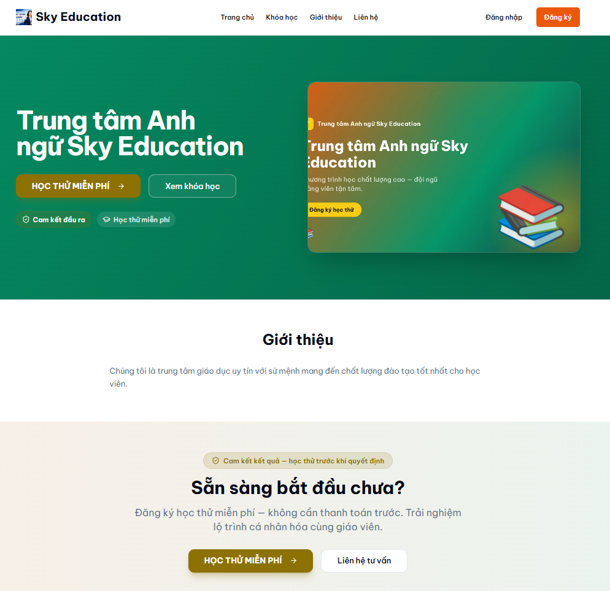

# Văn nói thuyết trình bảo vệ — bản chi tiết nguyên văn (23 slide, mẫu UTC)

## Slide 1 — XÂY DỰNG HỆ THỐNG SAAS CUNG CẤP DỊCH VỤ ĐÀO TẠO

Kính chào thầy chủ tịch hội đồng cùng quý thầy cô trong hội đồng. Em là Nguyễn Văn Kiệt, sinh viên lớp cử nhân Công nghệ thông tin 1 khóa 63, dưới sự hướng dẫn của thầy Tiến sĩ Nguyễn Đức Dư. Hôm nay em xin phép trình bày khóa luận tốt nghiệp với đề tài: Xây dựng hệ thống SaaS cung cấp dịch vụ đào tạo. Đây là một nền tảng phần mềm dạng dịch vụ đa người thuê, tích hợp trí tuệ nhân tạo để tự động hóa nhận diện thương hiệu, hướng tới các trung tâm dạy thêm vừa và nhỏ tại Việt Nam. Em xin được bắt đầu phần trình bày. (~30 giây)

## Slide 2 — Nội dung trình bày

Trước khi đi vào chi tiết, em xin giới thiệu bố cục của phần trình bày. Em xin bắt đầu từ giới thiệu tổng quan bài toán, từ đó phân tích thiết kế hệ thống, xây dựng sản phẩm và triển khai sản phẩm. Cuối cùng là kết quả vận hành, demo sản phẩm và kết luận.

## Slide 3, 4 — Bài toán — thị trường bùng nổ nhưng vẫn quản lý bằng tay

Em xin mở đầu bằng bài toán. Thị trường quản lý trung tâm dạy thêm đang bùng nổ: hơn năm mươi nghìn trung tâm sau khi Thông tư 29 năm 2024 chính thức hóa dạy thêm có thu phí; trong văn hóa trọng giáo dục hiện nay, phụ huynh chi mười lăm đến hai mươi phần trăm thu nhập cho học thêm; hơn chín mươi phần trăm phụ huynh đô thị dùng Zalo làm kênh giao tiếp chính. 
Nhưng phần lớn trung tâm nhỏ và vừa vẫn quản lý bằng Excel, nhóm Zalo, thậm chí sổ ghi tay. Lý do: phần mềm hiện có hoặc quá phức tạp vì hướng tới mô hình trường công lập, hoặc thiếu trải nghiệm tiếng Việt vì là sản phẩm quốc tế, hoặc chi phí quá đắt đỏ; chưa kể trung tâm mới còn chưa có thương hiệu số. Đó chính là khoảng trống mà đề tài hướng tới: một nền tảng vừa đảm bảo chi phí hợp lý, vừa đúng nghiệp vụ quản lý giáo dục, có tương tác tốt với người dùng Việt, và tự động xây dựng được thương hiệu cho khách hàng. (~70 giây)

## Slide 5 — Giải pháp — KiteHub: SaaS đa-tenant + AI cho trung tâm dạy thêm

Từ đó, em đưa ra giải pháp gồm 4 nội dung chính. Thứ nhất, nền tảng SaaS đa người thuê, cùng chia sẻ hạ tầng, người dùng có thể thao tác dễ dàng, nhanh chóng để tạo ra 1 tenant, tức 1 trang web riêng cho mục đích giáo dục, giảng dạy của khách hàng.

Thứ hai, AI Branding, phục vụ cho mục đích thương hiệu số: có thể tự động sinh nhận diện thương hiệu từ một mô tả ngắn, rút từ vài tuần xuống vài ngày.

Thứ ba, tuân thủ pháp luật Việt Nam: Nghị định 13 năm 2023 về bảo vệ dữ liệu cá nhân, Luật An ninh mạng 2018, Thông tư 78 năm 2021 về hóa đơn điện tử, và quy định bảo vệ dữ liệu trẻ em theo Luật Trẻ em 2016.

Thứ tư, giao diện sản phẩm thân thiện với người dùng Việt, dễ tiếp cận cho nhóm người dùng không có chuyên môn về hệ thống IT.

## Slide 6 — Kiến trúc tổng thể — C4 Level 1 (Hình 2.1)

Tiếp đến với phần phân tích và thiết kế hệ thống, em xin trình bày kiến trúc theo mô hình C4 của Simon Brown, một chuẩn công nghiệp cho tài liệu kiến trúc microservices. 

Sơ đồ ngữ cảnh ở mức một cho thấy hệ thống tương tác với tám nhóm người dùng và quản trị, cùng sáu hệ thống bên ngoài như dịch vụ email, thanh toán VietQR, Zalo và Cloudflare. Có hai nguyên tắc thiết kế đáng chú ý. Thứ nhất, mọi người dùng đều truy cập qua giao thức HTTPS với TLS từ phiên bản 1.2 trở lên. Thứ hai, mọi hệ thống bên ngoài đều được cô lập qua mẫu adapter — ví dụ giao diện NotificationChannel cho email và PaymentProcessor cho thanh toán — nên có thể thay nhà cung cấp mà không phải sửa lõi. Đặc biệt, không một người dùng nào chạm trực tiếp vào cơ sở dữ liệu; tất cả đều đi qua biên tin cậy là gateway. 

## Slide 7 — Khác biệt — Cô lập đa-tenant bằng RLS (§2.2.3)

Tiếp theo em xin đi vào trọng tâm thiết kế thứ nhất là mô hình cô lập đa người thuê. 

Đây là quyết định kiến trúc trọng tâm của đề tài. Em đã đánh giá sáu mô hình cô lập đa người thuê khác nhau, và lựa chọn mô hình: một cơ sở dữ liệu dùng chung, mỗi bảng mang cột định danh tenant, kết hợp cơ chế bảo mật mức dòng Row-Level Security của PostgreSQL.

Đây tương ứng với mô hình Pool theo khung tham chiếu AWS SaaS Lens. Em chọn mô hình này vì hai lý do chính. 
Thứ nhất là chi phí: mô hình mỗi tenant một cơ sở dữ liệu riêng, lược đồ riêng sẽ tiêu tốn chi phí cao hơn rất nhiều so với nhiều tenant dùng chung các tài nguyên này. 

Thứ hai, và quan trọng hơn, là an toàn: với Row-Level Security, chính database engine ép buộc việc lọc dữ liệu theo tenant, thay vì phụ thuộc vào việc lập trình viên nhớ thêm điều kiện lọc trong mỗi câu truy vấn. Một lỗi quên điều kiện ở tầng ứng dụng sẽ không gây rò rỉ dữ liệu chéo, vì tầng cơ sở dữ liệu vẫn chặn lại. Bảng bên cạnh rút gọn 6 mô hình tiêu biểu để so sánh. Em xin trình bày sâu hơn cách cơ chế cô lập này hoạt động qua nhiều lớp. (~85 giây)

## Slide 8 — Bảo mật nhiều lớp — Defense-in-depth (Hình 2.3)

Mô hình multi-tenant không chỉ dựa vào một cơ chế duy nhất, mà được tổ chức thành năm lớp phòng thủ độc lập, theo nguyên tắc phòng thủ chiều sâu. 

Lớp thứ nhất, tại biên gateway, thực hiện xác thực chữ ký JWT và rút trích định danh tenant. 
Lớp thứ hai, tại dịch vụ, kiểm tra vai trò bằng cơ chế phân quyền của Spring Security. Lớp thứ ba thiết lập biến ngữ cảnh tenant trên kết nối cơ sở dữ liệu trong phạm vi từng giao dịch. 
Lớp thứ tư là chính sách Row-Level Security của PostgreSQL. 
Lớp thứ năm là ràng buộc cột định danh tenant không được rỗng trên mọi bảng nghiệp vụ. Điểm quan trọng nhất nằm ở chính sách gọi là "buộc thất bại khi rỗng": nếu biến ngữ cảnh tenant chưa được thiết lập, truy vấn sẽ trả về không có dòng nào, thay vì vô tình trả về tất cả — nhờ vậy lỗi lập tức lộ ra ngay trong khâu kiểm thử thay vì âm thầm gây rò rỉ. 

Ý nghĩa là: kẻ tấn công phải xuyên thủng cả năm lớp mới có thể rò rỉ dữ liệu chéo giữa các tenant. Để thấy rõ lớp thứ nhất hoạt động thế nào trong thực tế, em xin trình bày cách một yêu cầu được định tuyến tới đúng tenant. (~75 giây)

## Slide 9 — Chuỗi định tuyến tenant — Tenant đến Domain đến Landing (Hình 2.4c, 2.4d)

Đây là phần trả lời cho câu hỏi: cùng một mã nguồn, làm sao mỗi trung tâm lại có một trang chủ riêng? Đây cũng chính là nơi lớp phòng thủ thứ nhất — phân giải định danh tenant tại gateway — hoạt động.

Mỗi trung tâm có một trang chủ công khai riêng, truy cập qua tên miền phụ dạng tên-trung-tâm chấm kitehub chấm me. Tất cả tenant dùng chung một mã nguồn giao diện và một cơ sở dữ liệu; thứ quyết định nội dung và thương hiệu hiển thị chính là trường Host của yêu cầu.

Chuỗi định tuyến đi qua bốn chặng. Trình duyệt gửi yêu cầu tới tên miền phụ; Cloudflare phân giải tên miền về gateway. Tại gateway, bộ lọc phân giải tenant đọc trường Host, tách lấy phần tên miền phụ, rồi tra ra định danh tenant. Sau khi xác định được tenant, gateway gắn header định danh tenant và chuyển tiếp xuống dịch vụ lõi; dịch vụ lõi thiết lập ngữ cảnh tenant, và từ đây mọi truy vấn đều được Row-Level Security lọc đúng theo tenant đó. Kết quả trả về là dữ liệu trang chủ riêng của tenant: tiêu đề, bảng màu, danh sách giáo viên.

Có một điểm an toàn quan trọng: gateway là biên tin cậy duy nhất. Header định danh tenant do client tự gửi lên luôn bị loại bỏ và thay bằng giá trị do chính gateway phát hành sau khi phân giải Host — nhờ vậy không ai có thể giả mạo định danh tenant để xem dữ liệu của trung tâm khác. Đây chính là lý do một mã nguồn duy nhất phục vụ được hàng trăm trang chủ khác nhau mà vẫn cô lập dữ liệu tuyệt đối. (~60 giây)

## Slide 10 — Khác biệt — AI Branding tự động (§1.3 · §3.1.2)

Tiếp đến là tính năng xây dựng thương hiệu số, là tính năng chủ lực của hệ thống, tự động hóa nhận diện thương hiệu bằng trí tuệ nhân tạo. 

Với AI Branding, chủ sở hữu trung tâm chỉ cần điền một biểu mẫu ngắn gồm tên trung tâm, lĩnh vực, phong cách và màu thương hiệu; sau khoảng ba mươi đến sáu mươi giây, hệ thống tự sinh ra logo, ảnh nền trang chủ và banner mạng xã hội. 

Có hai nguyên tắc thiết kế quan trọng. Thứ nhất là ưu tiên mẫu có sẵn: hệ thống chỉ gọi mô hình AI khi thực sự cần, nhằm kiểm soát chi phí. Thứ hai là cơ chế xem trước bắt buộc: mọi tài nguyên trước khi triển khai đều phải đạt chuẩn truy cập WCAG mức AA và đi qua bộ phân loại an toàn nội dung tự động. Sơ đồ bên phải minh họa trình hướng dẫn thực tế trong sản phẩm. Nhờ cách tiếp cận này, một trung tâm có thể có bộ nhận diện chuyên nghiệp chỉ trong vài phút mà gần như không tốn chi phí thiết kế. (~80 giây)

## Slide 11 — Vòng đời tenant (máy trạng thái, Hình 2.8)

Tiếp theo, em trình bày về các vòng đời của 1 tenant:
Vòng đời của mỗi tenant được mô hình hóa thành một máy trạng thái. Khi một người dùng tiềm năng gửi yêu cầu, tenant ở trạng thái chờ duyệt. Sau khi quản trị duyệt và hệ thống gửi liên kết kích hoạt magic-link, tenant chuyển sang trạng thái dùng thử mười bốn ngày. Khi thanh toán thành công, tenant chuyển sang hoạt động chính thức; còn nếu thanh toán thất bại quá thời gian gia hạn, tenant bị tạm ngưng nhưng dữ liệu vẫn được giữ trong bảy ngày. Một chi tiết đáng chú ý là khi duyệt yêu cầu, hệ thống đồng thời phát một sự kiện bất đồng bộ để dựng sẵn bộ nhận diện thương hiệu mặc định, nhờ đó rút ngắn thời gian chờ khi người dùng đăng nhập lần đầu. (~50 giây)

## Slide 12 — Phân rã container C4 Level 2 (Hình 2.2)

Từ phân tích yêu cầu chức năng, phi chức năng, hệ thống được tổ chức thành bốn cụm. 

Cụm giao diện gồm hai ứng dụng Next.js: kitehub-frontend ở cổng 3001 phục vụ marketing và quản trị, còn kiteclass-frontend ở cổng 3000 phục vụ nghiệp vụ giáo dục.
Cụm gateway là một ứng dụng Spring Cloud Gateway ở cổng 9000, đóng vai trò điểm vào duy nhất. 
Cụm dịch vụ gồm sáu dịch vụ KiteHub cùng lõi kiteclass-core. 
Cụm hạ tầng dùng chung gồm PostgreSQL, Redis, RabbitMQ và MinIO (S3). Tính tổng trên tất cả các cụm, nền tảng gồm mười bảy thành phần tách biệt, cho phép triển khai và mở rộng từng dịch vụ một cách độc lập. (~55 giây)

## Slide 13 — Triển khai thực tế — AWS Singapore (Hình 4.1a)

Hệ thống được triển khai thực tế trên AWS khu vực Singapore, mã ap-southeast-1. 

Về mạng, em thiết kế một mạng riêng ảo VPC tách thành hai tầng: tầng public chứa bộ cân bằng tải và hai máy chủ ứng dụng EC2, còn tầng private cô lập cơ sở dữ liệu RDS, vốn không có địa chỉ public và chỉ chấp nhận kết nối nội bộ.

## Slide 14 — CI/CD và giám sát vận hành (Hình 4.2a)

Về quy trình tích hợp và triển khai liên tục, hệ thống áp dụng các thực hành hiện đại. Mỗi lần triển khai dùng một ảnh Docker bất biến gắn theo mã commit. 

Việc cấp quyền lên AWS dùng cơ chế OIDC sinh thông tin xác thực tạm thời theo từng lần chạy, thay cho khóa tĩnh nhúng cứng — qua đó giảm rủi ro lộ khóa. Trước khi triển khai có một cổng xác nhận thủ công, người vận hành phải nhập đúng từ khóa xác nhận để tránh triển khai nhầm. 

Về giám sát, hệ thống dùng ba lớp: CloudTrail kiểm toán mọi lệnh gọi API AWS, CloudWatch thu thập log JSON và cảnh báo, Prometheus cùng Grafana theo dõi metric ứng dụng. Đặc biệt nhật ký kiểm toán CloudTrail được bật trước khi tạo tài nguyên, nhằm có đường cơ sở kiểm toán đầy đủ ngay từ đầu. (~50 giây)

## Slide 15 — Sản phẩm thực tế — giao diện và AI Branding (Miễn phí vs Trả phí)

Sản phẩm đã được thử nghiệm bởi 2 thầy cô. Trên đây là hình ảnh trang chủ công khai mang thương hiệu riêng của tenant — đây chính là kết quả của cơ chế phân giải Tenant đến Domain đến Landing: cùng một mã nguồn giao diện nhưng render nội dung và theme khác nhau theo từng tenant, dựa trên trường Host của yêu cầu. Bên trái là cô Nguyễn Thị Hà dùng gói Miễn phí: trang chủ dùng bộ nhận diện tông xanh dương được dựng sẵn từ mẫu có kiểm định, phù hợp lớp Toán tiểu học. Bên phải là thầy Nguyễn Đình Nhì dùng gói Trả phí: bộ nhận diện tông xanh lá được sinh tự động qua trình hướng dẫn AI Branding cho môn Hóa học, với tông màu hoàn toàn khác biệt. Điểm mấu chốt là: hai tenant này dùng chung một mã nguồn và một cơ sở dữ liệu, nhưng có hai thương hiệu riêng biệt — vừa chứng minh kiến trúc đa người thuê hoạt động đúng, vừa cho thấy AI Branding tạo giá trị khác biệt thật giữa hai phân khúc.

## Slide 16 — Demo trực tiếp

Sau đó, em xin phép chuyển sang demo trực tiếp trên hệ thống đang chạy thật tại địa chỉ kitehub.me. Em sẽ đi qua sáu bước: bắt đầu từ trang của một khách tham quan ẩn danh, sang luồng đăng ký và tiếp nhận tenant, đến trình hướng dẫn tạo tenant, sau đó chứng minh khả năng cô lập dữ liệu bằng hai tài khoản thuộc hai tenant khác nhau.

## Slide 17 — Cảm ơn

Em xin chân thành cảm ơn thầy hướng dẫn Tiến sĩ Nguyễn Đức Dư đã tận tình hướng dẫn, cảm ơn quý thầy cô trong hội đồng đã lắng nghe. Sau đây, em xin sẵn sàng nhận câu hỏi từ hội đồng. (~45 giây)

