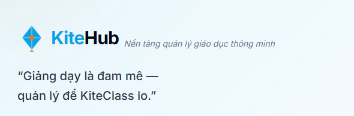

giải thích cho tôi các 12 gap candidates mới + 11 gaps unscheduled + 4 plan-alignment issues.

sử dụng prompt mới như thế nào, sẽ làm được những gì? commit hết các file changing để bắt đầu session mới

1. các gaps này có bị trùng với gaps đã có không, kiểm tra lại 1 lượt
2.  Meta-P2    │ GAP-196 │ 9router tool ADR  => gaps này bỏ đi, không có hiệu quả với dự án nhỉ

GAP-190 │ KiteHub SEO + marketing site
=> gaps phải dựa trên tình trạng của hệ thống hiện tại, đã check status thực sự của gaps này chưa

lưu memory và update skills để tránh sai lầm khi tạo gaps, tăng effort

mô phỏng để check gaps trong workflow tương tự và fix luôn

sync action-2 lên remote:

Bây giờ có 1 task cực kỳ quan trọng, làm báo cáo đồ án tốt nghiệp cho dự án này => cover release 2, cần draft plan trước:

1. đổi với skill tạo file docx đồ án, đọc lại các thư mục liên quan đến báo cáo như: documents/07-archived/academic/word-reports, các skills, rules về tạo báo cáo

2. Đối với cấu trúc của file đồ án, đọc ảnh: documents/07-archived/khung-bc-do-an.png (move vào folder đúng), thiết định rule: đối với toàn bộ docx đồ án, nhưng ngoại trừ phụ lục như manual, evidence triển khai, evidence end-user thì không quá 60 trang. Ghi nhớ: max 60 trang

3. Riêng đề tài này có các lưu ý về đồ án như sau:
- xác định kế hoạch dùng thử: 2 giáo viên đơn lẻ, 2 loại business: trial, vip => đây là mời beta-user => chưa có evidence nhưng phải có kế hoạch
- cần tạo tài liệu manual hệ thống: pdf, video => pdf đang tạo ở wave 92 => chưa confirm
- thu thập dữ liệu phản hồi: evidence, log, bản nhận xét, ký tên(quan trọng) => chưa có dữ liệu thật, nhưng cần có đánh giá luôn trong báo cáo => bổ sung phụ lục sau
- chương 1: xác định bài toàn(luật) công nghệ, công cụ => sử dụng toàn bộ dữ liệu từ documents => trích dẫn tài liệu tham khảo thật, đúng chuẩn
- chương 2: yêu cầu chức năng, phi chức năng => từ dữ liệu documents cần viết lại đúng theo chuẩn báo cáo đồ án
- chương 2: kiến trúc, nhóm nghiệp vụ, nghiệp vụ chính => đối với kiến trúc và nhóm nghiệp vụ thì cần trình bày đủ trong báo cáo, nhưng đối với cụ thể thì cần chọn các nghiệp vụ chính để trình bày như SAAS, B-learning => không trình bày tất cả nghiệp vụ
- chương 3: lập trình - Đại diện 1 vài thao tác => chương này cũng chỉ nên ý chính vì dự án lớn, không nêu hết được => chương ngắn nhất
- chương 4: Triển khai: cách triển khai trên cloud, cho user, kết quả sử dụng => đây là chương quan trọng nhất trong đồ án và là điểm ăn tiền nhất của dự án => cần trình bày hết dữ liệu
- thiết kế hoàn thiện giao diện theo tiêu chuẩn => chốt báo cáo sẽ là bản release 2 nên sẽ có UI /UX theo chuẩn UI kits
- hoàn thiện code cho các loại đối tượng khác => business đầy đủ, code đầy đủ có các loại đối tượng P
- hoàn thiện tích hợp AI vào hệ thống => có tích hợp AI
- release thành công bản v2.0.0 => chốt bản sẽ báo cáo

4. Đối với các inside của dev:
- trong báo cáo không được đề cập đến các dữ liệu không chuẩn báo cáo cửa dự án như GAP ID, wave, ... => giảng viên không nhận các dạng dữ liệu kiểu này
- cần có folder riêng chưa ID các ảnh sẽ có trong báo cáo => tự tạo các diagram phục vụ chương 1,2,3,4 như BRD, ERD, AWS diagram, ... => các ảnh chụp FE, dùng tools chụp, ...
=> mục tiêu là dev không phải sửa bằng tay
- tuyệt đối không đề cập đến claude trong đồ án
- thông tin cá nhân của dev đã được lưu ở các folder cũ, cụ thể là đề cương, cần tìm hiểu đầy đủ, không để các dữ liệu raw
- cần focus theo khung đề cương mà code thực tế, không vẽ feature chưa có trong kế hoạch của release 2

Vậy cần bổ sung thêm outside

À, đáng ra phải chốt plan của release 2 trước rồi mới chốt được plan thesis nhỉ?

vậy bỏ việc move file vào closed và partial đi, chỉ phân loại theo phase thì sao?

PR 3 làm gì? Có nên quét lại 1 lượt các gaps để xem chúng có bị outdated, cần update theo inside mới, có thể closed được hay không => tối ưu agents

tại sao audit lại vẫn bắt được nhiều gaps như vậy => cần cập nhật meta không?

discuss: tạo agents quét lại toàn bộ báo cáo trong documents/02-architecture để xử lý các vấn đề sau:
1. lỗi render diagram: documents/02-architecture/multi-tenant-architecture.md => Section 2 — Tenant lifecycle: Parse error on line 2:
...L: signup (TR-01: 14 ngày)    TRIAL
-----------------------^
Expecting 'SPACE', 'NL', 'HIDE_EMPTY', 'scale', 'COMPOSIT_STATE', 'STRUCT_STOP', 'STATE_DESCR', 'ID', 'FORK', 'JOIN', 'CHOICE', 'CONCURRENT', 'note', 'acc_title', 'acc_descr', 'acc_descr_multiline_value', 'CLICK', 'classDef', 'style', 'class', 'direction_tb', 'direction_bt', 'direction_rl', 'direction_lr', 'EDGE_STATE', got 'DESCR'

2. check lại các báo cáo cũ xem có bị outdated hay không và cập nhật nội dung + diagram theo rule mới
3. có báo cáo về phân bổ và thiết kế database của toàn dự án chưa? có báo cáo về sự khác biệt giữa user của các gói đăng ký chưa? thực hiện tạo nếu chưa có
4. bạn có đề xuất cần thêm các báo cáo nào không? cho dev hiểu rõ hơn về hệ thống

Tài liệu trong documents/02-architecture  và để cho claude và dev đều đọc được đúng không, vậy nó có vấn đề:
1. cho claude đọc thì vẫn có tiếng việt
2. cho dev đọc thì không chuẩn rule ngôn ngữ

1. check lại việc tạo account mới, free credits 100 đô của account này đang sử dụng hết gần 60 đô rồi, tôi có 1 thẻ khác có thể tạo acc aws với định danh khác Thuy Duong để tiếp tục tận dụng 100 đô credit mới => liệu có hợp lý
2. việc có acc aws mới sẽ dẫn đến công số sửa documents, vậy nên có kế hoạch sửa luôn việc hard code id, giống như code java vậy, md cũng có tham chiếu biến đúng không? sau này mở rộng thì sẽ có thêm môi trường aws test, v1, v2, ... nên sửa để theo biến tham chiếu luôn => check cả các dữ liệu khác cần tham chiếu
3. việc rebuild lại trên aws, cần có kế hoạch rõ ràng, làm sao lên nhanh nhất mà không mắc phải nhiều lỗi deploy cũ như self-test frontend không lên, DNS routing sai, ... => đưa ra được quy trình triển khai hoàn hảo hơn
4. việc đưa lại lên aws mới để user có thể beta được ngay, nên quyết định sẽ phải self-test full ở local xong (với docker-desktop) mới lên aws có hợp lý không => dev vẫn chưa self-test được

để dự án đạt được tiêu chí self-test thì cần có kế hoạch fix những gaps nào => điều tra và tạo kế hoạch, mục tiêu là có thể self-test sớm nhất

1. vẫn còn các note thừa như: (Bấm Ctrl+A rồi F9 trong Word để cập nhật mục lục)
2. chưa check lại mục lục, danh mục sau khi render

lưu lại inside này để sửa và checklist

1. documents/image-2.png: DANH MỤC BẢNG BIỂU chưa page break
caption của hình vẽ quá dài => tại sao không tự bắt được bug này
2. 1.3 Công nghệ và công cụ sử dụng => bỏ phần này, không cần thiết
3. documents/image-3.png => 2 sơ đồ dạng ngang nên bé, khó nhìn, cần tối ưu lại
4. documents/image-4.png => ảnh được paste nguyên khi render docx, chưa căn chỉnh cho hợp lý, khớp trang, dễ nhìn => áp dụng lại với tất cả các ảnh
5. documents/image-5.png => tương tự, hình Hình 2.49. Luồng xác thực JWT và truyền ngữ cảnh tenant quá bé trong trang a4, cân nhắc vẽ dạng khác hoặc căn chỉnh hợp lý
6. 4.3 KPI Metrics + Measurement Plan và 4.4 Beta Tenant Scope + Limitations đã chốt bỏ đi rồi mà nhỉ
7. KẾT LUẬN VÀ KIẾN NGHỊ => chỉ là KẾT LUẬN thôi

1. ảnh vẫn chưa được apply resize đúng, hãy làm cách nào để check trong docx được render, tự screenshots chẳng hạn
2. ở lời cảm ơn bỏ nội dung: Bên cạnh đó, em xin gửi lời cảm ơn chân thành đến quý thầy cô trong Bộ môn Công nghệ phần mềm và toàn thể giảng viên Khoa Công nghệ thông tin đã nhiệt tình giảng dạy, chia sẻ kinh nghiệm chuyên môn trong suốt bốn năm học, qua đó giúp em xây dựng được tư duy kỹ thuật vững vàng và phương pháp tiếp cận vấn đề có hệ thống — những phẩm chất thiết yếu cho hành trình phát triển nghề nghiệp sau này. => để vừa 1 trang

3. caption của hình vẽ và bảng bị thừa 1 số 1: Hình 1.11. Giao diện trang chủ BeeClass — phần mềm quản lý trung tâm tiếng Anh phổ biến tại Việt Nam, Hình 1.21. Giao diện trang sản phẩm MISA EMIS — sản phẩm B2B phục vụ trường công lập của công ty MISA	10

bây giờ tạo PR mới để sửa thesis tiếp nhé
1. ở session trước đã cập nhật tài liệu kiến trúc về tenant => domain => landing, nói gọi là gì nhỉ? vậy đợt cập nhật kiến trúc này có cần cập nhật vào thesis không
2. tôi thấy chương 4 chưa nói kỹ về phần cấu hình cloudflare, có cần bổ sung không
3. ảnh chương 3 đang sử dụng ảnh từ UI kits, bây giờ đã có evidence thật thì cập nhật vào
4. capture lại ảnh docx, session cũ xóa mất rồi

5. documents/08-thesis/screenshots-render/page-001.png => đường gạch ngang dưới "KHOA CÔNG NGHỆ THÔNG TIN" không khớp với bìa của báo cáo thực tập, check lại
6.
