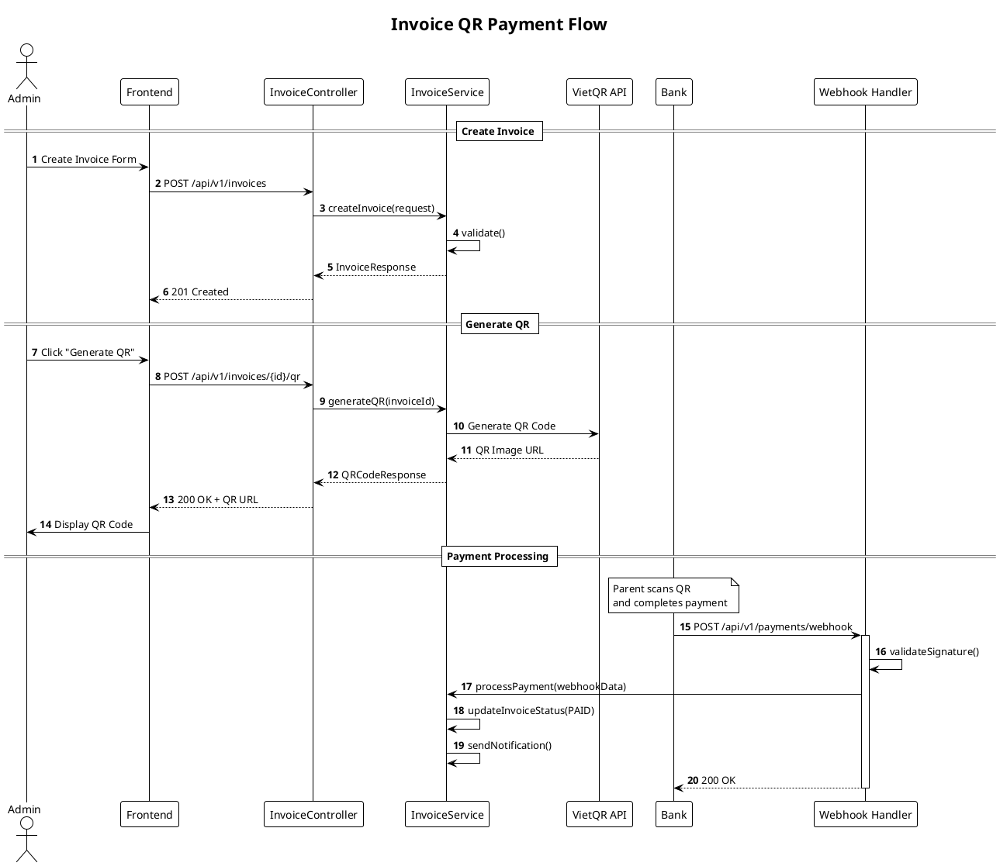

# CHECKLIST PHÁT TRIỂN FEATURE
## KiteClass Platform V3.1

## Thông tin tài liệu

| Thuộc tính | Giá trị |
|------------|---------|
| **Dự án** | KiteClass Platform V3.1 |
| **Loại tài liệu** | Feature Development Checklist |
| **Ngày tạo** | 23/12/2025 |
| **Bắt buộc** | Mọi feature phải hoàn thành checklist này trước khi merge |

---

# MỤC LỤC

1. [Tổng quan quy trình](#1-tổng-quan-quy-trình)
2. [Checklist trước khi code](#2-checklist-trước-khi-code)
3. [Coding Standards](#3-coding-standards)
4. [Comment Guidelines](#4-comment-guidelines)
5. [Design Patterns](#5-design-patterns)
6. [Checklist trong khi code](#6-checklist-trong-khi-code)
7. [Test Script Requirements](#7-test-script-requirements)
8. [Implementation & Test Logs](#8-implementation--test-logs)
9. [Warning Policy](#9-warning-policy)
10. [Checklist sau khi code](#10-checklist-sau-khi-code)
11. [Tiêu chí đạt/không đạt](#11-tiêu-chí-đạtkhông-đạt)
12. [Templates](#12-templates)

---

# 1. TỔNG QUAN QUY TRÌNH

## 1.1. Feature Development Workflow

```
┌─────────────────────────────────────────────────────────────────────────────────┐
│                       FEATURE DEVELOPMENT WORKFLOW                               │
├─────────────────────────────────────────────────────────────────────────────────┤
│                                                                                  │
│  ┌─────────┐    ┌─────────┐    ┌─────────┐    ┌─────────┐    ┌─────────┐       │
│  │  PLAN   │───►│  CODE   │───►│  TEST   │───►│ REVIEW  │───►│  MERGE  │       │
│  └─────────┘    └─────────┘    └─────────┘    └─────────┘    └─────────┘       │
│       │              │              │              │              │             │
│       ▼              ▼              ▼              ▼              ▼             │
│  ┌─────────┐    ┌─────────┐    ┌─────────┐    ┌─────────┐    ┌─────────┐       │
│  │Checklist│    │Checklist│    │Checklist│    │Checklist│    │Checklist│       │
│  │ Part 2  │    │ Part 3,4│    │ Part 5  │    │ Part 6  │    │ Part 7  │       │
│  └─────────┘    └─────────┘    └─────────┘    └─────────┘    └─────────┘       │
│                                                                                  │
│  Mỗi phase phải PASS checklist mới được chuyển sang phase tiếp theo             │
│                                                                                  │
└─────────────────────────────────────────────────────────────────────────────────┘
```

## 1.2. Định nghĩa "Feature"

| Loại | Mô tả | Ví dụ |
|------|-------|-------|
| **Feature** | Chức năng mới hoàn chỉnh | Điểm danh, Thanh toán QR |
| **Enhancement** | Cải tiến feature có sẵn | Thêm filter cho danh sách |
| **Bug Fix** | Sửa lỗi | Fix lỗi không gửi được thông báo |
| **Refactor** | Cải thiện code | Tối ưu query, tách service |

**Lưu ý:** Checklist này áp dụng cho **Feature** và **Enhancement**. Bug Fix và Refactor có checklist riêng (simplified).

---

# 2. CHECKLIST TRƯỚC KHI CODE

## 2.1. Design Mapping Checklist

```
┌─────────────────────────────────────────────────────────────────────────────────┐
│                    CHECKLIST: DESIGN MAPPING                                     │
│                    (Bắt buộc hoàn thành trước khi code)                          │
├─────────────────────────────────────────────────────────────────────────────────┤
│                                                                                  │
│  DATABASE DESIGN MAPPING                                                         │
│  ═══════════════════════════════════════════════════════════════════════════    │
│                                                                                  │
│  □ Đã xác định tables liên quan trong database-design.md                         │
│    Tables: _________________________________________________                     │
│                                                                                  │
│  □ Đã review schema và columns cần thiết                                         │
│    - Có cần thêm column mới? □ Có  □ Không                                       │
│    - Có cần thêm table mới? □ Có  □ Không                                        │
│    - Nếu có, đã update database-design.md? □ Đã update                           │
│                                                                                  │
│  □ Đã xác định indexes cần thiết                                                 │
│    Indexes: _________________________________________________                    │
│                                                                                  │
│  □ Đã xác định relationships (FK, constraints)                                   │
│    Relationships: ___________________________________________                    │
│                                                                                  │
│  □ Migration script đã được tạo                                                  │
│    File: migrations/V{version}__{description}.sql                                │
│                                                                                  │
│  ─────────────────────────────────────────────────────────────────────────────  │
│                                                                                  │
│  USE CASE MAPPING                                                                │
│  ═══════════════════════════════════════════════════════════════════════════    │
│                                                                                  │
│  □ Đã xác định Use Case ID trong service-use-cases-v3.md                         │
│    Use Case IDs: ____________________________________________                    │
│                                                                                  │
│  □ Đã hiểu rõ Main Flow của Use Case                                             │
│    Main Flow Summary: _______________________________________                    │
│                                                                                  │
│  □ Đã xác định Alternative Flows cần handle                                      │
│    Alternative Flows: _______________________________________                    │
│                                                                                  │
│  □ Đã xác định Actors liên quan                                                  │
│    Actors: □ CENTER_OWNER  □ CENTER_ADMIN  □ TEACHER                            │
│            □ STUDENT       □ PARENT        □ SYSTEM                              │
│                                                                                  │
│  □ Đã xác định Preconditions và Postconditions                                   │
│    Preconditions: ___________________________________________                    │
│    Postconditions: __________________________________________                    │
│                                                                                  │
│  ─────────────────────────────────────────────────────────────────────────────  │
│                                                                                  │
│  API DESIGN                                                                      │
│  ═══════════════════════════════════════════════════════════════════════════    │
│                                                                                  │
│  □ Đã định nghĩa API endpoints                                                   │
│    | Method | Endpoint            | Description           |                      │
│    |--------|---------------------|----------------------|                      │
│    |        |                     |                      |                      │
│    |        |                     |                      |                      │
│                                                                                  │
│  □ Đã định nghĩa Request/Response DTOs                                           │
│    DTOs: ____________________________________________________                    │
│                                                                                  │
│  □ Đã update OpenAPI spec (nếu có)                                               │
│    File: docs/openapi/_____________________.yaml                                 │
│                                                                                  │
│  ─────────────────────────────────────────────────────────────────────────────  │
│                                                                                  │
│  APPROVAL                                                                        │
│  ═══════════════════════════════════════════════════════════════════════════    │
│                                                                                  │
│  □ Tech Lead đã review và approve design                                         │
│    Approved by: _________________ Date: _________________                        │
│                                                                                  │
└─────────────────────────────────────────────────────────────────────────────────┘
```

## 2.2. Design Mapping Template

```markdown
# Feature Design Document

## Feature Info
- **Feature Name:** [Tên feature]
- **Ticket/Issue:** [JIRA-123]
- **Developer:** [Tên]
- **Start Date:** [DD/MM/YYYY]

## 1. Database Mapping

### Related Tables
| Table | Action | Description |
|-------|--------|-------------|
| `invoices` | READ/WRITE | Tạo và cập nhật hóa đơn |
| `payments` | WRITE | Ghi nhận thanh toán |
| `students` | READ | Lấy thông tin học viên |

### New/Modified Columns
```sql
-- Nếu có thêm column mới
ALTER TABLE invoices ADD COLUMN qr_code_url TEXT;
```

### Indexes Needed
```sql
CREATE INDEX idx_invoices_qr ON invoices(qr_code_url) WHERE qr_code_url IS NOT NULL;
```

## 2. Use Case Mapping

### Primary Use Case
- **ID:** UC-BILL-05
- **Name:** Thanh toán bằng QR Code
- **Document:** service-use-cases-v3.md (Line 1200-1250)

### Main Flow
1. Admin tạo hóa đơn
2. Hệ thống generate QR code (VietQR)
3. Phụ huynh scan QR và thanh toán
4. Webhook nhận callback từ bank
5. Hệ thống cập nhật trạng thái

### Alternative Flows
- 4a. Timeout - QR hết hạn
- 4b. Payment failed - Thông báo lỗi

## 3. API Design

### Endpoints
| Method | Endpoint | Description |
|--------|----------|-------------|
| POST | `/api/v1/invoices/{id}/qr` | Generate QR code |
| POST | `/api/v1/payments/webhook` | Payment callback |
| GET | `/api/v1/invoices/{id}/payment-status` | Check status |

### DTOs
- `GenerateQRRequest`
- `GenerateQRResponse`
- `PaymentWebhookRequest`
```

---

# 3. CODING STANDARDS

## 3.1. Java Backend Standards

### 3.1.1. Code Style Guide

```
┌─────────────────────────────────────────────────────────────────────────────────┐
│                       JAVA CODE STYLE GUIDE                                      │
├─────────────────────────────────────────────────────────────────────────────────┤
│                                                                                  │
│  STYLE GUIDE: Google Java Style Guide + Custom Rules                             │
│  FORMATTER: google-java-format                                                   │
│  LINTER: Checkstyle + SpotBugs + PMD                                             │
│                                                                                  │
│  ─────────────────────────────────────────────────────────────────────────────  │
│                                                                                  │
│  NAMING CONVENTIONS                                                              │
│  ═══════════════════════════════════════════════════════════════════════════    │
│                                                                                  │
│  Classes:        PascalCase           StudentService, PaymentController          │
│  Interfaces:     PascalCase           StudentRepository, PaymentGateway          │
│  Methods:        camelCase            findByEmail(), processPayment()            │
│  Variables:      camelCase            studentName, totalAmount                   │
│  Constants:      SCREAMING_SNAKE      MAX_RETRY_COUNT, DEFAULT_PAGE_SIZE         │
│  Packages:       lowercase            com.kiteclass.billing.service              │
│  Test Classes:   *Test                StudentServiceTest                         │
│  Test Methods:   should_*_when_*      should_ThrowException_when_EmailInvalid    │
│                                                                                  │
│  ─────────────────────────────────────────────────────────────────────────────  │
│                                                                                  │
│  FILE ORGANIZATION                                                               │
│  ═══════════════════════════════════════════════════════════════════════════    │
│                                                                                  │
│  src/main/java/com/kiteclass/{module}/                                           │
│  ├── controller/          # REST Controllers                                     │
│  │   └── StudentController.java                                                  │
│  ├── service/             # Business Logic                                       │
│  │   ├── StudentService.java                                                     │
│  │   └── impl/                                                                   │
│  │       └── StudentServiceImpl.java                                             │
│  ├── repository/          # Data Access                                          │
│  │   └── StudentRepository.java                                                  │
│  ├── entity/              # JPA Entities                                         │
│  │   └── Student.java                                                            │
│  ├── dto/                 # Data Transfer Objects                                │
│  │   ├── request/                                                                │
│  │   │   └── CreateStudentRequest.java                                           │
│  │   └── response/                                                               │
│  │       └── StudentResponse.java                                                │
│  ├── mapper/              # Entity <-> DTO Mappers                               │
│  │   └── StudentMapper.java                                                      │
│  ├── exception/           # Custom Exceptions                                    │
│  │   └── StudentNotFoundException.java                                           │
│  └── config/              # Configuration                                        │
│      └── StudentModuleConfig.java                                                │
│                                                                                  │
│  ─────────────────────────────────────────────────────────────────────────────  │
│                                                                                  │
│  CODE RULES                                                                      │
│  ═══════════════════════════════════════════════════════════════════════════    │
│                                                                                  │
│  ✓ Max line length: 120 characters                                               │
│  ✓ Max method length: 30 lines (excluding comments)                              │
│  ✓ Max class length: 500 lines                                                   │
│  ✓ Max parameters: 5 (use Builder/DTO if more)                                   │
│  ✓ Max cyclomatic complexity: 10                                                 │
│  ✓ Indent: 4 spaces (no tabs)                                                    │
│  ✓ Braces: Always use {} even for single-line if/for                             │
│  ✓ Imports: No wildcards (import java.util.*)                                    │
│                                                                                  │
└─────────────────────────────────────────────────────────────────────────────────┘
```

### 3.1.2. Java Code Examples

```java
// ═══════════════════════════════════════════════════════════════════════════
// GOOD EXAMPLES
// ═══════════════════════════════════════════════════════════════════════════

// ✓ Entity - Đúng chuẩn
@Entity
@Table(name = "students")
@Getter
@Setter
@NoArgsConstructor
@AllArgsConstructor
@Builder
public class Student {

    @Id
    @GeneratedValue(strategy = GenerationType.IDENTITY)
    private Long id;

    @Column(nullable = false, length = 100)
    private String firstName;

    @Column(nullable = false, length = 100)
    private String lastName;

    @Column(nullable = false, unique = true)
    private String email;

    @Enumerated(EnumType.STRING)
    @Column(nullable = false)
    private StudentStatus status;

    @CreatedDate
    @Column(nullable = false, updatable = false)
    private LocalDateTime createdAt;

    @LastModifiedDate
    private LocalDateTime updatedAt;

    // Business method - đặt trong Entity nếu logic đơn giản
    public String getFullName() {
        return firstName + " " + lastName;
    }
}

// ✓ DTO - Dùng Record (Java 17+)
public record CreateStudentRequest(
    @NotBlank(message = "First name is required")
    @Size(max = 100)
    String firstName,

    @NotBlank(message = "Last name is required")
    @Size(max = 100)
    String lastName,

    @NotBlank(message = "Email is required")
    @Email(message = "Invalid email format")
    String email,

    @Pattern(regexp = "^[0-9]{10}$", message = "Phone must be 10 digits")
    String phone
) {}

// ✓ Service - Clean Architecture
@Service
@RequiredArgsConstructor
@Transactional(readOnly = true)
@Slf4j
public class StudentService {

    private final StudentRepository studentRepository;
    private final StudentMapper studentMapper;
    private final ApplicationEventPublisher eventPublisher;

    public StudentResponse getById(Long id) {
        Student student = studentRepository.findById(id)
            .orElseThrow(() -> new StudentNotFoundException(id));
        return studentMapper.toResponse(student);
    }

    @Transactional
    public StudentResponse create(CreateStudentRequest request) {
        log.info("Creating student with email: {}", request.email());

        // Validate business rules
        validateEmailUnique(request.email());

        // Map and save
        Student student = studentMapper.toEntity(request);
        student.setStatus(StudentStatus.ACTIVE);
        student = studentRepository.save(student);

        // Publish event
        eventPublisher.publishEvent(new StudentCreatedEvent(student));

        log.info("Student created with id: {}", student.getId());
        return studentMapper.toResponse(student);
    }

    private void validateEmailUnique(String email) {
        if (studentRepository.existsByEmail(email)) {
            throw new DuplicateEmailException(email);
        }
    }
}

// ✓ Controller - RESTful
@RestController
@RequestMapping("/api/v1/students")
@RequiredArgsConstructor
@Tag(name = "Students", description = "Student management APIs")
public class StudentController {

    private final StudentService studentService;

    @GetMapping("/{id}")
    @Operation(summary = "Get student by ID")
    public ResponseEntity<StudentResponse> getById(
            @PathVariable @Positive Long id) {
        return ResponseEntity.ok(studentService.getById(id));
    }

    @PostMapping
    @Operation(summary = "Create new student")
    @PreAuthorize("hasAnyRole('CENTER_OWNER', 'CENTER_ADMIN')")
    public ResponseEntity<StudentResponse> create(
            @Valid @RequestBody CreateStudentRequest request) {
        StudentResponse response = studentService.create(request);
        URI location = URI.create("/api/v1/students/" + response.id());
        return ResponseEntity.created(location).body(response);
    }

    @GetMapping
    @Operation(summary = "Get students with pagination")
    public ResponseEntity<Page<StudentResponse>> getAll(
            @RequestParam(required = false) String search,
            @PageableDefault(size = 20, sort = "createdAt,desc") Pageable pageable) {
        return ResponseEntity.ok(studentService.findAll(search, pageable));
    }
}

// ═══════════════════════════════════════════════════════════════════════════
// BAD EXAMPLES (KHÔNG LÀM)
// ═══════════════════════════════════════════════════════════════════════════

// ✗ Service quá dài, logic lẫn lộn
@Service
public class BadStudentService {
    public StudentResponse create(CreateStudentRequest request) {
        // ✗ Validation trong service - nên dùng @Valid
        if (request.getFirstName() == null || request.getFirstName().isEmpty()) {
            throw new RuntimeException("First name required"); // ✗ Generic exception
        }

        // ✗ Magic strings
        Student s = new Student();
        s.setStatus("ACTIVE"); // ✗ Nên dùng Enum

        // ✗ System.out thay vì Logger
        System.out.println("Created student");

        // ✗ Return null thay vì throw exception
        return null;
    }
}
```

## 3.2. TypeScript/React Frontend Standards

### 3.2.1. Code Style Guide

```
┌─────────────────────────────────────────────────────────────────────────────────┐
│                    TYPESCRIPT/REACT CODE STYLE GUIDE                             │
├─────────────────────────────────────────────────────────────────────────────────┤
│                                                                                  │
│  STYLE GUIDE: Airbnb JavaScript Style Guide + Custom Rules                       │
│  FORMATTER: Prettier                                                             │
│  LINTER: ESLint + typescript-eslint                                              │
│                                                                                  │
│  ─────────────────────────────────────────────────────────────────────────────  │
│                                                                                  │
│  NAMING CONVENTIONS                                                              │
│  ═══════════════════════════════════════════════════════════════════════════    │
│                                                                                  │
│  Components:     PascalCase           StudentCard, PaymentForm                   │
│  Hooks:          camelCase (use*)     useStudents, useAuth                       │
│  Functions:      camelCase            handleSubmit, formatDate                   │
│  Variables:      camelCase            studentName, isLoading                     │
│  Constants:      SCREAMING_SNAKE      API_BASE_URL, MAX_FILE_SIZE                │
│  Types/Interfaces: PascalCase         Student, CreateStudentRequest              │
│  Files:          kebab-case           student-card.tsx, use-students.ts          │
│  Test Files:     *.test.ts(x)         student-card.test.tsx                      │
│                                                                                  │
│  ─────────────────────────────────────────────────────────────────────────────  │
│                                                                                  │
│  FILE ORGANIZATION                                                               │
│  ═══════════════════════════════════════════════════════════════════════════    │
│                                                                                  │
│  src/                                                                            │
│  ├── app/                    # Next.js App Router                                │
│  │   ├── (auth)/                                                                 │
│  │   ├── (dashboard)/                                                            │
│  │   └── api/                                                                    │
│  ├── components/             # Reusable components                               │
│  │   ├── ui/                 # Base UI (Shadcn)                                  │
│  │   ├── forms/              # Form components                                   │
│  │   └── features/           # Feature-specific components                       │
│  │       └── students/                                                           │
│  │           ├── student-card.tsx                                                │
│  │           ├── student-form.tsx                                                │
│  │           └── index.ts                                                        │
│  ├── hooks/                  # Custom hooks                                      │
│  │   ├── use-students.ts                                                         │
│  │   └── use-auth.ts                                                             │
│  ├── lib/                    # Utilities                                         │
│  │   ├── api-client.ts                                                           │
│  │   ├── utils.ts                                                                │
│  │   └── validations.ts                                                          │
│  ├── types/                  # TypeScript types                                  │
│  │   ├── student.ts                                                              │
│  │   └── api.ts                                                                  │
│  └── stores/                 # State management                                  │
│      └── auth-store.ts                                                           │
│                                                                                  │
│  ─────────────────────────────────────────────────────────────────────────────  │
│                                                                                  │
│  CODE RULES                                                                      │
│  ═══════════════════════════════════════════════════════════════════════════    │
│                                                                                  │
│  ✓ Max line length: 100 characters                                               │
│  ✓ Max component length: 200 lines                                               │
│  ✓ Max hook length: 100 lines                                                    │
│  ✓ Indent: 2 spaces                                                              │
│  ✓ Quotes: Single quotes for JS, double for JSX attributes                       │
│  ✓ Semicolons: Required                                                          │
│  ✓ Trailing comma: Always                                                        │
│  ✓ Props: Destructure in function signature                                      │
│  ✓ Exports: Named exports (no default export except pages)                       │
│                                                                                  │
└─────────────────────────────────────────────────────────────────────────────────┘
```

### 3.2.2. TypeScript/React Code Examples

```typescript
// ═══════════════════════════════════════════════════════════════════════════
// GOOD EXAMPLES
// ═══════════════════════════════════════════════════════════════════════════

// ✓ Types - types/student.ts
export interface Student {
  id: number;
  firstName: string;
  lastName: string;
  email: string;
  status: StudentStatus;
  createdAt: string;
}

export type StudentStatus = 'active' | 'inactive' | 'suspended';

export interface CreateStudentRequest {
  firstName: string;
  lastName: string;
  email: string;
  phone?: string;
}

export interface StudentResponse {
  data: Student;
  message?: string;
}

// ✓ Custom Hook - hooks/use-students.ts
import { useQuery, useMutation, useQueryClient } from '@tanstack/react-query';
import { apiClient } from '@/lib/api-client';
import type { Student, CreateStudentRequest } from '@/types/student';

export function useStudents(classId?: number) {
  return useQuery({
    queryKey: ['students', { classId }],
    queryFn: async () => {
      const params = classId ? `?classId=${classId}` : '';
      const response = await apiClient.get<Student[]>(`/students${params}`);
      return response.data;
    },
    staleTime: 5 * 60 * 1000,
  });
}

export function useCreateStudent() {
  const queryClient = useQueryClient();

  return useMutation({
    mutationFn: (data: CreateStudentRequest) =>
      apiClient.post<Student>('/students', data),
    onSuccess: () => {
      queryClient.invalidateQueries({ queryKey: ['students'] });
    },
  });
}

// ✓ Component - components/features/students/student-card.tsx
import { Card, CardHeader, CardTitle, CardContent } from '@/components/ui/card';
import { Badge } from '@/components/ui/badge';
import { Button } from '@/components/ui/button';
import type { Student } from '@/types/student';

interface StudentCardProps {
  student: Student;
  onEdit?: (student: Student) => void;
  onDelete?: (id: number) => void;
}

export function StudentCard({ student, onEdit, onDelete }: StudentCardProps) {
  const statusVariant = student.status === 'active' ? 'default' : 'secondary';

  const handleEdit = () => {
    onEdit?.(student);
  };

  const handleDelete = () => {
    if (window.confirm('Bạn có chắc muốn xóa?')) {
      onDelete?.(student.id);
    }
  };

  return (
    <Card className="hover:shadow-md transition-shadow">
      <CardHeader className="flex flex-row items-center justify-between pb-2">
        <CardTitle className="text-lg font-medium">
          {student.firstName} {student.lastName}
        </CardTitle>
        <Badge variant={statusVariant}>
          {student.status === 'active' ? 'Đang học' : 'Tạm nghỉ'}
        </Badge>
      </CardHeader>
      <CardContent>
        <p className="text-sm text-muted-foreground">{student.email}</p>
        <div className="mt-4 flex gap-2">
          <Button variant="outline" size="sm" onClick={handleEdit}>
            Chỉnh sửa
          </Button>
          <Button variant="destructive" size="sm" onClick={handleDelete}>
            Xóa
          </Button>
        </div>
      </CardContent>
    </Card>
  );
}

// ✓ Form Component with Validation - components/features/students/student-form.tsx
import { useForm } from 'react-hook-form';
import { zodResolver } from '@hookform/resolvers/zod';
import { z } from 'zod';
import { Button } from '@/components/ui/button';
import { Input } from '@/components/ui/input';
import {
  Form,
  FormControl,
  FormField,
  FormItem,
  FormLabel,
  FormMessage,
} from '@/components/ui/form';

const studentFormSchema = z.object({
  firstName: z.string().min(1, 'Họ là bắt buộc').max(100),
  lastName: z.string().min(1, 'Tên là bắt buộc').max(100),
  email: z.string().email('Email không hợp lệ'),
  phone: z.string().regex(/^[0-9]{10}$/, 'SĐT phải có 10 số').optional(),
});

type StudentFormValues = z.infer<typeof studentFormSchema>;

interface StudentFormProps {
  defaultValues?: Partial<StudentFormValues>;
  onSubmit: (data: StudentFormValues) => void;
  isLoading?: boolean;
}

export function StudentForm({
  defaultValues,
  onSubmit,
  isLoading,
}: StudentFormProps) {
  const form = useForm<StudentFormValues>({
    resolver: zodResolver(studentFormSchema),
    defaultValues: {
      firstName: '',
      lastName: '',
      email: '',
      phone: '',
      ...defaultValues,
    },
  });

  return (
    <Form {...form}>
      <form onSubmit={form.handleSubmit(onSubmit)} className="space-y-4">
        <div className="grid grid-cols-2 gap-4">
          <FormField
            control={form.control}
            name="firstName"
            render={({ field }) => (
              <FormItem>
                <FormLabel>Họ</FormLabel>
                <FormControl>
                  <Input placeholder="Nguyễn" {...field} />
                </FormControl>
                <FormMessage />
              </FormItem>
            )}
          />
          <FormField
            control={form.control}
            name="lastName"
            render={({ field }) => (
              <FormItem>
                <FormLabel>Tên</FormLabel>
                <FormControl>
                  <Input placeholder="Văn A" {...field} />
                </FormControl>
                <FormMessage />
              </FormItem>
            )}
          />
        </div>

        <FormField
          control={form.control}
          name="email"
          render={({ field }) => (
            <FormItem>
              <FormLabel>Email</FormLabel>
              <FormControl>
                <Input type="email" placeholder="email@example.com" {...field} />
              </FormControl>
              <FormMessage />
            </FormItem>
          )}
        />

        <Button type="submit" disabled={isLoading}>
          {isLoading ? 'Đang lưu...' : 'Lưu'}
        </Button>
      </form>
    </Form>
  );
}
```

## 3.3. Coding Standards Checklist

```
┌─────────────────────────────────────────────────────────────────────────────────┐
│                    CHECKLIST: CODING STANDARDS                                   │
├─────────────────────────────────────────────────────────────────────────────────┤
│                                                                                  │
│  BACKEND (Java/Spring)                                                           │
│  ═══════════════════════════════════════════════════════════════════════════    │
│                                                                                  │
│  □ Đã chạy `mvn spotless:apply` (auto-format)                                    │
│  □ Đã chạy `mvn checkstyle:check` - 0 violations                                 │
│  □ Đã chạy `mvn spotbugs:check` - 0 bugs                                         │
│  □ Naming conventions đúng chuẩn                                                 │
│  □ Không có magic numbers/strings                                                │
│  □ Có JavaDoc cho public methods                                                 │
│  □ Exceptions được handle đúng cách                                              │
│  □ Logging có đầy đủ (INFO cho business events, DEBUG cho details)               │
│  □ Không có System.out.println()                                                 │
│  □ Không có @SuppressWarnings không cần thiết                                    │
│                                                                                  │
│  FRONTEND (TypeScript/React)                                                     │
│  ═══════════════════════════════════════════════════════════════════════════    │
│                                                                                  │
│  □ Đã chạy `npm run lint` - 0 errors                                             │
│  □ Đã chạy `npm run format` (Prettier)                                           │
│  □ Đã chạy `npm run type-check` - 0 errors                                       │
│  □ Không có `any` type (trừ khi thực sự cần)                                     │
│  □ Props có TypeScript interface                                                 │
│  □ Custom hooks extract logic từ components                                      │
│  □ Không có console.log (trừ development)                                        │
│  □ Components < 200 lines                                                        │
│  □ Có error boundaries cho async operations                                      │
│                                                                                  │
└─────────────────────────────────────────────────────────────────────────────────┘
```

---

# 4. COMMENT GUIDELINES

## 4.1. Quy tắc Comment chung

```
┌─────────────────────────────────────────────────────────────────────────────────┐
│                       COMMENT GUIDELINES                                         │
├─────────────────────────────────────────────────────────────────────────────────┤
│                                                                                  │
│  NGUYÊN TẮC CƠ BẢN                                                               │
│  ═══════════════════════════════════════════════════════════════════════════    │
│                                                                                  │
│  ✓ Comment giải thích WHY (tại sao), KHÔNG giải thích WHAT (làm gì)              │
│  ✓ Code tốt = tự giải thích → ít cần comment                                     │
│  ✓ Đặt tên biến/function rõ ràng thay vì comment giải thích                      │
│  ✓ Comment phải cập nhật khi code thay đổi                                       │
│  ✓ Viết bằng tiếng Anh để đồng nhất với code                                     │
│                                                                                  │
│  LOẠI COMMENT BẮT BUỘC                                                           │
│  ═══════════════════════════════════════════════════════════════════════════    │
│                                                                                  │
│  1. Class/Interface Header    - Mô tả mục đích của class                         │
│  2. Public API Methods        - JavaDoc/JSDoc cho methods public                 │
│  3. Complex Business Logic    - Giải thích logic phức tạp                        │
│  4. Workarounds/Hacks         - Giải thích tại sao cần workaround                │
│  5. TODO/FIXME                - Công việc còn thiếu (với ticket ID)              │
│  6. Algorithm Explanation     - Giải thích thuật toán phức tạp                   │
│                                                                                  │
│  LOẠI COMMENT KHÔNG NÊN                                                          │
│  ═══════════════════════════════════════════════════════════════════════════    │
│                                                                                  │
│  ✗ Comment giải thích code hiển nhiên                                            │
│  ✗ Commented-out code (xóa đi, Git đã lưu)                                       │
│  ✗ Journal comments (ai sửa gì khi nào - Git log có)                             │
│  ✗ Closing brace comments  // end if                                             │
│  ✗ Noise comments  // constructor, // getter                                     │
│                                                                                  │
└─────────────────────────────────────────────────────────────────────────────────┘
```

## 4.2. Java Comment Standards

```java
// ═══════════════════════════════════════════════════════════════════════════
// CLASS HEADER - BẮT BUỘC cho mọi class/interface
// ═══════════════════════════════════════════════════════════════════════════

/**
 * Manages invoice lifecycle including creation, payment processing, and QR code generation.
 *
 * <p>This service handles all billing operations for a center, integrating with
 * VietQR for payment processing and sending notifications upon payment completion.</p>
 *
 * <h3>Key responsibilities:</h3>
 * <ul>
 *   <li>Create and manage invoices for students</li>
 *   <li>Generate VietQR payment codes</li>
 *   <li>Process payment webhooks from banks</li>
 *   <li>Send payment confirmation notifications</li>
 * </ul>
 *
 * @author KiteClass Team
 * @since 1.0.0
 * @see PaymentService
 * @see InvoiceRepository
 */
@Service
@Slf4j
public class InvoiceService {
    // ...
}

// ═══════════════════════════════════════════════════════════════════════════
// METHOD JAVADOC - BẮT BUỘC cho public methods
// ═══════════════════════════════════════════════════════════════════════════

/**
 * Creates a new invoice for a student's class enrollment.
 *
 * <p>The invoice is created with PENDING status and includes all specified line items.
 * A notification is sent to the parent's registered contact.</p>
 *
 * @param request the invoice creation request containing student, class, and line items
 * @return the created invoice with generated ID and QR code URL
 * @throws StudentNotFoundException if the student does not exist
 * @throws ClassNotFoundException if the class does not exist
 * @throws DuplicateInvoiceException if an unpaid invoice already exists for the same period
 */
@Transactional
public InvoiceResponse createInvoice(CreateInvoiceRequest request) {
    // ...
}

// ═══════════════════════════════════════════════════════════════════════════
// INLINE COMMENTS - Chỉ khi cần giải thích WHY
// ═══════════════════════════════════════════════════════════════════════════

public void processPayment(PaymentWebhookRequest request) {
    // Validate signature first to prevent replay attacks
    // Bank requires HMAC-SHA256 with timestamp within 5 minutes
    validateWebhookSignature(request);

    Invoice invoice = findInvoice(request.getInvoiceId());

    // Use pessimistic lock to prevent double processing
    // when multiple webhook retries arrive simultaneously
    invoice = invoiceRepository.findByIdWithLock(invoice.getId());

    if (invoice.isPaid()) {
        // Already processed - bank may send duplicate webhooks
        // Log but don't throw error to return 200 to bank
        log.warn("Duplicate payment webhook for invoice: {}", invoice.getId());
        return;
    }

    // Amount in webhook is in VND cents, convert to VND
    BigDecimal amount = request.getAmount().divide(BigDecimal.valueOf(100));

    invoice.markAsPaid(amount);
}

// ═══════════════════════════════════════════════════════════════════════════
// TODO/FIXME COMMENTS - Phải có ticket ID
// ═══════════════════════════════════════════════════════════════════════════

// TODO(KITE-456): Implement retry mechanism for failed notifications
// Current: fails silently, needs dead letter queue

// FIXME(KITE-789): Race condition when concurrent payments
// Temporary: using synchronized, need distributed lock

// HACK(KITE-101): VietQR API returns inconsistent date format
// Remove after they fix their API (ETA: Q2 2025)

// ═══════════════════════════════════════════════════════════════════════════
// BAD COMMENTS - KHÔNG LÀM
// ═══════════════════════════════════════════════════════════════════════════

// ✗ Obvious comment
// Get the student
Student student = studentRepository.findById(id);

// ✗ Journal comment
// Modified by John on 2025-01-15 to fix bug

// ✗ Commented-out code
// if (oldLogic) {
//     doOldThing();
// }

// ✗ Noise comment
// Default constructor
public InvoiceService() {}
```

## 4.3. TypeScript/React Comment Standards

```typescript
// ═══════════════════════════════════════════════════════════════════════════
// FILE HEADER - Cho complex utility files
// ═══════════════════════════════════════════════════════════════════════════

/**
 * @fileoverview API client utilities for KiteClass platform.
 *
 * Provides a configured axios instance with:
 * - Automatic token injection
 * - Response error handling
 * - Request/response logging in development
 *
 * @module lib/api-client
 */

// ═══════════════════════════════════════════════════════════════════════════
// FUNCTION JSDOC - Cho exported functions và hooks
// ═══════════════════════════════════════════════════════════════════════════

/**
 * Custom hook for managing student data with optimistic updates.
 *
 * @example
 * ```tsx
 * const { students, isLoading, createStudent } = useStudents(classId);
 *
 * await createStudent({ firstName: 'John', lastName: 'Doe' });
 * ```
 *
 * @param classId - Optional class ID to filter students
 * @returns Object containing students data and mutation functions
 */
export function useStudents(classId?: number) {
  // ...
}

/**
 * Formats a date for display in Vietnamese locale.
 *
 * @param date - The date to format (Date object or ISO string)
 * @param format - Output format: 'short' (01/01/2025), 'long' (01 tháng 1, 2025)
 * @returns Formatted date string in Vietnamese
 *
 * @example
 * formatDate(new Date(), 'short') // '23/12/2025'
 * formatDate('2025-01-01', 'long') // '01 tháng 1, 2025'
 */
export function formatDate(
  date: Date | string,
  format: 'short' | 'long' = 'short'
): string {
  // ...
}

// ═══════════════════════════════════════════════════════════════════════════
// COMPONENT JSDOC - Cho reusable components
// ═══════════════════════════════════════════════════════════════════════════

/**
 * Displays a student card with status badge and action buttons.
 *
 * @component
 * @example
 * ```tsx
 * <StudentCard
 *   student={student}
 *   onEdit={(s) => openEditModal(s)}
 *   onDelete={(id) => confirmDelete(id)}
 * />
 * ```
 */
export function StudentCard({ student, onEdit, onDelete }: StudentCardProps) {
  // ...
}

// ═══════════════════════════════════════════════════════════════════════════
// INLINE COMMENTS - Giải thích logic phức tạp
// ═══════════════════════════════════════════════════════════════════════════

export function useInfiniteStudents(classId: number) {
  return useInfiniteQuery({
    queryKey: ['students', 'infinite', classId],
    queryFn: async ({ pageParam = 0 }) => {
      const response = await apiClient.get<PaginatedResponse<Student>>(
        `/students?classId=${classId}&page=${pageParam}&size=20`
      );
      return response.data;
    },
    getNextPageParam: (lastPage) => {
      // API returns page object with totalPages
      // Return undefined when on last page to stop fetching
      if (lastPage.page.number >= lastPage.page.totalPages - 1) {
        return undefined;
      }
      return lastPage.page.number + 1;
    },
    // Keep previous data visible while fetching next page
    // Prevents content flash during pagination
    keepPreviousData: true,
  });
}

// ═══════════════════════════════════════════════════════════════════════════
// TYPE DOCUMENTATION
// ═══════════════════════════════════════════════════════════════════════════

/**
 * Represents a student in the KiteClass system.
 *
 * @property id - Unique identifier
 * @property status - Current enrollment status
 * @property enrolledAt - Date when student joined the class
 */
export interface Student {
  id: number;
  firstName: string;
  lastName: string;
  email: string;
  status: StudentStatus;
  enrolledAt: string;
}
```

## 4.4. Comment Checklist

```
┌─────────────────────────────────────────────────────────────────────────────────┐
│                    CHECKLIST: CODE COMMENTS                                      │
├─────────────────────────────────────────────────────────────────────────────────┤
│                                                                                  │
│  REQUIRED COMMENTS                                                               │
│  ═══════════════════════════════════════════════════════════════════════════    │
│                                                                                  │
│  □ Mọi class/interface có header comment                                         │
│  □ Mọi public method có JavaDoc/JSDoc                                            │
│  □ Complex business logic có inline comment giải thích WHY                       │
│  □ Workarounds/Hacks có comment với ticket ID                                    │
│  □ TODO/FIXME có ticket ID kèm theo                                              │
│  □ Exported functions/hooks có JSDoc với @example                                │
│                                                                                  │
│  PROHIBITED COMMENTS                                                             │
│  ═══════════════════════════════════════════════════════════════════════════    │
│                                                                                  │
│  □ Không có commented-out code                                                   │
│  □ Không có obvious comments (// get user)                                       │
│  □ Không có journal comments (// modified by X on Y)                             │
│  □ Không có TODO/FIXME không có ticket ID                                        │
│                                                                                  │
│  QUALITY CHECK                                                                   │
│  ═══════════════════════════════════════════════════════════════════════════    │
│                                                                                  │
│  □ Comments được viết bằng tiếng Anh                                             │
│  □ Comments đúng ngữ pháp và chính tả                                            │
│  □ Comments sync với code hiện tại                                               │
│  □ JavaDoc có @param, @return, @throws đầy đủ                                    │
│                                                                                  │
└─────────────────────────────────────────────────────────────────────────────────┘
```

---

# 5. DESIGN PATTERNS

## 5.1. Các Pattern Bắt Buộc Sử Dụng

```
┌─────────────────────────────────────────────────────────────────────────────────┐
│                       REQUIRED DESIGN PATTERNS                                   │
├─────────────────────────────────────────────────────────────────────────────────┤
│                                                                                  │
│  BACKEND (Java/Spring Boot)                                                      │
│  ═══════════════════════════════════════════════════════════════════════════    │
│                                                                                  │
│  1. REPOSITORY PATTERN (Bắt buộc)                                                │
│     ├─ Tách data access ra khỏi business logic                                   │
│     ├─ Dùng Spring Data JPA Repository                                           │
│     └─ Custom queries trong @Query hoặc Specification                            │
│                                                                                  │
│  2. SERVICE LAYER PATTERN (Bắt buộc)                                             │
│     ├─ Business logic trong Service classes                                      │
│     ├─ Transaction management tại Service layer                                  │
│     └─ Không có business logic trong Controller                                  │
│                                                                                  │
│  3. DTO PATTERN (Bắt buộc)                                                       │
│     ├─ Không expose Entity ra API                                                │
│     ├─ Dùng Request/Response DTOs                                                │
│     └─ Mapper để convert Entity <-> DTO                                          │
│                                                                                  │
│  4. BUILDER PATTERN (Khuyến nghị)                                                │
│     ├─ Dùng cho objects với nhiều optional fields                                │
│     ├─ @Builder từ Lombok                                                        │
│     └─ Fluent API cho test data creation                                         │
│                                                                                  │
│  5. FACTORY PATTERN (Khi cần)                                                    │
│     ├─ Tạo objects phức tạp với nhiều variations                                 │
│     ├─ Payment gateway factory (VietQR, Momo, VNPay)                             │
│     └─ Notification channel factory (Email, SMS, Push)                           │
│                                                                                  │
│  6. STRATEGY PATTERN (Khi cần)                                                   │
│     ├─ Algorithms có thể swap được                                               │
│     ├─ Pricing strategies (standard, discount, promo)                            │
│     └─ Attendance calculation strategies                                         │
│                                                                                  │
│  7. OBSERVER/EVENT PATTERN (Khuyến nghị)                                         │
│     ├─ Loose coupling giữa modules                                               │
│     ├─ Spring ApplicationEvent                                                   │
│     └─ Ví dụ: StudentCreatedEvent → SendWelcomeEmail                             │
│                                                                                  │
│  ─────────────────────────────────────────────────────────────────────────────  │
│                                                                                  │
│  FRONTEND (React/Next.js)                                                        │
│  ═══════════════════════════════════════════════════════════════════════════    │
│                                                                                  │
│  1. COMPONENT COMPOSITION (Bắt buộc)                                             │
│     ├─ Small, focused components                                                 │
│     ├─ Props drilling tối đa 2 levels                                            │
│     └─ children prop cho flexibility                                             │
│                                                                                  │
│  2. CUSTOM HOOKS PATTERN (Bắt buộc)                                              │
│     ├─ Extract logic ra khỏi components                                          │
│     ├─ useStudents, useAuth, useInvoices                                         │
│     └─ Reusable across components                                                │
│                                                                                  │
│  3. CONTAINER/PRESENTER PATTERN (Khuyến nghị)                                    │
│     ├─ Container: data fetching, state management                                │
│     ├─ Presenter: pure UI, nhận props                                            │
│     └─ Dễ test presenter components                                              │
│                                                                                  │
│  4. COMPOUND COMPONENT PATTERN (Khi cần)                                         │
│     ├─ Related components share implicit state                                   │
│     ├─ Tabs, Accordion, Dropdown                                                 │
│     └─ Using React Context internally                                            │
│                                                                                  │
│  5. RENDER PROPS / HEADLESS COMPONENTS (Khi cần)                                 │
│     ├─ Logic reuse với custom rendering                                          │
│     ├─ Form libraries, table libraries                                           │
│     └─ Maximum flexibility                                                       │
│                                                                                  │
└─────────────────────────────────────────────────────────────────────────────────┘
```

## 5.2. Pattern Examples

### 5.2.1. Backend Patterns

```java
// ═══════════════════════════════════════════════════════════════════════════
// PATTERN 1: REPOSITORY + SERVICE + DTO
// ═══════════════════════════════════════════════════════════════════════════

// Repository Layer (Data Access)
@Repository
public interface StudentRepository extends JpaRepository<Student, Long> {

    Optional<Student> findByEmail(String email);

    @Query("SELECT s FROM Student s WHERE s.class.id = :classId AND s.status = :status")
    Page<Student> findByClassAndStatus(
        @Param("classId") Long classId,
        @Param("status") StudentStatus status,
        Pageable pageable
    );

    // Using Specification for dynamic queries
    default Page<Student> findByFilter(StudentFilter filter, Pageable pageable) {
        return findAll(StudentSpecification.fromFilter(filter), pageable);
    }
}

// Service Layer (Business Logic)
@Service
@RequiredArgsConstructor
@Transactional(readOnly = true)
public class StudentService {

    private final StudentRepository studentRepository;
    private final StudentMapper studentMapper;
    private final ApplicationEventPublisher eventPublisher;

    public StudentResponse getById(Long id) {
        Student student = studentRepository.findById(id)
            .orElseThrow(() -> new StudentNotFoundException(id));
        return studentMapper.toResponse(student);
    }

    @Transactional
    public StudentResponse create(CreateStudentRequest request) {
        // Business validation
        validateEmailUnique(request.email());

        // Map DTO to Entity
        Student student = studentMapper.toEntity(request);
        student.setStatus(StudentStatus.ACTIVE);

        // Save
        student = studentRepository.save(student);

        // Publish event (Observer Pattern)
        eventPublisher.publishEvent(new StudentCreatedEvent(student));

        // Map Entity to Response DTO
        return studentMapper.toResponse(student);
    }
}

// DTO Layer (Data Transfer)
public record CreateStudentRequest(
    @NotBlank String firstName,
    @NotBlank String lastName,
    @Email String email
) {}

public record StudentResponse(
    Long id,
    String firstName,
    String lastName,
    String email,
    String status,
    LocalDateTime createdAt
) {}

// Mapper
@Mapper(componentModel = "spring")
public interface StudentMapper {
    Student toEntity(CreateStudentRequest request);
    StudentResponse toResponse(Student student);
}

// ═══════════════════════════════════════════════════════════════════════════
// PATTERN 2: FACTORY PATTERN - Payment Gateway
// ═══════════════════════════════════════════════════════════════════════════

// Interface
public interface PaymentGateway {
    PaymentResult processPayment(PaymentRequest request);
    String generateQRCode(Invoice invoice);
    boolean validateWebhook(WebhookRequest request);
}

// Implementations
@Component("vietqr")
public class VietQRPaymentGateway implements PaymentGateway {
    @Override
    public String generateQRCode(Invoice invoice) {
        // VietQR specific implementation
    }
}

@Component("momo")
public class MomoPaymentGateway implements PaymentGateway {
    @Override
    public String generateQRCode(Invoice invoice) {
        // Momo specific implementation
    }
}

// Factory
@Component
@RequiredArgsConstructor
public class PaymentGatewayFactory {

    private final Map<String, PaymentGateway> gateways;

    public PaymentGateway getGateway(PaymentMethod method) {
        String key = method.name().toLowerCase();
        PaymentGateway gateway = gateways.get(key);

        if (gateway == null) {
            throw new UnsupportedPaymentMethodException(method);
        }

        return gateway;
    }
}

// Usage
@Service
public class PaymentService {

    private final PaymentGatewayFactory gatewayFactory;

    public String generateQRCode(Invoice invoice, PaymentMethod method) {
        PaymentGateway gateway = gatewayFactory.getGateway(method);
        return gateway.generateQRCode(invoice);
    }
}

// ═══════════════════════════════════════════════════════════════════════════
// PATTERN 3: STRATEGY PATTERN - Pricing
// ═══════════════════════════════════════════════════════════════════════════

// Strategy Interface
public interface PricingStrategy {
    BigDecimal calculatePrice(ClassEnrollment enrollment);
}

// Strategies
@Component
public class StandardPricingStrategy implements PricingStrategy {
    @Override
    public BigDecimal calculatePrice(ClassEnrollment enrollment) {
        return enrollment.getClassInfo().getMonthlyFee();
    }
}

@Component
public class SiblingDiscountStrategy implements PricingStrategy {
    private static final BigDecimal DISCOUNT = new BigDecimal("0.10"); // 10%

    @Override
    public BigDecimal calculatePrice(ClassEnrollment enrollment) {
        BigDecimal basePrice = enrollment.getClassInfo().getMonthlyFee();
        return basePrice.subtract(basePrice.multiply(DISCOUNT));
    }
}

@Component
public class EarlyBirdStrategy implements PricingStrategy {
    private static final BigDecimal DISCOUNT = new BigDecimal("0.15"); // 15%

    @Override
    public BigDecimal calculatePrice(ClassEnrollment enrollment) {
        BigDecimal basePrice = enrollment.getClassInfo().getMonthlyFee();
        if (isEarlyBirdEligible(enrollment)) {
            return basePrice.subtract(basePrice.multiply(DISCOUNT));
        }
        return basePrice;
    }
}

// Context
@Service
@RequiredArgsConstructor
public class InvoiceCalculationService {

    private final Map<String, PricingStrategy> strategies;

    public BigDecimal calculateInvoiceAmount(ClassEnrollment enrollment, String strategyName) {
        PricingStrategy strategy = strategies.getOrDefault(
            strategyName,
            strategies.get("standard")
        );
        return strategy.calculatePrice(enrollment);
    }
}

// ═══════════════════════════════════════════════════════════════════════════
// PATTERN 4: OBSERVER PATTERN - Domain Events
// ═══════════════════════════════════════════════════════════════════════════

// Event
public record StudentCreatedEvent(Student student) {}
public record PaymentReceivedEvent(Invoice invoice, BigDecimal amount) {}

// Publisher (in Service)
@Service
public class StudentService {
    private final ApplicationEventPublisher eventPublisher;

    @Transactional
    public StudentResponse create(CreateStudentRequest request) {
        Student student = // ... create student

        // Publish event - observers will handle side effects
        eventPublisher.publishEvent(new StudentCreatedEvent(student));

        return studentMapper.toResponse(student);
    }
}

// Listeners (Observers)
@Component
@Slf4j
public class StudentEventListener {

    private final NotificationService notificationService;
    private final ParentService parentService;

    @EventListener
    @Async // Non-blocking
    public void onStudentCreated(StudentCreatedEvent event) {
        log.info("Handling StudentCreatedEvent for: {}", event.student().getId());

        // Send welcome email
        notificationService.sendWelcomeEmail(event.student());

        // Notify parents
        parentService.notifyNewEnrollment(event.student());
    }
}

@Component
public class PaymentEventListener {

    @EventListener
    public void onPaymentReceived(PaymentReceivedEvent event) {
        // Update invoice status
        // Send receipt
        // Update student balance
    }
}
```

### 5.2.2. Frontend Patterns

```typescript
// ═══════════════════════════════════════════════════════════════════════════
// PATTERN 1: CUSTOM HOOKS - Extract Logic from Components
// ═══════════════════════════════════════════════════════════════════════════

// hooks/use-students.ts
import { useQuery, useMutation, useQueryClient } from '@tanstack/react-query';
import { apiClient } from '@/lib/api-client';

export function useStudents(classId?: number) {
  return useQuery({
    queryKey: ['students', { classId }],
    queryFn: () => apiClient.get<Student[]>(`/students`, { params: { classId } }),
  });
}

export function useStudent(id: number) {
  return useQuery({
    queryKey: ['students', id],
    queryFn: () => apiClient.get<Student>(`/students/${id}`),
    enabled: !!id,
  });
}

export function useCreateStudent() {
  const queryClient = useQueryClient();

  return useMutation({
    mutationFn: (data: CreateStudentRequest) =>
      apiClient.post<Student>('/students', data),
    onSuccess: () => {
      queryClient.invalidateQueries({ queryKey: ['students'] });
    },
  });
}

export function useUpdateStudent() {
  const queryClient = useQueryClient();

  return useMutation({
    mutationFn: ({ id, data }: { id: number; data: UpdateStudentRequest }) =>
      apiClient.put<Student>(`/students/${id}`, data),
    onSuccess: (_, { id }) => {
      queryClient.invalidateQueries({ queryKey: ['students', id] });
      queryClient.invalidateQueries({ queryKey: ['students'] });
    },
  });
}

// ═══════════════════════════════════════════════════════════════════════════
// PATTERN 2: CONTAINER/PRESENTER - Separate Logic from UI
// ═══════════════════════════════════════════════════════════════════════════

// Container Component (Smart) - Handles data fetching and state
// containers/student-list-container.tsx
export function StudentListContainer({ classId }: { classId: number }) {
  const { data: students, isLoading, error } = useStudents(classId);
  const deleteStudent = useDeleteStudent();
  const [selectedStudent, setSelectedStudent] = useState<Student | null>(null);

  const handleDelete = async (id: number) => {
    if (window.confirm('Bạn có chắc muốn xóa?')) {
      await deleteStudent.mutateAsync(id);
    }
  };

  if (isLoading) return <StudentListSkeleton />;
  if (error) return <ErrorMessage error={error} />;

  return (
    <StudentList
      students={students ?? []}
      onEdit={setSelectedStudent}
      onDelete={handleDelete}
      isDeleting={deleteStudent.isPending}
    />
  );
}

// Presenter Component (Dumb) - Pure UI, receives props
// components/features/students/student-list.tsx
interface StudentListProps {
  students: Student[];
  onEdit: (student: Student) => void;
  onDelete: (id: number) => void;
  isDeleting?: boolean;
}

export function StudentList({
  students,
  onEdit,
  onDelete,
  isDeleting
}: StudentListProps) {
  if (students.length === 0) {
    return <EmptyState message="Chưa có học viên nào" />;
  }

  return (
    <div className="grid gap-4 md:grid-cols-2 lg:grid-cols-3">
      {students.map((student) => (
        <StudentCard
          key={student.id}
          student={student}
          onEdit={() => onEdit(student)}
          onDelete={() => onDelete(student.id)}
          disabled={isDeleting}
        />
      ))}
    </div>
  );
}

// ═══════════════════════════════════════════════════════════════════════════
// PATTERN 3: COMPOUND COMPONENTS - Related components share state
// ═══════════════════════════════════════════════════════════════════════════

// components/ui/tabs.tsx
import { createContext, useContext, useState } from 'react';

interface TabsContextValue {
  activeTab: string;
  setActiveTab: (tab: string) => void;
}

const TabsContext = createContext<TabsContextValue | null>(null);

function useTabs() {
  const context = useContext(TabsContext);
  if (!context) {
    throw new Error('Tabs components must be used within <Tabs>');
  }
  return context;
}

export function Tabs({
  defaultTab,
  children
}: {
  defaultTab: string;
  children: React.ReactNode;
}) {
  const [activeTab, setActiveTab] = useState(defaultTab);

  return (
    <TabsContext.Provider value={{ activeTab, setActiveTab }}>
      <div className="tabs">{children}</div>
    </TabsContext.Provider>
  );
}

export function TabList({ children }: { children: React.ReactNode }) {
  return (
    <div role="tablist" className="flex border-b">
      {children}
    </div>
  );
}

export function Tab({ value, children }: { value: string; children: React.ReactNode }) {
  const { activeTab, setActiveTab } = useTabs();

  return (
    <button
      role="tab"
      aria-selected={activeTab === value}
      className={cn(
        'px-4 py-2 border-b-2',
        activeTab === value
          ? 'border-primary text-primary'
          : 'border-transparent'
      )}
      onClick={() => setActiveTab(value)}
    >
      {children}
    </button>
  );
}

export function TabPanel({ value, children }: { value: string; children: React.ReactNode }) {
  const { activeTab } = useTabs();

  if (activeTab !== value) return null;

  return (
    <div role="tabpanel" className="py-4">
      {children}
    </div>
  );
}

// Usage
function StudentDetailPage() {
  return (
    <Tabs defaultTab="info">
      <TabList>
        <Tab value="info">Thông tin</Tab>
        <Tab value="attendance">Điểm danh</Tab>
        <Tab value="payments">Thanh toán</Tab>
      </TabList>
      <TabPanel value="info">
        <StudentInfoSection />
      </TabPanel>
      <TabPanel value="attendance">
        <AttendanceHistory />
      </TabPanel>
      <TabPanel value="payments">
        <PaymentHistory />
      </TabPanel>
    </Tabs>
  );
}
```

## 5.3. Design Pattern Checklist

```
┌─────────────────────────────────────────────────────────────────────────────────┐
│                    CHECKLIST: DESIGN PATTERNS                                    │
├─────────────────────────────────────────────────────────────────────────────────┤
│                                                                                  │
│  BACKEND PATTERNS                                                                │
│  ═══════════════════════════════════════════════════════════════════════════    │
│                                                                                  │
│  □ Repository Pattern: Data access tách riêng khỏi business logic               │
│  □ Service Layer: Mọi business logic nằm trong Service classes                  │
│  □ DTO Pattern: Không expose Entity, dùng Request/Response DTOs                 │
│  □ Mapper: Dùng MapStruct hoặc manual mapper cho Entity <-> DTO                 │
│  □ Không có business logic trong Controller                                      │
│  □ Transaction annotation đúng vị trí (Service layer)                            │
│                                                                                  │
│  FRONTEND PATTERNS                                                               │
│  ═══════════════════════════════════════════════════════════════════════════    │
│                                                                                  │
│  □ Custom Hooks: Logic được extract ra hooks riêng                               │
│  □ Component Composition: Components nhỏ, focused                                │
│  □ Props drilling tối đa 2 levels (dùng Context nếu cần sâu hơn)                 │
│  □ Container/Presenter separation cho complex pages                              │
│                                                                                  │
│  PATTERN SELECTION                                                               │
│  ═══════════════════════════════════════════════════════════════════════════    │
│                                                                                  │
│  □ Factory được dùng khi có multiple implementations                             │
│  □ Strategy được dùng khi algorithms có thể swap                                 │
│  □ Observer/Event được dùng để loose coupling giữa modules                       │
│  □ Builder được dùng cho objects với nhiều optional parameters                   │
│                                                                                  │
└─────────────────────────────────────────────────────────────────────────────────┘
```

---

# 6. CHECKLIST TRONG KHI CODE

```
┌─────────────────────────────────────────────────────────────────────────────────┐
│                    CHECKLIST: TRONG KHI CODE                                     │
├─────────────────────────────────────────────────────────────────────────────────┤
│                                                                                  │
│  CODE QUALITY                                                                    │
│  ═══════════════════════════════════════════════════════════════════════════    │
│                                                                                  │
│  □ Mỗi function/method chỉ làm 1 việc (Single Responsibility)                    │
│  □ Không duplicate code (DRY)                                                    │
│  □ Không over-engineering (KISS)                                                 │
│  □ Early return pattern (giảm nesting)                                           │
│  □ Meaningful variable/function names                                            │
│  □ Comments giải thích WHY, không phải WHAT                                      │
│                                                                                  │
│  SECURITY                                                                        │
│  ═══════════════════════════════════════════════════════════════════════════    │
│                                                                                  │
│  □ Input validation (Backend + Frontend)                                         │
│  □ Parameterized queries (không string concatenation cho SQL)                    │
│  □ Output encoding (XSS prevention)                                              │
│  □ Authentication check trước mọi endpoint                                       │
│  □ Authorization check (role-based)                                              │
│  □ Không log sensitive data (password, token, PII)                               │
│  □ Secrets không hardcode trong code                                             │
│                                                                                  │
│  PERFORMANCE                                                                     │
│  ═══════════════════════════════════════════════════════════════════════════    │
│                                                                                  │
│  □ N+1 query đã được fix (JOIN FETCH, EntityGraph)                               │
│  □ Pagination cho list APIs                                                      │
│  □ Cache được sử dụng khi cần                                                    │
│  □ Không block main thread cho heavy operations                                  │
│  □ Database indexes đã được tạo                                                  │
│                                                                                  │
│  ERROR HANDLING                                                                  │
│  ═══════════════════════════════════════════════════════════════════════════    │
│                                                                                  │
│  □ Try-catch cho external calls (API, DB)                                        │
│  □ Custom exceptions với message rõ ràng                                         │
│  □ Global exception handler                                                      │
│  □ Error responses chuẩn format                                                  │
│  □ Frontend hiển thị error message thân thiện                                    │
│                                                                                  │
│  TESTING (while coding)                                                          │
│  ═══════════════════════════════════════════════════════════════════════════    │
│                                                                                  │
│  □ Unit test cho business logic                                                  │
│  □ Test cả happy path và error cases                                             │
│  □ Mock external dependencies                                                    │
│  □ Test coverage >= 80% cho new code                                             │
│                                                                                  │
└─────────────────────────────────────────────────────────────────────────────────┘
```

---

# 7. TEST SCRIPT REQUIREMENTS

## 7.1. Test Script Structure

```
┌─────────────────────────────────────────────────────────────────────────────────┐
│                       TEST SCRIPT REQUIREMENTS                                   │
├─────────────────────────────────────────────────────────────────────────────────┤
│                                                                                  │
│  MỖI FEATURE PHẢI CÓ FILE TEST SCRIPT: tests/features/{feature-name}.test.sh    │
│                                                                                  │
│  STRUCTURE:                                                                      │
│  tests/                                                                          │
│  └── features/                                                                   │
│      ├── billing/                                                                │
│      │   ├── invoice-crud.test.sh                                                │
│      │   ├── payment-qr.test.sh                                                  │
│      │   └── debt-report.test.sh                                                 │
│      ├── attendance/                                                             │
│      │   └── mark-attendance.test.sh                                             │
│      └── common/                                                                 │
│          ├── setup.sh                                                            │
│          ├── teardown.sh                                                         │
│          └── utils.sh                                                            │
│                                                                                  │
└─────────────────────────────────────────────────────────────────────────────────┘
```

## 7.2. Test Script Template

```bash
#!/bin/bash
# ═══════════════════════════════════════════════════════════════════════════════
# Feature Test: [FEATURE_NAME]
# Ticket: [JIRA-123]
# Author: [Developer Name]
# Date: [DD/MM/YYYY]
# ═══════════════════════════════════════════════════════════════════════════════

set -e  # Exit on error

# ─────────────────────────────────────────────────────────────────────────────
# CONFIGURATION
# ─────────────────────────────────────────────────────────────────────────────
SCRIPT_DIR="$(cd "$(dirname "${BASH_SOURCE[0]}")" && pwd)"
source "$SCRIPT_DIR/../common/utils.sh"

API_BASE_URL="${API_BASE_URL:-http://localhost:8080}"
TEST_USER_EMAIL="test-admin@kiteclass.com"
TEST_USER_PASSWORD="Test@123"

# Test counters
TESTS_PASSED=0
TESTS_FAILED=0
TESTS_TOTAL=0

# ─────────────────────────────────────────────────────────────────────────────
# HELPER FUNCTIONS
# ─────────────────────────────────────────────────────────────────────────────
log_info() {
    echo -e "\033[0;34m[INFO]\033[0m $1"
}

log_success() {
    echo -e "\033[0;32m[PASS]\033[0m $1"
    ((TESTS_PASSED++))
    ((TESTS_TOTAL++))
}

log_error() {
    echo -e "\033[0;31m[FAIL]\033[0m $1"
    ((TESTS_FAILED++))
    ((TESTS_TOTAL++))
}

log_section() {
    echo ""
    echo "═══════════════════════════════════════════════════════════════════════"
    echo " $1"
    echo "═══════════════════════════════════════════════════════════════════════"
}

# Get auth token
get_auth_token() {
    TOKEN=$(curl -s -X POST "${API_BASE_URL}/api/v1/auth/login" \
        -H "Content-Type: application/json" \
        -d "{\"email\":\"${TEST_USER_EMAIL}\",\"password\":\"${TEST_USER_PASSWORD}\"}" \
        | jq -r '.token')

    if [ "$TOKEN" == "null" ] || [ -z "$TOKEN" ]; then
        log_error "Failed to get auth token"
        exit 1
    fi

    echo "$TOKEN"
}

# API call helper
api_call() {
    local method=$1
    local endpoint=$2
    local data=$3

    if [ -n "$data" ]; then
        curl -s -X "$method" "${API_BASE_URL}${endpoint}" \
            -H "Content-Type: application/json" \
            -H "Authorization: Bearer $AUTH_TOKEN" \
            -d "$data"
    else
        curl -s -X "$method" "${API_BASE_URL}${endpoint}" \
            -H "Authorization: Bearer $AUTH_TOKEN"
    fi
}

# Assert helpers
assert_equals() {
    local expected=$1
    local actual=$2
    local message=$3

    if [ "$expected" == "$actual" ]; then
        log_success "$message"
    else
        log_error "$message (expected: $expected, actual: $actual)"
    fi
}

assert_not_empty() {
    local value=$1
    local message=$2

    if [ -n "$value" ] && [ "$value" != "null" ]; then
        log_success "$message"
    else
        log_error "$message (value is empty or null)"
    fi
}

assert_status_code() {
    local expected=$1
    local actual=$2
    local message=$3

    if [ "$expected" == "$actual" ]; then
        log_success "$message (HTTP $actual)"
    else
        log_error "$message (expected HTTP $expected, got HTTP $actual)"
    fi
}

# ─────────────────────────────────────────────────────────────────────────────
# SETUP
# ─────────────────────────────────────────────────────────────────────────────
setup() {
    log_section "SETUP"

    log_info "Getting auth token..."
    AUTH_TOKEN=$(get_auth_token)
    log_info "Auth token obtained"

    # Create test data if needed
    log_info "Creating test data..."
    # Add setup logic here
}

# ─────────────────────────────────────────────────────────────────────────────
# TEARDOWN
# ─────────────────────────────────────────────────────────────────────────────
teardown() {
    log_section "TEARDOWN"

    # Cleanup test data
    log_info "Cleaning up test data..."
    # Add cleanup logic here

    log_info "Teardown complete"
}

# ─────────────────────────────────────────────────────────────────────────────
# TEST CASES
# ─────────────────────────────────────────────────────────────────────────────

test_create_invoice() {
    log_section "TEST: Create Invoice"

    # Arrange
    local payload='{
        "studentId": 1,
        "classId": 1,
        "periodStart": "2025-01-01",
        "periodEnd": "2025-01-31",
        "items": [
            {"description": "Học phí tháng 1", "amount": 500000}
        ]
    }'

    # Act
    local response=$(api_call "POST" "/api/v1/invoices" "$payload")
    local status=$(echo "$response" | jq -r '.status // empty')
    local invoice_id=$(echo "$response" | jq -r '.id // empty')

    # Assert
    assert_not_empty "$invoice_id" "Invoice ID should be returned"
    assert_equals "pending" "$status" "Invoice status should be pending"

    # Store for later tests
    CREATED_INVOICE_ID=$invoice_id
}

test_get_invoice_by_id() {
    log_section "TEST: Get Invoice by ID"

    # Arrange
    local invoice_id=${CREATED_INVOICE_ID:-1}

    # Act
    local response=$(api_call "GET" "/api/v1/invoices/${invoice_id}")
    local returned_id=$(echo "$response" | jq -r '.id // empty')

    # Assert
    assert_equals "$invoice_id" "$returned_id" "Should return correct invoice"
}

test_generate_qr_code() {
    log_section "TEST: Generate QR Code for Invoice"

    # Arrange
    local invoice_id=${CREATED_INVOICE_ID:-1}

    # Act
    local response=$(api_call "POST" "/api/v1/invoices/${invoice_id}/qr" '{}')
    local qr_url=$(echo "$response" | jq -r '.qrCodeUrl // empty')

    # Assert
    assert_not_empty "$qr_url" "QR Code URL should be returned"
}

test_list_invoices_with_filter() {
    log_section "TEST: List Invoices with Filter"

    # Act
    local response=$(api_call "GET" "/api/v1/invoices?status=pending&page=0&size=10")
    local total=$(echo "$response" | jq -r '.totalElements // 0')
    local content_size=$(echo "$response" | jq -r '.content | length')

    # Assert
    assert_not_empty "$total" "Total elements should be returned"
    [ "$content_size" -gt 0 ] && log_success "Content array is not empty" || log_error "Content array is empty"
}

test_unauthorized_access() {
    log_section "TEST: Unauthorized Access (Negative Test)"

    # Act - call without token
    local http_code=$(curl -s -o /dev/null -w "%{http_code}" \
        -X GET "${API_BASE_URL}/api/v1/invoices")

    # Assert
    assert_status_code "401" "$http_code" "Should return 401 for unauthorized access"
}

test_invalid_input() {
    log_section "TEST: Invalid Input Validation (Negative Test)"

    # Arrange - missing required field
    local payload='{
        "studentId": null,
        "items": []
    }'

    # Act
    local http_code=$(curl -s -o /dev/null -w "%{http_code}" \
        -X POST "${API_BASE_URL}/api/v1/invoices" \
        -H "Content-Type: application/json" \
        -H "Authorization: Bearer $AUTH_TOKEN" \
        -d "$payload")

    # Assert
    assert_status_code "400" "$http_code" "Should return 400 for invalid input"
}

# ─────────────────────────────────────────────────────────────────────────────
# MAIN
# ─────────────────────────────────────────────────────────────────────────────
main() {
    echo ""
    echo "╔═══════════════════════════════════════════════════════════════════════╗"
    echo "║                    FEATURE TEST: BILLING - INVOICE                    ║"
    echo "╚═══════════════════════════════════════════════════════════════════════╝"
    echo ""

    # Run setup
    setup

    # Run tests
    test_create_invoice
    test_get_invoice_by_id
    test_generate_qr_code
    test_list_invoices_with_filter
    test_unauthorized_access
    test_invalid_input

    # Run teardown
    teardown

    # Print summary
    log_section "TEST SUMMARY"
    echo ""
    echo "  Total Tests:  $TESTS_TOTAL"
    echo "  Passed:       $TESTS_PASSED"
    echo "  Failed:       $TESTS_FAILED"
    echo ""

    if [ $TESTS_FAILED -eq 0 ]; then
        echo -e "\033[0;32m  ✓ ALL TESTS PASSED\033[0m"
        exit 0
    else
        echo -e "\033[0;31m  ✗ SOME TESTS FAILED\033[0m"
        exit 1
    fi
}

# Run main
main "$@"
```

## 7.3. Test Script Checklist

```
┌─────────────────────────────────────────────────────────────────────────────────┐
│                    CHECKLIST: TEST SCRIPT                                        │
├─────────────────────────────────────────────────────────────────────────────────┤
│                                                                                  │
│  FILE REQUIREMENTS                                                               │
│  ═══════════════════════════════════════════════════════════════════════════    │
│                                                                                  │
│  □ File đặt đúng vị trí: tests/features/{module}/{feature}.test.sh              │
│  □ File có executable permission: chmod +x                                       │
│  □ Có header comment với thông tin feature, ticket, author, date                 │
│  □ Sử dụng `set -e` để exit on error                                            │
│                                                                                  │
│  TEST COVERAGE                                                                   │
│  ═══════════════════════════════════════════════════════════════════════════    │
│                                                                                  │
│  □ Happy path tests (main flow)                                                  │
│  □ Edge case tests                                                               │
│  □ Error case tests (validation errors)                                          │
│  □ Security tests (unauthorized access)                                          │
│  □ Performance tests (nếu applicable)                                            │
│                                                                                  │
│  MINIMUM TEST CASES                                                              │
│  ═══════════════════════════════════════════════════════════════════════════    │
│                                                                                  │
│  □ CREATE operation test                                                         │
│  □ READ operation test (single + list)                                           │
│  □ UPDATE operation test                                                         │
│  □ DELETE operation test                                                         │
│  □ Unauthorized access test (401)                                                │
│  □ Forbidden access test (403) - nếu có role restriction                         │
│  □ Invalid input test (400)                                                      │
│  □ Not found test (404)                                                          │
│                                                                                  │
│  SCRIPT QUALITY                                                                  │
│  ═══════════════════════════════════════════════════════════════════════════    │
│                                                                                  │
│  □ Có setup() function để chuẩn bị test data                                     │
│  □ Có teardown() function để cleanup                                             │
│  □ Mỗi test case độc lập, không phụ thuộc thứ tự                                 │
│  □ Có assert functions rõ ràng                                                   │
│  □ Output có màu sắc (PASS/FAIL)                                                 │
│  □ Có summary cuối cùng                                                          │
│  □ Exit code đúng (0 = success, 1 = failure)                                     │
│                                                                                  │
└─────────────────────────────────────────────────────────────────────────────────┘
```

---

# 8. IMPLEMENTATION & TEST LOGS

## 8.1. Tổng quan về Documentation Logs

```
┌─────────────────────────────────────────────────────────────────────────────────┐
│                    IMPLEMENTATION & TEST LOGS                                    │
├─────────────────────────────────────────────────────────────────────────────────┤
│                                                                                  │
│  MỤC ĐÍCH                                                                        │
│  ═══════════════════════════════════════════════════════════════════════════    │
│                                                                                  │
│  1. Dễ dàng follow implementation flow                                           │
│  2. Debug khi có vấn đề                                                          │
│  3. Knowledge transfer cho team members                                          │
│  4. Audit trail cho compliance                                                   │
│  5. Reproducible test results                                                    │
│                                                                                  │
│  CÁC LOẠI LOGS CẦN TẠO                                                           │
│  ═══════════════════════════════════════════════════════════════════════════    │
│                                                                                  │
│  1. IMPLEMENTATION LOG (.md)      - Document quá trình implement                 │
│  2. TEST EXECUTION LOG (.md)      - Kết quả chạy test                            │
│  3. API DOCUMENTATION (.md)       - API specs và examples                        │
│  4. SEQUENCE DIAGRAMS (.puml)     - Flow diagrams                                │
│                                                                                  │
│  DIRECTORY STRUCTURE                                                             │
│  ═══════════════════════════════════════════════════════════════════════════    │
│                                                                                  │
│  docs/                                                                           │
│  └── features/                                                                   │
│      └── {feature-name}/                                                         │
│          ├── implementation-log.md      # Chi tiết quá trình implement           │
│          ├── test-results.md            # Kết quả test (auto-generated)          │
│          ├── api-docs.md                # API documentation                      │
│          └── diagrams/                                                           │
│              ├── sequence.puml          # Sequence diagram                       │
│              └── flow.puml              # Flow diagram                           │
│                                                                                  │
└─────────────────────────────────────────────────────────────────────────────────┘
```

## 8.2. Implementation Log Template

```markdown
# Implementation Log: {Feature Name}

## Metadata
| Thuộc tính | Giá trị |
|------------|---------|
| **Feature** | {Feature Name} |
| **Ticket** | KITE-{number} |
| **Developer** | {Name} |
| **Start Date** | DD/MM/YYYY |
| **Status** | 🟡 In Progress / 🟢 Completed / 🔴 Blocked |

---

## 1. Design Decisions

### 1.1. Database Schema Changes
```sql
-- Added new table for invoice items
CREATE TABLE invoice_items (
    id BIGSERIAL PRIMARY KEY,
    invoice_id BIGINT REFERENCES invoices(id),
    description TEXT NOT NULL,
    amount DECIMAL(15,2) NOT NULL,
    created_at TIMESTAMP DEFAULT NOW()
);
```

**Reasoning:** Separate line items allow for detailed billing breakdown and easier refunds.

### 1.2. API Design Decisions
| Decision | Options Considered | Chosen | Reason |
|----------|-------------------|--------|--------|
| QR code format | VietQR, Custom | VietQR | Industry standard, bank compatible |
| Payment webhook | Polling, Webhook | Webhook | Real-time, less resource intensive |

### 1.3. Architecture Decisions
- **Pattern Used:** Strategy Pattern for multiple payment gateways
- **Why:** Allow easy addition of Momo, VNPay in future

---

## 2. Implementation Steps

### Step 1: Database Migration ✅
**Date:** 23/12/2025

```bash
# Command executed
mvn flyway:migrate

# Result
[INFO] Successfully applied 1 migration to schema "public"
[INFO] Current version: 1.2.3 -> 1.2.4
```

**Files Changed:**
- `src/main/resources/db/migration/V1.2.4__add_invoice_items.sql`

### Step 2: Entity & Repository ✅
**Date:** 23/12/2025

**Files Created:**
- `src/main/java/com/kiteclass/billing/entity/InvoiceItem.java`
- `src/main/java/com/kiteclass/billing/repository/InvoiceItemRepository.java`

**Code Snippet (Key Logic):**
```java
@Entity
@Table(name = "invoice_items")
public class InvoiceItem {
    // ... entity definition
}
```

### Step 3: Service Implementation 🟡
**Date:** 24/12/2025

**In Progress:**
- [ ] Implement createInvoiceWithItems()
- [ ] Add QR code generation
- [ ] Handle webhook callback

**Blockers:** None

---

## 3. API Endpoints Implemented

| Method | Endpoint | Status | Test |
|--------|----------|--------|------|
| POST | `/api/v1/invoices` | ✅ Done | ✅ Pass |
| GET | `/api/v1/invoices/{id}` | ✅ Done | ✅ Pass |
| POST | `/api/v1/invoices/{id}/qr` | 🟡 WIP | - |
| POST | `/api/v1/payments/webhook` | 📝 TODO | - |

---

## 4. Issues Encountered

### Issue 1: VietQR API Timeout
**Date:** 23/12/2025
**Symptom:** QR generation times out after 5 seconds
**Root Cause:** VietQR server slow during peak hours
**Solution:** Added retry mechanism with exponential backoff
```java
@Retryable(maxAttempts = 3, backoff = @Backoff(delay = 1000, multiplier = 2))
public String generateQR(Invoice invoice) {
    // ...
}
```
**Status:** ✅ Resolved

### Issue 2: {Description}
**Date:** DD/MM/YYYY
**Symptom:** ...
**Root Cause:** ...
**Solution:** ...
**Status:** 🟡 In Progress

---

## 5. Dependencies Added

| Library | Version | Purpose |
|---------|---------|---------|
| spring-retry | 1.3.4 | Retry mechanism for external APIs |
| zxing | 3.5.1 | QR code generation |

---

## 6. Configuration Changes

```yaml
# application.yml
vietqr:
  api-url: https://api.vietqr.io/v2
  timeout: 10000
  retry:
    max-attempts: 3
    backoff-multiplier: 2
```

---

## 7. Checklist Status

- [x] Database migration applied
- [x] Entity and Repository created
- [ ] Service layer implemented
- [ ] Unit tests written
- [ ] Integration tests written
- [ ] Feature test script created
- [ ] API documentation updated
- [ ] Code reviewed
- [ ] Merged to develop

---

*Last Updated: DD/MM/YYYY HH:MM*
```

## 8.3. Test Results Log Template

```markdown
# Test Results: {Feature Name}

## Execution Summary

| Metric | Value |
|--------|-------|
| **Execution Date** | DD/MM/YYYY HH:MM |
| **Environment** | Local / CI / Staging |
| **Branch** | feature/KITE-123-invoice-qr |
| **Commit** | abc1234 |
| **Total Duration** | 2m 34s |

---

## 1. Unit Test Results

### Backend (Java)
```
╔═══════════════════════════════════════════════════════════════════════════════╗
║                          JUNIT TEST RESULTS                                   ║
╚═══════════════════════════════════════════════════════════════════════════════╝

Tests run: 45, Failures: 0, Errors: 0, Skipped: 0

✓ InvoiceServiceTest.should_CreateInvoice_when_ValidRequest (120ms)
✓ InvoiceServiceTest.should_ThrowException_when_StudentNotFound (45ms)
✓ InvoiceServiceTest.should_GenerateQR_when_InvoicePending (340ms)
✓ InvoiceServiceTest.should_RejectDuplicateInvoice (78ms)
... (41 more tests)

Coverage Report:
┌─────────────────────────────────┬──────────┬────────┐
│ Package                         │ Line %   │ Branch │
├─────────────────────────────────┼──────────┼────────┤
│ com.kiteclass.billing.service   │ 87%      │ 82%    │
│ com.kiteclass.billing.controller│ 92%      │ 88%    │
│ com.kiteclass.billing.entity    │ 100%     │ N/A    │
├─────────────────────────────────┼──────────┼────────┤
│ TOTAL                           │ 89%      │ 84%    │
└─────────────────────────────────┴──────────┴────────┘

Result: ✅ PASS
```

### Frontend (TypeScript)
```
╔═══════════════════════════════════════════════════════════════════════════════╗
║                          VITEST TEST RESULTS                                  ║
╚═══════════════════════════════════════════════════════════════════════════════╝

Test Files: 8 passed (8)
Tests: 32 passed (32)
Duration: 4.23s

✓ InvoiceForm.test.tsx (8 tests) 890ms
  ✓ should render all form fields
  ✓ should validate required fields
  ✓ should submit form with valid data
  ...

Coverage:
┌─────────────────────────────────┬──────────┬────────┐
│ Component                       │ Line %   │ Branch │
├─────────────────────────────────┼──────────┼────────┤
│ InvoiceForm                     │ 94%      │ 88%    │
│ InvoiceCard                     │ 100%     │ 100%   │
│ useInvoices                     │ 85%      │ 80%    │
├─────────────────────────────────┼──────────┼────────┤
│ TOTAL                           │ 91%      │ 86%    │
└─────────────────────────────────┴──────────┴────────┘

Result: ✅ PASS
```

---

## 2. Integration Test Results

```
╔═══════════════════════════════════════════════════════════════════════════════╗
║                      INTEGRATION TEST RESULTS                                 ║
╚═══════════════════════════════════════════════════════════════════════════════╝

Test Container: PostgreSQL 15
Duration: 1m 23s

✓ InvoiceIntegrationTest.should_CreateAndRetrieveInvoice (2.3s)
✓ InvoiceIntegrationTest.should_GenerateQRCode (1.8s)
✓ InvoiceIntegrationTest.should_HandlePaymentWebhook (3.1s)
✓ InvoiceIntegrationTest.should_ListInvoicesWithPagination (0.9s)

Tests: 4/4 passed
Result: ✅ PASS
```

---

## 3. Feature Test Script Results

```bash
╔═══════════════════════════════════════════════════════════════════════════════╗
║                    FEATURE TEST: BILLING - INVOICE QR                         ║
╚═══════════════════════════════════════════════════════════════════════════════╝

Execution: ./tests/features/billing/invoice-qr.test.sh

═══════════════════════════════════════════════════════════════════════
 SETUP
═══════════════════════════════════════════════════════════════════════
[INFO] Getting auth token...
[INFO] Auth token obtained
[INFO] Creating test data...

═══════════════════════════════════════════════════════════════════════
 TEST: Create Invoice
═══════════════════════════════════════════════════════════════════════
[PASS] Invoice ID should be returned
[PASS] Invoice status should be pending

═══════════════════════════════════════════════════════════════════════
 TEST: Generate QR Code
═══════════════════════════════════════════════════════════════════════
[PASS] QR Code URL should be returned
[PASS] QR Code URL should be valid VietQR format

═══════════════════════════════════════════════════════════════════════
 TEST: Payment Webhook
═══════════════════════════════════════════════════════════════════════
[PASS] Webhook should return 200
[PASS] Invoice status should change to paid

═══════════════════════════════════════════════════════════════════════
 TEST: Unauthorized Access
═══════════════════════════════════════════════════════════════════════
[PASS] Should return 401 for unauthorized access (HTTP 401)

═══════════════════════════════════════════════════════════════════════
 TEARDOWN
═══════════════════════════════════════════════════════════════════════
[INFO] Cleaning up test data...
[INFO] Teardown complete

═══════════════════════════════════════════════════════════════════════
 TEST SUMMARY
═══════════════════════════════════════════════════════════════════════

  Total Tests:  7
  Passed:       7
  Failed:       0

  ✓ ALL TESTS PASSED

Exit Code: 0
```

---

## 4. Static Analysis Results

### Checkstyle
```
[INFO] Checkstyle completed: 0 violations
```

### SpotBugs
```
[INFO] SpotBugs: 0 bugs found
```

### ESLint
```
✔ No ESLint errors
⚠ 2 warnings (unused variables - will fix in next commit)
```

### TypeScript
```
✔ No TypeScript errors found
```

---

## 5. Security Scan Results

### Dependency Check (OWASP)
```
Dependencies scanned: 142
Vulnerabilities found: 0 high, 0 medium, 2 low

Low severity (acceptable):
- snakeyaml:1.33 (CVE-2022-1471) - Not exploitable in our usage
```

### npm audit
```
found 0 vulnerabilities
```

---

## 6. Performance Metrics

| Endpoint | Avg Response | P95 | P99 | Threshold |
|----------|-------------|-----|-----|-----------|
| POST /invoices | 45ms | 78ms | 120ms | < 200ms ✅ |
| GET /invoices/{id} | 12ms | 23ms | 45ms | < 100ms ✅ |
| POST /invoices/{id}/qr | 890ms | 1.2s | 1.8s | < 3s ✅ |

---

## 7. Final Verdict

| Quality Gate | Status | Notes |
|--------------|--------|-------|
| Unit Test Pass Rate | ✅ 100% | |
| Coverage (New Code) | ✅ 89% | Threshold: 80% |
| Integration Tests | ✅ Pass | |
| Feature Test Script | ✅ Pass | 7/7 tests |
| Checkstyle | ✅ 0 violations | |
| SpotBugs | ✅ 0 bugs | |
| ESLint Errors | ✅ 0 | 2 warnings acceptable |
| TypeScript | ✅ 0 errors | |
| Security (High/Critical) | ✅ 0 | |

### **OVERALL: ✅ READY TO MERGE**

---

*Generated by CI Pipeline on DD/MM/YYYY HH:MM*
*Build #1234 | Commit: abc1234def*
```

## 8.4. Sequence Diagram Template



## 8.5. Auto-Generated Logs Script

```bash
#!/bin/bash
# scripts/generate-test-logs.sh
# Auto-generate test result logs in markdown format

FEATURE_NAME=$1
OUTPUT_DIR="docs/features/${FEATURE_NAME}"

mkdir -p "$OUTPUT_DIR"

# Run tests and capture output
echo "# Test Results: ${FEATURE_NAME}" > "$OUTPUT_DIR/test-results.md"
echo "" >> "$OUTPUT_DIR/test-results.md"
echo "## Execution Summary" >> "$OUTPUT_DIR/test-results.md"
echo "" >> "$OUTPUT_DIR/test-results.md"
echo "| Metric | Value |" >> "$OUTPUT_DIR/test-results.md"
echo "|--------|-------|" >> "$OUTPUT_DIR/test-results.md"
echo "| **Execution Date** | $(date '+%d/%m/%Y %H:%M') |" >> "$OUTPUT_DIR/test-results.md"
echo "| **Branch** | $(git branch --show-current) |" >> "$OUTPUT_DIR/test-results.md"
echo "| **Commit** | $(git rev-parse --short HEAD) |" >> "$OUTPUT_DIR/test-results.md"

# Backend tests
echo "" >> "$OUTPUT_DIR/test-results.md"
echo "## Unit Test Results" >> "$OUTPUT_DIR/test-results.md"
echo '```' >> "$OUTPUT_DIR/test-results.md"
mvn test -pl backend -q 2>&1 | tee -a "$OUTPUT_DIR/test-results.md"
echo '```' >> "$OUTPUT_DIR/test-results.md"

# Frontend tests
echo "" >> "$OUTPUT_DIR/test-results.md"
echo "## Frontend Test Results" >> "$OUTPUT_DIR/test-results.md"
echo '```' >> "$OUTPUT_DIR/test-results.md"
cd frontend && npm test -- --reporter=verbose 2>&1 | tee -a "../$OUTPUT_DIR/test-results.md"
echo '```' >> "$OUTPUT_DIR/test-results.md"

# Feature test
echo "" >> "$OUTPUT_DIR/test-results.md"
echo "## Feature Test Results" >> "$OUTPUT_DIR/test-results.md"
echo '```' >> "$OUTPUT_DIR/test-results.md"
./tests/features/${FEATURE_NAME}/*.test.sh 2>&1 | tee -a "$OUTPUT_DIR/test-results.md"
echo '```' >> "$OUTPUT_DIR/test-results.md"

echo ""
echo "Test results saved to: $OUTPUT_DIR/test-results.md"
```

## 8.6. Log Checklist

```
┌─────────────────────────────────────────────────────────────────────────────────┐
│                    CHECKLIST: IMPLEMENTATION & TEST LOGS                        │
├─────────────────────────────────────────────────────────────────────────────────┤
│                                                                                  │
│  IMPLEMENTATION LOG                                                              │
│  ═══════════════════════════════════════════════════════════════════════════    │
│                                                                                  │
│  □ Created docs/features/{feature}/implementation-log.md                         │
│  □ Documented design decisions with reasoning                                    │
│  □ Recorded each implementation step with date                                   │
│  □ Listed all files created/modified                                             │
│  □ Documented issues encountered and solutions                                   │
│  □ Updated log status (In Progress/Completed/Blocked)                            │
│                                                                                  │
│  TEST RESULTS LOG                                                                │
│  ═══════════════════════════════════════════════════════════════════════════    │
│                                                                                  │
│  □ Created/Updated docs/features/{feature}/test-results.md                       │
│  □ Included unit test results with pass/fail counts                              │
│  □ Included integration test results                                             │
│  □ Included feature test script output                                           │
│  □ Included coverage report                                                      │
│  □ Included static analysis results                                              │
│  □ Recorded final verdict (Ready to Merge / Needs Work)                          │
│                                                                                  │
│  DIAGRAMS                                                                        │
│  ═══════════════════════════════════════════════════════════════════════════    │
│                                                                                  │
│  □ Created sequence diagram for main flow                                        │
│  □ Diagram file: docs/features/{feature}/diagrams/sequence.puml                  │
│  □ Generated PNG/SVG from PlantUML                                               │
│                                                                                  │
│  API DOCUMENTATION                                                               │
│  ═══════════════════════════════════════════════════════════════════════════    │
│                                                                                  │
│  □ Created/Updated API docs with endpoints                                       │
│  □ Included request/response examples                                            │
│  □ Documented error codes and messages                                           │
│                                                                                  │
└─────────────────────────────────────────────────────────────────────────────────┘
```

---

# 9. WARNING POLICY

## 9.1. Quy định về Code Warnings

```
┌─────────────────────────────────────────────────────────────────────────────────┐
│                         CODE WARNING POLICY                                      │
├─────────────────────────────────────────────────────────────────────────────────┤
│                                                                                  │
│  NGUYÊN TẮC                                                                      │
│  ═══════════════════════════════════════════════════════════════════════════    │
│                                                                                  │
│  "Warnings are future bugs"                                                      │
│  Mọi warning cần được xem xét nghiêm túc và xử lý đúng cách                      │
│                                                                                  │
│  ─────────────────────────────────────────────────────────────────────────────  │
│                                                                                  │
│  PHÂN LOẠI WARNINGS                                                              │
│  ═══════════════════════════════════════════════════════════════════════════    │
│                                                                                  │
│  🔴 CRITICAL WARNINGS (Block Merge - Phải fix)                                   │
│  ├─ Deprecation warnings (dùng API sắp bị xóa)                                   │
│  ├─ Security warnings (potential vulnerabilities)                                │
│  ├─ Null pointer warnings                                                        │
│  ├─ Resource leak warnings                                                       │
│  ├─ Unchecked cast warnings                                                      │
│  └─ Unused parameter in public API                                               │
│                                                                                  │
│  🟡 IMPORTANT WARNINGS (Fix hoặc Document)                                       │
│  ├─ Unused variables/imports                                                     │
│  ├─ Missing @Override annotation                                                 │
│  ├─ Raw type usage                                                               │
│  ├─ Potential null dereference                                                   │
│  └─ Inefficient code patterns                                                    │
│                                                                                  │
│  🟢 ACCEPTABLE WARNINGS (Với justification)                                      │
│  ├─ Unused private methods (for future use - với TODO)                           │
│  ├─ Serialization warnings (nếu không serialize)                                 │
│  ├─ Generic type inference warnings (nếu code đúng)                              │
│  └─ Third-party library warnings (không thể fix)                                 │
│                                                                                  │
└─────────────────────────────────────────────────────────────────────────────────┘
```

## 9.2. Warning Thresholds

```
┌─────────────────────────────────────────────────────────────────────────────────┐
│                         WARNING THRESHOLDS                                       │
├─────────────────────────────────────────────────────────────────────────────────┤
│                                                                                  │
│  JAVA (Checkstyle + SpotBugs + Compiler)                                         │
│  ═══════════════════════════════════════════════════════════════════════════    │
│                                                                                  │
│  │ Category          │ New Code  │ Overall   │ Block Merge │                     │
│  ├───────────────────┼───────────┼───────────┼─────────────│                     │
│  │ Compiler errors   │ 0         │ 0         │ Yes         │                     │
│  │ Checkstyle errors │ 0         │ 0         │ Yes         │                     │
│  │ SpotBugs HIGH     │ 0         │ 0         │ Yes         │                     │
│  │ SpotBugs MEDIUM   │ 0         │ < 5       │ No          │                     │
│  │ SpotBugs LOW      │ < 3       │ < 20      │ No          │                     │
│  │ Compiler warnings │ 0         │ < 10      │ Yes (new)   │                     │
│  │ Deprecation warn  │ 0         │ 0         │ Yes         │                     │
│                                                                                  │
│  ─────────────────────────────────────────────────────────────────────────────  │
│                                                                                  │
│  TYPESCRIPT/REACT (ESLint + TypeScript)                                          │
│  ═══════════════════════════════════════════════════════════════════════════    │
│                                                                                  │
│  │ Category          │ New Code  │ Overall   │ Block Merge │                     │
│  ├───────────────────┼───────────┼───────────┼─────────────│                     │
│  │ TypeScript errors │ 0         │ 0         │ Yes         │                     │
│  │ ESLint errors     │ 0         │ 0         │ Yes         │                     │
│  │ ESLint warnings   │ < 5       │ < 30      │ No          │                     │
│  │ 'any' type usage  │ 0         │ < 10      │ Yes (new)   │                     │
│  │ Console.log       │ 0         │ 0         │ Yes         │                     │
│                                                                                  │
└─────────────────────────────────────────────────────────────────────────────────┘
```

## 9.3. Cách xử lý Warnings

### 9.3.1. Java Warnings

```java
// ═══════════════════════════════════════════════════════════════════════════
// CASE 1: FIX - Unused import warning
// ═══════════════════════════════════════════════════════════════════════════

// ✗ BAD - Có warning unused import
import java.util.List;
import java.util.ArrayList; // Warning: unused import
import java.util.Map;

// ✓ GOOD - Xóa import không dùng
import java.util.List;
import java.util.Map;


// ═══════════════════════════════════════════════════════════════════════════
// CASE 2: FIX - Deprecation warning
// ═══════════════════════════════════════════════════════════════════════════

// ✗ BAD - Dùng deprecated method
Date date = new Date(2025, 1, 1); // Warning: Date constructor deprecated

// ✓ GOOD - Dùng alternative
LocalDate date = LocalDate.of(2025, 1, 1);


// ═══════════════════════════════════════════════════════════════════════════
// CASE 3: FIX - Raw type warning
// ═══════════════════════════════════════════════════════════════════════════

// ✗ BAD - Raw type
List students = new ArrayList(); // Warning: raw type

// ✓ GOOD - Generic type
List<Student> students = new ArrayList<>();


// ═══════════════════════════════════════════════════════════════════════════
// CASE 4: SUPPRESS (với justification) - Unchecked cast
// ═══════════════════════════════════════════════════════════════════════════

// Chỉ dùng @SuppressWarnings khi:
// 1. Không thể fix mà code vẫn đúng
// 2. Có comment giải thích tại sao safe

@SuppressWarnings("unchecked") // Safe: Jackson always returns correct type for this endpoint
public List<Student> deserialize(String json) {
    // Jackson ObjectMapper returns Object, but we know it's List<Student>
    return (List<Student>) objectMapper.readValue(json,
        objectMapper.getTypeFactory().constructCollectionType(List.class, Student.class));
}


// ═══════════════════════════════════════════════════════════════════════════
// CASE 5: SUPPRESS - Serial version UID (không serialize)
// ═══════════════════════════════════════════════════════════════════════════

// Nếu class implements Serializable nhưng không thực sự serialize
@SuppressWarnings("serial") // Not serialized - only implements Serializable for framework requirement
public class CustomException extends RuntimeException {
    // ...
}


// ═══════════════════════════════════════════════════════════════════════════
// CASE 6: DOCUMENT - Third-party library warning
// ═══════════════════════════════════════════════════════════════════════════

// Khi warning từ third-party library, document trong README hoặc config

// pom.xml - exclude false positives
<plugin>
    <groupId>com.github.spotbugs</groupId>
    <artifactId>spotbugs-maven-plugin</artifactId>
    <configuration>
        <excludeFilterFile>spotbugs-exclude.xml</excludeFilterFile>
    </configuration>
</plugin>

// spotbugs-exclude.xml
<FindBugsFilter>
    <!-- Exclude third-party generated code -->
    <Match>
        <Package name="~com\.kiteclass\.generated\..*"/>
    </Match>
</FindBugsFilter>
```

### 9.3.2. TypeScript Warnings

```typescript
// ═══════════════════════════════════════════════════════════════════════════
// CASE 1: FIX - Unused variable warning
// ═══════════════════════════════════════════════════════════════════════════

// ✗ BAD - Unused variable
const { data, error, isLoading } = useStudents(); // 'error' is defined but never used

// ✓ GOOD - Omit unused destructured variables
const { data, isLoading } = useStudents();

// Hoặc nếu cần giữ để use later
const { data, error: _error, isLoading } = useStudents(); // Prefix with _ to ignore


// ═══════════════════════════════════════════════════════════════════════════
// CASE 2: FIX - 'any' type warning
// ═══════════════════════════════════════════════════════════════════════════

// ✗ BAD - Using 'any'
function processData(data: any) { // Warning: Unexpected any
  return data.name;
}

// ✓ GOOD - Proper typing
interface ProcessableData {
  name: string;
}

function processData(data: ProcessableData) {
  return data.name;
}

// Hoặc nếu type thực sự unknown
function processUnknownData(data: unknown) {
  if (isProcessableData(data)) {
    return data.name;
  }
  throw new Error('Invalid data');
}


// ═══════════════════════════════════════════════════════════════════════════
// CASE 3: FIX - Console.log warning
// ═══════════════════════════════════════════════════════════════════════════

// ✗ BAD - Console.log in production code
function handleSubmit() {
  console.log('Submitting...'); // Warning: Unexpected console statement
  // ...
}

// ✓ GOOD - Use proper logging or remove
import { logger } from '@/lib/logger';

function handleSubmit() {
  logger.debug('Submitting form', { formId });
  // ...
}


// ═══════════════════════════════════════════════════════════════════════════
// CASE 4: DISABLE (với justification) - eslint-disable
// ═══════════════════════════════════════════════════════════════════════════

// Chỉ dùng eslint-disable khi thực sự cần thiết

// ✓ OK - Disable cho specific line với reason
// eslint-disable-next-line @typescript-eslint/no-explicit-any -- API returns unknown shape
const response: any = await legacyApi.getData();

// ✓ OK - Disable cho file (rất hiếm khi cần)
/* eslint-disable @typescript-eslint/no-var-requires */
/* Required for dynamic imports in build script */
const module = require(dynamicPath);

// ✗ BAD - Disable không có reason
// eslint-disable-next-line
const x: any = something;


// ═══════════════════════════════════════════════════════════════════════════
// CASE 5: CONFIG - ESLint configuration for acceptable patterns
// ═══════════════════════════════════════════════════════════════════════════

// .eslintrc.js
module.exports = {
  rules: {
    // Allow unused vars if prefixed with _
    '@typescript-eslint/no-unused-vars': ['error', {
      argsIgnorePattern: '^_',
      varsIgnorePattern: '^_'
    }],

    // Allow console in specific files
    'no-console': ['error', {
      allow: ['warn', 'error']
    }],

    // Warn instead of error for some rules during development
    '@typescript-eslint/no-explicit-any': 'warn',
  },

  // Disable rules for specific files
  overrides: [
    {
      files: ['*.test.ts', '*.test.tsx'],
      rules: {
        '@typescript-eslint/no-explicit-any': 'off', // OK in tests
      }
    }
  ]
};
```

## 9.4. Warning Suppression Guidelines

```
┌─────────────────────────────────────────────────────────────────────────────────┐
│                    WHEN TO SUPPRESS WARNINGS                                     │
├─────────────────────────────────────────────────────────────────────────────────┤
│                                                                                  │
│  ✅ ACCEPTABLE TO SUPPRESS                                                       │
│  ═══════════════════════════════════════════════════════════════════════════    │
│                                                                                  │
│  □ Third-party library code that you can't modify                                │
│  □ Generated code (DTO from OpenAPI, etc.)                                       │
│  □ Framework requirements (e.g., Serializable without serialization)            │
│  □ Type-safe casts where you've verified type at runtime                         │
│  □ Test files with intentional edge cases                                        │
│                                                                                  │
│  ❌ NEVER SUPPRESS                                                               │
│  ═══════════════════════════════════════════════════════════════════════════    │
│                                                                                  │
│  □ Security warnings (injection, XSS, etc.)                                      │
│  □ Null pointer warnings without null check                                      │
│  □ Resource leak warnings                                                        │
│  □ Deprecation warnings in new code                                              │
│  □ Type errors (use proper types instead)                                        │
│                                                                                  │
│  📝 SUPPRESS FORMAT                                                              │
│  ═══════════════════════════════════════════════════════════════════════════    │
│                                                                                  │
│  Java:                                                                           │
│  @SuppressWarnings("warning-type") // Reason: [explanation]                      │
│                                                                                  │
│  TypeScript:                                                                     │
│  // eslint-disable-next-line rule-name -- Reason: [explanation]                  │
│                                                                                  │
│  LUÔN LUÔN kèm theo reason khi suppress warning                                  │
│                                                                                  │
└─────────────────────────────────────────────────────────────────────────────────┘
```

## 9.5. CI/CD Warning Enforcement

```yaml
# .github/workflows/warning-check.yml
name: Warning Check

on: [pull_request]

jobs:
  java-warnings:
    runs-on: ubuntu-latest
    steps:
      - uses: actions/checkout@v4

      - name: Compile and Count Warnings
        id: compile
        run: |
          # Capture compiler warnings
          mvn clean compile 2>&1 | tee compile.log

          # Count new warnings in changed files
          CHANGED_FILES=$(git diff --name-only origin/main...HEAD | grep '\.java$' || true)
          WARNING_COUNT=0

          for file in $CHANGED_FILES; do
            count=$(grep -c "$file" compile.log || echo 0)
            WARNING_COUNT=$((WARNING_COUNT + count))
          done

          echo "warning_count=$WARNING_COUNT" >> $GITHUB_OUTPUT

      - name: Check Warning Threshold
        run: |
          if [ ${{ steps.compile.outputs.warning_count }} -gt 0 ]; then
            echo "❌ New warnings introduced: ${{ steps.compile.outputs.warning_count }}"
            echo "Please fix all compiler warnings in your changed files"
            exit 1
          else
            echo "✅ No new warnings"
          fi

  eslint-warnings:
    runs-on: ubuntu-latest
    steps:
      - uses: actions/checkout@v4

      - name: ESLint Check
        run: |
          npm run lint 2>&1 | tee eslint.log

          ERROR_COUNT=$(grep -c "error" eslint.log || echo 0)
          WARNING_COUNT=$(grep -c "warning" eslint.log || echo 0)

          if [ $ERROR_COUNT -gt 0 ]; then
            echo "❌ ESLint errors: $ERROR_COUNT"
            exit 1
          fi

          if [ $WARNING_COUNT -gt 5 ]; then
            echo "⚠️ Too many ESLint warnings: $WARNING_COUNT (max: 5)"
            exit 1
          fi

          echo "✅ ESLint passed (warnings: $WARNING_COUNT)"
```

## 9.6. Warning Checklist

```
┌─────────────────────────────────────────────────────────────────────────────────┐
│                    CHECKLIST: WARNING POLICY                                     │
├─────────────────────────────────────────────────────────────────────────────────┤
│                                                                                  │
│  BEFORE PR                                                                       │
│  ═══════════════════════════════════════════════════════════════════════════    │
│                                                                                  │
│  □ Đã chạy mvn compile - 0 warnings trong new code                               │
│  □ Đã chạy npm run lint - 0 errors, < 5 warnings                                 │
│  □ Đã chạy npm run type-check - 0 errors                                         │
│  □ Không có 'any' type mới được thêm                                             │
│  □ Không có console.log (trừ logger)                                             │
│  □ Không có @SuppressWarnings không có comment                                   │
│  □ Không có eslint-disable không có reason                                       │
│                                                                                  │
│  SUPPRESSION REVIEW                                                              │
│  ═══════════════════════════════════════════════════════════════════════════    │
│                                                                                  │
│  □ Mọi suppression có reason đi kèm                                              │
│  □ Suppression chỉ cho acceptable cases (third-party, generated code)            │
│  □ Không suppress security warnings                                              │
│  □ Không suppress deprecation warnings trong new code                            │
│                                                                                  │
│  PR REVIEW                                                                       │
│  ═══════════════════════════════════════════════════════════════════════════    │
│                                                                                  │
│  □ Reviewer đã check warning count không tăng                                    │
│  □ Reviewer đã review mọi suppression comments                                   │
│  □ CI warning check passed                                                       │
│                                                                                  │
└─────────────────────────────────────────────────────────────────────────────────┘
```

---

# 10. CHECKLIST SAU KHI CODE

```
┌─────────────────────────────────────────────────────────────────────────────────┐
│                    CHECKLIST: SAU KHI CODE                                       │
├─────────────────────────────────────────────────────────────────────────────────┤
│                                                                                  │
│  SELF REVIEW                                                                     │
│  ═══════════════════════════════════════════════════════════════════════════    │
│                                                                                  │
│  □ Đã đọc lại toàn bộ code changes                                               │
│  □ Không còn TODO/FIXME chưa xử lý                                               │
│  □ Không còn commented-out code                                                  │
│  □ Không còn debug logs (console.log, System.out)                                │
│  □ Không có hardcoded values (URLs, credentials)                                 │
│                                                                                  │
│  TESTING                                                                         │
│  ═══════════════════════════════════════════════════════════════════════════    │
│                                                                                  │
│  □ Unit tests PASSED (mvn test / npm test)                                       │
│  □ Integration tests PASSED                                                      │
│  □ Feature test script PASSED (./tests/features/{feature}.test.sh)              │
│  □ Code coverage >= 80% cho new code                                             │
│  □ Manual testing trên local environment                                         │
│                                                                                  │
│  BUILD                                                                           │
│  ═══════════════════════════════════════════════════════════════════════════    │
│                                                                                  │
│  □ Build thành công (mvn clean package / npm run build)                          │
│  □ Docker image build thành công                                                 │
│  □ Không có compile warnings mới                                                 │
│                                                                                  │
│  DOCUMENTATION                                                                   │
│  ═══════════════════════════════════════════════════════════════════════════    │
│                                                                                  │
│  □ API documentation updated (OpenAPI/Swagger)                                   │
│  □ README updated (nếu cần)                                                      │
│  □ Database migration scripts có comments                                        │
│  □ Complex logic có inline comments                                              │
│                                                                                  │
│  PR PREPARATION                                                                  │
│  ═══════════════════════════════════════════════════════════════════════════    │
│                                                                                  │
│  □ Branch name đúng convention: feature/JIRA-123-short-description               │
│  □ Commits squashed (nếu cần)                                                    │
│  □ Commit messages rõ ràng                                                       │
│  □ PR description đầy đủ (template below)                                        │
│  □ Screenshots/Videos cho UI changes                                             │
│  □ Linked JIRA ticket                                                            │
│                                                                                  │
└─────────────────────────────────────────────────────────────────────────────────┘
```

## 10.1. PR Description Template

```markdown
## Description
<!-- Mô tả ngắn gọn những gì PR này làm -->

## Related Ticket
- JIRA: [KITE-123](link)

## Type of Change
- [ ] New feature
- [ ] Bug fix
- [ ] Enhancement
- [ ] Refactoring
- [ ] Documentation

## Design Mapping
- **Use Case:** UC-BILL-05 (Thanh toán QR Code)
- **Database Tables:** invoices, payments
- **API Endpoints:**
  - `POST /api/v1/invoices/{id}/qr`
  - `POST /api/v1/payments/webhook`

## Changes Made
<!-- List các thay đổi chính -->
- [ ] Backend: Invoice QR generation service
- [ ] Backend: Payment webhook handler
- [ ] Frontend: QR code display component
- [ ] Database: Added `qr_code_url` column to invoices

## Testing
- [ ] Unit tests added/updated
- [ ] Integration tests added/updated
- [ ] Feature test script: `./tests/features/billing/payment-qr.test.sh`
- [ ] Manual testing completed

### Test Results
```
Total Tests:  8
Passed:       8
Failed:       0
Coverage:     85%
```

## Screenshots
<!-- Nếu có UI changes -->

## Checklist
- [ ] Code follows project style guide
- [ ] Self-review completed
- [ ] Tests pass locally
- [ ] Documentation updated
- [ ] No security vulnerabilities
```

---

# 11. TIÊU CHÍ ĐẠT/KHÔNG ĐẠT

## 11.1. Test Results Requirements

```
┌─────────────────────────────────────────────────────────────────────────────────┐
│                       TEST RESULTS REQUIREMENTS                                  │
├─────────────────────────────────────────────────────────────────────────────────┤
│                                                                                  │
│  ╔═══════════════════════════════════════════════════════════════════════════╗  │
│  ║                         TIÊU CHÍ ĐẠT (PASS)                               ║  │
│  ╚═══════════════════════════════════════════════════════════════════════════╝  │
│                                                                                  │
│  UNIT TESTS                                                                      │
│  ─────────────────────────────────────────────────────────────────────────────  │
│  ✓ 100% tests PASSED (0 failures)                                                │
│  ✓ Code coverage >= 80% cho new code                                             │
│  ✓ Code coverage >= 70% overall (không giảm so với trước)                        │
│  ✓ Execution time < 5 phút                                                       │
│                                                                                  │
│  INTEGRATION TESTS                                                               │
│  ─────────────────────────────────────────────────────────────────────────────  │
│  ✓ 100% tests PASSED                                                             │
│  ✓ Database rollback đúng sau mỗi test                                           │
│  ✓ Không có flaky tests (chạy 3 lần đều pass)                                    │
│                                                                                  │
│  FEATURE TEST SCRIPT                                                             │
│  ─────────────────────────────────────────────────────────────────────────────  │
│  ✓ Exit code = 0                                                                 │
│  ✓ Tất cả test cases PASSED                                                      │
│  ✓ Có ít nhất:                                                                   │
│    - 4 happy path tests                                                          │
│    - 2 error case tests                                                          │
│    - 1 security test                                                             │
│                                                                                  │
│  BUILD & LINT                                                                    │
│  ─────────────────────────────────────────────────────────────────────────────  │
│  ✓ mvn clean package - SUCCESS                                                   │
│  ✓ npm run build - SUCCESS                                                       │
│  ✓ Checkstyle: 0 violations                                                      │
│  ✓ ESLint: 0 errors (warnings accepted)                                          │
│  ✓ TypeScript: 0 type errors                                                     │
│                                                                                  │
│  SECURITY SCAN                                                                   │
│  ─────────────────────────────────────────────────────────────────────────────  │
│  ✓ SpotBugs: 0 security bugs                                                     │
│  ✓ npm audit: 0 high/critical vulnerabilities                                    │
│  ✓ OWASP dependency check: 0 high/critical                                       │
│                                                                                  │
├─────────────────────────────────────────────────────────────────────────────────┤
│                                                                                  │
│  ╔═══════════════════════════════════════════════════════════════════════════╗  │
│  ║                       TIÊU CHÍ KHÔNG ĐẠT (FAIL)                           ║  │
│  ╚═══════════════════════════════════════════════════════════════════════════╝  │
│                                                                                  │
│  ✗ Bất kỳ test nào FAILED                                                        │
│  ✗ Code coverage < 80% cho new code                                              │
│  ✗ Code coverage giảm so với trước                                               │
│  ✗ Build failed                                                                  │
│  ✗ Checkstyle/ESLint errors > 0                                                  │
│  ✗ Security vulnerabilities (high/critical)                                      │
│  ✗ Feature test script exit code != 0                                            │
│  ✗ Missing required test cases                                                   │
│                                                                                  │
└─────────────────────────────────────────────────────────────────────────────────┘
```

## 11.2. Quality Gates Summary

| Gate | Metric | Pass Criteria | Block Merge? |
|------|--------|---------------|:------------:|
| **Unit Tests** | Pass Rate | 100% | Yes |
| **Unit Tests** | Coverage (new code) | >= 80% | Yes |
| **Unit Tests** | Coverage (overall) | >= 70% | Yes |
| **Integration Tests** | Pass Rate | 100% | Yes |
| **Feature Test Script** | Exit Code | 0 | Yes |
| **Feature Test Script** | Min Test Count | >= 7 | Yes |
| **Build** | Status | Success | Yes |
| **Checkstyle** | Violations | 0 | Yes |
| **ESLint** | Errors | 0 | Yes |
| **ESLint** | Warnings | < 10 | No |
| **TypeScript** | Type Errors | 0 | Yes |
| **Security** | High/Critical | 0 | Yes |
| **Security** | Medium | < 5 | No |

## 11.3. CI/CD Pipeline Check

```yaml
# .github/workflows/pr-check.yml
name: PR Quality Check

on:
  pull_request:
    branches: [develop, main]

jobs:
  quality-check:
    runs-on: ubuntu-latest
    steps:
      - uses: actions/checkout@v4

      # Backend checks
      - name: Backend - Unit Tests
        run: mvn test -B

      - name: Backend - Coverage Check
        run: |
          mvn jacoco:report
          COVERAGE=$(cat target/site/jacoco/index.html | grep -oP 'Total.*?([0-9]+)%' | grep -oP '[0-9]+' | head -1)
          if [ "$COVERAGE" -lt 80 ]; then
            echo "Coverage $COVERAGE% is below 80%"
            exit 1
          fi

      - name: Backend - Checkstyle
        run: mvn checkstyle:check

      - name: Backend - SpotBugs
        run: mvn spotbugs:check

      # Frontend checks
      - name: Frontend - Lint
        run: npm run lint

      - name: Frontend - Type Check
        run: npm run type-check

      - name: Frontend - Tests
        run: npm test -- --coverage

      - name: Frontend - Build
        run: npm run build

      # Feature test script
      - name: Run Feature Test Script
        run: |
          chmod +x ./tests/features/**/*.test.sh
          for script in ./tests/features/**/*.test.sh; do
            echo "Running $script"
            $script
          done

      # Security
      - name: Security Scan
        run: |
          mvn org.owasp:dependency-check-maven:check
          npm audit --audit-level=high
```

---

# 12. TEMPLATES

## 12.1. Feature Development Checklist (Printable)

```
┌─────────────────────────────────────────────────────────────────────────────────┐
│                    FEATURE DEVELOPMENT CHECKLIST                                 │
│                                                                                  │
│  Feature: _________________________ Ticket: _____________                        │
│  Developer: _______________________ Date: _______________                        │
├─────────────────────────────────────────────────────────────────────────────────┤
│                                                                                  │
│  PHASE 1: BEFORE CODING                                                          │
│  ─────────────────────────────────────────────────────────────────────────────  │
│  □ Database tables identified: _________________________________________         │
│  □ Use Case IDs: ____________________________________________________           │
│  □ API endpoints defined: _______________________________________________        │
│  □ Migration script created: V_____.sql                                          │
│  □ Design patterns identified: __________________________________________        │
│  □ Tech Lead approved design: _____________ (signature)                          │
│                                                                                  │
│  PHASE 2: CODING                                                                 │
│  ─────────────────────────────────────────────────────────────────────────────  │
│  □ Code follows style guide (Google Java / Airbnb JS)                            │
│  □ Design patterns applied correctly                                             │
│  □ Comments: Class headers, method JavaDoc/JSDoc                                 │
│  □ Comments: WHY not WHAT, no commented-out code                                 │
│  □ Input validation implemented                                                  │
│  □ Error handling implemented                                                    │
│  □ Logging added (INFO for events, DEBUG for details)                            │
│  □ Unit tests written                                                            │
│  □ 0 new compiler/lint warnings                                                  │
│                                                                                  │
│  PHASE 3: TESTING & LOGS                                                         │
│  ─────────────────────────────────────────────────────────────────────────────  │
│  □ Unit tests: _____ passed / _____ total = _____% coverage                     │
│  □ Integration tests: _____ passed / _____ total                                │
│  □ Feature test script: tests/features/______.test.sh                           │
│  □ Feature test result: _____ passed / _____ total                              │
│  □ Implementation log created: docs/features/{name}/implementation-log.md       │
│  □ Test results log created: docs/features/{name}/test-results.md               │
│  □ Sequence diagram created: docs/features/{name}/diagrams/sequence.puml        │
│  □ Manual testing completed                                                      │
│                                                                                  │
│  PHASE 4: PR SUBMISSION                                                          │
│  ─────────────────────────────────────────────────────────────────────────────  │
│  □ Self-review completed                                                         │
│  □ Build successful (mvn package / npm build)                                    │
│  □ Lint: 0 errors, < 5 warnings                                                  │
│  □ No new warnings in changed files                                              │
│  □ No @SuppressWarnings without justification                                    │
│  □ No eslint-disable without reason                                              │
│  □ API documentation updated                                                     │
│  □ PR description complete                                                       │
│                                                                                  │
│  PHASE 5: CODE REVIEW                                                            │
│  ─────────────────────────────────────────────────────────────────────────────  │
│  □ Reviewer: _____________________                                               │
│  □ Comments follow guidelines checked                                            │
│  □ Design patterns reviewed                                                      │
│  □ Warning policy verified                                                       │
│  □ Review comments addressed                                                     │
│  □ Final approval received                                                       │
│                                                                                  │
│  FINAL RESULTS                                                                   │
│  ─────────────────────────────────────────────────────────────────────────────  │
│  □ All tests passed (100%)                                                       │
│  □ Coverage >= 80%                                                               │
│  □ 0 compiler/lint errors                                                        │
│  □ Warnings within threshold                                                     │
│  □ Security scan clean (0 high/critical)                                         │
│  □ Logs and diagrams complete                                                    │
│  □ Ready to merge                                                                │
│                                                                                  │
│  Approved by: _________________________ Date: _____________                      │
│                                                                                  │
└─────────────────────────────────────────────────────────────────────────────────┘
```

---

*Tài liệu được tạo bởi: Claude Assistant*
*Ngày: 23/12/2025*
*Cập nhật: 23/12/2025 - Thêm Comment Guidelines, Design Patterns, Logs, Warning Policy*
*Bắt buộc áp dụng cho tất cả features trong KiteClass Platform*
