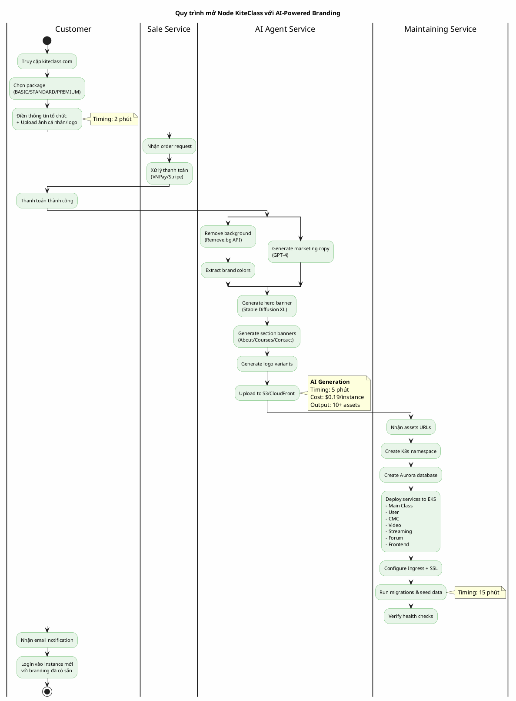

# REQ-1: Tạo PlantUML Diagrams và Báo cáo Text cho Document

## MỤC TIÊU

Tạo các deliverables sau cho đồ án tốt nghiệp:
1. **PlantUML diagrams** cho sơ đồ kiến trúc và flow
2. **Render diagrams thành ảnh PNG**
3. **File báo cáo dạng plain text** (không có markdown syntax) để copy vào Word document (~4 trang)

---

## TASK 1: Tạo PlantUML Diagrams

### 1.1. Sơ đồ Kiến trúc Platform

**File output:** `diagrams/architecture-diagram.puml`

**Yêu cầu:**
- Hiển thị kiến trúc tổng thể KiteClass Platform
- Bao gồm:
  - **KiteHub** (Modular Monolith): Sale, Message (Node.js), Maintaining, AI Agent (Python)
  - **KiteClass Instances** (Microservices): Main Class, User, CMC, Video, Streaming (Node.js), Forum
  - **AWS Services**: Route 53, CloudFront, ALB, EKS, Aurora PostgreSQL, ElastiCache Redis, S3
  - Mối quan hệ và data flow giữa components
- **Công nghệ hiển thị rõ**: Java Spring Boot, Node.js, Python, Next.js
- Sử dụng **C4 Component Diagram** hoặc Deployment Diagram
- Màu sắc:
  - KiteHub: Blue
  - KiteClass: Green
  - AWS: Orange
- **Đơn giản nhưng đầy đủ thông tin**

**Gợi ý cấu trúc PlantUML:**

```plantuml
@startuml
!define AWSPUML https://raw.githubusercontent.com/awslabs/aws-icons-for-plantuml/v14.0/dist
!include AWSPUML/AWSCommon.puml
!include AWSPUML/NetworkingContentDelivery/Route53.puml
!include AWSPUML/NetworkingContentDelivery/CloudFront.puml
!include AWSPUML/Compute/EKS.puml
!include AWSPUML/Database/Aurora.puml
!include AWSPUML/Database/ElastiCache.puml
!include AWSPUML/Storage/S3.puml

' Top level: Users -> AWS Edge
actor "Users" as users
Route53(route53, "Route 53", "DNS")
CloudFront(cdn, "CloudFront", "CDN")
rectangle "ALB" as alb

users --> route53
route53 --> cdn
cdn --> alb

' EKS Cluster
rectangle "EKS Cluster" as eks {

  ' KiteHub namespace
  package "KiteHub\n(Modular Monolith)" #LightBlue {
    component "Sale Module\n[Java Spring Boot]" as sale
    component "Message Module\n[Node.js]" as message
    component "Maintaining Module\n[Java Spring Boot]" as maintain
    component "AI Agent\n[Python FastAPI]" as ai
  }

  ' KiteClass namespace
  package "KiteClass Instance\n(Microservices)" #LightGreen {
    component "Main Class Service\n[Java]" as mainclass
    component "User Service\n[Java]" as user
    component "CMC Service\n[Java]" as cmc
    component "Video Service\n[Java]" as video
    component "Streaming Service\n[Node.js]" as streaming
    component "Forum Service\n[Java]" as forum
    component "Frontend\n[Next.js]" as frontend
  }
}

alb --> sale
alb --> frontend

' Database layer
Aurora(aurora, "Aurora PostgreSQL", "Databases")
ElastiCache(redis, "ElastiCache", "Redis Cache")
S3(s3, "S3", "Assets/Videos")

mainclass --> aurora
user --> aurora
cmc --> aurora
mainclass --> redis
frontend --> mainclass

ai --> s3
video --> s3

@enduml
```

### 1.2. Flow Mở Node KiteClass

**File output:** `diagrams/provisioning-flow.puml`

**Yêu cầu:**
- **Activity Diagram** hoặc **Sequence Diagram**
- Hiển thị quy trình từ đầu đến cuối (20 phút):
  1. Customer đăng ký + upload ảnh (2 phút)
  2. Payment confirmation
  3. **AI Agent generate assets** (5 phút) - Highlight step này
  4. Provisioning infrastructure (15 phút)
  5. Instance ready
- **Timing** cho từng bước quan trọng
- **Actors**: Customer, Sale Service, AI Agent, Maintaining Service, AWS
- **Highlight**: AI-generated branding là điểm đặc biệt

**Gợi ý cấu trúc PlantUML:**



---

## TASK 2: Render PlantUML thành PNG

**Yêu cầu:**
- Sử dụng PlantUML CLI hoặc online service
- Output format: **PNG**
- Resolution: **Ít nhất 1920px width** (high quality)
- Save vào: `diagrams/generated/`
  - `architecture-diagram.png`
  - `provisioning-flow.png`

**Hướng dẫn render:**

```bash
# Option 1: PlantUML CLI (recommended)
# Download plantuml.jar từ https://plantuml.com/download
java -jar plantuml.jar -tpng diagrams/architecture-diagram.puml -o generated
java -jar plantuml.jar -tpng diagrams/provisioning-flow.puml -o generated

# Option 2: PlantUML Online
# 1. Truy cập http://www.plantuml.com/plantuml/uml/
# 2. Copy nội dung .puml file
# 3. Paste vào editor
# 4. Click "Submit"
# 5. Download PNG

# Option 3: VS Code Extension
# 1. Install "PlantUML" extension
# 2. Open .puml file
# 3. Press Alt+D để preview
# 4. Right-click -> "Export Current Diagram" -> PNG
```

**Verify quality:**
- Images phải rõ nét, đọc được text
- Colors hiển thị đúng
- Không bị crop hoặc overflow

---

## TASK 3: Tạo Báo cáo Plain Text cho Word

**File output:** `documents/reports/graduation-thesis-outline.txt`

**YÊU CẦU QUAN TRỌNG:**
- ❌ **KHÔNG sử dụng markdown syntax**
  - Không dùng: `#`, `##`, `*`, `-`, `>`, `**`, `__`, ` ``` `, etc.
- ✅ Dùng **PLAIN TEXT** thuần túy
- ✅ Format bằng: spaces, line breaks, CAPITAL LETTERS, "="
- ✅ Dễ dàng copy-paste vào Microsoft Word
- ✅ Độ dài: **~4 trang A4** (khoảng 2000-2500 từ tiếng Việt)

**Cấu trúc nội dung:**

### Phần 1: Header (5% - ~100 từ)

```
================================================================================
                    DE CUONG DO AN TOT NGHIEP
         XAY DUNG HE THONG QUAN LY LOP HOC TRUC TUYEN
              THEO KIEN TRUC MICROSERVICES
                  KITECLASS PLATFORM
================================================================================

Sinh vien thuc hien: [Ten sinh vien]
Giang vien huong dan: [Ten giang vien]
Khoa: Cong nghe Thong tin
Nam hoc: 2025-2026

```

### Phần 2: Ý tưởng đề tài (25% - ~600 từ)

```
================================================================================
1. Y TUONG DE TAI
================================================================================

1.1. Boi canh

[Mô tả:
- Chuyển đổi số trong giáo dục đang diễn ra mạnh mẽ
- Nhu cầu về nền tảng quản lý lớp học trực tuyến linh hoạt
- Hạn chế của các giải pháp hiện tại:
  + Google Classroom: Miễn phí nhưng không customize
  + Moodle: Phức tạp, khó maintain
  + Zoom + LMS riêng: Tốn kém, không tích hợp
- Xu hướng multi-tenant SaaS trong education technology]

1.2. Muc tieu de tai

[Liệt kê 5-6 mục tiêu cụ thể:
- Xây dựng nền tảng multi-tenant cho phép tạo instance riêng
- Áp dụng kiến trúc microservices đúng chỗ
- Tích hợp AI để tự động tạo branding (điểm nổi bật)
- Hỗ trợ đầy đủ chức năng: lớp học, điểm danh, bài tập, streaming, video
- Deploy trên AWS với auto-scaling
- Cost-effective cho cả provider và customer]

1.3. Pham vi nghien cuu

[Nêu rõ:
- Đối tượng: Trường học, trung tâm, giảng viên độc lập
- Chức năng: Core (quản lý lớp, user, điểm danh) + Expand (video, streaming, forum)
- Công nghệ: Java Spring Boot (primary), Node.js (real-time), Python (AI), AWS
- Giới hạn: Web app only (không mobile native), Vietnam market focus]
```

### Phần 3: Kiến trúc hệ thống (35% - ~850 từ)

```
================================================================================
2. KIEN TRUC HE THONG
================================================================================

2.1. Tong quan kien truc

[Mô tả tổng quan:
KiteClass Platform được thiết kế theo mô hình 2 tầng:

Tầng 1 - KiteHub (Modular Monolith):
Nền tảng trung tâm quản lý toàn bộ hệ thống, bao gồm 4 modules chính:
- Sale Module (Java Spring Boot): Xử lý đăng ký, thanh toán
- Message Module (Node.js): Chat, notification real-time
- Maintaining Module (Java Spring Boot): Quản lý instances, monitoring
- AI Agent Module (Python): Tự động tạo branding từ ảnh upload

KiteHub là Monolith vì: quy mô nhỏ (35 use cases), traffic thấp (admin only),
team nhỏ (2-4 devs), tiết kiệm 50% chi phí infrastructure so với microservices.

Tầng 2 - KiteClass Instances (Microservices):
Mỗi khách hàng có 1 instance riêng biệt với:
- Namespace riêng trên Kubernetes
- Database riêng (Aurora PostgreSQL)
- 6-7 microservices tùy chọn:
  + Core: Main Class, User, CMC (Java Spring Boot)
  + Expand: Video, Streaming (Node.js), Forum (Java)
- Frontend riêng (Next.js - shared codebase, per-instance deployment)
- Domain riêng (subdomain.kiteclass.com)]


[CHO NAY CHEN ANH: architecture-diagram.png]
Hinh 1: Kien truc tong the KiteClass Platform


2.2. Tai sao dung Microservices cho KiteClass?

Ly do 1: Independent Scaling
[Streaming service cần scale khác biệt lớn so với User service.
Ví dụ thực tế: Giờ cao điểm 19h-21h khi nhiều lớp học online:
- Streaming service: Cần 10 replicas (CPU/memory intensive)
- User service: Chỉ cần 2 replicas (ít requests)
- Main Class service: 3 replicas

Với Microservices: Scale từng service độc lập
-> Tiết kiệm 53% chi phí so với scale toàn bộ monolith

Với Monolith: Phải scale cả hệ thống
-> Lãng phí resources cho services ít dùng]

Ly do 2: Module tuy chon (Plugin Architecture)
[Khách hàng có thể chọn services theo nhu cầu và ngân sách:

Trường cấp 3:
- Chỉ cần Core services (Main Class + User + CMC)
- Không cần Video/Streaming (học offline)
- Package: BASIC $99/tháng

Trung tâm Anh ngữ:
- Cần Core + Video Learning
- Không cần Streaming
- Package: STANDARD $199/tháng

Trung tâm Online:
- Cần tất cả services
- Package: PREMIUM $399/tháng

Microservices cho phép deploy chỉ services được chọn
-> Flexibility cao, cost-effective]

Ly do 3: Fault Isolation
[Kịch bản thực tế: Video service bị crash do memory leak

Với Microservices:
- Chỉ Video service down
- Main Class, User, CMC vẫn hoạt động bình thường
- Học viên vẫn xem được lịch, nộp bài tập, xem điểm
- Chỉ ~50 users đang xem video bị ảnh hưởng
- Auto-restart trong 30 giây

Với Monolith:
- Toàn bộ hệ thống down
- 500+ users bị ảnh hưởng
- Phải restart toàn bộ app
- Downtime 5-10 phút
- Mất data sessions]

Ly do 4: Technology Diversity
[Mỗi service dùng công nghệ phù hợp nhất:
- User, Main Class, CMC: Java Spring Boot
  (Business logic phức tạp, transaction, security)
- Streaming: Node.js + mediasoup
  (WebRTC cần event-driven, low latency)
- AI Agent: Python + FastAPI
  (ML/AI libraries: Replicate, OpenAI, Pillow)
- Frontend: Next.js
  (SSR/SSG cho SEO, modern DX)

Nếu dùng Monolith: Bị lock vào 1 tech stack
-> Không tối ưu cho từng workload]


2.3. Cong nghe su dung

Backend:
- Java Spring Boot 3.2+ (7/9 services): Enterprise-grade, team expertise
- Node.js + TypeScript (2/9 services): Real-time WebSocket, WebRTC
- Python + FastAPI (AI Agent): ML/AI libraries

Frontend:
- Next.js 14: SSR/SSG for SEO, shared codebase

Database:
- Aurora PostgreSQL Serverless v2: Auto-scaling, 1 DB per instance
- ElastiCache Redis: Caching, session storage

Infrastructure (AWS):
- EKS (Kubernetes): Container orchestration
- S3: Object storage (videos, assets)
- CloudFront: CDN for global delivery
- Route 53: DNS management
- SQS: Message queue for async tasks
```

### Phần 4: Flow mở node KiteClass (20% - ~500 từ)

```
================================================================================
3. QUY TRINH MO MOT NODE KITECLASS
================================================================================

[Mô tả overview:
Quy trình tự động 100% từ khi khách hàng đăng ký đến khi instance sẵn sàng.
Tổng thời gian: 20 phút
- AI generation: 5 phút
- Infrastructure provisioning: 15 phút

Điểm nổi bật: AI tự động tạo 10+ professional marketing assets
từ 1 ảnh upload của khách hàng, không cần design skills.]


[CHO NAY CHEN ANH: provisioning-flow.png]
Hinh 2: Quy trinh mo node KiteClass voi AI-powered branding


3.1. Cac buoc chi tiet

Buoc 1: Dang ky va Upload anh (2 phut)
[Khách hàng:
- Truy cập kiteclass.com/pricing
- Chọn gói: BASIC ($99) / STANDARD ($199) / PREMIUM ($399)
- Điền form:
  + Tên tổ chức
  + Subdomain mong muốn (vd: acme.kiteclass.com)
  + Admin email
  + Upload ảnh đại diện/logo (điểm đặc biệt)
  + Slogan (optional)
- Thanh toán qua VNPay/Stripe/Momo
- Nhận order confirmation]

Buoc 2: AI tu dong tao Marketing Assets (5 phut)
[AI Agent Service nhận ảnh và info, tự động:

Phút 0-1: Image processing
- Remove background (Remove.bg API)
- Extract dominant colors
- Generate profile variations (circle, square)

Phút 1-2: Text generation
- GPT-4 generate marketing copy:
  + Hero headline (8 từ, inspiring)
  + Sub-headline (20 từ, value-focused)
  + CTAs (3-5 từ)
  + Section headlines (About/Courses/Contact)
- Output: JSON với copy phù hợp ngành nghề

Phút 2-4: Image generation
- Stable Diffusion XL generate:
  + Hero banner (1920x600) với ảnh cutout + gradient bg
  + About banner (1200x400) với warm theme
  + Courses banner (1200x400) với learning theme
  + Contact banner (1200x400) với communication theme
- Composite: background + cutout + text overlay

Phút 4-5: Logo & finalize
- Generate 3 logo variants (primary, secondary, icon-only)
- Generate OG image (1200x630) cho social media
- Upload tất cả lên S3/CloudFront
- Save metadata vào database

Chi phí: $0.19 per instance
Output: 10+ professional marketing assets
- 3 profile variations
- 1 hero banner
- 3 section banners
- 3 logo variants
- 1 OG image
- Marketing copy (JSON)]

Buoc 3: Provisioning Infrastructure (15 phut)
[Maintaining Service tự động:

Phút 5-6: Kubernetes setup
- Create namespace "kiteclass-acme"
- Apply resource quotas
- Configure network policies

Phút 6-8: Database setup
- Create Aurora PostgreSQL database
- Run migrations (create schemas, tables)
- Seed data (admin account, roles, default settings)

Phút 8-13: Deploy services
- Deploy 6 Java Spring Boot services:
  + Main Class Service (2 replicas)
  + User Service (2 replicas)
  + CMC Service (2 replicas)
  + Video Learning Service (2 replicas)
  + Forum Service (2 replicas)
- Deploy Node.js Streaming Service (2 replicas)
- Deploy Next.js Frontend (2 replicas)
- Inject branding config (asset URLs, colors)

Phút 13-16: Network & DNS
- Configure Ingress (routing rules)
- Request SSL certificate (Let's Encrypt)
- Update Route 53 DNS record
- Configure CloudFront distribution

Phút 16-18: Verify
- Health checks cho tất cả services
- Database connectivity test
- Smoke tests (register user, create class)

Phút 18-20: Finalize
- Mark instance as ACTIVE
- Send email notification tới customer
- Update billing]

Buoc 4: Instance san sang
[Customer nhận email với:
- URL: https://acme.kiteclass.com
- Admin credentials (temp password)
- Branding đã được apply tự động:
  + Hero banner với ảnh họ
  + Logo variants
  + Marketing copy AI-generated
  + Brand colors consistent
- Documentation links
- Support contacts

Khách hàng login và thấy:
- Professional landing page (không cần design)
- Ready to invite users
- Ready to create classes
- Onboarding time: 20 phút (vs 1-2 giờ manual)]
```

### Phần 5: Điểm mạnh (10% - ~250 từ)

```
================================================================================
4. DIEM MANH CUA DE TAI
================================================================================

4.1. AI-powered branding (Unique Selling Point)
[Điểm khác biệt lớn nhất so với competitors:
- Tự động tạo 10+ assets từ 1 ảnh
- Tiết kiệm 90% thời gian onboarding
- Không cần design skills
- Chi phí chỉ $0.19/instance
- Professional quality
-> Competitive advantage rõ ràng]

4.2. Kien truc hybrid thong minh
[Không rơi vào over-engineering:
- Microservices cho KiteClass (cần flexibility)
- Monolith cho KiteHub (cần simplicity)
- Có lý do kỹ thuật rõ ràng cho từng quyết định]

4.3. Multi-tenant thuc su
[Hard multi-tenancy (không phải soft):
- Mỗi customer: namespace riêng, DB riêng
- Perfect isolation (security, performance)
- Independent scaling
- Failure isolation]

4.4. Deployment tu dong 100%
[From payment to instance ready: Zero manual intervention
- Consistent, repeatable
- Scale tới 1000+ instances
- CI/CD pipeline]

4.5. Cost-effective
[So với competitors:
- Margin 90% (revenue $99, cost $9)
- Customer tiết kiệm vs build in-house
- Auto-scaling -> optimize cost]
```

### Phần 6: Thử thách (10% - ~250 từ)

```
================================================================================
5. THACH THUC CUA DE TAI
================================================================================

5.1. Kien thuc AWS sau rong
[Cần nắm vững:
- EKS (Kubernetes complex)
- Aurora (DB clustering, failover)
- VPC, Security Groups (networking)
- IAM (access management)
- 10+ AWS services
Learning curve cao, nhiều best practices]

5.2. Khoi luong code lon
[Ước tính: ~96,000 lines of code
- 7 Java services: ~55,000 lines
- 2 Node.js services: ~13,000 lines
- Python AI: ~3,000 lines
- Next.js frontend: ~20,000 lines
- Infrastructure code: ~5,000 lines
Challenge: Maintain consistency, testing]

5.3. Kien thuc da cong nghe
[3 ngôn ngữ chính:
- Java (backend)
- TypeScript/Node.js (real-time)
- Python (AI/ML)
Plus: SQL, K8s, Docker, etc.]

5.4. Testing phuc tap
[Multi-level testing:
- Unit, Integration, E2E
- Load testing (streaming)
- Security testing
- AI quality testing]

5.5. Khao sat va requirements
[Nhiều đối tượng khác nhau:
- Trường học (strict grading)
- Trung tâm (focus video)
- Giảng viên (simple, cheap)
Challenge: Design flexible system]

5.6. Multi-tenancy security
[Đảm bảo:
- No data leakage
- Resource isolation
- Access control]

5.7. Cost management
[Avoid:
- Over-provisioning
- Idle resources
- Storage explosion]
```

### Phần 7: Kết luận (5% - ~150 từ)

```
================================================================================
6. KET LUAN
================================================================================

[Đề tài "Xây dựng hệ thống quản lý lớp học trực tuyến theo kiến trúc
Microservices - KiteClass Platform" là một đồ án tốt nghiệp có tính
ứng dụng cao, kết hợp nhiều công nghệ hiện đại và giải quyết bài toán
thực tế trong giáo dục.

Điểm nổi bật:
- AI-powered branding (unique)
- Kiến trúc hybrid thông minh
- Multi-tenant với hard isolation
- Deployment tự động hoàn toàn

Thách thức chính:
- Kiến thức AWS sâu
- Khối lượng code lớn
- Testing phức tạp

Với lộ trình 6 tháng và team có kinh nghiệm, đề tài hoàn toàn khả thi
và có thể deploy production thực tế.]


================================================================================
TAI LIEU THAM KHAO
================================================================================

[1] Spring Boot Documentation. (2024). https://spring.io/
[2] AWS EKS Best Practices. (2024). https://aws.amazon.com/eks/
[3] OpenAI GPT-4 API. (2024). https://platform.openai.com/
[4] Richardson, C. (2018). Microservices Patterns. Manning.
[5] Newman, S. (2021). Building Microservices. O'Reilly.
[6] Kubernetes Documentation. (2024). https://kubernetes.io/
[7] PostgreSQL 16 Documentation. (2024). https://postgresql.org/

================================================================================
```

**Lưu ý quan trọng về formatting:**
- ✅ Dùng "=" để tạo separator lines
- ✅ Dùng CAPITAL LETTERS cho section headers
- ✅ Dùng spaces/indentation cho structure
- ✅ Dùng line breaks để tách paragraphs
- ❌ KHÔNG dùng `#`, `##` (markdown headings)
- ❌ KHÔNG dùng `-`, `*` (markdown lists)
- ❌ KHÔNG dùng `**`, `__` (markdown bold)
- ❌ KHÔNG dùng ` ``` ` (markdown code blocks)
- ✅ Đánh dấu chỗ chèn ảnh: "CHO NAY CHEN ANH: ..."

---

## TASK 4: Tạo README hướng dẫn

**File output:** `diagrams/README.txt`

```
HUONG DAN SU DUNG CAC SO DO PLANTUML
====================================

1. CAC FILE DIAGRAM:
   - architecture-diagram.puml: So do kien truc tong the
   - provisioning-flow.puml: Quy trinh mo node KiteClass

2. CACH RENDER THANH PNG:

   Option 1: PlantUML CLI
   ----------------------
   java -jar plantuml.jar -tpng architecture-diagram.puml -o generated
   java -jar plantuml.jar -tpng provisioning-flow.puml -o generated

   Option 2: Online service
   ------------------------
   - Truy cap: http://www.plantuml.com/plantuml/uml/
   - Copy noi dung .puml file
   - Paste vao editor
   - Click Submit
   - Download PNG

   Option 3: VS Code extension
   ----------------------------
   - Install extension "PlantUML"
   - Open file .puml
   - Press Alt+D preview
   - Right-click Export Current Diagram

3. OUTPUT:
   - Size: 1920px width minimum
   - Format: PNG
   - Save to: diagrams/generated/

4. CHEN VAO WORD:
   - Mo file graduation-thesis-outline.txt
   - Tim dong "CHO NAY CHEN ANH: ..."
   - Thay bang anh PNG
   - Chinh size ~15cm width
```

---

## VERIFICATION CHECKLIST

Sau khi hoàn thành, verify:

**PlantUML Diagrams:**
- [ ] `diagrams/architecture-diagram.puml` created
- [ ] `diagrams/provisioning-flow.puml` created
- [ ] Both files compile without errors
- [ ] Diagrams are simple and clear
- [ ] All key components included

**PNG Images:**
- [ ] `diagrams/generated/architecture-diagram.png` created
- [ ] `diagrams/generated/provisioning-flow.png` created
- [ ] Resolution >= 1920px width
- [ ] Quality is good, text readable

**Text Report:**
- [ ] `documents/reports/graduation-thesis-outline.txt` created
- [ ] NO markdown syntax present
- [ ] Image placeholders clearly marked
- [ ] Length ~2000-2500 words (4 pages)
- [ ] 7 sections complete
- [ ] Easy to copy-paste to Word

**README:**
- [ ] `diagrams/README.txt` created
- [ ] Instructions are clear

---

## CONTEXT FILES TO READ

Agent cần đọc các files sau để lấy thông tin chi tiết:

1. `/mnt/e/person/2026-Kite-Class-Platform/documents/scripts/idea.md`
2. `/mnt/e/person/2026-Kite-Class-Platform/documents/reports/system-architecture-v2-with-ai.md`
3. `/mnt/e/person/2026-Kite-Class-Platform/documents/reports/kiteclass-node-provisioning.md`
4. `/mnt/e/person/2026-Kite-Class-Platform/documents/reports/microservices-analysis-report.md`
5. `/mnt/e/person/2026-Kite-Class-Platform/documents/reports/technology-stack-report.md`

---

## OUTPUT FILE STRUCTURE

```
/mnt/e/person/2026-Kite-Class-Platform/
├── diagrams/
│   ├── architecture-diagram.puml
│   ├── provisioning-flow.puml
│   ├── generated/
│   │   ├── architecture-diagram.png
│   │   └── provisioning-flow.png
│   └── README.txt
└── documents/
    └── reports/
        └── graduation-thesis-outline.txt
```

---

## SUCCESS CRITERIA

✅ Thành công khi:
1. Tất cả files được tạo đúng vị trí
2. PlantUML diagrams compile và render được
3. PNG images chất lượng cao, rõ nét
4. Text report:
   - Không có markdown syntax
   - Đủ 4 trang (~2000-2500 từ)
   - Có placeholder cho ảnh
   - Dễ copy vào Word
5. Nội dung chính xác, đầy đủ thông tin từ các reports

---

## ESTIMATED TIME

- PlantUML coding: 45 phút
- Render diagrams: 10 phút
- Write text report: 90 phút
- Review & polish: 15 phút
- **Total: ~2.5 giờ**
