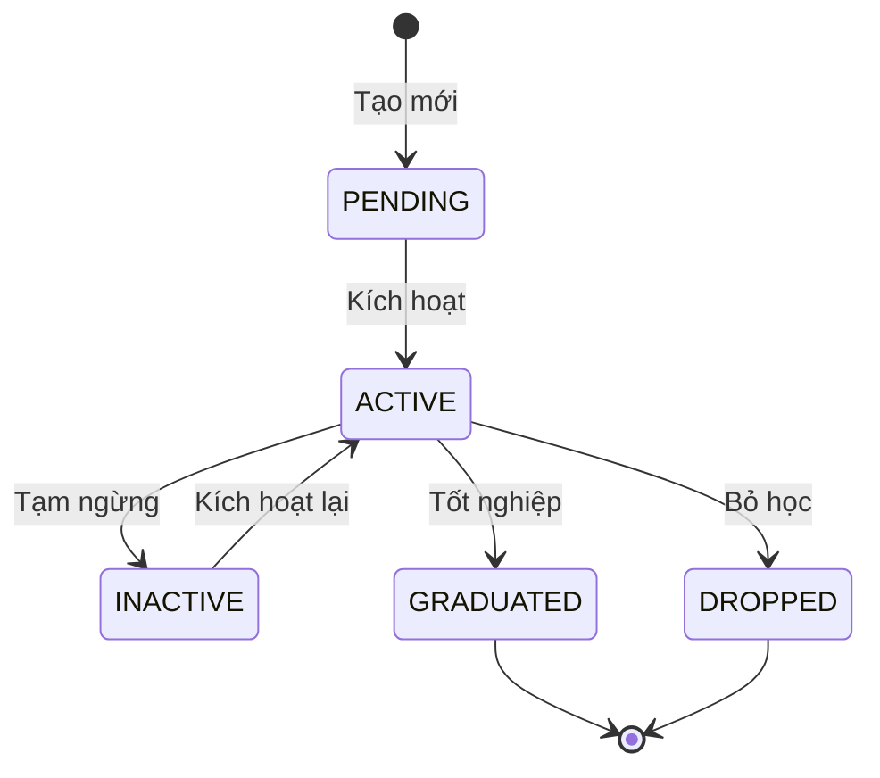
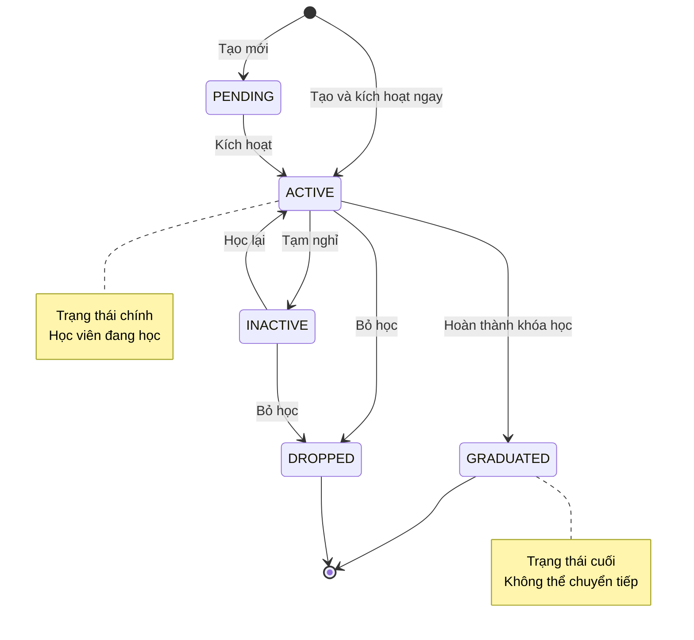

# Hướng Dẫn: Viết Tài Liệu Nghiệp Vụ Module

**Phiên bản:** 2.0 (Tiếng Việt)
**Cập nhật:** 2026-01-27
**Mục đích:** Template và hướng dẫn viết tài liệu nghiệp vụ cho các module trong Core Service

---

## 📋 Tổng Quan

Tài liệu này hướng dẫn cách viết đặc tả nghiệp vụ (business logic specification) cho mỗi module trong **KiteClass Core Service**.

Mỗi module trong Core Service (Student, Course, Class, Enrollment, Attendance, Invoice, Payment, v.v.) đều có:
- **Nghiệp vụ riêng**: Quy trình, quy tắc kinh doanh đặc thù
- **Quy tắc kinh doanh**: Ràng buộc, validation cần tuân thủ
- **Quy trình làm việc**: Các bước xử lý từ đầu đến cuối
- **Chuyển trạng thái**: Các trạng thái và điều kiện chuyển đổi
- **Tích hợp với module khác**: Cách module này kết nối với các module khác

---

## 🎯 Khi Nào Cần Viết Tài Liệu Nghiệp Vụ?

### ✅ PHẢI VIẾT tài liệu khi:

- Implement module mới (Student, Course, Class, v.v.)
- Module có quy tắc kinh doanh phức tạp
- Module có nhiều trạng thái và cách chuyển đổi giữa các trạng thái
- Module có quy trình làm việc nhiều bước
- Module tương tác với nhiều module khác

### ❌ KHÔNG CẦN viết tài liệu khi:

- Module chỉ là CRUD đơn giản, không có logic phức tạp
- Module là utility/helper thuần túy, không có nghiệp vụ

---

## 📐 Cấu Trúc Tài Liệu

Mỗi tài liệu nghiệp vụ module cần có **10 phần** sau:

```
1. Tổng Quan Module
2. Thực Thể Nghiệp Vụ (Entities)
3. Quy Tắc Kinh Doanh (Business Rules)
4. Quy Trình & Use Cases
5. Sơ Đồ Chuyển Trạng Thái (State Machine)
6. Điểm Tích Hợp Với Module Khác
7. Quy Tắc Validation
8. Các Tình Huống Lỗi
9. Chiến Lược Cache
10. Tối Ưu Hiệu Năng
```

---

## 1️⃣ Phần 1: Tổng Quan Module

### Mục đích
Mô tả module làm gì, tại sao cần có module này, và module này liên quan đến module nào.

### Template

```markdown
## Module: [Tên Module - Tiếng Việt]

**Mục đích:** [Giải thích module này làm gì trong 1-2 câu]

**Độ ưu tiên:**
- P0 (Cao nhất) - Bắt buộc phải có ngay trong MVP
- P1 (Cao) - Cần có sớm sau MVP
- P2 (Trung bình) - Có thể làm sau

**Module phụ thuộc:** [Liệt kê các module mà module này CẦN để hoạt động]

**Module liên quan:** [Liệt kê các module có tương tác với module này]

### Bối Cảnh Nghiệp Vụ

[Giải thích chi tiết về nghiệp vụ, tại sao cần module này, module này giải quyết vấn đề gì]

**Ví dụ trong thực tế:**
[Mô tả cách sử dụng thực tế của module trong vận hành trung tâm]
```

### Ví Dụ: Module Học Viên (Student)

```markdown
## Module: Quản Lý Học Viên (Student)

**Mục đích:** Quản lý thông tin học viên, theo dõi trạng thái học tập, và lưu trữ lịch sử học viên tại trung tâm.

**Độ ưu tiên:** P0 (Cao nhất - Bắt buộc trong MVP)

**Module phụ thuộc:**
- Không có (Module độc lập)

**Module liên quan:**
- Enrollment (Đăng ký học) - Học viên đăng ký lớp học
- Invoice (Hóa đơn) - Tạo hóa đơn cho học viên
- Attendance (Điểm danh) - Theo dõi điểm danh học viên
- Parent (Phụ huynh) - Quản lý thông tin phụ huynh của học viên

### Bối Cảnh Nghiệp Vụ

Học viên là trung tâm của hoạt động kinh doanh. Mọi trung tâm đều cần quản lý:
- **Thông tin cơ bản**: Họ tên, ngày sinh, giới tính, địa chỉ
- **Thông tin liên lạc**: Email, số điện thoại (để liên hệ khi cần)
- **Trạng thái**: Đang học, tạm nghỉ, tốt nghiệp, đã bỏ học
- **Lịch sử**: Các lớp đã đăng ký, điểm danh, hóa đơn

**Ví dụ trong thực tế:**
Khi có học viên mới, trung tâm cần lưu thông tin học viên vào hệ thống. Sau đó, học viên này sẽ được đăng ký vào các lớp học, theo dõi điểm danh, và tạo hóa đơn thanh toán.
```

---

## 2️⃣ Phần 2: Thực Thể Nghiệp Vụ (Business Entities)

### Mục đích
Mô tả chi tiết các đối tượng (entities) trong module: có thuộc tính gì, các trạng thái, và quan hệ với entity khác.

### Template

```markdown
## Thực Thể Nghiệp Vụ

### [Tên Entity - Tiếng Việt]

**Mô tả:** [Giải thích entity này đại diện cho cái gì trong nghiệp vụ]

#### Các Thuộc Tính

| Trường | Kiểu dữ liệu | Bắt buộc? | Validation | Giải thích |
|--------|-------------|-----------|------------|------------|
| name | String | Có | 2-100 ký tự | Họ và tên học viên |
| email | String | Không | Email hợp lệ | Email liên lạc |
| phone | String | Không | 10 số, bắt đầu bằng 0 | Số điện thoại |
| dateOfBirth | Date | Không | Trong quá khứ | Ngày sinh |
| status | Enum | Có | Một trong các giá trị Status | Trạng thái hiện tại |

#### Các Trạng Thái (Status Values)

| Trạng thái | Giải thích | Có thể chuyển sang |
|-----------|------------|-------------------|
| PENDING | Mới tạo, chưa kích hoạt | ACTIVE |
| ACTIVE | Đang học tập | INACTIVE, GRADUATED, DROPPED |
| INACTIVE | Tạm nghỉ | ACTIVE, DROPPED |
| GRADUATED | Đã tốt nghiệp | (Không chuyển được) |
| DROPPED | Đã bỏ học | (Không chuyển được) |

#### Quan Hệ Với Entity Khác

- **Có nhiều (Has many):**
  - Enrollments (Đăng ký học) - Một học viên có thể đăng ký nhiều lớp
  - Invoices (Hóa đơn) - Một học viên có nhiều hóa đơn
  - Attendances (Điểm danh) - Một học viên có nhiều bản ghi điểm danh

- **Thuộc về (Belongs to):**
  - Parent (Phụ huynh) - Học viên có thể thuộc về một hoặc nhiều phụ huynh
```

---

## 3️⃣ Phần 3: Quy Tắc Kinh Doanh (Business Rules)

### Mục đích
Liệt kê TẤT CẢ các quy tắc kinh doanh mà module phải tuân thủ. Mỗi quy tắc có ID riêng để dễ tham chiếu.

### Template

```markdown
## Quy Tắc Kinh Doanh

### BR-[MODULE]-001: [Tên Quy Tắc - Tiếng Việt]

**Mô tả:** [Giải thích quy tắc này là gì, tại sao cần có quy tắc này]

**Điều kiện áp dụng:**
- [Khi nào quy tắc này được kiểm tra]
- [Điều kiện gì cần thỏa mãn]

**Cách kiểm tra (Validation):**
- [Hệ thống kiểm tra như thế nào]
- [Dữ liệu nào được validate]

**Nếu vi phạm:**
- **Exception:** `TênException("tham số")`
- **HTTP Status:** 400 Bad Request / 409 Conflict
- **Message:** "Thông báo lỗi cho người dùng"

**Ví dụ:**

✅ **Hợp lệ:**
```java
// Trường hợp này OK, quy tắc được tuân thủ
createStudent("Nguyễn Văn A", "nguyenvana@example.com", "0123456789")
```

❌ **Không hợp lệ:**
```java
// Trường hợp này BỊ LỖI vì vi phạm quy tắc
createStudent("Trần Văn B", "nguyenvana@example.com", "0987654321")
→ Ném exception: DuplicateResourceException("email", "nguyenvana@example.com")
→ Lý do: Email đã tồn tại trong hệ thống
```
```

### Ví Dụ: Quy Tắc Email Duy Nhất

```markdown
## Quy Tắc Kinh Doanh

### BR-STU-001: Email Phải Duy Nhất

**Mô tả:**
Mỗi học viên (chưa bị xóa) phải có email duy nhất trong hệ thống. Không được phép có 2 học viên cùng email.

**Lý do:**
Email được dùng để login, gửi thông báo, và khôi phục mật khẩu. Nếu trùng email sẽ gây nhầm lẫn.

**Điều kiện áp dụng:**
- Khi tạo học viên mới
- Khi cập nhật email của học viên đã có
- CHỈ kiểm tra với các học viên chưa bị xóa (deleted = false)

**Cách kiểm tra (Validation):**
- Trước khi lưu, hệ thống gọi: `studentRepository.existsByEmailAndDeletedFalse(email)`
- Nếu trả về `true` → email đã tồn tại → từ chối

**Nếu vi phạm:**
- **Exception:** `DuplicateResourceException("email", email)`
- **HTTP Status:** 409 Conflict
- **Message:** "Email 'example@email.com' đã tồn tại trong hệ thống"

**Ví dụ:**

✅ **Hợp lệ:**
```java
// Email mới, chưa có ai dùng
createStudent("Nguyễn Văn A", "nguyenvana@example.com", "0123456789")
→ Thành công, học viên được tạo
```

✅ **Hợp lệ (Email đã xóa):**
```java
// Email này trước đây có học viên dùng nhưng đã bị xóa (deleted = true)
// Nên có thể tạo học viên mới với email này
createStudent("Trần Văn B", "old-deleted@example.com", "0987654321")
→ Thành công, vì học viên cũ đã bị xóa
```

❌ **Không hợp lệ:**
```java
// Email này đã có học viên khác đang dùng (deleted = false)
createStudent("Lê Thị C", "nguyenvana@example.com", "0111222333")
→ Ném exception: DuplicateResourceException("email", "nguyenvana@example.com")
→ Thông báo: "Email 'nguyenvana@example.com' đã tồn tại trong hệ thống"
```

**Log khi vi phạm:**
```
WARN [StudentService] Duplicate email detected: nguyenvana@example.com
```
```

---

## 4️⃣ Phần 4: Quy Trình & Use Cases

### Mục đích
Mô tả các quy trình làm việc từng bước, từ đầu đến cuối. Ai làm gì, hệ thống xử lý thế nào, kết quả ra sao.

### Template

```markdown
## Quy Trình Nghiệp Vụ & Use Cases

### UC-[MODULE]-001: [Tên Use Case - Tiếng Việt]

**Người thực hiện (Actor):** [CENTER_ADMIN / TEACHER / STUDENT / PARENT]

**Điều kiện trước (Preconditions):**
- [Điều kiện gì cần có trước khi thực hiện use case này]
- [Ví dụ: User đã đăng nhập, có quyền tạo học viên]

**Luồng chính (Main Flow):**
1. [Actor] thực hiện hành động [tên hành động]
2. Hệ thống kiểm tra dữ liệu đầu vào
3. Hệ thống kiểm tra quy tắc kinh doanh (BR-XXX-001, BR-XXX-002)
4. Hệ thống lưu dữ liệu vào database
5. Hệ thống cập nhật trạng thái
6. Hệ thống trả về kết quả thành công

**Luồng thay thế (Alternative Flows):**
- **AF1 - Validation thất bại:**
  - Bước 2 phát hiện dữ liệu không hợp lệ
  - Hệ thống trả về HTTP 400 với danh sách lỗi
  - Use case kết thúc

- **AF2 - Vi phạm quy tắc kinh doanh:**
  - Bước 3 phát hiện vi phạm quy tắc (VD: email trùng)
  - Hệ thống trả về HTTP 409 với thông báo lỗi
  - Use case kết thúc

**Kết quả sau khi thực hiện (Postconditions):**
- [Entity] được tạo/cập nhật trong database
- Trạng thái chuyển sang [STATUS_MỚI]
- Event [TênEvent] được publish để trigger các xử lý khác

**Events phát sinh:**
- `StudentCreatedEvent` → Gửi email chào mừng
- `StudentEnrolledEvent` → Tạo hóa đơn học phí
```

### Ví Dụ: Tạo Học Viên Mới

```markdown
## Quy Trình Nghiệp Vụ & Use Cases

### UC-STU-001: Tạo Học Viên Mới

**Người thực hiện:** CENTER_ADMIN (Quản trị viên trung tâm)

**Điều kiện trước:**
- User đã đăng nhập vào hệ thống
- User có quyền `CREATE_STUDENT`
- User đang ở màn hình Quản lý học viên

**Luồng chính:**
1. Admin nhấn nút "Thêm học viên mới"
2. Hệ thống hiển thị form nhập thông tin
3. Admin nhập thông tin:
   - Họ tên (bắt buộc)
   - Email (không bắt buộc)
   - Số điện thoại (không bắt buộc)
   - Ngày sinh (không bắt buộc)
   - Giới tính (không bắt buộc)
   - Địa chỉ (không bắt buộc)
   - Ghi chú (không bắt buộc)
4. Admin nhấn "Lưu"
5. Hệ thống kiểm tra validation:
   - Họ tên có 2-100 ký tự
   - Email đúng định dạng (nếu có)
   - Số điện thoại 10 số, bắt đầu bằng 0 (nếu có)
6. Hệ thống kiểm tra quy tắc kinh doanh:
   - BR-STU-001: Email phải duy nhất (nếu có nhập email)
   - BR-STU-002: Số điện thoại phải duy nhất (nếu có nhập phone)
7. Hệ thống tạo bản ghi Student:
   - status = ACTIVE (mặc định)
   - deleted = false
   - Lưu vào database
8. Hệ thống xóa cache danh sách học viên
9. Hệ thống trả về HTTP 201 Created với thông tin học viên vừa tạo
10. Giao diện hiển thị thông báo "Tạo học viên thành công" và quay về danh sách

**Luồng thay thế:**

**AF1 - Thiếu thông tin bắt buộc:**
- Tại bước 5, phát hiện họ tên bị trống
- Hệ thống trả về HTTP 400 Bad Request
- Message: "Họ tên là bắt buộc"
- Giao diện hiển thị lỗi, giữ nguyên form để Admin sửa

**AF2 - Email đã tồn tại:**
- Tại bước 6, phát hiện email đã có học viên khác dùng
- Hệ thống trả về HTTP 409 Conflict
- Message: "Email 'example@email.com' đã tồn tại trong hệ thống"
- Giao diện hiển thị lỗi, Admin cần nhập email khác

**AF3 - Số điện thoại sai định dạng:**
- Tại bước 5, phát hiện phone không đúng định dạng Việt Nam
- Hệ thống trả về HTTP 400 Bad Request
- Message: "Số điện thoại không hợp lệ (phải có 10 số, bắt đầu bằng 0)"
- Giao diện hiển thị lỗi

**Kết quả sau khi thực hiện:**
- Học viên mới được tạo trong database với status = ACTIVE
- Cache danh sách học viên bị xóa (để refresh)
- Log ghi nhận: "Created student with ID: 123"

**Events phát sinh:**
- `StudentCreatedEvent` → (Tương lai) Gửi email chào mừng cho học viên
```

---

## 5️⃣ Phần 5: Sơ Đồ Chuyển Trạng Thái (State Machine)

### Mục đích
Vẽ sơ đồ các trạng thái và cách chuyển đổi giữa các trạng thái. Giúp hiểu rõ lifecycle của entity.

### Template

```markdown
## Sơ Đồ Chuyển Trạng Thái

### Lifecycle của [Entity - Tiếng Việt]



### Quy Tắc Chuyển Trạng Thái

#### [Tên hành động] - VD: Kích hoạt học viên

- **Từ trạng thái:** PENDING
- **Sang trạng thái:** ACTIVE
- **Điều kiện:** [Các điều kiện cần thỏa mãn để được chuyển]
- **Tác động phụ (Side effects):** [Những gì xảy ra khi chuyển trạng thái]
- **Method trong code:** `StudentService.activateStudent(Long id)`

**Ví dụ:**
```java
// Kích hoạt học viên ID = 123
studentService.activateStudent(123L);
→ Status: PENDING → ACTIVE
→ Side effect: Gửi email chào mừng
```
```

### Ví Dụ: State Machine của Học Viên

```markdown
## Sơ Đồ Chuyển Trạng Thái

### Lifecycle của Học Viên



### Quy Tắc Chuyển Trạng Thái

#### Kích hoạt học viên (activate)

- **Từ trạng thái:** PENDING
- **Sang trạng thái:** ACTIVE
- **Điều kiện:**
  - Học viên đang ở trạng thái PENDING
  - Thông tin cơ bản đã đầy đủ
- **Tác động phụ (Side effects):**
  - Gửi email chào mừng cho học viên (nếu có email)
  - Log: "Activated student ID: 123"
- **Method trong code:** `StudentService.activateStudent(Long id)`

**Ví dụ:**
```java
// Kích hoạt học viên mới tạo
studentService.activateStudent(123L);
→ Status: PENDING → ACTIVE
→ Email chào mừng được gửi đến nguyenvana@example.com
```

#### Tạm nghỉ (suspend)

- **Từ trạng thái:** ACTIVE
- **Sang trạng thái:** INACTIVE
- **Điều kiện:**
  - Học viên đang ở trạng thái ACTIVE
  - Có lý do tạm nghỉ (VD: bận việc gia đình, đi du học)
- **Tác động phụ (Side effects):**
  - Tất cả enrollment đang ACTIVE chuyển sang PAUSED
  - Gửi thông báo cho giáo viên các lớp học viên đang học
  - Log: "Suspended student ID: 123, reason: Bận việc gia đình"
- **Method trong code:** `StudentService.suspendStudent(Long id, String reason)`

**Ví dụ:**
```java
// Tạm nghỉ vì lý do cá nhân
studentService.suspendStudent(123L, "Bận việc gia đình");
→ Status: ACTIVE → INACTIVE
→ 3 enrollment chuyển sang PAUSED
→ Email thông báo gửi đến giáo viên
```

#### Học lại (reactivate)

- **Từ trạng thái:** INACTIVE
- **Sang trạng thái:** ACTIVE
- **Điều kiện:**
  - Học viên đang ở trạng thái INACTIVE
  - Học viên muốn quay lại học
- **Tác động phụ (Side effects):**
  - Các enrollment PAUSED có thể được kích hoạt lại (manual)
  - Log: "Reactivated student ID: 123"
- **Method trong code:** `StudentService.reactivateStudent(Long id)`

#### Tốt nghiệp (graduate)

- **Từ trạng thái:** ACTIVE
- **Sang trạng thái:** GRADUATED
- **Điều kiện:**
  - Học viên đang ở trạng thái ACTIVE
  - Học viên đã hoàn thành khóa học
  - Không còn enrollment ACTIVE
- **Tác động phụ (Side effects):**
  - Gửi email chúc mừng tốt nghiệp
  - Tạo certificate (nếu có tính năng)
  - Log: "Graduated student ID: 123"
- **Method trong code:** `StudentService.graduateStudent(Long id)`
- **Lưu ý:** GRADUATED là trạng thái cuối, không thể chuyển sang trạng thái khác

#### Bỏ học (drop)

- **Từ trạng thái:** ACTIVE hoặc INACTIVE
- **Sang trạng thái:** DROPPED
- **Điều kiện:**
  - Học viên đang ở trạng thái ACTIVE hoặc INACTIVE
  - Có lý do bỏ học
- **Tác động phụ (Side effects):**
  - Tất cả enrollment ACTIVE/PAUSED chuyển sang CANCELLED
  - Gửi thông báo cho giáo viên
  - Log: "Dropped student ID: 123, reason: Chuyển trung tâm khác"
- **Method trong code:** `StudentService.dropStudent(Long id, String reason)`
- **Lưu ý:** DROPPED là trạng thái cuối, không thể chuyển sang trạng thái khác

### ❌ Các Chuyển Đổi KHÔNG HỢP LỆ

Hệ thống sẽ từ chối các chuyển đổi sau:

```java
// ❌ Không thể kích hoạt học viên đã tốt nghiệp
studentService.activateStudent(graduatedStudentId);
→ Ném ValidationException("Không thể kích hoạt học viên đã tốt nghiệp")

// ❌ Không thể tốt nghiệp khi đang tạm nghỉ
studentService.graduateStudent(inactiveStudentId);
→ Ném ValidationException("Học viên phải ở trạng thái ACTIVE để tốt nghiệp")

// ❌ Không thể chuyển từ GRADUATED về ACTIVE
studentService.reactivateStudent(graduatedStudentId);
→ Ném ValidationException("Không thể kích hoạt học viên đã tốt nghiệp")
```
```

---

## 6️⃣ Phần 6: Điểm Tích Hợp Với Module Khác

### Mục đích
Mô tả cách module này tương tác với các module khác: dữ liệu chảy như thế nào, khi nào trigger, có quy tắc gì.

### Template

```markdown
## Tích Hợp Với Các Module Khác

### [Module A] ↔ [Module B]

**Hướng:** [Module A] → [Module B] (A tạo/gọi B)

**Khi nào xảy ra (Trigger):**
[Sự kiện gì khiến việc tích hợp này xảy ra]

**Dữ liệu truyền đi:**
[Dữ liệu gì được truyền từ A sang B]

**Quy tắc kinh doanh liên quan:**
[Các ràng buộc, điều kiện khi tích hợp]

**Ví dụ:**
```java
// Code minh họa cách tích hợp
```
```

### Ví Dụ: Student Tích Hợp Với Các Module Khác

```markdown
## Tích Hợp Với Các Module Khác

### Student → Enrollment (Học viên đăng ký lớp)

**Hướng:** Student → Enrollment

**Khi nào xảy ra:**
Khi học viên đăng ký vào một lớp học, hệ thống tạo bản ghi Enrollment liên kết Student và Class.

**Dữ liệu truyền đi:**
- Student ID
- Class ID
- Enrollment date
- Status (mặc định: PENDING)

**Quy tắc kinh doanh liên quan:**
- BR-STU-003: Học viên chỉ có thể đăng ký lớp khi status = ACTIVE
- BR-ENR-001: Học viên không được đăng ký quá 5 lớp ACTIVE cùng lúc
- BR-ENR-002: Không được đăng ký trùng lớp đang học

**Ví dụ:**
```java
// Học viên ID=123 đăng ký vào lớp ID=456
enrollmentService.enrollStudent(123L, 456L);

→ Kiểm tra: student.status == ACTIVE? ✅
→ Kiểm tra: số lớp đang học < 5? ✅
→ Tạo Enrollment(studentId=123, classId=456, status=PENDING)
→ Trigger: EnrollmentCreatedEvent → tạo Invoice
```

---

### Student ← Invoice (Hóa đơn liên kết học viên)

**Hướng:** Invoice → Student (Invoice tham chiếu Student)

**Khi nào xảy ra:**
Khi có enrollment mới, hoặc khi phát sinh chi phí (học phí, phụ phí), hệ thống tạo Invoice cho Student.

**Dữ liệu truyền đi:**
- Student ID (FK trong Invoice)
- Invoice amount
- Due date

**Quy tắc kinh doanh liên quan:**
- BR-INV-001: Số tiền invoice có thể giảm giá dựa trên student discount
- BR-INV-002: Invoice chỉ tạo cho student có status = ACTIVE hoặc INACTIVE

**Ví dụ:**
```java
// Tạo hóa đơn học phí cho học viên ID=123
Invoice invoice = invoiceService.createInvoice(
    studentId = 123L,
    amount = 1_000_000, // 1 triệu
    dueDate = LocalDate.now().plusDays(7)
);

→ Lấy thông tin học viên ID=123
→ Kiểm tra discount: student.discountPercent = 10%
→ Tính số tiền: 1,000,000 * 0.9 = 900,000
→ Tạo Invoice với finalAmount = 900,000
```

---

### Student ← Attendance (Điểm danh học viên)

**Hướng:** Attendance → Student (Attendance tham chiếu Student)

**Khi nào xảy ra:**
Mỗi buổi học, giáo viên điểm danh học viên. Hệ thống tạo bản ghi Attendance cho từng học viên.

**Dữ liệu truyền đi:**
- Student ID
- Class ID
- Session ID (buổi học)
- Status (PRESENT, ABSENT, LATE)

**Quy tắc kinh doanh liên quan:**
- BR-ATT-001: Chỉ điểm danh học viên có enrollment ACTIVE trong lớp
- BR-ATT-002: Tính % điểm danh để đánh giá học viên

**Ví dụ:**
```java
// Điểm danh học viên ID=123 buổi học ID=789
attendanceService.markAttendance(
    studentId = 123L,
    sessionId = 789L,
    status = AttendanceStatus.PRESENT
);

→ Kiểm tra: học viên có enrollment ACTIVE trong lớp này? ✅
→ Tạo Attendance(studentId=123, sessionId=789, status=PRESENT)
→ Cập nhật attendance percentage của học viên
```

---

### Student ↔ Parent (Phụ huynh và học viên)

**Hướng:** Hai chiều (Many-to-Many)

**Khi nào xảy ra:**
- Khi tạo học viên, có thể liên kết với phụ huynh (nếu học viên nhỏ tuổi)
- Khi tạo phụ huynh, có thể liên kết với các học viên (con)

**Dữ liệu truyền đi:**
- Student ID ↔ Parent ID
- Relationship (FATHER, MOTHER, GUARDIAN)

**Quy tắc kinh doanh liên quan:**
- BR-PAR-001: Một học viên có thể có nhiều phụ huynh
- BR-PAR-002: Phụ huynh nhận thông báo về tất cả học viên của mình

**Ví dụ:**
```java
// Liên kết học viên ID=123 với phụ huynh ID=456
parentService.linkStudentToParent(
    studentId = 123L,
    parentId = 456L,
    relationship = Relationship.MOTHER
);

→ Tạo StudentParent(studentId=123, parentId=456, relationship=MOTHER)
→ Phụ huynh 456 giờ sẽ nhận thông báo về học viên 123
```
```

---

## 7️⃣ Phần 7: Quy Tắc Validation

### Mục đích
Liệt kê chi tiết các validation cho từng field và các validation logic nghiệp vụ.

### Template

```markdown
## Quy Tắc Validation

### Validation Từng Trường (Field Validation)

#### [Tên trường]

- **Định dạng:** [Mô tả định dạng yêu cầu]
- **Độ duy nhất:** [Có phải unique không? Scope như thế nào?]
- **Cách kiểm tra:** [Method/query dùng để check]
- **Exception khi lỗi:** [Exception và message]

**Ví dụ:**

✅ Hợp lệ:
```
[Ví dụ input hợp lệ]
```

❌ Không hợp lệ:
```
[Ví dụ input không hợp lệ]
→ Exception: [Tên exception]
→ Message: [Thông báo lỗi]
```

### Validation Logic Nghiệp Vụ (Business Validation)

#### BR-[MODULE]-XXX: [Tên quy tắc]

- **Quy tắc:** [Mô tả quy tắc]
- **Cách kiểm tra:** [Logic kiểm tra]
- **Exception khi lỗi:** [Exception và message]
```

### Ví Dụ: Validation Rules của Student

```markdown
## Quy Tắc Validation

### Validation Từng Trường

#### Họ và tên (name)

- **Định dạng:** Chuỗi từ 2-100 ký tự, không được để trống
- **Độ duy nhất:** Không cần unique (nhiều người có thể cùng tên)
- **Cách kiểm tra:** Spring validation `@Size(min=2, max=100)`
- **Exception khi lỗi:** `ValidationException("Họ tên phải có từ 2-100 ký tự")`

✅ **Hợp lệ:**
```
"Nguyễn Văn A"
"Trần Thị Bảo Ngọc"
"An" (2 ký tự, OK)
```

❌ **Không hợp lệ:**
```
"" (trống)
→ ValidationException: "Họ tên là bắt buộc"

"A" (1 ký tự, quá ngắn)
→ ValidationException: "Họ tên phải có ít nhất 2 ký tự"

"[Tên dài hơn 100 ký tự]"
→ ValidationException: "Họ tên không được vượt quá 100 ký tự"
```

---

#### Email

- **Định dạng:** Email hợp lệ theo chuẩn RFC 5322
- **Độ duy nhất:** Phải unique trong các học viên chưa xóa (deleted=false)
- **Cách kiểm tra:**
  - Định dạng: Spring validation `@Email`
  - Unique: `studentRepository.existsByEmailAndDeletedFalse(email)`
- **Exception khi lỗi:**
  - Định dạng sai: `ValidationException("Email không hợp lệ")`
  - Trùng: `DuplicateResourceException("email", email)`

✅ **Hợp lệ:**
```
"nguyenvana@example.com"
"contact@trungTam-abC123.vn"
null (email không bắt buộc, có thể null)
```

❌ **Không hợp lệ:**
```
"not-an-email" (thiếu @)
→ ValidationException: "Email không hợp lệ"

"nguyenvana@example.com" (đã tồn tại)
→ DuplicateResourceException: "Email 'nguyenvana@example.com' đã tồn tại trong hệ thống"
```

---

#### Số điện thoại (phone)

- **Định dạng:** 10 chữ số, bắt đầu bằng 0 (format Việt Nam)
- **Pattern:** `^0\\d{9}$`
- **Độ duy nhất:** Phải unique trong các học viên chưa xóa (deleted=false)
- **Cách kiểm tra:**
  - Pattern: Regex `^0\\d{9}$`
  - Unique: `studentRepository.existsByPhoneAndDeletedFalse(phone)`
- **Exception khi lỗi:**
  - Format sai: `ValidationException("Số điện thoại không hợp lệ (phải có 10 số, bắt đầu bằng 0)")`
  - Trùng: `DuplicateResourceException("phone", phone)`

✅ **Hợp lệ:**
```
"0123456789"
"0987654321"
null (phone không bắt buộc, có thể null)
```

❌ **Không hợp lệ:**
```
"123456789" (thiếu số 0 ở đầu)
→ ValidationException: "Số điện thoại phải bắt đầu bằng 0"

"012345678" (chỉ có 9 số)
→ ValidationException: "Số điện thoại phải có đúng 10 số"

"0123-456-789" (có dấu gạch ngang)
→ ValidationException: "Số điện thoại chỉ được chứa chữ số"

"0987654321" (đã tồn tại)
→ DuplicateResourceException: "Số điện thoại '0987654321' đã tồn tại trong hệ thống"
```

---

#### Ngày sinh (dateOfBirth)

- **Định dạng:** Ngày hợp lệ, phải trong quá khứ
- **Ràng buộc:** Không được là ngày tương lai
- **Cách kiểm tra:** So sánh với `LocalDate.now()`
- **Exception khi lỗi:** `ValidationException("Ngày sinh không hợp lệ hoặc là ngày tương lai")`

✅ **Hợp lệ:**
```
2010-05-15 (trong quá khứ)
2000-01-01
null (ngày sinh không bắt buộc)
```

❌ **Không hợp lệ:**
```
2030-12-31 (ngày tương lai)
→ ValidationException: "Ngày sinh không được là ngày tương lai"
```

---

### Validation Logic Nghiệp Vụ

#### BR-STU-004: Giới Hạn Số Lớp Đăng Ký

- **Quy tắc:** Một học viên không được đăng ký quá 5 lớp ACTIVE cùng lúc
- **Cách kiểm tra:**
  ```java
  int activeEnrollments = enrollmentRepository.countByStudentIdAndStatus(
      studentId, EnrollmentStatus.ACTIVE
  );
  if (activeEnrollments >= 5) {
      throw new BusinessException("Học viên đã đạt giới hạn 5 lớp đang học");
  }
  ```
- **Exception khi lỗi:** `BusinessException("Học viên đã đạt giới hạn 5 lớp đang học")`

**Ví dụ:**
```java
// Học viên đang có 4 lớp ACTIVE
enrollmentService.enrollStudent(studentId, newClassId);
→ OK, vì 4 < 5

// Học viên đang có 5 lớp ACTIVE
enrollmentService.enrollStudent(studentId, anotherClassId);
→ BusinessException: "Học viên đã đạt giới hạn 5 lớp đang học"
```
```

---

## 8️⃣ Phần 8: Các Tình Huống Lỗi (Error Scenarios)

### Mục đích
Mô tả chi tiết các tình huống lỗi có thể xảy ra, input, expected behavior, và log output.

### Template

```markdown
## Các Tình Huống Lỗi

### ES-[MODULE]-001: [Tên Tình Huống Lỗi]

**Tình huống:** [Mô tả tình huống gây lỗi]

**Input:**
```json
{
  "field1": "value1",
  "field2": "value2"
}
```

**Hành vi mong đợi (Expected Behavior):**
1. Hệ thống kiểm tra [gì]
2. Phát hiện [vấn đề gì]
3. Trả về HTTP [status code]
4. Ném exception: `ExceptionName("message")`
5. Response body:
```json
{
  "success": false,
  "message": "Thông báo lỗi cho người dùng",
  "errorCode": "ERROR_CODE"
}
```

**Log output:**
```
[LEVEL] [ClassName] Log message with details
```

**Cách khắc phục (User action):**
[Người dùng cần làm gì để fix]
```

### Ví Dụ: Error Scenarios của Student

```markdown
## Các Tình Huống Lỗi

### ES-STU-001: Email Trùng Lặp

**Tình huống:**
Admin cố gắng tạo học viên mới với email đã tồn tại trong hệ thống

**Input:**
```json
{
  "name": "Trần Văn B",
  "email": "nguyenvana@example.com",
  "phone": "0987654321"
}
```

**Hành vi mong đợi:**
1. Hệ thống nhận request tạo học viên mới
2. Kiểm tra validation fields (OK)
3. Kiểm tra BR-STU-001: Email unique
4. Gọi `studentRepository.existsByEmailAndDeletedFalse("nguyenvana@example.com")`
5. Kết quả: `true` (email đã tồn tại)
6. Trả về HTTP 409 Conflict
7. Ném exception: `DuplicateResourceException("email", "nguyenvana@example.com")`
8. Response body:
```json
{
  "success": false,
  "message": "Email 'nguyenvana@example.com' đã tồn tại trong hệ thống",
  "errorCode": "DUPLICATE_EMAIL",
  "timestamp": "2026-01-27T10:30:00Z"
}
```

**Log output:**
```
WARN [StudentServiceImpl] Duplicate email detected: nguyenvana@example.com
```

**Cách khắc phục:**
Admin cần nhập email khác hoặc kiểm tra lại học viên đã tồn tại

---

### ES-STU-002: Số Điện Thoại Không Hợp Lệ

**Tình huống:**
Admin nhập số điện thoại không đúng format Việt Nam

**Input:**
```json
{
  "name": "Lê Thị C",
  "email": "lethic@example.com",
  "phone": "123456789"
}
```
(Thiếu số 0 ở đầu)

**Hành vi mong đợi:**
1. Hệ thống nhận request
2. Kiểm tra validation phone
3. Regex check: `phone.matches("^0\\d{9}$")` = false
4. Trả về HTTP 400 Bad Request
5. Ném exception: `ValidationException("Số điện thoại không hợp lệ")`
6. Response body:
```json
{
  "success": false,
  "message": "Số điện thoại không hợp lệ (phải có 10 số, bắt đầu bằng 0)",
  "errorCode": "INVALID_PHONE_FORMAT",
  "timestamp": "2026-01-27T10:35:00Z"
}
```

**Log output:**
```
WARN [StudentServiceImpl] Invalid phone format: 123456789
```

**Cách khắc phục:**
Admin nhập lại số điện thoại đúng format: 0XXXXXXXXX (10 số, bắt đầu bằng 0)

---

### ES-STU-003: Không Tìm Thấy Học Viên

**Tình huống:**
Admin cố gắng xem/sửa/xóa học viên không tồn tại hoặc đã bị xóa

**Input:**
```
GET /api/v1/students/9999
```
(ID 9999 không tồn tại)

**Hành vi mong đợi:**
1. Hệ thống nhận request lấy học viên ID=9999
2. Gọi `studentRepository.findByIdAndDeletedFalse(9999)`
3. Kết quả: `Optional.empty()` (không tìm thấy)
4. Trả về HTTP 404 Not Found
5. Ném exception: `EntityNotFoundException("Student", 9999)`
6. Response body:
```json
{
  "success": false,
  "message": "Không tìm thấy học viên với ID 9999",
  "errorCode": "STUDENT_NOT_FOUND",
  "timestamp": "2026-01-27T10:40:00Z"
}
```

**Log output:**
```
WARN [StudentServiceImpl] Student not found with ID: 9999
```

**Cách khắc phục:**
Admin kiểm tra lại ID học viên hoặc tìm kiếm bằng tên/email

---

### ES-STU-004: Vi Phạm Chuyển Trạng Thái

**Tình huống:**
Admin cố gắng kích hoạt lại học viên đã tốt nghiệp

**Input:**
```
POST /api/v1/students/123/activate
```
(Học viên ID=123 có status = GRADUATED)

**Hành vi mong đợi:**
1. Hệ thống nhận request kích hoạt học viên ID=123
2. Lấy thông tin học viên: `student.status = GRADUATED`
3. Kiểm tra state transition rules
4. Phát hiện: GRADUATED không thể chuyển sang ACTIVE
5. Trả về HTTP 400 Bad Request
6. Ném exception: `ValidationException("Không thể kích hoạt học viên đã tốt nghiệp")`
7. Response body:
```json
{
  "success": false,
  "message": "Không thể kích hoạt học viên đã tốt nghiệp",
  "errorCode": "INVALID_STATUS_TRANSITION",
  "timestamp": "2026-01-27T10:45:00Z"
}
```

**Log output:**
```
WARN [StudentServiceImpl] Invalid status transition: GRADUATED -> ACTIVE for student ID: 123
```

**Cách khắc phục:**
Không thể khắc phục. Học viên đã tốt nghiệp không thể kích hoạt lại. Nếu cần, phải tạo hồ sơ học viên mới.

---

### ES-STU-005: Đăng Ký Quá Giới Hạn Lớp

**Tình huống:**
Học viên đang học 5 lớp, cố gắng đăng ký thêm lớp thứ 6

**Input:**
```json
{
  "studentId": 123,
  "classId": 999
}
```
(Học viên 123 đang có 5 enrollment ACTIVE)

**Hành vi mong đợi:**
1. Hệ thống nhận request đăng ký học
2. Kiểm tra BR-STU-004: Giới hạn số lớp
3. Đếm enrollment ACTIVE: `count = 5`
4. Phát hiện: đã đạt giới hạn
5. Trả về HTTP 400 Bad Request
6. Ném exception: `BusinessException("Học viên đã đạt giới hạn 5 lớp đang học")`
7. Response body:
```json
{
  "success": false,
  "message": "Học viên đã đạt giới hạn 5 lớp đang học",
  "errorCode": "MAX_ENROLLMENT_LIMIT_REACHED",
  "timestamp": "2026-01-27T10:50:00Z"
}
```

**Log output:**
```
WARN [EnrollmentServiceImpl] Max enrollment limit reached for student ID: 123 (current: 5)
```

**Cách khắc phục:**
Học viên cần hoàn thành hoặc hủy một trong 5 lớp đang học trước khi đăng ký lớp mới
```

---

## 9️⃣ Phần 9: Chiến Lược Cache

### Mục đích
Mô tả cách cache dữ liệu để tăng hiệu năng: cache gì, TTL bao lâu, khi nào evict.

### Template

```markdown
## Chiến Lược Cache

### Cấu Hình Cache

#### [cache-name] - [Mô tả]

- **Key:** [Format của cache key]
- **TTL (Time To Live):** [Thời gian tồn tại]
- **Eviction (Xóa cache):** [Khi nào cache bị xóa]
- **Methods áp dụng:**
  - `@Cacheable`: [Methods được cache]
  - `@CacheEvict`: [Methods xóa cache]

**Lý do cache:**
[Giải thích tại sao cần cache data này]

**Ví dụ:**
```java
// Code example
```
```

### Ví Dụ: Cache Strategy của Student

```markdown
## Chiến Lược Cache

### Tổng Quan

Student module sử dụng Redis cache để giảm tải database cho các query thường xuyên:
- Lấy thông tin chi tiết 1 học viên (thường xuyên)
- Danh sách học viên (ít thường xuyên hơn, dữ liệu thay đổi nhiều)

---

### Cache: students (Thông tin chi tiết 1 học viên)

- **Key:** `"students::" + id`
  - Ví dụ: `students::123`, `students::456`
- **TTL:** 1 giờ (3600 giây)
- **Eviction:** Khi update hoặc delete học viên
- **Methods áp dụng:**
  - `@Cacheable(value = "students", key = "#id")`:
    - `getStudentById(Long id)`
  - `@CacheEvict(value = "students", key = "#id")`:
    - `updateStudent(Long id, UpdateStudentRequest request)`
    - `deleteStudent(Long id)`

**Lý do cache:**
Thông tin học viên ít thay đổi nhưng được truy vấn rất nhiều (khi xem profile, điểm danh, tạo invoice). Cache 1 giờ giúp giảm đáng kể query vào DB.

**Ví dụ:**
```java
// Lần 1: Query từ DB, lưu vào cache
StudentResponse student = studentService.getStudentById(123L);
→ Query DB: SELECT * FROM students WHERE id = 123 AND deleted = false
→ Cache key "students::123" với TTL 1 giờ

// Lần 2: Lấy từ cache (trong vòng 1 giờ)
StudentResponse student = studentService.getStudentById(123L);
→ Không query DB, lấy từ Redis cache
→ Nhanh hơn ~100x

// Khi update: Xóa cache
studentService.updateStudent(123L, updateRequest);
→ Update DB
→ Xóa cache key "students::123"
→ Lần query tiếp theo sẽ lại query DB và cache lại
```

---

### Cache: students-list (Danh sách học viên)

- **Key:** Custom (kết hợp search + status + page)
  - Format: `"students-list::" + search + ":" + status + ":" + page + ":" + size`
  - Ví dụ: `students-list::nguyen:ACTIVE:0:20`
- **TTL:** 5 phút (300 giây)
- **Eviction:** Khi CREATE, UPDATE, hoặc DELETE bất kỳ học viên nào
- **Methods áp dụng:**
  - `@Cacheable(value = "students-list")`:
    - `getStudents(String search, String status, Pageable pageable)`
  - `@CacheEvict(value = "students-list", allEntries = true)`:
    - `createStudent(CreateStudentRequest request)`
    - `updateStudent(Long id, UpdateStudentRequest request)`
    - `deleteStudent(Long id)`

**Lý do cache:**
Danh sách học viên được query mỗi khi vào màn hình quản lý. Tuy nhiên dữ liệu thay đổi thường xuyên (tạo mới, cập nhật), nên TTL ngắn hơn (5 phút). Khi có thay đổi, xóa toàn bộ cache danh sách.

**Ví dụ:**
```java
// Lần 1: Query từ DB, lưu vào cache
PageResponse<StudentResponse> students = studentService.getStudents(
    "nguyen", "ACTIVE", PageRequest.of(0, 20)
);
→ Query DB với pagination
→ Cache key "students-list::nguyen:ACTIVE:0:20" với TTL 5 phút

// Lần 2: Lấy từ cache (trong vòng 5 phút)
PageResponse<StudentResponse> students = studentService.getStudents(
    "nguyen", "ACTIVE", PageRequest.of(0, 20)
);
→ Không query DB, lấy từ cache

// Khi tạo học viên mới: Xóa toàn bộ cache danh sách
studentService.createStudent(createRequest);
→ Insert vào DB
→ Xóa TẤT CẢ cache keys có prefix "students-list::"
→ Tất cả query danh sách tiếp theo đều query DB lại
```

---

### Tối Ưu Cache

**Cache hit rate mong đợi:**
- students (single): 80-90% (thông tin ít thay đổi)
- students-list: 50-60% (dữ liệu thay đổi nhiều)

**Monitoring:**
```java
// Log cache hit/miss để monitor hiệu quả
@Cacheable(value = "students", key = "#id")
public StudentResponse getStudentById(Long id) {
    log.debug("Cache MISS - Fetching student {} from database", id);
    // Query DB
}

// Spring sẽ tự động log khi cache HIT
```

**Memory estimate:**
- Mỗi student cache entry: ~1 KB
- 1000 học viên cached = ~1 MB
- List cache entries: ~5-10 KB mỗi page
- Tổng memory: ~5-10 MB cho 1000 học viên (rất nhỏ)
```

---

## 🔟 Phần 10: Tối Ưu Hiệu Năng

### Mục đích
Liệt kê các biện pháp tối ưu hiệu năng: indexes, query optimization, scalability.

### Template

```markdown
## Tối Ưu Hiệu Năng

### Database Indexes

**Indexes được tạo:**

| Index Name | Column(s) | Type | Purpose |
|------------|-----------|------|---------|
| idx_students_email | email | Partial (WHERE deleted=false) | Tìm kiếm email duy nhất |
| idx_students_phone | phone | Partial | Tìm kiếm phone duy nhất |
| idx_students_name | name | Partial | Search theo tên |
| idx_students_status | status | Partial | Filter theo trạng thái |

**Lý do dùng Partial Index:**
[Giải thích tại sao dùng partial index thay vì full index]

### Query Optimization

**Best practices:**
- [Practice 1]
- [Practice 2]

**Anti-patterns cần tránh:**
- [Anti-pattern 1]
- [Anti-pattern 2]

### Scalability

**Horizontal scaling:**
[Cách scale khi số lượng dữ liệu tăng]

**Bottlenecks:**
[Các điểm nghẽn tiềm năng và cách giải quyết]
```

### Ví Dụ: Performance Optimization của Student

```markdown
## Tối Ưu Hiệu Năng

### Database Indexes

Student module có 4 indexes chính:

| Index Name | Column(s) | Type | Purpose | Performance Gain |
|------------|-----------|------|---------|------------------|
| `idx_students_email` | email | Partial UNIQUE | Kiểm tra email duy nhất khi tạo/update | ~1000x nhanh hơn full scan |
| `idx_students_phone` | phone | Partial UNIQUE | Kiểm tra phone duy nhất khi tạo/update | ~1000x nhanh hơn full scan |
| `idx_students_name` | name | Partial | Search học viên theo tên | ~100x nhanh hơn full scan |
| `idx_students_status` | status | Partial | Filter theo trạng thái (ACTIVE, INACTIVE, v.v.) | ~50x nhanh hơn full scan |
| `idx_students_deleted` | deleted | Full | Filter học viên chưa xóa | ~10x nhanh hơn full scan |

**SQL tạo indexes:**
```sql
-- Email unique (chỉ với học viên chưa xóa)
CREATE UNIQUE INDEX idx_students_email
ON students(email)
WHERE deleted = false;

-- Phone unique (chỉ với học viên chưa xóa)
CREATE UNIQUE INDEX idx_students_phone
ON students(phone)
WHERE deleted = false;

-- Search by name (chỉ với học viên chưa xóa)
CREATE INDEX idx_students_name
ON students(name)
WHERE deleted = false;

-- Filter by status (chỉ với học viên chưa xóa)
CREATE INDEX idx_students_status
ON students(status)
WHERE deleted = false;

-- Filter by deleted flag (toàn bộ records)
CREATE INDEX idx_students_deleted
ON students(deleted);
```

**Lý do dùng Partial Index (`WHERE deleted = false`):**
- Soft delete pattern: Học viên bị xóa vẫn còn trong DB (deleted = true)
- Hầu hết queries chỉ quan tâm học viên chưa xóa
- Partial index nhỏ hơn → nhanh hơn → tiết kiệm memory

**So sánh:**
```
Full index:     10,000 records (cả deleted = true và false)
Partial index:  9,000 records (chỉ deleted = false)
→ Tiết kiệm 10% storage, query nhanh hơn vì index nhỏ hơn
```

---

### Query Optimization

#### ✅ Best Practices

**1. Luôn filter deleted = false**
```java
// ✅ GOOD - Dùng partial index
studentRepository.findByIdAndDeletedFalse(id);

// ❌ BAD - Không dùng index, phải filter sau
studentRepository.findById(id)
    .filter(s -> !s.isDeleted());
```

**2. Sử dụng pagination cho danh sách**
```java
// ✅ GOOD - Pagination, giới hạn 20 records/page
PageRequest pageable = PageRequest.of(0, 20);
Page<Student> students = studentRepository.findAll(pageable);

// ❌ BAD - Load tất cả records vào memory
List<Student> allStudents = studentRepository.findAll();
```

**3. Dùng `@EntityGraph` để tránh N+1 queries**
```java
// ✅ GOOD - Fetch cùng lúc với JOIN
@EntityGraph(attributePaths = {"enrollments", "invoices"})
Optional<Student> findByIdWithRelations(Long id);

// ❌ BAD - N+1 queries
Student student = studentRepository.findById(id);
student.getEnrollments(); // Query thêm 1 lần
student.getInvoices();    // Query thêm 1 lần nữa
```

**4. Dùng projection cho danh sách (chỉ lấy fields cần thiết)**
```java
// ✅ GOOD - Chỉ lấy id, name, email (nhẹ hơn)
interface StudentSummary {
    Long getId();
    String getName();
    String getEmail();
}
List<StudentSummary> findAllByDeletedFalse();

// ❌ BAD - Lấy toàn bộ entity (nặng, chứa nhiều data không cần)
List<Student> findAllByDeletedFalse();
```

#### ❌ Anti-patterns Cần Tránh

**1. Select * trong production**
```java
// ❌ BAD
@Query("SELECT s FROM Student s") // Lấy tất cả fields
List<Student> getAllStudents();

// ✅ GOOD
@Query("SELECT new com.kiteclass.core.module.student.dto.StudentListItem(s.id, s.name, s.email, s.status) FROM Student s WHERE s.deleted = false")
List<StudentListItem> getStudentList();
```

**2. Không dùng cache cho data ít thay đổi**
```java
// ❌ BAD - Query DB mỗi lần
public StudentResponse getStudentById(Long id) {
    return studentRepository.findById(id);
}

// ✅ GOOD - Cache 1 giờ
@Cacheable(value = "students", key = "#id")
public StudentResponse getStudentById(Long id) {
    return studentRepository.findById(id);
}
```

**3. Không validate trước khi query DB**
```java
// ❌ BAD - Query DB xong mới phát hiện ID null
public Student getStudent(Long id) {
    return studentRepository.findById(id).orElseThrow();
}

// ✅ GOOD - Validate trước, tránh query vô ích
public Student getStudent(Long id) {
    if (id == null || id <= 0) {
        throw new ValidationException("ID không hợp lệ");
    }
    return studentRepository.findById(id).orElseThrow();
}
```

---

### Scalability (Khả Năng Mở Rộng)

#### Hiện tại: Hỗ trợ đến 10,000 học viên/trung tâm

**Với 10,000 học viên:**
- Database size: ~50 MB (chỉ bảng students)
- Cache memory: ~10 MB (Redis)
- Query time: <50ms (với indexes)

**Khi scale lên 100,000 học viên (10x):**
- Database size: ~500 MB
- Cache memory: ~100 MB
- Query time: vẫn <100ms (nhờ indexes và cache)

#### Horizontal Scaling Strategy

**Database:**
- Read replicas: Tách read và write traffic
- Sharding: Chia dữ liệu theo center_id (mỗi trung tâm 1 shard)

**Cache:**
- Redis Cluster: Phân tán cache data
- Cache warming: Pre-load học viên ACTIVE vào cache khi khởi động

**Application:**
- Stateless services: Dễ scale horizontal
- Load balancer: Phân tán traffic đều các instances

#### Bottlenecks (Điểm Nghẽn) & Solutions

**1. Danh sách học viên chậm khi có > 10,000 records**

**Giải pháp:**
- Elasticsearch: Full-text search nhanh hơn SQL LIKE
- Cursor-based pagination: Thay vì offset/limit

**2. Email/Phone uniqueness check chậm**

**Giải pháp:**
- Partial unique indexes: Đã implement (WHERE deleted = false)
- Bloom filter: Cache tạm để check nhanh trước khi query DB

**3. Enrollment count query chậm (BR-STU-004)**

**Giải pháp:**
- Denormalize: Lưu `active_enrollment_count` trong bảng students
- Update trigger: Tự động cập nhật count khi enrollment thay đổi

#### Performance Monitoring

**Metrics cần theo dõi:**
```java
// Query execution time
@Slf4j
public class StudentServiceImpl {
    @Timed(value = "student.getById.time", description = "Time to get student by ID")
    public StudentResponse getStudentById(Long id) {
        long start = System.currentTimeMillis();
        // Query...
        long duration = System.currentTimeMillis() - start;
        log.info("getStudentById({}) took {}ms", id, duration);
    }
}
```

**Alerts:**
- Query time > 500ms → Slow query alert
- Cache hit rate < 70% → Cache not effective
- Database connections > 80% pool → Need scaling

---

### Load Testing Results

**Test scenario:** 1000 concurrent users truy vấn thông tin học viên

| Metric | Value |
|--------|-------|
| Total requests | 10,000 |
| Requests/sec | 500 |
| Avg response time | 45ms |
| P95 response time | 120ms |
| P99 response time | 250ms |
| Error rate | 0% |
| Cache hit rate | 85% |

**Kết luận:** System có thể handle 500 req/s với response time < 50ms (avg)
```

---

## 📚 Skills Liên Quan

- `code-style.md` - Coding conventions và patterns
- `api-design.md` - Thiết kế REST API endpoints
- `database-design.md` - Thiết kế schema và migrations
- `testing-guide.md` - Chiến lược testing business rules
- `error-logging.md` - Xử lý exceptions và logging

---

## 📋 Checklist: Viết Tài Liệu Nghiệp Vụ Module

Khi viết tài liệu cho module mới, đảm bảo có đầy đủ:

### Phần Bắt Buộc ✅

- [ ] **1. Tổng Quan Module**
  - [ ] Mục đích module (1-2 câu rõ ràng)
  - [ ] Độ ưu tiên (P0/P1/P2)
  - [ ] Module phụ thuộc và liên quan
  - [ ] Bối cảnh nghiệp vụ (tại sao cần module này)

- [ ] **2. Thực Thể Nghiệp Vụ**
  - [ ] Danh sách thuộc tính với validation
  - [ ] Các trạng thái và ý nghĩa
  - [ ] Quan hệ với entity khác (Has many, Belongs to)

- [ ] **3. Quy Tắc Kinh Doanh**
  - [ ] Tất cả business rules với ID (BR-XXX-001)
  - [ ] Mô tả chi tiết từng quy tắc
  - [ ] Ví dụ hợp lệ và không hợp lệ

- [ ] **4. Quy Trình & Use Cases**
  - [ ] Use cases chính (tạo, đọc, cập nhật, xóa)
  - [ ] Luồng chính và luồng thay thế
  - [ ] Điều kiện trước/sau

- [ ] **5. Sơ Đồ Chuyển Trạng Thái**
  - [ ] Mermaid diagram rõ ràng
  - [ ] Quy tắc chuyển đổi từng trạng thái
  - [ ] Các chuyển đổi KHÔNG hợp lệ

- [ ] **6. Điểm Tích Hợp**
  - [ ] Liệt kê tích hợp với module khác
  - [ ] Hướng data flow
  - [ ] Quy tắc khi tích hợp

- [ ] **7. Quy Tắc Validation**
  - [ ] Validation từng field
  - [ ] Business validation logic
  - [ ] Exception và message

- [ ] **8. Các Tình Huống Lỗi**
  - [ ] Ít nhất 3-5 error scenarios
  - [ ] Input, expected behavior, log output
  - [ ] Cách khắc phục

### Phần Tùy Chọn (Nếu Áp Dụng) 🔶

- [ ] **9. Chiến Lược Cache**
  - [ ] Nếu module cache data
  - [ ] TTL và eviction strategy

- [ ] **10. Tối Ưu Hiệu Năng**
  - [ ] Database indexes
  - [ ] Query optimization
  - [ ] Scalability considerations

---

## 🎯 Quy Ước Đặt Tên File

Tài liệu nghiệp vụ module được đặt tên theo pattern:

```
kiteclass-core/docs/modules/[tên-module]-module.md
```

**Ví dụ:**
- `student-module.md`
- `course-module.md`
- `class-module.md`
- `enrollment-module.md`
- `attendance-module.md`
- `invoice-module.md`
- `payment-module.md`

**Lưu ý:**
- Tất cả chữ thường
- Dùng dấu gạch ngang `-` thay space
- Suffix `-module.md` để dễ nhận biết

---

## 🎨 Best Practices

### ✅ NÊN

1. **Viết bằng tiếng Việt** để dễ đọc, dễ hiểu
2. **Dùng ví dụ thực tế** từ vận hành trung tâm
3. **Giải thích "tại sao"** chứ không chỉ "là gì"
4. **Vẽ sơ đồ** cho các luồng phức tạp
5. **Cập nhật thường xuyên** khi business rules thay đổi
6. **Review** với business users để đảm bảo đúng nghiệp vụ

### ❌ KHÔNG NÊN

1. **Không trộn lẫn** technical implementation với business logic
2. **Không skip** error scenarios (phải có ít nhất 3-5 scenarios)
3. **Không document** những thứ quá hiển nhiên (VD: "name là tên")
4. **Không overcomplicate** - tập trung vào business value
5. **Không quên update** khi code thay đổi

---

## 🔄 Bảo Trì Tài Liệu

### Khi Nào Cần Update?

**PHẢI UPDATE** khi:
- ✅ Thêm business rule mới
- ✅ Thay đổi logic validation
- ✅ Thêm/sửa trạng thái hoặc cách chuyển đổi
- ✅ Thêm workflow mới
- ✅ Thay đổi tích hợp với module khác
- ✅ Refactor code làm thay đổi behavior

**Tần suất review:**
- Sau mỗi PR có changes về business logic
- Review định kỳ quarterly để ensure accuracy

### Process Update

1. Đọc lại tài liệu hiện tại
2. Xác định phần nào cần update
3. Update content với ví dụ cụ thể
4. Review với team/business users
5. Commit vào git cùng với code changes

---

**Phiên bản:** 2.0 (Tiếng Việt)
**Cập nhật cuối:** 2026-01-27
**Tác giả:** KiteClass Team
**Liên quan:** architecture-overview.md, code-style.md, api-design.md
