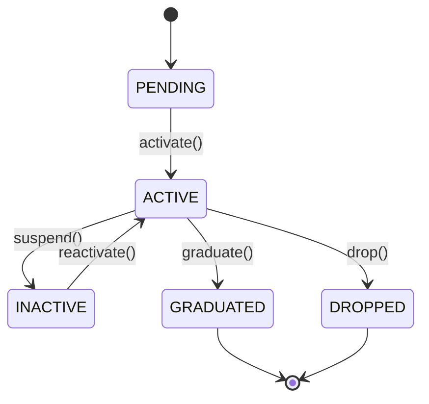

# Skill: Module Business Logic Specification

**Version:** 1.0
**Last Updated:** 2026-01-27
**Purpose:** Template và guidelines để đặc tả nghiệp vụ (business logic) của mỗi module trong Core Service

---

## 📋 Overview

Skill này định nghĩa cách document business logic, business rules, workflows, và validation của mỗi module trong **KiteClass Core Service**.

Mỗi module trong Core Service (Student, Course, Class, Enrollment, Attendance, Invoice, Payment, etc.) đều có:
- **Nghiệp vụ riêng** (business logic)
- **Business rules** cần tuân thủ
- **Workflows** cụ thể
- **State transitions** (chuyển trạng thái)
- **Integration points** với modules khác

---

## 🎯 Khi Nào Tạo Module Spec

**PHẢI TẠO** module spec khi:
- ✅ Implement module mới (Student, Course, Class, etc.)
- ✅ Module có business rules phức tạp
- ✅ Module có state machine (status transitions)
- ✅ Module có workflows nhiều bước
- ✅ Module tương tác với nhiều modules khác

**KHÔNG CẦN** tạo spec riêng khi:
- ❌ Module chỉ là CRUD đơn giản không có business logic
- ❌ Module là utility/helper không có nghiệp vụ

---

## 📐 Template Structure

Mỗi module spec phải có các sections sau:

### 1. Module Overview
```markdown
## Module: [Tên Module]

**Purpose:** [Mục đích của module]
**Priority:** P0/P1/P2
**Dependencies:** [Modules phụ thuộc]
**Related Modules:** [Modules liên quan]

### Business Context
[Giải thích context nghiệp vụ, tại sao cần module này]
```

### 2. Business Entities
```markdown
## Business Entities

### [Entity Name]

**Attributes:**
| Field | Type | Required | Validation | Description |
|-------|------|----------|------------|-------------|
| name | String | Yes | 2-100 chars | Student name |
| email | String | No | Valid email | Contact email |

**Status Values:**
| Status | Description | Can Transition To |
|--------|-------------|-------------------|
| ACTIVE | Currently active | INACTIVE, GRADUATED |
| INACTIVE | Temporarily inactive | ACTIVE, DROPPED |

**Relationships:**
- Has many: [Related entities]
- Belongs to: [Parent entities]
```

### 3. Business Rules
```markdown
## Business Rules

### BR-[Module]-001: [Rule Name]

**Description:** [Chi tiết rule]

**Conditions:**
- Điều kiện 1
- Điều kiện 2

**Validation:**
- Email must be unique across active students
- Phone must be Vietnamese format (0xxxxxxxxx)

**Exceptions:**
- `DuplicateResourceException` if email exists
- `ValidationException` if phone invalid

**Examples:**
```java
// Valid
createStudent("John Doe", "john@example.com", "0123456789")

// Invalid - duplicate email
createStudent("Jane Doe", "john@example.com", "0987654321")
→ throws DuplicateResourceException
```
```

### 4. Workflows & Use Cases
```markdown
## Workflows & Use Cases

### UC-[Module]-001: [Use Case Name]

**Actor:** [User role]
**Preconditions:**
- Precondition 1
- Precondition 2

**Main Flow:**
1. Actor performs action A
2. System validates data
3. System checks business rules
4. System updates state
5. System returns response

**Alternative Flows:**
- **AF1:** Validation fails → return error
- **AF2:** Business rule violated → return error

**Postconditions:**
- Entity created/updated
- State changed to X
- Event published

**Business Events:**
- `StudentCreatedEvent` → triggers notifications
- `StudentEnrolledEvent` → triggers invoice creation
```

### 5. State Machine
```markdown
## State Machine

### [Entity] Status Transitions



**Transition Rules:**

#### activate()
- **From:** PENDING
- **To:** ACTIVE
- **Conditions:** Email verified, payment received
- **Side Effects:** Send welcome email
- **Method:** `StudentService.activateStudent(Long id)`

#### suspend()
- **From:** ACTIVE
- **To:** INACTIVE
- **Conditions:** Request from parent/admin
- **Side Effects:** Pause enrollments, notify teacher
- **Method:** `StudentService.suspendStudent(Long id, String reason)`
```

### 6. Integration Points
```markdown
## Integration Points

### With Other Modules

#### Student → Enrollment
- **Direction:** Student creates Enrollments
- **Trigger:** Student enrolls in a class
- **Data Flow:** Student ID → Enrollment → Class
- **Business Rule:** Student can only enroll if status = ACTIVE

#### Student ← Invoice
- **Direction:** Invoice references Student
- **Trigger:** Enrollment created
- **Data Flow:** Invoice → Student ID
- **Business Rule:** Invoice amount based on student discount
```

### 7. Validation Rules
```markdown
## Validation Rules

### Field Validation

#### Email
- **Format:** Valid email format
- **Uniqueness:** Must be unique across non-deleted students
- **Check:** `studentRepository.existsByEmailAndDeletedFalse(email)`
- **Exception:** `DuplicateResourceException("email", email)`

#### Phone
- **Format:** Vietnamese phone (10 digits, starts with 0)
- **Pattern:** `^0\\d{9}$`
- **Uniqueness:** Must be unique across non-deleted students
- **Exception:** `ValidationException("Invalid phone format")`

### Business Validation

#### BR-STU-001: Enrollment Limit
- **Rule:** Student can have max 5 active enrollments
- **Check:** Count enrollments where status = ACTIVE
- **Exception:** `BusinessException("Maximum enrollment limit reached")`
```

### 8. Error Scenarios
```markdown
## Error Scenarios

### ES-[Module]-001: Duplicate Email

**Scenario:** Create student with existing email

**Input:**
```json
{
  "name": "John Doe",
  "email": "existing@example.com"
}
```

**Expected Behavior:**
- Check: `existsByEmailAndDeletedFalse(email)`
- Result: true
- Response: HTTP 409 Conflict
- Exception: `DuplicateResourceException("email", "existing@example.com")`
- Message: "email 'existing@example.com' already exists"

**Log Output:**
```
WARN: Duplicate email: existing@example.com
```

### ES-[Module]-002: Invalid State Transition

**Scenario:** Activate student from GRADUATED status

**Input:** `activateStudent(123)` where student.status = GRADUATED

**Expected Behavior:**
- Check: Current status allows activation?
- Result: false
- Response: HTTP 400 Bad Request
- Exception: `ValidationException("Cannot activate graduated student")`
```

### 9. Caching Strategy
```markdown
## Caching Strategy

### Cache Configuration

#### students (Single Entity)
- **Key:** `"students::" + id`
- **TTL:** 1 hour
- **Eviction:** On update, delete
- **Methods:**
  - `@Cacheable`: `getStudentById(Long id)`
  - `@CacheEvict`: `updateStudent(Long id, ...)`, `deleteStudent(Long id)`

#### students-list (Collection)
- **Key:** Custom (search + status + page)
- **TTL:** 5 minutes
- **Eviction:** On any create, update, delete
- **Methods:**
  - `@Cacheable`: `getStudents(String search, String status, Pageable)`
  - `@CacheEvict(allEntries=true)`: `createStudent(...)`, `updateStudent(...)`, `deleteStudent(...)`
```

### 10. Performance Considerations
```markdown
## Performance Considerations

### Database Indexes
- `idx_students_email` - Unique email lookup
- `idx_students_phone` - Unique phone lookup
- `idx_students_status` - Filter by status
- `idx_students_name` - Search by name

### Query Optimization
- Use `findByIdAndDeletedFalse()` to avoid soft-deleted records
- Use `@Query` with pagination for search
- Avoid N+1 queries with `@EntityGraph` for relationships

### Scalability
- Redis caching for frequently accessed students
- Pagination for list queries (max 100 per page)
- Async processing for bulk operations
```

---

## 📝 Example: Student Module

See `.claude/skills/student-module.md` for complete example.

---

## 🎨 Best Practices

### DO ✅

1. **Document ALL business rules** with unique IDs (BR-XXX-001)
2. **Include validation examples** (valid & invalid cases)
3. **Draw state diagrams** for status transitions
4. **Specify exceptions** thrown for each error case
5. **List integration points** with other modules
6. **Add mermaid diagrams** for complex flows
7. **Keep examples** realistic and testable
8. **Update** when business rules change

### DON'T ❌

1. **Don't mix** technical implementation với business logic
2. **Don't skip** error scenarios
3. **Don't forget** to update spec when code changes
4. **Don't document** obvious validation (e.g., "name is required")
5. **Don't overcomplicate** - focus on business value

---

## 🔄 Maintenance

### Khi Nào Update Module Spec

**PHẢI UPDATE** khi:
- ✅ Add new business rule
- ✅ Change validation logic
- ✅ Add/modify status transitions
- ✅ Add new workflow
- ✅ Change integration with other modules

**Review Frequency:**
- After mỗi PR có changes về business logic
- Quarterly review để ensure accuracy

---

## 📚 Related Skills

- `code-style.md` - For implementation patterns
- `api-design.md` - For API endpoints
- `database-design.md` - For schema design
- `testing-guide.md` - For testing business rules
- `error-logging.md` - For exception handling

---

## 📋 Checklist: Creating Module Spec

Khi tạo spec cho module mới, đảm bảo có:

- [ ] Module Overview (purpose, priority, dependencies)
- [ ] Business Entities (attributes, status values, relationships)
- [ ] Business Rules (với IDs, validation, exceptions)
- [ ] Workflows & Use Cases (main flow, alternative flows)
- [ ] State Machine (diagram, transition rules)
- [ ] Integration Points (với modules khác)
- [ ] Validation Rules (field validation, business validation)
- [ ] Error Scenarios (với expected behavior)
- [ ] Caching Strategy (nếu có)
- [ ] Performance Considerations (indexes, optimization)

---

## 🎯 File Naming Convention

Module specs được đặt tên theo pattern:
```
.claude/skills/[module-name]-module.md
```

Examples:
- `student-module.md`
- `course-module.md`
- `class-module.md`
- `enrollment-module.md`
- `attendance-module.md`
- `invoice-module.md`
- `payment-module.md`

---

**Last Updated:** 2026-01-27
**Author:** KiteClass Team
**Related:** architecture-overview.md, code-style.md, api-design.md
