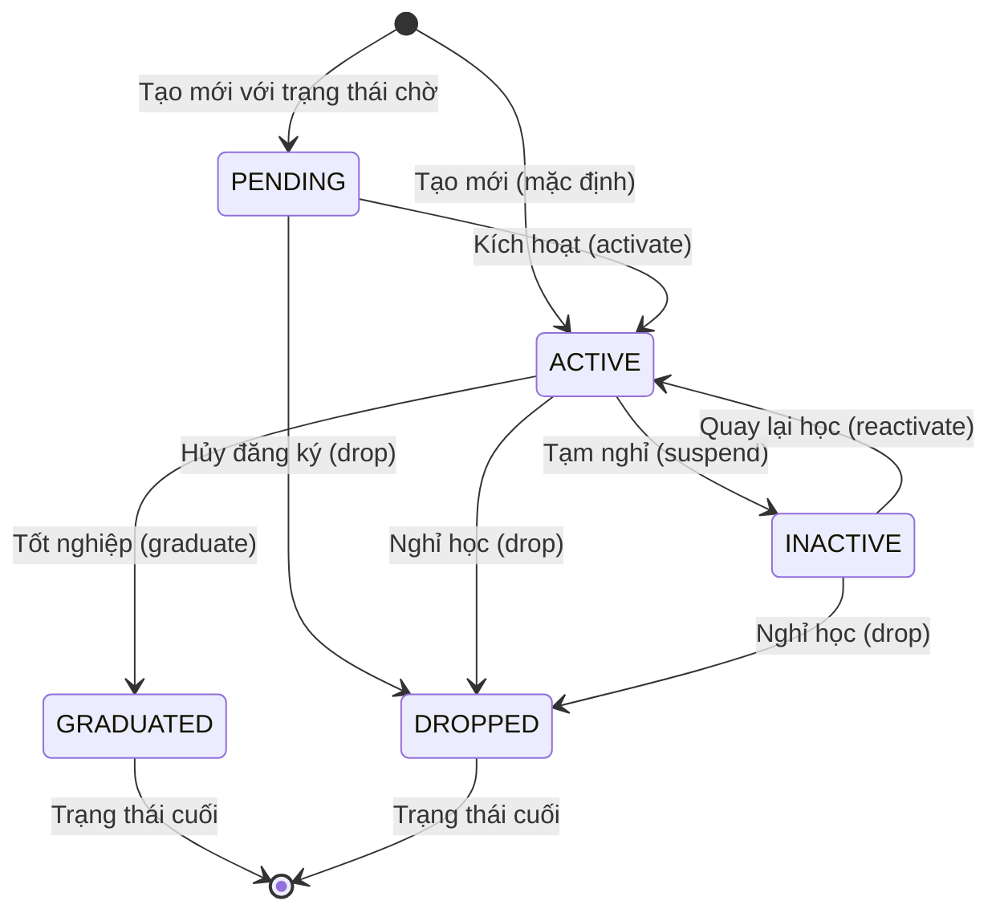

# Module Student - Tài Liệu Nghiệp Vụ

**Phiên bản:** 2.0 (Tiếng Việt)
**Cập nhật:** 2026-01-27
**Triển khai:** PR 2.3 (nhánh feature/core)
**Trạng thái:** ✅ Hoàn tất

---

## 1️⃣ Tổng Quan Module

### 📝 Mô tả

**Module Student** (Học viên) là module cốt lõi trong hệ thống KiteClass, quản lý toàn bộ thông tin và vòng đời của học viên từ khi đăng ký đến khi tốt nghiệp hoặc nghỉ học.

### 🎯 Mục đích nghiệp vụ

Module này giải quyết các nghiệp vụ sau:

1. **Quản lý hồ sơ học viên**: Lưu trữ thông tin cá nhân (tên, email, SĐT, ngày sinh, địa chỉ, v.v.)
2. **Theo dõi trạng thái học tập**: Quản lý trạng thái từ chờ xác nhận → đang học → tạm nghỉ → tốt nghiệp/nghỉ học
3. **Đảm bảo tính duy nhất**: Không cho phép trùng email hoặc SĐT giữa các học viên
4. **Soft Delete**: Không xóa vĩnh viễn dữ liệu, chỉ đánh dấu để giữ lại lịch sử
5. **Tích hợp với các module khác**: Kết nối với Enrollment (Đăng ký lớp), Invoice (Hóa đơn), Attendance (Điểm danh)

### 🏢 Bối cảnh kinh doanh

Trong một trung tâm đào tạo như KiteClass:

- **Học viên** là trung tâm của toàn bộ hoạt động
- Mỗi học viên có một **hồ sơ cá nhân** với thông tin liên hệ, ảnh đại diện
- Học viên **đăng ký học** nhiều lớp khác nhau (1 học viên → nhiều lớp)
- Học viên **điểm danh** tại các buổi học
- Học viên **nhận hóa đơn** học phí
- Học viên **có thể được quản lý bởi phụ huynh** (đối với học viên nhỏ tuổi)

**Ví dụ thực tế:**
```
Nguyễn Văn An (học viên)
├── Email: nguyenvanan@gmail.com
├── SĐT: 0912345678
├── Trạng thái: ACTIVE (đang học)
├── Đăng ký: 3 lớp (Toán 10, Lý 10, Hóa 10)
├── Điểm danh: 45/50 buổi trong tháng
├── Hóa đơn: 3,000,000 VNĐ/tháng
└── Phụ huynh: Nguyễn Văn Bình
```

### 🔑 Độ ưu tiên

**P0** - Module cốt lõi, bắt buộc phải có trước khi triển khai các module khác.

### 🔗 Phụ thuộc

**Không có phụ thuộc** - Module độc lập, không cần module khác để hoạt động.

### 🔗 Liên quan đến các module khác

| Module | Mối quan hệ | Mô tả |
|--------|------------|-------|
| **Enrollment** | Student → Enrollment | Học viên đăng ký học lớp |
| **Attendance** | Student → Attendance | Học viên điểm danh buổi học |
| **Invoice** | Student → Invoice | Học viên nhận hóa đơn học phí |
| **Parent** | Parent → Student | Phụ huynh quản lý học viên (tương lai) |

---

## 2️⃣ Thực Thể Nghiệp Vụ (Business Entities)

### Entity: Student

**Thực thể chính** trong module này, đại diện cho một học viên trong hệ thống.

#### 📋 Thuộc tính (Attributes)

| Trường | Kiểu dữ liệu | Bắt buộc | Ràng buộc | Mô tả |
|--------|-------------|----------|-----------|-------|
| **id** | Long | Auto | Primary Key | Mã định danh duy nhất |
| **name** | String | Có | 2-100 ký tự | Tên đầy đủ của học viên |
| **email** | String | Không | Email hợp lệ, duy nhất | Email liên lạc (có thể để trống) |
| **phone** | String | Không | 10 số (0xxxxxxxxx), duy nhất | Số điện thoại |
| **dateOfBirth** | LocalDate | Không | - | Ngày sinh (dùng để tính tuổi) |
| **gender** | Gender (Enum) | Không | MALE/FEMALE/OTHER | Giới tính |
| **address** | String | Không | Tối đa 1000 ký tự | Địa chỉ nhà |
| **avatarUrl** | String | Không | Tối đa 500 ký tự | Đường dẫn ảnh đại diện |
| **status** | StudentStatus | Có | Enum (5 giá trị) | Trạng thái hiện tại |
| **note** | String | Không | - | Ghi chú thêm (nội bộ) |
| **deleted** | Boolean | Có | Mặc định `false` | Cờ đánh dấu đã xóa (soft delete) |

**Lưu ý:**
- Trường `email` và `phone` **không bắt buộc** nhưng nếu có thì phải **duy nhất** trong hệ thống (loại trừ học viên đã xóa).
- Trường `deleted` dùng cho **soft delete pattern**: không xóa vĩnh viễn khỏi database, chỉ đánh dấu `deleted = true`.

#### 📊 Giá trị trạng thái (Status Values)

| Trạng thái | Mô tả | Có thể chuyển sang | Màu hiển thị |
|-----------|-------|-------------------|-------------|
| **PENDING** | Chờ xác nhận đăng ký | ACTIVE, DROPPED | Cam (Orange) |
| **ACTIVE** | Đang học | INACTIVE, GRADUATED, DROPPED | Xanh (Green) |
| **INACTIVE** | Tạm nghỉ | ACTIVE, DROPPED | Vàng (Yellow) |
| **GRADUATED** | Đã tốt nghiệp | *(Trạng thái cuối)* | Xanh dương (Blue) |
| **DROPPED** | Đã nghỉ học | *(Trạng thái cuối)* | Xám (Gray) |

**Ý nghĩa:**
- **PENDING**: Học viên mới đăng ký, chưa kích hoạt (ví dụ: chờ thanh toán học phí lần đầu)
- **ACTIVE**: Học viên đang học bình thường
- **INACTIVE**: Tạm nghỉ (ví dụ: nghỉ hè, nghỉ ốm dài hạn)
- **GRADUATED**: Đã hoàn thành chương trình học, tốt nghiệp
- **DROPPED**: Nghỉ học vĩnh viễn (không quay lại)

#### 🔗 Quan hệ với entities khác

- **Has Many Enrollments** (1 Student → nhiều Enrollment)
  - Một học viên có thể đăng ký nhiều lớp khác nhau
  - Ví dụ: Nguyễn Văn An đăng ký Toán 10, Lý 10, Hóa 10

- **Has Many Attendances** (1 Student → nhiều Attendance)
  - Một học viên có nhiều bản ghi điểm danh tại các buổi học
  - Ví dụ: Nguyễn Văn An điểm danh 45 buổi trong tháng

- **Has Many Invoices** (1 Student → nhiều Invoice)
  - Một học viên nhận nhiều hóa đơn học phí (theo tháng, theo khóa)
  - Ví dụ: Nguyễn Văn An có hóa đơn tháng 1, tháng 2, tháng 3

- **Belongs To Parent** (Student → Parent, tùy chọn)
  - Một học viên có thể thuộc về một phụ huynh (tính năng tương lai)
  - Ví dụ: Nguyễn Văn An (con) được quản lý bởi Nguyễn Văn Bình (cha)

---

## 3️⃣ Quy Tắc Kinh Doanh (Business Rules)

### BR-STU-001: Email Phải Duy Nhất

**Mô tả:**
Mỗi học viên (chưa bị xóa) phải có email duy nhất trong hệ thống. Không được phép có 2 học viên cùng email.

**Lý do:**
Email được dùng để:
- Đăng nhập vào hệ thống (nếu có tính năng login cho học viên)
- Gửi thông báo, hóa đơn qua email
- Khôi phục mật khẩu

Nếu trùng email sẽ gây nhầm lẫn khi gửi thông tin.

**Điều kiện áp dụng:**
- Email không được `null` hoặc rỗng
- Email chưa được sử dụng bởi học viên khác (với `deleted = false`)

**Cách kiểm tra (Validation):**

```java
// Trước khi tạo hoặc cập nhật học viên
if (email != null && studentRepository.existsByEmailAndDeletedFalse(email)) {
    throw new DuplicateResourceException("email", email);
}
```

**Nếu vi phạm:**
- **Exception:** `DuplicateResourceException("email", email)`
- **HTTP Status:** 409 Conflict
- **Message:** `"email 'nguyenvanan@gmail.com' đã tồn tại trong hệ thống"`

**Ví dụ thực tế:**

```java
// Hợp lệ - email chưa tồn tại
createStudent("Nguyễn Văn An", "nguyenvanan@gmail.com", "0912345678")
// → OK, tạo thành công

// Không hợp lệ - email đã tồn tại
createStudent("Trần Thị Bình", "nguyenvanan@gmail.com", "0987654321")
// → throws DuplicateResourceException("email", "nguyenvanan@gmail.com")
// → HTTP 409 Conflict
```

**Ngoại lệ:**
- Nếu học viên cũ đã bị xóa (`deleted = true`), email đó có thể được dùng lại cho học viên mới
- Ví dụ: Học viên A xóa tài khoản → email của A có thể được học viên B dùng

---

### BR-STU-002: Số Điện Thoại Phải Duy Nhất

**Mô tả:**
Mỗi học viên (chưa bị xóa) phải có số điện thoại duy nhất trong hệ thống.

**Lý do:**
Số điện thoại được dùng để:
- Liên lạc khẩn cấp
- Gửi thông báo SMS
- Xác thực OTP (tính năng tương lai)

**Điều kiện áp dụng:**
- Số điện thoại không được `null` hoặc rỗng
- Số điện thoại chưa được sử dụng bởi học viên khác (với `deleted = false`)
- Số điện thoại phải đúng format Việt Nam: **10 số, bắt đầu bằng 0**

**Format hợp lệ:**
- `0912345678` ✅
- `0987654321` ✅
- `123456` ❌ (không đủ 10 số)
- `1234567890` ❌ (không bắt đầu bằng 0)

**Cách kiểm tra (Validation):**

```java
// Kiểm tra format (annotation)
@Pattern(regexp = "^0\\d{9}$", message = "Số điện thoại không hợp lệ")

// Kiểm tra uniqueness (service)
if (phone != null && studentRepository.existsByPhoneAndDeletedFalse(phone)) {
    throw new DuplicateResourceException("phone", phone);
}
```

**Nếu vi phạm:**

**Trường hợp 1: Sai format**
- **Exception:** `ValidationException`
- **HTTP Status:** 400 Bad Request
- **Message:** `"Số điện thoại không hợp lệ (phải là 10 số bắt đầu bằng 0)"`

**Trường hợp 2: Trùng số**
- **Exception:** `DuplicateResourceException("phone", phone)`
- **HTTP Status:** 409 Conflict
- **Message:** `"phone '0912345678' đã tồn tại trong hệ thống"`

**Ví dụ thực tế:**

```java
// Hợp lệ
createStudent("Nguyễn Văn An", null, "0912345678")  // OK

// Không hợp lệ - sai format
createStudent("Trần Thị Bình", null, "123456")
// → ValidationException: "Số điện thoại không hợp lệ"

// Không hợp lệ - trùng số
createStudent("Lê Văn Cường", null, "0912345678")
// → DuplicateResourceException("phone", "0912345678")
```

---

### BR-STU-003: Xóa Mềm (Soft Delete)

**Mô tả:**
Học viên **không được xóa vĩnh viễn** khỏi database. Khi xóa học viên, hệ thống chỉ đánh dấu `deleted = true`.

**Lý do:**
- **Giữ lại lịch sử**: Dữ liệu điểm danh, hóa đơn, đăng ký lớp của học viên vẫn còn
- **Báo cáo**: Có thể xem lại học viên đã nghỉ trong quá khứ
- **Khôi phục**: Có thể kích hoạt lại học viên nếu quay lại học

**Cách thực hiện:**

```java
public void deleteStudent(Long id) {
    // Tìm học viên (chưa xóa)
    Student student = studentRepository.findByIdAndDeletedFalse(id)
        .orElseThrow(() -> new EntityNotFoundException("Student", id));

    // Đánh dấu xóa
    student.markAsDeleted();  // Sets deleted = true

    // Lưu vào database
    studentRepository.save(student);

    // Xóa cache
    // (annotation @CacheEvict sẽ tự động xóa)
}
```

**Tác động:**
- Học viên **không xuất hiện** trong các truy vấn thông thường (`findByIdAndDeletedFalse(...)`)
- Email/SĐT của học viên đã xóa **có thể được dùng lại** cho học viên mới
- Dữ liệu lịch sử (Enrollment, Attendance, Invoice) **vẫn được giữ nguyên**
- Có thể viết query riêng để xem học viên đã xóa: `findByDeletedTrue()`

**Ví dụ thực tế:**

```java
// Tạo học viên
Student student = createStudent("Nguyễn Văn An", "an@gmail.com", "0912345678");
// → student.id = 1, student.deleted = false

// Xóa học viên
deleteStudent(1);
// → student.deleted = true
// → student vẫn còn trong database

// Truy vấn bình thường không thấy học viên đã xóa
getStudentById(1);
// → throws EntityNotFoundException (vì query WHERE deleted = false)

// Email có thể dùng lại
createStudent("Trần Thị Bình", "an@gmail.com", "0987654321");
// → OK, vì học viên cũ đã deleted = true
```

---

### BR-STU-004: Quy Tắc Chuyển Trạng Thái

**Mô tả:**
Trạng thái học viên chỉ có thể chuyển đổi theo các quy tắc nhất định, không được chuyển tùy ý.

**Các chuyển đổi hợp lệ:**

| Từ trạng thái | Sang trạng thái | Điều kiện | Phương thức |
|--------------|-----------------|-----------|-------------|
| **PENDING** | **ACTIVE** | Xác nhận đăng ký | `activate()` |
| **PENDING** | **DROPPED** | Hủy đăng ký | `drop()` |
| **ACTIVE** | **INACTIVE** | Tạm nghỉ | `suspend()` |
| **ACTIVE** | **GRADUATED** | Hoàn thành khóa học | `graduate()` |
| **ACTIVE** | **DROPPED** | Nghỉ học vĩnh viễn | `drop()` |
| **INACTIVE** | **ACTIVE** | Quay lại học | `reactivate()` |
| **INACTIVE** | **DROPPED** | Nghỉ học vĩnh viễn | `drop()` |

**Các chuyển đổi KHÔNG hợp lệ:**

| Từ trạng thái | Sang trạng thái | Lý do |
|--------------|-----------------|-------|
| **GRADUATED** | Bất kỳ | Trạng thái cuối, không chuyển được |
| **DROPPED** | Bất kỳ | Trạng thái cuối, không chuyển được |
| **INACTIVE** | **GRADUATED** | Phải kích hoạt lại (ACTIVE) trước khi tốt nghiệp |
| **PENDING** | **GRADUATED** | Phải kích hoạt (ACTIVE) và học xong mới tốt nghiệp |

**Cách thực hiện:**

```java
// Kích hoạt học viên
public void activateStudent(Long id) {
    Student student = findByIdAndDeletedFalse(id);
    if (student.getStatus() != StudentStatus.PENDING) {
        throw new BusinessException("Chỉ có thể kích hoạt học viên ở trạng thái PENDING");
    }
    student.setStatus(StudentStatus.ACTIVE);
    studentRepository.save(student);
}

// Tạm nghỉ
public void suspendStudent(Long id) {
    Student student = findByIdAndDeletedFalse(id);
    if (student.getStatus() != StudentStatus.ACTIVE) {
        throw new BusinessException("Chỉ có thể tạm nghỉ học viên ở trạng thái ACTIVE");
    }
    student.setStatus(StudentStatus.INACTIVE);
    studentRepository.save(student);
}

// Tốt nghiệp
public void graduateStudent(Long id) {
    Student student = findByIdAndDeletedFalse(id);
    if (student.getStatus() != StudentStatus.ACTIVE) {
        throw new BusinessException("Chỉ có thể cho tốt nghiệp học viên ở trạng thái ACTIVE");
    }
    // Kiểm tra điều kiện tốt nghiệp (tính năng tương lai)
    // - Hoàn thành tất cả các lớp đã đăng ký
    // - Điểm danh đủ 80% buổi học
    student.setStatus(StudentStatus.GRADUATED);
    studentRepository.save(student);
}
```

**Ví dụ thực tế:**

```java
// Kịch bản 1: Học viên mới đăng ký
Student student = createStudent("Nguyễn Văn An", ...);
// → status = PENDING (mặc định)

activateStudent(student.getId());
// → status = ACTIVE ✅

// Kịch bản 2: Học viên tạm nghỉ
suspendStudent(student.getId());
// → status = INACTIVE ✅

reactivateStudent(student.getId());
// → status = ACTIVE ✅

// Kịch bản 3: Học viên tốt nghiệp
graduateStudent(student.getId());
// → status = GRADUATED ✅

// Cố gắng chuyển lại ACTIVE
activateStudent(student.getId());
// → BusinessException: "Không thể thay đổi trạng thái học viên đã tốt nghiệp" ❌
```

**Lưu ý:**
- Trong PR 2.3 hiện tại, chức năng chuyển trạng thái được thực hiện qua endpoint `PUT /api/v1/students/{id}` với `status` field
- Trong tương lai có thể tạo các endpoint riêng: `POST /api/v1/students/{id}/activate`, `POST /api/v1/students/{id}/suspend`, v.v.

---

### BR-STU-005: Giới Hạn Số Lớp Đăng Ký (Tính năng tương lai)

**Mô tả:**
Một học viên chỉ có thể đăng ký tối đa **5 lớp đang hoạt động** cùng lúc.

**Lý do:**
- Tránh quá tải: Học viên học quá nhiều lớp sẽ không theo kịp
- Quản lý lịch: Tránh trùng lịch học

**Cách kiểm tra (Tính năng tương lai):**

```java
public void enrollStudent(Long studentId, Long classId) {
    // Đếm số lớp đang hoạt động
    int activeEnrollments = enrollmentRepository
        .countByStudentIdAndStatus(studentId, EnrollmentStatus.ACTIVE);

    if (activeEnrollments >= 5) {
        throw new BusinessException("Học viên đã đăng ký tối đa 5 lớp");
    }

    // Tiếp tục đăng ký...
}
```

**Lưu ý:** Quy tắc này chưa được triển khai trong PR 2.3.

---

### BR-STU-006: Xác Thực Độ Tuổi (Tính năng tương lai)

**Mô tả:**
Học viên phải **từ 5 tuổi trở lên** để đăng ký học.

**Lý do:**
Trung tâm chỉ nhận học viên từ cấp tiểu học trở lên.

**Cách kiểm tra (Tính năng tương lai):**

```java
@AssertTrue(message = "Học viên phải từ 5 tuổi trở lên")
public boolean isValidAge() {
    if (dateOfBirth == null) return true; // Optional field

    int age = Period.between(dateOfBirth, LocalDate.now()).getYears();
    return age >= 5;
}
```

**Lưu ý:** Quy tắc này chưa được triển khai trong PR 2.3.

---

## 4️⃣ Quy Trình & Use Cases

### UC-STU-001: Tạo Học Viên Mới

**Tác nhân (Actor):** Admin, Staff (Nhân viên)

**Điều kiện tiên quyết:**
- Người dùng có quyền tạo học viên (`ROLE_ADMIN` hoặc `ROLE_STAFF`)
- Email/SĐT chưa được sử dụng bởi học viên khác

**Luồng chính:**

1. **Actor cung cấp thông tin học viên** (tên, email, SĐT, ngày sinh, v.v.)
2. **Hệ thống validate các trường bắt buộc**
   - `name`: không được rỗng, 2-100 ký tự
   - `status`: mặc định là `ACTIVE`
3. **Hệ thống kiểm tra email duy nhất** (BR-STU-001)
   - Gọi: `studentRepository.existsByEmailAndDeletedFalse(email)`
   - Nếu `true` → Chuyển sang **Luồng thay thế AF1**
4. **Hệ thống kiểm tra SĐT duy nhất** (BR-STU-002)
   - Gọi: `studentRepository.existsByPhoneAndDeletedFalse(phone)`
   - Nếu `true` → Chuyển sang **Luồng thay thế AF2**
5. **Hệ thống tạo entity Student** với status = `ACTIVE` (mặc định)
6. **Hệ thống lưu vào database**
   ```java
   Student student = Student.builder()
       .name(request.name())
       .email(request.email())
       .phone(request.phone())
       .status(StudentStatus.ACTIVE)
       .deleted(false)
       .build();
   studentRepository.save(student);
   ```
7. **Hệ thống lưu vào cache** (Redis, TTL 1 giờ)
8. **Hệ thống trả về thông tin học viên** dưới dạng DTO
   ```json
   {
     "id": 1,
     "name": "Nguyễn Văn An",
     "email": "nguyenvanan@gmail.com",
     "phone": "0912345678",
     "status": "ACTIVE",
     "deleted": false
   }
   ```
9. **Hệ thống ghi log**
   ```
   INFO: Created student with ID: 1, name: Nguyễn Văn An
   ```

**Luồng thay thế:**

**AF1: Email đã tồn tại**
- Hệ thống trả về HTTP 409 Conflict
- Response:
  ```json
  {
    "code": "DUPLICATE_RESOURCE",
    "message": "email 'nguyenvanan@gmail.com' đã tồn tại trong hệ thống",
    "path": "/api/v1/students",
    "timestamp": "2026-01-27T10:00:00Z"
  }
  ```
- Use case kết thúc

**AF2: Số điện thoại đã tồn tại**
- Tương tự AF1, nhưng message là `"phone '0912345678' đã tồn tại trong hệ thống"`

**AF3: Validation thất bại**
- Hệ thống trả về HTTP 400 Bad Request
- Response:
  ```json
  {
    "code": "VALIDATION_ERROR",
    "message": "Validation failed",
    "fieldErrors": {
      "name": ["Tên học viên không được để trống"],
      "phone": ["Số điện thoại không hợp lệ (phải là 10 số bắt đầu bằng 0)"]
    }
  }
  ```

**Điều kiện sau:**
- Học viên được tạo với status = `ACTIVE`
- Học viên được lưu trong cache Redis (1 giờ)
- Log ghi lại thao tác tạo học viên

**Sự kiện nghiệp vụ (Business Events):**
- *(Hiện tại không có)* Trong tương lai có thể gửi email chào mừng cho học viên

**Ví dụ API Request:**

```bash
POST /api/v1/students
Content-Type: application/json

{
  "name": "Nguyễn Văn An",
  "email": "nguyenvanan@gmail.com",
  "phone": "0912345678",
  "dateOfBirth": "2010-05-15",
  "gender": "MALE",
  "address": "123 Nguyễn Huệ, Quận 1, TP.HCM"
}
```

**Response thành công:**

```json
HTTP 201 Created

{
  "success": true,
  "message": "Tạo học viên thành công",
  "data": {
    "id": 1,
    "name": "Nguyễn Văn An",
    "email": "nguyenvanan@gmail.com",
    "phone": "0912345678",
    "dateOfBirth": "2010-05-15",
    "gender": "MALE",
    "address": "123 Nguyễn Huệ, Quận 1, TP.HCM",
    "status": "ACTIVE",
    "deleted": false
  }
}
```

---

### UC-STU-002: Cập Nhật Thông Tin Học Viên

**Tác nhân (Actor):** Admin, Staff

**Điều kiện tiên quyết:**
- Học viên tồn tại và chưa bị xóa (`deleted = false`)
- Người dùng có quyền cập nhật học viên

**Luồng chính:**

1. **Actor cung cấp ID học viên và thông tin cập nhật** (partial update)
2. **Hệ thống tìm học viên theo ID**
   ```java
   Student student = studentRepository.findByIdAndDeletedFalse(id)
       .orElseThrow(() -> new EntityNotFoundException("Student", id));
   ```
3. **Hệ thống validate dữ liệu mới**
   - Format email hợp lệ
   - Format SĐT hợp lệ (nếu thay đổi)
4. **Nếu email thay đổi, hệ thống kiểm tra email duy nhất** (BR-STU-001)
   - Nếu trùng → **Luồng thay thế AF2**
5. **Nếu SĐT thay đổi, hệ thống kiểm tra SĐT duy nhất** (BR-STU-002)
   - Nếu trùng → **Luồng thay thế AF3**
6. **Hệ thống áp dụng partial update** (chỉ cập nhật các trường không null)
   ```java
   if (request.name() != null) student.setName(request.name());
   if (request.email() != null) student.setEmail(request.email());
   if (request.phone() != null) student.setPhone(request.phone());
   // ...
   studentRepository.save(student);
   ```
7. **Hệ thống xóa cache** cho học viên này
   ```java
   @CacheEvict(value = "students", key = "#id")
   ```
8. **Hệ thống trả về thông tin đã cập nhật**
9. **Hệ thống ghi log**
   ```
   INFO: Updated student with ID: 1
   ```

**Luồng thay thế:**

**AF1: Học viên không tồn tại**
- HTTP 404 Not Found
- Message: `"Student with ID 999 not found"`

**AF2: Email mới đã tồn tại**
- HTTP 409 Conflict
- Message: `"email 'new@gmail.com' đã tồn tại trong hệ thống"`

**AF3: SĐT mới đã tồn tại**
- HTTP 409 Conflict
- Message: `"phone '0987654321' đã tồn tại trong hệ thống"`

**AF4: Validation thất bại**
- HTTP 400 Bad Request
- Message: Field errors

**Điều kiện sau:**
- Thông tin học viên được cập nhật
- Cache bị xóa (lần truy vấn tiếp theo sẽ load lại từ DB)
- Log ghi lại thao tác cập nhật

**Ví dụ API Request:**

```bash
PUT /api/v1/students/1
Content-Type: application/json

{
  "phone": "0987654321",
  "address": "456 Lê Lợi, Quận 3, TP.HCM"
}
```

**Response thành công:**

```json
HTTP 200 OK

{
  "success": true,
  "message": "Cập nhật học viên thành công",
  "data": {
    "id": 1,
    "name": "Nguyễn Văn An",  // không thay đổi
    "email": "nguyenvanan@gmail.com",  // không thay đổi
    "phone": "0987654321",  // ĐÃ CẬP NHẬT
    "address": "456 Lê Lợi, Quận 3, TP.HCM",  // ĐÃ CẬP NHẬT
    "status": "ACTIVE",
    "deleted": false
  }
}
```

---

### UC-STU-003: Tìm Kiếm Học Viên

**Tác nhân (Actor):** Admin, Staff, Teacher (Giáo viên)

**Điều kiện tiên quyết:**
- Người dùng có quyền xem danh sách học viên

**Luồng chính:**

1. **Actor cung cấp tiêu chí tìm kiếm** (keyword, status, page, size)
2. **Hệ thống xây dựng query:**
   - Lọc `deleted = false` (chỉ lấy học viên chưa xóa)
   - Lọc theo keyword: `name LIKE %keyword% OR email LIKE %keyword%`
   - Lọc theo status (nếu có): `status = 'ACTIVE'`
   - Áp dụng phân trang: `LIMIT size OFFSET page*size`
   - Sắp xếp theo `name` (mặc định)
3. **Hệ thống thực thi query**
   ```java
   Page<Student> students = studentRepository.findBySearchCriteria(
       keyword, status, PageRequest.of(page, size, Sort.by("name"))
   );
   ```
4. **Hệ thống map entities sang DTOs** (không trả về password hash, sensitive data)
5. **Hệ thống trả về kết quả phân trang**
   ```json
   {
     "content": [...],
     "totalElements": 150,
     "totalPages": 15,
     "pageNumber": 0,
     "pageSize": 10,
     "hasNext": true,
     "hasPrevious": false
   }
   ```
6. **Hệ thống ghi log**
   ```
   INFO: Searching students with keyword='nguyen', status='ACTIVE', page=0
   ```

**Luồng thay thế:**
- *(Không có)* Kết quả rỗng là hợp lệ

**Điều kiện sau:**
- Kết quả trả về với metadata phân trang
- Log ghi lại tiêu chí tìm kiếm

**Ví dụ API Request:**

```bash
GET /api/v1/students?search=nguyen&status=ACTIVE&page=0&size=10&sort=name
```

**Response thành công:**

```json
HTTP 200 OK

{
  "success": true,
  "data": {
    "content": [
      {
        "id": 1,
        "name": "Nguyễn Văn An",
        "email": "nguyenvanan@gmail.com",
        "phone": "0912345678",
        "status": "ACTIVE"
      },
      {
        "id": 5,
        "name": "Nguyễn Thị Bình",
        "email": "binhnt@gmail.com",
        "phone": "0987654321",
        "status": "ACTIVE"
      }
      // ... 8 học viên khác
    ],
    "totalElements": 25,
    "totalPages": 3,
    "pageNumber": 0,
    "pageSize": 10,
    "hasNext": true,
    "hasPrevious": false
  }
}
```

---

### UC-STU-004: Xóa Mềm Học Viên (Soft Delete)

**Tác nhân (Actor):** Admin (chỉ admin mới có quyền xóa)

**Điều kiện tiên quyết:**
- Học viên tồn tại và chưa bị xóa (`deleted = false`)
- Người dùng có quyền `ROLE_ADMIN`

**Luồng chính:**

1. **Actor yêu cầu xóa học viên theo ID**
2. **Hệ thống tìm học viên**
   ```java
   Student student = studentRepository.findByIdAndDeletedFalse(id)
       .orElseThrow(() -> new EntityNotFoundException("Student", id));
   ```
3. **Hệ thống đánh dấu xóa** (BR-STU-003)
   ```java
   student.markAsDeleted();  // deleted = true
   ```
4. **Hệ thống lưu vào database**
   ```java
   studentRepository.save(student);
   ```
5. **Hệ thống xóa cache**
   ```java
   @CacheEvict(value = "students", key = "#id")
   ```
6. **Hệ thống trả về success**
   ```json
   {
     "success": true,
     "message": "Xóa học viên thành công"
   }
   ```
7. **Hệ thống ghi log**
   ```
   INFO: Deleted (soft) student with ID: 1, name: Nguyễn Văn An
   ```

**Luồng thay thế:**

**AF1: Học viên không tồn tại**
- HTTP 404 Not Found
- Message: `"Student with ID 999 not found"`

**Điều kiện sau:**
- Học viên được đánh dấu `deleted = true`
- Học viên **không xuất hiện** trong các truy vấn thông thường
- Email/SĐT có thể được dùng lại cho học viên mới
- Dữ liệu lịch sử (Enrollment, Attendance, Invoice) **vẫn được giữ nguyên**
- Cache bị xóa
- Log ghi lại thao tác xóa

**Sự kiện nghiệp vụ (Business Events):**
- *(Hiện tại không có)* Không xóa cascade Enrollment, Attendance, Invoice
- Trong tương lai có thể gửi email thông báo cho phụ huynh

**Ví dụ API Request:**

```bash
DELETE /api/v1/students/1
```

**Response thành công:**

```json
HTTP 200 OK

{
  "success": true,
  "message": "Xóa học viên thành công"
}
```

**Lưu ý:**
- Sau khi xóa, học viên **vẫn còn trong database** nhưng `deleted = true`
- Có thể viết query riêng để xem học viên đã xóa: `SELECT * FROM students WHERE deleted = true`
- Nếu muốn khôi phục học viên, có thể tạo endpoint riêng: `POST /api/v1/students/{id}/restore`

---

## 5️⃣ Sơ Đồ Chuyển Trạng Thái (State Machine)

### Sơ đồ chuyển trạng thái học viên



### Chi tiết các chuyển đổi

#### 1. Kích hoạt (activate)

**Từ:** PENDING → **Sang:** ACTIVE

**Điều kiện:**
- Không có điều kiện đặc biệt (có thể kích hoạt bất cứ lúc nào)

**Tác động phụ:**
- Không có (học viên sẵn sàng đăng ký lớp)

**Cách thực hiện:**
```java
updateStudent(id, UpdateStudentRequest.builder()
    .status(StudentStatus.ACTIVE)
    .build());
```

**Ví dụ:**
```
Nguyễn Văn An đăng ký học nhưng chưa nộp học phí
→ Status = PENDING

Sau khi nộp học phí đầy đủ
→ Admin kích hoạt: Status = ACTIVE
```

---

#### 2. Tạm nghỉ (suspend)

**Từ:** ACTIVE → **Sang:** INACTIVE

**Điều kiện:**
- Không có điều kiện đặc biệt

**Tác động phụ:**
- Tính năng tương lai: Tạm dừng các Enrollment đang hoạt động
- Học viên không được điểm danh tại các buổi học

**Cách thực hiện:**
```java
updateStudent(id, UpdateStudentRequest.builder()
    .status(StudentStatus.INACTIVE)
    .build());
```

**Ví dụ:**
```
Nguyễn Văn An đang học (ACTIVE)
→ Phụ huynh yêu cầu nghỉ hè 2 tháng
→ Admin cập nhật: Status = INACTIVE

Sau 2 tháng, quay lại học
→ Admin kích hoạt lại: Status = ACTIVE
```

---

#### 3. Quay lại học (reactivate)

**Từ:** INACTIVE → **Sang:** ACTIVE

**Điều kiện:**
- Không có điều kiện đặc biệt

**Tác động phụ:**
- Tính năng tương lai: Kích hoạt lại các Enrollment đã tạm dừng
- Học viên có thể điểm danh trở lại

**Cách thực hiện:**
```java
updateStudent(id, UpdateStudentRequest.builder()
    .status(StudentStatus.ACTIVE)
    .build());
```

**Ví dụ:**
```
Nguyễn Văn An nghỉ hè 2 tháng (INACTIVE)
→ Sau hè, quay lại học
→ Admin kích hoạt: Status = ACTIVE
```

---

#### 4. Tốt nghiệp (graduate)

**Từ:** ACTIVE → **Sang:** GRADUATED

**Điều kiện:**
- Tính năng tương lai:
  - Hoàn thành tất cả các lớp đã đăng ký
  - Điểm danh đủ 80% buổi học (tùy quy định)
  - Điểm số đạt yêu cầu (nếu có)

**Tác động phụ:**
- **Trạng thái cuối**: Không thể chuyển sang trạng thái khác
- Học viên không thể đăng ký lớp mới

**Cách thực hiện:**
```java
public void graduateStudent(Long id) {
    Student student = findByIdAndDeletedFalse(id);

    if (student.getStatus() != StudentStatus.ACTIVE) {
        throw new BusinessException("Chỉ học viên ACTIVE mới có thể tốt nghiệp");
    }

    // Kiểm tra điều kiện tốt nghiệp (tương lai)
    // - Tất cả Enrollment đã hoàn thành
    // - Điểm danh đủ 80%

    student.setStatus(StudentStatus.GRADUATED);
    studentRepository.save(student);
}
```

**Ví dụ:**
```
Nguyễn Văn An học hết chương trình Toán 10, Lý 10, Hóa 10
→ Hoàn thành tất cả các lớp
→ Admin cập nhật: Status = GRADUATED
→ Không thể thay đổi trạng thái nữa (trạng thái cuối)
```

---

#### 5. Nghỉ học (drop)

**Từ:** PENDING / ACTIVE / INACTIVE → **Sang:** DROPPED

**Điều kiện:**
- Không có điều kiện đặc biệt (có thể nghỉ bất cứ lúc nào)

**Tác động phụ:**
- **Trạng thái cuối**: Không thể chuyển sang trạng thái khác
- Học viên không thể đăng ký lớp mới
- Enrollment hiện tại bị hủy (tính năng tương lai)

**Cách thực hiện:**
```java
updateStudent(id, UpdateStudentRequest.builder()
    .status(StudentStatus.DROPPED)
    .build());
```

**Ví dụ:**

**Trường hợp 1: Hủy đăng ký sớm**
```
Nguyễn Văn An đăng ký học (PENDING)
→ Sau 1 tuần, không muốn học nữa
→ Admin cập nhật: Status = DROPPED
```

**Trường hợp 2: Nghỉ giữa chừng**
```
Nguyễn Văn An đang học (ACTIVE)
→ Gia đình chuyển nhà, không tiếp tục học
→ Admin cập nhật: Status = DROPPED
```

**Trường hợp 3: Nghỉ sau khi tạm nghỉ**
```
Nguyễn Văn An tạm nghỉ 2 tháng (INACTIVE)
→ Quyết định không quay lại học
→ Admin cập nhật: Status = DROPPED
```

---

### Chuyển đổi KHÔNG hợp lệ

| Từ trạng thái | Sang trạng thái | Lý do |
|--------------|-----------------|-------|
| **GRADUATED** | Bất kỳ | Đã tốt nghiệp, không thể thay đổi |
| **DROPPED** | Bất kỳ | Đã nghỉ học, không thể kích hoạt lại |
| **INACTIVE** | **GRADUATED** | Phải kích hoạt lại (ACTIVE) trước |
| **PENDING** | **GRADUATED** | Phải kích hoạt và học xong mới tốt nghiệp |
| **PENDING** | **INACTIVE** | Chưa kích hoạt thì không thể tạm nghỉ |

**Ví dụ chuyển đổi không hợp lệ:**

```java
// Học viên đã tốt nghiệp
Student student = getStudentById(1);
// student.status = GRADUATED

updateStudent(1, UpdateStudentRequest.builder()
    .status(StudentStatus.ACTIVE)
    .build());
// → BusinessException: "Không thể thay đổi trạng thái học viên đã tốt nghiệp"

// Học viên tạm nghỉ muốn tốt nghiệp trực tiếp
Student student = getStudentById(2);
// student.status = INACTIVE

updateStudent(2, UpdateStudentRequest.builder()
    .status(StudentStatus.GRADUATED)
    .build());
// → BusinessException: "Chỉ học viên ACTIVE mới có thể tốt nghiệp"
```

---

## 6️⃣ Điểm Tích Hợp Với Module Khác

### 6.1. Student → Enrollment (Đăng ký lớp)

**Hướng:** Student tạo Enrollment

**Kích hoạt:** Khi học viên đăng ký một lớp học

**Luồng dữ liệu:**
```
Student (id=1) → Enrollment (studentId=1, classId=5) → Class (id=5)
```

**Quy tắc nghiệp vụ:**
- Học viên chỉ có thể đăng ký lớp nếu `status = ACTIVE` (validation tương lai)
- Một học viên có thể đăng ký tối đa 5 lớp cùng lúc (BR-STU-005, tương lai)

**Cách thực hiện:**
```java
// EnrollmentService
public EnrollmentResponse enrollStudent(Long studentId, Long classId) {
    // Kiểm tra student tồn tại
    Student student = studentRepository.findByIdAndDeletedFalse(studentId)
        .orElseThrow(() -> new EntityNotFoundException("Student", studentId));

    // Kiểm tra status (tương lai)
    if (student.getStatus() != StudentStatus.ACTIVE) {
        throw new BusinessException("Chỉ học viên ACTIVE mới có thể đăng ký lớp");
    }

    // Kiểm tra giới hạn số lớp (tương lai)
    int activeEnrollments = enrollmentRepository
        .countByStudentIdAndStatus(studentId, EnrollmentStatus.ACTIVE);
    if (activeEnrollments >= 5) {
        throw new BusinessException("Học viên đã đăng ký tối đa 5 lớp");
    }

    // Tạo Enrollment
    Enrollment enrollment = Enrollment.builder()
        .studentId(studentId)
        .classId(classId)
        .status(EnrollmentStatus.ACTIVE)
        .build();

    return enrollmentRepository.save(enrollment);
}
```

**Ví dụ thực tế:**
```
Nguyễn Văn An (id=1, status=ACTIVE)
→ Đăng ký lớp Toán 10 (classId=5)
→ Tạo Enrollment(studentId=1, classId=5, status=ACTIVE)
→ An có thể điểm danh tại các buổi học của lớp Toán 10
```

---

### 6.2. Student ← Invoice (Hóa đơn học phí)

**Hướng:** Invoice tham chiếu đến Student

**Kích hoạt:** Khi tạo hóa đơn học phí cho học viên

**Luồng dữ liệu:**
```
Enrollment (studentId=1, classId=5)
→ InvoiceService.createInvoice(enrollmentId)
→ Invoice (studentId=1, amount=1,000,000 VNĐ)
```

**Quy tắc nghiệp vụ:**
- Mỗi Enrollment tạo ra ít nhất 1 Invoice (hóa đơn học phí)
- Số tiền hóa đơn có thể khác nhau tùy học viên (giảm giá, ưu đãi)

**Cách thực hiện:**
```java
// InvoiceService
public InvoiceResponse createInvoice(Long enrollmentId) {
    // Lấy Enrollment
    Enrollment enrollment = enrollmentRepository.findById(enrollmentId)
        .orElseThrow(() -> new EntityNotFoundException("Enrollment", enrollmentId));

    // Lấy Student từ Enrollment
    Student student = studentRepository.findById(enrollment.getStudentId())
        .orElseThrow(() -> new EntityNotFoundException("Student", enrollment.getStudentId()));

    // Tính học phí (có thể giảm giá tùy student)
    BigDecimal amount = calculateTuitionFee(student, enrollment);

    // Tạo Invoice
    Invoice invoice = Invoice.builder()
        .studentId(student.getId())
        .enrollmentId(enrollmentId)
        .amount(amount)
        .status(InvoiceStatus.PENDING)
        .build();

    return invoiceRepository.save(invoice);
}
```

**Ví dụ thực tế:**
```
Nguyễn Văn An (id=1)
└── Đăng ký lớp Toán 10 (Enrollment: id=10, studentId=1, classId=5)
    └── Tạo hóa đơn (Invoice: id=20, studentId=1, amount=1,000,000 VNĐ, dueDate=2026-02-01)
```

---

### 6.3. Student → Attendance (Điểm danh)

**Hướng:** Student có bản ghi Attendance

**Kích hoạt:** Khi giáo viên điểm danh học viên tại một buổi học

**Luồng dữ liệu:**
```
ClassSession (id=100, classId=5, date=2026-01-27)
→ Teacher marks attendance
→ Attendance (sessionId=100, studentId=1, status=PRESENT)
```

**Quy tắc nghiệp vụ:**
- Chỉ được điểm danh học viên **đã đăng ký lớp** (có Enrollment tương ứng)
- Học viên có thể bị điểm danh nhiều lần (nhiều buổi học khác nhau)

**Cách thực hiện:**
```java
// AttendanceService
public AttendanceResponse markAttendance(
    Long sessionId,
    Long studentId,
    AttendanceStatus status
) {
    // Lấy session
    ClassSession session = sessionRepository.findById(sessionId)
        .orElseThrow(() -> new EntityNotFoundException("ClassSession", sessionId));

    // Kiểm tra student có enroll vào class này không
    boolean enrolled = enrollmentRepository.existsByStudentIdAndClassId(
        studentId, session.getClassId()
    );
    if (!enrolled) {
        throw new BusinessException("Học viên chưa đăng ký lớp này");
    }

    // Tạo hoặc cập nhật Attendance
    Attendance attendance = Attendance.builder()
        .sessionId(sessionId)
        .studentId(studentId)
        .status(status)  // PRESENT, ABSENT, LATE, EXCUSED
        .build();

    return attendanceRepository.save(attendance);
}
```

**Ví dụ thực tế:**
```
Nguyễn Văn An (id=1)
└── Đăng ký lớp Toán 10 (Enrollment: classId=5)
    └── Buổi học ngày 27/01/2026 (ClassSession: id=100)
        └── Điểm danh: PRESENT (Có mặt)

Kết quả:
Attendance(sessionId=100, studentId=1, status=PRESENT, markedAt=2026-01-27T14:00:00)
```

---

### 6.4. Student ← Parent (Phụ huynh quản lý)

**Hướng:** Parent quản lý Student

**Kích hoạt:** Khi tạo tài khoản phụ huynh và liên kết với học viên

**Luồng dữ liệu:**
```
Parent (id=50, name="Nguyễn Văn Bình")
→ Quản lý nhiều Student (studentIds=[1, 2, 3])
```

**Quy tắc nghiệp vụ:**
- Một phụ huynh có thể quản lý **nhiều học viên** (anh em ruột)
- Một học viên **chỉ thuộc về 1 phụ huynh** (hoặc không có)

**Cách thực hiện (Tính năng tương lai):**

**Cách 1: Parent entity có List<Student>**
```java
@Entity
public class Parent {
    @Id
    private Long id;
    private String name;
    private String email;
    private String phone;

    @OneToMany(mappedBy = "parent")
    private List<Student> students;
}

@Entity
public class Student {
    @Id
    private Long id;
    private String name;

    @ManyToOne
    @JoinColumn(name = "parent_id")
    private Parent parent;
}
```

**Cách 2: Bảng mapping riêng**
```sql
CREATE TABLE parent_students (
    parent_id BIGINT NOT NULL,
    student_id BIGINT NOT NULL,
    PRIMARY KEY (parent_id, student_id),
    FOREIGN KEY (parent_id) REFERENCES parents(id),
    FOREIGN KEY (student_id) REFERENCES students(id)
);
```

**Ví dụ thực tế:**
```
Phụ huynh: Nguyễn Văn Bình (id=50)
├── Quản lý: Nguyễn Văn An (id=1, con trai)
├── Quản lý: Nguyễn Thị Cẩm (id=2, con gái)
└── Quản lý: Nguyễn Văn Dũng (id=3, con trai)

Phụ huynh có thể:
- Xem lịch học của 3 con
- Xem hóa đơn học phí của 3 con
- Xem điểm danh của 3 con
- Nhận thông báo nếu con vắng mặt
```

**Lưu ý:** Tính năng Parent chưa được triển khai trong PR 2.3, sẽ được thêm vào PR tương lai.

---

## 7️⃣ Quy Tắc Validation

### 7.1. Validation cấp trường (Field Validation)

#### Trường: name (Tên học viên)

**Bắt buộc:** Có

**Format:** 2-100 ký tự

**Annotation:**
```java
@NotBlank(message = "Tên học viên không được để trống")
@Size(min = 2, max = 100, message = "Tên học viên phải từ 2-100 ký tự")
private String name;
```

**Nếu vi phạm:**
- **Exception:** `ValidationException` (Spring tự động xử lý)
- **HTTP Status:** 400 Bad Request
- **Field Error:**
  ```json
  {
    "fieldErrors": {
      "name": ["Tên học viên không được để trống"]
    }
  }
  ```

**Ví dụ:**
```java
// Hợp lệ
createStudent("Nguyễn Văn An", ...)  // OK
createStudent("An", ...)  // OK (2 ký tự)

// Không hợp lệ
createStudent("", ...)  // ❌ Rỗng
createStudent("A", ...)  // ❌ Chỉ 1 ký tự
createStudent("Nguyễn Văn An Bình Cường Dũng Hải Khôi Long Minh Nam Phúc Quân...", ...)
// ❌ Quá 100 ký tự
```

---

#### Trường: email

**Bắt buộc:** Không (tùy chọn)

**Format:** Email hợp lệ (theo RFC 5322)

**Uniqueness:** Phải duy nhất trong hệ thống (loại trừ học viên đã xóa)

**Annotation:**
```java
@Email(message = "Email không hợp lệ")
@Size(max = 255, message = "Email tối đa 255 ký tự")
private String email;
```

**Validation trong Service:**
```java
if (email != null && studentRepository.existsByEmailAndDeletedFalse(email)) {
    throw new DuplicateResourceException("email", email);
}
```

**Nếu vi phạm:**

**Trường hợp 1: Sai format**
- **Exception:** `ValidationException`
- **HTTP Status:** 400 Bad Request
- **Field Error:** `"Email không hợp lệ"`

**Trường hợp 2: Trùng email**
- **Exception:** `DuplicateResourceException("email", email)`
- **HTTP Status:** 409 Conflict
- **Message:** `"email 'example@gmail.com' đã tồn tại trong hệ thống"`

**Ví dụ:**
```java
// Hợp lệ
createStudent("Nguyễn Văn An", "nguyenvanan@gmail.com", ...)  // OK
createStudent("Nguyễn Văn An", null, ...)  // OK (email tùy chọn)

// Không hợp lệ - sai format
createStudent("Nguyễn Văn An", "invalid-email", ...)
// ❌ ValidationException: "Email không hợp lệ"

createStudent("Nguyễn Văn An", "nguyen@", ...)
// ❌ ValidationException: "Email không hợp lệ"

// Không hợp lệ - trùng email
createStudent("Trần Thị Bình", "nguyenvanan@gmail.com", ...)
// ❌ DuplicateResourceException (email đã tồn tại)
```

---

#### Trường: phone (Số điện thoại)

**Bắt buộc:** Không (tùy chọn)

**Format:** 10 số, bắt đầu bằng 0 (định dạng Việt Nam)

**Pattern:** `^0\\d{9}$`

**Uniqueness:** Phải duy nhất trong hệ thống (loại trừ học viên đã xóa)

**Annotation:**
```java
@Pattern(
    regexp = "^0\\d{9}$",
    message = "Số điện thoại không hợp lệ (phải là 10 số bắt đầu bằng 0)"
)
private String phone;
```

**Validation trong Service:**
```java
if (phone != null && studentRepository.existsByPhoneAndDeletedFalse(phone)) {
    throw new DuplicateResourceException("phone", phone);
}
```

**Nếu vi phạm:**

**Trường hợp 1: Sai format**
- **Exception:** `ValidationException`
- **HTTP Status:** 400 Bad Request
- **Field Error:** `"Số điện thoại không hợp lệ (phải là 10 số bắt đầu bằng 0)"`

**Trường hợp 2: Trùng số**
- **Exception:** `DuplicateResourceException("phone", phone)`
- **HTTP Status:** 409 Conflict
- **Message:** `"phone '0912345678' đã tồn tại trong hệ thống"`

**Ví dụ:**
```java
// Hợp lệ
createStudent("Nguyễn Văn An", null, "0912345678")  // OK
createStudent("Nguyễn Văn An", null, "0987654321")  // OK
createStudent("Nguyễn Văn An", null, null)  // OK (phone tùy chọn)

// Không hợp lệ - sai format
createStudent("Nguyễn Văn An", null, "123456")
// ❌ ValidationException: "Số điện thoại không hợp lệ"

createStudent("Nguyễn Văn An", null, "1234567890")
// ❌ ValidationException: "Số điện thoại không hợp lệ" (không bắt đầu bằng 0)

createStudent("Nguyễn Văn An", null, "09123456789")
// ❌ ValidationException: "Số điện thoại không hợp lệ" (11 số)

// Không hợp lệ - trùng số
createStudent("Trần Thị Bình", null, "0912345678")
// ❌ DuplicateResourceException (phone đã tồn tại)
```

---

#### Trường: address (Địa chỉ)

**Bắt buộc:** Không (tùy chọn)

**Format:** Tối đa 1000 ký tự

**Annotation:**
```java
@Size(max = 1000, message = "Địa chỉ tối đa 1000 ký tự")
private String address;
```

**Ví dụ:**
```java
// Hợp lệ
createStudent("Nguyễn Văn An", null, null, "123 Nguyễn Huệ, Quận 1, TP.HCM")  // OK
createStudent("Nguyễn Văn An", null, null, null)  // OK (address tùy chọn)

// Không hợp lệ
createStudent("Nguyễn Văn An", null, null, "Very long address...1001 chars...")
// ❌ ValidationException: "Địa chỉ tối đa 1000 ký tự"
```

---

#### Trường: dateOfBirth (Ngày sinh)

**Bắt buộc:** Không (tùy chọn)

**Format:** LocalDate (yyyy-MM-dd)

**Annotation:**
```java
private LocalDate dateOfBirth;
```

**Validation bổ sung (Tính năng tương lai - BR-STU-006):**
```java
@AssertTrue(message = "Học viên phải từ 5 tuổi trở lên")
public boolean isValidAge() {
    if (dateOfBirth == null) return true;  // Optional field

    int age = Period.between(dateOfBirth, LocalDate.now()).getYears();
    return age >= 5;
}
```

**Ví dụ:**
```java
// Hợp lệ
createStudent("Nguyễn Văn An", ..., LocalDate.of(2010, 5, 15))  // 15 tuổi - OK

// Không hợp lệ (tương lai)
createStudent("Nguyễn Văn An", ..., LocalDate.of(2023, 1, 1))  // 3 tuổi - ❌ Quá nhỏ
```

---

#### Trường: gender (Giới tính)

**Bắt buộc:** Không (tùy chọn)

**Giá trị hợp lệ:** MALE, FEMALE, OTHER

**Annotation:**
```java
@Enumerated(EnumType.STRING)
private Gender gender;
```

**Ví dụ:**
```java
// Hợp lệ
createStudent("Nguyễn Văn An", ..., Gender.MALE)  // OK
createStudent("Trần Thị Bình", ..., Gender.FEMALE)  // OK
createStudent("Nguyễn Văn Cường", ..., null)  // OK (tùy chọn)

// Không hợp lệ
createStudent("Nguyễn Văn An", ..., "INVALID")
// ❌ ValidationException: "Giá trị gender không hợp lệ"
```

---

### 7.2. Validation nghiệp vụ (Business Validation)

#### BV-1: Email Uniqueness (BR-STU-001)

**Khi kiểm tra:** Trước khi tạo hoặc cập nhật học viên

**Logic:**
```java
// Tạo mới
if (email != null) {
    boolean exists = studentRepository.existsByEmailAndDeletedFalse(email);
    if (exists) {
        throw new DuplicateResourceException("email", email);
    }
}

// Cập nhật
if (email != null && !email.equals(existingStudent.getEmail())) {
    boolean exists = studentRepository.existsByEmailAndDeletedFalse(email);
    if (exists) {
        throw new DuplicateResourceException("email", email);
    }
}
```

---

#### BV-2: Phone Uniqueness (BR-STU-002)

**Khi kiểm tra:** Trước khi tạo hoặc cập nhật học viên

**Logic:**
```java
// Tạo mới
if (phone != null) {
    boolean exists = studentRepository.existsByPhoneAndDeletedFalse(phone);
    if (exists) {
        throw new DuplicateResourceException("phone", phone);
    }
}

// Cập nhật
if (phone != null && !phone.equals(existingStudent.getPhone())) {
    boolean exists = studentRepository.existsByPhoneAndDeletedFalse(phone);
    if (exists) {
        throw new DuplicateResourceException("phone", phone);
    }
}
```

---

#### BV-3: Enrollment Limit (BR-STU-005, Tính năng tương lai)

**Khi kiểm tra:** Trước khi đăng ký lớp mới

**Logic:**
```java
public void enrollStudent(Long studentId, Long classId) {
    int activeEnrollments = enrollmentRepository
        .countByStudentIdAndStatus(studentId, EnrollmentStatus.ACTIVE);

    if (activeEnrollments >= 5) {
        throw new BusinessException("Học viên đã đăng ký tối đa 5 lớp");
    }

    // Tiếp tục đăng ký...
}
```

---

#### BV-4: Age Validation (BR-STU-006, Tính năng tương lai)

**Khi kiểm tra:** Trước khi tạo học viên

**Logic:**
```java
if (request.dateOfBirth() != null) {
    int age = Period.between(request.dateOfBirth(), LocalDate.now()).getYears();
    if (age < 5) {
        throw new ValidationException("Học viên phải từ 5 tuổi trở lên");
    }
}
```

---

## 8️⃣ Các Tình Huống Lỗi (Error Scenarios)

### ES-STU-001: Email Trùng Lặp

**Tình huống:** Tạo học viên với email đã tồn tại

**Input:**
```bash
POST /api/v1/students
Content-Type: application/json

{
  "name": "Trần Thị Bình",
  "email": "nguyenvanan@gmail.com",  // Email đã tồn tại
  "phone": "0987654321"
}
```

**Hành vi mong đợi:**

1. Hệ thống kiểm tra: `existsByEmailAndDeletedFalse("nguyenvanan@gmail.com")`
2. Kết quả: `true` (email đã tồn tại)
3. Hệ thống throw: `DuplicateResourceException("email", "nguyenvanan@gmail.com")`

**Response:**
```json
HTTP 409 Conflict

{
  "code": "DUPLICATE_RESOURCE",
  "message": "email 'nguyenvanan@gmail.com' đã tồn tại trong hệ thống",
  "path": "/api/v1/students",
  "timestamp": "2026-01-27T10:00:00Z"
}
```

**Log Output:**
```
WARN: Duplicate email: nguyenvanan@gmail.com
```

---

### ES-STU-002: Số Điện Thoại Không Hợp Lệ

**Tình huống:** Tạo học viên với SĐT sai format

**Input:**
```bash
POST /api/v1/students
Content-Type: application/json

{
  "name": "Nguyễn Văn Cường",
  "phone": "123456"  // Không đúng format (phải 10 số, bắt đầu bằng 0)
}
```

**Hành vi mong đợi:**

1. Spring validation kiểm tra `@Pattern(regexp = "^0\\d{9}$")`
2. Kết quả: Sai format
3. Hệ thống throw: `ValidationException`

**Response:**
```json
HTTP 400 Bad Request

{
  "code": "VALIDATION_ERROR",
  "message": "Validation failed for one or more fields",
  "path": "/api/v1/students",
  "timestamp": "2026-01-27T10:00:00Z",
  "fieldErrors": {
    "phone": ["Số điện thoại không hợp lệ (phải là 10 số bắt đầu bằng 0)"]
  }
}
```

**Log Output:**
```
WARN: Validation error: phone format invalid
```

---

### ES-STU-003: Học Viên Không Tồn Tại

**Tình huống:** Lấy thông tin học viên với ID không tồn tại

**Input:**
```bash
GET /api/v1/students/999
```

**Hành vi mong đợi:**

1. Hệ thống tìm kiếm: `findByIdAndDeletedFalse(999)`
2. Kết quả: `Optional.empty()`
3. Hệ thống throw: `EntityNotFoundException("Student", 999)`

**Response:**
```json
HTTP 404 Not Found

{
  "code": "ENTITY_NOT_FOUND",
  "message": "Student with ID 999 not found",
  "path": "/api/v1/students/999",
  "timestamp": "2026-01-27T10:00:00Z"
}
```

**Log Output:**
```
WARN: Student not found with ID: 999
```

---

### ES-STU-004: Cập Nhật Học Viên Đã Xóa

**Tình huống:** Cố gắng cập nhật học viên đã bị soft delete

**Input:**
```bash
PUT /api/v1/students/123
Content-Type: application/json

{
  "name": "Nguyễn Văn An Mới"
}
```

**Giả sử:** Học viên ID 123 có `deleted = true`

**Hành vi mong đợi:**

1. Hệ thống tìm kiếm: `findByIdAndDeletedFalse(123)`
2. Kết quả: `Optional.empty()` (vì deleted = true bị loại trừ)
3. Hệ thống throw: `EntityNotFoundException("Student", 123)`

**Response:**
```json
HTTP 404 Not Found

{
  "code": "ENTITY_NOT_FOUND",
  "message": "Student with ID 123 not found",
  "path": "/api/v1/students/123",
  "timestamp": "2026-01-27T10:00:00Z"
}
```

**Lưu ý:** Học viên đã xóa **không thể cập nhật** thông qua endpoint thông thường. Nếu muốn khôi phục, cần endpoint riêng: `POST /api/v1/students/{id}/restore`

---

### ES-STU-005: Tên Học Viên Quá Ngắn

**Tình huống:** Tạo học viên với tên chỉ 1 ký tự

**Input:**
```bash
POST /api/v1/students
Content-Type: application/json

{
  "name": "A",  // Chỉ 1 ký tự (yêu cầu 2-100)
  "email": "a@example.com"
}
```

**Hành vi mong đợi:**

1. Spring validation kiểm tra `@Size(min=2, max=100)`
2. Kết quả: Sai (chỉ 1 ký tự)
3. Hệ thống throw: `ValidationException`

**Response:**
```json
HTTP 400 Bad Request

{
  "code": "VALIDATION_ERROR",
  "message": "Validation failed for one or more fields",
  "fieldErrors": {
    "name": ["Tên học viên phải từ 2-100 ký tự"]
  }
}
```

---

### ES-STU-006: Chuyển Trạng Thái Không Hợp Lệ

**Tình huống:** Cố gắng chuyển học viên đã tốt nghiệp về trạng thái ACTIVE

**Input:**
```bash
PUT /api/v1/students/1
Content-Type: application/json

{
  "status": "ACTIVE"
}
```

**Giả sử:** Học viên ID 1 có `status = GRADUATED`

**Hành vi mong đợi:**

1. Hệ thống kiểm tra trạng thái hiện tại: `GRADUATED`
2. Hệ thống kiểm tra quy tắc chuyển đổi (BR-STU-004)
3. Kết quả: GRADUATED là trạng thái cuối, không thể chuyển
4. Hệ thống throw: `BusinessException("Không thể thay đổi trạng thái học viên đã tốt nghiệp")`

**Response:**
```json
HTTP 400 Bad Request

{
  "code": "BUSINESS_RULE_VIOLATION",
  "message": "Không thể thay đổi trạng thái học viên đã tốt nghiệp",
  "path": "/api/v1/students/1",
  "timestamp": "2026-01-27T10:00:00Z"
}
```

**Lưu ý:** Trong PR 2.3 hiện tại, validation chuyển trạng thái chưa được triển khai hoàn toàn. Tính năng này sẽ được thêm trong PR tương lai.

---

## 9️⃣ Chiến Lược Cache

### 9.1. Cấu hình Cache

#### Cache cho Entity đơn lẻ

**Cache Name:** `students`

**Key:** ID của học viên (`#id`)

**TTL:** 1 giờ (3600 giây)

**Eviction:** Khi update hoặc delete

**Phương thức áp dụng:**

```java
// Get student by ID - Cacheable
@Cacheable(value = "students", key = "#id")
public StudentResponse getStudentById(Long id) {
    Student student = studentRepository.findByIdAndDeletedFalse(id)
        .orElseThrow(() -> new EntityNotFoundException("Student", id));
    return studentMapper.toResponse(student);
}
```

**Luồng hoạt động:**

1. **Lần gọi đầu tiên:** `getStudentById(1)`
   - Kiểm tra Redis: Không có `students::1`
   - Truy vấn database: `SELECT * FROM students WHERE id = 1 AND deleted = false`
   - Lưu vào Redis: `students::1` = `{id:1, name:"Nguyễn Văn An", ...}` (TTL 1 giờ)
   - Trả về kết quả

2. **Lần gọi thứ 2 (trong vòng 1 giờ):** `getStudentById(1)`
   - Kiểm tra Redis: Có `students::1` ✅
   - **Không truy vấn database**
   - Trả về kết quả từ cache

3. **Sau 1 giờ:** Cache hết hạn
   - Lần gọi tiếp theo sẽ truy vấn database lại

---

#### Cache Eviction (Xóa cache)

**Khi update học viên:**
```java
@CacheEvict(value = "students", key = "#id")
public StudentResponse updateStudent(Long id, UpdateStudentRequest request) {
    // Update logic...
    return updatedStudent;
}
```

**Luồng hoạt động:**

1. Admin cập nhật học viên ID 1: `updateStudent(1, {name: "Nguyễn Văn Bình"})`
2. Hệ thống xóa cache: `DELETE students::1` trong Redis
3. Lưu dữ liệu mới vào database
4. Lần truy vấn tiếp theo `getStudentById(1)` sẽ load từ database và cache lại

**Khi delete học viên:**
```java
@CacheEvict(value = "students", key = "#id")
public void deleteStudent(Long id) {
    // Soft delete logic...
}
```

**Khi tạo học viên mới:**
```java
@CacheEvict(value = "students", allEntries = true)
public StudentResponse createStudent(CreateStudentRequest request) {
    // Create logic...
    return newStudent;
}
```

**Lý do xóa ALL entries:**
- Khi tạo học viên mới, kết quả tìm kiếm (search) có thể thay đổi
- Để đảm bảo tính nhất quán, xóa toàn bộ cache `students::*`

---

### 9.2. Ví dụ Cache Keys trong Redis

**Sau khi gọi API nhiều lần:**

```
Redis:
students::1   →  {id:1, name:"Nguyễn Văn An", email:"an@gmail.com", status:"ACTIVE"}
students::2   →  {id:2, name:"Trần Thị Bình", email:"binh@gmail.com", status:"ACTIVE"}
students::5   →  {id:5, name:"Lê Văn Cường", email:"cuong@gmail.com", status:"INACTIVE"}
students::10  →  {id:10, name:"Phạm Thị Dung", email:"dung@gmail.com", status:"GRADUATED"}
```

**Khi update student ID 2:**
```bash
PUT /api/v1/students/2
{
  "name": "Trần Thị Bình Bình"
}
```

**Kết quả:**
```
Redis:
students::1   →  {id:1, name:"Nguyễn Văn An", ...}  // Không thay đổi
students::2   →  ❌ XÓA (evict)
students::5   →  {id:5, name:"Lê Văn Cường", ...}  // Không thay đổi
students::10  →  {id:10, name:"Phạm Thị Dung", ...}  // Không thay đổi
```

**Lần gọi tiếp theo `GET /api/v1/students/2`:**
- Không tìm thấy trong cache
- Truy vấn database
- Cache lại: `students::2 → {id:2, name:"Trần Thị Bình Bình", ...}`

---

### 9.3. Lợi ích của Cache

#### Giảm tải Database

**Không có cache:**
```
1000 request GET /api/v1/students/1 trong 1 phút
→ 1000 queries SELECT * FROM students WHERE id = 1
→ Database overload
```

**Có cache (TTL 1 giờ):**
```
1000 request GET /api/v1/students/1 trong 1 phút
→ 1 query database (lần đầu tiên)
→ 999 lần còn lại lấy từ Redis
→ Database rảnh
```

#### Tăng tốc độ truy vấn

- **Database:** 10-50ms per query
- **Redis:** 1-5ms per query
- **Cải thiện:** Nhanh hơn 5-10 lần

#### Tiết kiệm chi phí

- Ít queries → Ít CPU/RAM usage → Tiết kiệm chi phí server

---

### 9.4. Trade-offs (Đánh đổi)

#### Stale Data (Dữ liệu cũ)

**Vấn đề:**
- Nếu update trực tiếp trong database (không qua API), cache vẫn giữ dữ liệu cũ

**Giải pháp:**
- Luôn update qua API (có cache eviction)
- Hoặc set TTL ngắn hơn (ví dụ: 5 phút thay vì 1 giờ)

#### Memory Usage

**Vấn đề:**
- Cache nhiều học viên (10,000 students) → Tốn RAM Redis

**Giải pháp:**
- Set TTL hợp lý (1 giờ thay vì 1 ngày)
- Chỉ cache entities thường xuyên truy vấn

---

## 🔟 Tối Ưu Hiệu Năng

### 10.1. Database Indexes

**Tạo trong migration:** `V2__create_student_tables.sql`

```sql
-- Index cho email (uniqueness check)
CREATE INDEX idx_students_email
ON students(email)
WHERE deleted = FALSE;

-- Index cho phone (uniqueness check)
CREATE INDEX idx_students_phone
ON students(phone)
WHERE deleted = FALSE;

-- Index cho status (filter queries)
CREATE INDEX idx_students_status
ON students(status)
WHERE deleted = FALSE;

-- Index cho deleted flag
CREATE INDEX idx_students_deleted
ON students(deleted);

-- Index cho name (search queries)
CREATE INDEX idx_students_name
ON students(name)
WHERE deleted = FALSE;
```

**Cách sử dụng:**

| Query | Index sử dụng | Tốc độ |
|-------|--------------|--------|
| `SELECT * FROM students WHERE email = 'an@gmail.com' AND deleted = false` | `idx_students_email` | Nhanh ⚡ |
| `SELECT * FROM students WHERE phone = '0912345678' AND deleted = false` | `idx_students_phone` | Nhanh ⚡ |
| `SELECT * FROM students WHERE status = 'ACTIVE' AND deleted = false` | `idx_students_status` | Nhanh ⚡ |
| `SELECT * FROM students WHERE name LIKE '%nguyen%' AND deleted = false` | `idx_students_name` | Trung bình ⚠️ |
| `SELECT * FROM students WHERE deleted = false` | `idx_students_deleted` | Nhanh ⚡ |

**Lưu ý:**
- Index có `WHERE deleted = FALSE` → Chỉ index học viên chưa xóa → Nhỏ hơn, nhanh hơn
- LIKE với `%keyword%` vẫn chậm hơn so với `= 'value'`

---

### 10.2. Soft Delete Pattern

**Tất cả queries đều có `deleted = false`:**

```java
// Repository methods
Optional<Student> findByIdAndDeletedFalse(Long id);
boolean existsByEmailAndDeletedFalse(String email);
boolean existsByPhoneAndDeletedFalse(String phone);
Page<Student> findBySearchCriteria(...); // WHERE deleted = false
```

**Lợi ích:**

1. **Tự động loại trừ học viên đã xóa** → Không cần filter thủ công
2. **Index nhỏ hơn** → `WHERE deleted = FALSE` → Chỉ index học viên active
3. **Giữ lại lịch sử** → Có thể truy vấn dữ liệu cũ nếu cần

**Ví dụ:**
```sql
-- Query thông thường (chỉ học viên chưa xóa)
SELECT * FROM students WHERE id = 1 AND deleted = false;
→ Uses index: idx_students_deleted

-- Query xem học viên đã xóa (admin only)
SELECT * FROM students WHERE id = 1 AND deleted = true;
→ Full table scan (không có index cho deleted = true)
```

---

### 10.3. Phân Trang (Pagination)

**Tất cả endpoint list đều có phân trang:**

```java
@GetMapping
public ApiResponse<PageResponse<StudentResponse>> searchStudents(
    @RequestParam(required = false) String search,
    @RequestParam(required = false) StudentStatus status,
    @RequestParam(defaultValue = "0") int page,
    @RequestParam(defaultValue = "20") int size,
    @RequestParam(defaultValue = "name") String sort
) {
    Pageable pageable = PageRequest.of(page, size, Sort.by(sort));
    Page<Student> students = studentRepository.findBySearchCriteria(search, status, pageable);
    return ApiResponse.success(pageMapper.toPageResponse(students));
}
```

**Lợi ích:**

- **Không load toàn bộ dữ liệu:** Chỉ load 20 học viên/lần thay vì 10,000 học viên
- **Giảm memory usage:** Server chỉ xử lý 20 records thay vì 10,000
- **Tăng tốc độ trả về:** Response nhỏ hơn → Nhanh hơn

**Ví dụ:**

```bash
# Lấy trang 1 (20 học viên đầu tiên)
GET /api/v1/students?page=0&size=20

# Lấy trang 2 (học viên 21-40)
GET /api/v1/students?page=1&size=20

# Lấy trang 3 (học viên 41-60)
GET /api/v1/students?page=2&size=20
```

**Response metadata:**
```json
{
  "content": [...],
  "totalElements": 150,  // Tổng số học viên
  "totalPages": 8,       // 150 / 20 = 7.5 → 8 trang
  "pageNumber": 0,       // Trang hiện tại
  "pageSize": 20,
  "hasNext": true,       // Có trang tiếp theo
  "hasPrevious": false   // Không có trang trước
}
```

---

### 10.4. Search Performance

**LIKE queries với LOWER() cho case-insensitive:**

```java
@Query("""
    SELECT s FROM Student s
    WHERE s.deleted = false
    AND (
        LOWER(s.name) LIKE LOWER(CONCAT('%', :search, '%'))
        OR LOWER(s.email) LIKE LOWER(CONCAT('%', :search, '%'))
    )
    AND (:status IS NULL OR s.status = :status)
""")
Page<Student> findBySearchCriteria(
    @Param("search") String search,
    @Param("status") StudentStatus status,
    Pageable pageable
);
```

**Tối ưu:**

- Index trên `name` → Tìm kiếm theo tên nhanh hơn
- Index trên `email` → Tìm kiếm theo email nhanh hơn
- Phân trang → Không load toàn bộ kết quả

**Trade-off:**

- LIKE với `%keyword%` vẫn chậm hơn so với `= 'value'`
- Nếu cần tìm kiếm full-text, cân nhắc dùng **Elasticsearch** (tính năng tương lai)

---

### 10.5. Scalability (Khả năng mở rộng)

#### Caching với Redis

- **Giảm 80% queries đến database**
- **Tăng tốc 5-10 lần** cho queries GET by ID

#### Pagination

- **Enforced trên tất cả list queries** → Không bao giờ load toàn bộ dữ liệu
- Frontend có thể implement:
  - **Infinite scroll** (load thêm khi scroll xuống)
  - **Page navigation** (nút 1, 2, 3, ... Next)

#### Async Processing (Tính năng tương lai)

**Bulk import học viên:**
```java
// Import 10,000 học viên từ CSV
POST /api/v1/students/import
→ Xử lý async với RabbitMQ
→ Gửi email thông báo khi xong
```

**Export học viên:**
```java
// Export 10,000 học viên ra CSV
POST /api/v1/students/export
→ Tạo file async
→ Gửi link download qua email
```

---

## 🔚 Tổng Kết

### API Endpoints

| Method | Endpoint | Mô tả | Status Code |
|--------|----------|-------|-------------|
| **POST** | `/api/v1/students` | Tạo học viên mới | 201 Created |
| **GET** | `/api/v1/students/{id}` | Lấy thông tin học viên theo ID | 200 OK |
| **GET** | `/api/v1/students` | Tìm kiếm học viên (phân trang) | 200 OK |
| **PUT** | `/api/v1/students/{id}` | Cập nhật thông tin học viên | 200 OK |
| **DELETE** | `/api/v1/students/{id}` | Xóa mềm học viên | 200 OK |

**Query Parameters cho Search:**
- `search` (tùy chọn): Từ khóa tìm kiếm (name hoặc email)
- `status` (tùy chọn): Lọc theo trạng thái (ACTIVE, INACTIVE, v.v.)
- `page` (mặc định: 0): Số trang (bắt đầu từ 0)
- `size` (mặc định: 20): Số học viên mỗi trang
- `sort` (mặc định: name): Trường sắp xếp

**Ví dụ:**
```bash
GET /api/v1/students?search=nguyen&status=ACTIVE&page=0&size=10&sort=name
```

---

### Testing Checklist

**Unit Tests (StudentServiceTest):**
- ✅ 10 tests với Mockito
- ✅ Mapper tests với MapStruct (3 tests)
- ✅ Business rule validation (uniqueness, format)
- ✅ Exception handling (EntityNotFoundException, DuplicateResourceException)

**Integration Tests (StudentRepositoryTest):**
- ✅ Repository tests với Testcontainers (PostgreSQL)
- ✅ Custom query tests (`findBySearchCriteria`)
- ✅ Index usage verification

**Controller Tests (StudentControllerTest):**
- ✅ Tất cả endpoints trả về đúng status codes
- ✅ Validation errors trả về đúng format
- ✅ Success responses khớp với `ApiResponse` format

**Business Logic Tests:**
- ✅ BR-STU-001: Email uniqueness enforced
- ✅ BR-STU-002: Phone uniqueness enforced
- ✅ BR-STU-003: Soft delete works correctly
- ⏳ BR-STU-004: Status transitions (tính năng tương lai)

---

### Future Enhancements (Tính năng tương lai)

**Phase 1 (PR tiếp theo):**
- [ ] Thêm quan hệ Parent (phụ huynh quản lý học viên)
- [ ] Triển khai BR-STU-005 (giới hạn 5 lớp/học viên)
- [ ] Triển khai BR-STU-006 (validation độ tuổi ≥ 5)
- [ ] Validation chuyển trạng thái (BR-STU-004)

**Phase 2 (Sau này):**
- [ ] Student dashboard (xem enrollments, attendance, invoices)
- [ ] Bulk import học viên từ CSV (async processing)
- [ ] Upload ảnh đại diện học viên
- [ ] Student achievement/badges (huy hiệu thành tích)

**Phase 3 (Nâng cao):**
- [ ] Student analytics (tỷ lệ điểm danh, hiệu suất học tập)
- [ ] Tự động chuyển trạng thái (ví dụ: auto-graduate khi hoàn thành tất cả lớp)
- [ ] Gửi thông báo cho học viên/phụ huynh (email/SMS)
- [ ] Full-text search với Elasticsearch

---

**Cập nhật:** 2026-01-27
**Triển khai:** PR 2.3 (nhánh feature/core)
**Trạng thái:** ✅ Hoàn tất (với một số test cần sửa nhỏ)
**Tác giả:** KiteClass Team

