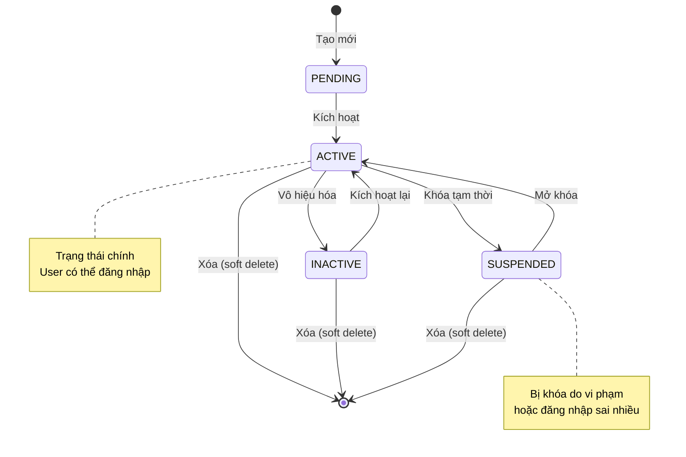

# Module: Gateway Service - Tài Liệu Nghiệp Vụ

**Phiên bản:** 1.8.0
**Cập nhật:** 2026-01-28
**Tác giả:** KiteClass Team

---

## 📋 1. Tổng Quan Module

### Module: Quản Lý Gateway Service

**Mục đích:** Gateway Service đóng vai trò cổng vào duy nhất cho toàn bộ hệ thống KiteClass, chịu trách nhiệm xác thực (authentication), phân quyền (authorization), quản lý người dùng, và điều phối các yêu cầu đến các service backend.

**Độ ưu tiên:** P0 (Cao nhất - Bắt buộc trong MVP)

**Module phụ thuộc:**
- Core Service - Lấy thông tin profile của học viên, giáo viên, phụ huynh

**Module liên quan:**
- Core Service - Tương tác qua Feign client để lấy profile
- Frontend - Giao tiếp qua REST API

### Bối Cảnh Nghiệp Vụ

Gateway Service là điểm vào duy nhất cho tất cả client applications (web, mobile). Service này xử lý:

1. **Xác thực (Authentication):**
   - Login/Logout với JWT tokens
   - Quản lý refresh tokens
   - Đặt lại mật khẩu qua email

2. **Quản lý người dùng (User Management):**
   - CRUD operations cho users
   - Quản lý vai trò (roles) và quyền hạn (permissions)
   - Soft delete để giữ lịch sử audit

3. **Phân quyền (Authorization):**
   - Role-Based Access Control (RBAC)
   - Permission-based access
   - Kiểm tra quyền truy cập mỗi API endpoint

4. **Tích hợp cross-service (PR 1.8):**
   - Fetch profile từ Core Service khi login
   - Graceful degradation khi Core Service down

**Ví dụ trong thực tế:**

Khi người dùng truy cập hệ thống:
1. Login qua Gateway → Nhận JWT access token + refresh token
2. Mỗi request đến backend → Gateway validate token
3. Gateway kiểm tra quyền → Cho phép/từ chối request
4. Gateway route request đến service thích hợp (Core, Payment, etc.)

---

## 📦 2. Thực Thể Nghiệp Vụ

### 2.1. User (Người dùng)

**Mô tả:** Đại diện cho một tài khoản người dùng trong hệ thống, bao gồm thông tin đăng nhập và thông tin cá nhân.

#### Các Thuộc Tính

| Trường | Kiểu dữ liệu | Bắt buộc? | Validation | Giải thích |
|--------|-------------|-----------|------------|------------|
| id | Long | Có (auto) | - | ID duy nhất |
| email | String | Có | Email hợp lệ, duy nhất | Email đăng nhập |
| passwordHash | String | Có | BCrypt hash | Mật khẩu đã mã hóa |
| name | String | Có | 2-100 ký tự | Họ và tên |
| phone | String | Không | 10 số, bắt đầu 0 | Số điện thoại |
| address | String | Không | Max 500 ký tự | Địa chỉ |
| avatarUrl | String | Không | URL hợp lệ | Link ảnh đại diện |
| status | Enum | Có | PENDING/ACTIVE/INACTIVE/SUSPENDED | Trạng thái tài khoản |
| emailVerified | Boolean | Có | true/false | Đã xác thực email? |
| lastLoginAt | Timestamp | Không | - | Lần đăng nhập cuối |
| failedLoginAttempts | Integer | Có | 0-5 | Số lần đăng nhập sai |
| lockedUntil | Timestamp | Không | - | Khóa tài khoản đến |
| userType | Enum | Có | ADMIN/STAFF/TEACHER/PARENT/STUDENT | Loại người dùng (PR 1.8) |
| referenceId | Long | Không | - | ID tham chiếu đến entity trong Core (PR 1.8) |

#### Các Trạng Thái (Status Values)

| Trạng thái | Giải thích | Có thể chuyển sang |
|-----------|------------|-------------------|
| PENDING | Mới tạo, chưa kích hoạt | ACTIVE |
| ACTIVE | Đang hoạt động | INACTIVE, SUSPENDED |
| INACTIVE | Tạm ngừng sử dụng | ACTIVE |
| SUSPENDED | Bị khóa bởi admin | ACTIVE |

#### Quan Hệ Với Entity Khác

- **Có nhiều (Has many):**
  - UserRole - Người dùng có nhiều vai trò
  - RefreshToken - Người dùng có nhiều refresh tokens
  - PasswordResetToken - Người dùng có thể có token reset password

- **Tham chiếu (References):**
  - Student/Teacher/Parent trong Core Service (qua referenceId + userType)

---

### 2.2. Role (Vai trò)

**Mô tả:** Đại diện cho một vai trò trong hệ thống, mỗi vai trò có một tập quyền hạn.

#### Các Thuộc Tính

| Trường | Kiểu dữ liệu | Bắt buộc? | Validation | Giải thích |
|--------|-------------|-----------|------------|------------|
| id | Long | Có (auto) | - | ID duy nhất |
| code | String | Có | Duy nhất, UPPERCASE | Mã vai trò (VD: OWNER, ADMIN) |
| name | String | Có | 2-100 ký tự | Tên vai trò |
| description | String | Không | Max 500 ký tự | Mô tả vai trò |

#### Các Role Hệ Thống

| Code | Name | Mô tả | Độ ưu tiên quyền |
|------|------|-------|-----------------|
| OWNER | Chủ sở hữu | Quyền cao nhất, không thể xóa | 5 (cao nhất) |
| ADMIN | Quản trị viên | Quản lý toàn bộ hệ thống trừ owner | 4 |
| STAFF | Nhân viên | Hỗ trợ vận hành | 3 |
| TEACHER | Giáo viên | Quản lý lớp học và học viên | 2 |
| PARENT | Phụ huynh | Xem thông tin con | 1 |
| STUDENT | Học viên | Xem thông tin cá nhân | 1 |

---

### 2.3. Permission (Quyền hạn)

**Mô tả:** Đại diện cho một quyền cụ thể trong hệ thống (VD: tạo user, xóa user).

#### Các Thuộc Tính

| Trường | Kiểu dữ liệu | Bắt buộc? | Validation | Giải thích |
|--------|-------------|-----------|------------|------------|
| id | Long | Có (auto) | - | ID duy nhất |
| code | String | Có | Format: ENTITY:ACTION | Mã quyền (VD: USER:READ) |
| name | String | Có | 2-100 ký tự | Tên quyền |
| description | String | Không | Max 500 ký tự | Mô tả quyền |
| category | String | Không | - | Nhóm quyền (VD: USER, ROLE) |

#### Format Permission Code

```
ENTITY:ACTION

ENTITY: USER, ROLE, PERMISSION, STUDENT, CLASS, etc.
ACTION: READ, WRITE, DELETE, MANAGE
```

**Ví dụ:**
- `USER:READ` - Xem danh sách user
- `USER:WRITE` - Tạo/cập nhật user
- `USER:DELETE` - Xóa user
- `ROLE:MANAGE` - Quản lý roles và permissions

---

### 2.4. RefreshToken (Token làm mới)

**Mô tả:** Token dùng để lấy access token mới mà không cần đăng nhập lại.

#### Các Thuộc Tính

| Trường | Kiểu dữ liệu | Bắt buộc? | Validation | Giải thích |
|--------|-------------|-----------|------------|------------|
| id | Long | Có (auto) | - | ID duy nhất |
| token | String | Có | JWT, duy nhất | Refresh token string |
| userId | Long | Có | FK → users | User sở hữu token |
| expiresAt | Timestamp | Có | Trong tương lai | Thời điểm hết hạn |
| createdAt | Timestamp | Có (auto) | - | Thời điểm tạo |

**Đặc điểm:**
- TTL: 7 ngày (604,800,000 ms)
- Lưu trong database (có thể revoke)
- Mỗi lần refresh → xóa token cũ, tạo token mới

---

### 2.5. PasswordResetToken (Token đặt lại mật khẩu)

**Mô tả:** Token một lần dùng để reset password qua email.

#### Các Thuộc Tính

| Trường | Kiểu dữ liệu | Bắt buộc? | Validation | Giải thích |
|--------|-------------|-----------|------------|------------|
| id | Long | Có (auto) | - | ID duy nhất |
| token | String | Có | UUID, duy nhất | Reset token string |
| userId | Long | Có | FK → users | User yêu cầu reset |
| expiresAt | Timestamp | Có | Trong tương lai | Thời điểm hết hạn |
| usedAt | Timestamp | Không | - | Thời điểm đã sử dụng |
| createdAt | Timestamp | Có (auto) | - | Thời điểm tạo |

**Đặc điểm:**
- TTL: 1 giờ (3,600,000 ms)
- One-time use only (kiểm tra usedAt)
- Gửi qua email

---

## 📐 3. Quy Tắc Kinh Doanh

### BR-GAT-001: Email Phải Duy Nhất

**Mô tả:** Mỗi người dùng (chưa bị xóa) phải có email duy nhất trong hệ thống.

**Lý do:** Email dùng để đăng nhập và liên lạc. Email trùng sẽ gây nhầm lẫn và lỗi bảo mật.

**Điều kiện áp dụng:**
- Khi tạo user mới
- Khi cập nhật email của user hiện có
- CHỈ kiểm tra với users chưa xóa (deleted = false)

**Cách kiểm tra (Validation):**
```java
boolean exists = userRepository.existsByEmailAndDeletedFalse(email);
if (exists) {
    throw new DuplicateResourceException("email", email);
}
```

**Nếu vi phạm:**
- **Exception:** `DuplicateResourceException("email", email)`
- **HTTP Status:** 409 Conflict
- **Message:** "Email '{email}' đã tồn tại trong hệ thống"

**Ví dụ:**

✅ **Hợp lệ:**
```java
// Email mới, chưa có ai dùng
userService.createUser("owner@kiteclass.com", "Owner", "Test@123");
→ Thành công, user được tạo
```

❌ **Không hợp lệ:**
```java
// Email đã tồn tại
userService.createUser("owner@kiteclass.com", "Another User", "Test@123");
→ Ném exception: DuplicateResourceException("email", "owner@kiteclass.com")
→ Message: "Email 'owner@kiteclass.com' đã tồn tại trong hệ thống"
```

---

### BR-GAT-002: Mật Khẩu Phải Đủ Mạnh

**Mô tả:** Mật khẩu phải có ít nhất 8 ký tự, bao gồm chữ hoa, chữ thường, số, và ký tự đặc biệt.

**Lý do:** Đảm bảo bảo mật tài khoản, tránh mật khẩu dễ đoán.

**Điều kiện áp dụng:**
- Khi tạo user mới
- Khi đổi mật khẩu
- Khi reset mật khẩu

**Cách kiểm tra (Validation):**
```java
Pattern pattern = Pattern.compile(
    "^(?=.*[a-z])(?=.*[A-Z])(?=.*\\d)(?=.*[@$!%*?&])[A-Za-z\\d@$!%*?&]{8,}$"
);
if (!pattern.matcher(password).matches()) {
    throw new ValidationException("Mật khẩu không đủ mạnh");
}
```

**Nếu vi phạm:**
- **Exception:** `ValidationException("Mật khẩu không đủ mạnh")`
- **HTTP Status:** 400 Bad Request
- **Message:** "Mật khẩu phải có ít nhất 8 ký tự, bao gồm chữ hoa, chữ thường, số, và ký tự đặc biệt"

**Ví dụ:**

✅ **Hợp lệ:**
```java
"Test@123"    // ✅ Có chữ hoa (T), chữ thường (est), số (123), ký tự đặc biệt (@)
"Secure#Pass1" // ✅ Đầy đủ yêu cầu
```

❌ **Không hợp lệ:**
```java
"test123"     // ❌ Thiếu chữ hoa và ký tự đặc biệt
"Test123"     // ❌ Thiếu ký tự đặc biệt
"Test@"       // ❌ Quá ngắn (< 8 ký tự)
"testtest"    // ❌ Thiếu chữ hoa, số, ký tự đặc biệt
```

---

### BR-GAT-003: Khóa Tài Khoản Sau 5 Lần Đăng Nhập Sai

**Mô tả:** Sau 5 lần đăng nhập sai liên tiếp, tài khoản bị khóa tự động trong 30 phút.

**Lý do:** Bảo vệ tài khoản khỏi brute-force attacks.

**Điều kiện áp dụng:**
- Mỗi lần đăng nhập sai mật khẩu
- Tài khoản có status = ACTIVE

**Cách xử lý:**
```java
if (failedLoginAttempts >= 5) {
    user.setLockedUntil(LocalDateTime.now().plusMinutes(30));
    throw new BusinessException(
        MessageCodes.AUTH_ACCOUNT_LOCKED,
        HttpStatus.FORBIDDEN
    );
}
```

**Nếu vi phạm:**
- **Exception:** `BusinessException(AUTH_ACCOUNT_LOCKED)`
- **HTTP Status:** 403 Forbidden
- **Message:** "Tài khoản bị khóa do đăng nhập sai quá nhiều lần. Vui lòng thử lại sau 30 phút."

**Ví dụ:**

✅ **Bình thường:**
```java
// Đăng nhập sai lần 1, 2, 3, 4
→ failedLoginAttempts tăng lên: 1, 2, 3, 4
→ Vẫn cho phép thử lại
```

❌ **Bị khóa:**
```java
// Đăng nhập sai lần 5
→ failedLoginAttempts = 5
→ lockedUntil = now + 30 phút
→ Ném exception: AUTH_ACCOUNT_LOCKED
→ User không thể đăng nhập cho đến khi hết thời gian khóa
```

---

### BR-GAT-004: Chỉ Tài Khoản ACTIVE Mới Đăng Nhập Được

**Mô tả:** Chỉ user có status = ACTIVE mới có thể đăng nhập vào hệ thống.

**Lý do:** Ngăn chặn user chưa kích hoạt, đã vô hiệu hóa, hoặc bị suspend đăng nhập.

**Điều kiện áp dụng:**
- Mỗi lần login

**Cách kiểm tra:**
```java
if (!UserStatus.ACTIVE.equals(user.getStatus())) {
    throw new BusinessException(
        MessageCodes.AUTH_ACCOUNT_INACTIVE,
        HttpStatus.FORBIDDEN
    );
}
```

**Nếu vi phạm:**
- **Exception:** `BusinessException(AUTH_ACCOUNT_INACTIVE)`
- **HTTP Status:** 403 Forbidden
- **Message:** "Tài khoản chưa được kích hoạt hoặc đã bị vô hiệu hóa"

**Ví dụ:**

✅ **Hợp lệ:**
```java
// User có status = ACTIVE
user.setStatus(UserStatus.ACTIVE);
authService.login("user@example.com", "Test@123");
→ Đăng nhập thành công
```

❌ **Không hợp lệ:**
```java
// User có status = PENDING
user.setStatus(UserStatus.PENDING);
authService.login("user@example.com", "Test@123");
→ Ném exception: AUTH_ACCOUNT_INACTIVE

// User có status = SUSPENDED
user.setStatus(UserStatus.SUSPENDED);
authService.login("user@example.com", "Test@123");
→ Ném exception: AUTH_ACCOUNT_INACTIVE
```

---

### BR-GAT-005: Refresh Token Chỉ Dùng Một Lần

**Mô tả:** Mỗi refresh token chỉ có thể sử dụng một lần. Sau khi refresh, token cũ bị xóa.

**Lý do:** Bảo mật, tránh token cũ bị tái sử dụng nếu bị đánh cắp.

**Điều kiện áp dụng:**
- Khi gọi endpoint /api/v1/auth/refresh

**Cách xử lý:**
```java
// 1. Validate token cũ
RefreshToken oldToken = refreshTokenRepository.findByToken(token)
    .orElseThrow(() -> new BusinessException(AUTH_REFRESH_TOKEN_INVALID));

// 2. Xóa token cũ
refreshTokenRepository.delete(oldToken);

// 3. Tạo token mới
RefreshToken newToken = createRefreshToken(user);
```

**Ví dụ:**

✅ **Flow đúng:**
```java
// Lần 1: Refresh với token A
POST /api/v1/auth/refresh
Body: { "refreshToken": "token-A" }
→ Token A bị xóa
→ Trả về token B mới

// Lần 2: Refresh với token B
POST /api/v1/auth/refresh
Body: { "refreshToken": "token-B" }
→ Token B bị xóa
→ Trả về token C mới
```

❌ **Flow sai:**
```java
// Lần 1: Refresh với token A
POST /api/v1/auth/refresh
Body: { "refreshToken": "token-A" }
→ Token A bị xóa
→ Trả về token B mới

// Lần 2: Thử dùng lại token A (đã xóa)
POST /api/v1/auth/refresh
Body: { "refreshToken": "token-A" }
→ Ném exception: AUTH_REFRESH_TOKEN_INVALID
→ Token A không còn tồn tại
```

---

### BR-GAT-006: Password Reset Token Chỉ Dùng Một Lần

**Mô tả:** Token reset password chỉ có thể sử dụng một lần và hết hạn sau 1 giờ.

**Lý do:** Bảo mật, tránh token bị tái sử dụng hoặc dùng sau thời hạn.

**Điều kiện áp dụng:**
- Khi gọi endpoint /api/v1/auth/reset-password

**Cách kiểm tra:**
```java
PasswordResetToken resetToken = passwordResetTokenRepository
    .findByToken(token)
    .orElseThrow(() -> new BusinessException(AUTH_RESET_TOKEN_INVALID));

// Kiểm tra đã dùng chưa
if (resetToken.getUsedAt() != null) {
    throw new BusinessException(AUTH_RESET_TOKEN_INVALID);
}

// Kiểm tra hết hạn chưa
if (resetToken.getExpiresAt().isBefore(LocalDateTime.now())) {
    throw new BusinessException(AUTH_RESET_TOKEN_EXPIRED);
}

// Đánh dấu đã sử dụng
resetToken.setUsedAt(LocalDateTime.now());
passwordResetTokenRepository.save(resetToken);
```

**Nếu vi phạm:**
- **Exception:** `BusinessException(AUTH_RESET_TOKEN_INVALID)` hoặc `AUTH_RESET_TOKEN_EXPIRED`
- **HTTP Status:** 400 Bad Request
- **Message:** "Token không hợp lệ hoặc đã hết hạn"

---

### BR-GAT-007: ReferenceId Bắt Buộc Với External Users (PR 1.8)

**Mô tả:** User có userType là STUDENT, TEACHER, hoặc PARENT phải có referenceId tham chiếu đến entity tương ứng trong Core Service.

**Lý do:** External users có profile trong Core Service, cần referenceId để fetch profile.

**Điều kiện áp dụng:**
- Khi tạo user với userType = STUDENT/TEACHER/PARENT
- Khi cập nhật userType sang STUDENT/TEACHER/PARENT

**Cách kiểm tra:**
```java
if (UserType.isExternalUser(userType) && referenceId == null) {
    throw new ValidationException(
        "ReferenceId là bắt buộc cho userType " + userType
    );
}
```

**Nếu vi phạm:**
- **Exception:** `ValidationException("ReferenceId là bắt buộc")`
- **HTTP Status:** 400 Bad Request
- **Message:** "ReferenceId là bắt buộc cho userType {userType}"

**Ví dụ:**

✅ **Hợp lệ:**
```java
// User STUDENT với referenceId
createUser(
    email = "student@example.com",
    userType = UserType.STUDENT,
    referenceId = 123L  // ID của Student trong Core Service
);
→ Hợp lệ
```

❌ **Không hợp lệ:**
```java
// User STUDENT không có referenceId
createUser(
    email = "student@example.com",
    userType = UserType.STUDENT,
    referenceId = null  // ❌ Thiếu referenceId
);
→ Ném exception: ValidationException("ReferenceId là bắt buộc cho userType STUDENT")
```

✅ **Hợp lệ (Internal users):**
```java
// User ADMIN không cần referenceId
createUser(
    email = "admin@example.com",
    userType = UserType.ADMIN,
    referenceId = null  // ✅ OK, ADMIN không có profile trong Core
);
→ Hợp lệ
```

---

## 🔄 4. Quy Trình Nghiệp Vụ & Use Cases

### UC-GAT-001: Đăng Nhập (Login)

**Người thực hiện:** Tất cả người dùng (OWNER, ADMIN, TEACHER, PARENT, STUDENT)

**Điều kiện trước:**
- User đã được tạo trong hệ thống
- User có email và password

**Luồng chính:**

1. User nhập email và password vào form login
2. Frontend gửi POST request đến `/api/v1/auth/login`
3. Hệ thống kiểm tra validation:
   - Email đúng định dạng
   - Password không rỗng
4. Hệ thống tìm user theo email
5. Hệ thống kiểm tra quy tắc kinh doanh:
   - **BR-GAT-004:** User có status = ACTIVE?
   - **BR-GAT-003:** User có bị khóa không? (lockedUntil)
6. Hệ thống verify password với BCrypt
7. Nếu password đúng:
   - Reset failedLoginAttempts = 0
   - Cập nhật lastLoginAt = now()
   - Tạo JWT access token (expires: 1 giờ)
   - Tạo refresh token (expires: 7 ngày)
   - Lưu refresh token vào database
8. **PR 1.8:** Hệ thống fetch profile từ Core Service:
   - Nếu userType = ADMIN/STAFF → profile = null
   - Nếu userType = STUDENT/TEACHER/PARENT → gọi CoreServiceClient
   - Nếu Core Service lỗi → profile = null (graceful degradation)
9. Hệ thống trả về HTTP 200 OK với LoginResponse:
   ```json
   {
     "accessToken": "eyJhbGc...",
     "refreshToken": "eyJhbGc...",
     "tokenType": "Bearer",
     "expiresIn": 3600,
     "user": {
       "id": 1,
       "email": "student@example.com",
       "name": "Nguyễn Văn A",
       "roles": ["STUDENT"],
       "profile": { ... }  // Từ Core Service
     }
   }
   ```

**Luồng thay thế:**

**AF1 - Email không tồn tại:**
- Tại bước 4, không tìm thấy user
- Hệ thống trả về HTTP 401 Unauthorized
- Message: "Email hoặc mật khẩu không đúng" (không tiết lộ email không tồn tại)

**AF2 - Password sai:**
- Tại bước 6, password không khớp
- Hệ thống tăng failedLoginAttempts lên 1
- Nếu failedLoginAttempts >= 5:
  - Khóa tài khoản: lockedUntil = now + 30 phút
  - Gửi email thông báo tài khoản bị khóa
  - Trả về HTTP 403 Forbidden: "Tài khoản bị khóa do đăng nhập sai quá nhiều lần"
- Nếu failedLoginAttempts < 5:
  - Trả về HTTP 401 Unauthorized: "Email hoặc mật khẩu không đúng"

**AF3 - Tài khoản chưa kích hoạt:**
- Tại bước 5, user.status = PENDING
- Hệ thống trả về HTTP 403 Forbidden
- Message: "Tài khoản chưa được kích hoạt"

**AF4 - Tài khoản bị khóa:**
- Tại bước 5, user.lockedUntil > now()
- Hệ thống trả về HTTP 403 Forbidden
- Message: "Tài khoản bị khóa. Vui lòng thử lại sau {minutes} phút"

**Kết quả sau khi thực hiện:**
- User được xác thực thành công
- failedLoginAttempts reset về 0
- lastLoginAt được cập nhật
- JWT tokens được tạo và lưu
- Profile được fetch từ Core Service (nếu có)
- User có thể sử dụng access token để gọi các API khác

**Events phát sinh:**
- `UserLoggedInEvent` → Log audit trail
- `ProfileFetchedEvent` → Cache profile vào Redis (future)

---

### UC-GAT-002: Làm Mới Token (Refresh Token)

**Người thực hiện:** User đã đăng nhập (có refresh token)

**Điều kiện trước:**
- User đã đăng nhập và có refresh token hợp lệ
- Access token đã hết hạn hoặc sắp hết hạn

**Luồng chính:**

1. Frontend phát hiện access token hết hạn (401 response)
2. Frontend gửi POST request đến `/api/v1/auth/refresh` với refresh token
3. Hệ thống kiểm tra refresh token:
   - Token tồn tại trong database
   - Token chưa hết hạn (expiresAt > now())
4. Hệ thống lấy thông tin user từ token
5. Hệ thống kiểm tra user còn ACTIVE không
6. Hệ thống xóa refresh token cũ (BR-GAT-005)
7. Hệ thống tạo tokens mới:
   - JWT access token mới (expires: 1 giờ)
   - Refresh token mới (expires: 7 ngày)
   - Lưu refresh token mới vào database
8. **PR 1.8:** Fetch profile từ Core Service (tương tự UC-GAT-001)
9. Hệ thống trả về HTTP 200 OK với LoginResponse mới

**Luồng thay thế:**

**AF1 - Refresh token không hợp lệ:**
- Tại bước 3, token không tồn tại trong database
- Hệ thống trả về HTTP 401 Unauthorized
- Message: "Refresh token không hợp lệ"
- Frontend redirect user đến trang login

**AF2 - Refresh token hết hạn:**
- Tại bước 3, token.expiresAt < now()
- Hệ thống trả về HTTP 401 Unauthorized
- Message: "Refresh token đã hết hạn. Vui lòng đăng nhập lại"
- Frontend redirect user đến trang login

**AF3 - User bị vô hiệu hóa:**
- Tại bước 5, user.status != ACTIVE
- Hệ thống xóa refresh token
- Trả về HTTP 403 Forbidden
- Message: "Tài khoản đã bị vô hiệu hóa"

**Kết quả sau khi thực hiện:**
- Access token mới được tạo
- Refresh token cũ bị xóa, token mới được lưu
- User tiếp tục sử dụng hệ thống mà không cần đăng nhập lại

---

### UC-GAT-003: Đăng Xuất (Logout)

**Người thực hiện:** User đã đăng nhập

**Điều kiện trước:**
- User đang đăng nhập (có access token và refresh token)

**Luồng chính:**

1. User nhấn nút "Đăng xuất"
2. Frontend gửi POST request đến `/api/v1/auth/logout` với refresh token
3. Hệ thống tìm và xóa refresh token trong database
4. Hệ thống trả về HTTP 204 No Content
5. Frontend xóa access token và refresh token khỏi local storage
6. Frontend redirect user đến trang login

**Lưu ý:**
- Access token không thể revoke (stateless JWT)
- Access token vẫn hợp lệ cho đến khi hết hạn (1 giờ)
- Xóa refresh token ngăn user refresh token mới

**Kết quả sau khi thực hiện:**
- Refresh token bị xóa khỏi database
- User không thể refresh token mới
- User cần đăng nhập lại để sử dụng tiếp

---

### UC-GAT-004: Quên Mật Khẩu (Forgot Password)

**Người thực hiện:** User quên mật khẩu

**Điều kiện trước:**
- User có tài khoản trong hệ thống
- User có email hợp lệ

**Luồng chính:**

1. User nhấn "Quên mật khẩu?" trên trang login
2. Frontend hiển thị form nhập email
3. User nhập email và submit
4. Frontend gửi POST request đến `/api/v1/auth/forgot-password`
5. Hệ thống tìm user theo email
6. Hệ thống kiểm tra user có status = ACTIVE
7. Hệ thống tạo password reset token:
   - Token = UUID random
   - ExpiresAt = now + 1 giờ
8. Hệ thống xóa các reset tokens cũ của user (nếu có)
9. Hệ thống lưu reset token vào database
10. Hệ thống gửi email reset password (async):
    - Template: `email/password-reset`
    - Link: `{baseUrl}/reset-password?token={token}`
11. Hệ thống trả về HTTP 200 OK
12. Frontend hiển thị: "Email đặt lại mật khẩu đã được gửi. Vui lòng kiểm tra hộp thư."

**Luồng thay thế:**

**AF1 - Email không tồn tại:**
- Tại bước 5, không tìm thấy user
- **Bảo mật:** Hệ thống VẪN trả về HTTP 200 OK với message thành công
- Lý do: Không tiết lộ email có tồn tại trong hệ thống hay không
- Không gửi email

**AF2 - User không ACTIVE:**
- Tại bước 6, user.status != ACTIVE
- Hệ thống trả về HTTP 403 Forbidden
- Message: "Tài khoản chưa được kích hoạt hoặc đã bị vô hiệu hóa"

**AF3 - Gửi email thất bại:**
- Tại bước 10, SMTP server lỗi
- Hệ thống log error nhưng VẪN trả về HTTP 200 OK
- User không biết email gửi thất bại (để tránh spam retry)
- Admin nhận alert về email failure

**Kết quả sau khi thực hiện:**
- Reset token được tạo và lưu trong database
- Email chứa link reset password được gửi
- User nhận email và có thể đặt lại mật khẩu

---

### UC-GAT-005: Đặt Lại Mật Khẩu (Reset Password)

**Người thực hiện:** User có reset token hợp lệ

**Điều kiện trước:**
- User đã yêu cầu forgot password và nhận được email
- User có reset token hợp lệ

**Luồng chính:**

1. User nhấn vào link trong email
2. Frontend hiển thị form nhập mật khẩu mới
3. User nhập mật khẩu mới và xác nhận mật khẩu
4. Frontend gửi POST request đến `/api/v1/auth/reset-password`:
   ```json
   {
     "token": "uuid-token-from-email",
     "newPassword": "NewPassword@123"
   }
   ```
5. Hệ thống kiểm tra validation:
   - **BR-GAT-002:** Mật khẩu đủ mạnh
6. Hệ thống tìm reset token trong database
7. Hệ thống kiểm tra **BR-GAT-006:**
   - Token chưa được sử dụng (usedAt = null)
   - Token chưa hết hạn (expiresAt > now())
8. Hệ thống cập nhật user:
   - Mã hóa mật khẩu mới với BCrypt
   - Reset failedLoginAttempts = 0
   - Clear lockedUntil = null
9. Hệ thống đánh dấu token đã sử dụng:
   - usedAt = now()
10. Hệ thống xóa TẤT CẢ refresh tokens của user (bảo mật)
11. Hệ thống trả về HTTP 200 OK
12. Frontend hiển thị: "Mật khẩu đã được đặt lại thành công. Vui lòng đăng nhập lại."
13. Frontend redirect user đến trang login

**Luồng thay thế:**

**AF1 - Token không hợp lệ:**
- Tại bước 6, token không tồn tại
- Hệ thống trả về HTTP 400 Bad Request
- Message: "Token không hợp lệ hoặc đã hết hạn"

**AF2 - Token đã được sử dụng:**
- Tại bước 7, token.usedAt != null
- Hệ thống trả về HTTP 400 Bad Request
- Message: "Token đã được sử dụng"

**AF3 - Token hết hạn:**
- Tại bước 7, token.expiresAt < now()
- Hệ thống trả về HTTP 400 Bad Request
- Message: "Token đã hết hạn. Vui lòng yêu cầu đặt lại mật khẩu lại"

**AF4 - Mật khẩu mới không đủ mạnh:**
- Tại bước 5, mật khẩu vi phạm BR-GAT-002
- Hệ thống trả về HTTP 400 Bad Request
- Message: "Mật khẩu phải có ít nhất 8 ký tự, bao gồm chữ hoa, chữ thường, số, và ký tự đặc biệt"

**Kết quả sau khi thực hiện:**
- Mật khẩu user được cập nhật
- Reset token được đánh dấu đã sử dụng
- Tất cả refresh tokens bị xóa (user phải đăng nhập lại tất cả devices)
- User có thể đăng nhập với mật khẩu mới

**Events phát sinh:**
- `PasswordChangedEvent` → Gửi email thông báo mật khẩu đã thay đổi
- `AllSessionsRevokedEvent` → Log security audit

---

### UC-GAT-006: Tạo User Mới (Admin)

**Người thực hiện:** ADMIN hoặc OWNER

**Điều kiện trước:**
- User đã đăng nhập với role ADMIN hoặc OWNER
- User có quyền `USER:WRITE`

**Luồng chính:**

1. Admin truy cập màn hình Quản lý người dùng
2. Admin nhấn "Thêm người dùng mới"
3. Frontend hiển thị form nhập thông tin:
   - Email (bắt buộc)
   - Tên (bắt buộc)
   - Password (bắt buộc)
   - Số điện thoại (không bắt buộc)
   - Địa chỉ (không bắt buộc)
   - Roles (chọn nhiều)
   - UserType (chọn một: ADMIN/STAFF/TEACHER/PARENT/STUDENT)
   - ReferenceId (bắt buộc nếu TEACHER/PARENT/STUDENT)
4. Admin điền thông tin và nhấn "Lưu"
5. Frontend gửi POST request đến `/api/v1/users`
6. Hệ thống kiểm tra validation:
   - Email đúng định dạng
   - **BR-GAT-001:** Email duy nhất
   - **BR-GAT-002:** Password đủ mạnh
   - **BR-GAT-007:** ReferenceId bắt buộc nếu userType external
7. Hệ thống mã hóa password với BCrypt
8. Hệ thống tạo user:
   - status = PENDING (mặc định)
   - emailVerified = false
   - deleted = false
9. Hệ thống assign roles cho user
10. Hệ thống lưu user vào database
11. Hệ thống trả về HTTP 201 Created với UserResponse
12. Frontend hiển thị: "Tạo người dùng thành công"

**Luồng thay thế:**

**AF1 - Email trùng:**
- Tại bước 6, email đã tồn tại
- Hệ thống trả về HTTP 409 Conflict (BR-GAT-001)
- Message: "Email '{email}' đã tồn tại trong hệ thống"

**AF2 - Password không đủ mạnh:**
- Tại bước 6, password vi phạm BR-GAT-002
- Hệ thống trả về HTTP 400 Bad Request
- Message: "Mật khẩu phải có ít nhất 8 ký tự, bao gồm chữ hoa, chữ thường, số, và ký tự đặc biệt"

**AF3 - Thiếu referenceId cho external user:**
- Tại bước 6, userType = STUDENT nhưng referenceId = null
- Hệ thống trả về HTTP 400 Bad Request (BR-GAT-007)
- Message: "ReferenceId là bắt buộc cho userType STUDENT"

**Kết quả sau khi thực hiện:**
- User mới được tạo với status = PENDING
- User được assign các roles
- User có thể được kích hoạt sau (status → ACTIVE)

---

## 🔀 5. Sơ Đồ Chuyển Trạng Thái

### Lifecycle của User



### Quy Tắc Chuyển Trạng Thái

#### Kích hoạt (PENDING → ACTIVE)

- **Từ trạng thái:** PENDING
- **Sang trạng thái:** ACTIVE
- **Điều kiện:**
  - User đang ở trạng thái PENDING
  - Thông tin cơ bản đã đầy đủ
  - Email đã xác thực (nếu bắt buộc)
- **Tác động phụ (Side effects):**
  - User có thể đăng nhập
  - Gửi email chào mừng (nếu có email)
- **Method trong code:** `UserService.activateUser(Long id)`

**Ví dụ:**
```java
userService.activateUser(123L);
→ Status: PENDING → ACTIVE
→ User có thể đăng nhập
```

---

#### Vô hiệu hóa (ACTIVE → INACTIVE)

- **Từ trạng thái:** ACTIVE
- **Sang trạng thái:** INACTIVE
- **Điều kiện:**
  - User đang ở trạng thái ACTIVE
  - Admin quyết định vô hiệu hóa
- **Tác động phụ (Side effects):**
  - User không thể đăng nhập
  - Tất cả refresh tokens bị xóa
  - Các session hiện tại vẫn hoạt động cho đến khi access token hết hạn
- **Method trong code:** `UserService.deactivateUser(Long id)`

**Ví dụ:**
```java
userService.deactivateUser(123L);
→ Status: ACTIVE → INACTIVE
→ Xóa tất cả refresh tokens
→ User không thể login hoặc refresh token
```

---

#### Khóa tạm thời (ACTIVE → SUSPENDED)

- **Từ trạng thái:** ACTIVE
- **Sang trạng thái:** SUSPENDED
- **Điều kiện:**
  - User đang ở trạng thái ACTIVE
  - Admin suspend user hoặc hệ thống tự động suspend (VD: quá 5 lần login sai)
- **Tác động phụ (Side effects):**
  - User không thể đăng nhập
  - Set lockedUntil (nếu temporary)
  - Gửi email thông báo
- **Method trong code:** `UserService.suspendUser(Long id, String reason)`

**Ví dụ:**
```java
// Suspend bởi admin
userService.suspendUser(123L, "Vi phạm quy định");
→ Status: ACTIVE → SUSPENDED
→ User không thể login

// Suspend tự động (5 lần login sai)
authService.login(email, wrongPassword); // 5 lần
→ Status: ACTIVE → SUSPENDED (tự động)
→ lockedUntil = now + 30 phút
```

---

#### Mở khóa (SUSPENDED → ACTIVE)

- **Từ trạng thái:** SUSPENDED
- **Sang trạng thái:** ACTIVE
- **Điều kiện:**
  - User đang ở trạng thái SUSPENDED
  - Admin mở khóa hoặc hết thời gian khóa tự động
- **Tác động phụ (Side effects):**
  - Clear lockedUntil = null
  - Reset failedLoginAttempts = 0
  - User có thể đăng nhập lại
- **Method trong code:** `UserService.unsuspendUser(Long id)`

**Ví dụ:**
```java
userService.unsuspendUser(123L);
→ Status: SUSPENDED → ACTIVE
→ Clear lockedUntil
→ User có thể login trở lại
```

---

### ❌ Các Chuyển Đổi KHÔNG HỢP LỆ

```java
// ❌ Không thể từ PENDING sang INACTIVE
userService.deactivateUser(pendingUserId);
→ ValidationException("Chỉ có thể vô hiệu hóa user đang ACTIVE")

// ❌ Không thể kích hoạt user đã xóa
userService.activateUser(deletedUserId);
→ EntityNotFoundException("User không tồn tại")
```

---

## 🔗 6. Tích Hợp Với Các Module Khác

### Gateway → Core Service (Fetch Profile)

**Hướng:** Gateway → Core Service

**Khi nào xảy ra (PR 1.8):**
- Khi user đăng nhập (UC-GAT-001)
- Khi refresh token (UC-GAT-002)
- Chỉ với userType = STUDENT/TEACHER/PARENT

**Dữ liệu truyền đi:**
- HTTP GET request đến Core Service internal API
- Header: `X-Internal-Request: true` (bảo mật)
- Path parameter: referenceId

**Endpoint mapping:**
- STUDENT → `GET /internal/students/{referenceId}`
- TEACHER → `GET /internal/teachers/{referenceId}` (chưa implement)
- PARENT → `GET /internal/parents/{referenceId}` (chưa implement)

**Quy tắc kinh doanh liên quan:**
- BR-GAT-007: ReferenceId phải có với external users
- Graceful degradation: Nếu Core Service lỗi → trả về profile = null, không block login

**Ví dụ:**
```java
// Student login → fetch profile
LoginResponse response = authService.login(
    "student@example.com",
    "Test@123"
);

→ Gateway gọi: GET /internal/students/123
→ Core Service trả về: StudentProfileResponse
→ LoginResponse.user.profile = StudentProfileResponse

// Core Service down → graceful degradation
→ Gateway gọi: GET /internal/students/123
→ Core Service: 503 Service Unavailable
→ Log warning: "Core service unavailable, returning null profile"
→ LoginResponse.user.profile = null
→ Login VẪN THÀNH CÔNG (không block)
```

---

### Gateway → Email Service (Gửi Email)

**Hướng:** Gateway → Email Service (SMTP)

**Khi nào xảy ra:**
- Forgot password (UC-GAT-004) → Gửi email reset password
- Reset password (UC-GAT-005) → Gửi email xác nhận password đã đổi
- Account locked (BR-GAT-003) → Gửi email thông báo khóa tài khoản

**Dữ liệu truyền đi:**
- Recipient email
- Email template name
- Template variables (name, resetToken, lockDuration, etc.)

**Quy tắc kinh doanh liên quan:**
- Email gửi bất đồng bộ (async), không block main flow
- Nếu gửi email thất bại → log error, không throw exception

**Ví dụ:**
```java
// Forgot password
emailService.sendPasswordResetEmail(
    to = "user@example.com",
    userName = "Nguyễn Văn A",
    resetToken = "uuid-token"
);
→ Email template: "email/password-reset"
→ Link: http://localhost:3000/reset-password?token=uuid-token

// Account locked
emailService.sendAccountLockedEmail(
    to = "user@example.com",
    userName = "Nguyễn Văn A",
    lockDurationMinutes = 30
);
→ Email template: "email/account-locked"
```

---

### Gateway → Redis Cache (Caching)

**Hướng:** Gateway ↔ Redis

**Khi nào xảy ra:**
- Cache user data để giảm query database
- Cache profile data từ Core Service (future)

**Dữ liệu cache:**
- User profile
- Roles và permissions
- Danh sách users (với pagination)

**Strategy:**
- Cache aside pattern
- TTL: 1 giờ cho user data, 5 phút cho lists
- Evict cache khi update/delete

**Ví dụ:**
```java
@Cacheable(value = "users", key = "#id")
public UserResponse getUserById(Long id) {
    // Query từ DB, cache result
}

@CacheEvict(value = "users", key = "#id")
public UserResponse updateUser(Long id, UpdateUserRequest request) {
    // Update DB, xóa cache
}
```

---

## ✅ 7. Quy Tắc Validation

### Validation Từng Trường

#### Email

- **Định dạng:** Email hợp lệ theo chuẩn RFC 5322
- **Độ duy nhất:** Phải unique trong các user chưa xóa (deleted=false)
- **Cách kiểm tra:**
  - Định dạng: Spring validation `@Email`
  - Unique: `userRepository.existsByEmailAndDeletedFalse(email)`
- **Exception khi lỗi:**
  - Định dạng sai: `ValidationException("Email không hợp lệ")`
  - Trùng: `DuplicateResourceException("email", email)`

✅ **Hợp lệ:**
```
"user@example.com"
"contact@kiteclass.vn"
```

❌ **Không hợp lệ:**
```
"not-an-email" (thiếu @)
→ ValidationException: "Email không hợp lệ"

"owner@kiteclass.com" (đã tồn tại)
→ DuplicateResourceException: "Email 'owner@kiteclass.com' đã tồn tại trong hệ thống"
```

---

#### Password (Mật khẩu)

- **Định dạng:** Ít nhất 8 ký tự, có chữ hoa, chữ thường, số, ký tự đặc biệt
- **Pattern:** `^(?=.*[a-z])(?=.*[A-Z])(?=.*\d)(?=.*[@$!%*?&])[A-Za-z\d@$!%*?&]{8,}$`
- **Cách kiểm tra:** Regex validation
- **Exception khi lỗi:** `ValidationException("Mật khẩu không đủ mạnh")`

✅ **Hợp lệ:**
```
"Test@123"
"Secure#Pass1"
```

❌ **Không hợp lệ:**
```
"test123" (thiếu chữ hoa, ký tự đặc biệt)
"Test123" (thiếu ký tự đặc biệt)
"Test@" (quá ngắn)
```

---

#### Name (Họ tên)

- **Định dạng:** Chuỗi từ 2-100 ký tự, không được để trống
- **Độ duy nhất:** Không cần unique
- **Cách kiểm tra:** Spring validation `@Size(min=2, max=100)`
- **Exception khi lỗi:** `ValidationException("Họ tên phải có từ 2-100 ký tự")`

✅ **Hợp lệ:**
```
"Nguyễn Văn A"
"An" (2 ký tự, OK)
```

❌ **Không hợp lệ:**
```
"" (trống)
"A" (1 ký tự)
```

---

#### Phone (Số điện thoại)

- **Định dạng:** 10 chữ số, bắt đầu bằng 0 (format Việt Nam)
- **Pattern:** `^0\\d{9}$`
- **Độ duy nhất:** Không bắt buộc unique (có thể null)
- **Cách kiểm tra:** Regex validation
- **Exception khi lỗi:** `ValidationException("Số điện thoại không hợp lệ")`

✅ **Hợp lệ:**
```
"0123456789"
"0987654321"
null (không bắt buộc)
```

❌ **Không hợp lệ:**
```
"123456789" (thiếu số 0)
"012345678" (chỉ 9 số)
"0123-456-789" (có dấu gạch)
```

---

### Validation Logic Nghiệp Vụ

#### BR-GAT-007: ReferenceId Required For External Users

- **Quy tắc:** User có userType = STUDENT/TEACHER/PARENT phải có referenceId
- **Cách kiểm tra:**
  ```java
  if (UserType.isExternalUser(userType) && referenceId == null) {
      throw new ValidationException("ReferenceId là bắt buộc");
  }
  ```
- **Exception khi lỗi:** `ValidationException("ReferenceId là bắt buộc cho userType {userType}")`

---

## ❌ 8. Các Tình Huống Lỗi

### ES-GAT-001: Email Trùng Lặp

**Tình huống:** Admin tạo user với email đã tồn tại

**Input:**
```json
{
  "email": "owner@kiteclass.com",
  "name": "Another User",
  "password": "Test@123"
}
```

**Hành vi mong đợi:**
1. Hệ thống nhận request tạo user
2. Kiểm tra validation fields (OK)
3. Kiểm tra BR-GAT-001: Email unique
4. Gọi `userRepository.existsByEmailAndDeletedFalse("owner@kiteclass.com")`
5. Kết quả: `true` (email đã tồn tại)
6. Trả về HTTP 409 Conflict
7. Ném exception: `DuplicateResourceException("email", "owner@kiteclass.com")`

**Response body:**
```json
{
  "success": false,
  "message": "Email 'owner@kiteclass.com' đã tồn tại trong hệ thống",
  "errorCode": "DUPLICATE_EMAIL",
  "timestamp": "2026-01-28T10:30:00Z"
}
```

**Log output:**
```
WARN [UserServiceImpl] Duplicate email detected: owner@kiteclass.com
```

**Cách khắc phục:** Admin nhập email khác

---

### ES-GAT-002: Đăng Nhập Sai Mật Khẩu 5 Lần

**Tình huống:** User đăng nhập sai mật khẩu 5 lần liên tiếp

**Input:**
```json
{
  "email": "user@example.com",
  "password": "WrongPassword"
}
```
(Lặp lại 5 lần)

**Hành vi mong đợi:**

Lần 1-4:
- failedLoginAttempts tăng lên: 1, 2, 3, 4
- Trả về HTTP 401 Unauthorized
- Message: "Email hoặc mật khẩu không đúng"

Lần 5:
1. failedLoginAttempts = 5
2. Hệ thống khóa tài khoản: lockedUntil = now + 30 phút
3. Gửi email thông báo account locked
4. Trả về HTTP 403 Forbidden
5. Ném exception: `BusinessException(AUTH_ACCOUNT_LOCKED)`

**Response body (lần 5):**
```json
{
  "success": false,
  "message": "Tài khoản bị khóa do đăng nhập sai quá nhiều lần. Vui lòng thử lại sau 30 phút.",
  "errorCode": "AUTH_ACCOUNT_LOCKED",
  "timestamp": "2026-01-28T10:35:00Z"
}
```

**Log output:**
```
WARN [AuthServiceImpl] Account locked for user: user@example.com (5 failed attempts)
INFO [EmailServiceImpl] Sending account locked email to: user@example.com
```

**Cách khắc phục:** Đợi 30 phút hoặc liên hệ admin để mở khóa

---

### ES-GAT-003: Refresh Token Đã Hết Hạn

**Tình huống:** User thử refresh với token đã hết hạn (> 7 ngày)

**Input:**
```json
{
  "refreshToken": "eyJhbGc..."
}
```

**Hành vi mong đợi:**
1. Hệ thống nhận request refresh
2. Tìm token trong database
3. Kiểm tra token.expiresAt < now()
4. Phát hiện: Token đã hết hạn
5. Trả về HTTP 401 Unauthorized
6. Ném exception: `BusinessException(AUTH_REFRESH_TOKEN_EXPIRED)`

**Response body:**
```json
{
  "success": false,
  "message": "Refresh token đã hết hạn. Vui lòng đăng nhập lại.",
  "errorCode": "AUTH_REFRESH_TOKEN_EXPIRED",
  "timestamp": "2026-01-28T10:40:00Z"
}
```

**Log output:**
```
WARN [AuthServiceImpl] Expired refresh token used: eyJhbGc... (expired at: 2026-01-21T10:00:00)
```

**Cách khắc phục:** User đăng nhập lại

---

### ES-GAT-004: Core Service Không Khả Dụng (PR 1.8)

**Tình huống:** Student login nhưng Core Service down

**Input:**
```json
{
  "email": "student@example.com",
  "password": "Test@123"
}
```

**Hành vi mong đợi:**
1. Hệ thống validate credentials (OK)
2. Tạo JWT tokens (OK)
3. Gọi Core Service: `GET /internal/students/123`
4. Core Service trả về: 503 Service Unavailable
5. **Graceful degradation:** Catch exception, log warning
6. Set profile = null
7. Trả về HTTP 200 OK với LoginResponse (profile = null)

**Response body:**
```json
{
  "success": true,
  "data": {
    "accessToken": "eyJhbGc...",
    "refreshToken": "eyJhbGc...",
    "tokenType": "Bearer",
    "expiresIn": 3600,
    "user": {
      "id": 1,
      "email": "student@example.com",
      "name": "Nguyễn Văn A",
      "roles": ["STUDENT"],
      "profile": null
    }
  }
}
```

**Log output:**
```
WARN [ProfileFetcher] Core service unavailable when fetching profile for student 123: FeignException.ServiceUnavailable
INFO [AuthServiceImpl] Login successful for student@example.com (profile fetch failed, returning null)
```

**Cách khắc phục:** Không cần. Login vẫn thành công, profile có thể fetch lại sau.

---

### ES-GAT-005: Reset Password Token Đã Được Sử Dụng

**Tình huống:** User thử dùng lại reset token đã sử dụng rồi

**Input:**
```json
{
  "token": "uuid-token",
  "newPassword": "NewPassword@123"
}
```

**Hành vi mong đợi:**
1. Hệ thống tìm reset token
2. Kiểm tra token.usedAt != null
3. Phát hiện: Token đã được sử dụng
4. Trả về HTTP 400 Bad Request
5. Ném exception: `BusinessException(AUTH_RESET_TOKEN_INVALID)`

**Response body:**
```json
{
  "success": false,
  "message": "Token đã được sử dụng",
  "errorCode": "AUTH_RESET_TOKEN_INVALID",
  "timestamp": "2026-01-28T10:50:00Z"
}
```

**Log output:**
```
WARN [AuthServiceImpl] Attempt to reuse password reset token: uuid-token (used at: 2026-01-28T09:00:00)
```

**Cách khắc phục:** User cần yêu cầu forgot password lại để nhận token mới

---

## 🚀 9. Chiến Lược Cache

### Tổng Quan

Gateway Service sử dụng Redis cache để:
- Giảm tải database cho user queries
- Tăng tốc độ response API
- Cache danh sách users (pagination)

---

### Cache: users (Thông tin chi tiết 1 user)

- **Key:** `"users::" + id`
  - Ví dụ: `users::1`, `users::123`
- **TTL:** 1 giờ (3600 giây)
- **Eviction:** Khi update hoặc delete user
- **Methods áp dụng:**
  - `@Cacheable(value = "users", key = "#id")`:
    - `getUserById(Long id)`
  - `@CacheEvict(value = "users", key = "#id")`:
    - `updateUser(Long id, UpdateUserRequest request)`
    - `deleteUser(Long id)`

**Lý do cache:**
User data ít thay đổi nhưng được query rất nhiều (mỗi request cần validate token → query user).

**Ví dụ:**
```java
// Lần 1: Query từ DB, cache result
UserResponse user = userService.getUserById(1L);
→ Query DB: SELECT * FROM users WHERE id = 1 AND deleted = false
→ Cache key "users::1" với TTL 1 giờ

// Lần 2: Lấy từ cache (trong vòng 1 giờ)
UserResponse user = userService.getUserById(1L);
→ Không query DB, lấy từ Redis
→ Nhanh hơn ~100x

// Khi update: Xóa cache
userService.updateUser(1L, updateRequest);
→ Update DB
→ Xóa cache key "users::1"
→ Lần query tiếp theo sẽ query DB và cache lại
```

---

### Cache: users-list (Danh sách users)

- **Key:** Custom (kết hợp search + page)
  - Format: `"users-list::" + search + ":" + page + ":" + size`
  - Ví dụ: `users-list::nguyen:0:20`
- **TTL:** 5 phút (300 giây)
- **Eviction:** Khi CREATE, UPDATE, hoặc DELETE bất kỳ user nào
- **Methods áp dụng:**
  - `@Cacheable(value = "users-list")`:
    - `getUsers(String search, Pageable pageable)`
  - `@CacheEvict(value = "users-list", allEntries = true)`:
    - `createUser(CreateUserRequest request)`
    - `updateUser(Long id, UpdateUserRequest request)`
    - `deleteUser(Long id)`

**Lý do cache:**
Danh sách users được query mỗi khi admin vào màn hình quản lý. TTL ngắn vì dữ liệu có thể thay đổi.

**Ví dụ:**
```java
// Lần 1: Query từ DB, cache result
PageResponse<UserResponse> users = userService.getUsers("nguyen", PageRequest.of(0, 20));
→ Query DB với pagination
→ Cache key "users-list::nguyen:0:20" với TTL 5 phút

// Lần 2: Lấy từ cache (trong vòng 5 phút)
PageResponse<UserResponse> users = userService.getUsers("nguyen", PageRequest.of(0, 20));
→ Không query DB, lấy từ cache

// Khi tạo user mới: Xóa toàn bộ cache danh sách
userService.createUser(createRequest);
→ Insert vào DB
→ Xóa TẤT CẢ cache keys có prefix "users-list::"
→ Tất cả query danh sách tiếp theo đều query DB lại
```

---

### Tối Ưu Cache

**Cache hit rate mong đợi:**
- users (single): 80-90%
- users-list: 50-60%

**Memory estimate:**
- Mỗi user cache entry: ~1 KB
- 1000 users cached = ~1 MB
- List cache entries: ~5-10 KB mỗi page
- Tổng memory: ~5-10 MB cho 1000 users (rất nhỏ)

---

## ⚡ 10. Tối Ưu Hiệu Năng

### Database Indexes

Gateway Service có các indexes chính:

| Index Name | Column(s) | Type | Purpose | Performance Gain |
|------------|-----------|------|---------|------------------|
| `idx_users_email` | email | Partial UNIQUE | Kiểm tra email duy nhất | ~1000x nhanh hơn |
| `idx_users_status` | status | Partial | Filter theo trạng thái | ~50x nhanh hơn |
| `idx_users_deleted` | deleted | Full | Filter users chưa xóa | ~10x nhanh hơn |
| `idx_users_user_type` | user_type | Partial | Filter theo userType | ~50x nhanh hơn |
| `idx_users_reference_id` | reference_id | Partial | Tìm user theo referenceId (PR 1.8) | ~100x nhanh hơn |
| `idx_refresh_tokens_token` | token | UNIQUE | Validate refresh token | ~1000x nhanh hơn |
| `idx_password_reset_tokens_token` | token | UNIQUE | Validate reset token | ~1000x nhanh hơn |

**SQL tạo indexes:**
```sql
-- Email unique (chỉ với users chưa xóa)
CREATE UNIQUE INDEX idx_users_email
ON users(email)
WHERE deleted = false;

-- Status filter (chỉ với users chưa xóa)
CREATE INDEX idx_users_status
ON users(status)
WHERE deleted = false;

-- UserType filter (PR 1.8)
CREATE INDEX idx_users_user_type
ON users(user_type)
WHERE deleted = false;

-- ReferenceId lookup (PR 1.8)
CREATE INDEX idx_users_reference_id
ON users(reference_id, user_type)
WHERE deleted = false AND reference_id IS NOT NULL;

-- Refresh token lookup
CREATE UNIQUE INDEX idx_refresh_tokens_token
ON refresh_tokens(token);
```

**Lý do dùng Partial Index (`WHERE deleted = false`):**
- Soft delete pattern: Users bị xóa vẫn trong DB
- Hầu hết queries chỉ quan tâm users chưa xóa
- Partial index nhỏ hơn → nhanh hơn → tiết kiệm memory

---

### Query Optimization

#### ✅ Best Practices

**1. Luôn filter deleted = false**
```java
// ✅ GOOD
userRepository.findByIdAndDeletedFalse(id);

// ❌ BAD
userRepository.findById(id).filter(u -> !u.isDeleted());
```

**2. Sử dụng pagination cho danh sách**
```java
// ✅ GOOD
PageRequest pageable = PageRequest.of(0, 20);
Page<User> users = userRepository.findAll(pageable);

// ❌ BAD
List<User> allUsers = userRepository.findAll();
```

**3. Dùng cache cho data ít thay đổi**
```java
// ✅ GOOD
@Cacheable(value = "users", key = "#id")
public UserResponse getUserById(Long id) { ... }

// ❌ BAD
public UserResponse getUserById(Long id) {
    return userRepository.findById(id); // Query DB mỗi lần
}
```

---

### Scalability (Khả Năng Mở Rộng)

#### Hiện tại: Hỗ trợ đến 10,000 users

**Với 10,000 users:**
- Database size: ~20 MB (bảng users)
- Cache memory: ~10 MB (Redis)
- Query time: <50ms (với indexes)

**Khi scale lên 100,000 users (10x):**
- Database size: ~200 MB
- Cache memory: ~100 MB
- Query time: vẫn <100ms (nhờ indexes và cache)

#### Bottlenecks & Solutions

**1. JWT validation chậm khi traffic cao**

**Giải pháp:**
- Cache JWT public key trong memory
- Không query database để validate access token (stateless)

**2. Refresh token query chậm**

**Giải pháp:**
- Index trên token column (đã implement)
- Cache refresh token vào Redis

**3. Profile fetching từ Core Service chậm**

**Giải pháp:**
- Cache profile data vào Redis (TTL: 15 phút)
- Circuit breaker để tránh cascade failure

---

**Phiên bản:** 1.8.0
**Cập nhật cuối:** 2026-01-28
**Tác giả:** KiteClass Team
**Liên quan:** architecture-overview.md, api-design.md, testing-guide.md
